# 第1章: CPUとプログラム実行の仕組み

> 🎯 **この章の目標**: コンピュータがプログラムをどのように実行するのかを理解し、非同期処理を学ぶための土台を築く

---

## 1.1 フォン・ノイマンアーキテクチャ

現代のほとんどのコンピュータは**フォン・ノイマンアーキテクチャ**に基づいています。これは1945年に数学者ジョン・フォン・ノイマンが提唱した設計思想です。

### 基本構成要素

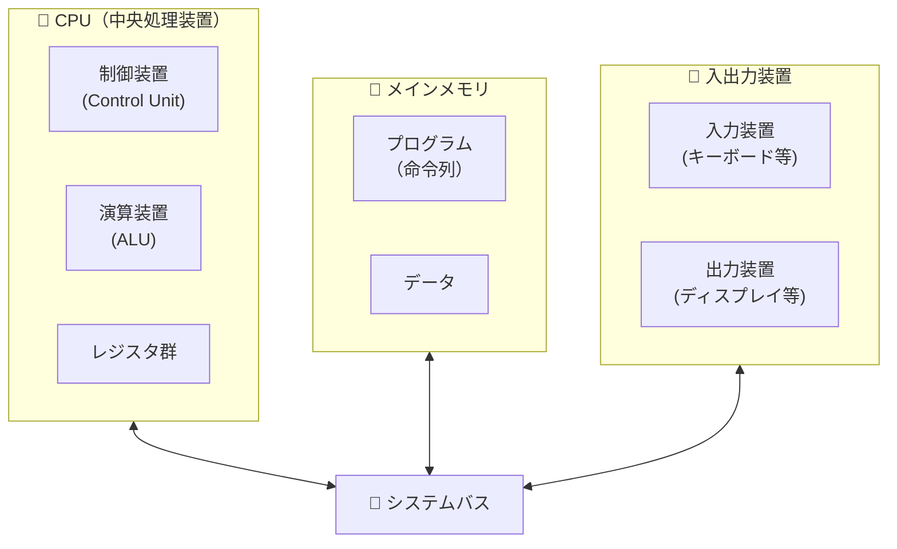

### 主要な特徴

| 特徴 | 説明 |
|------|------|
| **プログラム内蔵方式** | プログラムとデータを同じメモリに格納する |
| **逐次実行** | 命令を1つずつ順番に実行する |
| **二進数表現** | すべての情報を0と1で表現する |

### なぜこれが重要なのか？

フォン・ノイマンアーキテクチャの**逐次実行**という特性が、非同期処理を理解する上で非常に重要です。

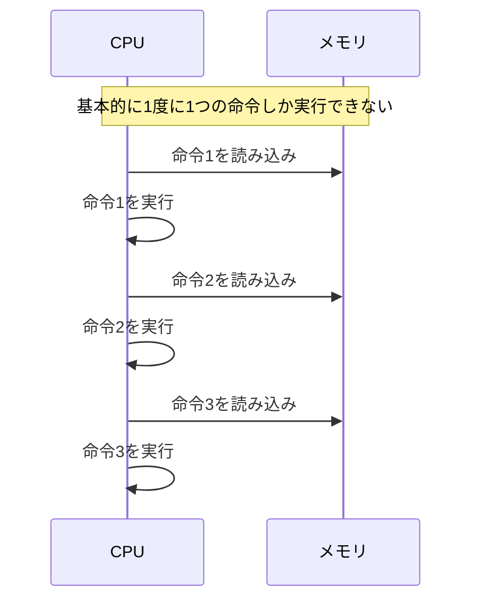

> 💡 **ポイント**: CPUは基本的に「1度に1つのこと」しかできません。これが非同期処理が必要になる根本的な理由の一つです。

---

## 1.2 命令サイクル（フェッチ・デコード・実行）

CPUがプログラムを実行する際、各命令は**命令サイクル**と呼ばれる一連のステップを経ます。

### 命令サイクルの3つのフェーズ

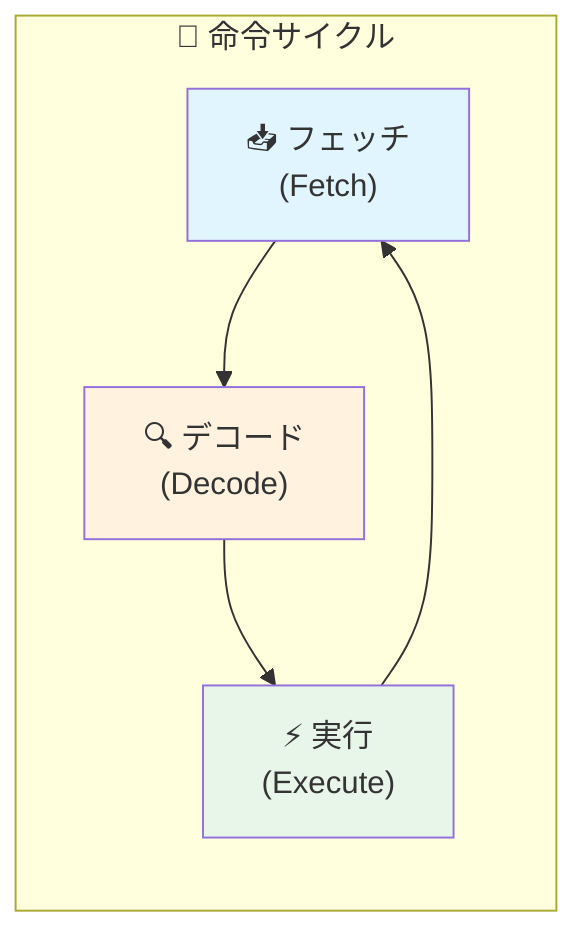

### 各フェーズの詳細

#### 1️⃣ フェッチ（Fetch）- 命令の取得

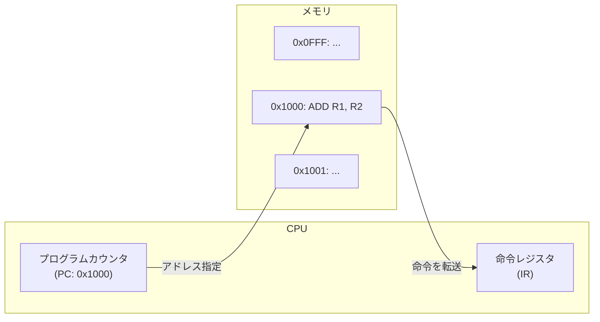

- **プログラムカウンタ（PC）** が次に実行する命令のアドレスを保持
- そのアドレスからメモリの命令を**命令レジスタ（IR）** に読み込む
- PCをインクリメント（次の命令を指すように更新）

#### 2️⃣ デコード（Decode）- 命令の解読

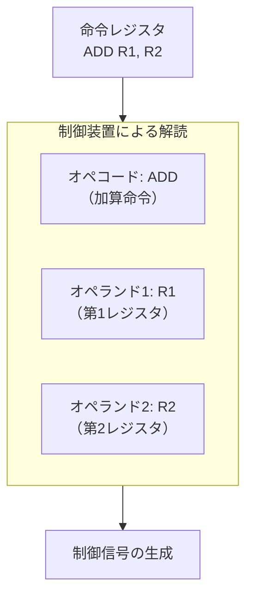

- 命令を**オペコード**（何をするか）と**オペランド**（何に対して）に分解
- 必要な制御信号を生成

#### 3️⃣ 実行（Execute）- 命令の実行

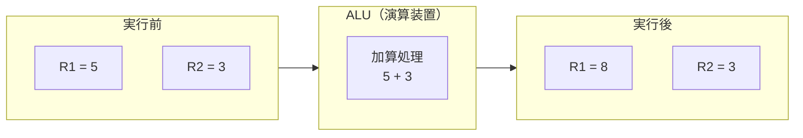

- ALUや他のユニットが実際の処理を実行
- 結果をレジスタやメモリに書き戻す

### 命令サイクルの実行例

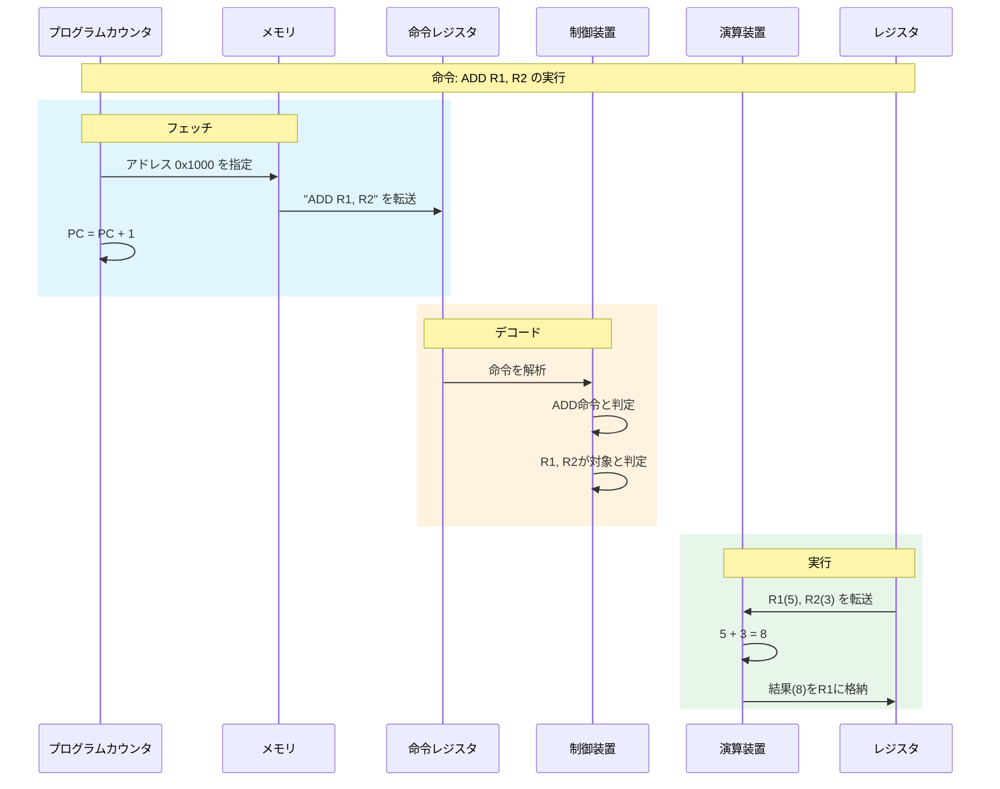

---

## 1.3 レジスタとメモリ

### メモリ階層

コンピュータには複数種類の記憶装置があり、階層構造を形成しています。

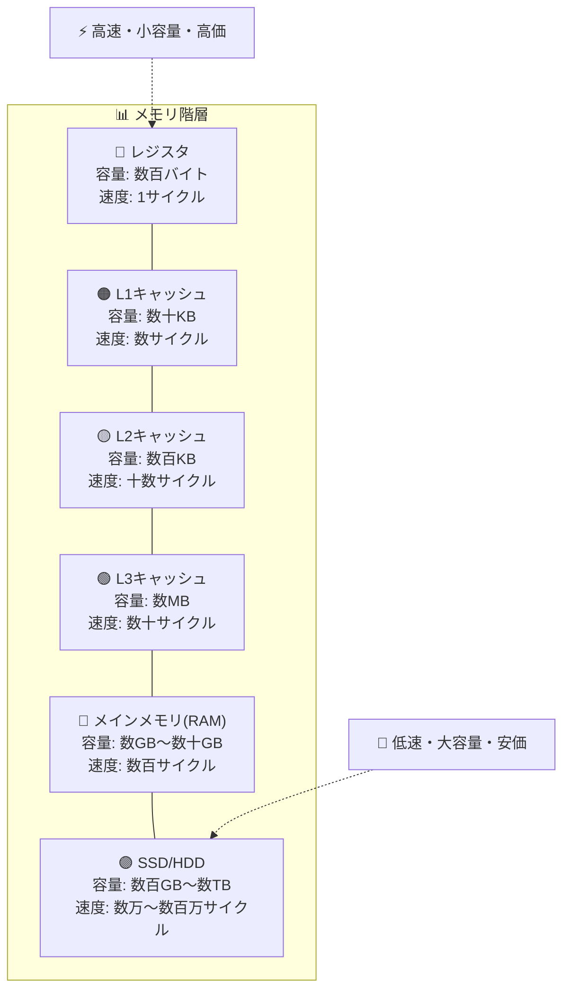

### レジスタの種類

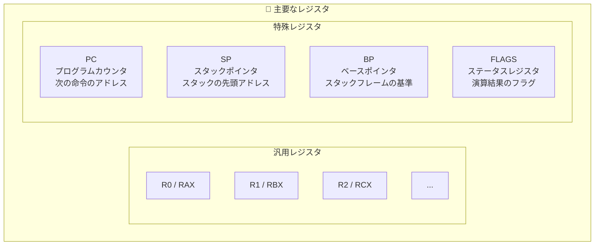

### なぜレジスタが重要か？

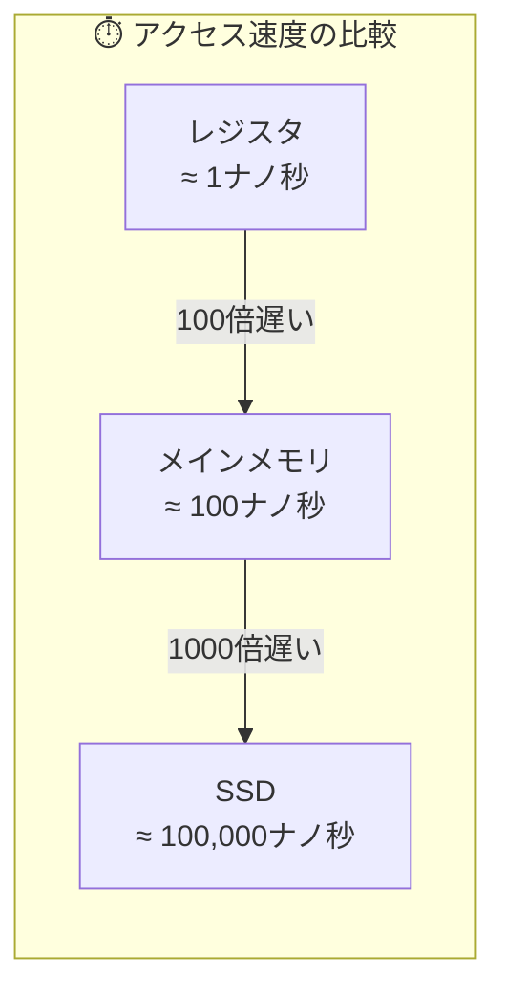

> 💡 **ポイント**: メモリアクセスには時間がかかります。特にストレージ（SSD/HDD）へのアクセスは非常に遅く、これが**I/O待ち**の原因となり、非同期処理の必要性につながります。

---

## 1.4 スタックとヒープ

プログラムが使用するメモリは、主に**スタック**と**ヒープ**という2つの領域に分けられます。

### メモリレイアウト

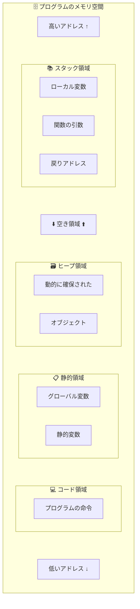

### スタック（Stack）

スタックは**LIFO（Last In, First Out）** 構造で、関数呼び出しに使われます。

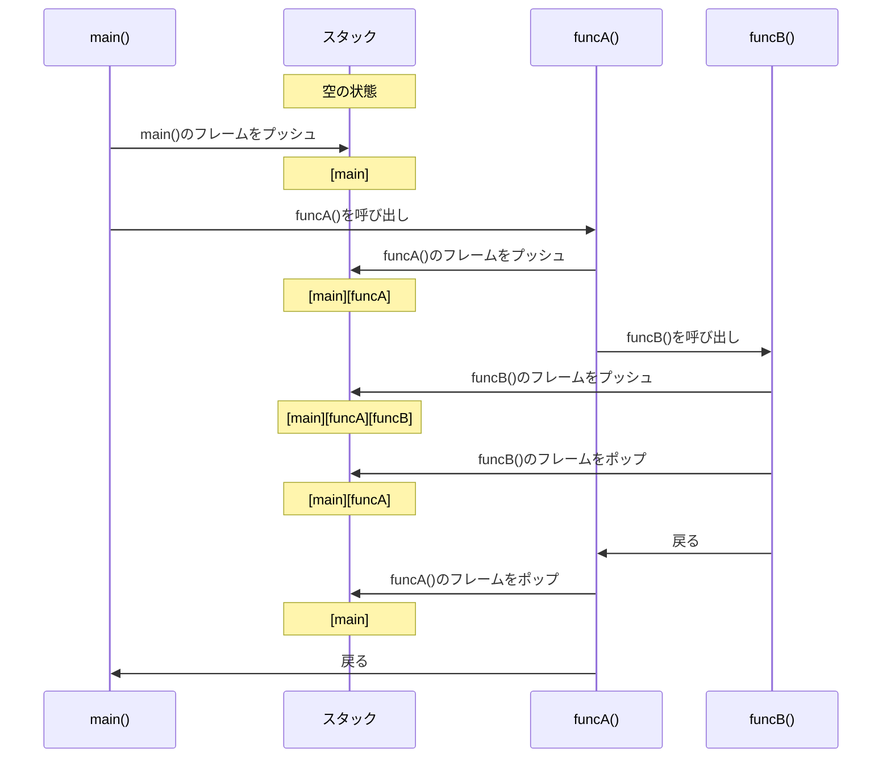

#### スタックフレームの構造

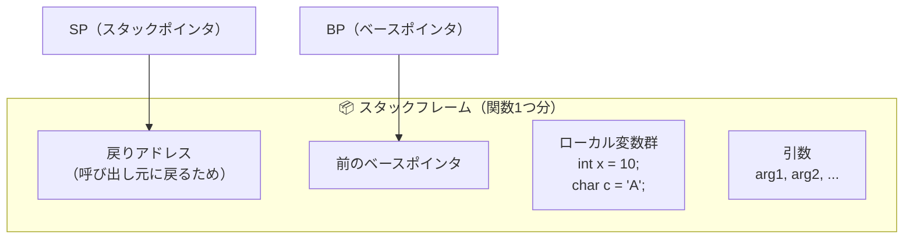

### ヒープ（Heap）

ヒープは**動的メモリ確保**に使われます。

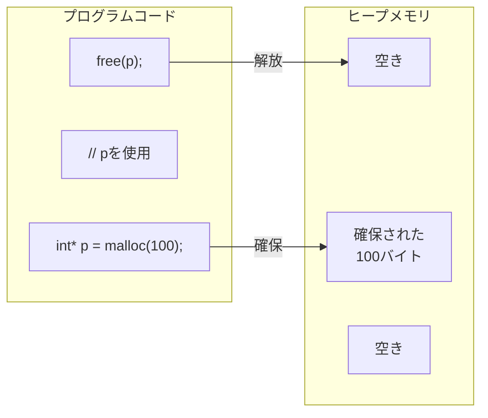

### スタック vs ヒープ

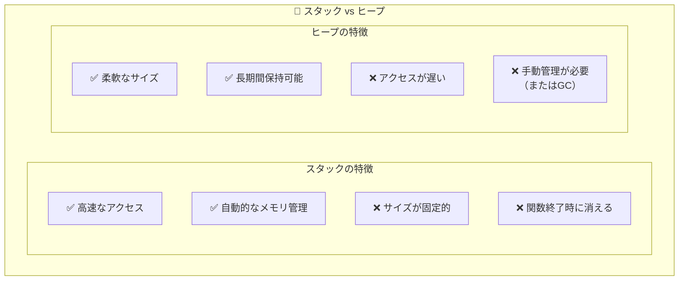

| 特徴 | スタック | ヒープ |
|------|----------|--------|
| 確保速度 | ⚡ 非常に高速 | 🐢 比較的遅い |
| サイズ | 📏 コンパイル時に決定 | 📐 実行時に決定 |
| 管理 | 🤖 自動（スコープベース） | 👨‍💻 手動 or GC |
| 断片化 | ❌ 発生しない | ⚠️ 発生しうる |
| 用途 | ローカル変数、関数呼び出し | 動的データ構造、大きなオブジェクト |

---

## 1.5 まとめ

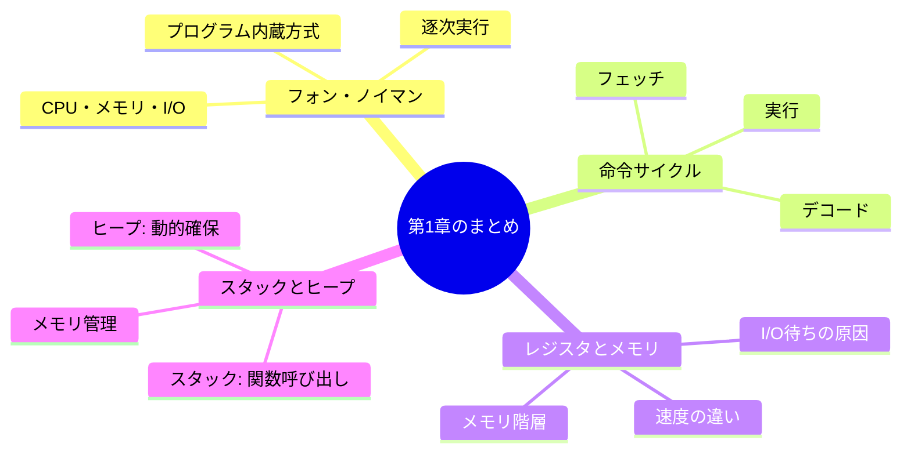

### 重要なポイント

1. **CPUは基本的に1度に1つの命令しか実行できない**
   - これが並行処理・非同期処理が必要になる根本的な理由

2. **メモリアクセスには時間がかかる**
   - 特にストレージへのアクセスは非常に遅い
   - この「待ち時間」を有効活用するのが非同期処理

3. **関数呼び出しはスタックで管理される**
   - この仕組みを理解することで、コールバックやコルーチンの動作が理解できる

---

## 📝 練習問題

1. フォン・ノイマンアーキテクチャの「逐次実行」という特性は、現代のマルチコアCPUでどのように拡張されていますか？

2. レジスタとメインメモリのアクセス速度の違いは約何倍ですか？この違いが非同期処理とどう関係しますか？

3. 再帰関数を呼び出すと、スタックにはどのような影響がありますか？「スタックオーバーフロー」とは何ですか？

---

## 🔗 次の章へ

[第2章: プロセスとスレッド](./02-process-thread.md) では、OSがプログラムをどのように管理・実行するのかを学びます。

---

[← 目次に戻る](../index.md)

