# 第1章: CPUとプログラム実行の仕組み

> 🎯 **この章の目標**: コンピュータがプログラムをどのように実行するのかを理解し、非同期処理を学ぶための土台を築く

---

## 1.1 フォン・ノイマンアーキテクチャ

### コンピュータの設計思想

現代のほとんどのコンピュータは**フォン・ノイマンアーキテクチャ**に基づいています。これは1945年に数学者ジョン・フォン・ノイマンが提唱した設計思想で、それ以前のコンピュータが抱えていた根本的な問題を解決しました。

フォン・ノイマン以前のコンピュータ（例：ENIAC）では、プログラムを変更するたびに物理的な配線を変更する必要がありました。計算内容を変えるには、技術者が何日もかけてケーブルを差し替え、スイッチを設定し直す必要があったのです。これは非常に非効率でした。

フォン・ノイマンの革新的なアイデアは、**プログラム（命令）もデータと同じようにメモリに格納する**というものでした。これにより、プログラムの変更はメモリの内容を書き換えるだけで済むようになり、コンピュータの柔軟性が飛躍的に向上しました。

### 基本構成要素

フォン・ノイマンアーキテクチャは、大きく分けて3つの主要コンポーネントで構成されています。

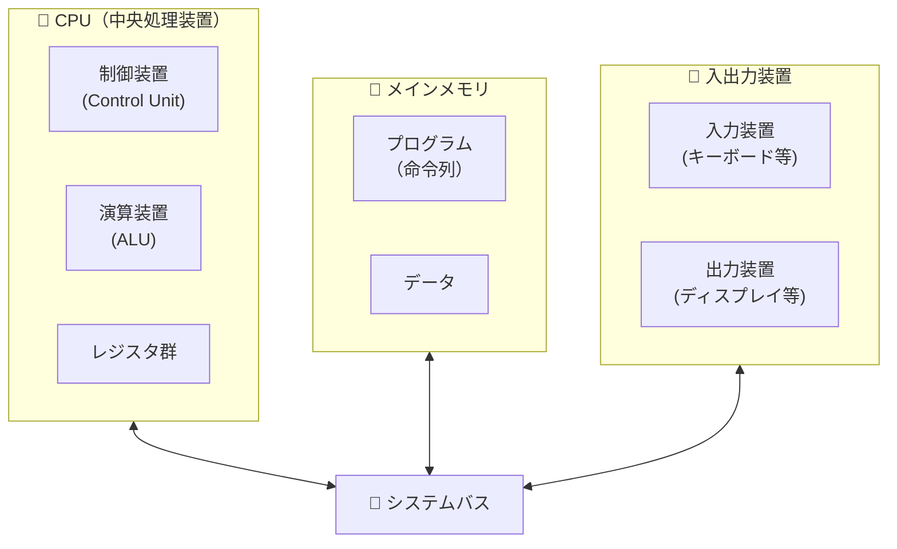

#### CPU（中央処理装置）

CPUはコンピュータの「頭脳」であり、すべての計算と制御を担当します。CPUは以下の3つの主要部分で構成されています。

**制御装置（Control Unit）** は、コンピュータ全体の司令塔です。メモリから命令を取り出し、その命令が何を意味するのかを解釈し、他のコンポーネントに適切な制御信号を送ります。オーケストラの指揮者のように、すべての部品が正しいタイミングで正しい動作をするよう調整します。

**演算装置（ALU: Arithmetic Logic Unit）** は、実際の計算を行う部分です。加算、減算、乗算、除算といった算術演算と、AND、OR、NOTといった論理演算を実行します。CPUが行うすべての「仕事」は、最終的にはALUでの演算に帰着します。

**レジスタ群** は、CPU内部にある超高速の小さなメモリです。現在処理中のデータや、次に実行する命令のアドレスなど、すぐにアクセスが必要な情報を保持します。レジスタへのアクセスは1クロックサイクル（現代のCPUでは約0.3ナノ秒）で完了するため、メインメモリよりも数百倍高速です。

#### メインメモリ

メインメモリ（RAM: Random Access Memory）は、プログラムとデータを一時的に格納する場所です。「一時的」というのは、電源を切るとメモリの内容が消えてしまうためです。

フォン・ノイマンアーキテクチャの特徴的な点は、**プログラムの命令列とプログラムが処理するデータが同じメモリ空間に格納される**ことです。これにより、プログラム自身が自分自身を書き換えることも理論上は可能になります（セキュリティ上の理由から、現代のOSではこれを制限していますが）。

メモリは番地（アドレス）によって管理されます。各アドレスには通常1バイト（8ビット）のデータが格納され、CPUはアドレスを指定することで任意の場所のデータを読み書きできます。

#### 入出力装置

入出力装置（I/Oデバイス）は、コンピュータと外部世界をつなぐインターフェースです。キーボード、マウス、ディスプレイ、ネットワークカード、ストレージデバイス（SSD、HDD）などがこれに含まれます。

重要な点は、**I/O操作はCPUやメモリの処理に比べて桁違いに遅い**ということです。例えば、CPUが1つの命令を実行するのに1ナノ秒かかるとすると、ネットワーク経由でデータを取得するには数ミリ秒から数百ミリ秒かかります。これは100万倍以上の差です。

この速度差こそが、非同期処理が必要になる根本的な理由の一つです。I/O操作の完了を待っている間、CPUは何もせずに待機しているのは非常に無駄です。非同期処理を使えば、I/O待ちの間に他の処理を進めることができます。

### 主要な特徴

| 特徴 | 説明 |
|------|------|
| **プログラム内蔵方式** | プログラムとデータを同じメモリに格納する |
| **逐次実行** | 命令を1つずつ順番に実行する |
| **二進数表現** | すべての情報を0と1で表現する |

### なぜ逐次実行が重要なのか？

フォン・ノイマンアーキテクチャの**逐次実行**という特性は、非同期処理を理解する上で極めて重要です。

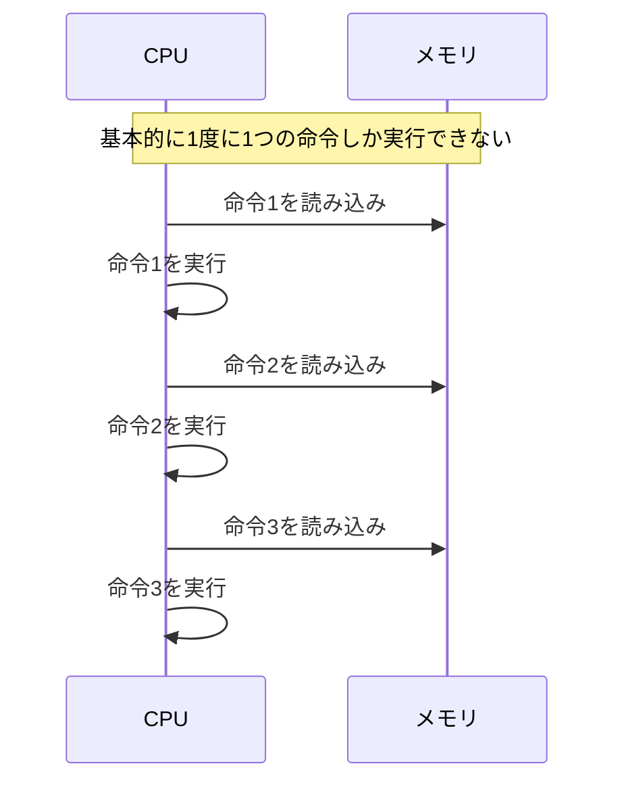

逐次実行とは、CPUが命令を**1つずつ、順番に**実行することを意味します。命令Aが完了するまで、命令Bの実行は始まりません。これは非常にシンプルで理解しやすいモデルですが、重大な制約があります。

例えば、あるプログラムがファイルを読み込む必要があるとします。ファイルの読み込みには100ミリ秒かかるとしましょう。逐次実行のモデルでは、CPUはその100ミリ秒間、**ただ待っているだけ**になります。現代のCPUは1秒間に数十億の命令を実行できるので、100ミリ秒の間に実行できたはずの数億の命令が無駄になってしまいます。

この問題を解決するために、様々な技術が開発されてきました。マルチプロセス、マルチスレッド、そして非同期処理です。これらの技術は、I/O待ちの時間を有効活用し、CPUのリソースを最大限に活用することを目的としています。

> 💡 **ポイント**: CPUは基本的に「1度に1つのこと」しかできません。これが並行処理・非同期処理が必要になる根本的な理由の一つです。待ち時間を無駄にせず、効率的にCPUを使うための工夫が非同期処理なのです。

---

## 1.2 命令サイクル（フェッチ・デコード・実行）

### 命令サイクルとは

CPUがプログラムを実行する際、各命令は**命令サイクル**と呼ばれる一連のステップを経ます。命令サイクルは、CPUの動作の最も基本的な単位であり、すべてのプログラムの実行はこのサイクルの繰り返しです。

命令サイクルは、人間が本を読むプロセスに例えることができます。まず本の特定のページを開き（フェッチ）、書かれている文章を理解し（デコード）、その内容に基づいて行動する（実行）。そして次のページに進んで同じことを繰り返します。

### 命令サイクルの3つのフェーズ

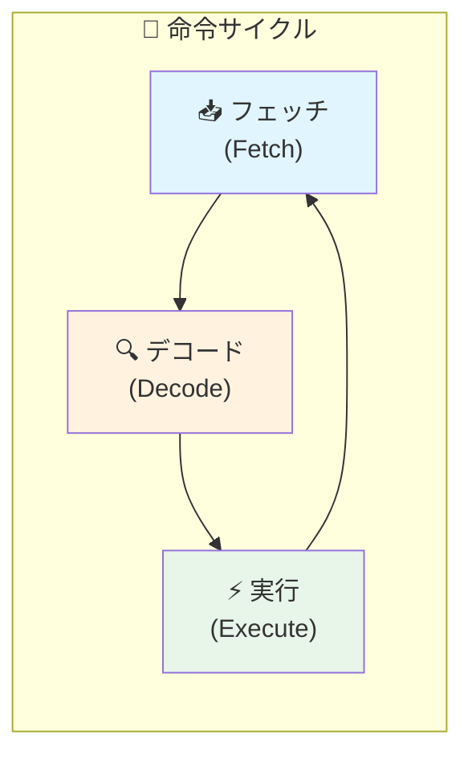

この3つのフェーズは永遠に繰り返されます（電源が切れるか、明示的に停止命令が実行されるまで）。現代のCPUは1秒間に数十億回このサイクルを実行します。

### 各フェーズの詳細

#### 1️⃣ フェッチ（Fetch）- 命令の取得

フェッチフェーズでは、CPUがメモリから次に実行する命令を取得します。

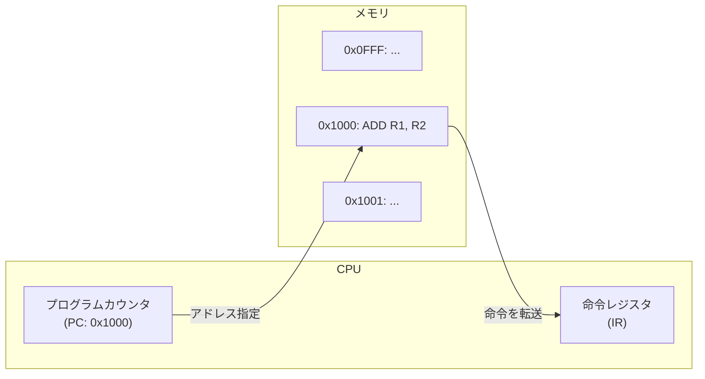

このフェーズでは、2つの重要なレジスタが使用されます。

**プログラムカウンタ（PC）** は、「今どこまで読んだか」を記録するしおりのようなものです。PCには、次に実行する命令が格納されているメモリアドレスが保持されています。CPUはPCが指すアドレスからメモリの内容を読み取ります。

**命令レジスタ（IR）** は、現在実行中の命令を保持するレジスタです。メモリから読み取られた命令はIRにコピーされ、デコードフェーズで解析されます。

フェッチが完了すると、PCは自動的にインクリメントされ、次の命令のアドレスを指すようになります。ただし、ジャンプ命令や分岐命令が実行された場合は、PCは別のアドレスに設定されることがあります。

#### 2️⃣ デコード（Decode）- 命令の解読

デコードフェーズでは、制御装置が命令レジスタの内容を解析し、その命令が何を意味するのかを解読します。

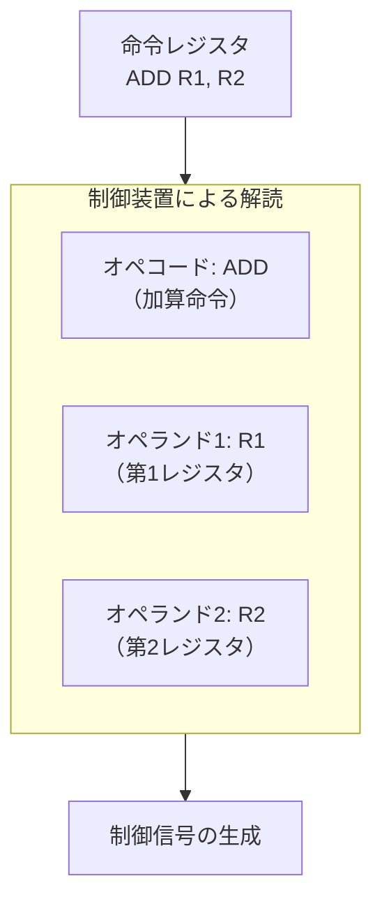

機械語の命令は、通常2つの部分で構成されています。

**オペコード（Opcode）** は、「何をするか」を指定する部分です。ADD（加算）、SUB（減算）、MOV（データ移動）、JMP（ジャンプ）などの操作の種類を示します。

**オペランド（Operand）** は、「何に対して」操作を行うかを指定する部分です。レジスタ番号、メモリアドレス、即値（定数）などが含まれます。

制御装置は命令を解読した後、CPUの各部分に対して適切な制御信号を生成します。例えば、ADD命令の場合、「ALUに加算を行わせる」「結果をR1に格納する」といった信号が生成されます。

#### 3️⃣ 実行（Execute）- 命令の実行

実行フェーズでは、デコードで生成された制御信号に基づいて、実際の処理が行われます。

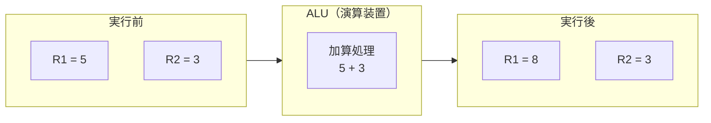

実行フェーズで行われる処理は、命令の種類によって異なります。

**算術・論理演算命令**（ADD、SUB、AND、ORなど）の場合、ALUがレジスタやメモリからデータを受け取り、計算を行い、結果を指定された場所に格納します。

**データ転送命令**（MOV、LOADなど）の場合、レジスタ間、またはレジスタとメモリ間でデータがコピーされます。

**制御命令**（JMP、CALL、RETなど）の場合、プログラムカウンタが変更され、プログラムの実行フローが変わります。条件分岐命令では、特定の条件（例：計算結果がゼロかどうか）に基づいて分岐が行われます。

**I/O命令** の場合、外部デバイスとのデータのやり取りが開始されます。ここで重要なのは、I/O操作はCPUの処理に比べて非常に遅いという点です。

### 命令サイクルの実行例

以下は、「ADD R1, R2」（R1とR2の内容を加算し、結果をR1に格納する）という命令が実行される様子を示しています。

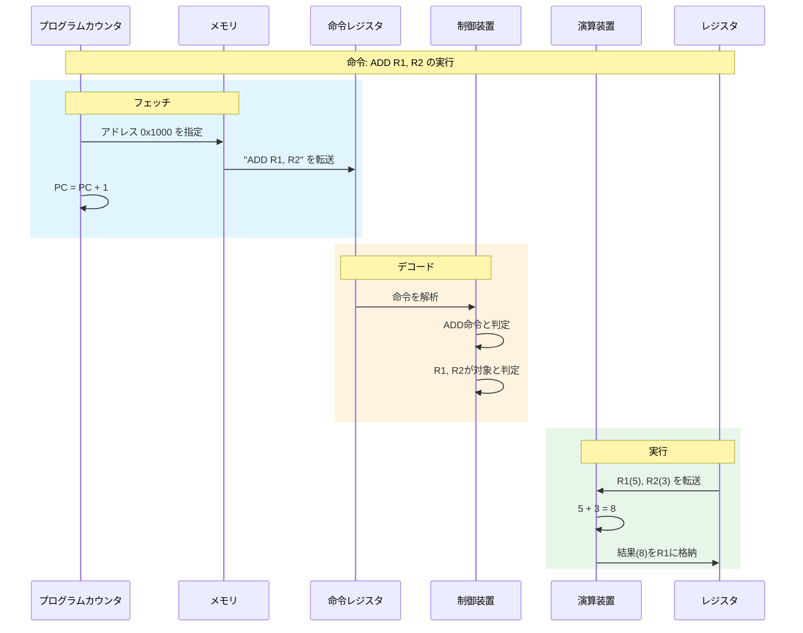

### パイプライン処理

現代のCPUでは、**パイプライン処理**という技術を使って命令サイクルを高速化しています。これは、複数の命令を同時に異なるフェーズで処理する技術です。

工場の組立ラインを想像してください。1台の車が完成するまで次の車の組立を始めないのは非効率です。実際の工場では、1台目の車が塗装工程にいる間に、2台目の車はエンジン組立、3台目はボディ溶接というように、複数の車が同時に異なる工程を進んでいます。

CPUのパイプラインも同様です。命令1が実行フェーズにいる間に、命令2はデコードフェーズ、命令3はフェッチフェーズを進めることができます。これにより、個々の命令の実行時間は変わらなくても、単位時間あたりに完了できる命令数（スループット）は大幅に向上します。

ただし、パイプラインには**ハザード**と呼ばれる問題があります。例えば、命令2が命令1の結果を必要とする場合、命令1の実行が完了するまで命令2を進めることができません。これを**データハザード**といいます。CPUはこのような状況を検出し、適切に対処する必要があります。

---

## 1.3 レジスタとメモリ

### メモリ階層の必要性

コンピュータの設計において、メモリは常にトレードオフの問題を抱えています。**高速なメモリは高価で容量が小さく、大容量のメモリは安価だが低速**という関係があります。

理想的には、すべてのデータを最高速のメモリ（レジスタ）に置きたいところですが、コストと物理的な制約からそれは不可能です。そこで、現代のコンピュータは**メモリ階層**という構造を採用しています。

### メモリ階層の構造

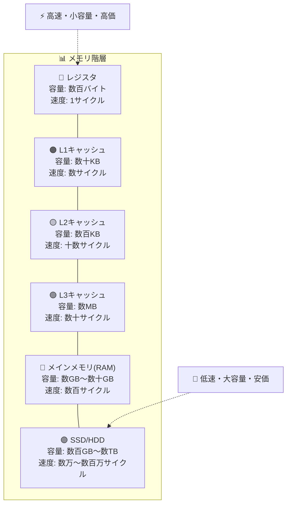

この階層構造がうまく機能するのは、**局所性の原理（Principle of Locality）** のおかげです。

**時間的局所性**とは、一度アクセスされたデータは近い将来再びアクセスされる可能性が高いという性質です。例えば、ループ内で使用される変数は何度も参照されます。

**空間的局所性**とは、あるアドレスにアクセスした場合、その近くのアドレスも近い将来アクセスされる可能性が高いという性質です。例えば、配列の要素は連続したメモリに配置されており、1つの要素にアクセスすると次の要素にもアクセスすることが多いです。

キャッシュメモリは、この局所性を利用して、最近使用されたデータや、その近くにあるデータを高速なメモリに保持します。CPUがデータを要求したとき、まずキャッシュを確認し、見つかれば（キャッシュヒット）高速にアクセスできます。見つからなければ（キャッシュミス）、より低速な階層からデータを取得し、同時にキャッシュにコピーします。

### レジスタの詳細

レジスタはCPU内部にある最も高速なメモリです。現代のx86-64アーキテクチャでは、各レジスタは64ビット（8バイト）のデータを格納できます。

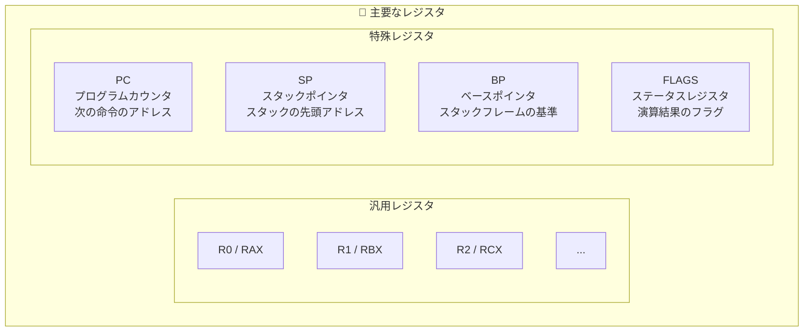

#### 汎用レジスタ

汎用レジスタは、プログラムが自由に使用できるレジスタです。計算の中間結果、関数の引数、戻り値などを格納するために使用されます。

x86-64アーキテクチャでは、16個の汎用レジスタ（RAX、RBX、RCX、RDX、RSI、RDI、R8〜R15など）があります。コンパイラは、頻繁に使用される変数をレジスタに割り当てることで、プログラムの実行速度を向上させます。

#### 特殊レジスタ

**プログラムカウンタ（PC）** は、次に実行する命令のメモリアドレスを保持します。x86アーキテクチャでは「命令ポインタ（IP）」と呼ばれます。通常は命令の実行ごとに自動的にインクリメントされますが、ジャンプ命令や関数呼び出しによって変更されることもあります。

**スタックポインタ（SP）** は、現在のスタックのトップ（最後に追加されたデータ）のアドレスを指します。関数呼び出しやローカル変数の確保により、SPの値は動的に変化します。

**ベースポインタ（BP）** は、現在の関数のスタックフレームの基準点を指します。ローカル変数や引数へのアクセスは、通常BPからの相対アドレスとして表現されます。これにより、SPが変化してもローカル変数への参照が一貫した方法で行えます。

**フラグレジスタ（FLAGS）** は、直前の演算結果に関する情報をビット単位で格納します。例えば、ゼロフラグ（ZF）は直前の演算結果がゼロだったかどうかを示し、キャリーフラグ（CF）は桁上がりや桁借りが発生したかどうかを示します。条件分岐命令は、これらのフラグを参照して分岐先を決定します。

### アクセス速度の比較

各メモリ階層のアクセス速度を人間の時間感覚に置き換えてみましょう。レジスタへのアクセスを1秒とすると：

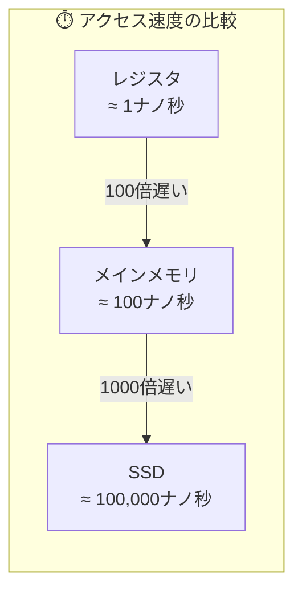

| メモリ種別 | 実際のアクセス時間 | 人間の時間感覚に換算 |
|-----------|------------------|-------------------|
| レジスタ | 約0.3ナノ秒 | 1秒 |
| L1キャッシュ | 約1ナノ秒 | 3秒 |
| L2キャッシュ | 約4ナノ秒 | 13秒 |
| L3キャッシュ | 約12ナノ秒 | 40秒 |
| メインメモリ | 約100ナノ秒 | 5分半 |
| SSD | 約100マイクロ秒 | 4日 |
| HDD | 約10ミリ秒 | 1年以上 |
| ネットワーク | 数ミリ秒〜数百ミリ秒 | 数年〜数十年 |

この表を見ると、なぜI/O操作が「遅い」と言われるのかが実感できるでしょう。CPUにとって、SSDからデータを読み込むのを待つことは、人間にとって数日間何もせずに待っているようなものです。

> 💡 **ポイント**: メモリアクセスには時間がかかります。特にストレージ（SSD/HDD）やネットワークへのアクセスは非常に遅く、これが**I/O待ち**の原因となり、非同期処理の必要性につながります。CPUの貴重な処理時間をI/O待ちで浪費しないために、非同期処理が必要なのです。

---

## 1.4 スタックとヒープ

### プログラムのメモリ空間

オペレーティングシステムは、各プログラムに独自のメモリ空間を割り当てます。このメモリ空間は、いくつかの領域に分割されています。それぞれの領域には異なる目的と特性があります。

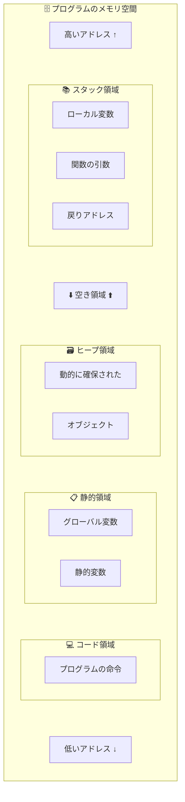

**コード領域**（テキスト領域とも呼ばれる）には、プログラムの実行可能な命令が格納されます。この領域は通常、読み取り専用に設定され、プログラムの実行中に変更されることはありません。

**静的領域**（データ領域）には、グローバル変数と静的変数が格納されます。これらの変数はプログラムの開始時に確保され、プログラムの終了まで存在し続けます。

**ヒープ領域**は、プログラムが実行中に動的に確保するメモリの領域です。`malloc()`（C言語）、`new`（C++/Java）、オブジェクトの作成（Python/JavaScript）などで使用されます。

**スタック領域**は、関数の呼び出しに関連するデータ（ローカル変数、引数、戻りアドレスなど）を格納します。

スタックとヒープは空き領域を挟んで反対方向から伸びていきます。スタックは高いアドレスから低いアドレスに向かって成長し、ヒープは低いアドレスから高いアドレスに向かって成長します。両者が衝突すると、メモリ不足エラーが発生します。

### スタック（Stack）の詳細

スタックは**LIFO（Last In, First Out：後入れ先出し）** 構造のデータ構造です。最後に追加されたデータが最初に取り出されます。積み重ねた皿を想像してください。新しい皿は一番上に置かれ、取り出すときも一番上から取ります。

スタックは主に**関数呼び出しの管理**に使用されます。関数が呼び出されると、その関数のための「スタックフレーム」がスタックにプッシュ（追加）されます。関数から戻ると、そのフレームはポップ（削除）されます。

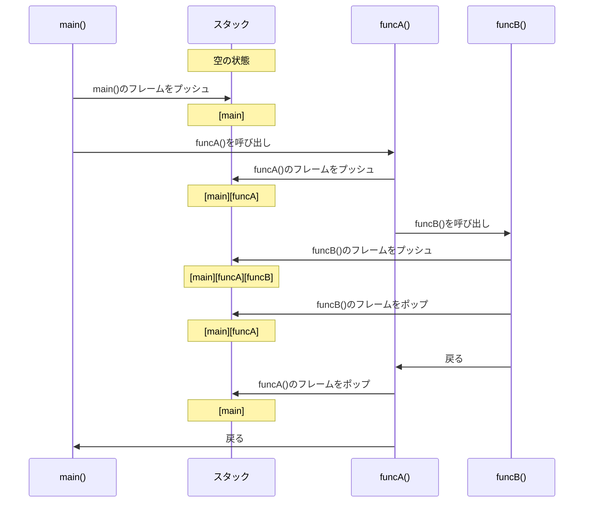

#### スタックフレームの構造

各関数呼び出しに対して、スタックには「スタックフレーム」（または「アクティベーションレコード」）と呼ばれる領域が確保されます。

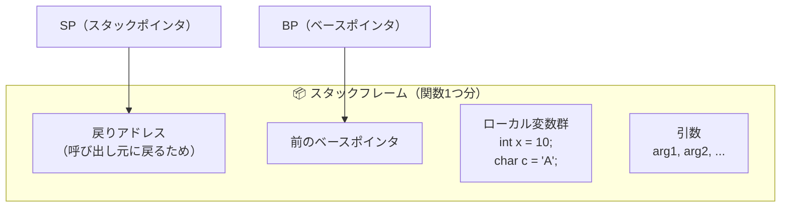

スタックフレームには以下の情報が含まれます：

**引数**: 関数に渡された引数の値。呼び出し規約によっては、一部の引数はレジスタ経由で渡されることもあります。

**戻りアドレス**: 関数から戻った後に実行を再開すべき命令のアドレス。関数が終了すると、プログラムカウンタにこの値が設定されます。

**保存されたベースポインタ**: 呼び出し元のスタックフレームの基準点。これにより、関数から戻ったときに元のスタックフレームを復元できます。

**ローカル変数**: 関数内で宣言された変数。これらは関数が実行されている間だけ存在し、関数から戻ると自動的に破棄されます。

#### スタックオーバーフロー

スタックには限られたサイズがあります（通常1MB〜8MB程度）。再帰関数が深くなりすぎたり、巨大なローカル変数を確保したりすると、スタックの限界を超えてしまうことがあります。これを**スタックオーバーフロー**といいます。

```c
// スタックオーバーフローを起こす例（無限再帰）
void infinite_recursion() {
    int large_array[10000];  // ローカル変数（スタックに確保）
    infinite_recursion();     // 終了条件なしで自分自身を呼び出す
}
```

スタックオーバーフローが発生すると、プログラムはクラッシュします。これは、スタックがヒープ領域や他の重要なメモリ領域を侵食してしまうのを防ぐためです。

### ヒープ（Heap）の詳細

ヒープは**動的メモリ確保**のための領域です。プログラムの実行中に、必要に応じてメモリを確保したり解放したりできます。

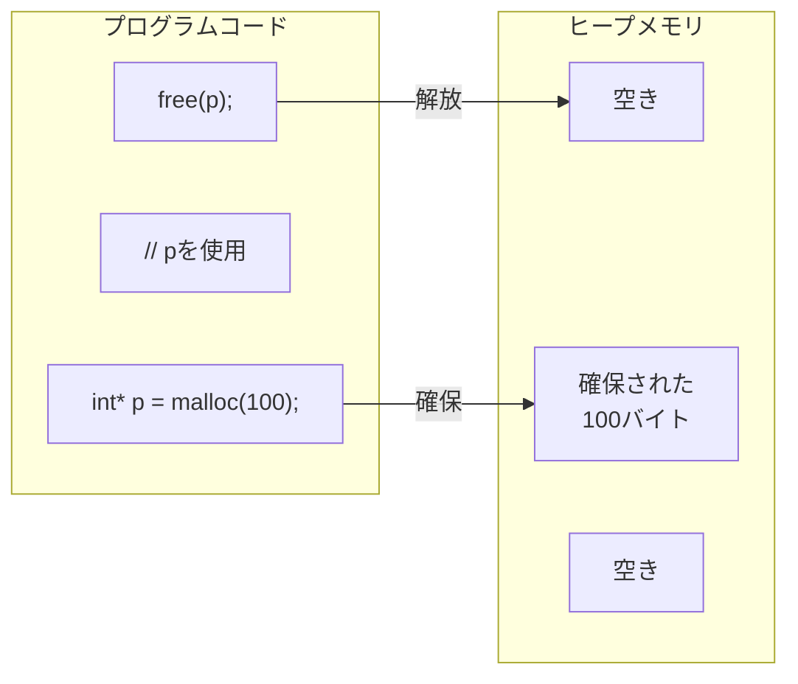

ヒープメモリは以下のような場面で使用されます：

**サイズが実行時まで分からないデータ**: ユーザー入力やファイルからのデータなど、コンパイル時にサイズが確定しないデータを格納する場合。

**関数を超えて存在する必要があるデータ**: ローカル変数は関数終了時に破棄されますが、ヒープに確保したデータは明示的に解放するまで存在し続けます。

**大きなデータ**: スタックのサイズには制限があるため、大きなデータ構造はヒープに確保します。

#### メモリ管理の責任

ヒープメモリの管理には注意が必要です。C言語のような低レベル言語では、プログラマが明示的にメモリを解放する責任があります。

**メモリリーク**: 確保したメモリを解放し忘れると、そのメモリは二度と使用できなくなります。長時間動作するプログラムでメモリリークがあると、最終的にはメモリ不足でクラッシュします。

**ダングリングポインタ**: 解放済みのメモリを参照し続けると、未定義の動作を引き起こします。そのメモリ領域が別の用途に再利用されている可能性があるためです。

**二重解放**: 同じメモリを2回解放すると、メモリ管理システムが破壊され、クラッシュやセキュリティ脆弱性の原因になります。

これらの問題を防ぐため、多くの現代的な言語（Java、Python、JavaScript、Go、C#など）は**ガベージコレクション（GC）** を採用しています。GCは使用されなくなったメモリを自動的に検出して解放します。

Rustは別のアプローチを取り、**所有権システム**によってコンパイル時にメモリ管理の問題を検出します。これにより、GCのオーバーヘッドなしに安全なメモリ管理を実現しています。

### スタック vs ヒープの比較

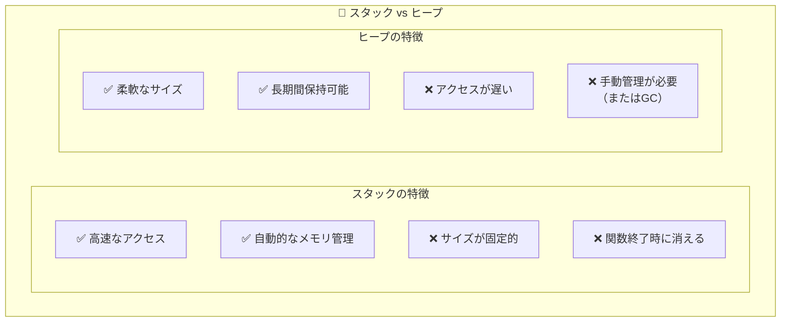

| 特徴 | スタック | ヒープ |
|------|----------|--------|
| 確保速度 | ⚡ 非常に高速（SPの移動のみ） | 🐢 比較的遅い（空き領域の検索が必要） |
| サイズ | 📏 コンパイル時に決定 | 📐 実行時に決定可能 |
| 管理 | 🤖 自動（スコープベース） | 👨‍💻 手動 or GC |
| 断片化 | ❌ 発生しない | ⚠️ 発生しうる |
| サイズ制限 | 📏 比較的小さい（1-8MB程度） | 📐 利用可能メモリまで |
| 用途 | ローカル変数、関数呼び出し | 動的データ構造、大きなオブジェクト |
| ライフタイム | 関数スコープに限定 | 明示的に解放するまで |

### 非同期処理との関連

スタックの仕組みを理解することは、非同期処理を理解する上で非常に重要です。

従来の同期的な関数呼び出しでは、関数Aが関数Bを呼び出すと、関数Bが完了するまで関数Aの実行は中断されます。スタックには関数Aのフレームの上に関数Bのフレームが積まれ、関数Bが戻ると関数Aの実行が再開されます。

しかし、非同期処理では事情が異なります。非同期関数がI/O操作を開始した後、その完了を待たずに呼び出し元に制御を戻すことがあります。この場合、関数の状態（ローカル変数など）をスタックではなく別の場所（ヒープ上のデータ構造など）に保存する必要があります。

これが、非同期処理が「コルーチン」や「ステートマシン」といった概念と密接に関連している理由です。詳細は後の章で説明します。

---

## 1.5 まとめ

この章では、コンピュータがプログラムを実行する基本的な仕組みを学びました。これらの概念は、非同期処理を理解するための土台となります。

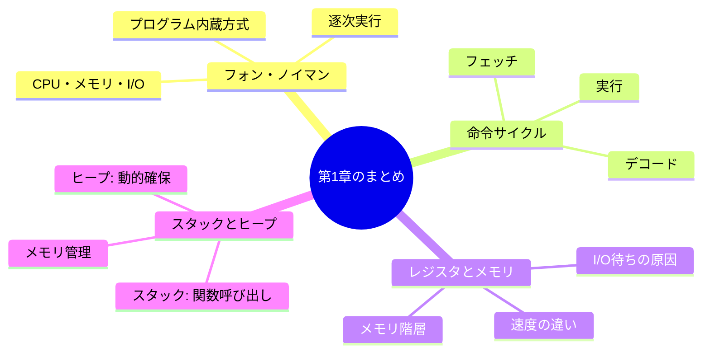

### 重要なポイント

#### 1. CPUは基本的に1度に1つの命令しか実行できない

フォン・ノイマンアーキテクチャの基本原理である逐次実行は、シンプルで理解しやすいモデルですが、I/O待ちなどの「待ち時間」が発生すると、CPUのリソースが無駄になります。

これが並行処理・非同期処理が必要になる根本的な理由です。I/O操作の完了を待っている間に、他の処理を進めることができれば、CPUのリソースを有効活用できます。

#### 2. メモリアクセスには時間がかかる

メモリ階層の各レベルには、大きな速度差があります。レジスタへのアクセスは1ナノ秒未満ですが、ネットワーク経由のデータ取得には数ミリ秒から数百ミリ秒かかることもあります。

この「待ち時間」を有効活用するのが非同期処理の本質です。I/O操作が完了するのを待っている間、CPUは他の処理を行うことができます。

#### 3. 関数呼び出しはスタックで管理される

スタックを使った関数呼び出しの仕組みを理解することで、なぜ非同期処理が従来の同期処理とは異なるアプローチを必要とするのかが理解できます。

非同期処理では、関数の状態を保存・復元するために、スタック以外の仕組み（コルーチン、ステートマシンなど）が使われます。

---

## 📝 練習問題

1. **フォン・ノイマンアーキテクチャの「逐次実行」という特性は、現代のマルチコアCPUでどのように拡張されていますか？**
   
   ヒント：各コアは独立して命令を実行できますが、メモリは共有されています。これにはどのような利点と課題がありますか？

2. **レジスタとメインメモリのアクセス速度の違いは約何倍ですか？この違いが非同期処理とどう関係しますか？**
   
   ヒント：I/O操作（ネットワーク、ディスク）のアクセス速度も考慮に入れてください。

3. **再帰関数を呼び出すと、スタックにはどのような影響がありますか？「スタックオーバーフロー」とは何ですか？**
   
   ヒント：再帰呼び出しのたびに何が起こるか、そしてそれにはどのような制限があるかを考えてください。

4. **なぜ多くの現代的なプログラミング言語はガベージコレクションを採用しているのですか？また、ガベージコレクションにはどのようなトレードオフがありますか？**
   
   ヒント：開発者の生産性、安全性、パフォーマンスのバランスを考えてください。

5. **Webサーバーがクライアントからのリクエストを処理するとき、データベースへのクエリ中にCPUは何をしていますか？これを改善するにはどうすればよいですか？**
   
   ヒント：この章で学んだ「待ち時間」の概念を応用してください。

---

## 🔗 次の章へ

[第2章: プロセスとスレッド](./02-process-thread.md) では、オペレーティングシステムがプログラムをどのように管理・実行するのかを学びます。プロセスとスレッドの違い、コンテキストスイッチの仕組み、そしてそれらが非同期処理とどのように関係するのかを探ります。

---

[← 目次に戻る](../index.md)
