# 第2章: プロセスとスレッド

> 🎯 **この章の目標**: オペレーティングシステムがプログラムをどのように管理・実行するのかを理解し、並行処理の基盤となる概念を習得する

---

## 2.1 プロセスとは何か

### プログラムとプロセスの違い

「プログラム」と「プロセス」は日常的に混同されがちですが、コンピュータサイエンスでは明確に区別される概念です。

**プログラム**は、ディスク上に保存された実行可能なファイルです。コンパイル済みの機械語コードや、インタプリタ言語のソースコードなど、静的なデータの集合です。プログラムそのものは「動いて」いません。レシピ本のレシピのようなもので、それ自体は何も調理しません。

**プロセス**は、プログラムが実行されているインスタンスです。プログラムをメモリに読み込み、CPUが命令を実行している状態を指します。同じプログラムから複数のプロセスを起動することもできます（例：複数のブラウザウィンドウ、複数のテキストエディタ）。レシピに従って実際に調理を行っている状態がプロセスに相当します。

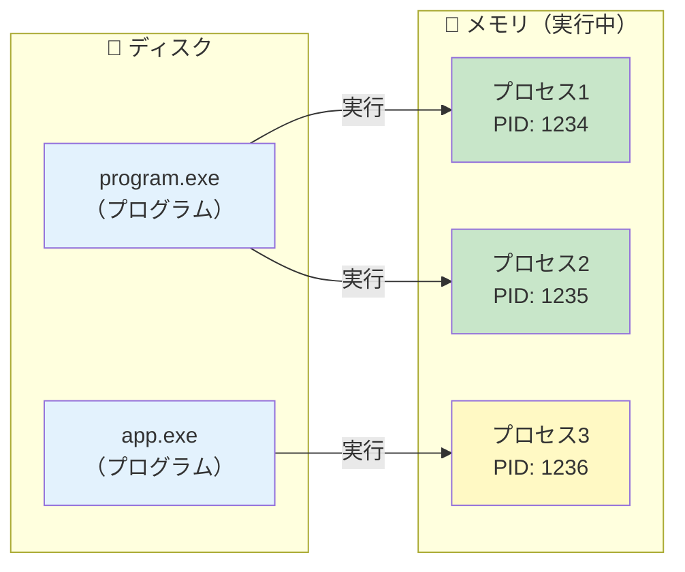
```mermaid
flowchart LR
    subgraph DISK["💾 ディスク"]
        PROG1["program.exe\n（プログラム）"]
        PROG2["app.exe\n（プログラム）"]
    end
    
    subgraph RAM["🧠 メモリ（実行中）"]
        PROC1["プロセス1\nPID: 1234"]
        PROC2["プロセス2\nPID: 1235"]
        PROC3["プロセス3\nPID: 1236"]
    end
    
    PROG1 -->|"実行"| PROC1
    PROG1 -->|"実行"| PROC2
    PROG2 -->|"実行"| PROC3
    
    style PROG1 fill:#e3f2fd
    style PROG2 fill:#e3f2fd
    style PROC1 fill:#c8e6c9
    style PROC2 fill:#c8e6c9
    style PROC3 fill:#fff9c4
```

この図では、`program.exe`という1つのプログラムから2つのプロセス（PID 1234とPID 1235）が作成されています。各プロセスは独立しており、一方がクラッシュしても他方には影響しません。

### プロセスの構成要素

オペレーティングシステムは、各プロセスに対して様々なリソースを割り当てます。プロセスは単なるコードの実行以上のものを含んでいます。

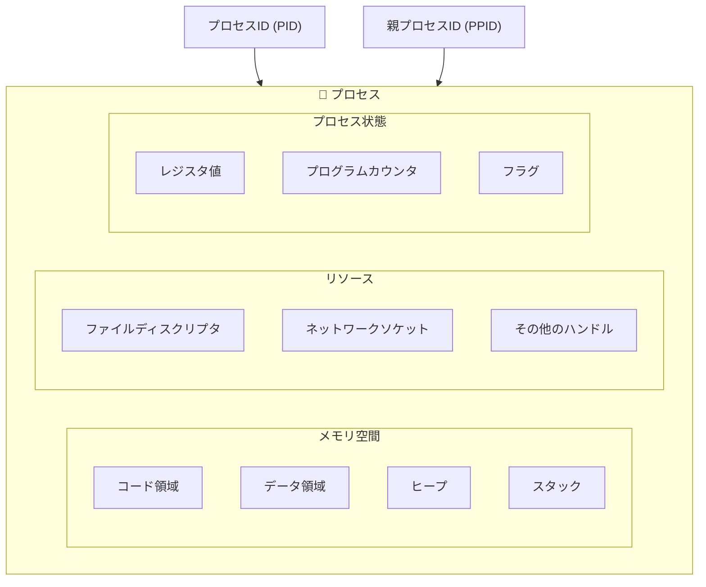
```mermaid
flowchart TB
    subgraph PROCESS["🔲 プロセス"]
        subgraph MEMORY["メモリ空間"]
            CODE["コード領域"]
            DATA["データ領域"]
            HEAP["ヒープ"]
            STACK["スタック"]
        end
        
        subgraph RESOURCES["リソース"]
            FD["ファイルディスクリプタ"]
            SOCK["ネットワークソケット"]
            HANDLE["その他のハンドル"]
        end
        
        subgraph STATE["プロセス状態"]
            REG["レジスタ値"]
            PC["プログラムカウンタ"]
            FLAGS["フラグ"]
        end
    end
    
    PID["プロセスID (PID)"] --> PROCESS
    PPID["親プロセスID (PPID)"] --> PROCESS
```

#### メモリ空間

各プロセスは独自の**仮想メモリ空間**を持ちます。これは第1章で学んだメモリレイアウト（コード領域、データ領域、ヒープ、スタック）を含みます。

重要な点は、各プロセスのメモリ空間は**他のプロセスから完全に隔離されている**ということです。プロセスAがアドレス0x1000にアクセスしても、プロセスBのアドレス0x1000とは全く別の物理メモリを参照します。この隔離により、あるプロセスのバグや悪意のあるコードが他のプロセスに影響を与えることを防いでいます。

#### ファイルディスクリプタとリソース

プロセスは、開いているファイル、ネットワーク接続、パイプなどの**リソースへのハンドル**を持ちます。Unix系システムでは、これらは「ファイルディスクリプタ」という整数値で管理されます。

例えば、プロセスが`open("/path/to/file")`を呼び出すと、OSはファイルを開き、そのファイルを識別するためのファイルディスクリプタ（例：3）を返します。以降、プロセスはこの番号を使ってファイルを読み書きします。

標準入力（stdin）、標準出力（stdout）、標準エラー（stderr）は、すべてのプロセスに自動的に割り当てられる特別なファイルディスクリプタで、それぞれ0、1、2が割り当てられます。

#### プロセスの状態情報

OSは各プロセスの実行状態を追跡しています。これには、CPUレジスタの値、プログラムカウンタの値、スタックポインタなどが含まれます。これらの情報は、プロセスの実行を一時停止し、後で再開するために必要です。

### プロセス制御ブロック（PCB）

オペレーティングシステムは、各プロセスの情報を**プロセス制御ブロック（PCB: Process Control Block）** と呼ばれるデータ構造で管理しています。

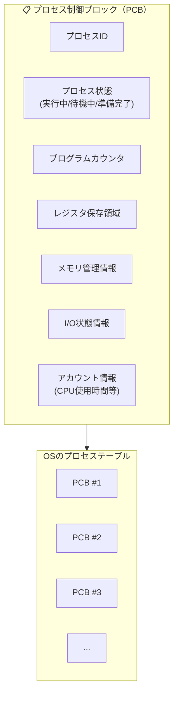
```mermaid
flowchart TB
    subgraph PCB["📋 プロセス制御ブロック（PCB）"]
        PID["プロセスID"]
        STATE["プロセス状態<br/>(実行中/待機中/準備完了)"]
        PC["プログラムカウンタ"]
        REGS["レジスタ保存領域"]
        MEM_INFO["メモリ管理情報"]
        IO_INFO["I/O状態情報"]
        ACCOUNT["アカウント情報<br/>(CPU使用時間等)"]
    end
    
    subgraph PCB_TABLE["OSのプロセステーブル"]
        PCB1["PCB #1"]
        PCB2["PCB #2"]
        PCB3["PCB #3"]
        PCBn["..."]
    end
    
    PCB --> PCB_TABLE
```

PCBには以下のような情報が含まれます：

| フィールド | 説明 |
|-----------|------|
| プロセスID（PID） | プロセスを一意に識別する番号 |
| プロセス状態 | 実行中、待機中、準備完了などの状態 |
| プログラムカウンタ | 次に実行する命令のアドレス |
| CPUレジスタ | すべてのレジスタの保存値 |
| メモリ管理情報 | ページテーブル、セグメントテーブルなど |
| I/O状態情報 | 開いているファイル、デバイスなど |
| スケジューリング情報 | 優先度、スケジューリングキューへのポインタ |

OSがプロセスを切り替える際、現在のプロセスのCPU状態をそのPCBに保存し、次に実行するプロセスのPCBからCPU状態を復元します。

### プロセスの状態遷移

プロセスは、そのライフサイクルの中でいくつかの状態を遷移します。

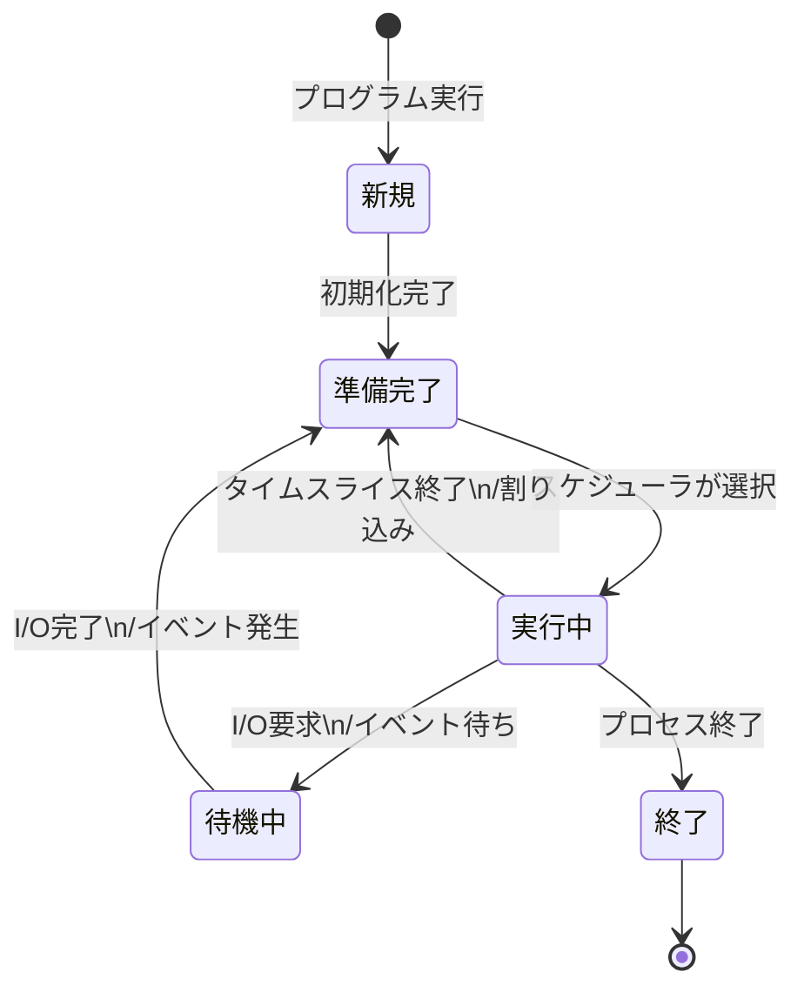
```mermaid
stateDiagram-v2
    [*] --> 新規: プログラム実行
    新規 --> 準備完了: 初期化完了
    準備完了 --> 実行中: スケジューラが選択
    実行中 --> 準備完了: タイムスライス終了\n/割り込み
    実行中 --> 待機中: I/O要求\n/イベント待ち
    待機中 --> 準備完了: I/O完了\n/イベント発生
    実行中 --> 終了: プロセス終了
    終了 --> [*]
```

各状態の詳細：

**新規（New）**: プロセスが作成されたばかりの状態。OSはプロセスに必要なリソースを割り当てています。

**準備完了（Ready）**: プロセスは実行可能な状態ですが、CPUが他のプロセスを実行しているため、待機しています。「準備完了キュー」に入れられ、スケジューラによる選択を待ちます。

**実行中（Running）**: プロセスがCPUを使用して実際に命令を実行している状態。シングルコアCPUでは、同時に実行中になれるプロセスは1つだけです。マルチコアCPUでは、コア数だけのプロセスが同時に実行中になれます。

**待機中（Waiting/Blocked）**: プロセスがI/O操作の完了や、他のイベントを待っている状態。例えば、ディスクからのデータ読み込みを待っている場合、プロセスは待機中状態になります。待機中のプロセスはCPUを使用しないため、他のプロセスがCPUを使用できます。

**終了（Terminated）**: プロセスの実行が完了した状態。OSはプロセスに割り当てたリソースを回収します。

### なぜプロセスが重要なのか：非同期処理との関連

プロセスの状態遷移を理解することは、非同期処理を理解する上で非常に重要です。

特に注目すべきは、**実行中→待機中**の遷移です。プロセスがI/O操作（ファイル読み込み、ネットワーク通信など）を要求すると、その操作が完了するまでプロセスは待機中状態になります。

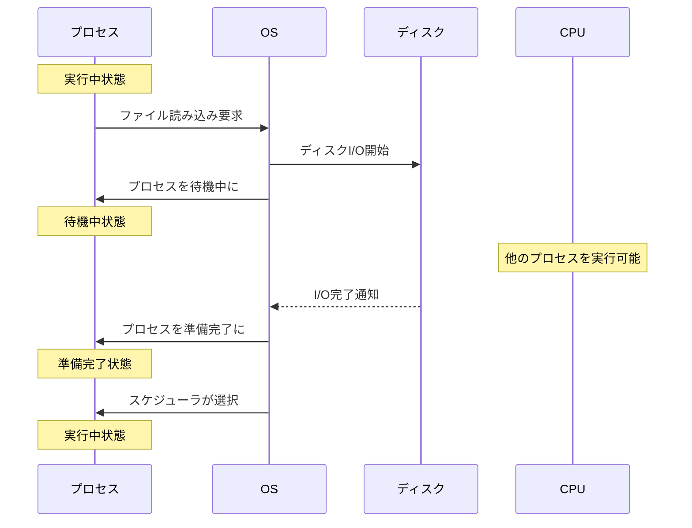
```mermaid
sequenceDiagram
    participant P as プロセス
    participant OS as OS
    participant DISK as ディスク
    participant CPU as CPU
    
    Note over P: 実行中状態
    P->>OS: ファイル読み込み要求
    OS->>DISK: ディスクI/O開始
    OS->>P: プロセスを待機中に
    Note over P: 待機中状態
    Note over CPU: 他のプロセスを実行可能
    
    DISK-->>OS: I/O完了通知
    OS->>P: プロセスを準備完了に
    Note over P: 準備完了状態
    OS->>P: スケジューラが選択
    Note over P: 実行中状態
```

この図が示す重要なポイントは、**I/O待ち中にCPUは他のプロセスを実行できる**ということです。これがマルチプロセスによる並行処理の基本原理であり、非同期処理の目的とも一致しています。

---

## 2.2 スレッドとは何か

### スレッドの登場背景

プロセスはプログラムの実行単位として非常にうまく機能しますが、いくつかの制約があります。

**プロセス間の通信が重い**: プロセスはメモリ空間が隔離されているため、プロセス間でデータを共有するには、パイプ、ソケット、共有メモリなどの特別なメカニズムが必要です。これらは設定と使用にオーバーヘッドがあります。

**プロセスの作成が重い**: 新しいプロセスを作成するには、メモリ空間の複製、ファイルディスクリプタのコピーなど、多くの作業が必要です。これには時間とシステムリソースがかかります。

**コンテキストスイッチが重い**: プロセス間の切り替えには、メモリマッピングの変更など、コストの高い操作が必要です。

これらの問題を解決するために、**スレッド**という概念が導入されました。

### スレッドとは

**スレッド**は、プロセス内での実行の流れです。1つのプロセスは1つ以上のスレッドを持つことができます。

プロセスが「工場」だとすると、スレッドはその工場で働く「作業員」のようなものです。複数の作業員が同じ工場内で、同じ道具や材料を共有しながら、それぞれの作業を進めることができます。

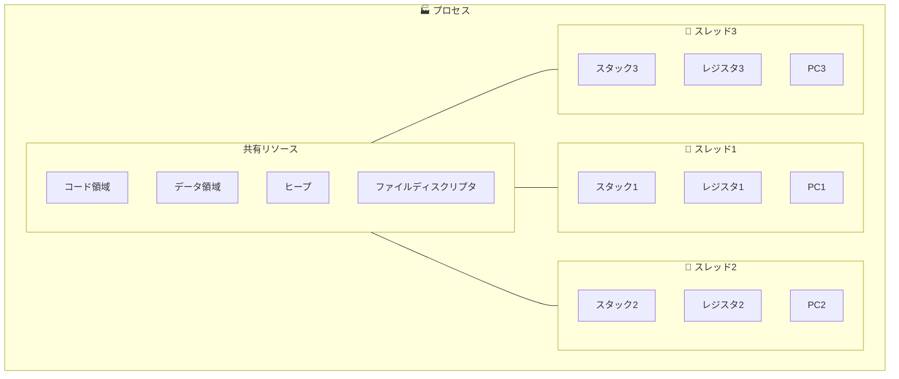
```mermaid
flowchart TB
    subgraph PROCESS["🏭 プロセス"]
        subgraph SHARED["共有リソース"]
            CODE["コード領域"]
            DATA["データ領域"]
            HEAP["ヒープ"]
            FILES["ファイルディスクリプタ"]
        end
        
        subgraph THREAD1["🧵 スレッド1"]
            STACK1["スタック1"]
            REG1["レジスタ1"]
            PC1["PC1"]
        end
        
        subgraph THREAD2["🧵 スレッド2"]
            STACK2["スタック2"]
            REG2["レジスタ2"]
            PC2["PC2"]
        end
        
        subgraph THREAD3["🧵 スレッド3"]
            STACK3["スタック3"]
            REG3["レジスタ3"]
            PC3["PC3"]
        end
    end
    
    SHARED --- THREAD1
    SHARED --- THREAD2
    SHARED --- THREAD3
```

この図が示すように、スレッドは以下の特性を持ちます：

**スレッド間で共有されるもの:**
- コード領域（プログラムの命令）
- データ領域（グローバル変数、静的変数）
- ヒープ（動的に確保されたメモリ）
- ファイルディスクリプタ（開いているファイルやソケット）

**各スレッドが独自に持つもの:**
- スタック（ローカル変数、関数呼び出し履歴）
- レジスタの値
- プログラムカウンタ（次に実行する命令の位置）
- スレッドローカルストレージ（TLS）

### プロセス vs スレッドの比較

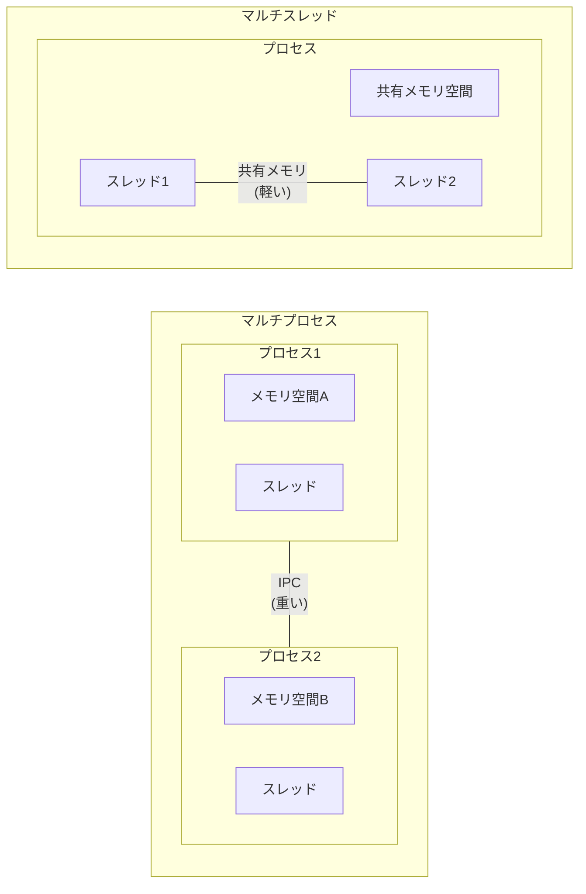
```mermaid
flowchart LR
    subgraph MULTI_PROCESS["マルチプロセス"]
        subgraph P1["プロセス1"]
            P1_MEM["メモリ空間A"]
            P1_T["スレッド"]
        end
        subgraph P2["プロセス2"]
            P2_MEM["メモリ空間B"]
            P2_T["スレッド"]
        end
        P1 ---|"IPC\n(重い)"|P2
    end
    
    subgraph MULTI_THREAD["マルチスレッド"]
        subgraph P3["プロセス"]
            P3_MEM["共有メモリ空間"]
            T1["スレッド1"]
            T2["スレッド2"]
        end
        T1 ---|"共有メモリ\n(軽い)"|T2
    end
```

| 特性 | プロセス | スレッド |
|------|---------|---------|
| メモリ空間 | 独立（隔離されている） | 共有（同じプロセス内） |
| 作成コスト | 高い | 低い |
| コンテキストスイッチ | 重い（メモリマッピング変更） | 軽い（レジスタとスタックのみ） |
| 通信 | IPC（パイプ、ソケット等）が必要 | 共有メモリで直接アクセス可能 |
| 障害の影響 | 他プロセスに影響しない | 同一プロセス内の他スレッドに影響 |
| リソース消費 | 大きい | 小さい |

### スレッドの利点

スレッドには、マルチプロセスと比較していくつかの重要な利点があります。

#### 1. 効率的なリソース使用

スレッドはプロセス内でメモリを共有するため、複数の実行フローを持つためのオーバーヘッドが小さくなります。10個のプロセスを起動するより、1つのプロセス内で10個のスレッドを起動する方が、メモリ消費量が少なくなります。

#### 2. 高速な通信

スレッド間では共有メモリを通じて直接データをやり取りできます。プロセス間通信（IPC）のような複雑なメカニズムは不要です。ただし、これは同時に注意が必要な点でもあります（後述の競合状態を参照）。

#### 3. 素早い切り替え

スレッド間のコンテキストスイッチは、プロセス間の切り替えより高速です。メモリマッピングを変更する必要がないためです。

#### 4. 応答性の向上

GUIアプリケーションでは、メインスレッドがユーザーインターフェースを処理し、別のスレッドが時間のかかる処理（ファイルのダウンロードなど）を行うことで、アプリケーションの応答性を維持できます。

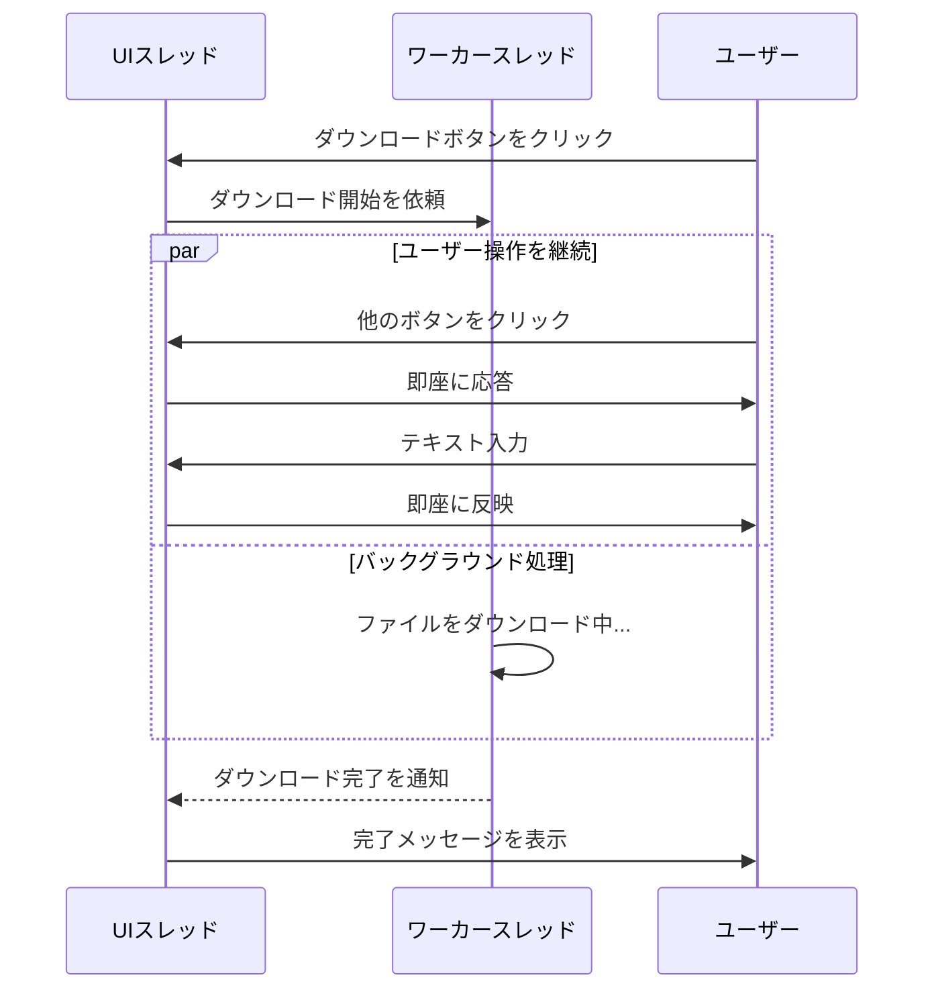
```mermaid
sequenceDiagram
    participant UI as UIスレッド
    participant Worker as ワーカースレッド
    participant User as ユーザー
    
    User->>UI: ダウンロードボタンをクリック
    UI->>Worker: ダウンロード開始を依頼
    
    par ユーザー操作を継続
        User->>UI: 他のボタンをクリック
        UI->>User: 即座に応答
        User->>UI: テキスト入力
        UI->>User: 即座に反映
    and バックグラウンド処理
        Worker->>Worker: ファイルをダウンロード中...
    end
    
    Worker-->>UI: ダウンロード完了を通知
    UI->>User: 完了メッセージを表示
```

この例では、ワーカースレッドがダウンロードを行っている間も、UIスレッドはユーザーの操作に応答し続けることができます。これがシングルスレッドだった場合、ダウンロード中はアプリケーション全体がフリーズしてしまいます。

### スレッドの課題：競合状態とデッドロック

スレッドがメモリを共有することは利点ですが、同時に危険も伴います。

#### 競合状態（Race Condition）

複数のスレッドが同じデータに同時にアクセスし、少なくとも1つが書き込みを行う場合、**競合状態**が発生する可能性があります。

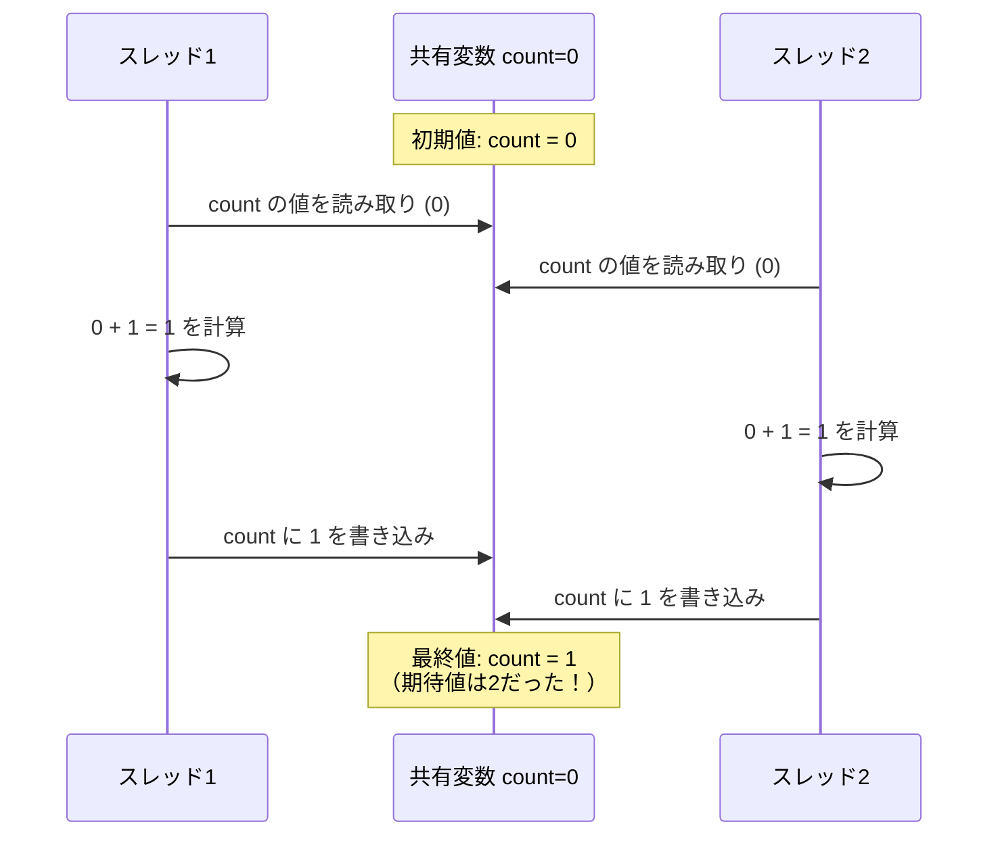
```mermaid
sequenceDiagram
    participant T1 as スレッド1
    participant MEM as 共有変数 count=0
    participant T2 as スレッド2
    
    Note over MEM: 初期値: count = 0
    
    T1->>MEM: count の値を読み取り (0)
    T2->>MEM: count の値を読み取り (0)
    T1->>T1: 0 + 1 = 1 を計算
    T2->>T2: 0 + 1 = 1 を計算
    T1->>MEM: count に 1 を書き込み
    T2->>MEM: count に 1 を書き込み
    
    Note over MEM: 最終値: count = 1<br/>（期待値は2だった！）
```

この例では、2つのスレッドがそれぞれ`count`を1増やそうとしています。期待される結果は`count = 2`ですが、両方のスレッドが同時に古い値（0）を読み取ったため、最終的に`count = 1`になってしまいました。

これは非常に厄介なバグです。なぜなら、タイミングによっては正しく動作することもあるため、テストで発見しにくいからです。

#### 競合状態の解決：同期機構

競合状態を防ぐために、様々な同期機構が使用されます。

**ミューテックス（Mutex）**: 一度に1つのスレッドだけがクリティカルセクション（共有リソースにアクセスするコード領域）を実行できるようにするロック機構です。

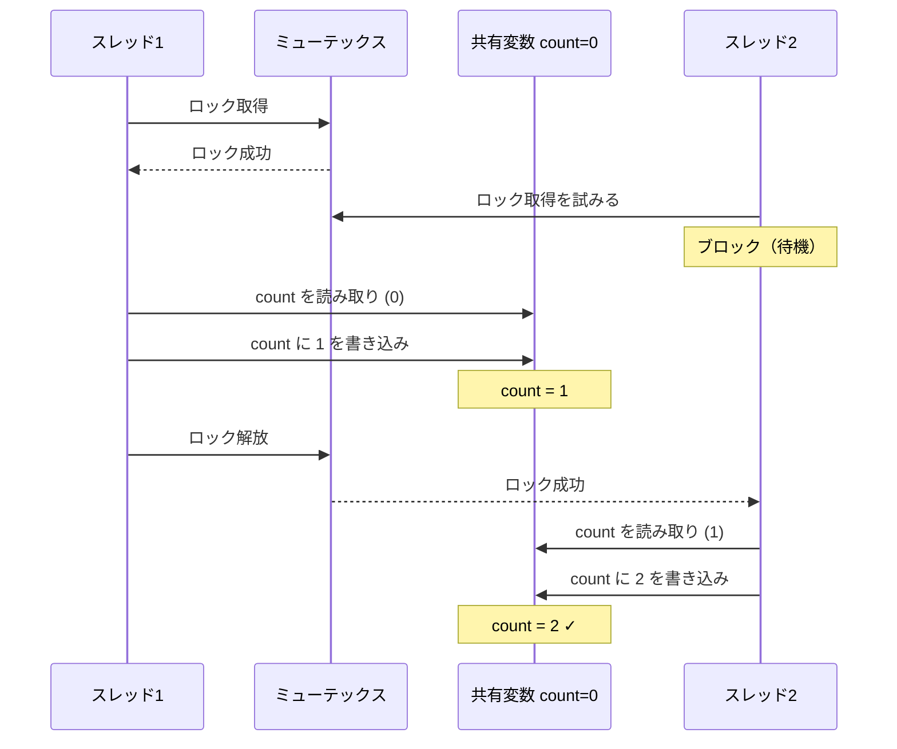
```mermaid
sequenceDiagram
    participant T1 as スレッド1
    participant LOCK as ミューテックス
    participant MEM as 共有変数 count=0
    participant T2 as スレッド2
    
    T1->>LOCK: ロック取得
    LOCK-->>T1: ロック成功
    T2->>LOCK: ロック取得を試みる
    Note over T2: ブロック（待機）
    T1->>MEM: count を読み取り (0)
    T1->>MEM: count に 1 を書き込み
    Note over MEM: count = 1
    T1->>LOCK: ロック解放
    LOCK-->>T2: ロック成功
    T2->>MEM: count を読み取り (1)
    T2->>MEM: count に 2 を書き込み
    Note over MEM: count = 2 ✓
```

**セマフォ（Semaphore）**: 複数のリソースへのアクセスを制御するためのカウンター付きロック。例えば、同時に最大5つのスレッドだけがリソースにアクセスできるようにする場合に使用します。

**読み書きロック（Read-Write Lock）**: 読み取りは複数スレッドで同時に行えるが、書き込みは排他的に行う必要がある場合に使用します。

#### デッドロック（Deadlock）

**デッドロック**は、2つ以上のスレッドが互いに相手が持っているリソースを待ち合っている状態です。どのスレッドも先に進めなくなります。

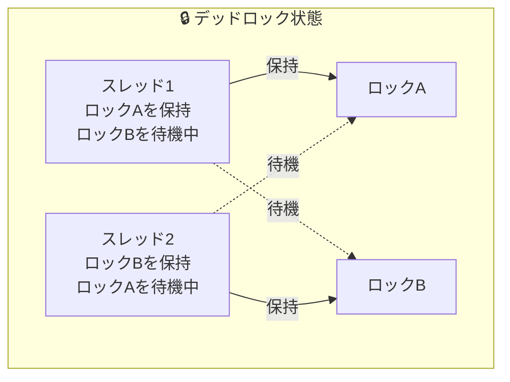
```mermaid
flowchart TB
    subgraph DEADLOCK["🔒 デッドロック状態"]
        T1["スレッド1\nロックAを保持\nロックBを待機中"]
        T2["スレッド2\nロックBを保持\nロックAを待機中"]
        
        LOCK_A["ロックA"]
        LOCK_B["ロックB"]
    end
    
    T1 -->|"保持"| LOCK_A
    T1 -.->|"待機"| LOCK_B
    T2 -->|"保持"| LOCK_B
    T2 -.->|"待機"| LOCK_A
```

デッドロックを防ぐための一般的な戦略：

1. **ロックの順序付け**: すべてのスレッドが同じ順序でロックを取得するようにする
2. **タイムアウト**: ロック取得にタイムアウトを設定し、失敗したら一度解放して再試行する
3. **デッドロック検出**: システムがデッドロックを検出し、いずれかのスレッドを強制終了させる
4. **ロックフリーデータ構造**: アトミック操作を使用してロックなしで安全なデータ構造を実装する

---

## 2.3 コンテキストスイッチの仕組み

### コンテキストスイッチとは

**コンテキストスイッチ**は、CPUが実行するプロセス（またはスレッド）を切り替える操作です。現在実行中のプロセスの状態を保存し、次に実行するプロセスの状態を復元します。

コンテキストスイッチは、以下のような状況で発生します：

- プロセスがI/O操作を要求し、完了を待つ必要がある場合
- プロセスに割り当てられた時間（タイムスライス）が終了した場合
- より優先度の高いプロセスが準備完了になった場合
- プロセスが自発的にCPUを放棄した場合

### コンテキストスイッチの詳細な流れ

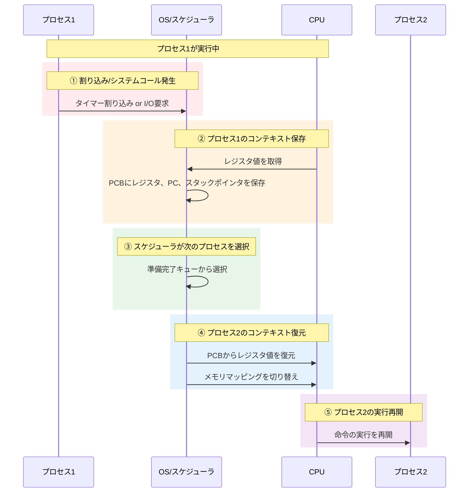
```mermaid
sequenceDiagram
    participant P1 as プロセス1
    participant OS as OS/スケジューラ
    participant CPU as CPU
    participant P2 as プロセス2
    
    Note over P1,CPU: プロセス1が実行中
    
    rect rgb(255, 235, 238)
        Note over P1,OS: ① 割り込み/システムコール発生
        P1->>OS: タイマー割り込み or I/O要求
    end
    
    rect rgb(255, 243, 224)
        Note over OS,CPU: ② プロセス1のコンテキスト保存
        CPU->>OS: レジスタ値を取得
        OS->>OS: PCBにレジスタ、PC、スタックポインタを保存
    end
    
    rect rgb(232, 245, 233)
        Note over OS: ③ スケジューラが次のプロセスを選択
        OS->>OS: 準備完了キューから選択
    end
    
    rect rgb(227, 242, 253)
        Note over OS,CPU: ④ プロセス2のコンテキスト復元
        OS->>CPU: PCBからレジスタ値を復元
        OS->>CPU: メモリマッピングを切り替え
    end
    
    rect rgb(243, 229, 245)
        Note over P2,CPU: ⑤ プロセス2の実行再開
        CPU->>P2: 命令の実行を再開
    end
```

各ステップの詳細：

#### ① 割り込み/システムコールの発生

コンテキストスイッチは、通常「割り込み」によってトリガーされます。

**タイマー割り込み**: ハードウェアタイマーが定期的に割り込みを発生させ、OSに制御を戻します。これにより、1つのプロセスがCPUを独占することを防ぎます。

**I/O割り込み**: プロセスがI/O操作を要求すると、完了を待つ間に他のプロセスを実行できます。

**システムコール**: プロセスがOSの機能を呼び出すと、カーネルモードに切り替わり、OSがスケジューリングの判断を行う機会になります。

#### ② コンテキストの保存

現在のプロセスの状態をそのPCBに保存します：

- すべての汎用レジスタの値
- プログラムカウンタ（次に実行する命令のアドレス）
- スタックポインタ
- ステータスレジスタ（フラグ）
- 浮動小数点レジスタ（使用している場合）

#### ③ スケジューラによる選択

スケジューラは、次に実行するプロセス（またはスレッド）を選択します。選択アルゴリズムについては後述します。

#### ④ コンテキストの復元

選択されたプロセスのPCBから状態を復元します：

- レジスタ値の復元
- メモリマッピングの切り替え（プロセス間の場合）
- 必要に応じてキャッシュの無効化

#### ⑤ 実行の再開

新しいプロセスの実行が、以前中断した地点から再開されます。プロセスの観点からは、中断されたことを認識できません（時間の経過を除けば）。

### コンテキストスイッチのコスト

コンテキストスイッチは「無料」ではありません。以下のオーバーヘッドが発生します：

**直接的なコスト:**
- レジスタの保存と復元
- メモリマッピングの切り替え（プロセス間の場合）
- カーネルモードへの遷移とユーザーモードへの復帰

**間接的なコスト:**
- CPUキャッシュの無効化（キャッシュミスの増加）
- TLB（Translation Lookaside Buffer）のフラッシュ
- 分岐予測の精度低下

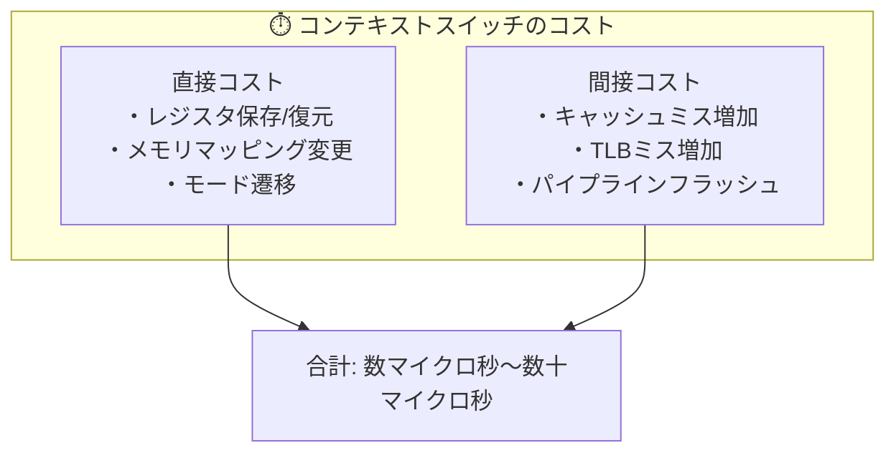
```mermaid
flowchart TB
    subgraph COST["⏱️ コンテキストスイッチのコスト"]
        DIRECT["直接コスト\n・レジスタ保存/復元\n・メモリマッピング変更\n・モード遷移"]
        INDIRECT["間接コスト\n・キャッシュミス増加\n・TLBミス増加\n・パイプラインフラッシュ"]
    end
    
    DIRECT --> TOTAL["合計: 数マイクロ秒〜数十マイクロ秒"]
    INDIRECT --> TOTAL
```

一般的に、プロセス間のコンテキストスイッチは1〜10マイクロ秒程度かかります。スレッド間のコンテキストスイッチは、メモリマッピングの変更が不要なため、より高速です。

この時間は短く感じるかもしれませんが、秒間数千回のコンテキストスイッチが発生するシステムでは、オーバーヘッドが蓄積します。これが、コンテキストスイッチを最小限に抑えることが重要な理由であり、非同期処理がスレッドよりも効率的な場合がある理由でもあります。

---

## 2.4 スケジューリング

### スケジューリングとは

**スケジューリング**は、CPUをどのプロセス（またはスレッド）に割り当てるかを決定するプロセスです。オペレーティングシステムの**スケジューラ**がこの役割を担います。

良いスケジューリングアルゴリズムは、以下の目標のバランスを取る必要があります：

| 目標 | 説明 |
|------|------|
| **CPU使用率** | CPUをできるだけ稼働させ続ける |
| **スループット** | 単位時間あたりに完了するプロセス数を最大化 |
| **ターンアラウンド時間** | プロセスの開始から終了までの時間を最小化 |
| **待ち時間** | 準備完了キューでの待ち時間を最小化 |
| **応答時間** | 対話型システムでの応答の速さ |
| **公平性** | すべてのプロセスに適切なCPU時間を与える |

これらの目標は互いに矛盾することがあります。例えば、スループットを最大化するにはコンテキストスイッチを減らすべきですが、応答時間を改善するには頻繁にプロセスを切り替える必要があります。

### 主要なスケジューリングアルゴリズム

#### FCFS（First-Come, First-Served）

最もシンプルなアルゴリズムで、先に到着したプロセスを先に実行します。

```mermaid
gantt
    title FCFS スケジューリング
    dateFormat X
    axisFormat %s
    
    section CPU
    P1 (24ms) :p1, 0, 24
    P2 (3ms)  :p2, 24, 27
    P3 (3ms)  :p3, 27, 30
```

**利点**: 実装が簡単、公平（到着順）
**欠点**: 「護送船団効果」- 長いプロセスが後続の短いプロセスをブロックする

この例では、P2とP3は非常に短いプロセスですが、P1が完了するまで24ms待たなければなりません。平均待ち時間は (0 + 24 + 27) / 3 = 17msになります。

#### SJF（Shortest Job First）

実行時間が最も短いプロセスを優先的に実行します。

```mermaid
gantt
    title SJF スケジューリング
    dateFormat X
    axisFormat %s
    
    section CPU
    P2 (3ms)  :p2, 0, 3
    P3 (3ms)  :p3, 3, 6
    P1 (24ms) :p1, 6, 30
```

**利点**: 平均待ち時間を最小化できる（理論上最適）
**欠点**: 
- 実行時間を事前に知る必要がある（実際には予測が困難）
- 長いプロセスが飢餓状態になる可能性がある

この例では、平均待ち時間は (0 + 3 + 6) / 3 = 3msに改善されます。

#### ラウンドロビン（Round Robin）

各プロセスに固定の時間（タイムクォンタム）を割り当て、順番に実行します。

```mermaid
gantt
    title ラウンドロビン スケジューリング（タイムクォンタム = 4ms）
    dateFormat X
    axisFormat %s
    
    section CPU
    P1 :p1a, 0, 4
    P2 :p2, 4, 7
    P3 :p3, 7, 10
    P1 :p1b, 10, 14
    P1 :p1c, 14, 18
    P1 :p1d, 18, 22
    P1 :p1e, 22, 26
    P1 :p1f, 26, 30
```

**利点**: 
- 公平性が高い（すべてのプロセスがCPU時間を得られる）
- 対話型システムに適している（応答時間が改善）

**欠点**: 
- タイムクォンタムの選択が重要
  - 大きすぎると：FCFSに近づく
  - 小さすぎると：コンテキストスイッチのオーバーヘッドが増大

#### 優先度スケジューリング

各プロセスに優先度を割り当て、優先度の高いプロセスを先に実行します。

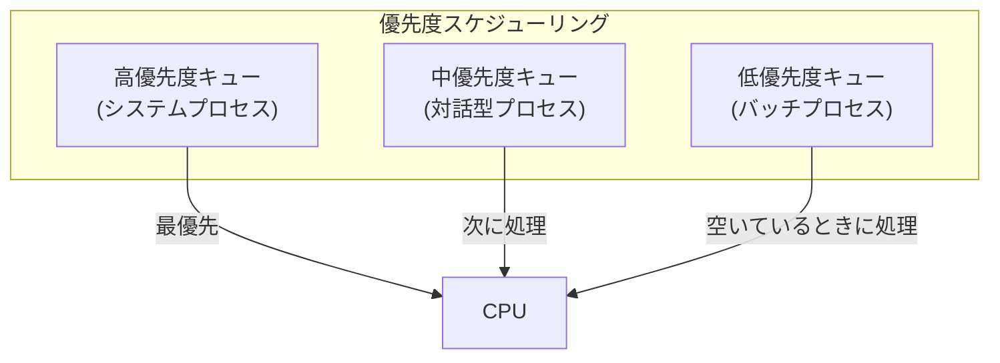
```mermaid
flowchart TB
    subgraph PRIORITY["優先度スケジューリング"]
        HIGH["高優先度キュー\n(システムプロセス)"]
        MED["中優先度キュー\n(対話型プロセス)"]
        LOW["低優先度キュー\n(バッチプロセス)"]
    end
    
    CPU["CPU"]
    
    HIGH -->|"最優先"| CPU
    MED -->|"次に処理"| CPU
    LOW -->|"空いているときに処理"| CPU
```

**利点**: 重要なプロセスを優先できる
**欠点**: 低優先度のプロセスが飢餓状態になる可能性

飢餓問題を解決するために、**エージング**という技術が使われます。長時間待機しているプロセスの優先度を徐々に上げることで、いずれは実行される機会を得られるようにします。

#### マルチレベルフィードバックキュー

現代のオペレーティングシステムで広く使われている洗練されたアルゴリズムです。複数の優先度レベルのキューを持ち、プロセスの動作に基づいてキュー間を移動させます。

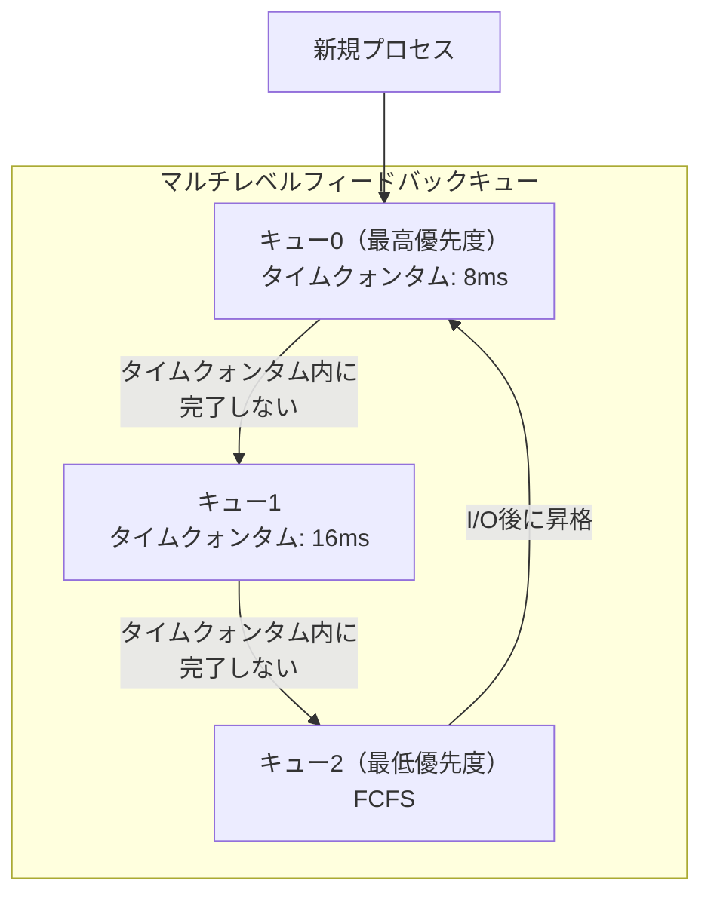
```mermaid
flowchart TB
    subgraph MLFQ["マルチレベルフィードバックキュー"]
        Q0["キュー0（最高優先度）\nタイムクォンタム: 8ms"]
        Q1["キュー1\nタイムクォンタム: 16ms"]
        Q2["キュー2（最低優先度）\nFCFS"]
    end
    
    NEW["新規プロセス"] --> Q0
    Q0 -->|"タイムクォンタム内に\n完了しない"| Q1
    Q1 -->|"タイムクォンタム内に\n完了しない"| Q2
    Q2 -->|"I/O後に昇格"| Q0
```

**仕組み:**
1. 新しいプロセスは最高優先度のキューに入る
2. タイムクォンタム内に完了しなければ、下位のキューに移動
3. I/Oを行ったプロセスは上位のキューに戻る

**効果:**
- 対話型プロセス（頻繁にI/Oを行う）は高優先度を維持
- CPUバウンドプロセスは徐々に優先度が下がる
- 飢餓を防ぐために、定期的にすべてのプロセスを最高優先度に戻す

### プリエンプティブ vs ノンプリエンプティブ

スケジューリングには2つの基本的なアプローチがあります：

**ノンプリエンプティブ（協調的）**: プロセスは自発的にCPUを放棄するまで実行を続けます。プロセスがI/Oを待つ、または終了するまで、他のプロセスは実行できません。

**プリエンプティブ（割り込み型）**: OSがプロセスを強制的に中断し、他のプロセスに切り替えることができます。タイマー割り込みにより、どのプロセスも一定時間以上CPUを独占できません。

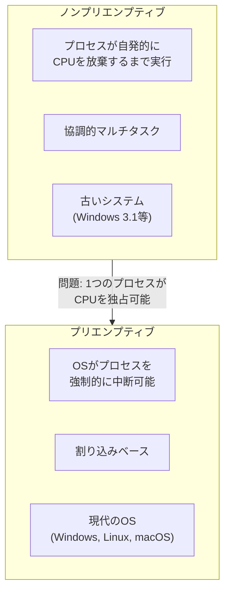
```mermaid
flowchart TB
    subgraph NON_PREEMPTIVE["ノンプリエンプティブ"]
        NP1["プロセスが自発的に\nCPUを放棄するまで実行"]
        NP2["協調的マルチタスク"]
        NP3["古いシステム\n(Windows 3.1等)"]
    end
    
    subgraph PREEMPTIVE["プリエンプティブ"]
        P1["OSがプロセスを\n強制的に中断可能"]
        P2["割り込みベース"]
        P3["現代のOS\n(Windows, Linux, macOS)"]
    end
    
    NON_PREEMPTIVE -->|"問題: 1つのプロセスが\nCPUを独占可能"| PREEMPTIVE
```

現代のオペレーティングシステムは、ほぼすべてプリエンプティブスケジューリングを採用しています。これにより、1つのプロセスがシステム全体を応答不能にすることを防いでいます。

### 非同期処理との関連

スケジューリングの理解は、非同期処理を理解する上で重要です。

**マルチスレッドプログラミング** では、スレッドのスケジューリングはOSに任されます。プログラマはどのスレッドがいつ実行されるかを制御できません。これが競合状態やデッドロックを引き起こす原因の一つです。

**非同期I/O** は、スケジューリングの問題に対する別のアプローチを提供します。スレッドをブロックしてI/Oの完了を待つ代わりに、I/O操作を開始して制御をすぐに返し、完了時にコールバックで通知を受けます。これにより、少数のスレッドで多数のI/O操作を効率的に処理できます。

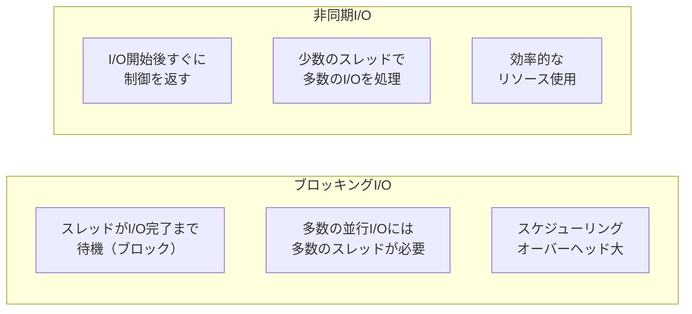
```mermaid
flowchart LR
    subgraph BLOCKING["ブロッキングI/O"]
        B1["スレッドがI/O完了まで\n待機（ブロック）"]
        B2["多数の並行I/Oには\n多数のスレッドが必要"]
        B3["スケジューリング\nオーバーヘッド大"]
    end
    
    subgraph ASYNC["非同期I/O"]
        A1["I/O開始後すぐに\n制御を返す"]
        A2["少数のスレッドで\n多数のI/Oを処理"]
        A3["効率的な\nリソース使用"]
    end
```

---

## 2.5 まとめ

この章では、オペレーティングシステムがプログラムを管理・実行する仕組みを学びました。

```mermaid
mindmap
    root((第2章のまとめ))
        プロセス
            プログラムの実行インスタンス
            独立したメモリ空間
            状態遷移
            PCBによる管理
        スレッド
            プロセス内の実行フロー
            メモリを共有
            競合状態とデッドロック
            同期機構
        コンテキストスイッチ
            状態の保存と復元
            直接/間接コスト
            頻度のトレードオフ
        スケジューリング
            FCFS, SJF, RR
            優先度とMLFQ
            プリエンプティブ
```

### 重要なポイント

#### 1. プロセスは隔離されたリソースを持つ

各プロセスは独自のメモリ空間を持ち、他のプロセスから保護されています。これは安全性と安定性を提供しますが、プロセス間の通信にはオーバーヘッドがあります。

プロセスの状態遷移、特に「待機中」状態の理解は重要です。I/O操作を待っている間、プロセスはCPUを使用せず、他のプロセスがCPUを使用できます。

#### 2. スレッドは軽量だが注意が必要

スレッドはプロセスよりも軽量で、メモリを共有できるため効率的です。しかし、共有メモリへの並行アクセスは競合状態やデッドロックを引き起こす可能性があります。

適切な同期機構（ミューテックス、セマフォなど）を使用して、これらの問題を防ぐ必要があります。しかし、同期はパフォーマンスのオーバーヘッドと複雑さをもたらします。

#### 3. コンテキストスイッチにはコストがある

コンテキストスイッチは、レジスタの保存/復元、メモリマッピングの変更、キャッシュの無効化などのオーバーヘッドを伴います。

頻繁なコンテキストスイッチは、実際の処理よりもオーバーヘッドに多くの時間を費やすことになります。これが、スレッドを大量に使用することが必ずしも最善ではない理由です。

#### 4. スケジューリングは複雑なトレードオフ

様々なスケジューリングアルゴリズムが存在し、それぞれ異なる特性を持ちます。現代のOSは、これらを組み合わせた洗練されたアルゴリズム（マルチレベルフィードバックキューなど）を使用しています。

#### 5. 非同期処理は別のアプローチを提供する

スレッドベースの並行処理には、コンテキストスイッチのオーバーヘッド、競合状態のリスク、スケーリングの問題などがあります。

非同期処理は、これらの問題に対する代替アプローチを提供します。I/Oをノンブロッキングで行い、少数のスレッドで多数の操作を処理することで、効率的な並行処理を実現できます。

---

## 📝 練習問題

1. **同じプログラムから複数のプロセスを起動すると、それぞれのプロセスは独立したメモリ空間を持ちます。これにはどのような利点と欠点がありますか？**
   
   ヒント：安全性、リソース消費、通信のオーバーヘッドを考慮してください。

2. **Webサーバーが1000の同時接続を処理する必要があるとします。1接続1スレッドのモデルと、非同期I/Oを使用するモデルを比較してください。**
   
   ヒント：メモリ消費、コンテキストスイッチ、スケーラビリティを考慮してください。

3. **競合状態を防ぐためにミューテックスを使用することの欠点は何ですか？ロックなしで安全に並行処理を行う方法はありますか？**
   
   ヒント：パフォーマンス、デッドロックのリスク、アトミック操作について考えてください。

4. **なぜ現代のOSはプリエンプティブスケジューリングを採用しているのですか？ノンプリエンプティブスケジューリングが適切な場合はありますか？**
   
   ヒント：対話型システム vs バッチシステム、信頼性について考えてください。

5. **マルチレベルフィードバックキューが対話型プロセスに有利に働く仕組みを説明してください。なぜこれがユーザー体験を向上させるのですか？**
   
   ヒント：I/Oバウンドプロセスとはどのようなものか、ユーザーは何を期待するかを考えてください。

---

## 🔗 次の章へ

[第3章: I/O操作とブロッキング](./03-io-blocking.md) では、I/O操作がなぜ遅いのか、ブロッキングとは何かを詳しく学び、非同期処理が解決しようとしている問題の本質に迫ります。

---

[← 目次に戻る](../index.md) | [← 前章: CPUとプログラム実行の仕組み](./01-cpu-basics.md)

