# 第3章: I/O操作とブロッキング

> 🎯 **この章の目標**: I/O操作がなぜ遅いのか、ブロッキングとは何かを理解し、非同期処理が解決しようとしている問題の本質を把握する

---

## 3.1 I/Oバウンド vs CPUバウンド

### 処理のボトルネックを理解する

プログラムの実行時間を決定する要因は大きく2つに分類できます。**CPUバウンド**と**I/Oバウンド**です。この区別を理解することは、非同期処理がいつ効果的かを判断する上で極めて重要です。

#### CPUバウンドな処理

**CPUバウンド**とは、処理速度がCPUの計算能力によって制限される状態を指します。プログラムはほとんどの時間をCPU上での計算に費やし、I/O操作を待つことはほとんどありません。

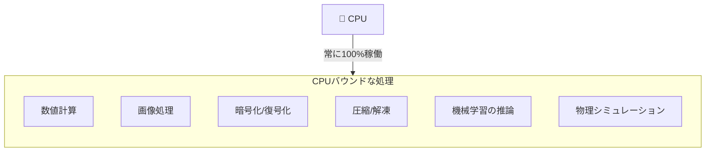
```mermaid
flowchart TD
    subgraph CPU_BOUND["CPUバウンドな処理"]
        direction TB
        C1["数値計算"]
        C2["画像処理"]
        C3["暗号化/復号化"]
        C4["圧縮/解凍"]
        C5["機械学習の推論"]
        C6["物理シミュレーション"]
    end
    
    CPU["🧠 CPU"] -->|"常に100%稼働"| CPU_BOUND
```

CPUバウンドな処理の例：

- **科学計算**: 大規模な行列演算、微分方程式の数値解法
- **画像・動画処理**: フィルタ適用、エンコード/デコード
- **暗号処理**: ハッシュ計算、暗号化/復号化
- **ゲームエンジン**: 物理演算、AI計算、レンダリング
- **データ分析**: 統計処理、機械学習モデルの訓練

これらの処理では、CPUが休むことなく計算を続けます。処理を高速化するには、より高速なCPUを使うか、複数のCPUコアで並列処理を行う必要があります。

#### I/Oバウンドな処理

**I/Oバウンド**とは、処理速度がI/O操作（ディスク、ネットワーク、ユーザー入力など）の完了待ちによって制限される状態を指します。CPUは大半の時間をアイドル状態で過ごし、外部デバイスからのデータを待っています。

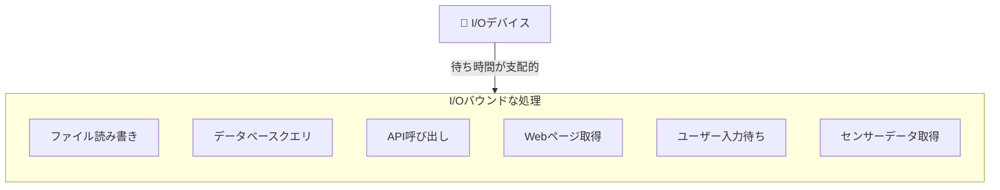
```mermaid
flowchart TD
    subgraph IO_BOUND["I/Oバウンドな処理"]
        direction TB
        I1["ファイル読み書き"]
        I2["データベースクエリ"]
        I3["API呼び出し"]
        I4["Webページ取得"]
        I5["ユーザー入力待ち"]
        I6["センサーデータ取得"]
    end
    
    IO["🔌 I/Oデバイス"] -->|"待ち時間が支配的"| IO_BOUND
```

I/Oバウンドな処理の例：

- **Webアプリケーション**: HTTPリクエストの送受信、データベースアクセス
- **ファイル処理**: 大量のファイルの読み書き、ログ出力
- **ネットワーク通信**: API呼び出し、ソケット通信
- **対話型アプリケーション**: ユーザー入力の待機
- **IoTアプリケーション**: センサーからのデータ収集

これらの処理では、CPUはほとんどの時間を「待ち」に費やしています。この待ち時間を有効活用するのが、非同期処理の主な目的です。

### CPUバウンドとI/Oバウンドの比較

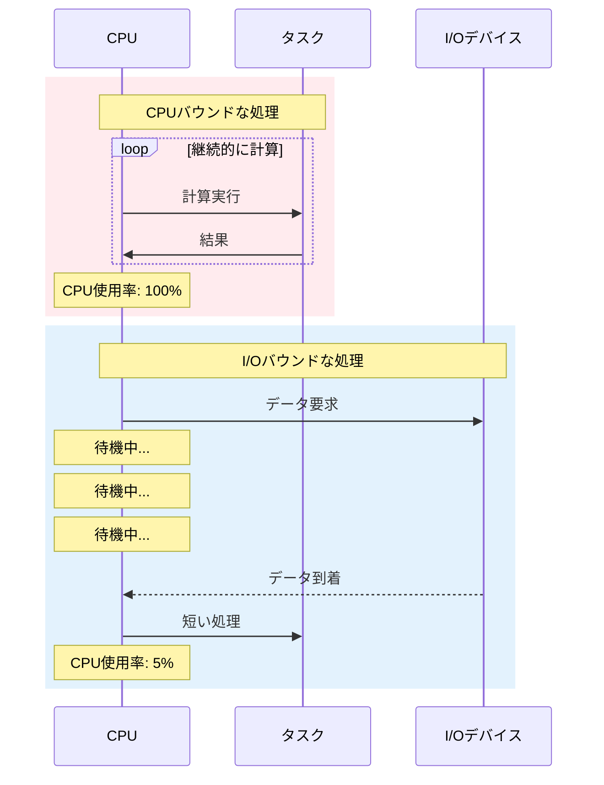
```mermaid
sequenceDiagram
    participant CPU as CPU
    participant TASK as タスク
    participant IO as I/Oデバイス
    
    rect rgb(255, 235, 238)
        Note over CPU,TASK: CPUバウンドな処理
        loop 継続的に計算
            CPU->>TASK: 計算実行
            TASK->>CPU: 結果
        end
        Note over CPU: CPU使用率: 100%
    end
    
    rect rgb(227, 242, 253)
        Note over CPU,IO: I/Oバウンドな処理
        CPU->>IO: データ要求
        Note over CPU: 待機中...
        Note over CPU: 待機中...
        Note over CPU: 待機中...
        IO-->>CPU: データ到着
        CPU->>TASK: 短い処理
        Note over CPU: CPU使用率: 5%
    end
```

この図は、CPUバウンドとI/Oバウンドの処理における CPU の振る舞いの違いを示しています。CPUバウンドな処理ではCPUが常に稼働していますが、I/Oバウンドな処理ではCPUのほとんどの時間が待機に費やされています。

| 特性 | CPUバウンド | I/Oバウンド |
|------|------------|------------|
| ボトルネック | CPU計算能力 | I/O速度 |
| CPU使用率 | 高い（90-100%） | 低い（1-10%） |
| 高速化の方法 | より高速なCPU、並列化 | 非同期処理、並行処理 |
| 非同期処理の効果 | 限定的 | 非常に効果的 |
| マルチスレッドの効果 | 効果的（マルチコア活用） | 効果的だがオーバーヘッドあり |

### 現実世界のプログラム

実際のプログラムは、CPUバウンドとI/Oバウンドの両方の特性を持つことが多いです。例えば、Webサーバーを考えてみましょう。

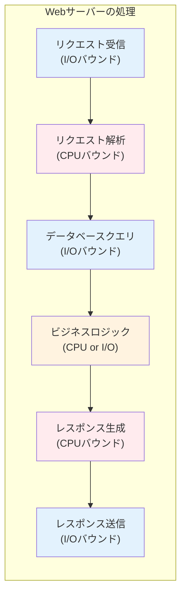
```mermaid
flowchart LR
    subgraph WEB_SERVER["Webサーバーの処理"]
        REQ["リクエスト受信\n(I/Oバウンド)"]
        PARSE["リクエスト解析\n(CPUバウンド)"]
        DB["データベースクエリ\n(I/Oバウンド)"]
        PROCESS["ビジネスロジック\n(CPU or I/O)"]
        RENDER["レスポンス生成\n(CPUバウンド)"]
        SEND["レスポンス送信\n(I/Oバウンド)"]
    end
    
    REQ --> PARSE --> DB --> PROCESS --> RENDER --> SEND
    
    style REQ fill:#e3f2fd
    style PARSE fill:#ffebee
    style DB fill:#e3f2fd
    style PROCESS fill:#fff3e0
    style RENDER fill:#ffebee
    style SEND fill:#e3f2fd
```

典型的なWebサーバーでは、**I/Oバウンドな操作が処理時間の大部分を占めます**。データベースへのクエリ、外部APIの呼び出し、ファイルの読み込みなど、I/O操作を待つ時間が支配的です。

このため、Webサーバーやネットワークアプリケーションでは、非同期処理が非常に効果的です。CPUが I/O を待っている間に、他のリクエストを処理できるからです。

### どちらのタイプかを判断する

プログラムがCPUバウンドかI/Oバウンドかを判断する簡単な方法があります。

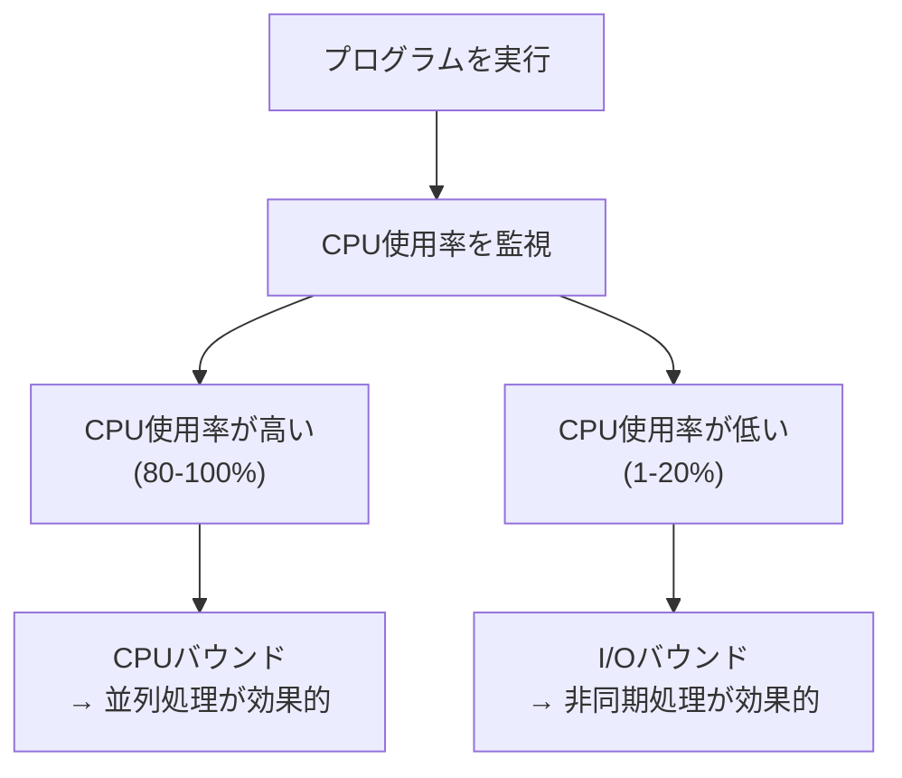
```mermaid
flowchart TB
    START["プログラムを実行"]
    CHECK["CPU使用率を監視"]
    
    HIGH["CPU使用率が高い\n(80-100%)"]
    LOW["CPU使用率が低い\n(1-20%)"]
    
    CPU_BOUND["CPUバウンド\n→ 並列処理が効果的"]
    IO_BOUND["I/Oバウンド\n→ 非同期処理が効果的"]
    
    START --> CHECK
    CHECK --> HIGH --> CPU_BOUND
    CHECK --> LOW --> IO_BOUND
```

1. **タスクマネージャー/top/htop** などでCPU使用率を確認する
2. CPU使用率が高ければCPUバウンド、低ければI/Oバウンド
3. I/Oバウンドの場合、非同期処理で大幅な改善が期待できる

ただし、これは単純化した判断方法です。実際には、プロファイリングツールを使って詳細な分析を行うことが推奨されます。

---

## 3.2 なぜI/Oは遅いのか

### 速度の階層

第1章で学んだメモリ階層を思い出してください。コンピュータの各コンポーネントは、大きく異なる速度で動作します。この速度差が、I/Oが「遅い」と感じられる根本的な原因です。

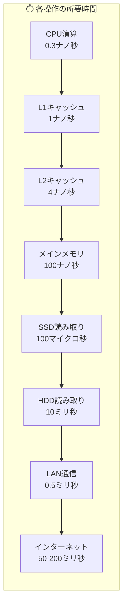
```mermaid
flowchart LR
    subgraph SPEED["⏱️ 各操作の所要時間"]
        CPU_OP["CPU演算<br/>0.3ナノ秒"]
        L1["L1キャッシュ<br/>1ナノ秒"]
        L2["L2キャッシュ<br/>4ナノ秒"]
        RAM["メインメモリ<br/>100ナノ秒"]
        SSD["SSD読み取り<br/>100マイクロ秒"]
        HDD["HDD読み取り<br/>10ミリ秒"]
        NET_LOCAL["LAN通信<br/>0.5ミリ秒"]
        NET_REMOTE["インターネット<br/>50-200ミリ秒"]
    end
    
    CPU_OP --> L1 --> L2 --> RAM --> SSD --> HDD --> NET_LOCAL --> NET_REMOTE
```

これらの数値を直感的に理解するため、**CPU演算を1秒に換算**してみましょう。

| 操作 | 実際の時間 | 1秒換算 |
|------|-----------|---------|
| CPU演算（1サイクル） | 0.3ナノ秒 | **1秒** |
| L1キャッシュアクセス | 1ナノ秒 | 3秒 |
| L2キャッシュアクセス | 4ナノ秒 | 13秒 |
| メインメモリアクセス | 100ナノ秒 | 5分 |
| SSD読み取り | 100マイクロ秒 | **4日** |
| HDD読み取り | 10ミリ秒 | **1年** |
| 同一LAN内の通信 | 0.5ミリ秒 | **19日** |
| インターネット通信 | 100ミリ秒 | **10年** |

この表が示すのは驚くべき事実です。CPUにとって、SSDからデータを読み込むのを待つことは、人間が4日間待つのと同じ感覚です。インターネット経由でデータを取得するのは、10年間待つのと同じです。

### なぜこれほど遅いのか

I/Oが遅い理由は、物理的・技術的な制約に起因します。

#### 物理的な距離と信号伝達

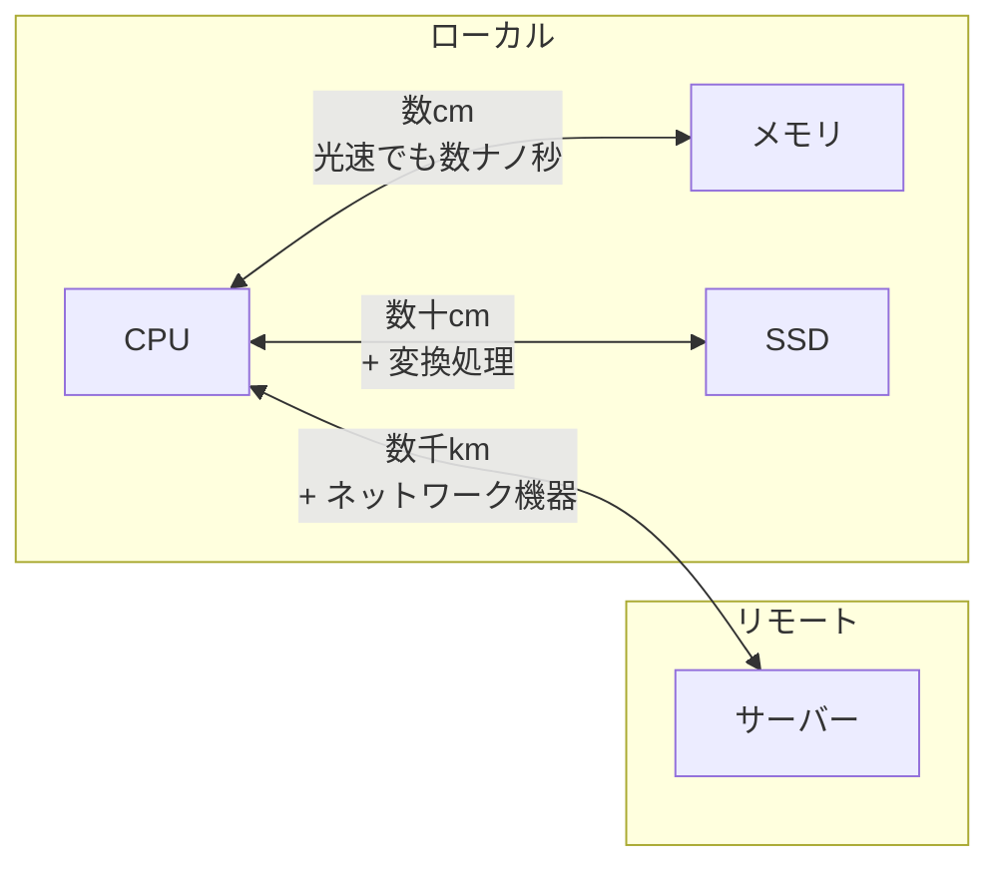
```mermaid
flowchart LR
    subgraph LOCAL["ローカル"]
        CPU["CPU"]
        RAM["メモリ"]
        SSD["SSD"]
    end
    
    subgraph REMOTE["リモート"]
        SERVER["サーバー"]
    end
    
    CPU <-->|"数cm\n光速でも数ナノ秒"| RAM
    CPU <-->|"数十cm\n+ 変換処理"| SSD
    CPU <-->|"数千km\n+ ネットワーク機器"| SERVER
```

**光速の限界**: 光は1秒間に約30万km進みますが、これでも1mあたり約3ナノ秒かかります。東京からロサンゼルスまでは約9,000kmあり、光が往復するだけで約60ミリ秒かかります。実際のネットワーク通信では、これに加えてルーター、スイッチ、プロトコル処理などのオーバーヘッドがあります。

#### 機械的な制約（HDD）

HDDは回転する磁気ディスクにデータを記録しています。データを読み取るには：

1. **シーク時間**: 読み取りヘッドを目的のトラックに移動（数ミリ秒）
2. **回転待ち時間**: 目的のセクタが回ってくるのを待つ（数ミリ秒）
3. **転送時間**: 実際のデータ転送

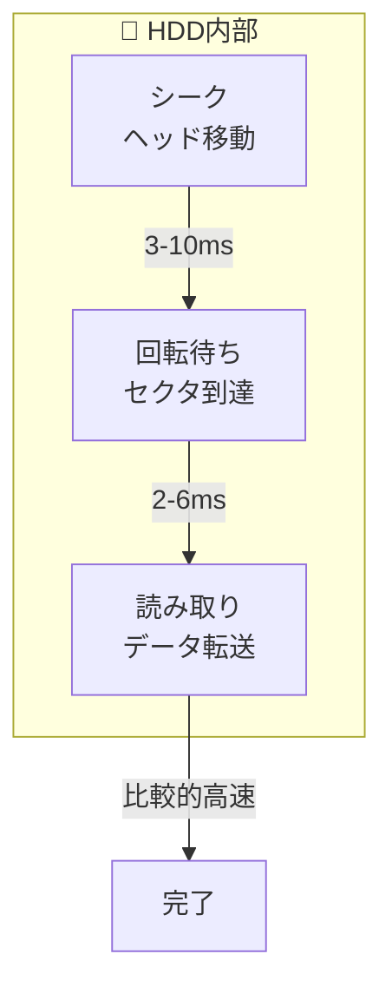
```mermaid
flowchart TD
    subgraph HDD["💽 HDD内部"]
        SEEK["シーク\nヘッド移動"]
        ROTATE["回転待ち\nセクタ到達"]
        READ["読み取り\nデータ転送"]
    end
    
    SEEK -->|"3-10ms"| ROTATE -->|"2-6ms"| READ -->|"比較的高速"| DONE["完了"]
```

機械的な動作には、電子的な処理と比べて桁違いの時間がかかります。これが、HDDがSSDより遅い主な理由です。

#### プロトコルオーバーヘッド

ネットワーク通信では、データの送受信に複数のプロトコル層を経由する必要があります。

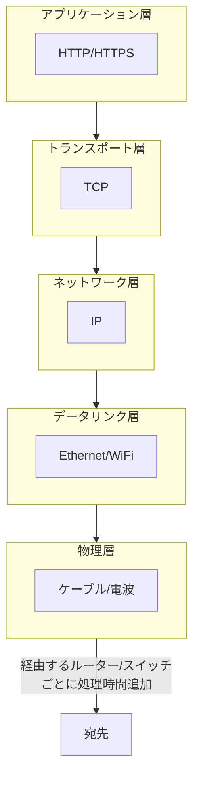
```mermaid
flowchart TB
    subgraph APP["アプリケーション層"]
        HTTP["HTTP/HTTPS"]
    end
    
    subgraph TRANSPORT["トランスポート層"]
        TCP["TCP"]
    end
    
    subgraph NETWORK["ネットワーク層"]
        IP["IP"]
    end
    
    subgraph LINK["データリンク層"]
        ETH["Ethernet/WiFi"]
    end
    
    subgraph PHYSICAL["物理層"]
        WIRE["ケーブル/電波"]
    end
    
    APP --> TRANSPORT --> NETWORK --> LINK --> PHYSICAL
    
    PHYSICAL -->|"経由するルーター/スイッチ<br/>ごとに処理時間追加"| DEST["宛先"]
```

各層でヘッダの追加、チェックサムの計算、暗号化/復号化などの処理が行われます。さらに、TCPでは以下のようなオーバーヘッドもあります：

- **3ウェイハンドシェイク**: 接続確立に3往復の通信が必要
- **再送制御**: パケットロス時の再送
- **輻輳制御**: ネットワーク混雑時の速度調整

#### デバイスの処理時間

ストレージデバイスにも内部処理があります。

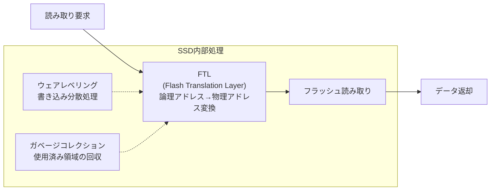
```mermaid
flowchart LR
    subgraph SSD_INTERNAL["SSD内部処理"]
        FTL["FTL\n(Flash Translation Layer)\n論理アドレス→物理アドレス変換"]
        WEAR["ウェアレベリング\n書き込み分散処理"]
        GC["ガベージコレクション\n使用済み領域の回収"]
        READ_OP["フラッシュ読み取り"]
    end
    
    REQ["読み取り要求"] --> FTL --> READ_OP --> RESP["データ返却"]
    WEAR -.-> FTL
    GC -.-> FTL
```

SSDはHDDより高速ですが、それでもCPUからすると非常に遅いです。フラッシュメモリの物理的な読み取り時間に加え、内部コントローラーの処理時間があります。

### I/Oレイテンシの具体例

実際のアプリケーションで発生するI/Oレイテンシを見てみましょう。

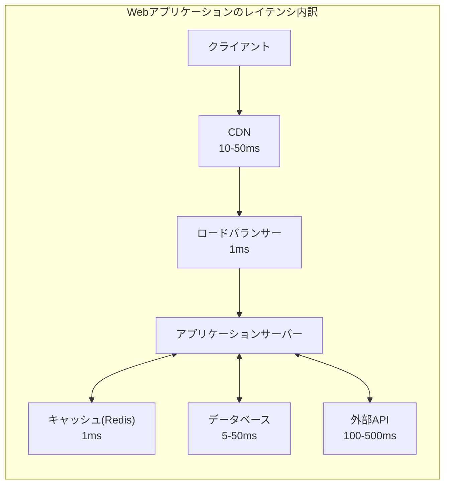
```mermaid
flowchart LR
    subgraph WEB_APP["Webアプリケーションのレイテンシ内訳"]
        CLIENT["クライアント"]
        CDN["CDN<br/>10-50ms"]
        LB["ロードバランサー<br/>1ms"]
        APP_SERVER["アプリケーションサーバー"]
        CACHE["キャッシュ(Redis)<br/>1ms"]
        DB["データベース<br/>5-50ms"]
        EXT_API["外部API<br/>100-500ms"]
    end
    
    CLIENT --> CDN --> LB --> APP_SERVER
    APP_SERVER <--> CACHE
    APP_SERVER <--> DB
    APP_SERVER <--> EXT_API
```

典型的なWebリクエストでは：

1. ネットワーク往復: 20-100ms
2. データベースクエリ: 5-50ms
3. 外部API呼び出し: 100-500ms
4. アプリケーション処理（CPU）: 1-10ms

**I/O待ち時間が全体の90%以上を占める**ことが珍しくありません。これが、I/OバウンドなアプリケーションでCPU使用率が低くなる理由です。

---

## 3.3 ブロッキングとは何か

### ブロッキング操作の定義

**ブロッキング操作**とは、操作が完了するまでプログラムの実行が停止（ブロック）する操作のことです。操作が終わるまで、そのスレッドは他の処理を行うことができません。

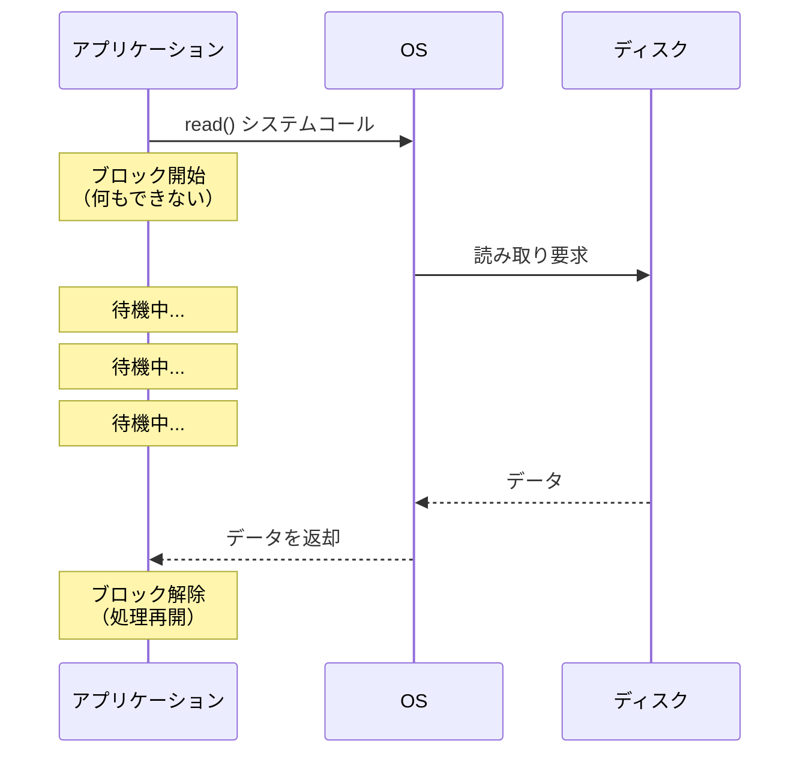
```mermaid
sequenceDiagram
    participant App as アプリケーション
    participant OS as OS
    participant Disk as ディスク
    
    App->>OS: read() システムコール
    Note over App: ブロック開始<br/>（何もできない）
    OS->>Disk: 読み取り要求
    Note over App: 待機中...
    Note over App: 待機中...
    Note over App: 待機中...
    Disk-->>OS: データ
    OS-->>App: データを返却
    Note over App: ブロック解除<br/>（処理再開）
```

この図は、プログラムがファイル読み込みを要求した場合の動作を示しています。`read()`を呼び出すと、データが読み込まれるまでアプリケーションは完全に停止します。この間、CPUはアイドル状態（または他のプロセスに使用される）となります。

### ブロッキングの例

ほとんどのプログラミング言語では、デフォルトのI/O操作はブロッキングです。

```python
# Python でのブロッキング例
import requests

print("リクエスト開始")
response = requests.get("https://api.example.com/data")  # ← ここでブロック
print("リクエスト完了")  # レスポンスが返るまで実行されない
```

```javascript
// Node.js でのブロッキング例（同期的なファイル読み込み）
const fs = require('fs');

console.log("読み込み開始");
const data = fs.readFileSync('large_file.txt');  // ← ここでブロック
console.log("読み込み完了");  // ファイルが読み込まれるまで実行されない
```

### ブロッキングの問題点

ブロッキング操作にはいくつかの重大な問題があります。

#### 問題1: CPU資源の浪費

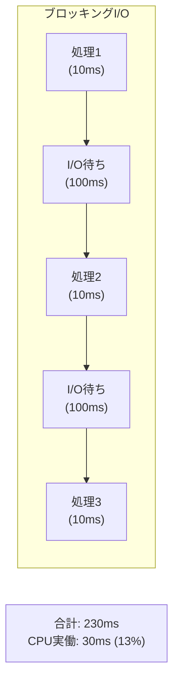
```mermaid
flowchart LR
    subgraph BLOCKING["ブロッキングI/O"]
        B1["処理1<br/>(10ms)"]
        B2["I/O待ち<br/>(100ms)"]
        B3["処理2<br/>(10ms)"]
        B4["I/O待ち<br/>(100ms)"]
        B5["処理3<br/>(10ms)"]
    end
    
    B1 --> B2 --> B3 --> B4 --> B5
    
    TOTAL1["合計: 230ms<br/>CPU実働: 30ms (13%)"]
```

この例では、合計230msのうち、CPUが実際に計算を行っているのはわずか30ms（約13%）です。残りの200msはI/O待ちで、CPUは何もしていません。

#### 問題2: スケーラビリティの制限

Webサーバーを例に考えてみましょう。

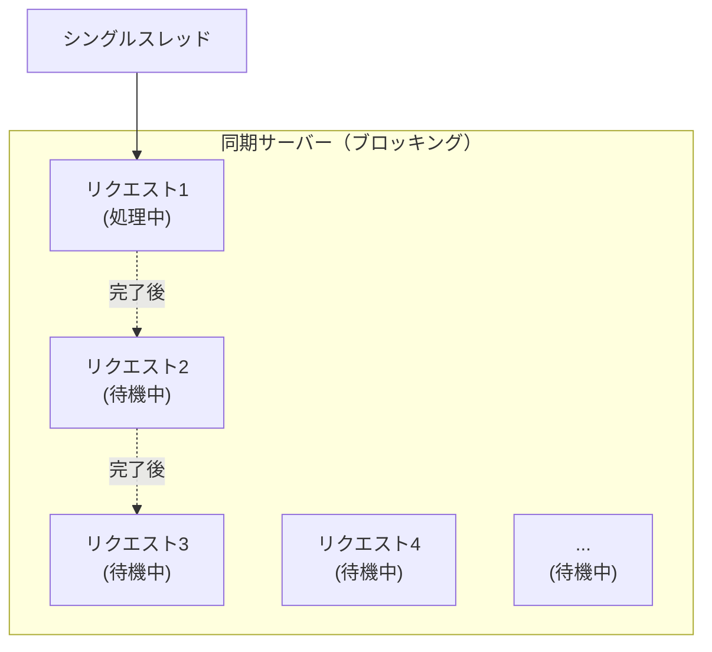
```mermaid
flowchart TB
    subgraph SYNC_SERVER["同期サーバー（ブロッキング）"]
        direction TB
        REQ1["リクエスト1<br/>(処理中)"]
        REQ2["リクエスト2<br/>(待機中)"]
        REQ3["リクエスト3<br/>(待機中)"]
        REQ4["リクエスト4<br/>(待機中)"]
        REQn["...<br/>(待機中)"]
    end
    
    THREAD["シングルスレッド"]
    
    THREAD --> REQ1
    REQ1 -.->|"完了後"| REQ2
    REQ2 -.->|"完了後"| REQ3
```

シングルスレッドのブロッキングサーバーでは、1つのリクエストを処理している間、他のすべてのリクエストは待機しなければなりません。各リクエストの処理に100ms（I/O含む）かかるとすると、1秒間に処理できるリクエストは最大10件です。

#### 問題3: 応答性の低下

GUIアプリケーションでブロッキング操作を行うと、ユーザーインターフェースがフリーズします。

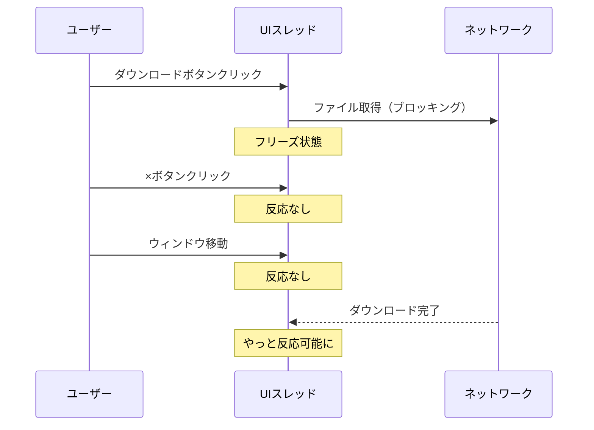
```mermaid
sequenceDiagram
    participant User as ユーザー
    participant UI as UIスレッド
    participant Network as ネットワーク
    
    User->>UI: ダウンロードボタンクリック
    UI->>Network: ファイル取得（ブロッキング）
    
    Note over UI: フリーズ状態
    User->>UI: ×ボタンクリック
    Note over UI: 反応なし
    User->>UI: ウィンドウ移動
    Note over UI: 反応なし
    
    Network-->>UI: ダウンロード完了
    Note over UI: やっと反応可能に
```

ユーザーは「アプリケーションが固まった」と感じ、場合によってはアプリケーションを強制終了してしまいます。

### 「1リクエスト1スレッド」モデル

ブロッキング操作の問題を解決する古典的な方法は、リクエストごとに新しいスレッドを作成することです。

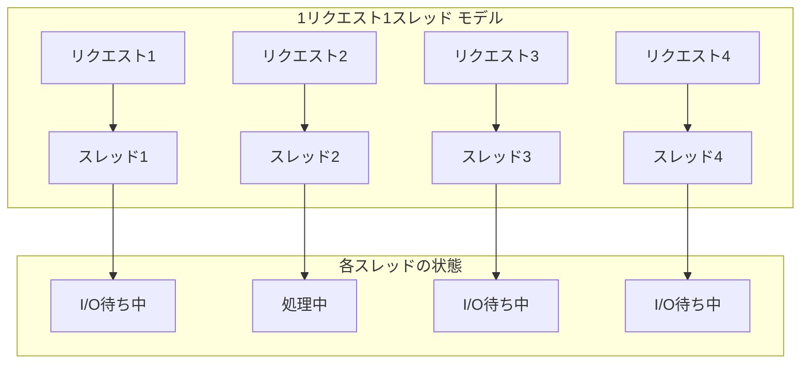
```mermaid
flowchart TB
    subgraph THREAD_PER_REQUEST["1リクエスト1スレッド モデル"]
        REQ1["リクエスト1"] --> T1["スレッド1"]
        REQ2["リクエスト2"] --> T2["スレッド2"]
        REQ3["リクエスト3"] --> T3["スレッド3"]
        REQ4["リクエスト4"] --> T4["スレッド4"]
    end
    
    subgraph STATE["各スレッドの状態"]
        T1 --> S1["I/O待ち中"]
        T2 --> S2["処理中"]
        T3 --> S3["I/O待ち中"]
        T4 --> S4["I/O待ち中"]
    end
```

このモデルでは、あるスレッドがI/Oでブロックしても、他のスレッドは処理を続けられます。しかし、このアプローチには問題があります。

#### スレッドのオーバーヘッド

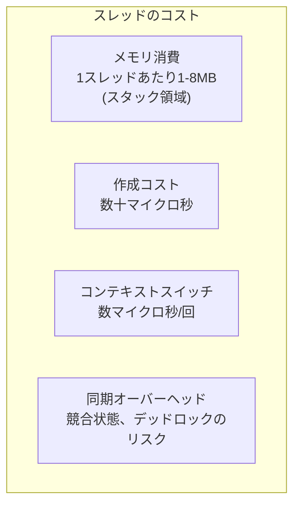
```mermaid
flowchart TB
    subgraph THREAD_COST["スレッドのコスト"]
        MEM["メモリ消費<br/>1スレッドあたり1-8MB<br/>(スタック領域)"]
        CREATE["作成コスト<br/>数十マイクロ秒"]
        SWITCH["コンテキストスイッチ<br/>数マイクロ秒/回"]
        SYNC["同期オーバーヘッド<br/>競合状態、デッドロックのリスク"]
    end
```

**メモリ消費**: 各スレッドはスタック用のメモリ（デフォルトで1-8MB）を必要とします。1000スレッドでは1-8GBのメモリが必要です。

**コンテキストスイッチ**: 多数のスレッドがあると、OSはそれらを頻繁に切り替える必要があります。これはCPU時間を消費します。

**C10K問題**: 10,000の同時接続を処理するサーバーを構築しようとすると、1接続1スレッドモデルでは限界に達します。これは2000年代初頭に認識された問題で、**C10K問題**として知られています。

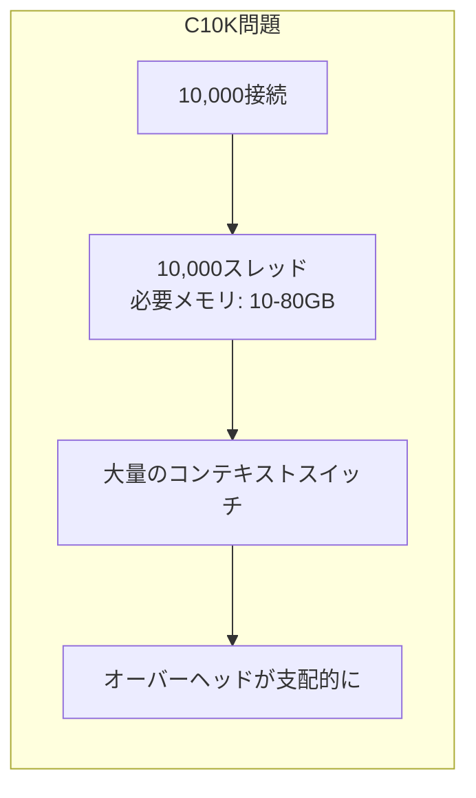
```mermaid
flowchart LR
    subgraph C10K["C10K問題"]
        CONN["10,000接続"]
        THREADS["10,000スレッド\n必要メモリ: 10-80GB"]
        SWITCHES["大量のコンテキストスイッチ"]
        OVERHEAD["オーバーヘッドが支配的に"]
    end
    
    CONN --> THREADS --> SWITCHES --> OVERHEAD
```

この問題を解決するために、非同期I/Oとイベント駆動プログラミングが発展しました。

---

## 3.4 待ち時間の問題

### 待ち時間はどこで発生するか

プログラムの実行において、待ち時間はさまざまな場所で発生します。

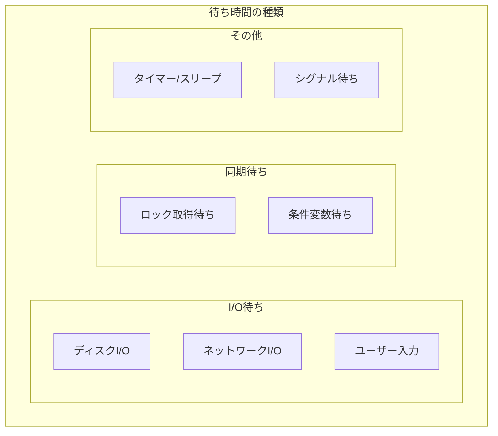
```mermaid
flowchart TB
    subgraph WAIT_TYPES["待ち時間の種類"]
        subgraph IO_WAIT["I/O待ち"]
            DISK["ディスクI/O"]
            NET["ネットワークI/O"]
            USER["ユーザー入力"]
        end
        
        subgraph SYNC_WAIT["同期待ち"]
            LOCK["ロック取得待ち"]
            COND["条件変数待ち"]
        end
        
        subgraph OTHER["その他"]
            TIMER["タイマー/スリープ"]
            SIGNAL["シグナル待ち"]
        end
    end
```

これらの待ち時間が積み重なると、アプリケーションのパフォーマンスに大きな影響を与えます。

### 待ち時間の連鎖

実際のアプリケーションでは、複数のI/O操作が連続して発生することがよくあります。

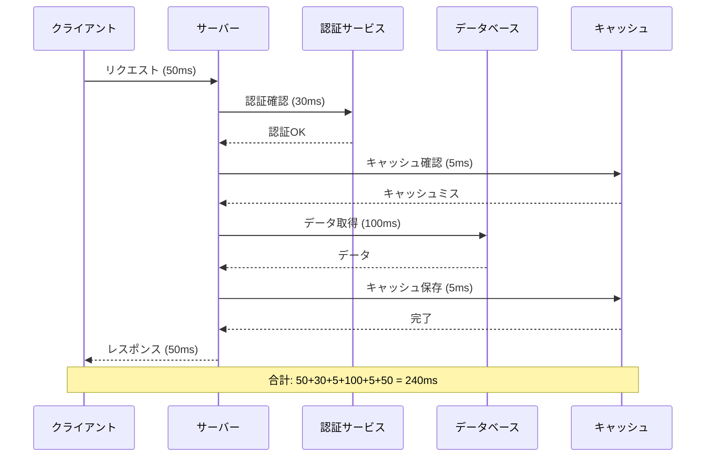
```mermaid
sequenceDiagram
    participant Client as クライアント
    participant Server as サーバー
    participant Auth as 認証サービス
    participant DB as データベース
    participant Cache as キャッシュ
    
    Client->>Server: リクエスト (50ms)
    Server->>Auth: 認証確認 (30ms)
    Auth-->>Server: 認証OK
    Server->>Cache: キャッシュ確認 (5ms)
    Cache-->>Server: キャッシュミス
    Server->>DB: データ取得 (100ms)
    DB-->>Server: データ
    Server->>Cache: キャッシュ保存 (5ms)
    Cache-->>Server: 完了
    Server-->>Client: レスポンス (50ms)
    
    Note over Client,Cache: 合計: 50+30+5+100+5+50 = 240ms
```

この例では、シンプルなリクエストでも240msの待ち時間が発生しています。しかも、これらの操作はすべて**逐次的に**実行されており、並行して実行できるものもあるはずです。

### 待ち時間の改善アプローチ

待ち時間を改善するには、いくつかのアプローチがあります。

#### アプローチ1: キャッシュの活用

頻繁にアクセスされるデータをメモリにキャッシュすることで、I/O操作を避けることができます。

```mermaid
flowchart LR
    subgraph CACHING["キャッシュ戦略"]
        REQ["リクエスト"]
        CHECK["キャッシュ確認<br/>(1ms)"]
        HIT["キャッシュヒット"]
        MISS["キャッシュミス"]
        DB["DB取得<br/>(100ms)"]
        STORE["キャッシュ保存"]
        RESP["レスポンス"]
    end
    
    REQ --> CHECK
    CHECK -->|"ヒット"| HIT --> RESP
    CHECK -->|"ミス"| MISS --> DB --> STORE --> RESP
```

キャッシュヒット時は1msで完了しますが、キャッシュミス時は100ms以上かかります。キャッシュヒット率を高く保つことが重要です。

#### アプローチ2: 並列I/O

独立した複数のI/O操作は、並列に実行することで合計待ち時間を短縮できます。

```mermaid
sequenceDiagram
    participant App as アプリケーション
    participant API1 as API 1
    participant API2 as API 2
    participant API3 as API 3
    
    rect rgb(255, 235, 238)
        Note over App,API3: 逐次実行（合計: 300ms）
        App->>API1: リクエスト
        API1-->>App: 応答 (100ms)
        App->>API2: リクエスト
        API2-->>App: 応答 (100ms)
        App->>API3: リクエスト
        API3-->>App: 応答 (100ms)
    end
    
    rect rgb(232, 245, 233)
        Note over App,API3: 並列実行（合計: 100ms）
        par
            App->>API1: リクエスト
            App->>API2: リクエスト
            App->>API3: リクエスト
        end
        API1-->>App: 応答
        API2-->>App: 応答
        API3-->>App: 応答
    end
```

3つの独立したAPI呼び出しを並列に実行することで、待ち時間を300msから100msに短縮できます。これは非同期処理の主要なユースケースの1つです。

#### アプローチ3: 非同期/ノンブロッキングI/O

I/O完了を待たずに他の処理を進め、完了時にコールバックで通知を受けるアプローチです。

```mermaid
sequenceDiagram
    participant App as アプリケーション
    participant EvLoop as イベントループ
    participant IO as I/Oシステム
    
    App->>IO: ノンブロッキング読み取り開始
    IO-->>App: 即座に戻る（ブロックしない）
    
    App->>App: 他の処理を実行
    App->>App: さらに他の処理
    
    IO-->>EvLoop: I/O完了通知
    EvLoop->>App: コールバック呼び出し
    App->>App: 読み取りデータを処理
```

このアプローチでは、I/O待ち中に他の処理を行えるため、CPUを効率的に使用できます。

### 待ち時間と非同期処理の関係

非同期処理の核心は、**待ち時間を有効活用する**ことです。

```mermaid
flowchart LR
    subgraph SYNC["同期処理"]
        S1["処理A"] --> S2["I/O待ち<br/>(無駄な時間)"] --> S3["処理B"]
    end
    
    subgraph ASYNC["非同期処理"]
        A1["処理A開始"]
        A2["I/O開始<br/>(待たない)"]
        A3["処理B実行"]
        A4["処理C実行"]
        A5["I/O完了<br/>コールバック"]
        A6["処理A続き"]
        
        A1 --> A2 --> A3 --> A4
        A2 -.->|"完了通知"| A5 --> A6
    end
    
    style S2 fill:#ffcdd2
    style A3 fill:#c8e6c9
    style A4 fill:#c8e6c9
```

同期処理ではI/O待ち中はCPUがアイドル状態になりますが、非同期処理ではその時間を使って別の処理を進めることができます。

### 現実世界での待ち時間の例

実際のアプリケーションで遭遇する待ち時間の例を見てみましょう。

```mermaid
flowchart TB
    subgraph EXAMPLES["実際のアプリケーションでの待ち時間"]
        subgraph WEB["Webアプリケーション"]
            W1["データベースクエリ: 5-100ms"]
            W2["外部API呼び出し: 50-500ms"]
            W3["ファイルアップロード: 100ms-数秒"]
        end
        
        subgraph MOBILE["モバイルアプリ"]
            M1["サーバー通信: 100-1000ms"]
            M2["GPS位置取得: 100-5000ms"]
            M3["カメラ処理: 50-500ms"]
        end
        
        subgraph DESKTOP["デスクトップアプリ"]
            D1["ファイル読み書き: 1-1000ms"]
            D2["印刷処理: 1-10秒"]
            D3["ユーザー入力: 無限"]
        end
    end
```

これらの待ち時間がアプリケーションをブロックすると、ユーザー体験が大きく損なわれます。非同期処理を使うことで、これらの操作を待っている間もアプリケーションを応答可能に保つことができます。

---

## 3.5 まとめ

この章では、I/O操作の特性とブロッキングの問題について学びました。

```mermaid
mindmap
    root((第3章のまとめ))
        I/Oバウンド vs CPUバウンド
            CPUバウンド: 計算が支配的
            I/Oバウンド: 待ち時間が支配的
            判断方法: CPU使用率
        なぜI/Oは遅いのか
            物理的距離
            機械的制約
            プロトコルオーバーヘッド
            速度差: 数百万倍
        ブロッキング
            定義: 完了まで停止
            問題: CPU浪費
            問題: スケーラビリティ
            C10K問題
        待ち時間
            連鎖する待ち
            改善: キャッシュ
            改善: 並列I/O
            改善: 非同期処理
```

### 重要なポイント

#### 1. I/Oバウンドな処理が非同期処理の主なターゲット

多くのアプリケーション、特にWebアプリケーションやネットワークアプリケーションは、I/Oバウンドです。これらのアプリケーションでは、CPUの大半の時間がI/O待ちに費やされています。

非同期処理は、このI/O待ち時間を有効活用するための技術です。CPUバウンドな処理に対しては、非同期処理よりも並列処理（マルチスレッド、マルチプロセス）の方が効果的です。

#### 2. I/OはCPUより数百万倍遅い

CPUから見ると、ネットワーク通信やディスクI/Oは信じられないほど遅いです。CPU演算を1秒に換算すると、SSDアクセスは4日、インターネット通信は10年に相当します。

この速度差を理解することで、なぜ非同期処理が必要なのかが明確になります。I/Oを待っている間、CPUは膨大な量の計算を行うことができるのです。

#### 3. ブロッキングI/Oは資源を浪費する

ブロッキングI/Oでは、I/O完了を待っている間、スレッドは何もできません。1リクエスト1スレッドモデルでは、多数の同時接続を処理するために大量のスレッドが必要になり、メモリとコンテキストスイッチのオーバーヘッドが問題になります。

#### 4. 待ち時間は改善できる

- **キャッシュ**: 頻繁なI/Oを避ける
- **並列I/O**: 独立した操作を同時に実行
- **非同期/ノンブロッキングI/O**: 待ち時間中に他の処理を実行

これらのアプローチを適切に組み合わせることで、アプリケーションのパフォーマンスを大幅に改善できます。

#### 5. 非同期処理は「待ち時間を有効活用する」技術

非同期処理の本質は、I/O操作の完了を待っている間に、他の処理を進めることです。これにより、限られたリソース（スレッド、メモリ）で多数の並行操作を効率的に処理できます。

---

## 📝 練習問題

1. **あなたが開発しているプログラムがCPUバウンドかI/Oバウンドかを判断する方法を説明してください。両方の特性を持つプログラムの場合、どのようにアプローチしますか？**
   
   ヒント：プロファイリングツール、CPU使用率、ボトルネックの特定について考えてください。

2. **SSDの読み取り速度がHDDの100倍だとしても、なぜ「I/Oは遅い」と言われるのですか？CPUの処理速度と比較して説明してください。**
   
   ヒント：この章で示した時間の換算表を参考にしてください。

3. **1秒間に10,000リクエストを処理するWebサーバーを構築する必要があります。1リクエストあたりのデータベースアクセスに10msかかるとします。ブロッキングI/Oを使用する場合と非同期I/Oを使用する場合で、必要なリソースを比較してください。**
   
   ヒント：同時に処理中のリクエスト数、必要なスレッド数、メモリ消費量を計算してください。

4. **GUIアプリケーションで、ボタンクリック時に大きなファイルをダウンロードする機能を実装します。ブロッキングで実装した場合の問題点と、それを解決するための方法を説明してください。**
   
   ヒント：ユーザー体験、UIスレッドのブロック、解決策（スレッド、非同期処理）について考えてください。

5. **キャッシュ、並列I/O、非同期I/Oのそれぞれが効果的な場面を具体的に説明してください。これらを組み合わせて使用する場合のベストプラクティスは何ですか？**
   
   ヒント：それぞれの技術が解決する問題の違いと、相互補完的な関係について考えてください。

---

## 🔗 次の章へ

[第4章: 同期処理と非同期処理](./04-sync-async.md) では、同期処理と非同期処理の違いを正確に定義し、並行（Concurrent）と並列（Parallel）の違いを学びます。非同期処理がなぜ必要なのかを、より深く理解していきます。

---

[← 目次に戻る](../index.md) | [← 前章: プロセスとスレッド](./02-process-thread.md)

