# 第4章: 同期処理と非同期処理

> 🎯 **この章の目標**: 同期処理と非同期処理の違いを正確に定義し、並行（Concurrent）と並列（Parallel）の概念を理解する

---

## 4.1 同期処理の定義と特徴

### 同期処理とは

**同期処理（Synchronous Processing）** とは、処理が順番に、一つずつ実行される方式です。ある処理が完了するまで、次の処理は開始されません。プログラムの実行フローは、上から下へと直線的に進みます。

「同期」という言葉は、ギリシャ語の「syn（一緒に）」と「chronos（時間）」に由来します。つまり、「時間を合わせる」という意味があります。同期処理では、呼び出し側と呼び出された側が**時間を合わせて**動作します。呼び出し側は、呼び出された処理が完了するまで待機するのです。

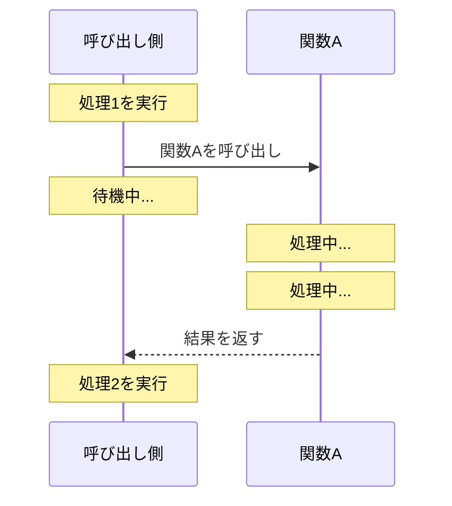
```mermaid
sequenceDiagram
    participant Caller as 呼び出し側
    participant Function as 関数A
    
    Note over Caller: 処理1を実行
    Caller->>Function: 関数Aを呼び出し
    Note over Caller: 待機中...
    Note over Function: 処理中...
    Note over Function: 処理中...
    Function-->>Caller: 結果を返す
    Note over Caller: 処理2を実行
```

この図は同期処理の本質を示しています。呼び出し側は関数Aを呼び出した後、その結果が返ってくるまで**ブロック**されます。関数Aの処理が完了して初めて、次の処理2に進むことができます。

### 同期処理の具体例

日常生活で同期処理に例えられるのは、「電話」です。電話をかけると、相手が出るまで待ち、会話が終わるまでその場から動けません。電話が終わって初めて、次の行動に移れます。

```python
# Python での同期処理の例
def read_file(filename):
    print(f"ファイル {filename} を読み込み中...")
    with open(filename, 'r') as f:
        content = f.read()  # ← ファイル読み込みが完了するまで待機
    print(f"ファイル {filename} の読み込み完了")
    return content

def process_data(data):
    print("データを処理中...")
    result = data.upper()  # ← 処理が完了するまで待機
    print("データ処理完了")
    return result

# 同期的な実行フロー
print("プログラム開始")
data = read_file("input.txt")    # ← ここで待機
result = process_data(data)       # ← ここで待機
print(f"結果: {result}")
print("プログラム終了")
```

このコードでは、各関数が順番に実行されます。`read_file`が完了するまで`process_data`は実行されず、すべてが順序通りに進みます。

### 同期処理の特徴

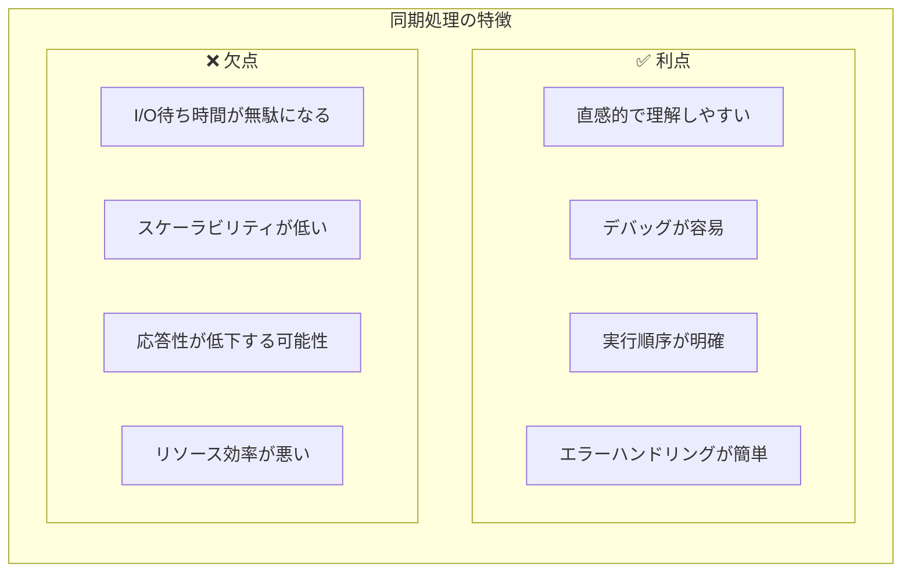
```mermaid
flowchart LR
    subgraph SYNC_FEATURES["同期処理の特徴"]
        subgraph PROS["✅ 利点"]
            P1["直感的で理解しやすい"]
            P2["デバッグが容易"]
            P3["実行順序が明確"]
            P4["エラーハンドリングが簡単"]
        end
        
        subgraph CONS["❌ 欠点"]
            C1["I/O待ち時間が無駄になる"]
            C2["スケーラビリティが低い"]
            C3["応答性が低下する可能性"]
            C4["リソース効率が悪い"]
        end
    end
```

#### 利点

**1. 直感的で理解しやすい**

同期処理は、人間の思考プロセスに近い形でコードを書けます。「Aをして、次にBをして、それからCをする」という自然な流れでプログラムを記述できます。

```python
# 読みやすく、追いやすいコード
result1 = step1()
result2 = step2(result1)
result3 = step3(result2)
final = step4(result3)
```

**2. デバッグが容易**

処理の順序が明確なので、問題が発生した場所を特定しやすいです。スタックトレースを見れば、どの関数のどの行で問題が起きたかがすぐにわかります。

**3. 実行順序が明確**

コードの記述順序がそのまま実行順序になるため、プログラムの動作を予測しやすいです。変数の値がいつ変更されるかが明確です。

**4. エラーハンドリングが簡単**

try-catch（try-except）で例外を捕捉するだけで、エラー処理ができます。

```python
try:
    data = read_file("input.txt")
    result = process_data(data)
    save_file("output.txt", result)
except FileNotFoundError:
    print("ファイルが見つかりません")
except Exception as e:
    print(f"エラーが発生しました: {e}")
```

#### 欠点

**1. I/O待ち時間が無駄になる**

第3章で学んだように、I/O操作を待っている間、CPUは何もしていません。

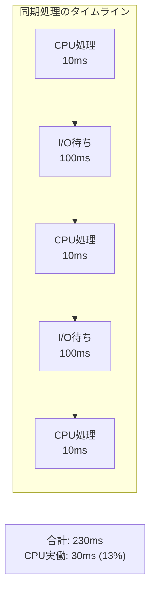
```mermaid
flowchart LR
    subgraph SYNC_TIMELINE["同期処理のタイムライン"]
        S1["CPU処理<br/>10ms"]
        S2["I/O待ち<br/>100ms"]
        S3["CPU処理<br/>10ms"]
        S4["I/O待ち<br/>100ms"]
        S5["CPU処理<br/>10ms"]
    end
    
    S1 --> S2 --> S3 --> S4 --> S5
    
    TOTAL["合計: 230ms<br/>CPU実働: 30ms (13%)"]
```

**2. スケーラビリティが低い**

シングルスレッドの同期処理では、一度に1つのリクエストしか処理できません。

**3. 応答性が低下する可能性**

GUIアプリケーションでは、長時間のI/O操作中にUIがフリーズします。

**4. リソース効率が悪い**

1つのタスクを処理している間、他のタスクを処理できないため、システムリソースが十分に活用されません。

### 同期処理が適している場面

同期処理には欠点がありますが、以下のような場面では同期処理が適切です：

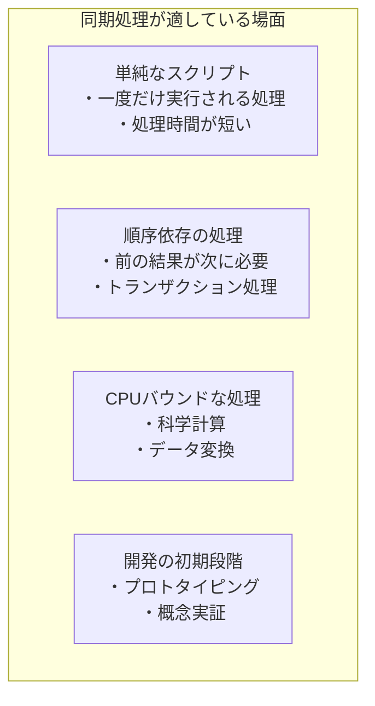
```mermaid
flowchart TB
    subgraph SYNC_USECASES["同期処理が適している場面"]
        UC1["単純なスクリプト<br/>・一度だけ実行される処理<br/>・処理時間が短い"]
        UC2["順序依存の処理<br/>・前の結果が次に必要<br/>・トランザクション処理"]
        UC3["CPUバウンドな処理<br/>・科学計算<br/>・データ変換"]
        UC4["開発の初期段階<br/>・プロトタイピング<br/>・概念実証"]
    end
```

- **単純なスクリプト**: バッチ処理や一度きりの変換作業
- **順序依存の処理**: データベーストランザクション、ファイルの読み込み→変換→書き込み
- **CPUバウンドな処理**: 計算が中心で、I/O待ちがほとんどない処理
- **開発の初期段階**: まずシンプルに動作するものを作り、後で最適化する

---

## 4.2 非同期処理の定義と特徴

### 非同期処理とは

**非同期処理（Asynchronous Processing）** とは、ある処理の完了を待たずに、次の処理を開始できる方式です。処理を開始した後、その完了を待機せずに他の作業を続け、処理が完了した時点で通知を受けて結果を処理します。

「非同期」は「synchronous」に否定の接頭辞「a-」がついた言葉で、「時間を合わせない」という意味になります。呼び出し側と呼び出された側が、それぞれ独立したタイミングで動作するのです。

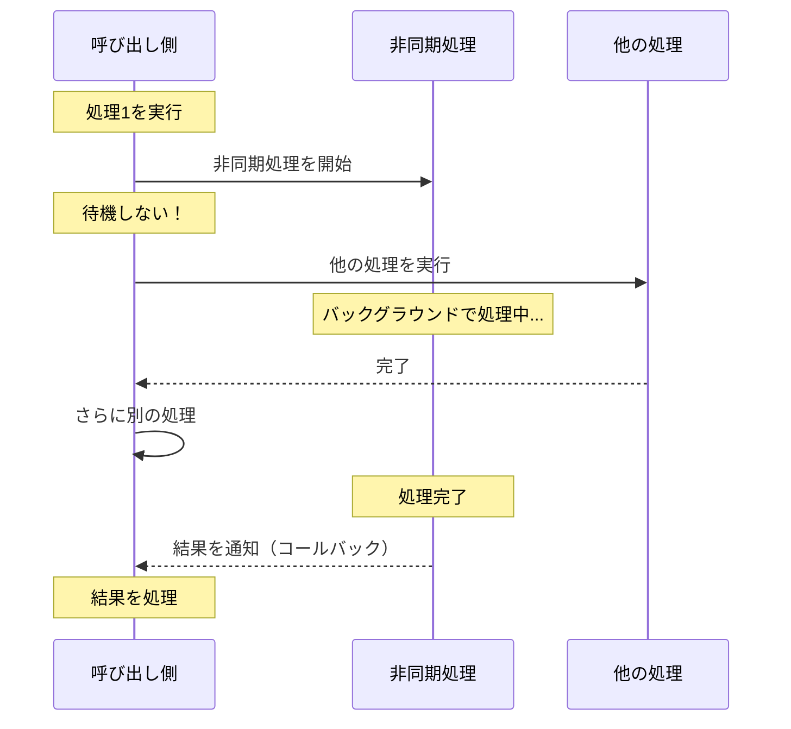
```mermaid
sequenceDiagram
    participant Caller as 呼び出し側
    participant Async as 非同期処理
    participant Other as 他の処理
    
    Note over Caller: 処理1を実行
    Caller->>Async: 非同期処理を開始
    Note over Caller: 待機しない！
    Caller->>Other: 他の処理を実行
    Note over Async: バックグラウンドで処理中...
    Other-->>Caller: 完了
    Caller->>Caller: さらに別の処理
    Note over Async: 処理完了
    Async-->>Caller: 結果を通知（コールバック）
    Note over Caller: 結果を処理
```

この図では、呼び出し側は非同期処理を開始した後、すぐに他の処理に進んでいます。非同期処理がバックグラウンドで実行されている間も、呼び出し側は別の作業を続けられます。処理が完了すると、コールバックやPromise/Futureなどの仕組みで通知を受け、結果を処理します。

### 非同期処理の日常的な例

非同期処理は、日常生活の「メール」に例えられます。メールを送信したら、返信を待っている間に他の仕事ができます。返信が届いたら通知を受け、その内容に対応します。電話（同期）とは対照的です。

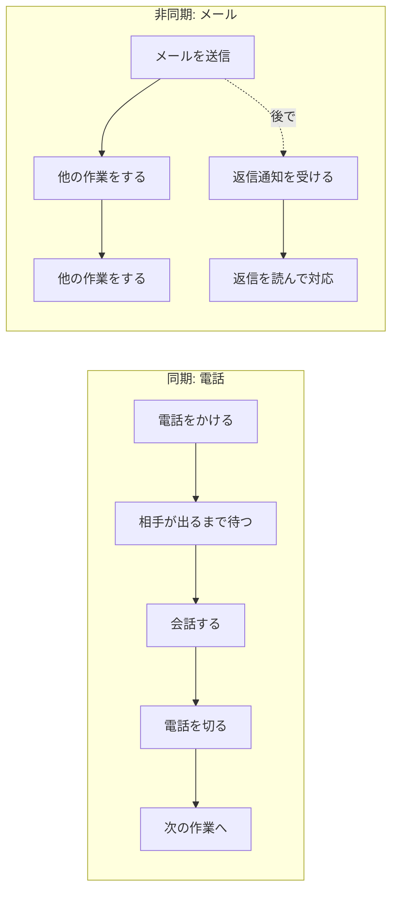
```mermaid
flowchart LR
    subgraph SYNC_PHONE["同期: 電話"]
        P1["電話をかける"]
        P2["相手が出るまで待つ"]
        P3["会話する"]
        P4["電話を切る"]
        P5["次の作業へ"]
    end
    
    P1 --> P2 --> P3 --> P4 --> P5
    
    subgraph ASYNC_EMAIL["非同期: メール"]
        E1["メールを送信"]
        E2["他の作業をする"]
        E3["他の作業をする"]
        E4["返信通知を受ける"]
        E5["返信を読んで対応"]
    end
    
    E1 --> E2 --> E3
    E1 -.->|"後で"| E4 --> E5
```

### 非同期処理の具体例

```javascript
// JavaScript での非同期処理の例（Promise/async-await）
async function fetchUserData(userId) {
    console.log(`ユーザー ${userId} のデータを取得中...`);
    const response = await fetch(`/api/users/${userId}`);
    const data = await response.json();
    console.log(`ユーザー ${userId} のデータ取得完了`);
    return data;
}

async function main() {
    console.log("プログラム開始");
    
    // 3人のユーザーデータを並行して取得
    const promises = [
        fetchUserData(1),
        fetchUserData(2),
        fetchUserData(3)
    ];
    
    // すべての取得が完了するまで待機
    const results = await Promise.all(promises);
    
    console.log("全ユーザーのデータ取得完了:", results);
    console.log("プログラム終了");
}

main();
```

このコードでは、3人のユーザーデータを**同時に**取得しています。各リクエストが100ms かかるとすると、同期処理では300msかかりますが、この非同期処理では約100msで完了します。

### 非同期処理の特徴

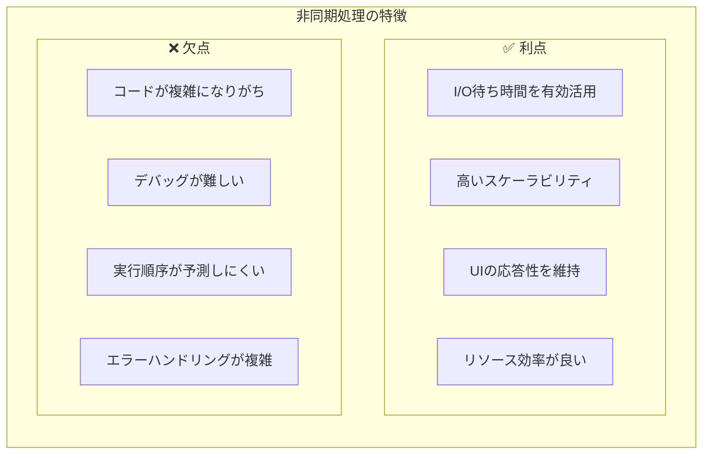
```mermaid
flowchart LR
    subgraph ASYNC_FEATURES["非同期処理の特徴"]
        subgraph PROS["✅ 利点"]
            P1["I/O待ち時間を有効活用"]
            P2["高いスケーラビリティ"]
            P3["UIの応答性を維持"]
            P4["リソース効率が良い"]
        end
        
        subgraph CONS["❌ 欠点"]
            C1["コードが複雑になりがち"]
            C2["デバッグが難しい"]
            C3["実行順序が予測しにくい"]
            C4["エラーハンドリングが複雑"]
        end
    end
```

#### 利点

**1. I/O待ち時間を有効活用**

I/O操作を待っている間に、他の処理を進められます。

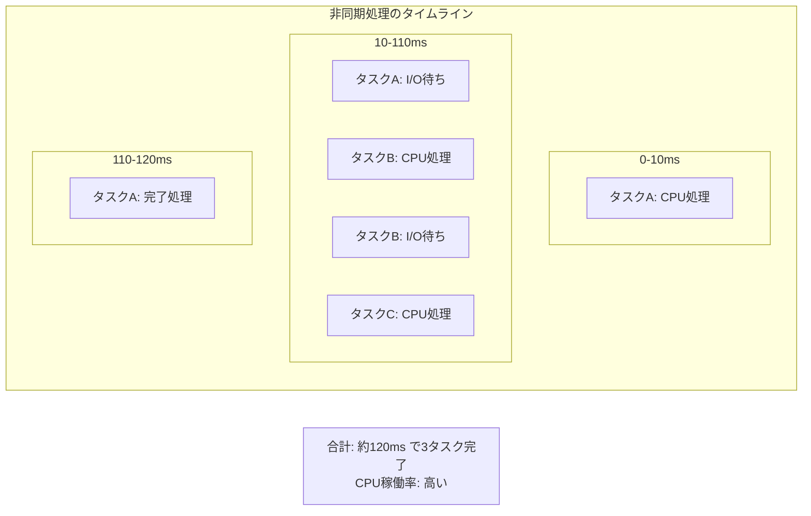
```mermaid
flowchart LR
    subgraph ASYNC_TIMELINE["非同期処理のタイムライン"]
        direction TB
        subgraph TIME1["0-10ms"]
            A1["タスクA: CPU処理"]
        end
        subgraph TIME2["10-110ms"]
            A2["タスクA: I/O待ち"]
            B1["タスクB: CPU処理"]
            B2["タスクB: I/O待ち"]
            C1["タスクC: CPU処理"]
        end
        subgraph TIME3["110-120ms"]
            A3["タスクA: 完了処理"]
        end
    end
    
    TOTAL["合計: 約120ms で3タスク完了<br/>CPU稼働率: 高い"]
```

**2. 高いスケーラビリティ**

少数のスレッドで多数の同時接続を処理できます。

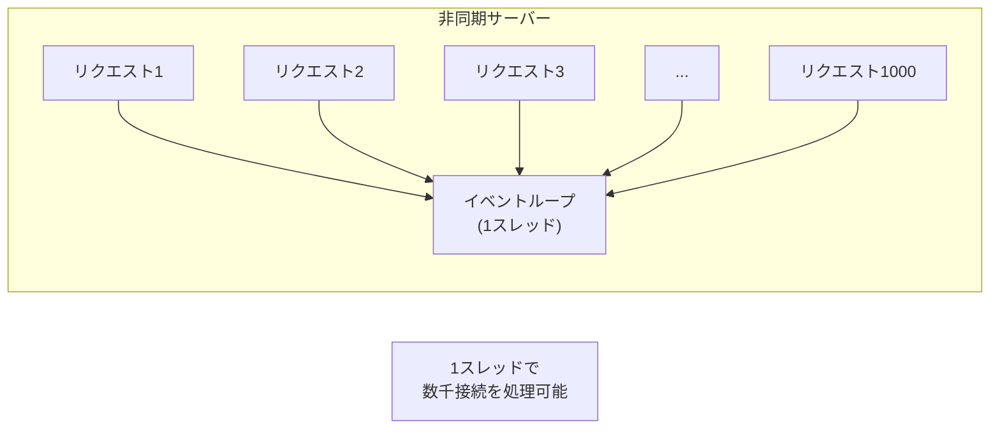
```mermaid
flowchart LR
    subgraph ASYNC_SERVER["非同期サーバー"]
        LOOP["イベントループ<br/>(1スレッド)"]
        
        REQ1["リクエスト1"]
        REQ2["リクエスト2"]
        REQ3["リクエスト3"]
        REQn["..."]
        REQ1000["リクエスト1000"]
    end
    
    REQ1 --> LOOP
    REQ2 --> LOOP
    REQ3 --> LOOP
    REQn --> LOOP
    REQ1000 --> LOOP
    
    NOTE["1スレッドで<br/>数千接続を処理可能"]
```

**3. UIの応答性を維持**

長時間のI/O操作中もUIが反応し続けます。

**4. リソース効率が良い**

スレッドプールのサイズを小さく保てるため、メモリ消費とコンテキストスイッチのオーバーヘッドを削減できます。

#### 欠点

**1. コードが複雑になりがち**

特にコールバックを多用すると、「コールバック地獄」と呼ばれる読みにくいコードになりがちです。

```javascript
// コールバック地獄の例（悪い例）
getUser(userId, function(user) {
    getOrders(user.id, function(orders) {
        getOrderDetails(orders[0].id, function(details) {
            getShippingStatus(details.shippingId, function(status) {
                console.log(status);
                // さらにネストが深くなる...
            });
        });
    });
});
```

現代の言語では、Promise/async-awaitなどの構文糖で改善されています。

```javascript
// async/await を使った改善例
async function getShippingStatusForUser(userId) {
    const user = await getUser(userId);
    const orders = await getOrders(user.id);
    const details = await getOrderDetails(orders[0].id);
    const status = await getShippingStatus(details.shippingId);
    return status;
}
```

**2. デバッグが難しい**

処理が非同期に実行されるため、スタックトレースが途切れ、問題の原因を追跡しにくくなることがあります。

**3. 実行順序が予測しにくい**

複数の非同期操作がどの順序で完了するかは、実行時の状況によって変わります。

```javascript
// 実行順序が保証されない例
console.log("1");
setTimeout(() => console.log("2"), 0);
Promise.resolve().then(() => console.log("3"));
console.log("4");

// 出力: 1, 4, 3, 2（環境により異なる場合もある）
```

**4. エラーハンドリングが複雑**

非同期処理のエラーは、適切に処理しないと「飲み込まれて」しまうことがあります。

```javascript
// エラーが無視される危険な例
fetchData().then(data => processData(data));
// エラーが発生しても誰も知らない

// 正しいエラーハンドリング
fetchData()
    .then(data => processData(data))
    .catch(error => console.error("エラー:", error));
```

### 非同期処理のパターン

非同期処理を実現するためのパターンは、歴史的に進化してきました。

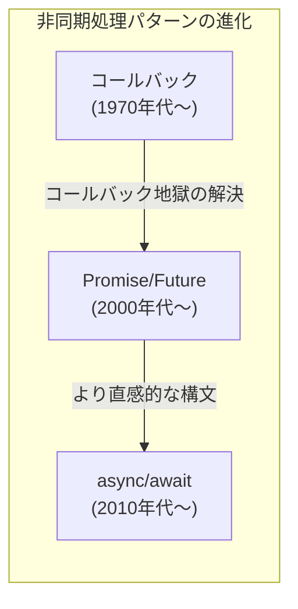
```mermaid
flowchart LR
    subgraph EVOLUTION["非同期処理パターンの進化"]
        CB["コールバック<br/>(1970年代〜)"]
        PROMISE["Promise/Future<br/>(2000年代〜)"]
        ASYNC["async/await<br/>(2010年代〜)"]
    end
    
    CB -->|"コールバック地獄の解決"| PROMISE
    PROMISE -->|"より直感的な構文"| ASYNC
```

これらの詳細は第5章で解説します。

---

## 4.3 並行（Concurrent）と並列（Parallel）

### 混同されやすい2つの概念

「並行」と「並列」は非常に混同されやすい概念ですが、厳密には異なる意味を持ちます。この違いを理解することは、非同期処理を正しく理解する上で非常に重要です。

### 並行（Concurrency）とは

**並行（Concurrency）** とは、複数のタスクが**論理的に同時に進行している**状態を指します。ただし、実際に同じ瞬間に実行されている必要はありません。

並行処理は、複数のタスクを**交互に少しずつ進める**ことで実現できます。シングルコアCPUでも、タスクを高速に切り替えることで、複数のタスクが同時に進んでいるように見せることができます。

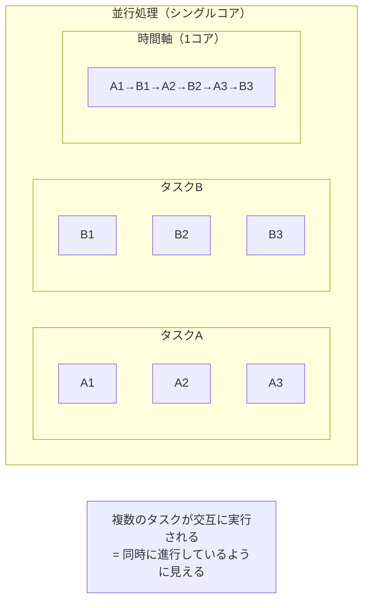
```mermaid
flowchart LR
    subgraph CONCURRENT["並行処理（シングルコア）"]
        direction LR
        subgraph T1["タスクA"]
            A1["A1"]
            A2["A2"]
            A3["A3"]
        end
        subgraph T2["タスクB"]
            B1["B1"]
            B2["B2"]
            B3["B3"]
        end
        subgraph TIMELINE["時間軸（1コア）"]
            TL["A1→B1→A2→B2→A3→B3"]
        end
    end
    
    NOTE["複数のタスクが交互に実行される<br/>= 同時に進行しているように見える"]
```

日常生活での例：料理をしながら洗濯機を回す。実際にはあなたは一度に一つのことしかできませんが、パスタを茹でている間に洗濯物を干しに行くなど、タスクを切り替えることで複数のことを「同時に」進められます。

### 並列（Parallelism）とは

**並列（Parallelism）** とは、複数のタスクが**物理的に同じ瞬間に実行されている**状態を指します。これには複数の実行ユニット（CPUコア、プロセッサなど）が必要です。

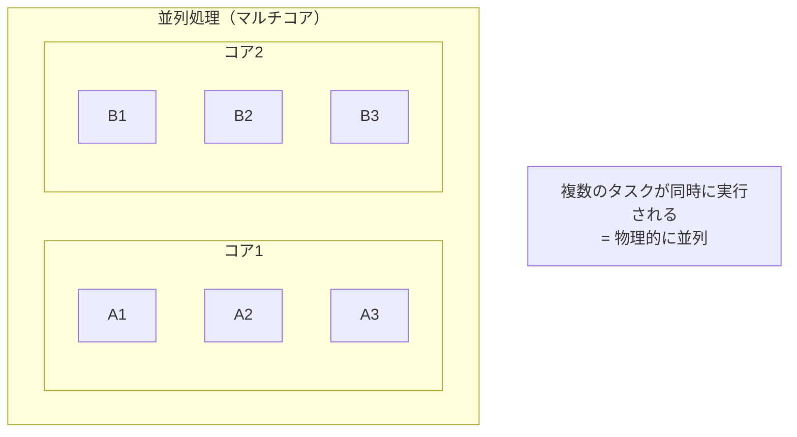
```mermaid
flowchart TB
    subgraph PARALLEL["並列処理（マルチコア）"]
        direction LR
        subgraph CORE1["コア1"]
            A1["A1"]
            A2["A2"]
            A3["A3"]
        end
        subgraph CORE2["コア2"]
            B1["B1"]
            B2["B2"]
            B3["B3"]
        end
    end
    
    NOTE["複数のタスクが同時に実行される<br/>= 物理的に並列"]
```

日常生活での例：2人で料理をする。1人がパスタを作り、もう1人がサラダを作る。物理的に同時に作業が進んでいます。

### 並行と並列の比較

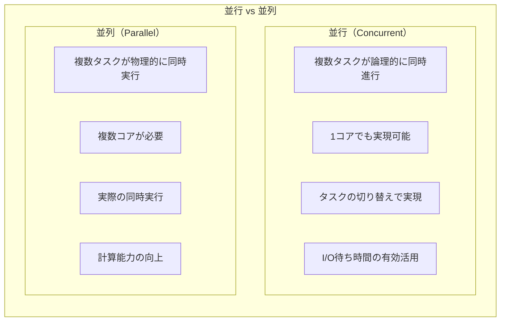
```mermaid
flowchart LR
    subgraph COMPARISON["並行 vs 並列"]
        subgraph CONCURRENT_BOX["並行（Concurrent）"]
            C1["複数タスクが論理的に同時進行"]
            C2["1コアでも実現可能"]
            C3["タスクの切り替えで実現"]
            C4["I/O待ち時間の有効活用"]
        end
        
        subgraph PARALLEL_BOX["並列（Parallel）"]
            P1["複数タスクが物理的に同時実行"]
            P2["複数コアが必要"]
            P3["実際の同時実行"]
            P4["計算能力の向上"]
        end
    end
```

| 特性 | 並行（Concurrent） | 並列（Parallel） |
|------|-------------------|-----------------|
| 定義 | 論理的に同時進行 | 物理的に同時実行 |
| 必要なハードウェア | 1コアでも可能 | 複数コアが必要 |
| 実現方法 | タスク切り替え、非同期I/O | マルチスレッド、マルチプロセス |
| 主な目的 | I/O待ちの有効活用、応答性向上 | 計算能力の向上 |
| 効果的な場面 | I/Oバウンドな処理 | CPUバウンドな処理 |

### 重要な関係性

並行と並列は排他的な概念ではありません。以下の4つの組み合わせが可能です。

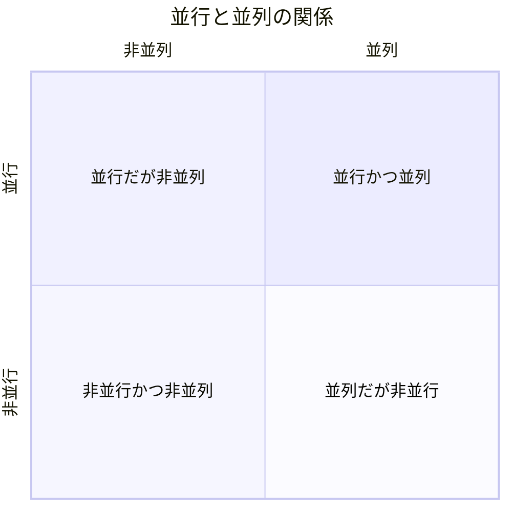
```mermaid
quadrantChart
    title 並行と並列の関係
    x-axis "非並列" --> "並列"
    y-axis "非並行" --> "並行"
    quadrant-1 "並行かつ並列"
    quadrant-2 "並行だが非並列"
    quadrant-3 "非並行かつ非並列"
    quadrant-4 "並列だが非並行"
```

**1. 非並行かつ非並列（Sequential）**

1つのタスクを1つのコアで順番に処理。最もシンプルな形式。

```
タスク: [A1][A2][A3]  →  完了
```

**2. 並行だが非並列（Concurrent but not Parallel）**

複数のタスクを1つのコアで交互に処理。Node.jsのイベントループがこれに該当。

```
コア1: [A1][B1][A2][B2][A3][B3]
```

**3. 並列だが非並行（Parallel but not Concurrent）**

複数のコアがそれぞれ1つのタスクを処理。各コアは1つのタスクだけを扱う。

```
コア1: [A1][A2][A3]
コア2: [B1][B2][B3]
```

**4. 並行かつ並列（Concurrent and Parallel）**

複数のコアがそれぞれ複数のタスクを交互に処理。最も高度な形式。

```
コア1: [A1][C1][A2][C2]
コア2: [B1][D1][B2][D2]
```

### プログラミングモデルとの関係

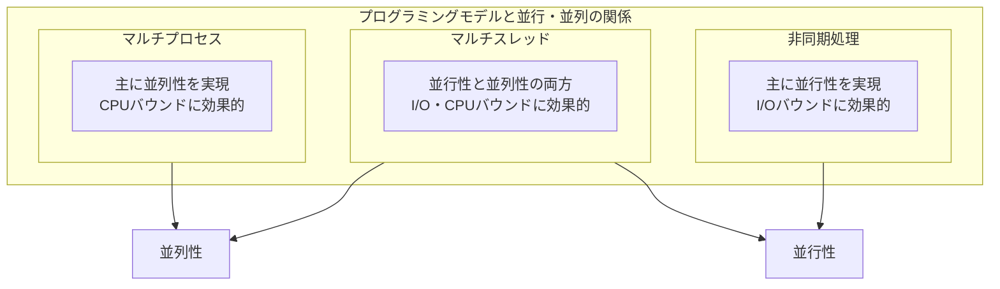
```mermaid
flowchart TB
    subgraph MODELS["プログラミングモデルと並行・並列の関係"]
        subgraph ASYNC["非同期処理"]
            ASYNC_DESC["主に並行性を実現\nI/Oバウンドに効果的"]
        end
        
        subgraph MT["マルチスレッド"]
            MT_DESC["並行性と並列性の両方\nI/O・CPUバウンドに効果的"]
        end
        
        subgraph MP["マルチプロセス"]
            MP_DESC["主に並列性を実現\nCPUバウンドに効果的"]
        end
    end
    
    ASYNC --> CONCURRENT["並行性"]
    MT --> CONCURRENT
    MT --> PARALLEL["並列性"]
    MP --> PARALLEL
```

**非同期処理**は主に**並行性**を実現します。1つのスレッドで複数のI/O操作を並行して処理できますが、CPUを使った計算は1つずつしか行えません。

**マルチスレッド**は**並行性と並列性の両方**を実現できます。複数のスレッドがI/Oを待つ間に他の処理を進め（並行性）、複数のコアで同時に計算を行う（並列性）ことができます。

**マルチプロセス**は主に**並列性**を実現します。各プロセスが別々のコアで実行されることで、真の並列処理が可能になります。

### Node.jsの例：並行だが並列ではない

Node.jsは典型的な「並行だが並列ではない」モデルです。

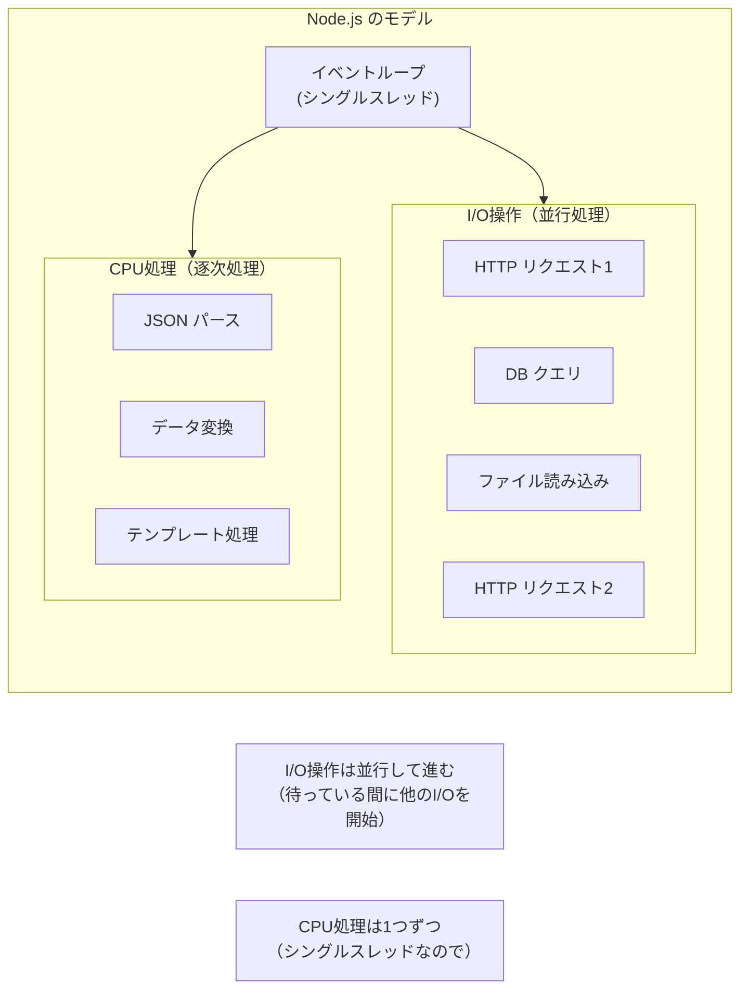
```mermaid
flowchart LR
    subgraph NODEJS["Node.js のモデル"]
        EL["イベントループ<br/>(シングルスレッド)"]
        
        subgraph IO["I/O操作（並行処理）"]
            IO1["HTTP リクエスト1"]
            IO2["DB クエリ"]
            IO3["ファイル読み込み"]
            IO4["HTTP リクエスト2"]
        end
        
        subgraph CPU["CPU処理（逐次処理）"]
            CPU1["JSON パース"]
            CPU2["データ変換"]
            CPU3["テンプレート処理"]
        end
    end
    
    EL --> IO
    EL --> CPU
    
    NOTE1["I/O操作は並行して進む<br/>（待っている間に他のI/Oを開始）"]
    NOTE2["CPU処理は1つずつ<br/>（シングルスレッドなので）"]
```

Node.jsでは、多数のI/O操作を並行して処理できますが、CPUを使った計算は1つのスレッドで順番に行われます。そのため、CPUバウンドな処理が長時間続くと、他のすべてのリクエストがブロックされてしまいます。

```javascript
// Node.js でのCPUバウンド処理の問題
app.get('/heavy-computation', (req, res) => {
    // この計算中、他のリクエストは処理されない！
    const result = performHeavyComputation();
    res.json({ result });
});

app.get('/simple', (req, res) => {
    // /heavy-computation が実行中だと、このリクエストも待たされる
    res.json({ message: 'Hello' });
});
```

この問題を解決するには、Worker Threads（Node.js）やWeb Workers（ブラウザ）を使って、重い計算を別のスレッドで実行する必要があります。

---

## 4.4 なぜ非同期処理が必要なのか

### 現代のアプリケーションが直面する課題

現代のアプリケーション、特にWebアプリケーションやネットワークサービスは、以下のような課題に直面しています。

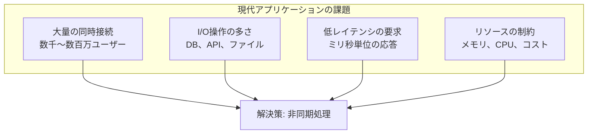
```mermaid
flowchart TB
    subgraph CHALLENGES["現代アプリケーションの課題"]
        CH1["大量の同時接続<br/>数千〜数百万ユーザー"]
        CH2["I/O操作の多さ<br/>DB、API、ファイル"]
        CH3["低レイテンシの要求<br/>ミリ秒単位の応答"]
        CH4["リソースの制約<br/>メモリ、CPU、コスト"]
    end
    
    CH1 --> SOLUTION["解決策: 非同期処理"]
    CH2 --> SOLUTION
    CH3 --> SOLUTION
    CH4 --> SOLUTION
```

### 課題1: 大量の同時接続

現代のWebサービスは、数千から数百万のユーザーが同時にアクセスする可能性があります。1接続1スレッドモデルでは、これに対応できません。

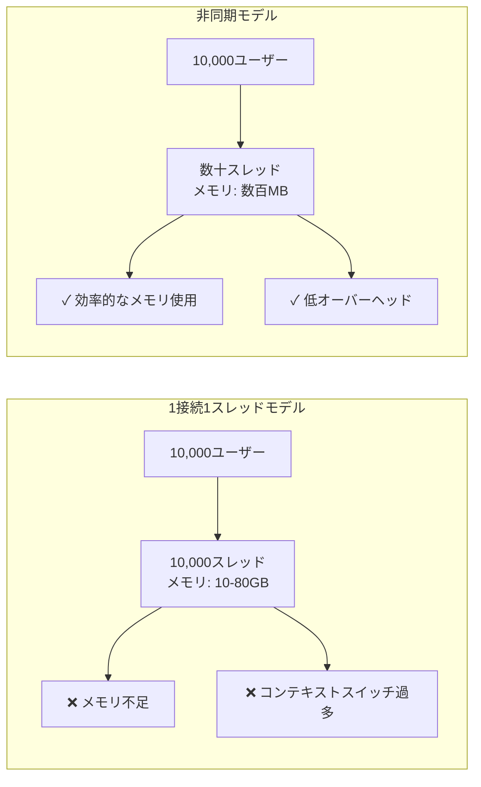
```mermaid
flowchart LR
    subgraph THREAD_MODEL["1接続1スレッドモデル"]
        USERS1["10,000ユーザー"]
        THREADS["10,000スレッド<br/>メモリ: 10-80GB"]
        PROBLEM1["❌ メモリ不足"]
        PROBLEM2["❌ コンテキストスイッチ過多"]
    end
    
    USERS1 --> THREADS --> PROBLEM1
    THREADS --> PROBLEM2
    
    subgraph ASYNC_MODEL["非同期モデル"]
        USERS2["10,000ユーザー"]
        FEW_THREADS["数十スレッド<br/>メモリ: 数百MB"]
        OK1["✓ 効率的なメモリ使用"]
        OK2["✓ 低オーバーヘッド"]
    end
    
    USERS2 --> FEW_THREADS --> OK1
    FEW_THREADS --> OK2
```

### 課題2: I/O操作の多さ

現代のアプリケーションは、多数のI/O操作を行います：

- データベースクエリ
- 外部API呼び出し
- ファイル読み書き
- キャッシュアクセス
- メッセージキュー

これらはすべてI/Oバウンドであり、待ち時間が発生します。同期処理では、この待ち時間がすべて無駄になります。

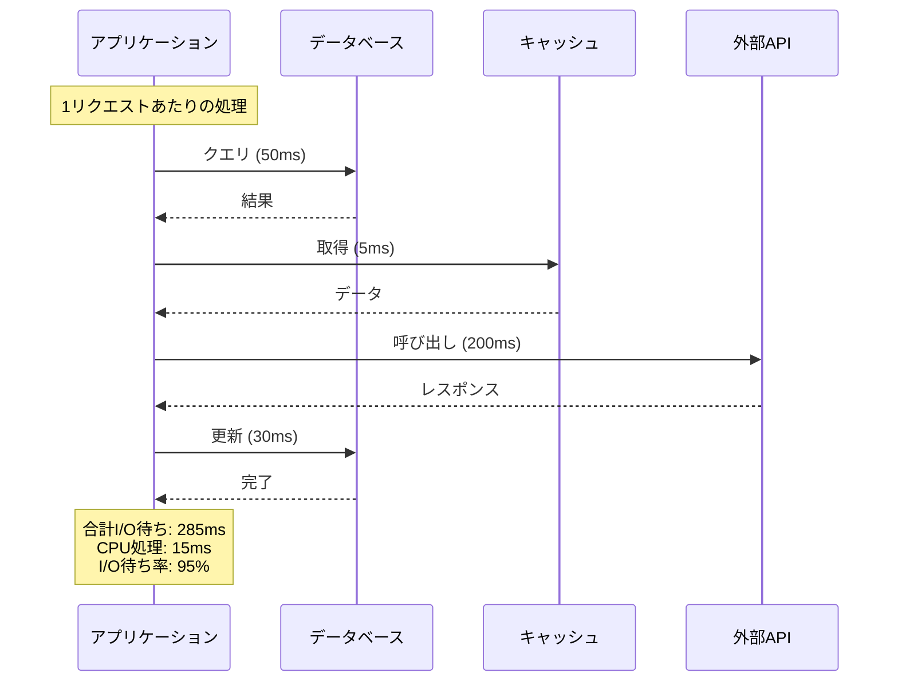
```mermaid
sequenceDiagram
    participant App as アプリケーション
    participant DB as データベース
    participant Cache as キャッシュ
    participant API as 外部API
    
    Note over App: 1リクエストあたりの処理
    
    App->>DB: クエリ (50ms)
    DB-->>App: 結果
    App->>Cache: 取得 (5ms)
    Cache-->>App: データ
    App->>API: 呼び出し (200ms)
    API-->>App: レスポンス
    App->>DB: 更新 (30ms)
    DB-->>App: 完了
    
    Note over App: 合計I/O待ち: 285ms<br/>CPU処理: 15ms<br/>I/O待ち率: 95%
```

### 課題3: 低レイテンシの要求

ユーザーは即座の応答を期待しています。Googleの調査によると、ページロード時間が3秒を超えると、53%のモバイルユーザーが離脱するとされています。

非同期処理により、以下のような最適化が可能になります：

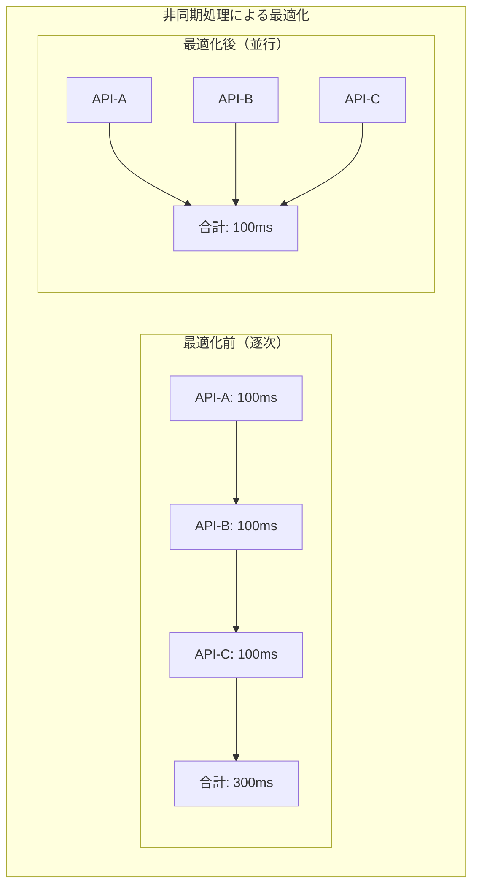
```mermaid
flowchart TD
    subgraph OPTIMIZATION["非同期処理による最適化"]
        subgraph BEFORE["最適化前（逐次）"]
            B1["API-A: 100ms"]
            B2["API-B: 100ms"]
            B3["API-C: 100ms"]
            BT["合計: 300ms"]
        end
        
        subgraph AFTER["最適化後（並行）"]
            A1["API-A"]
            A2["API-B"]
            A3["API-C"]
            AT["合計: 100ms"]
        end
    end
    
    B1 --> B2 --> B3 --> BT
    A1 --> AT
    A2 --> AT
    A3 --> AT
```

### 課題4: リソースの制約

サーバーリソース（メモリ、CPU）には限りがあり、クラウド環境ではコストに直結します。非同期処理により、同じリソースでより多くのリクエストを処理できます。

```mermaid
flowchart LR
    subgraph RESOURCE_COMPARISON["リソース効率の比較"]
        subgraph SYNC_RESOURCES["同期処理"]
            S_MEM["メモリ: 10GB<br/>（1000スレッド×10MB）"]
            S_CPU["CPU: 高負荷<br/>（コンテキストスイッチ）"]
            S_COST["コスト: 高い"]
        end
        
        subgraph ASYNC_RESOURCES["非同期処理"]
            A_MEM["メモリ: 500MB<br/>（少数スレッド）"]
            A_CPU["CPU: 効率的<br/>（I/O待ちなく稼働）"]
            A_COST["コスト: 低い"]
        end
    end
```

### 非同期処理が効果的な場面

```mermaid
flowchart TB
    subgraph EFFECTIVE["非同期処理が効果的な場面"]
        E1["🌐 Webサーバー<br/>大量の同時接続を処理"]
        E2["📱 モバイルアプリ<br/>UI応答性を維持"]
        E3["🔌 IoTシステム<br/>多数のデバイスからのデータ収集"]
        E4["📊 データパイプライン<br/>複数ソースからの並行取得"]
        E5["🎮 ゲームサーバー<br/>リアルタイム通信"]
    end
```

1. **Webサーバー**: 数千〜数百万の同時接続を少数のスレッドで処理
2. **モバイル/デスクトップアプリ**: 長時間のI/O操作中もUIを応答可能に保つ
3. **IoTシステム**: 多数のセンサー/デバイスからのデータを効率的に収集
4. **データパイプライン**: 複数のデータソースから並行してデータを取得・変換
5. **ゲームサーバー**: 大量のプレイヤーとのリアルタイム通信

### 非同期処理が効果的でない場面

非同期処理は万能ではありません。以下の場面では、他のアプローチの方が適切です。

```mermaid
flowchart TB
    subgraph NOT_EFFECTIVE["非同期処理が効果的でない場面"]
        N1["🔢 純粋なCPU計算<br/>→ 並列処理（マルチスレッド）が効果的"]
        N2["📝 単純なスクリプト<br/>→ 同期処理で十分"]
        N3["🔗 厳密な順序が必要<br/>→ 同期処理の方が安全"]
        N4["🏗️ プロトタイピング<br/>→ まず同期で実装"]
    end
```

1. **純粋なCPU計算**: 画像処理、科学計算などは、非同期ではなく並列処理（マルチスレッド/マルチプロセス）が効果的
2. **単純なスクリプト**: 一度きりのバッチ処理などは、同期処理で十分
3. **厳密な順序が必要**: トランザクション処理など、順序が重要な場合は同期処理の方が安全
4. **プロトタイピング**: まず動くものを作る段階では、同期処理の方がシンプル

### まとめ: いつ非同期処理を使うべきか

```mermaid
flowchart TB
    START["処理の特性を分析"]
    
    Q1{"I/Oバウンド？"}
    Q2{"同時接続数が多い？"}
    Q3{"応答性が重要？"}
    
    ASYNC["非同期処理を検討"]
    PARALLEL["並列処理を検討"]
    SYNC["同期処理で十分"]
    
    START --> Q1
    Q1 -->|"Yes"| Q2
    Q1 -->|"No"| PARALLEL
    Q2 -->|"Yes"| ASYNC
    Q2 -->|"No"| Q3
    Q3 -->|"Yes"| ASYNC
    Q3 -->|"No"| SYNC
```

非同期処理を使うべき条件：

1. **I/Oバウンドな処理**が主体である
2. **多数の同時接続/リクエスト**を処理する必要がある
3. **UIの応答性**を維持する必要がある
4. **リソース効率**が重要である

---

## 4.5 まとめ

この章では、同期処理と非同期処理の違い、そして並行と並列の概念を学びました。

```mermaid
mindmap
    root((第4章のまとめ))
        同期処理
            順次実行
            ブロッキング
            シンプルで理解しやすい
            I/O待ちが無駄に
        非同期処理
            I/O待ちを有効活用
            高スケーラビリティ
            コードが複雑に
            コールバック→Promise→async/await
        並行と並列
            並行: 論理的に同時進行
            並列: 物理的に同時実行
            非同期は主に並行性
            マルチスレッドは両方可能
        使い分け
            I/Oバウンド→非同期
            CPUバウンド→並列
            シンプルな処理→同期
```

### 重要なポイント

#### 1. 同期処理は直感的だが、I/O待ちで資源を浪費する

同期処理はコードが読みやすくデバッグしやすいですが、I/O操作を待っている間、スレッドは何もできません。これは特に、多数の同時接続を処理する必要があるサーバーアプリケーションで問題になります。

#### 2. 非同期処理はI/O待ち時間を有効活用する

非同期処理では、I/O操作の完了を待たずに他の処理を進められます。これにより、少数のスレッドで多数の並行操作を効率的に処理できます。ただし、コードが複雑になりがちで、デバッグが難しくなることがあります。

#### 3. 並行と並列は異なる概念

**並行（Concurrent）** は複数のタスクが論理的に同時に進行している状態で、シングルコアでも実現可能です。**並列（Parallel）** は複数のタスクが物理的に同時に実行されている状態で、複数のコアが必要です。

非同期処理は主に並行性を実現し、マルチスレッド/マルチプロセスは並列性を実現します。

#### 4. 適切なモデルは問題によって異なる

- **I/Oバウンドな処理** → 非同期処理が効果的
- **CPUバウンドな処理** → 並列処理（マルチスレッド/マルチプロセス）が効果的
- **シンプルな処理** → 同期処理で十分

問題の特性を理解し、適切なモデルを選択することが重要です。

---

## 📝 練習問題

1. **同期処理と非同期処理の違いを、日常生活の例を使って説明してください。電話とメール以外の例を考えてみましょう。**
   
   ヒント：レストランでの注文、病院の待合室、スーパーのレジなどを考えてみてください。

2. **並行（Concurrent）と並列（Parallel）の違いを説明してください。シングルコアCPUでも並行処理は可能ですが、並列処理はなぜ不可能なのですか？**
   
   ヒント：「同時に見える」ことと「実際に同時」の違いを考えてください。

3. **Node.jsは「シングルスレッドで非同期」と言われますが、なぜ多数の同時接続を効率的に処理できるのですか？また、CPUバウンドな処理が問題になる理由は何ですか？**
   
   ヒント：イベントループ、I/O待ち、スレッドのブロックについて考えてください。

4. **あなたがWebサーバーを設計するとします。1秒間に1000リクエストを処理する必要があり、各リクエストは平均100msのデータベースアクセスを含みます。同期処理と非同期処理でそれぞれ必要なリソースを比較してください。**
   
   ヒント：同時に処理中のリクエスト数、必要なスレッド数、メモリ消費量を計算してください。

5. **非同期処理のデメリット（コードの複雑さ、デバッグの難しさ）を軽減するために、現代のプログラミング言語はどのような機能を提供していますか？**
   
   ヒント：Promise、async/await、構造化並行性（Structured Concurrency）などを調べてみてください。

---

## 🔗 次の章へ

[第5章: 非同期処理の歴史と進化](./05-history.md) では、非同期処理がどのように発展してきたかを学びます。割り込みの誕生からコールバック、Promise、async/awaitへの進化を追い、各アプローチの利点と課題を理解します。

---

[← 目次に戻る](../index.md) | [← 前章: I/O操作とブロッキング](./03-io-blocking.md)

