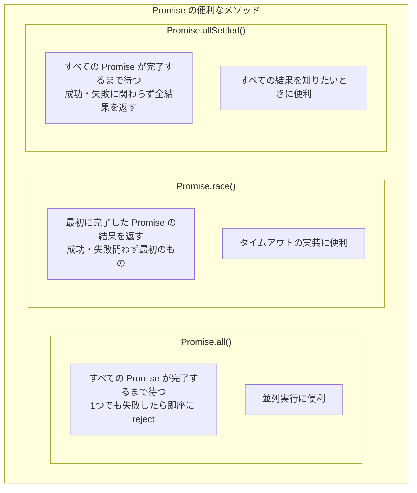

# 第5章: 非同期処理の歴史と進化

> 🎯 **この章の目標**: 非同期処理がどのように発展してきたかを学び、割り込みの誕生からコールバック、Promise、async/awaitへの進化を理解する

---

## 5.1 はじめに：なぜ歴史を学ぶのか

非同期処理の歴史を学ぶことは、単なる教養ではありません。なぜ現代の非同期処理がこのような形になっているのか、各手法の利点と欠点は何か、そしてどのような問題を解決しようとして進化してきたのかを理解することで、適切な技術選択ができるようになります。


この章では、コンピュータの黎明期から現代までの非同期処理の進化を追いかけ、各時代の課題とその解決策を詳しく解説します。

---

## 5.2 割り込み（Interrupt）の誕生

### 初期のコンピュータの課題

1950年代、初期のコンピュータはプログラムを順番に実行するだけの単純な機械でした。問題は、I/O操作（テープの読み取り、パンチカードの処理など）が非常に遅く、CPUはその完了を待っている間、何もできなかったことです。


この「ビジーウェイト（busy wait）」または「ポーリング（polling）」方式では、CPUは常にI/Oデバイスの状態をチェックし続ける必要がありました。これは、高価なCPU時間の著しい浪費でした。

### 割り込みの発明

1950年代後半、UNIVAC 1103Aで初めて**割り込み（Interrupt）**機構が導入されました。これは、コンピュータ科学における革命的な発明の一つです。

割り込みの基本的なアイデアは単純です：**I/Oデバイスが作業を完了したら、CPUに通知（割り込み）する**。これにより、CPUはI/O完了を待つ代わりに、他の作業を続けられるようになりました。


### 割り込みの仕組み

割り込みが発生すると、CPUは以下のステップを実行します：


1. **割り込み信号の検出**: 各命令の実行後、CPUは割り込み信号をチェックします
2. **状態の保存**: 現在実行中のプログラムの状態（レジスタ、プログラムカウンタなど）をスタックに保存します
3. **割り込みベクタの参照**: どの種類の割り込みかを特定し、対応するハンドラのアドレスを取得します
4. **ハンドラの実行**: 割り込みを処理するための特別なコード（割り込みハンドラ）を実行します
5. **状態の復元**: 保存した状態を復元し、元のプログラムに戻ります

### 割り込みの種類


**ハードウェア割り込み**は、物理的なデバイスからの信号によって発生します：

- **タイマー割り込み**: 一定時間ごとに発生し、OSのスケジューラがプロセスを切り替えるきっかけになります
- **I/O割り込み**: ディスク読み取り完了、ネットワークパケット到着などを通知します
- **外部割り込み**: 電源異常やハードウェアエラーなどの緊急事態を通知します

**ソフトウェア割り込み**は、プログラムによって意図的に発生させます：

- **システムコール**: ユーザープログラムがOSのサービスを要求するときに使用します
- **例外**: ゼロ除算、不正なメモリアクセスなどのエラー状態を処理します
- **トラップ**: デバッガのブレークポイントなどに使用します

### 割り込みの重要性

割り込みは、現代のコンピュータシステムの根幹を成す技術です。これがなければ、以下のことは不可能です：

1. **マルチタスキング**: タイマー割り込みにより、OSはプロセスを定期的に切り替えられます
2. **効率的なI/O**: I/O完了を待つ代わりに、他の処理を進められます
3. **リアルタイム応答**: 外部イベントに即座に反応できます
4. **リソースの共有**: 複数のプログラムがCPUを共有できます

割り込みは、**非同期処理のハードウェアレベルの基盤**です。すべての高レベルな非同期処理（コールバック、Promise、async/await）は、最終的にはこの割り込み機構の上に構築されています。

---

## 5.3 ポーリングモデル

### ポーリングとは

割り込みが発明される前（そして一部の状況では今でも）、**ポーリング（Polling）**が使用されていました。ポーリングとは、プログラムが定期的にデバイスやリソースの状態をチェックする方式です。


```c
// ポーリングの典型的なコード例（C言語）
while (1) {
    // デバイスの状態レジスタをチェック
    if (device_status_register & READY_FLAG) {
        // データが準備できた！処理を実行
        process_data(device_data_register);
        break;
    }
    // まだ準備できていない、少し待ってから再チェック
    // （または待たずにすぐ再チェック = ビジーウェイト）
}
```

### ポーリングの問題点


**1. CPUリソースの浪費**

ビジーウェイト（待機なしのポーリング）では、CPUは常にフル稼働で状態をチェックし続けます。これは電力消費と発熱の問題を引き起こし、他のタスクにCPUを使えなくなります。

**2. 応答遅延**

チェック間隔を長くすると（例えば100ms）、最悪の場合、イベントが発生してから検出まで100msかかります。間隔を短くするとCPU消費が増えるというトレードオフがあります。

**3. スケーラビリティの問題**

10個のソケット接続をポーリングするのは問題ありませんが、10,000個になると、各ソケットを順番にチェックするだけで大きなオーバーヘッドになります。

### 割り込み vs ポーリング


| 特性 | 割り込み | ポーリング |
|------|---------|-----------|
| CPU効率 | 高い（イベント時のみ） | 低い（常にチェック） |
| 応答速度 | 即座 | チェック間隔に依存 |
| 実装複雑度 | 高い | 低い |
| 高頻度イベント | オーバーヘッド大 | 効率的 |
| 低頻度イベント | 効率的 | 無駄が多い |

### ポーリングが今でも使われる場面

ポーリングは古い技術ですが、今でも特定の状況では有効です：

1. **高頻度イベント**: ゲームのメインループ、リアルタイムシステムなど、イベントが非常に頻繁に発生する場合
2. **簡単な組み込みシステム**: 割り込み処理の複雑さを避けたい小規模なシステム
3. **I/O多重化の内部**: `select()`や`poll()`は、複数のファイルディスクリプタを効率的にポーリングする仕組みです

---

## 5.4 シグナルとシグナルハンドラ

### UNIXシグナルの誕生

1970年代、UNIXオペレーティングシステムは**シグナル**という仕組みを導入しました。シグナルは、プロセス間通信とイベント通知のためのソフトウェアレベルの「割り込み」です。


シグナルは、ハードウェア割り込みのソフトウェア版と考えることができます。プロセスは通常の処理を実行中に、シグナルを受け取ると一時的に処理を中断し、登録されたシグナルハンドラを実行します。

### 主要なシグナル


### シグナルハンドラの実装

```c
// C言語でのシグナルハンドラの例
#include <signal.h>
#include <stdio.h>
#include <stdlib.h>

// シグナルハンドラ関数
void handle_sigint(int sig) {
    printf("\nSIGINT受信 (signal %d)\n", sig);
    printf("クリーンアップ処理を実行...\n");
    // リソースの解放など
    exit(0);
}

int main() {
    // SIGINTのハンドラを登録
    signal(SIGINT, handle_sigint);
    
    printf("Ctrl+C を押すとシグナルハンドラが呼ばれます\n");
    
    // 無限ループ（何かの処理をシミュレート）
    while (1) {
        printf("処理中...\n");
        sleep(1);
    }
    
    return 0;
}
```

### シグナルの問題点

シグナルは強力ですが、いくつかの問題があります：


**リエントラント問題**は特に重要です。シグナルハンドラは、プログラムの任意の時点で呼び出される可能性があります。例えば、`malloc()`を実行中にシグナルが発生し、ハンドラ内で再び`malloc()`を呼ぶと、データ構造が壊れる可能性があります。

```c
// 危険なシグナルハンドラの例
volatile sig_atomic_t got_signal = 0;

void bad_handler(int sig) {
    // 危険！printf は非同期シグナル安全ではない
    printf("シグナル受信\n");
    
    // 危険！malloc も非同期シグナル安全ではない
    char *buf = malloc(100);
}

void good_handler(int sig) {
    // 安全：フラグを立てるだけ
    got_signal = 1;
}
```

### シグナルと非同期処理の関係

シグナルは、非同期プログラミングの初期形態と言えます。現代のイベント駆動プログラミング、コールバックベースのI/Oは、シグナルの概念を発展させたものです。

しかし、シグナルの複雑さと危険性から、現代のアプリケーションでは、より安全で使いやすい抽象化（イベントループ、コールバック、Promise）が好まれるようになりました。

---

## 5.5 コールバック時代の到来

### イベント駆動プログラミングの誕生

1980年代〜1990年代、グラフィカルユーザーインターフェース（GUI）の普及に伴い、**イベント駆動プログラミング**が主流になりました。ユーザーのマウスクリック、キー入力などのイベントに応答するプログラムが必要になったのです。


このモデルでは、プログラムは「イベントループ」を実行し、イベントが発生するたびに対応するハンドラ（コールバック関数）を呼び出します。

### コールバックとは

**コールバック（Callback）**は、「後で呼び出される関数」です。ある処理が完了したときに実行される関数を、あらかじめ渡しておきます。

```javascript
// JavaScript でのコールバックの例
function fetchData(url, callback) {
    // 非同期でデータを取得
    const xhr = new XMLHttpRequest();
    xhr.open('GET', url);
    xhr.onload = function() {
        // 完了したらコールバックを呼び出す
        callback(null, xhr.responseText);
    };
    xhr.onerror = function() {
        // エラー時もコールバックを呼び出す
        callback(new Error('ネットワークエラー'), null);
    };
    xhr.send();
}

// 使用例
fetchData('https://api.example.com/data', function(error, data) {
    if (error) {
        console.error('エラー:', error);
    } else {
        console.log('データ:', data);
    }
});

console.log('この行は、データ取得を待たずに実行される');
```


### Node.js とコールバック

2009年に登場したNode.jsは、コールバックベースの非同期I/Oを核とする設計でした。Node.jsの「エラーファーストコールバック」規約は、コールバックパターンを標準化しました。

```javascript
// Node.js のエラーファーストコールバック規約
const fs = require('fs');

// ファイル読み込み（非同期）
fs.readFile('data.txt', 'utf8', function(error, data) {
    // 第1引数は常にエラー（または null）
    if (error) {
        console.error('ファイル読み込みエラー:', error);
        return;
    }
    // 第2引数以降が成功時のデータ
    console.log('ファイル内容:', data);
});

console.log('この行は、ファイル読み込みを待たずに実行される');
```

エラーファーストコールバックの規約：
1. コールバックの第1引数は常にエラーオブジェクト（成功時は`null`）
2. 成功時のデータは第2引数以降
3. コールバックは常に非同期に呼び出される

### コールバック地獄（Callback Hell）

コールバックの大きな問題は、**ネストが深くなる**ことです。複数の非同期操作を順番に実行する必要がある場合、コールバックがどんどんネストしていきます。

```javascript
// コールバック地獄の典型例
getUser(userId, function(error, user) {
    if (error) {
        handleError(error);
        return;
    }
    
    getOrders(user.id, function(error, orders) {
        if (error) {
            handleError(error);
            return;
        }
        
        getOrderDetails(orders[0].id, function(error, details) {
            if (error) {
                handleError(error);
                return;
            }
            
            getShippingStatus(details.shippingId, function(error, status) {
                if (error) {
                    handleError(error);
                    return;
                }
                
                updateUI(status, function(error) {
                    if (error) {
                        handleError(error);
                        return;
                    }
                    
                    console.log('完了！');
                    // さらにネストが続く...
                });
            });
        });
    });
});
```


### コールバック地獄の問題点


**1. 可読性の低下**

コードが右に深くインデントされていき、「ピラミッド」や「ドゥームオブドゥーム（doom of doom）」と呼ばれる形状になります。

**2. デバッグの困難**

非同期のコールバックは、新しいスタックフレームで実行されます。そのため、エラーが発生しても、どこから呼び出されたかの情報が失われます。

**3. エラー処理の複雑さ**

各コールバック内で個別にエラーチェックを行う必要があり、エラーを上位に伝播させるのが困難です。try-catchは非同期コールバック内のエラーをキャッチできません。

```javascript
// try-catch が効かない例
try {
    fetchData(url, function(error, data) {
        // このエラーは外側の try-catch では捕捉されない！
        throw new Error('予期しないエラー');
    });
} catch (e) {
    // このブロックは実行されない
    console.error('捕捉:', e);
}
```

**4. 制御フローの困難**

ループや条件分岐と組み合わせると、さらに複雑になります。

```javascript
// コールバック内でのループは非常に複雑
function processAllItems(items, callback) {
    let processed = 0;
    let results = [];
    
    items.forEach(function(item) {
        processItem(item, function(error, result) {
            if (error) {
                callback(error);
                return; // でも他の処理は止まらない！
            }
            
            results.push(result);
            processed++;
            
            if (processed === items.length) {
                callback(null, results);
            }
        });
    });
}
```

### コールバック地獄への対処法（Promise以前）

Promise登場前にも、コールバック地獄を軽減するためのパターンがありました：

**1. 名前付き関数への分割**

```javascript
// ネストを避けて、名前付き関数に分割
function handleUser(error, user) {
    if (error) return handleError(error);
    getOrders(user.id, handleOrders);
}

function handleOrders(error, orders) {
    if (error) return handleError(error);
    getOrderDetails(orders[0].id, handleDetails);
}

function handleDetails(error, details) {
    if (error) return handleError(error);
    getShippingStatus(details.shippingId, handleStatus);
}

// 開始
getUser(userId, handleUser);
```

**2. async.js などのフロー制御ライブラリ**

```javascript
// async.js を使った例
const async = require('async');

async.waterfall([
    function(callback) {
        getUser(userId, callback);
    },
    function(user, callback) {
        getOrders(user.id, callback);
    },
    function(orders, callback) {
        getOrderDetails(orders[0].id, callback);
    },
    function(details, callback) {
        getShippingStatus(details.shippingId, callback);
    }
], function(error, status) {
    if (error) {
        handleError(error);
    } else {
        console.log('ステータス:', status);
    }
});
```

これらの対処法は一定の効果がありましたが、根本的な解決には至りませんでした。そこで登場したのが、**Promise**です。

---

## 5.6 Promise/Future の登場

### Promise の概念

**Promise（またはFuture）**は、「将来のある時点で利用可能になる値」を表すオブジェクトです。1976年にDaniel P. Friedmanらによって提案された概念で、2010年代に多くのプログラミング言語で標準化されました。


Promiseは3つの状態を持ちます：

1. **Pending（保留中）**: 初期状態。まだ成功も失敗もしていない
2. **Fulfilled（履行済み）**: 操作が成功し、結果の値が利用可能
3. **Rejected（拒否済み）**: 操作が失敗し、エラーの理由が利用可能

一度FulfilledまたはRejectedになると、状態は変わりません（イミュータブル）。

### Promise の基本的な使い方

```javascript
// Promise を作成する
function fetchData(url) {
    return new Promise(function(resolve, reject) {
        const xhr = new XMLHttpRequest();
        xhr.open('GET', url);
        
        xhr.onload = function() {
            if (xhr.status === 200) {
                resolve(xhr.responseText);  // 成功
            } else {
                reject(new Error('HTTP ' + xhr.status));  // 失敗
            }
        };
        
        xhr.onerror = function() {
            reject(new Error('ネットワークエラー'));  // 失敗
        };
        
        xhr.send();
    });
}

// Promise を使用する
fetchData('https://api.example.com/data')
    .then(function(data) {
        console.log('データ:', data);
        return processData(data);  // 次の Promise を返す
    })
    .then(function(result) {
        console.log('処理結果:', result);
    })
    .catch(function(error) {
        console.error('エラー:', error);  // すべてのエラーをここで捕捉
    });
```

### Promise チェーン

Promiseの最大の利点は、**チェーン（連鎖）**できることです。`.then()`メソッドは新しいPromiseを返すため、連続した非同期操作をフラットに記述できます。


```javascript
// コールバック地獄を Promise チェーンで書き直す
getUser(userId)
    .then(function(user) {
        return getOrders(user.id);
    })
    .then(function(orders) {
        return getOrderDetails(orders[0].id);
    })
    .then(function(details) {
        return getShippingStatus(details.shippingId);
    })
    .then(function(status) {
        console.log('ステータス:', status);
    })
    .catch(function(error) {
        // どこでエラーが発生しても、ここで捕捉できる！
        console.error('エラー:', error);
    });
```

### コールバック vs Promise


| 特性 | コールバック | Promise |
|------|------------|---------|
| コード構造 | ネスト（ピラミッド） | フラット（チェーン） |
| エラー処理 | 各レベルで個別に | `.catch()`で一括 |
| 合成可能性 | 困難 | `Promise.all()`, `Promise.race()`など |
| 状態の可視性 | 不明確 | 明確（Pending/Fulfilled/Rejected） |
| キャンセル | 困難 | 困難（ただし改善の余地あり） |

### Promise の便利なメソッド



```javascript
// Promise.all() - 並列実行
const promises = [
    fetchUser(1),
    fetchUser(2),
    fetchUser(3)
];

Promise.all(promises)
    .then(function(users) {
        console.log('全ユーザー:', users);  // [user1, user2, user3]
    })
    .catch(function(error) {
        console.error('いずれかが失敗:', error);
    });

// Promise.race() - タイムアウトの実装
function fetchWithTimeout(url, timeout) {
    const fetchPromise = fetch(url);
    const timeoutPromise = new Promise(function(_, reject) {
        setTimeout(function() {
            reject(new Error('タイムアウト'));
        }, timeout);
    });
    
    return Promise.race([fetchPromise, timeoutPromise]);
}
```

### 様々な言語での Promise/Future

Promise/Futureの概念は、多くの言語で採用されています：


それぞれ構文や細かい動作は異なりますが、「将来の値を表す」という基本概念は共通しています。

---

## 5.7 async/await への進化

### Promise の残る課題

Promiseはコールバック地獄を大幅に改善しましたが、まだいくつかの課題がありました：

```mermaid
flowchart TB
    subgraph PROMISE_ISSUES["Promise の残る課題"]
        I1["📝 冗長な構文<br/>.then(() => { return ... })<br/>が繰り返される"]
        I2["🔄 条件分岐の複雑さ<br/>if文との組み合わせが<br/>難しい"]
        I3["🔁 ループの困難<br/>for文、while文との<br/>組み合わせが困難"]
        I4["🧠 思考モデルの違い<br/>同期的な思考から<br/>切り替えが必要"]
    end
```

```javascript
// Promise でも条件分岐は複雑
function processUser(userId) {
    return getUser(userId)
        .then(function(user) {
            if (user.isPremium) {
                return getPremiumContent(user.id)
                    .then(function(content) {
                        return { user: user, content: content };
                    });
            } else {
                return getFreeContent()
                    .then(function(content) {
                        return { user: user, content: content };
                    });
            }
        });
}
```

### async/await の登場

2015年以降、**async/await**構文が多くの言語で導入されました。これは、Promiseをより同期的な見た目で扱えるようにする構文糖（シンタックスシュガー）です。

```mermaid
timeline
    title async/await の導入時期
    2012 : C# 5.0 で async/await 導入
    2015 : Python 3.5 で async/await 導入
    2016 : JavaScript (ES2017) で async/await 導入
    2019 : Rust 1.39 で async/await 安定化
```

### async/await の基本

```javascript
// async 関数は常に Promise を返す
async function fetchData(url) {
    const response = await fetch(url);  // Promise の完了を待つ
    const data = await response.json();  // これも待つ
    return data;  // 自動的に Promise.resolve(data) になる
}

// 使用例
async function main() {
    try {
        const data = await fetchData('https://api.example.com/data');
        console.log('データ:', data);
    } catch (error) {
        console.error('エラー:', error);
    }
}

main();
```

```mermaid
sequenceDiagram
    participant Main as main()
    participant Fetch as fetchData()
    participant API as API

    Main->>Fetch: await fetchData(url)
    Note over Main: 一時停止（他のタスクは実行可能）
    Fetch->>API: await fetch(url)
    Note over Fetch: 一時停止
    API-->>Fetch: Response
    Fetch->>API: await response.json()
    Note over Fetch: 一時停止
    API-->>Fetch: JSON data
    Fetch-->>Main: data
    Note over Main: 再開
```

### コードの比較

同じ処理を、コールバック、Promise、async/awaitで比較してみましょう：

```javascript
// 1. コールバック版
function getShippingStatus_callback(userId, callback) {
    getUser(userId, function(err, user) {
        if (err) return callback(err);
        getOrders(user.id, function(err, orders) {
            if (err) return callback(err);
            getOrderDetails(orders[0].id, function(err, details) {
                if (err) return callback(err);
                getShippingStatus(details.shippingId, function(err, status) {
                    if (err) return callback(err);
                    callback(null, status);
                });
            });
        });
    });
}

// 2. Promise版
function getShippingStatus_promise(userId) {
    return getUser(userId)
        .then(user => getOrders(user.id))
        .then(orders => getOrderDetails(orders[0].id))
        .then(details => getShippingStatus(details.shippingId));
}

// 3. async/await版
async function getShippingStatus_async(userId) {
    const user = await getUser(userId);
    const orders = await getOrders(user.id);
    const details = await getOrderDetails(orders[0].id);
    const status = await getShippingStatus(details.shippingId);
    return status;
}
```

```mermaid
flowchart LR
    subgraph COMPARISON["3つのスタイルの比較"]
        CB["コールバック<br/>・ネストが深い<br/>・エラー処理が冗長<br/>・読みにくい"]
        PM["Promise<br/>・フラットなチェーン<br/>・エラー処理が統一<br/>・まだ少し冗長"]
        AA["async/await<br/>・同期的な見た目<br/>・try-catchが使える<br/>・最も読みやすい"]
    end
    
    CB -->|"改善"| PM -->|"改善"| AA
```

### async/await の利点

```mermaid
flowchart TB
    subgraph ASYNC_AWAIT_BENEFITS["async/await の利点"]
        B1["📖 可読性の向上<br/>同期コードと同じ見た目<br/>上から下に読める"]
        B2["🐛 デバッグの容易さ<br/>ブレークポイントが<br/>直感的に設定できる"]
        B3["⚠️ エラー処理の統一<br/>try-catch が使える<br/>同期コードと同じパターン"]
        B4["🔄 制御フローの自然さ<br/>if, for, while が<br/>自然に使える"]
    end
```

**1. 条件分岐が自然**

```javascript
async function processUser(userId) {
    const user = await getUser(userId);
    
    let content;
    if (user.isPremium) {
        content = await getPremiumContent(user.id);
    } else {
        content = await getFreeContent();
    }
    
    return { user, content };
}
```

**2. ループが自然**

```javascript
async function processAllUsers(userIds) {
    const results = [];
    
    for (const id of userIds) {
        const user = await getUser(id);
        const processed = await processUser(user);
        results.push(processed);
    }
    
    return results;
}

// 並列処理する場合
async function processAllUsersParallel(userIds) {
    const promises = userIds.map(id => 
        getUser(id).then(user => processUser(user))
    );
    return Promise.all(promises);
}
```

**3. try-catch が使える**

```javascript
async function safeFetch(url) {
    try {
        const response = await fetch(url);
        if (!response.ok) {
            throw new Error(`HTTP ${response.status}`);
        }
        return await response.json();
    } catch (error) {
        console.error('取得失敗:', error);
        return null;  // デフォルト値を返す
    } finally {
        console.log('取得処理完了');
    }
}
```

### async/await の注意点

async/await は強力ですが、いくつかの注意点があります：

```mermaid
flowchart TB
    subgraph ASYNC_AWAIT_PITFALLS["async/await の注意点"]
        P1["⏳ 意図しない逐次実行<br/>並列化できる処理を<br/>直列で書いてしまう"]
        P2["🔇 エラーの無視<br/>await を忘れると<br/>エラーが見逃される"]
        P3["🚫 トップレベルでの使用<br/>モジュールのトップレベルでは<br/>await が使えない場合がある"]
        P4["💭 同期に見えるが非同期<br/>実際は非同期であることを<br/>忘れがち"]
    end
```

**1. 意図しない逐次実行**

```javascript
// 悪い例：逐次実行（遅い）
async function fetchAllData() {
    const user = await fetchUser();      // 100ms
    const orders = await fetchOrders();  // 100ms
    const products = await fetchProducts(); // 100ms
    // 合計: 300ms
    return { user, orders, products };
}

// 良い例：並列実行（速い）
async function fetchAllDataParallel() {
    const [user, orders, products] = await Promise.all([
        fetchUser(),     // 100ms
        fetchOrders(),   // 100ms（同時）
        fetchProducts()  // 100ms（同時）
    ]);
    // 合計: 約100ms
    return { user, orders, products };
}
```

**2. await を忘れる**

```javascript
async function buggyCode() {
    const promise = fetchData();  // await を忘れた！
    console.log(promise);  // Promise オブジェクトが表示される
    
    // エラーが発生しても誰も知らない
    promise.catch(e => {});  // これを書かないとエラーが無視される
}
```

---

## 5.8 現代の非同期処理と将来の展望

### 構造化並行性（Structured Concurrency）

最新のトレンドとして、**構造化並行性**という概念が注目されています。これは、並行タスクのライフサイクルをスコープに結びつけることで、リソースリークやエラーの見逃しを防ぐ手法です。

```mermaid
flowchart TB
    subgraph STRUCTURED["構造化並行性"]
        PARENT["親タスク"]
        CHILD1["子タスク1"]
        CHILD2["子タスク2"]
        CHILD3["子タスク3"]
        
        PARENT --> CHILD1
        PARENT --> CHILD2
        PARENT --> CHILD3
        
        RULE1["ルール1: 子タスクは親のスコープ内で完了する"]
        RULE2["ルール2: 親は全ての子の完了を待つ"]
        RULE3["ルール3: 子のエラーは親に伝播する"]
    end
```

**Swift の構造化並行性（Swift 5.5以降）**

```swift
func fetchAllData() async throws -> AllData {
    async let user = fetchUser()
    async let orders = fetchOrders()
    async let products = fetchProducts()
    
    // 全てのタスクが完了するか、いずれかが失敗するまで待つ
    return AllData(
        user: try await user,
        orders: try await orders,
        products: try await products
    )
    // スコープを抜けると、未完了のタスクは自動的にキャンセルされる
}
```

**Kotlin の構造化並行性（coroutineScope）**

```kotlin
suspend fun fetchAllData(): AllData = coroutineScope {
    val user = async { fetchUser() }
    val orders = async { fetchOrders() }
    val products = async { fetchProducts() }
    
    AllData(
        user = user.await(),
        orders = orders.await(),
        products = products.await()
    )
    // いずれかが失敗すると、他のタスクもキャンセルされる
}
```

### 仮想スレッド（Virtual Threads）

Java 21では、**仮想スレッド（Virtual Threads）**が導入されました。これは、OSスレッドの軽量な代替として、大量の並行処理を効率的に行えるようにするものです。

```mermaid
flowchart TB
    subgraph VIRTUAL_THREADS["仮想スレッド vs プラットフォームスレッド"]
        subgraph PLATFORM["プラットフォームスレッド"]
            PT1["スレッド1<br/>（OSスレッド）"]
            PT2["スレッド2<br/>（OSスレッド）"]
            PTN["...<br/>（数千が限界）"]
        end
        
        subgraph VIRTUAL["仮想スレッド"]
            VT1["仮想スレッド1"]
            VT2["仮想スレッド2"]
            VT3["仮想スレッド3"]
            VTN["...<br/>（数百万も可能）"]
        end
        
        CARRIER["キャリアスレッド<br/>（少数のOSスレッド）"]
    end
    
    VIRTUAL --> CARRIER
```

```java
// Java 21 の仮想スレッド
try (var executor = Executors.newVirtualThreadPerTaskExecutor()) {
    IntStream.range(0, 10_000).forEach(i -> {
        executor.submit(() -> {
            Thread.sleep(Duration.ofSeconds(1));
            return i;
        });
    });
}  // すべての仮想スレッドの完了を待つ
```

仮想スレッドの特徴：
- 従来の同期的なコードスタイルで記述できる
- ブロッキングI/O時に自動的にスレッドを解放
- 数百万の仮想スレッドを作成可能
- 既存のJavaコードとの互換性が高い

### Effect システム

一部の言語では、**Effectシステム**によって非同期処理をより安全に扱おうとしています。

```mermaid
flowchart TB
    subgraph EFFECT_SYSTEMS["Effect システム"]
        ZIO["ZIO (Scala)<br/>型安全な非同期エフェクト"]
        EFFEKT["Effekt<br/>代数的エフェクト"]
        KOKA["Koka<br/>エフェクトハンドラ"]
        
        BENEFITS["利点:<br/>・副作用の追跡が可能<br/>・コンポジション性が高い<br/>・エラー型が明示的"]
    end
```

### 非同期処理の進化のまとめ

```mermaid
flowchart LR
    subgraph EVOLUTION_SUMMARY["非同期処理の進化まとめ"]
        E1["割り込み<br/>(1950年代)"]
        E2["シグナル<br/>(1970年代)"]
        E3["コールバック<br/>(1990年代)"]
        E4["Promise/Future<br/>(2010年代)"]
        E5["async/await<br/>(2015年〜)"]
        E6["構造化並行性<br/>(2020年代)"]
    end
    
    E1 --> E2 --> E3 --> E4 --> E5 --> E6
    
    THEME["テーマ: より安全で、読みやすく、扱いやすく"]
```

各時代の進化は、前の時代の問題を解決しようとしてきました：

| 時代 | 技術 | 解決した問題 | 新たな課題 |
|------|------|------------|-----------|
| 1950s | 割り込み | CPUのビジーウェイト | 低レベルで複雑 |
| 1970s | シグナル | プロセス間通信 | リエントラント問題 |
| 1990s | コールバック | GUIイベント処理 | コールバック地獄 |
| 2010s | Promise | コールバック地獄 | まだ冗長 |
| 2015s | async/await | 構文の冗長さ | 構造化の欠如 |
| 2020s | 構造化並行性 | リソースリーク | まだ普及途上 |

---

## 5.9 まとめ

この章では、非同期処理の歴史的な進化を追いかけました。

```mermaid
mindmap
    root((第5章のまとめ))
        割り込み
            ハードウェアレベルの非同期
            CPUの効率的な利用を実現
            現代のすべての非同期の基盤
        ポーリング
            状態を定期的にチェック
            シンプルだがCPU浪費
            高頻度イベントには有効
        コールバック
            イベント駆動の基礎
            コールバック地獄の問題
            エラー処理が複雑
        Promise
            将来の値を表すオブジェクト
            チェーン可能
            エラー処理の統一
        async/await
            同期的な見た目
            try-catchが使える
            現代の標準
        将来
            構造化並行性
            仮想スレッド
            より安全な非同期
```

### 重要なポイント

#### 1. 非同期処理は必要性から生まれた

CPUとI/Oデバイスの速度差という根本的な問題を解決するために、割り込みが発明されました。すべての高レベルな非同期処理は、この基盤の上に構築されています。

#### 2. 各技術は前の問題を解決してきた

コールバック地獄を解決するためにPromiseが登場し、Promiseの冗長さを解決するためにasync/awaitが登場しました。技術は問題解決の連鎖として進化しています。

#### 3. 構文は重要

同じことを実現する場合でも、構文の違いがコードの可読性、保守性、バグの発生率に大きく影響します。async/awaitが広く採用されたのは、同期的な見た目で非同期処理を書けるからです。

#### 4. 進化は続いている

構造化並行性、仮想スレッド、Effectシステムなど、より安全で効率的な非同期処理のための研究と実装は続いています。

---

## 📝 練習問題

1. **割り込みがなぜ重要な発明だったのか、ビジーウェイトとの比較で説明してください。現代のコンピュータで割り込みが使われている例を3つ挙げてください。**
   
   ヒント：タイマー、キーボード、ネットワークなどを考えてください。

2. **コールバック地獄の問題点を3つ挙げ、それぞれをPromiseがどのように解決したか説明してください。**
   
   ヒント：ネスト、エラー処理、制御フローについて考えてください。

3. **以下のコールバックスタイルのコードを、Promise、そしてasync/awaitを使って書き直してください。**

   ```javascript
   function processOrder(orderId, callback) {
       getOrder(orderId, function(err, order) {
           if (err) return callback(err);
           validateOrder(order, function(err, isValid) {
               if (err) return callback(err);
               if (!isValid) return callback(new Error('Invalid order'));
               processPayment(order, function(err, payment) {
                   if (err) return callback(err);
                   callback(null, { order, payment });
               });
           });
       });
   }
   ```

4. **async/awaitを使う際の注意点を3つ挙げ、それぞれの対処法を説明してください。**
   
   ヒント：逐次実行、エラーの無視、awaitの忘れなどを考えてください。

5. **構造化並行性（Structured Concurrency）とは何か、従来の非同期処理と比べてどのような利点があるか説明してください。**
   
   ヒント：タスクのライフサイクル、リソースリーク、エラーの伝播について考えてください。

---

## 🔗 次の章へ

[第6章: OSレベルのI/Oモデル](./06-os-io-models.md) では、オペレーティングシステムがどのようにI/O操作を処理するかを学びます。ブロッキングI/O、ノンブロッキングI/O、I/O多重化（select, poll, epoll）、そして最新のio_uringまでを詳しく解説します。

---

[← 目次に戻る](../index.md) | [← 前章: 同期処理と非同期処理](./04-sync-async.md)

