# 第6章: OSレベルのI/Oモデル

> 🎯 **この章の目標**: オペレーティングシステムが提供するI/Oモデルを理解し、ブロッキングI/O、ノンブロッキングI/O、I/O多重化、非同期I/Oの違いと使い分けを学ぶ

---

## 6.1 はじめに：なぜOSレベルのI/Oを理解する必要があるのか

これまでの章で、非同期処理の概念とその歴史を学びました。しかし、JavaScriptの`async/await`やPythonの`asyncio`がどのようにして「非同期」を実現しているのか、その仕組みを深く理解するには、**オペレーティングシステム（OS）レベルのI/Oモデル**を知る必要があります。

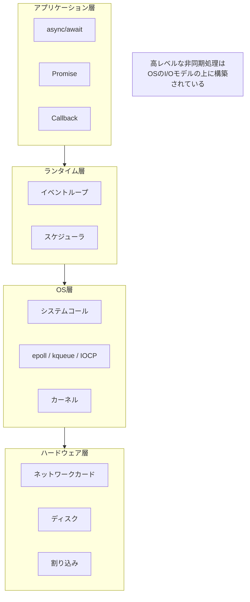
```mermaid
flowchart TB
    subgraph APP["アプリケーション層"]
        ASYNC["async/await"]
        PROMISE["Promise"]
        CALLBACK["Callback"]
    end
    
    subgraph RUNTIME["ランタイム層"]
        LOOP["イベントループ"]
        SCHEDULER["スケジューラ"]
    end
    
    subgraph OS["OS層"]
        SYSCALL["システムコール"]
        EPOLL["epoll / kqueue / IOCP"]
        KERNEL["カーネル"]
    end
    
    subgraph HW["ハードウェア層"]
        NIC["ネットワークカード"]
        DISK["ディスク"]
        INTERRUPT["割り込み"]
    end
    
    APP --> RUNTIME --> OS --> HW
    
    NOTE["高レベルな非同期処理は<br/>OSのI/Oモデルの上に構築されている"]
```

この章では、OSが提供する5つの主要なI/Oモデルを詳しく解説します：

1. **ブロッキングI/O** - 最もシンプルで基本的なモデル
2. **ノンブロッキングI/O** - 待機せずに即座に戻る
3. **I/O多重化** - 複数のI/Oを効率的に監視する
4. **シグナル駆動I/O** - シグナルで通知を受ける
5. **非同期I/O（AIO）** - 真の非同期処理

---

## 6.2 I/O操作の基本構造

### I/O操作の2つのフェーズ

すべてのI/O操作は、2つのフェーズに分けられます：

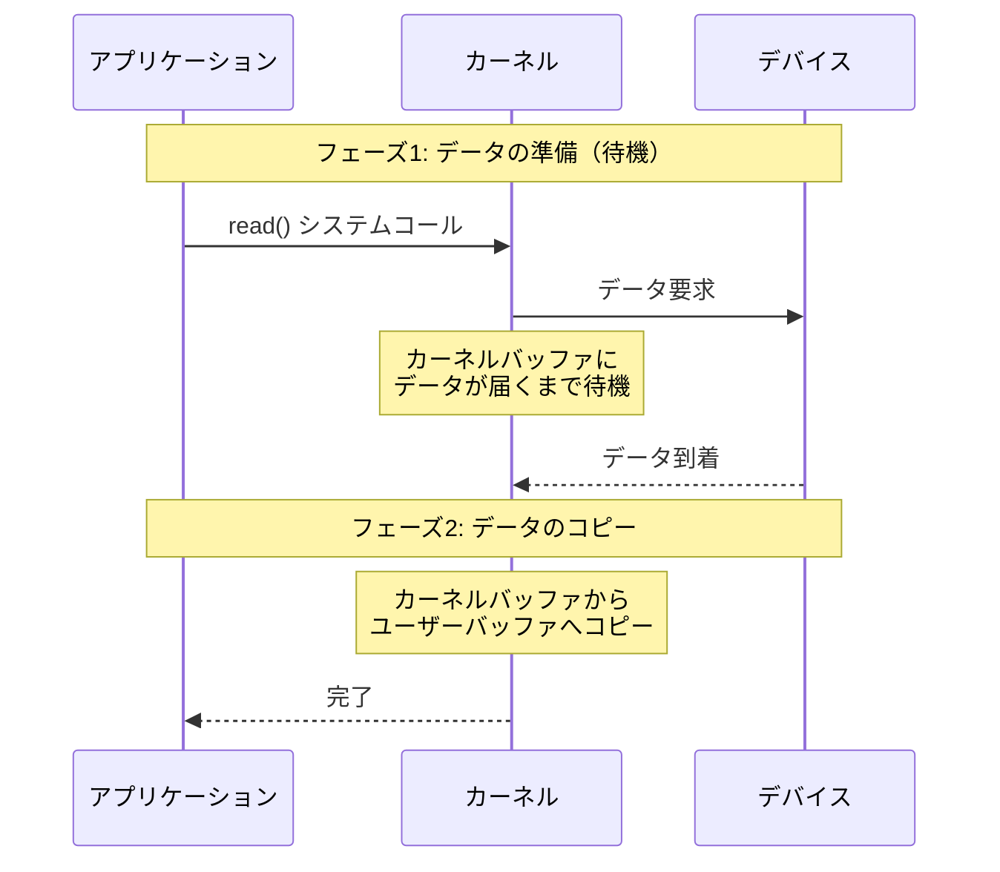
```mermaid
sequenceDiagram
    participant App as アプリケーション
    participant Kernel as カーネル
    participant Device as デバイス
    
    Note over App,Device: フェーズ1: データの準備（待機）
    App->>Kernel: read() システムコール
    Kernel->>Device: データ要求
    Note over Kernel: カーネルバッファに<br/>データが届くまで待機
    Device-->>Kernel: データ到着
    
    Note over App,Device: フェーズ2: データのコピー
    Note over Kernel: カーネルバッファから<br/>ユーザーバッファへコピー
    Kernel-->>App: 完了
```

**フェーズ1: データの準備（Wait for data）**
- カーネルがデバイス（ネットワーク、ディスクなど）からデータを受け取るまでの待機時間
- ネットワークI/Oの場合、パケットがNICに届くまで待つ
- この待機時間が、I/Oが「遅い」主な理由

**フェーズ2: データのコピー（Copy data）**
- カーネル空間のバッファからユーザー空間のバッファへデータをコピー
- 通常、フェーズ1よりも短時間で完了
- CPU負荷がかかる処理

### ファイルディスクリプタ

UNIX系OSでは、すべてのI/Oは**ファイルディスクリプタ（fd）**を通じて行われます。

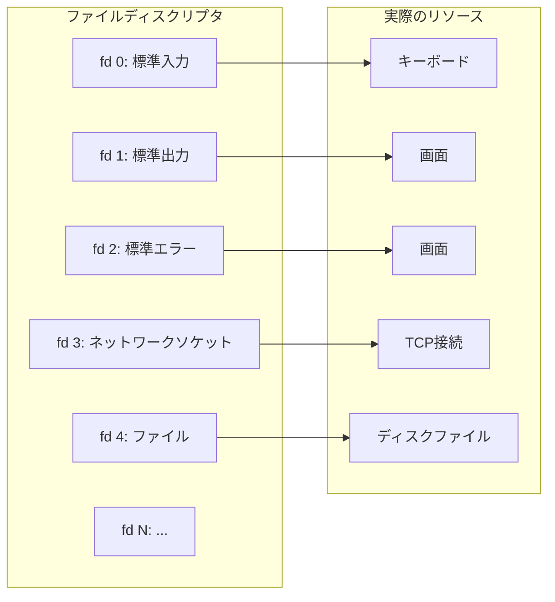
```mermaid
flowchart LR
    subgraph FD["ファイルディスクリプタ"]
        FD0["fd 0: 標準入力"]
        FD1["fd 1: 標準出力"]
        FD2["fd 2: 標準エラー"]
        FD3["fd 3: ネットワークソケット"]
        FD4["fd 4: ファイル"]
        FDN["fd N: ..."]
    end
    
    subgraph RESOURCES["実際のリソース"]
        STDIN["キーボード"]
        STDOUT["画面"]
        STDERR["画面"]
        SOCKET["TCP接続"]
        FILE["ディスクファイル"]
    end
    
    FD0 --> STDIN
    FD1 --> STDOUT
    FD2 --> STDERR
    FD3 --> SOCKET
    FD4 --> FILE
```

ファイルディスクリプタは、カーネルが管理するI/Oリソースへの参照（整数値）です。ソケット、ファイル、パイプなど、すべてのI/Oリソースは同じインターフェースで扱えます。

---

## 6.3 ブロッキングI/O（Blocking I/O）

### 概要

**ブロッキングI/O**は、最もシンプルで伝統的なI/Oモデルです。I/O操作が完了するまで、アプリケーションは**ブロック（停止）**します。

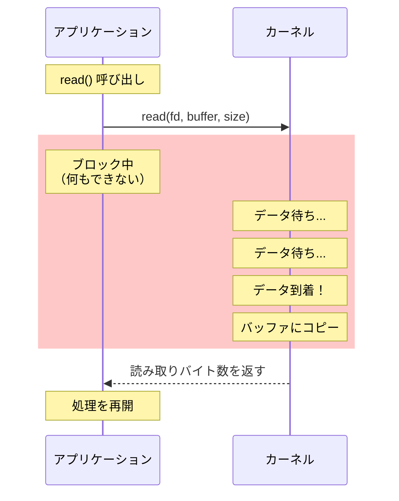
```mermaid
sequenceDiagram
    participant App as アプリケーション
    participant Kernel as カーネル
    
    Note over App: read() 呼び出し
    App->>Kernel: read(fd, buffer, size)
    
    rect rgb(255, 200, 200)
        Note over App: ブロック中<br/>（何もできない）
        Note over Kernel: データ待ち...
        Note over Kernel: データ待ち...
        Note over Kernel: データ到着！
        Note over Kernel: バッファにコピー
    end
    
    Kernel-->>App: 読み取りバイト数を返す
    Note over App: 処理を再開
```

### コード例

```c
// C言語でのブロッキングI/O
#include <unistd.h>
#include <sys/socket.h>

int main() {
    int sockfd = socket(AF_INET, SOCK_STREAM, 0);
    // ... 接続処理 ...
    
    char buffer[1024];
    
    // この行でブロックする
    // データが届くまで、プログラムは停止
    ssize_t bytes = read(sockfd, buffer, sizeof(buffer));
    
    // データが届いたら、ここに進む
    printf("受信: %zd バイト\n", bytes);
    
    return 0;
}
```

### ブロッキングI/Oの問題

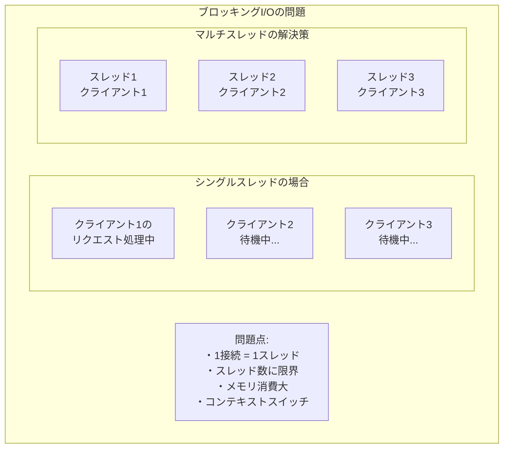
```mermaid
flowchart TB
    subgraph BLOCKING_PROBLEM["ブロッキングI/Oの問題"]
        subgraph SINGLE["シングルスレッドの場合"]
            S1["クライアント1の<br/>リクエスト処理中"]
            S2["クライアント2<br/>待機中..."]
            S3["クライアント3<br/>待機中..."]
        end
        
        subgraph MULTI["マルチスレッドの解決策"]
            M1["スレッド1<br/>クライアント1"]
            M2["スレッド2<br/>クライアント2"]
            M3["スレッド3<br/>クライアント3"]
        end
        
        PROBLEM["問題点:<br/>・1接続 = 1スレッド<br/>・スレッド数に限界<br/>・メモリ消費大<br/>・コンテキストスイッチ"]
    end
```

シングルスレッドでブロッキングI/Oを使うと、1つのクライアントの処理中は他のクライアントを処理できません。

マルチスレッドで解決しようとすると、1接続につき1スレッドが必要になり、第3章で説明したC10K問題に直面します。

### ブロッキングI/Oの特徴

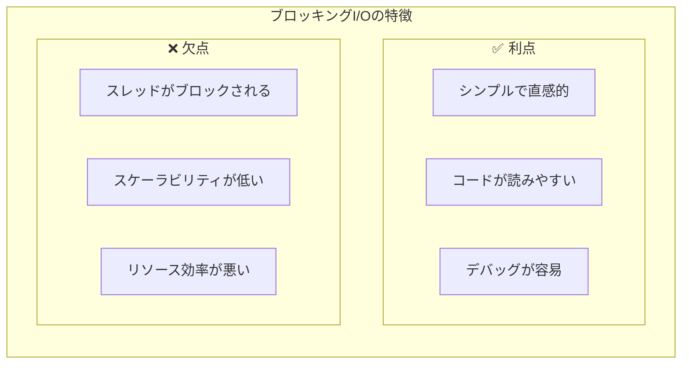
```mermaid
flowchart LR
    subgraph BLOCKING_FEATURES["ブロッキングI/Oの特徴"]
        subgraph PROS["✅ 利点"]
            P1["シンプルで直感的"]
            P2["コードが読みやすい"]
            P3["デバッグが容易"]
        end
        
        subgraph CONS["❌ 欠点"]
            C1["スレッドがブロックされる"]
            C2["スケーラビリティが低い"]
            C3["リソース効率が悪い"]
        end
    end
```

| 項目 | 説明 |
|------|------|
| フェーズ1（待機） | ブロック |
| フェーズ2（コピー） | ブロック |
| プログラミングモデル | シンプル |
| 適した用途 | 少数の接続、シンプルなツール |
| 不向きな用途 | 高並行性が必要なサーバー |

---

## 6.4 ノンブロッキングI/O（Non-blocking I/O）

### 概要

**ノンブロッキングI/O**では、I/O操作が即座に完了しない場合、エラー（`EAGAIN`または`EWOULDBLOCK`）を返して**すぐに制御を戻します**。アプリケーションは、データが準備できるまで繰り返しチェック（ポーリング）する必要があります。

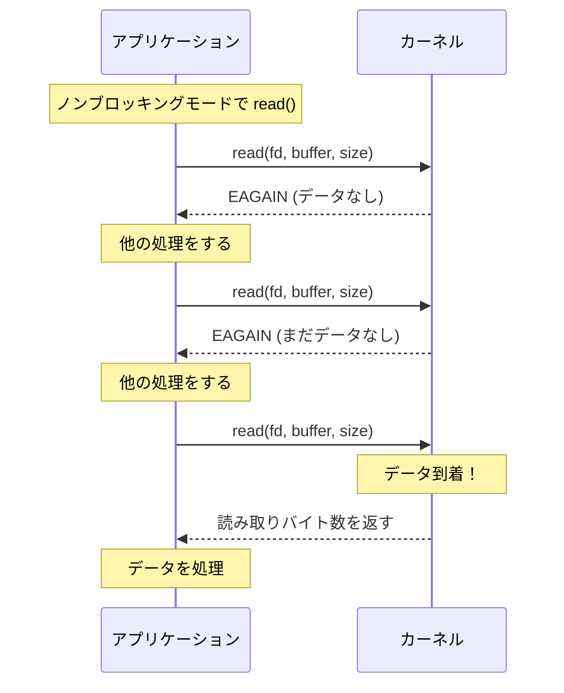
```mermaid
sequenceDiagram
    participant App as アプリケーション
    participant Kernel as カーネル
    
    Note over App: ノンブロッキングモードで read()
    
    App->>Kernel: read(fd, buffer, size)
    Kernel-->>App: EAGAIN (データなし)
    Note over App: 他の処理をする
    
    App->>Kernel: read(fd, buffer, size)
    Kernel-->>App: EAGAIN (まだデータなし)
    Note over App: 他の処理をする
    
    App->>Kernel: read(fd, buffer, size)
    Note over Kernel: データ到着！
    Kernel-->>App: 読み取りバイト数を返す
    Note over App: データを処理
```

### コード例

```c
// C言語でのノンブロッキングI/O
#include <fcntl.h>
#include <errno.h>

int main() {
    int sockfd = socket(AF_INET, SOCK_STREAM, 0);
    
    // ソケットをノンブロッキングモードに設定
    int flags = fcntl(sockfd, F_GETFL, 0);
    fcntl(sockfd, F_SETFL, flags | O_NONBLOCK);
    
    // ... 接続処理 ...
    
    char buffer[1024];
    
    while (1) {
        ssize_t bytes = read(sockfd, buffer, sizeof(buffer));
        
        if (bytes > 0) {
            // データを受信した
            printf("受信: %zd バイト\n", bytes);
            break;
        } else if (bytes == 0) {
            // 接続が閉じられた
            printf("接続終了\n");
            break;
        } else if (errno == EAGAIN || errno == EWOULDBLOCK) {
            // データがまだ準備できていない
            // 他の処理を行う、または少し待つ
            printf("データ待ち中...\n");
            usleep(100000);  // 100ms待機
        } else {
            // エラー
            perror("read");
            break;
        }
    }
    
    return 0;
}
```

### ノンブロッキングI/Oの問題

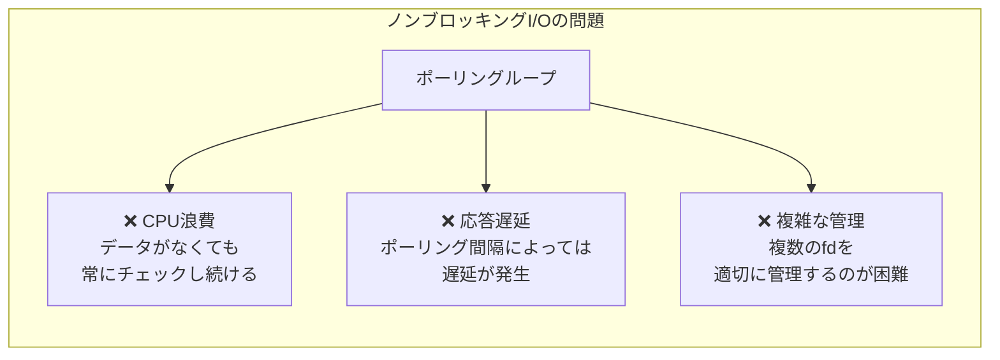
```mermaid
flowchart LR
    subgraph NONBLOCKING_PROBLEM["ノンブロッキングI/Oの問題"]
        POLL["ポーリングループ"]
        
        ISSUE1["❌ CPU浪費<br/>データがなくても<br/>常にチェックし続ける"]
        ISSUE2["❌ 応答遅延<br/>ポーリング間隔によっては<br/>遅延が発生"]
        ISSUE3["❌ 複雑な管理<br/>複数のfdを<br/>適切に管理するのが困難"]
        
        POLL --> ISSUE1
        POLL --> ISSUE2
        POLL --> ISSUE3
    end
```

ノンブロッキングI/Oは、スレッドをブロックしないという利点がありますが、ポーリングによるCPU浪費という新たな問題を生みます。

### ノンブロッキングI/Oの特徴

| 項目 | 説明 |
|------|------|
| フェーズ1（待機） | ノンブロッキング（即座に戻る） |
| フェーズ2（コピー） | ブロック |
| プログラミングモデル | やや複雑（ポーリングが必要） |
| 適した用途 | I/O多重化と組み合わせて使用 |
| 不向きな用途 | 単独での使用（CPU浪費） |

ノンブロッキングI/O単独では効率が悪いため、通常は次に説明するI/O多重化と組み合わせて使用します。

---

## 6.5 I/O多重化（I/O Multiplexing）

### 概要

**I/O多重化**は、複数のファイルディスクリプタを**同時に監視**し、いずれかがI/O可能になったら通知を受ける仕組みです。これにより、1つのスレッドで多数のI/O操作を効率的に処理できます。

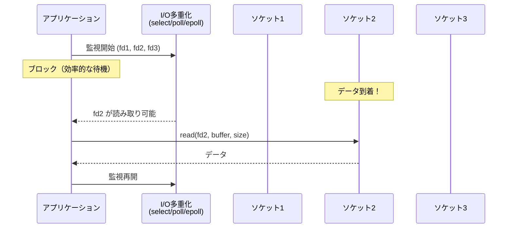
```mermaid
sequenceDiagram
    participant App as アプリケーション
    participant MUX as I/O多重化<br/>(select/poll/epoll)
    participant FD1 as ソケット1
    participant FD2 as ソケット2
    participant FD3 as ソケット3
    
    App->>MUX: 監視開始 (fd1, fd2, fd3)
    Note over App: ブロック（効率的な待機）
    
    Note over FD2: データ到着！
    MUX-->>App: fd2 が読み取り可能
    
    App->>FD2: read(fd2, buffer, size)
    FD2-->>App: データ
    
    App->>MUX: 監視再開
```

### I/O多重化の種類

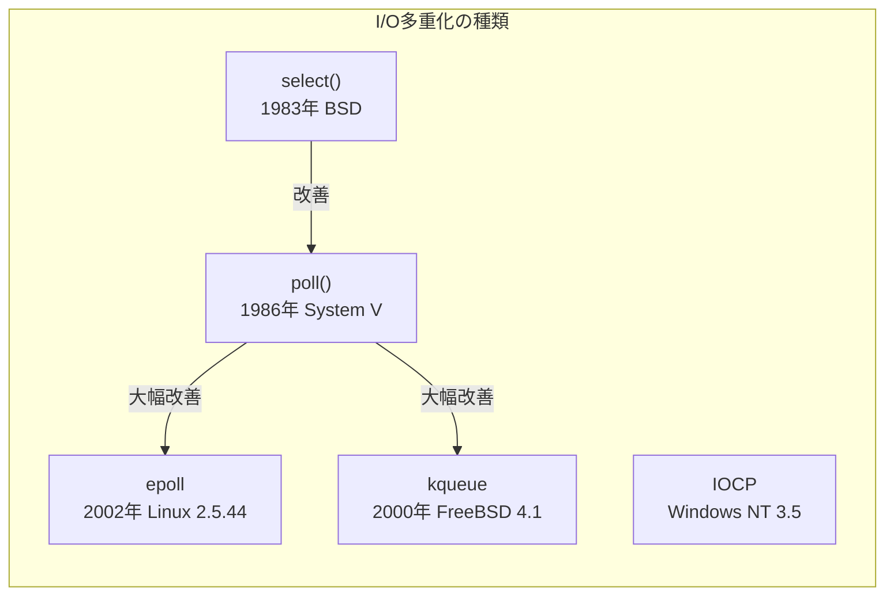
```mermaid
flowchart LR
    subgraph IO_MUX["I/O多重化の種類"]
        SELECT["select()<br/>1983年 BSD"]
        POLL["poll()<br/>1986年 System V"]
        EPOLL["epoll<br/>2002年 Linux 2.5.44"]
        KQUEUE["kqueue<br/>2000年 FreeBSD 4.1"]
        IOCP["IOCP<br/>Windows NT 3.5"]
    end
    
    SELECT -->|"改善"| POLL
    POLL -->|"大幅改善"| EPOLL
    POLL -->|"大幅改善"| KQUEUE
```

---

### 6.5.1 select()

**select()** は、最も古いI/O多重化APIです。監視したいファイルディスクリプタのビットマップを渡し、いずれかが準備できるまでブロックします。

```c
// select() の使用例
#include <sys/select.h>

int main() {
    fd_set read_fds;
    struct timeval timeout;
    
    // 監視するfdのセットを初期化
    FD_ZERO(&read_fds);
    FD_SET(sockfd1, &read_fds);
    FD_SET(sockfd2, &read_fds);
    FD_SET(sockfd3, &read_fds);
    
    // タイムアウト設定
    timeout.tv_sec = 5;
    timeout.tv_usec = 0;
    
    // いずれかのfdが準備できるまで待機
    int ready = select(max_fd + 1, &read_fds, NULL, NULL, &timeout);
    
    if (ready > 0) {
        // どのfdが準備できたかチェック
        if (FD_ISSET(sockfd1, &read_fds)) {
            // sockfd1 からデータを読み取り可能
        }
        if (FD_ISSET(sockfd2, &read_fds)) {
            // sockfd2 からデータを読み取り可能
        }
    }
    
    return 0;
}
```

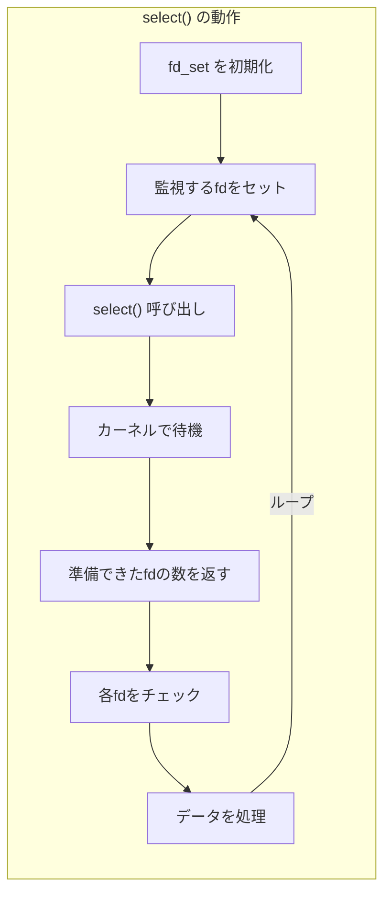
```mermaid
flowchart LR
    subgraph SELECT_FLOW["select() の動作"]
        INIT["fd_set を初期化"]
        SET["監視するfdをセット"]
        CALL["select() 呼び出し"]
        WAIT["カーネルで待機"]
        RETURN["準備できたfdの数を返す"]
        CHECK["各fdをチェック"]
        PROCESS["データを処理"]
    end
    
    INIT --> SET --> CALL --> WAIT --> RETURN --> CHECK --> PROCESS
    PROCESS -->|"ループ"| SET
```

**select() の制限：**

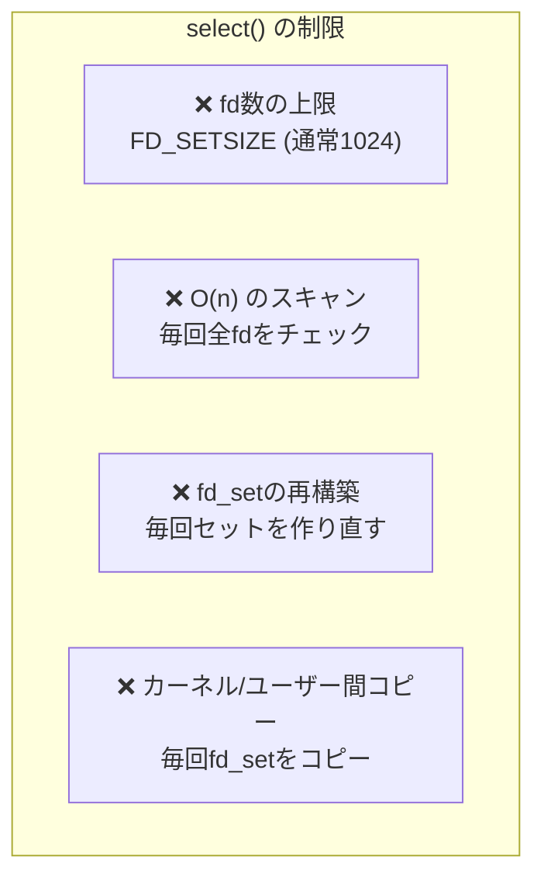
```mermaid
flowchart TB
    subgraph SELECT_LIMITS["select() の制限"]
        L1["❌ fd数の上限<br/>FD_SETSIZE (通常1024)"]
        L2["❌ O(n) のスキャン<br/>毎回全fdをチェック"]
        L3["❌ fd_setの再構築<br/>毎回セットを作り直す"]
        L4["❌ カーネル/ユーザー間コピー<br/>毎回fd_setをコピー"]
    end
```

---

### 6.5.2 poll()

**poll()** は、select()の改良版です。ビットマップではなくpollfd構造体の配列を使用し、fd数の上限がなくなりました。

```c
// poll() の使用例
#include <poll.h>

int main() {
    struct pollfd fds[3];
    
    // 監視するfdを設定
    fds[0].fd = sockfd1;
    fds[0].events = POLLIN;  // 読み取り可能を監視
    
    fds[1].fd = sockfd2;
    fds[1].events = POLLIN;
    
    fds[2].fd = sockfd3;
    fds[2].events = POLLIN | POLLOUT;  // 読み取り/書き込み両方
    
    // いずれかのfdが準備できるまで待機
    int ready = poll(fds, 3, 5000);  // 5秒タイムアウト
    
    if (ready > 0) {
        for (int i = 0; i < 3; i++) {
            if (fds[i].revents & POLLIN) {
                // 読み取り可能
                read(fds[i].fd, buffer, sizeof(buffer));
            }
        }
    }
    
    return 0;
}
```

**poll() の改善点と残る問題：**

| 項目 | select() | poll() |
|------|----------|--------|
| fd数の上限 | FD_SETSIZE (1024) | なし |
| データ構造 | ビットマップ | pollfd配列 |
| O(n) スキャン | あり | **あり（残存）** |
| カーネルへのコピー | 毎回 | **毎回（残存）** |

---

### 6.5.3 epoll（Linux）

**epoll** は、Linux独自の高性能I/O多重化APIです。select()とpoll()の問題を解決し、大量の接続を効率的に処理できます。

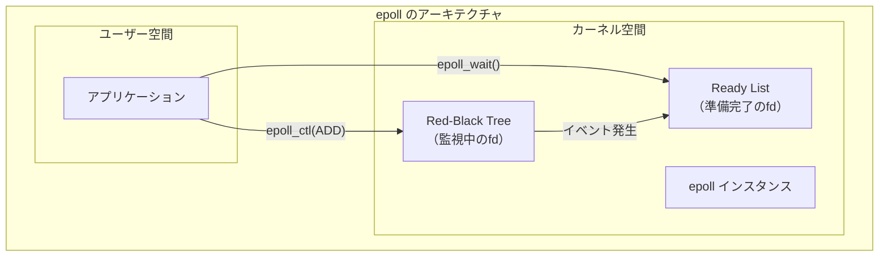
```mermaid
flowchart TB
    subgraph EPOLL_ARCH["epoll のアーキテクチャ"]
        subgraph KERNEL["カーネル空間"]
            EPOLL_INST["epoll インスタンス"]
            RB_TREE["Red-Black Tree<br/>（監視中のfd）"]
            READY_LIST["Ready List<br/>（準備完了のfd）"]
        end
        
        subgraph USER["ユーザー空間"]
            APP["アプリケーション"]
        end
    end
    
    APP -->|"epoll_ctl(ADD)"| RB_TREE
    APP -->|"epoll_wait()"| READY_LIST
    RB_TREE -->|"イベント発生"| READY_LIST
```

```c
// epoll の使用例
#include <sys/epoll.h>

int main() {
    // epoll インスタンスを作成
    int epfd = epoll_create1(0);
    
    // 監視するfdを登録
    struct epoll_event ev;
    ev.events = EPOLLIN;
    ev.data.fd = sockfd1;
    epoll_ctl(epfd, EPOLL_CTL_ADD, sockfd1, &ev);
    
    ev.data.fd = sockfd2;
    epoll_ctl(epfd, EPOLL_CTL_ADD, sockfd2, &ev);
    
    // イベントを待機
    struct epoll_event events[100];
    
    while (1) {
        // 準備できたfdのみが返される
        int nfds = epoll_wait(epfd, events, 100, -1);
        
        for (int i = 0; i < nfds; i++) {
            // events[i].data.fd が読み取り可能
            int fd = events[i].data.fd;
            char buffer[1024];
            read(fd, buffer, sizeof(buffer));
            // 処理...
        }
    }
    
    close(epfd);
    return 0;
}
```

**epoll の特徴：**

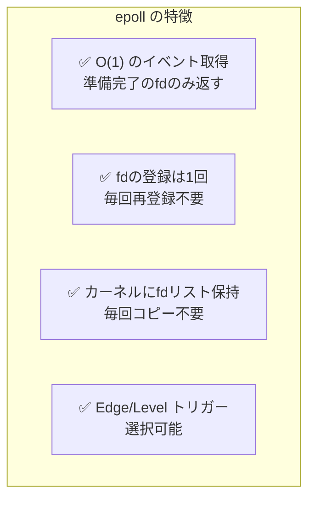
```mermaid
flowchart TB
    subgraph EPOLL_FEATURES["epoll の特徴"]
        F1["✅ O(1) のイベント取得<br/>準備完了のfdのみ返す"]
        F2["✅ fdの登録は1回<br/>毎回再登録不要"]
        F3["✅ カーネルにfdリスト保持<br/>毎回コピー不要"]
        F4["✅ Edge/Level トリガー<br/>選択可能"]
    end
```

**Level Triggered vs Edge Triggered：**

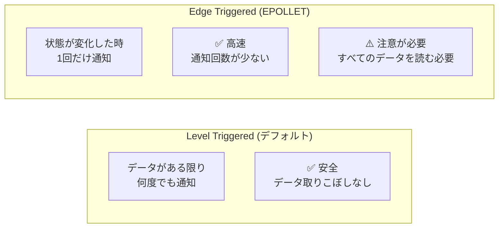
```mermaid
flowchart LR
    subgraph LT["Level Triggered (デフォルト)"]
        LT_DESC["データがある限り<br/>何度でも通知"]
        LT_SAFE["✅ 安全<br/>データ取りこぼしなし"]
    end
    
    subgraph ET["Edge Triggered (EPOLLET)"]
        ET_DESC["状態が変化した時<br/>1回だけ通知"]
        ET_FAST["✅ 高速<br/>通知回数が少ない"]
        ET_DANGER["⚠️ 注意が必要<br/>すべてのデータを読む必要"]
    end
```

---

### 6.5.4 kqueue（BSD/macOS）

**kqueue** は、FreeBSDで開発され、macOSでも使用されるI/O多重化APIです。epollと同様の高性能を持ち、さらに柔軟なイベント通知が可能です。

```c
// kqueue の使用例
#include <sys/event.h>

int main() {
    // kqueue インスタンスを作成
    int kq = kqueue();
    
    // 監視するイベントを設定
    struct kevent changes[2];
    EV_SET(&changes[0], sockfd1, EVFILT_READ, EV_ADD, 0, 0, NULL);
    EV_SET(&changes[1], sockfd2, EVFILT_READ, EV_ADD, 0, 0, NULL);
    
    // イベントを登録
    kevent(kq, changes, 2, NULL, 0, NULL);
    
    // イベントを待機
    struct kevent events[100];
    
    while (1) {
        int nev = kevent(kq, NULL, 0, events, 100, NULL);
        
        for (int i = 0; i < nev; i++) {
            int fd = events[i].ident;
            if (events[i].filter == EVFILT_READ) {
                // 読み取り可能
                read(fd, buffer, sizeof(buffer));
            }
        }
    }
    
    close(kq);
    return 0;
}
```

**kqueue の特徴：**

- epollと同等の高性能（O(1)のイベント取得）
- ソケット以外にも対応（ファイル変更、プロセス、シグナル、タイマー）
- 登録と取得を1回のシステムコールで行える
- BSD系OS（FreeBSD、macOS、OpenBSD、NetBSD）で利用可能

---

### 6.5.5 IOCP（Windows）

**IOCP（I/O Completion Port）** は、Windowsの高性能I/O多重化機構です。他のモデルとは異なり、**Proactorパターン**（完了通知モデル）を採用しています。

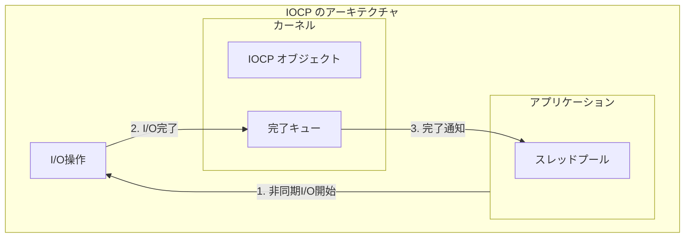
```mermaid
flowchart TB
    subgraph IOCP_ARCH["IOCP のアーキテクチャ"]
        subgraph APP["アプリケーション"]
            THREAD_POOL["スレッドプール"]
        end
        
        subgraph KERNEL["カーネル"]
            IOCP_OBJ["IOCP オブジェクト"]
            COMPLETION_QUEUE["完了キュー"]
        end
        
        IO_OP["I/O操作"]
    end
    
    APP -->|"1. 非同期I/O開始"| IO_OP
    IO_OP -->|"2. I/O完了"| COMPLETION_QUEUE
    COMPLETION_QUEUE -->|"3. 完了通知"| THREAD_POOL
```

```c
// IOCP の使用例（疑似コード）
#include <windows.h>

int main() {
    // IOCPを作成
    HANDLE iocp = CreateIoCompletionPort(
        INVALID_HANDLE_VALUE, NULL, 0, 0);
    
    // ソケットをIOCPに関連付け
    CreateIoCompletionPort(
        (HANDLE)socket, iocp, (ULONG_PTR)context, 0);
    
    // 非同期読み取りを開始
    OVERLAPPED overlapped = {0};
    WSARecv(socket, &buffer, 1, NULL, &flags, 
            &overlapped, NULL);
    
    // 完了を待機
    while (1) {
        DWORD bytes;
        ULONG_PTR key;
        LPOVERLAPPED ov;
        
        // I/O完了を待つ
        GetQueuedCompletionStatus(
            iocp, &bytes, &key, &ov, INFINITE);
        
        // 完了したI/Oを処理
        ProcessCompletedIO(key, ov, bytes);
    }
    
    return 0;
}
```

**Reactor vs Proactor パターン：**

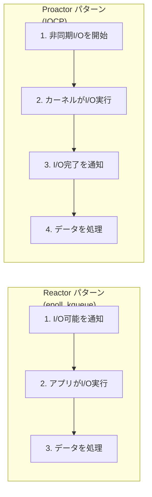
```mermaid
flowchart LR
    subgraph REACTOR["Reactor パターン<br/>(epoll, kqueue)"]
        R1["1. I/O可能を通知"]
        R2["2. アプリがI/O実行"]
        R3["3. データを処理"]
    end
    
    subgraph PROACTOR["Proactor パターン<br/>(IOCP)"]
        P1["1. 非同期I/Oを開始"]
        P2["2. カーネルがI/O実行"]
        P3["3. I/O完了を通知"]
        P4["4. データを処理"]
    end
    
    R1 --> R2 --> R3
    P1 --> P2 --> P3 --> P4
```

| パターン | 通知タイミング | I/O実行者 | 例 |
|---------|--------------|----------|-----|
| Reactor | I/O可能時 | アプリケーション | epoll, kqueue |
| Proactor | I/O完了時 | カーネル | IOCP |

---

### 6.5.6 I/O多重化の比較

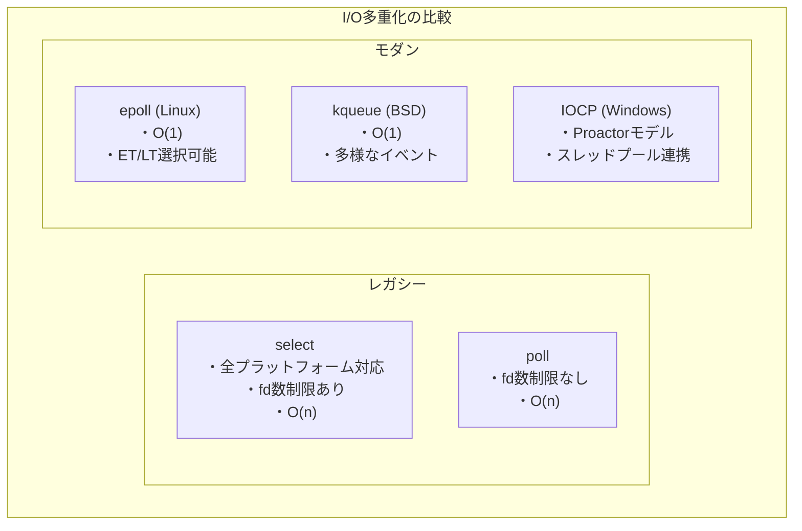
```mermaid
flowchart TB
    subgraph COMPARISON["I/O多重化の比較"]
        subgraph LEGACY["レガシー"]
            SELECT["select<br/>・全プラットフォーム対応<br/>・fd数制限あり<br/>・O(n)"]
            POLL["poll<br/>・fd数制限なし<br/>・O(n)"]
        end
        
        subgraph MODERN["モダン"]
            EPOLL["epoll (Linux)<br/>・O(1)<br/>・ET/LT選択可能"]
            KQUEUE["kqueue (BSD)<br/>・O(1)<br/>・多様なイベント"]
            IOCP_BOX["IOCP (Windows)<br/>・Proactorモデル<br/>・スレッドプール連携"]
        end
    end
```

| 特性 | select | poll | epoll | kqueue | IOCP |
|------|--------|------|-------|--------|------|
| プラットフォーム | 全て | 全て* | Linux | BSD/macOS | Windows |
| fd数制限 | あり(1024) | なし | なし | なし | なし |
| 計算量 | O(n) | O(n) | O(1) | O(1) | O(1) |
| カーネルへのコピー | 毎回 | 毎回 | 登録時のみ | 登録時のみ | なし |
| パターン | Reactor | Reactor | Reactor | Reactor | Proactor |

*poll()はWindowsでは利用不可

---

## 6.6 シグナル駆動I/O

### 概要

**シグナル駆動I/O**は、I/Oが可能になったときにシグナル（SIGIO）で通知を受けるモデルです。ポーリングが不要で、シグナルハンドラで非同期にI/Oを処理できます。

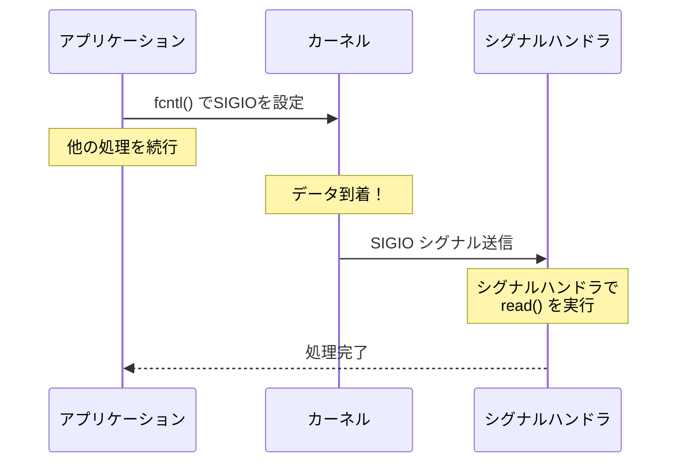
```mermaid
sequenceDiagram
    participant App as アプリケーション
    participant Kernel as カーネル
    participant Handler as シグナルハンドラ
    
    App->>Kernel: fcntl() でSIGIOを設定
    Note over App: 他の処理を続行
    
    Note over Kernel: データ到着！
    Kernel->>Handler: SIGIO シグナル送信
    Note over Handler: シグナルハンドラで<br/>read() を実行
    Handler-->>App: 処理完了
```

### コード例

```c
// シグナル駆動I/O の使用例
#include <signal.h>
#include <fcntl.h>

int sockfd;
volatile sig_atomic_t io_ready = 0;

void sigio_handler(int sig) {
    io_ready = 1;
}

int main() {
    sockfd = socket(AF_INET, SOCK_STREAM, 0);
    
    // シグナルハンドラを設定
    signal(SIGIO, sigio_handler);
    
    // このプロセスがSIGIOを受け取るように設定
    fcntl(sockfd, F_SETOWN, getpid());
    
    // 非同期I/Oを有効化
    int flags = fcntl(sockfd, F_GETFL);
    fcntl(sockfd, F_SETFL, flags | O_ASYNC | O_NONBLOCK);
    
    // メインループ
    while (1) {
        if (io_ready) {
            io_ready = 0;
            char buffer[1024];
            ssize_t bytes = read(sockfd, buffer, sizeof(buffer));
            // データを処理
        }
        
        // 他の処理
        do_other_work();
    }
    
    return 0;
}
```

### シグナル駆動I/Oの特徴

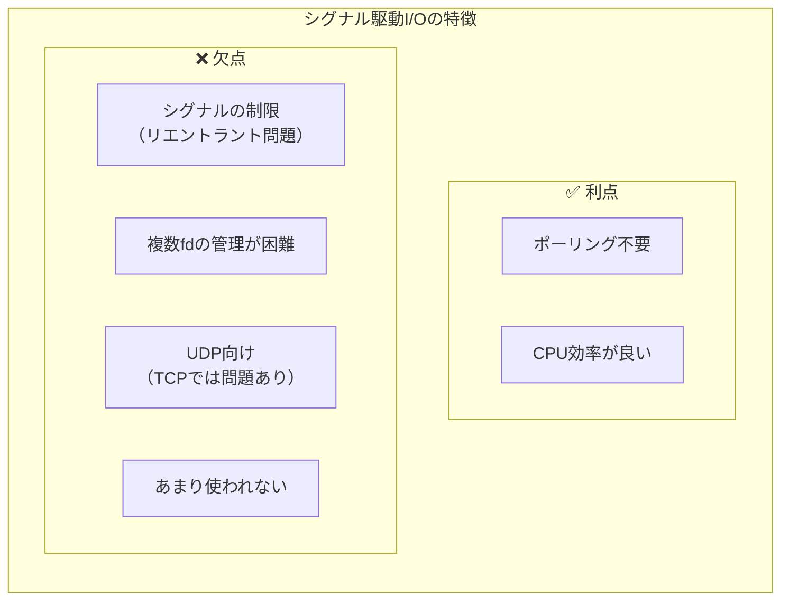
```mermaid
flowchart LR
    subgraph SIGIO_FEATURES["シグナル駆動I/Oの特徴"]
        subgraph PROS["✅ 利点"]
            P1["ポーリング不要"]
            P2["CPU効率が良い"]
        end
        
        subgraph CONS["❌ 欠点"]
            C1["シグナルの制限<br/>（リエントラント問題）"]
            C2["複数fdの管理が困難"]
            C3["UDP向け<br/>（TCPでは問題あり）"]
            C4["あまり使われない"]
        end
    end
```

シグナル駆動I/Oは、シグナルの複雑さから実際にはあまり使用されません。現代のアプリケーションでは、epollやkqueueなどのI/O多重化が好まれます。

---

## 6.7 非同期I/O（AIO）

### 概要

**非同期I/O（Asynchronous I/O）**は、I/O操作を開始した後、**完了を待たずにすぐに戻り**、**I/O完了時に通知を受ける**モデルです。フェーズ1（待機）とフェーズ2（コピー）の両方が非同期に行われます。

```mermaid
sequenceDiagram
    participant App as アプリケーション
    participant Kernel as カーネル
    
    App->>Kernel: aio_read() 開始
    Kernel-->>App: 即座に戻る（制御を返す）
    
    Note over App: 他の処理を続行
    Note over App: 他の処理を続行
    
    Note over Kernel: データ到着
    Note over Kernel: ユーザーバッファへコピー
    
    Kernel-->>App: 完了通知（シグナル/コールバック）
    Note over App: データを処理
```

### POSIX AIO

POSIX標準の非同期I/O APIです。主にファイルI/Oに使用されます。

```c
// POSIX AIO の使用例
#include <aio.h>

int main() {
    int fd = open("data.txt", O_RDONLY);
    char buffer[1024];
    
    // 非同期読み取りを設定
    struct aiocb cb;
    memset(&cb, 0, sizeof(cb));
    cb.aio_fildes = fd;
    cb.aio_buf = buffer;
    cb.aio_nbytes = sizeof(buffer);
    cb.aio_offset = 0;
    
    // 非同期読み取りを開始
    aio_read(&cb);
    
    // 他の処理を続行
    do_other_work();
    
    // 完了を確認（ポーリング）
    while (aio_error(&cb) == EINPROGRESS) {
        // まだ完了していない
        do_more_work();
    }
    
    // 結果を取得
    ssize_t bytes = aio_return(&cb);
    printf("読み取り完了: %zd バイト\n", bytes);
    
    close(fd);
    return 0;
}
```

### io_uring（Linux 5.1+）

**io_uring**は、Linux 5.1で導入された新しい非同期I/Oインターフェースです。従来のAIOの問題を解決し、非常に高いパフォーマンスを実現します。

```mermaid
flowchart TB
    subgraph IO_URING["io_uring のアーキテクチャ"]
        subgraph USER["ユーザー空間"]
            SQ["Submission Queue<br/>（送信キュー）"]
            CQ["Completion Queue<br/>（完了キュー）"]
            APP["アプリケーション"]
        end
        
        subgraph KERNEL["カーネル空間"]
            SQ_KERNEL["SQ（共有メモリ）"]
            CQ_KERNEL["CQ（共有メモリ）"]
            WORKER["I/Oワーカー"]
        end
    end
    
    APP -->|"1. リクエスト投入"| SQ
    SQ -->|"2. 共有メモリ"| SQ_KERNEL
    SQ_KERNEL -->|"3. I/O実行"| WORKER
    WORKER -->|"4. 完了を記録"| CQ_KERNEL
    CQ_KERNEL -->|"5. 共有メモリ"| CQ
    CQ -->|"6. 完了を取得"| APP
```

**io_uringの特徴：**

```mermaid
flowchart TB
    subgraph IOURING_FEATURES["io_uring の特徴"]
        F1["✅ システムコール削減<br/>共有メモリで<br/>カーネルと直接通信"]
        F2["✅ バッチ処理<br/>複数のI/Oを<br/>まとめて投入・完了"]
        F3["✅ 真の非同期<br/>ファイルI/Oも<br/>完全に非同期"]
        F4["✅ ゼロコピー対応<br/>データコピーを<br/>最小化"]
    end
```

```c
// io_uring の使用例（簡略化）
#include <liburing.h>

int main() {
    struct io_uring ring;
    
    // io_uring を初期化
    io_uring_queue_init(32, &ring, 0);
    
    // 読み取りリクエストを準備
    struct io_uring_sqe *sqe = io_uring_get_sqe(&ring);
    io_uring_prep_read(sqe, fd, buffer, sizeof(buffer), 0);
    io_uring_sqe_set_data(sqe, user_data);
    
    // リクエストを送信
    io_uring_submit(&ring);
    
    // 完了を待機
    struct io_uring_cqe *cqe;
    io_uring_wait_cqe(&ring, &cqe);
    
    // 結果を処理
    int result = cqe->res;
    void *data = io_uring_cqe_get_data(cqe);
    
    // 完了を確認
    io_uring_cqe_seen(&ring, cqe);
    
    io_uring_queue_exit(&ring);
    return 0;
}
```

### 非同期I/Oの比較

| 特性 | POSIX AIO | io_uring |
|------|-----------|----------|
| 対応OS | POSIX準拠OS | Linux 5.1+ |
| ファイルI/O | ○ | ○ |
| ネットワークI/O | △（限定的） | ○ |
| パフォーマンス | 普通 | 非常に高い |
| システムコール | 多い | 少ない（バッチ処理） |
| 実装の成熟度 | 成熟 | 新しい（急速に改善中） |

---

## 6.8 各I/Oモデルの比較

### 5つのI/Oモデルの全体像

```mermaid
flowchart TB
    subgraph MODELS["5つのI/Oモデル"]
        subgraph BLOCKING["ブロッキングI/O"]
            B_WAIT["待機: ブロック"]
            B_COPY["コピー: ブロック"]
        end
        
        subgraph NONBLOCKING["ノンブロッキングI/O"]
            NB_WAIT["待機: ノンブロック<br/>（ポーリング）"]
            NB_COPY["コピー: ブロック"]
        end
        
        subgraph MULTIPLEX["I/O多重化"]
            MX_WAIT["待機: ブロック<br/>（複数fdを監視）"]
            MX_COPY["コピー: ブロック"]
        end
        
        subgraph SIGNAL["シグナル駆動I/O"]
            SG_WAIT["待機: ノンブロック<br/>（シグナル通知）"]
            SG_COPY["コピー: ブロック"]
        end
        
        subgraph ASYNC["非同期I/O"]
            AS_WAIT["待機: ノンブロック"]
            AS_COPY["コピー: ノンブロック"]
        end
    end
```

### 比較表

| モデル | フェーズ1（待機） | フェーズ2（コピー） | 主な用途 |
|--------|-----------------|-------------------|---------|
| ブロッキングI/O | ブロック | ブロック | シンプルなアプリ |
| ノンブロッキングI/O | ポーリング | ブロック | 多重化と組み合わせ |
| I/O多重化 | 効率的なブロック | ブロック | 高並行サーバー |
| シグナル駆動I/O | シグナル待ち | ブロック | UDP（まれ） |
| 非同期I/O | 非同期 | 非同期 | 高性能アプリ |

### 同期 vs 非同期

注意すべき点として、**I/O多重化（epoll, kqueue）は「同期I/O」に分類されます**。これは、フェーズ2（データのコピー）でブロックするためです。

```mermaid
flowchart TB
    subgraph SYNC_VS_ASYNC["同期I/O vs 非同期I/O"]
        subgraph SYNC["同期I/O"]
            SYNC_DESC["データコピー時にブロック"]
            BLOCKING_BOX["ブロッキングI/O"]
            NONBLOCKING_BOX["ノンブロッキングI/O"]
            MULTIPLEX_BOX["I/O多重化"]
            SIGNAL_BOX["シグナル駆動I/O"]
        end
        
        subgraph ASYNC_IO["非同期I/O"]
            ASYNC_DESC["データコピーも非同期"]
            AIO_BOX["POSIX AIO"]
            IOURING_BOX["io_uring"]
            IOCP_BOX["IOCP"]
        end
    end
```

---

## 6.9 実践：どのモデルを選ぶべきか

### 判断フローチャート

```mermaid
flowchart TB
    START["要件を分析"]
    
    Q1{"同時接続数は<br/>数百以上？"}
    Q2{"プラットフォームは？"}
    Q3{"ファイルI/Oが<br/>主体？"}
    Q4{"最高性能が<br/>必要？"}
    
    BLOCKING["ブロッキングI/O<br/>+ スレッドプール"]
    EPOLL["epoll"]
    KQUEUE["kqueue"]
    IOCP["IOCP"]
    IOURING["io_uring"]
    AIO["POSIX AIO"]
    
    START --> Q1
    Q1 -->|"No"| BLOCKING
    Q1 -->|"Yes"| Q2
    
    Q2 -->|"Linux"| Q3
    Q2 -->|"BSD/macOS"| KQUEUE
    Q2 -->|"Windows"| IOCP
    
    Q3 -->|"No"| EPOLL
    Q3 -->|"Yes"| Q4
    
    Q4 -->|"Yes"| IOURING
    Q4 -->|"No"| AIO
```

### ユースケース別の推奨

```mermaid
flowchart TB
    subgraph RECOMMENDATIONS["ユースケース別の推奨"]
        subgraph WEB["Webサーバー"]
            WEB_LINUX["Linux: epoll"]
            WEB_BSD["BSD: kqueue"]
            WEB_WIN["Windows: IOCP"]
        end
        
        subgraph DB["データベース"]
            DB_REC["io_uring (Linux)<br/>または IOCP (Windows)"]
        end
        
        subgraph SIMPLE["シンプルなツール"]
            SIMPLE_REC["ブロッキングI/O"]
        end
        
        subgraph GAME["ゲームサーバー"]
            GAME_REC["epoll/kqueue/IOCP<br/>+ スレッドプール"]
        end
    end
```

### 実際のランタイムでの使用例

| ランタイム/フレームワーク | 使用するI/Oモデル |
|------------------------|-----------------|
| Node.js (libuv) | epoll (Linux), kqueue (macOS), IOCP (Windows) |
| Go | netpoller (epoll/kqueue/IOCP をラップ) |
| Rust Tokio | mio (epoll/kqueue/IOCP をラップ) |
| Python asyncio | selectors (epoll/kqueue/select をラップ) |
| Nginx | epoll (Linux), kqueue (BSD) |
| Redis | epoll (Linux), kqueue (BSD) |

---

## 6.10 まとめ

この章では、OSレベルのI/Oモデルについて詳しく学びました。

```mermaid
mindmap
    root((第6章のまとめ))
        ブロッキングI/O
            最もシンプル
            スレッドがブロック
            少数接続向け
        ノンブロッキングI/O
            即座に戻る
            ポーリングが必要
            多重化と組み合わせ
        I/O多重化
            複数fdを監視
            select/poll（レガシー）
            epoll/kqueue/IOCP（モダン）
        非同期I/O
            真の非同期
            io_uring（最新）
            IOCP（Windows）
        選択の指針
            接続数による
            プラットフォームによる
            用途による
```

### 重要なポイント

#### 1. I/O操作は2つのフェーズからなる

データの準備（待機）とデータのコピーという2つのフェーズを理解することが、各I/Oモデルの違いを理解する鍵です。

#### 2. I/O多重化は高並行サーバーの基盤

epoll、kqueue、IOCPなどのI/O多重化は、現代の高並行サーバー（Node.js、Nginx、Redisなど）の基盤技術です。これらを理解することで、非同期プログラミングの仕組みが深く理解できます。

#### 3. プラットフォームによって最適解が異なる

Linuxではepoll、BSD/macOSではkqueue、WindowsではIOCPが最適です。クロスプラットフォームなアプリケーションでは、libuv（Node.js）やmio（Rust）のような抽象化レイヤーを使用します。

#### 4. io_uringは革新的な技術

Linux 5.1で導入されたio_uringは、従来のI/Oモデルの制限を大幅に改善し、ファイルI/Oとネットワークの両方で高いパフォーマンスを実現します。

---

## 📝 練習問題

1. **ブロッキングI/OとノンブロッキングI/Oの違いを、I/O操作の2つのフェーズ（待機とコピー）の観点から説明してください。**
   
   ヒント：どちらのフェーズがブロックするかを考えてください。

2. **select()の制限を3つ挙げ、epollがそれぞれをどのように解決したか説明してください。**
   
   ヒント：fd数の上限、計算量、カーネルへのコピーについて考えてください。

3. **ReactorパターンとProactorパターンの違いを説明してください。epollとIOCPはそれぞれどちらのパターンですか？**
   
   ヒント：「I/O可能の通知」と「I/O完了の通知」の違いを考えてください。

4. **Node.jsがLinuxで高い並行性を実現できる理由を、I/Oモデルの観点から説明してください。**
   
   ヒント：libuv、epoll、イベントループについて考えてください。

5. **io_uringが従来のepollやAIOよりも高性能である理由を説明してください。**
   
   ヒント：共有メモリ、バッチ処理、システムコールの削減について考えてください。

---

## 🔗 次の章へ

[第7章: イベントループの仕組み](./07-event-loop.md) では、I/O多重化の上に構築されるイベントループについて学びます。ReactorパターンとProactorパターンの詳細、そしてlibuv、tokio、asyncioなどの実装を解説します。

---

[← 目次に戻る](../index.md) | [← 前章: 非同期処理の歴史と進化](./05-history.md)

