# 第7章: イベントループの仕組み

> 🎯 **この章の目標**: イベント駆動プログラミングの基礎を理解し、ReactorパターンとProactorパターン、そしてlibuv、tokio、asyncioなどの実装を学ぶ

---

## 7.1 イベント駆動プログラミングとは

### 従来のプログラミングモデルとの違い

従来の**逐次処理モデル**では、プログラムは上から下へと順番に命令を実行していきます。一方、**イベント駆動モデル**では、プログラムは「イベント」の発生を待ち、イベントが発生したときに対応する処理を実行します。

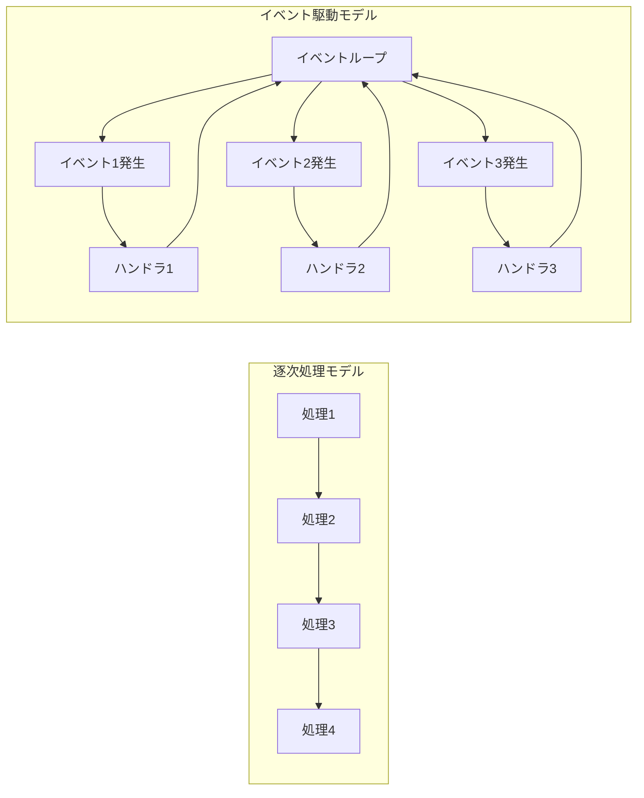

イベント駆動プログラミングは、以下のような場面で特に有効です：

- **GUI アプリケーション**: ユーザーのクリック、キー入力などのイベントに応答
- **ネットワークサーバー**: クライアントからの接続、データ受信などのイベントに応答
- **リアルタイムシステム**: センサーからのデータ、タイマーイベントに応答

### イベントループの基本構造

**イベントループ**は、イベント駆動プログラミングの心臓部です。その基本的な動作は非常にシンプルです：

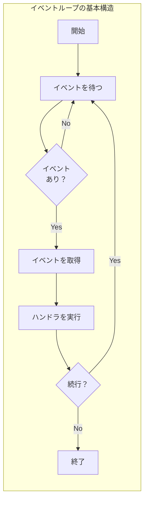

```python
# イベントループの疑似コード
def event_loop():
    while running:
        # イベントが発生するまで待機（効率的なブロック）
        events = wait_for_events()
        
        for event in events:
            # イベントに対応するハンドラを取得
            handler = get_handler(event)
            
            # ハンドラを実行
            handler(event)
```

### イベントの種類

イベントループが処理するイベントには、さまざまな種類があります：

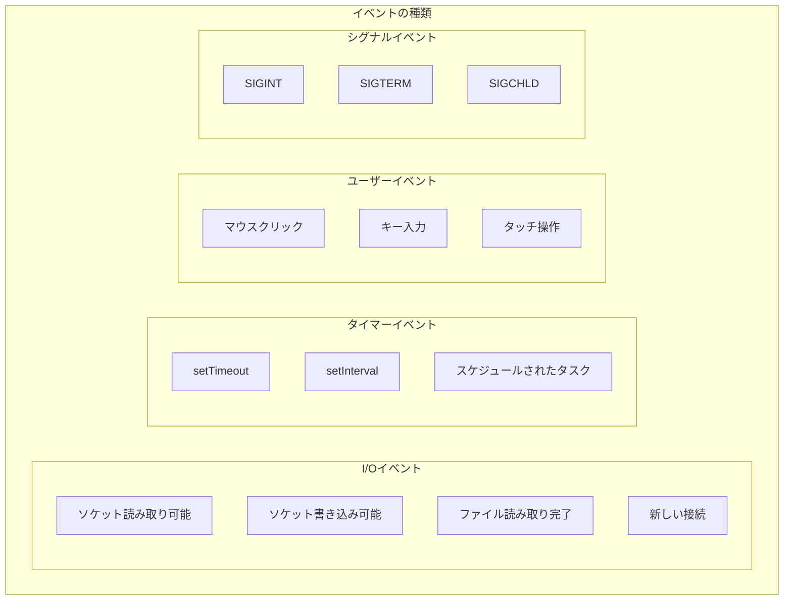

---

## 7.2 Reactor パターン

### 概要

**Reactorパターン**は、イベント駆動アプリケーションで最も広く使われているデザインパターンです。「I/Oが可能になったら通知を受け、アプリケーションがI/Oを実行する」というモデルです。

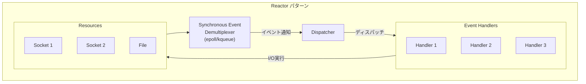

### Reactorの構成要素

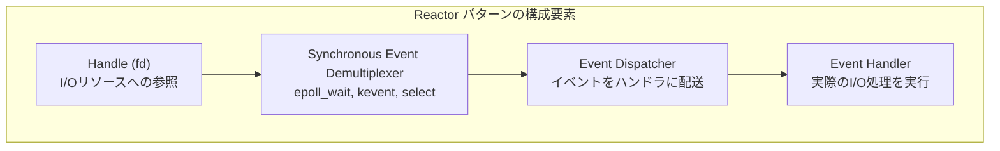

1. **Handle（ハンドル）**: ファイルディスクリプタなど、I/Oリソースへの参照
2. **Synchronous Event Demultiplexer**: 複数のハンドルを監視し、イベントを検出（epoll, kqueue, select）
3. **Event Dispatcher**: 検出されたイベントを適切なハンドラに配送
4. **Event Handler**: 実際のI/O操作とビジネスロジックを実行

### Reactorの動作シーケンス

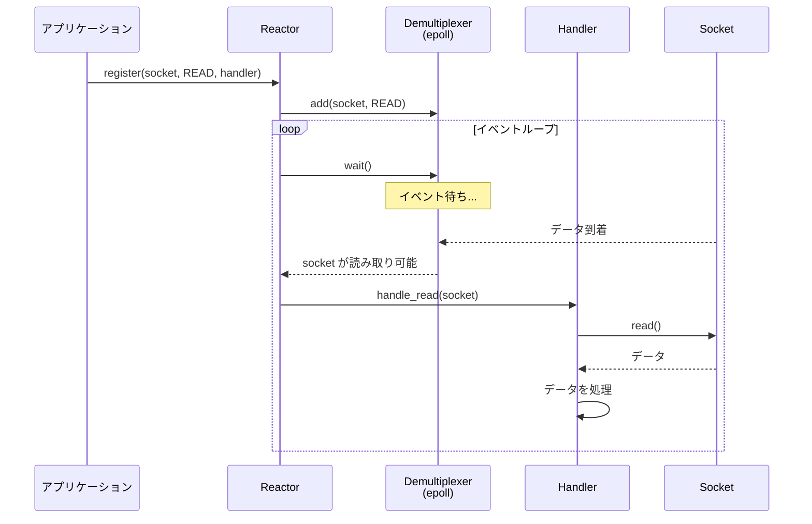

### Reactorの実装例

```python
# シンプルなReactorの実装（Python風疑似コード）
import select

class Reactor:
    def __init__(self):
        self.handlers = {}  # fd -> handler
        self.running = True
    
    def register(self, fd, handler):
        """ファイルディスクリプタとハンドラを登録"""
        self.handlers[fd] = handler
    
    def unregister(self, fd):
        """登録を解除"""
        del self.handlers[fd]
    
    def run(self):
        """イベントループを実行"""
        while self.running:
            # 読み取り可能なfdを監視
            readable, _, _ = select.select(
                list(self.handlers.keys()), [], []
            )
            
            for fd in readable:
                handler = self.handlers[fd]
                handler.handle_read()

class EchoHandler:
    def __init__(self, socket, reactor):
        self.socket = socket
        self.reactor = reactor
    
    def handle_read(self):
        data = self.socket.recv(1024)
        if data:
            self.socket.send(data)  # エコーバック
        else:
            self.reactor.unregister(self.socket.fileno())
            self.socket.close()
```

### Reactorの特徴

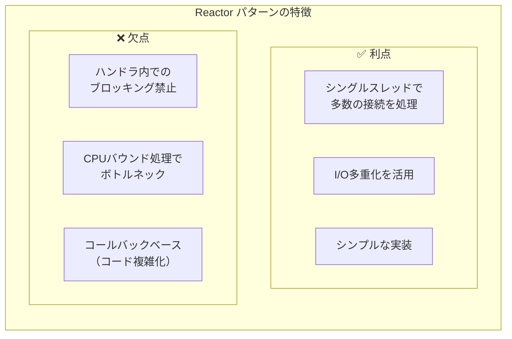

---

## 7.3 Proactor パターン

### 概要

**Proactorパターン**は、「非同期I/O操作を開始し、完了したら通知を受ける」というモデルです。Reactorとは異なり、**カーネルがI/O操作を完了させてから**通知します。

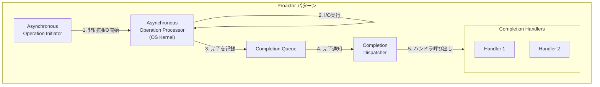

### Reactor vs Proactor

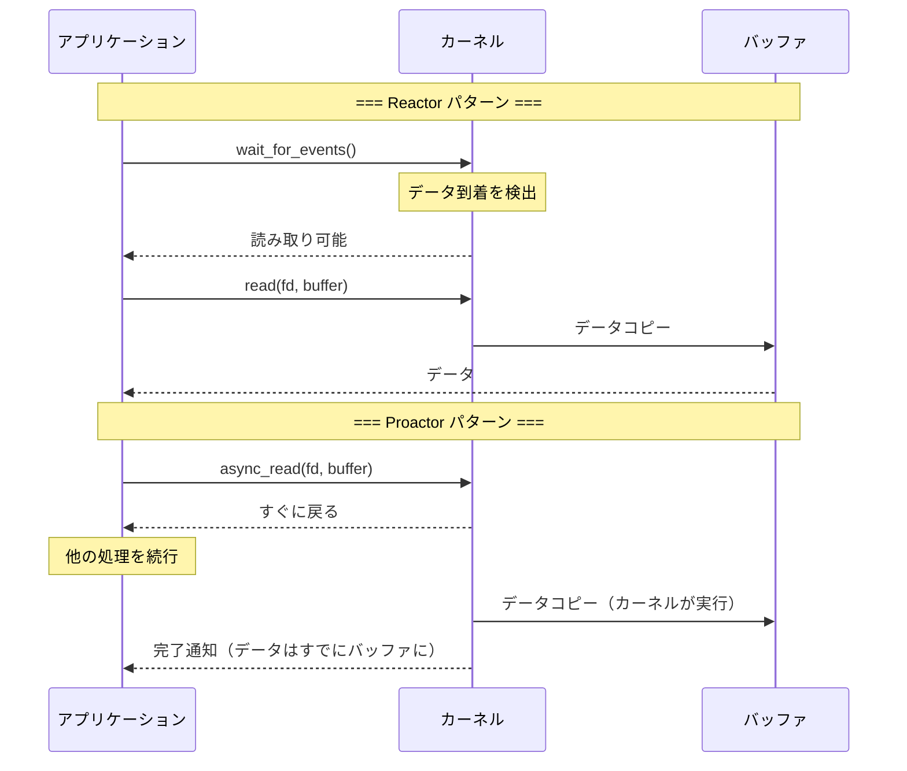

| 特性 | Reactor | Proactor |
|------|---------|----------|
| 通知タイミング | I/O可能時 | I/O完了時 |
| I/O実行者 | アプリケーション | カーネル |
| 代表例 | epoll, kqueue | IOCP, io_uring |
| プラットフォーム | Linux, BSD, macOS | Windows, Linux 5.1+ |

### Proactorの利点と課題

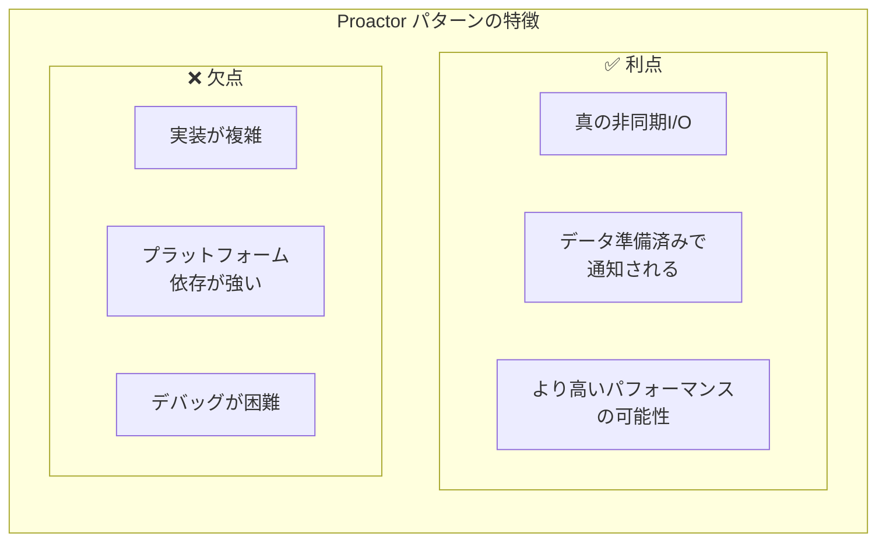

### Windows IOCP での Proactor

Windows IOCP は、Proactorパターンの代表的な実装です：

```c
// IOCP を使った Proactor パターン（疑似コード）
// 1. 非同期読み取りを開始
OVERLAPPED overlapped = {0};
ReadFile(handle, buffer, size, NULL, &overlapped);
// すぐに戻る（I/Oはバックグラウンドで実行）

// 2. 完了を待機
GetQueuedCompletionStatus(iocp, &bytes, &key, &ov, INFINITE);
// この時点でデータはすでにバッファに読み込まれている

// 3. 完了ハンドラを実行
process_completed_io(buffer, bytes);
```

---

## 7.4 イベントループの実装詳細

### 基本的なイベントループ構造

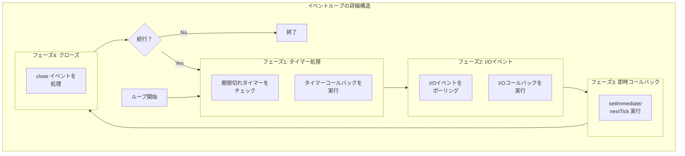

### タスクキューの管理

多くのイベントループは、複数のタスクキューを管理します：

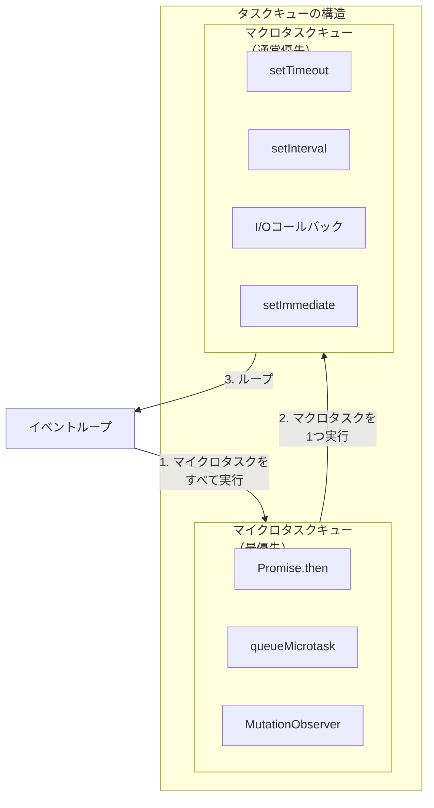

---

## 7.5 libuv（Node.js）

### libuvとは

**libuv**は、Node.jsのために開発されたクロスプラットフォームの非同期I/Oライブラリです。異なるOSのI/O多重化API（epoll, kqueue, IOCP）を統一したインターフェースで抽象化しています。

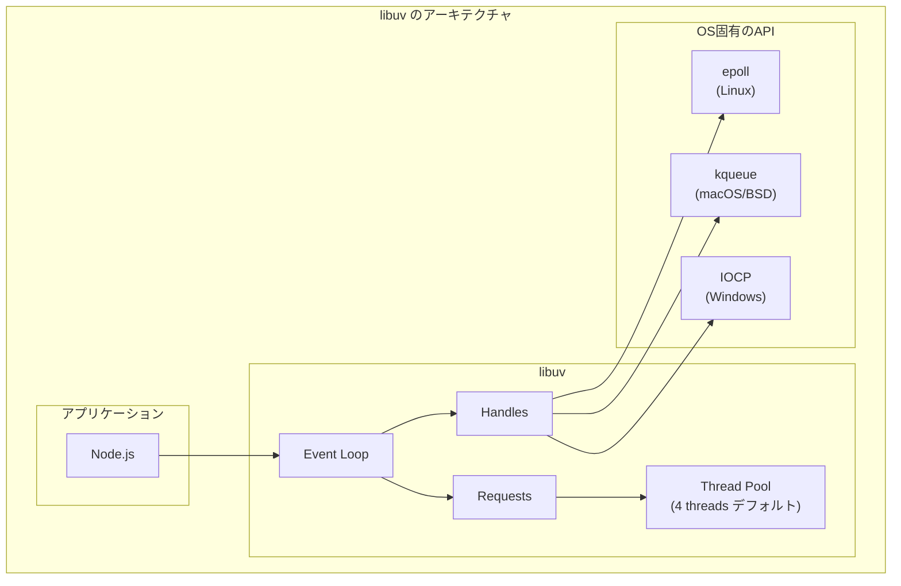

### libuvのイベントループフェーズ

Node.jsのイベントループは、以下のフェーズを順番に実行します：

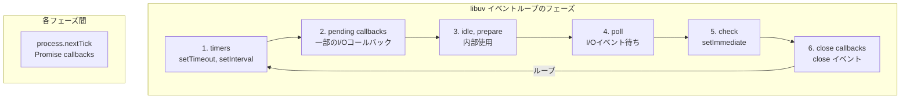

### 各フェーズの詳細

**1. timers フェーズ**
```javascript
// setTimeout, setInterval のコールバックが実行される
setTimeout(() => {
    console.log('タイマー1');
}, 0);

setTimeout(() => {
    console.log('タイマー2');
}, 100);
```

**2. pending callbacks フェーズ**
- 前回のループで延期されたI/Oコールバックを実行
- TCP接続エラーなどの特殊なコールバック

**3. idle, prepare フェーズ**
- 内部使用のみ

**4. poll フェーズ**
```javascript
// I/Oイベントを待機し、コールバックを実行
const fs = require('fs');
fs.readFile('data.txt', (err, data) => {
    console.log('ファイル読み込み完了');
});
```

**5. check フェーズ**
```javascript
// setImmediate のコールバックが実行される
setImmediate(() => {
    console.log('Immediate');
});
```

**6. close callbacks フェーズ**
```javascript
// socket.on('close', ...) などのクローズイベント
socket.on('close', () => {
    console.log('接続が閉じられた');
});
```

### process.nextTick と Promise

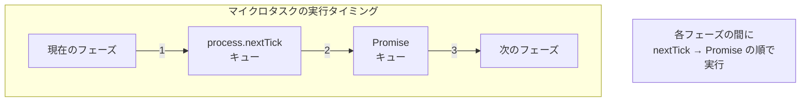

```javascript
// 実行順序の例
console.log('1. 同期処理');

setTimeout(() => {
    console.log('4. setTimeout');
}, 0);

Promise.resolve().then(() => {
    console.log('3. Promise');
});

process.nextTick(() => {
    console.log('2. nextTick');
});

// 出力:
// 1. 同期処理
// 2. nextTick
// 3. Promise
// 4. setTimeout
```

### libuvのスレッドプール

ファイルI/Oや一部の暗号処理など、OSがノンブロッキングAPIを提供していない操作は、スレッドプールで実行されます：

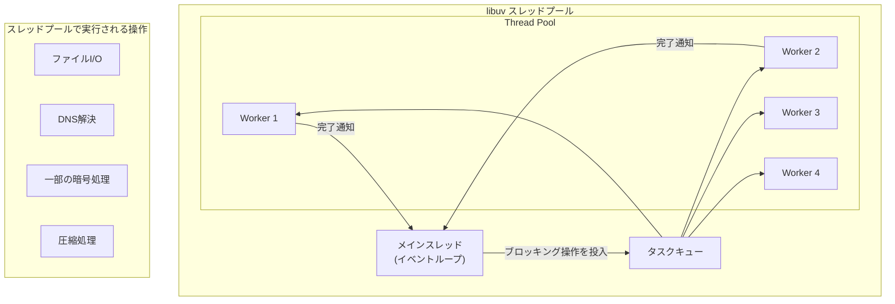

```javascript
// UV_THREADPOOL_SIZE 環境変数でサイズを変更可能
// デフォルトは4、最大128

// ファイルI/Oはスレッドプールで実行
const fs = require('fs');
fs.readFile('large-file.txt', (err, data) => {
    // コールバックはメインスレッドで実行
});

// ネットワークI/OはOSのI/O多重化を使用
// （スレッドプールは使わない）
const net = require('net');
const socket = net.connect(80, 'example.com');
```

---

## 7.6 tokio（Rust）

### tokioとは

**tokio**は、Rustの非同期ランタイムで、高性能な非同期I/Oとタスクスケジューリングを提供します。

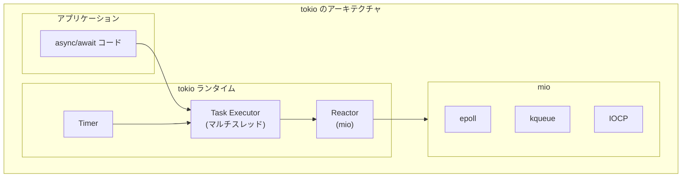

### tokioの特徴

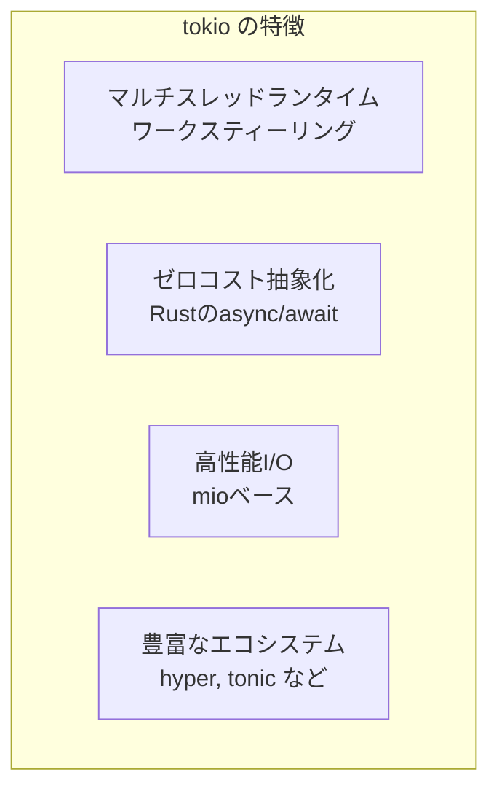

### tokioの基本的な使い方

```rust
use tokio::net::TcpListener;
use tokio::io::{AsyncReadExt, AsyncWriteExt};

#[tokio::main]
async fn main() -> Result<(), Box<dyn std::error::Error>> {
    // TCPリスナーを作成
    let listener = TcpListener::bind("127.0.0.1:8080").await?;
    
    loop {
        // 新しい接続を非同期に受け付け
        let (mut socket, addr) = listener.accept().await?;
        
        // 各接続を別タスクで処理
        tokio::spawn(async move {
            let mut buf = [0; 1024];
            
            loop {
                // 非同期に読み取り
                let n = socket.read(&mut buf).await.unwrap();
                if n == 0 {
                    return;
                }
                
                // 非同期に書き込み（エコー）
                socket.write_all(&buf[..n]).await.unwrap();
            }
        });
    }
}
```

### tokioのタスクスケジューリング

tokioは**ワークスティーリング**アルゴリズムを使用して、複数のスレッドでタスクを効率的に実行します：

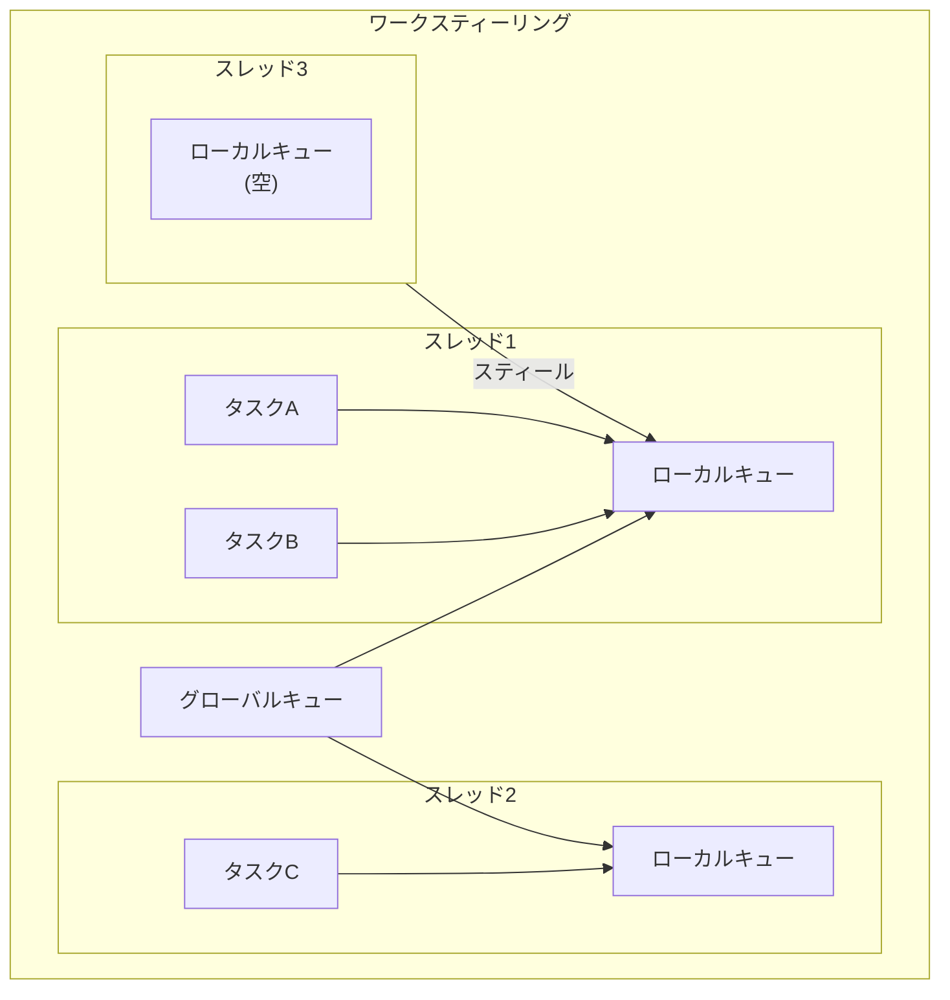

```rust
// マルチスレッドランタイムの設定
#[tokio::main(flavor = "multi_thread", worker_threads = 4)]
async fn main() {
    // 4つのワーカースレッドで実行
}

// シングルスレッドランタイム
#[tokio::main(flavor = "current_thread")]
async fn main() {
    // メインスレッドのみで実行
}
```

### mio - tokioのI/O基盤

tokioは内部で**mio**（Metal I/O）ライブラリを使用しています：

```rust
// mio を直接使う例（通常はtokioを使う）
use mio::{Events, Interest, Poll, Token};
use mio::net::TcpListener;

fn main() -> std::io::Result<()> {
    let mut poll = Poll::new()?;
    let mut events = Events::with_capacity(128);
    
    let mut listener = TcpListener::bind("127.0.0.1:8080".parse().unwrap())?;
    
    // リスナーを登録
    poll.registry().register(
        &mut listener,
        Token(0),
        Interest::READABLE,
    )?;
    
    loop {
        // イベントを待機
        poll.poll(&mut events, None)?;
        
        for event in events.iter() {
            match event.token() {
                Token(0) => {
                    // 新しい接続
                    let (connection, address) = listener.accept()?;
                    println!("接続: {}", address);
                }
                _ => unreachable!(),
            }
        }
    }
}
```

---

## 7.7 asyncio（Python）

### asyncioとは

**asyncio**は、Python 3.4で導入された非同期I/Oフレームワークです。async/await構文と組み合わせて、シングルスレッドで並行処理を実現します。

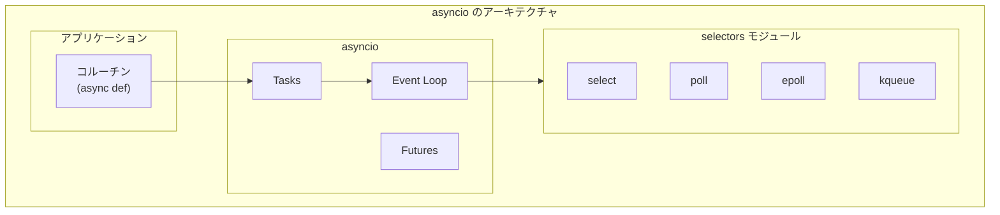

### asyncioの基本的な使い方

```python
import asyncio

async def fetch_data(url):
    """非同期でデータを取得"""
    print(f"取得開始: {url}")
    # 実際のHTTP取得をシミュレート
    await asyncio.sleep(1)
    print(f"取得完了: {url}")
    return f"Data from {url}"

async def main():
    # 複数のタスクを並行実行
    tasks = [
        fetch_data("https://api.example.com/1"),
        fetch_data("https://api.example.com/2"),
        fetch_data("https://api.example.com/3"),
    ]
    
    # すべてのタスクの完了を待つ
    results = await asyncio.gather(*tasks)
    print(f"結果: {results}")

# イベントループを実行
asyncio.run(main())
```

### asyncioのイベントループ

```mermaid
flowchart TB
    subgraph ASYNCIO_LOOP["asyncio イベントループ"]
        RUN["run_until_complete()"]
        
        subgraph CYCLE["ループサイクル"]
            READY["ready キュー<br/>（実行可能タスク）"]
            SCHEDULED["scheduled キュー<br/>（タイマー）"]
            SELECTOR["selector<br/>（I/O待ち）"]
        end
        
        EXECUTE["タスク実行"]
    end
    
    RUN --> CYCLE
    READY --> EXECUTE
    SCHEDULED --> READY
    SELECTOR -->|"I/O完了"| READY
    EXECUTE -->|"await"| CYCLE
```

### Task, Future, Coroutine の関係

```mermaid
flowchart TB
    subgraph ASYNCIO_CONCEPTS["asyncio の主要概念"]
        CORO["Coroutine<br/>(async def で定義)"]
        TASK["Task<br/>(スケジュールされた<br/>Coroutine)"]
        FUTURE["Future<br/>(将来の結果を表す)"]
    end
    
    CORO -->|"asyncio.create_task()"| TASK
    TASK -->|"継承"| FUTURE
    
    subgraph STATES["Future の状態"]
        PENDING["PENDING<br/>（実行中）"]
        FINISHED["FINISHED<br/>（完了）"]
        CANCELLED["CANCELLED<br/>（キャンセル）"]
    end
```

```python
import asyncio

async def my_coroutine():
    """コルーチン関数"""
    await asyncio.sleep(1)
    return "結果"

async def main():
    # コルーチンからタスクを作成
    task = asyncio.create_task(my_coroutine())
    
    print(f"タスクの状態: {task.done()}")  # False
    
    # タスクの完了を待つ
    result = await task
    
    print(f"タスクの状態: {task.done()}")  # True
    print(f"結果: {result}")

asyncio.run(main())
```

### asyncioでのTCPサーバー

```python
import asyncio

async def handle_client(reader, writer):
    """クライアント接続を処理"""
    addr = writer.get_extra_info('peername')
    print(f"接続: {addr}")
    
    while True:
        # 非同期に読み取り
        data = await reader.read(1024)
        if not data:
            break
        
        message = data.decode()
        print(f"受信: {message}")
        
        # 非同期に書き込み（エコー）
        writer.write(data)
        await writer.drain()
    
    print(f"切断: {addr}")
    writer.close()
    await writer.wait_closed()

async def main():
    # サーバーを起動
    server = await asyncio.start_server(
        handle_client, '127.0.0.1', 8080
    )
    
    addr = server.sockets[0].getsockname()
    print(f"サーバー起動: {addr}")
    
    async with server:
        await server.serve_forever()

asyncio.run(main())
```

### uvloop - asyncioの高速化

**uvloop**は、libuvをベースにしたasyncioのイベントループ実装で、大幅な性能向上を実現します：

```python
import asyncio
import uvloop

# uvloop を使用
asyncio.set_event_loop_policy(uvloop.EventLoopPolicy())

# または
uvloop.install()

# 以降は通常通り asyncio を使用
async def main():
    # uvloop の高速なイベントループで実行される
    pass

asyncio.run(main())
```

```mermaid
flowchart LR
    subgraph PERFORMANCE["パフォーマンス比較"]
        ASYNCIO["asyncio<br/>(標準)"]
        UVLOOP["uvloop<br/>(libuvベース)"]
        
        ASYNCIO -->|"2-4倍高速"| UVLOOP
    end
```

---

## 7.8 イベントループのベストプラクティス

### 1. ブロッキング処理の回避

```mermaid
flowchart TB
    subgraph BLOCKING["❌ ブロッキング処理"]
        B1["time.sleep()<br/>（同期）"]
        B2["同期的なHTTPリクエスト"]
        B3["同期的なファイルI/O"]
    end
    
    subgraph NONBLOCKING["✅ ノンブロッキング処理"]
        N1["asyncio.sleep()<br/>（非同期）"]
        N2["aiohttp<br/>（非同期HTTP）"]
        N3["aiofiles<br/>（非同期ファイルI/O）"]
    end
    
    BLOCKING -->|"置き換え"| NONBLOCKING
```

```python
# ❌ 悪い例：ブロッキング処理
import time
import requests

async def bad_example():
    time.sleep(1)  # イベントループをブロック！
    response = requests.get('https://example.com')  # ブロック！

# ✅ 良い例：ノンブロッキング処理
import asyncio
import aiohttp

async def good_example():
    await asyncio.sleep(1)  # イベントループを解放
    async with aiohttp.ClientSession() as session:
        async with session.get('https://example.com') as response:
            return await response.text()
```

### 2. CPUバウンド処理の分離

```mermaid
flowchart TB
    subgraph CPU_BOUND["CPUバウンド処理の対処"]
        MAIN["メインスレッド<br/>（イベントループ）"]
        
        subgraph OPTIONS["選択肢"]
            EXECUTOR["run_in_executor<br/>（スレッドプール）"]
            PROCESS["ProcessPoolExecutor<br/>（プロセスプール）"]
            SEPARATE["別プロセス<br/>（ワーカー）"]
        end
    end
    
    MAIN -->|"重い計算を委譲"| OPTIONS
```

```python
import asyncio
from concurrent.futures import ProcessPoolExecutor

def cpu_intensive_task(n):
    """CPUバウンドな処理"""
    total = 0
    for i in range(n):
        total += i ** 2
    return total

async def main():
    loop = asyncio.get_event_loop()
    
    # プロセスプールで実行
    with ProcessPoolExecutor() as pool:
        result = await loop.run_in_executor(
            pool,
            cpu_intensive_task,
            10_000_000
        )
    
    print(f"結果: {result}")

asyncio.run(main())
```

### 3. 適切なタスク管理

```python
import asyncio

async def main():
    # ✅ タスクをセットで管理
    tasks = set()
    
    async def worker(name):
        await asyncio.sleep(1)
        print(f"{name} 完了")
    
    for i in range(5):
        task = asyncio.create_task(worker(f"Worker-{i}"))
        tasks.add(task)
        # タスク完了時にセットから削除
        task.add_done_callback(tasks.discard)
    
    # すべてのタスクの完了を待つ
    await asyncio.gather(*tasks)

asyncio.run(main())
```

### 4. エラーハンドリング

```python
import asyncio

async def risky_task():
    await asyncio.sleep(0.5)
    raise ValueError("エラー発生！")

async def main():
    # ✅ 個別のエラーハンドリング
    try:
        await risky_task()
    except ValueError as e:
        print(f"エラーをキャッチ: {e}")
    
    # ✅ gather での return_exceptions
    results = await asyncio.gather(
        risky_task(),
        risky_task(),
        return_exceptions=True
    )
    
    for result in results:
        if isinstance(result, Exception):
            print(f"エラー: {result}")
        else:
            print(f"成功: {result}")

asyncio.run(main())
```

---

## 7.9 まとめ

この章では、イベントループの仕組みについて詳しく学びました。

```mermaid
mindmap
    root((第7章のまとめ))
        イベント駆動
            イベント待ち→ハンドラ実行
            I/O、タイマー、シグナル
            逐次処理との違い
        Reactor
            I/O可能を通知
            アプリがI/O実行
            epoll、kqueue
        Proactor
            I/O完了を通知
            カーネルがI/O実行
            IOCP、io_uring
        libuv
            Node.jsの基盤
            6フェーズのループ
            スレッドプール
        tokio
            Rustの非同期ランタイム
            マルチスレッド
            ワークスティーリング
        asyncio
            Python標準
            コルーチン、Task、Future
            uvloopで高速化
```

### 重要なポイント

#### 1. イベントループは非同期処理の心臓部

イベントループは、I/Oイベント、タイマー、コールバックを効率的に処理する仕組みです。シングルスレッドでも多数の並行処理を実現できます。

#### 2. ReactorとProactorは異なるモデル

Reactorは「I/O可能の通知」、Proactorは「I/O完了の通知」を受け取ります。epoll/kqueueはReactor、IOCPはProactorパターンです。

#### 3. 各ランタイムは基本原理は同じ

libuv、tokio、asyncioは実装言語や詳細は異なりますが、基本的なイベントループの概念は共通しています。OSのI/O多重化APIを抽象化し、効率的な非同期処理を実現します。

#### 4. ブロッキング処理は避ける

イベントループ内でブロッキング処理を行うと、すべての並行処理が停止します。CPUバウンド処理は別スレッド/プロセスで実行します。

---

## 📝 練習問題

1. **ReactorパターンとProactorパターンの違いを、I/O操作の実行者と通知タイミングの観点から説明してください。**
   
   ヒント：「誰がI/Oを実行するか」と「いつ通知されるか」を考えてください。

2. **Node.jsのイベントループには6つのフェーズがあります。timers、poll、checkフェーズの役割をそれぞれ説明してください。**
   
   ヒント：setTimeout、I/Oコールバック、setImmediateがどこで実行されるかを考えてください。

3. **以下のNode.jsコードの実行順序を予測してください。**

   ```javascript
   console.log('1');
   setTimeout(() => console.log('2'), 0);
   Promise.resolve().then(() => console.log('3'));
   process.nextTick(() => console.log('4'));
   setImmediate(() => console.log('5'));
   console.log('6');
   ```
   
   ヒント：同期処理、nextTick、Promise、timers、checkの優先順位を考えてください。

4. **asyncioで長時間のCPUバウンド処理を実行する場合、なぜrun_in_executorを使用すべきなのか説明してください。**
   
   ヒント：イベントループのブロッキングと並行処理への影響を考えてください。

5. **tokioがマルチスレッドランタイムでワークスティーリングを使用する理由を説明してください。シングルスレッドランタイムと比較したメリットとデメリットは何ですか？**
   
   ヒント：負荷分散、オーバーヘッド、CPUコアの活用を考えてください。

---

## 🔗 次の章へ

[第8章: 並行処理の基本モデル](./08-concurrency-models.md) では、マルチプロセス、マルチスレッド、スレッドプールなどの並行処理モデルと、共有メモリ vs メッセージパッシングについて学びます。

---

[← 目次に戻る](../index.md) | [← 前章: OSレベルのI/Oモデル](./06-os-io-models.md)

