# 第8章: 並行処理の基本モデル

> 🎯 **この章の目標**: マルチプロセス、マルチスレッド、スレッドプールなどの並行処理モデルを理解し、共有メモリとメッセージパッシングの違いを学ぶ

---

## 8.1 並行処理モデルの全体像

### なぜ並行処理が必要なのか

現代のコンピュータは複数のCPUコアを持っています。1つのコアだけを使っていては、ハードウェアの性能を最大限に活用できません。また、I/O待ちの間に他の処理を進めることで、全体のスループットを向上させることができます。


```mermaid
flowchart TB
    subgraph WHY_CONCURRENCY["なぜ並行処理が必要か"]
        subgraph HARDWARE["ハードウェアの進化"]
            SINGLE["シングルコア時代<br/>クロック周波数向上"]
            MULTI["マルチコア時代<br/>コア数の増加"]
        end
        
        subgraph GOALS["並行処理の目的"]
            G1["✅ CPUリソースの有効活用"]
            G2["✅ I/O待ち時間の活用"]
            G3["✅ 応答性の向上"]
            G4["✅ スループットの向上"]
        end
    end
    
    SINGLE -->|"物理的限界"| MULTI
    MULTI --> GOALS
```

### 並行処理の3つのモデル

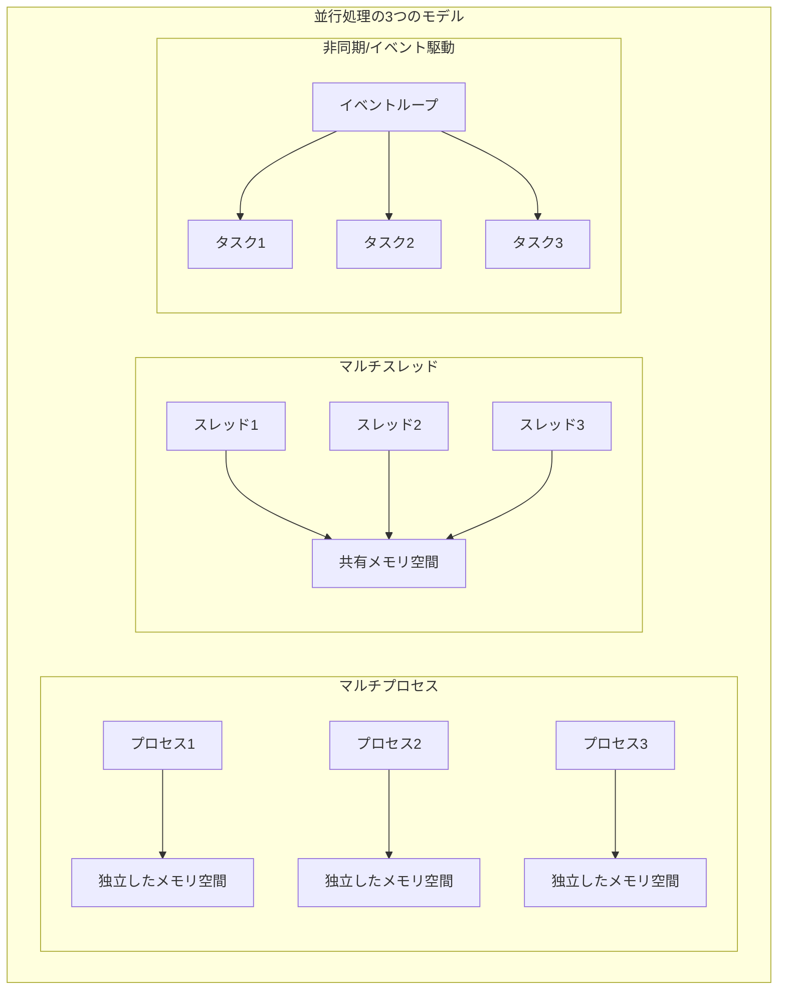
```mermaid
flowchart TB
    subgraph CONCURRENCY_MODELS["並行処理の3つのモデル"]
        subgraph PROCESS["マルチプロセス"]
            P1["プロセス1"]
            P2["プロセス2"]
            P3["プロセス3"]
            P_MEM1["独立したメモリ空間"]
            P_MEM2["独立したメモリ空間"]
            P_MEM3["独立したメモリ空間"]
        end
        
        subgraph THREAD["マルチスレッド"]
            T1["スレッド1"]
            T2["スレッド2"]
            T3["スレッド3"]
            T_MEM["共有メモリ空間"]
        end
        
        subgraph ASYNC["非同期/イベント駆動"]
            LOOP["イベントループ"]
            TASK1["タスク1"]
            TASK2["タスク2"]
            TASK3["タスク3"]
        end
    end
    
    P1 --> P_MEM1
    P2 --> P_MEM2
    P3 --> P_MEM3
    
    T1 --> T_MEM
    T2 --> T_MEM
    T3 --> T_MEM
    
    LOOP --> TASK1
    LOOP --> TASK2
    LOOP --> TASK3
```

| モデル | メモリ | オーバーヘッド | 通信方式 | 適したタスク |
|--------|--------|--------------|---------|------------|
| マルチプロセス | 独立 | 大 | IPC | CPUバウンド、分離が必要 |
| マルチスレッド | 共有 | 中 | 共有メモリ | CPUバウンド、データ共有 |
| 非同期/イベント駆動 | 単一 | 小 | コールバック | I/Oバウンド |

---

## 8.2 マルチプロセス

### プロセスとは

**プロセス**は、実行中のプログラムのインスタンスです。各プロセスは独立したメモリ空間、ファイルディスクリプタ、その他のリソースを持ちます。

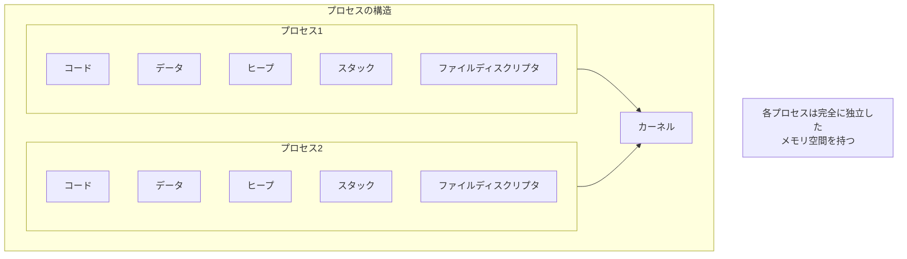
```mermaid
flowchart TB
    subgraph PROCESS_STRUCTURE["プロセスの構造"]
        subgraph PROC1["プロセス1"]
            P1_CODE["コード"]
            P1_DATA["データ"]
            P1_HEAP["ヒープ"]
            P1_STACK["スタック"]
            P1_FD["ファイルディスクリプタ"]
        end
        
        subgraph PROC2["プロセス2"]
            P2_CODE["コード"]
            P2_DATA["データ"]
            P2_HEAP["ヒープ"]
            P2_STACK["スタック"]
            P2_FD["ファイルディスクリプタ"]
        end
        
        KERNEL["カーネル"]
    end
    
    PROC1 --> KERNEL
    PROC2 --> KERNEL
    
    NOTE["各プロセスは完全に独立した<br/>メモリ空間を持つ"]
```

### プロセスの作成（fork）

UNIX系OSでは、`fork()` システムコールで新しいプロセスを作成します。

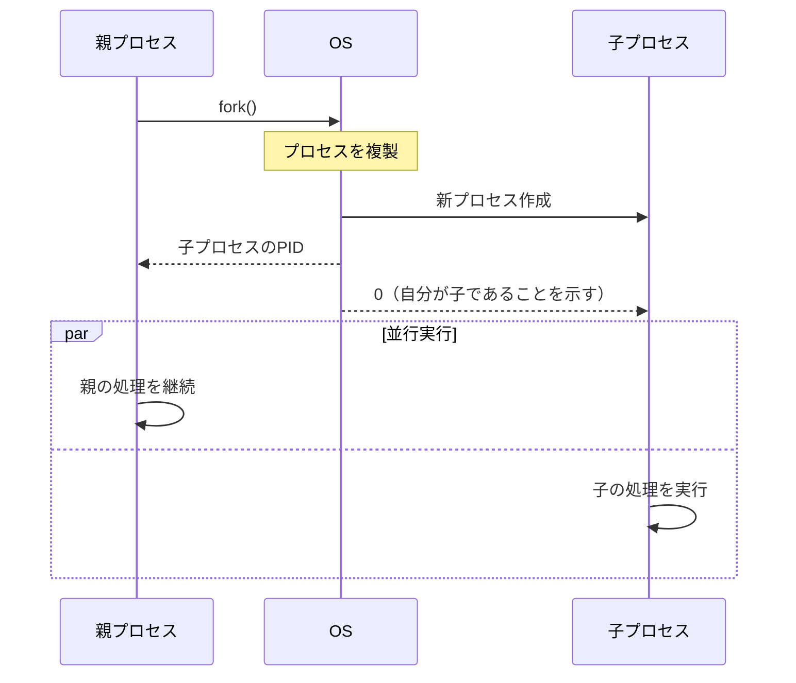
```mermaid
sequenceDiagram
    participant Parent as 親プロセス
    participant OS as OS
    participant Child as 子プロセス
    
    Parent->>OS: fork()
    Note over OS: プロセスを複製
    OS->>Child: 新プロセス作成
    OS-->>Parent: 子プロセスのPID
    OS-->>Child: 0（自分が子であることを示す）
    
    par 並行実行
        Parent->>Parent: 親の処理を継続
    and
        Child->>Child: 子の処理を実行
    end
```

```python
import os

def main():
    print(f"親プロセス: PID={os.getpid()}")
    
    pid = os.fork()
    
    if pid == 0:
        # 子プロセス
        print(f"子プロセス: PID={os.getpid()}, 親PID={os.getppid()}")
    else:
        # 親プロセス
        print(f"親プロセス: 子プロセスのPID={pid}")
        os.waitpid(pid, 0)  # 子プロセスの終了を待つ

if __name__ == "__main__":
    main()
```

### Pythonでのマルチプロセス

Pythonの`multiprocessing`モジュールを使用すると、簡単にマルチプロセスプログラミングができます。

```python
from multiprocessing import Process, Queue
import os
import time

def worker(name, queue):
    """ワーカープロセスの処理"""
    print(f"Worker {name}: PID={os.getpid()}")
    time.sleep(1)
    result = f"Result from {name}"
    queue.put(result)

def main():
    print(f"メインプロセス: PID={os.getpid()}")
    
    queue = Queue()
    processes = []
    
    # 複数のプロセスを作成
    for i in range(4):
        p = Process(target=worker, args=(f"Worker-{i}", queue))
        processes.append(p)
        p.start()
    
    # すべてのプロセスの終了を待つ
    for p in processes:
        p.join()
    
    # 結果を収集
    while not queue.empty():
        print(f"結果: {queue.get()}")

if __name__ == "__main__":
    main()
```

### プロセス間通信（IPC）

プロセスはメモリ空間が独立しているため、データを共有するには**プロセス間通信（IPC: Inter-Process Communication）**が必要です。

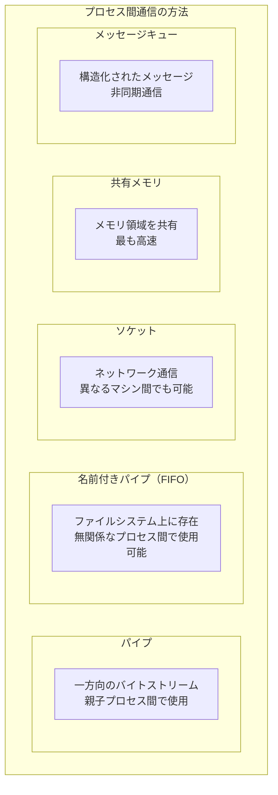
```mermaid
flowchart TB
    subgraph IPC_METHODS["プロセス間通信の方法"]
        subgraph PIPE["パイプ"]
            PIPE_DESC["一方向のバイトストリーム<br/>親子プロセス間で使用"]
        end
        
        subgraph FIFO["名前付きパイプ（FIFO）"]
            FIFO_DESC["ファイルシステム上に存在<br/>無関係なプロセス間で使用可能"]
        end
        
        subgraph SOCKET["ソケット"]
            SOCKET_DESC["ネットワーク通信<br/>異なるマシン間でも可能"]
        end
        
        subgraph SHM["共有メモリ"]
            SHM_DESC["メモリ領域を共有<br/>最も高速"]
        end
        
        subgraph MQ["メッセージキュー"]
            MQ_DESC["構造化されたメッセージ<br/>非同期通信"]
        end
    end
```

#### パイプの例

```python
from multiprocessing import Process, Pipe

def sender(conn):
    """送信側プロセス"""
    messages = ["Hello", "World", "Done"]
    for msg in messages:
        conn.send(msg)
        print(f"送信: {msg}")
    conn.close()

def receiver(conn):
    """受信側プロセス"""
    while True:
        try:
            msg = conn.recv()
            print(f"受信: {msg}")
            if msg == "Done":
                break
        except EOFError:
            break

if __name__ == "__main__":
    parent_conn, child_conn = Pipe()
    
    p1 = Process(target=sender, args=(parent_conn,))
    p2 = Process(target=receiver, args=(child_conn,))
    
    p1.start()
    p2.start()
    
    p1.join()
    p2.join()
```

### マルチプロセスの特徴

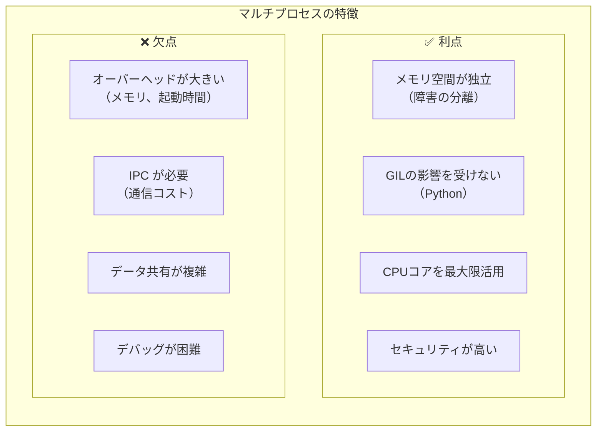
```mermaid
flowchart LR
    subgraph MULTIPROCESS_FEATURES["マルチプロセスの特徴"]
        subgraph PROS["✅ 利点"]
            P1["メモリ空間が独立<br/>（障害の分離）"]
            P2["GILの影響を受けない<br/>（Python）"]
            P3["CPUコアを最大限活用"]
            P4["セキュリティが高い"]
        end
        
        subgraph CONS["❌ 欠点"]
            C1["オーバーヘッドが大きい<br/>（メモリ、起動時間）"]
            C2["IPC が必要<br/>（通信コスト）"]
            C3["データ共有が複雑"]
            C4["デバッグが困難"]
        end
    end
```

### マルチプロセスが適した場面

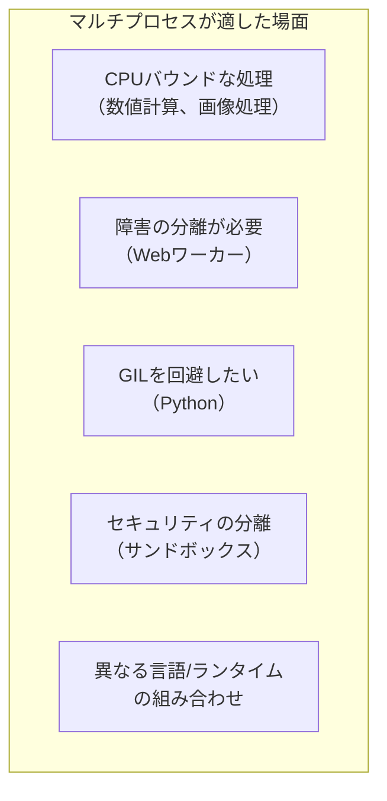
```mermaid
flowchart TB
    subgraph USE_CASES["マルチプロセスが適した場面"]
        UC1["CPUバウンドな処理<br/>（数値計算、画像処理）"]
        UC2["障害の分離が必要<br/>（Webワーカー）"]
        UC3["GILを回避したい<br/>（Python）"]
        UC4["セキュリティの分離<br/>（サンドボックス）"]
        UC5["異なる言語/ランタイム<br/>の組み合わせ"]
    end
```

---

## 8.3 マルチスレッド

### スレッドとは

**スレッド**は、プロセス内の実行単位です。同じプロセス内のスレッドは、メモリ空間（ヒープ、グローバル変数）を共有しますが、それぞれ独自のスタックを持ちます。

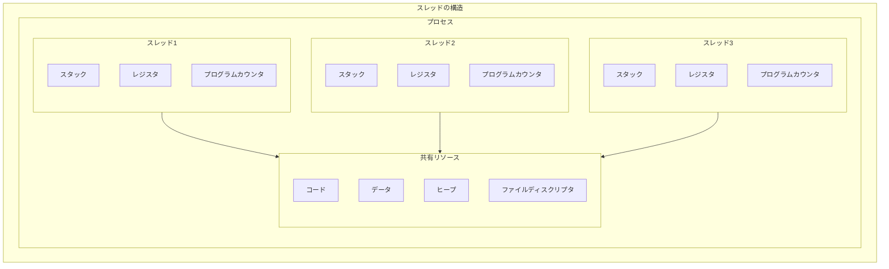
```mermaid
flowchart TB
    subgraph THREAD_STRUCTURE["スレッドの構造"]
        subgraph PROCESS["プロセス"]
            subgraph SHARED["共有リソース"]
                CODE["コード"]
                DATA["データ"]
                HEAP["ヒープ"]
                FD["ファイルディスクリプタ"]
            end
            
            subgraph THREAD1["スレッド1"]
                T1_STACK["スタック"]
                T1_REG["レジスタ"]
                T1_PC["プログラムカウンタ"]
            end
            
            subgraph THREAD2["スレッド2"]
                T2_STACK["スタック"]
                T2_REG["レジスタ"]
                T2_PC["プログラムカウンタ"]
            end
            
            subgraph THREAD3["スレッド3"]
                T3_STACK["スタック"]
                T3_REG["レジスタ"]
                T3_PC["プログラムカウンタ"]
            end
        end
    end
    
    THREAD1 --> SHARED
    THREAD2 --> SHARED
    THREAD3 --> SHARED
```

### プロセスとスレッドの比較

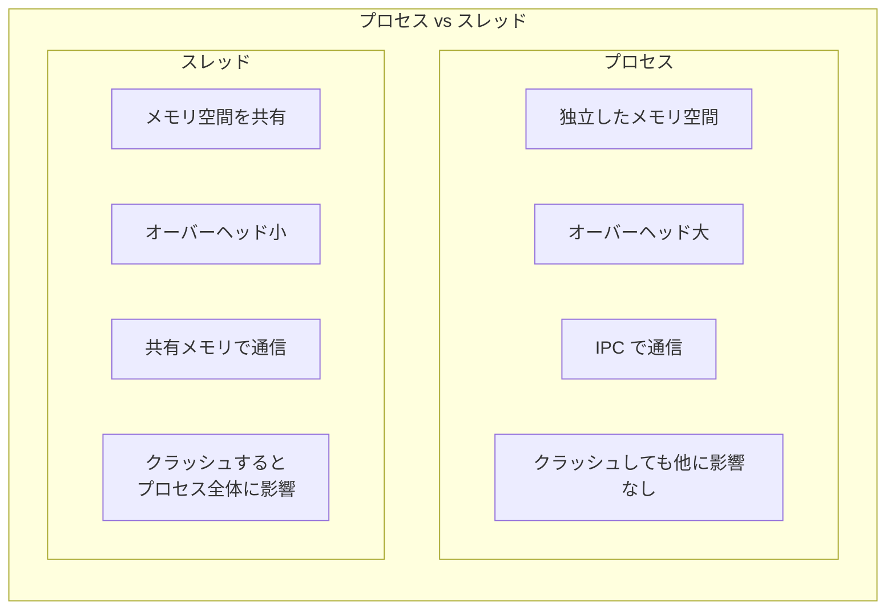
```mermaid
flowchart LR
    subgraph COMPARISON["プロセス vs スレッド"]
        subgraph PROCESS_BOX["プロセス"]
            P_MEM["独立したメモリ空間"]
            P_OVERHEAD["オーバーヘッド大"]
            P_COMM["IPC で通信"]
            P_CRASH["クラッシュしても他に影響なし"]
        end
        
        subgraph THREAD_BOX["スレッド"]
            T_MEM["メモリ空間を共有"]
            T_OVERHEAD["オーバーヘッド小"]
            T_COMM["共有メモリで通信"]
            T_CRASH["クラッシュすると<br/>プロセス全体に影響"]
        end
    end
```

| 特性 | プロセス | スレッド |
|------|---------|---------|
| メモリ空間 | 独立 | 共有 |
| 作成コスト | 高い | 低い |
| コンテキストスイッチ | 遅い | 速い |
| 通信 | IPC（複雑） | 共有メモリ（簡単だが注意が必要） |
| 障害の影響 | 分離されている | 波及する |

### Pythonでのマルチスレッド

```python
import threading
import time

def worker(name, duration):
    """ワーカースレッドの処理"""
    print(f"スレッド {name}: 開始")
    time.sleep(duration)
    print(f"スレッド {name}: 完了")

def main():
    threads = []
    
    # 複数のスレッドを作成
    for i in range(4):
        t = threading.Thread(
            target=worker, 
            args=(f"Worker-{i}", i + 1)
        )
        threads.append(t)
        t.start()
    
    # すべてのスレッドの終了を待つ
    for t in threads:
        t.join()
    
    print("すべてのスレッドが完了")

if __name__ == "__main__":
    main()
```

### スレッドの同期問題

スレッドがメモリを共有することで、**競合状態（Race Condition）**が発生する可能性があります。

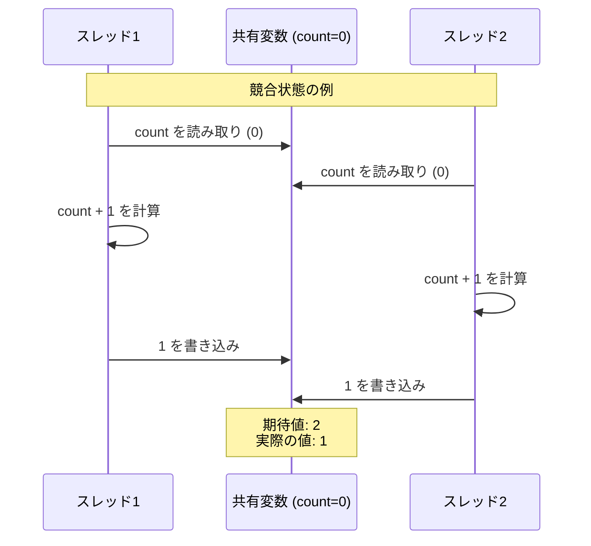
```mermaid
sequenceDiagram
    participant T1 as スレッド1
    participant MEM as 共有変数 (count=0)
    participant T2 as スレッド2
    
    Note over T1,T2: 競合状態の例
    
    T1->>MEM: count を読み取り (0)
    T2->>MEM: count を読み取り (0)
    T1->>T1: count + 1 を計算
    T2->>T2: count + 1 を計算
    T1->>MEM: 1 を書き込み
    T2->>MEM: 1 を書き込み
    
    Note over MEM: 期待値: 2<br/>実際の値: 1
```

```python
import threading

counter = 0

def increment():
    global counter
    for _ in range(100000):
        # この操作はアトミックではない！
        counter += 1

threads = []
for i in range(4):
    t = threading.Thread(target=increment)
    threads.append(t)
    t.start()

for t in threads:
    t.join()

print(f"期待値: 400000, 実際の値: {counter}")
# 出力例: 期待値: 400000, 実際の値: 285743
```

### 同期プリミティブ

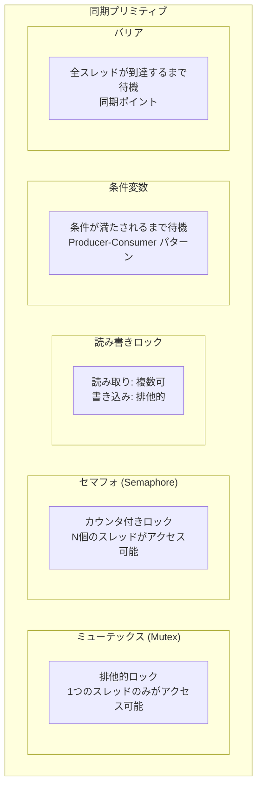
```mermaid
flowchart TB
    subgraph SYNC_PRIMITIVES["同期プリミティブ"]
        subgraph MUTEX["ミューテックス (Mutex)"]
            MUTEX_DESC["排他的ロック<br/>1つのスレッドのみがアクセス可能"]
        end
        
        subgraph SEMAPHORE["セマフォ (Semaphore)"]
            SEM_DESC["カウンタ付きロック<br/>N個のスレッドがアクセス可能"]
        end
        
        subgraph RWLOCK["読み書きロック"]
            RW_DESC["読み取り: 複数可<br/>書き込み: 排他的"]
        end
        
        subgraph COND["条件変数"]
            COND_DESC["条件が満たされるまで待機<br/>Producer-Consumer パターン"]
        end
        
        subgraph BARRIER["バリア"]
            BARRIER_DESC["全スレッドが到達するまで待機<br/>同期ポイント"]
        end
    end
```

#### ミューテックスの使用例

```python
import threading

counter = 0
lock = threading.Lock()

def safe_increment():
    global counter
    for _ in range(100000):
        with lock:  # ロックを取得
            counter += 1
        # ロックを自動的に解放

threads = []
for i in range(4):
    t = threading.Thread(target=safe_increment)
    threads.append(t)
    t.start()

for t in threads:
    t.join()

print(f"期待値: 400000, 実際の値: {counter}")
# 出力: 期待値: 400000, 実際の値: 400000
```

### デッドロック

**デッドロック**は、複数のスレッドが互いにロックを待ち合っている状態です。

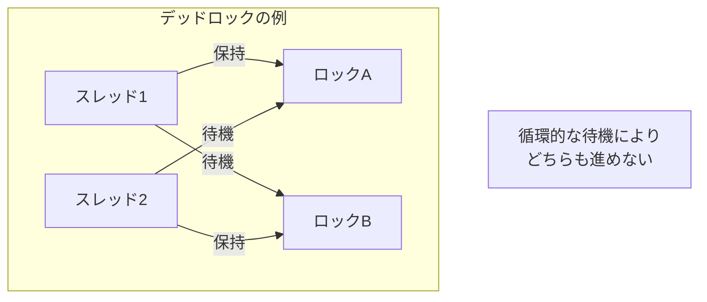
```mermaid
flowchart TB
    subgraph DEADLOCK["デッドロックの例"]
        T1["スレッド1"]
        T2["スレッド2"]
        LOCK_A["ロックA"]
        LOCK_B["ロックB"]
    end
    
    T1 -->|"保持"| LOCK_A
    T1 -->|"待機"| LOCK_B
    T2 -->|"保持"| LOCK_B
    T2 -->|"待機"| LOCK_A
    
    NOTE["循環的な待機により<br/>どちらも進めない"]
```

```python
import threading
import time

lock_a = threading.Lock()
lock_b = threading.Lock()

def thread1():
    with lock_a:
        print("スレッド1: ロックAを取得")
        time.sleep(0.1)
        with lock_b:  # ここでデッドロック！
            print("スレッド1: ロックBを取得")

def thread2():
    with lock_b:
        print("スレッド2: ロックBを取得")
        time.sleep(0.1)
        with lock_a:  # ここでデッドロック！
            print("スレッド2: ロックAを取得")

# デッドロックを避けるには、常に同じ順序でロックを取得する
```

### デッドロックの回避策

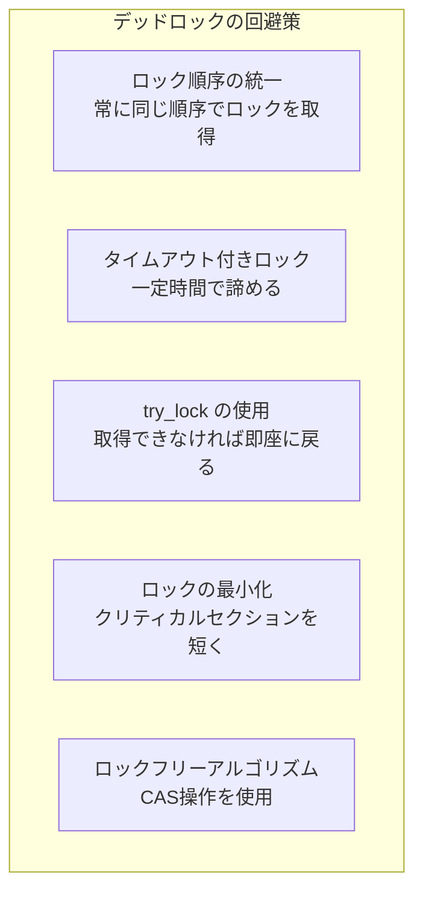
```mermaid
flowchart TB
    subgraph DEADLOCK_PREVENTION["デッドロックの回避策"]
        P1["ロック順序の統一<br/>常に同じ順序でロックを取得"]
        P2["タイムアウト付きロック<br/>一定時間で諦める"]
        P3["try_lock の使用<br/>取得できなければ即座に戻る"]
        P4["ロックの最小化<br/>クリティカルセクションを短く"]
        P5["ロックフリーアルゴリズム<br/>CAS操作を使用"]
    end
```

### PythonのGIL（Global Interpreter Lock）

Python（CPython）には**GIL**という特殊な制限があります。GILは、一度に1つのスレッドしかPythonバイトコードを実行できないようにするロックです。

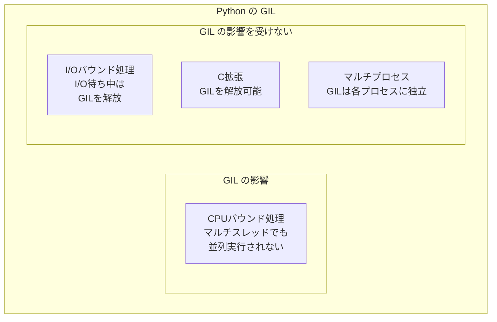
```mermaid
flowchart TB
    subgraph GIL["Python の GIL"]
        subgraph WITH_GIL["GIL の影響"]
            CPU_BOUND["CPUバウンド処理<br/>マルチスレッドでも<br/>並列実行されない"]
        end
        
        subgraph WITHOUT_GIL["GIL の影響を受けない"]
            IO_BOUND["I/Oバウンド処理<br/>I/O待ち中は<br/>GILを解放"]
            C_EXT["C拡張<br/>GILを解放可能"]
            MULTIPROC["マルチプロセス<br/>GILは各プロセスに独立"]
        end
    end
```

```python
import threading
import time

def cpu_bound_task(n):
    """CPUバウンドな処理"""
    count = 0
    for i in range(n):
        count += i ** 2
    return count

# シングルスレッド
start = time.time()
cpu_bound_task(10_000_000)
cpu_bound_task(10_000_000)
print(f"シングルスレッド: {time.time() - start:.2f}秒")

# マルチスレッド（GILのため速くならない）
start = time.time()
t1 = threading.Thread(target=cpu_bound_task, args=(10_000_000,))
t2 = threading.Thread(target=cpu_bound_task, args=(10_000_000,))
t1.start()
t2.start()
t1.join()
t2.join()
print(f"マルチスレッド: {time.time() - start:.2f}秒")

# 結果: ほぼ同じか、マルチスレッドの方が遅いこともある
```

### マルチスレッドが適した場面

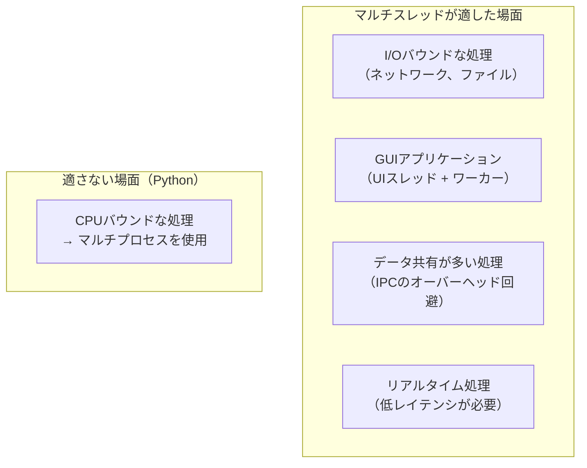
```mermaid
flowchart TB
    subgraph THREAD_USE_CASES["マルチスレッドが適した場面"]
        UC1["I/Oバウンドな処理<br/>（ネットワーク、ファイル）"]
        UC2["GUIアプリケーション<br/>（UIスレッド + ワーカー）"]
        UC3["データ共有が多い処理<br/>（IPCのオーバーヘッド回避）"]
        UC4["リアルタイム処理<br/>（低レイテンシが必要）"]
    end
    
    subgraph NOT_SUITABLE["適さない場面（Python）"]
        NS1["CPUバウンドな処理<br/>→ マルチプロセスを使用"]
    end
```

---

## 8.4 スレッドプール

### スレッドプールとは

**スレッドプール**は、あらかじめ作成されたスレッドのプールを使い回す仕組みです。スレッドの作成・破棄のオーバーヘッドを削減し、リソースを効率的に管理します。

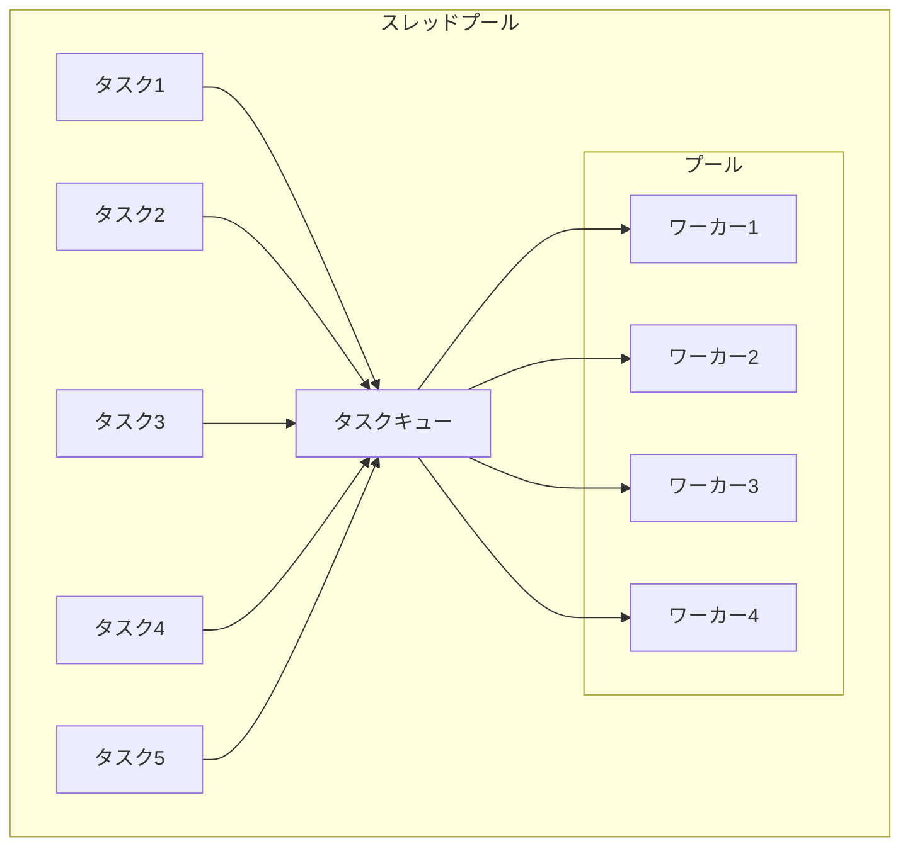
```mermaid
flowchart TB
    subgraph THREAD_POOL["スレッドプール"]
        subgraph POOL["プール"]
            W1["ワーカー1"]
            W2["ワーカー2"]
            W3["ワーカー3"]
            W4["ワーカー4"]
        end
        
        QUEUE["タスクキュー"]
        
        T1["タスク1"]
        T2["タスク2"]
        T3["タスク3"]
        T4["タスク4"]
        T5["タスク5"]
    end
    
    T1 --> QUEUE
    T2 --> QUEUE
    T3 --> QUEUE
    T4 --> QUEUE
    T5 --> QUEUE
    
    QUEUE --> W1
    QUEUE --> W2
    QUEUE --> W3
    QUEUE --> W4
```

### スレッドプールの動作

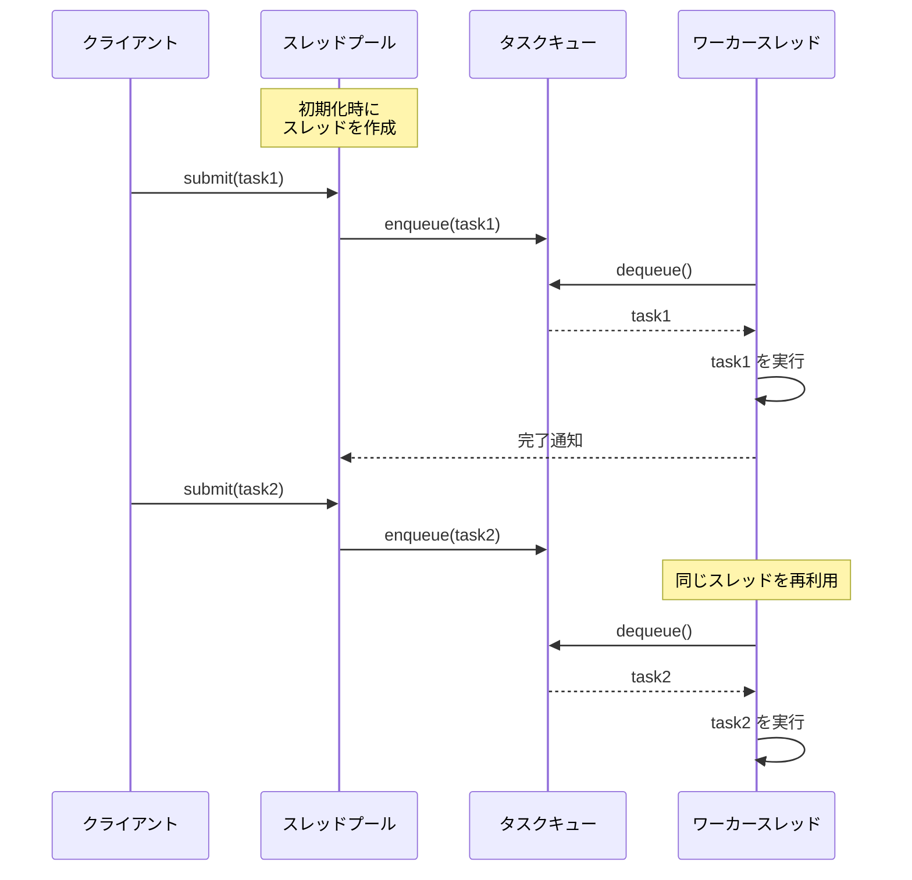
```mermaid
sequenceDiagram
    participant Client as クライアント
    participant Pool as スレッドプール
    participant Queue as タスクキュー
    participant Worker as ワーカースレッド
    
    Note over Pool: 初期化時に<br/>スレッドを作成
    
    Client->>Pool: submit(task1)
    Pool->>Queue: enqueue(task1)
    
    Worker->>Queue: dequeue()
    Queue-->>Worker: task1
    Worker->>Worker: task1 を実行
    Worker-->>Pool: 完了通知
    
    Client->>Pool: submit(task2)
    Pool->>Queue: enqueue(task2)
    
    Note over Worker: 同じスレッドを再利用
    Worker->>Queue: dequeue()
    Queue-->>Worker: task2
    Worker->>Worker: task2 を実行
```

### Pythonでのスレッドプール

```python
from concurrent.futures import ThreadPoolExecutor, as_completed
import time

def task(name, duration):
    """タスクの処理"""
    print(f"タスク {name}: 開始")
    time.sleep(duration)
    print(f"タスク {name}: 完了")
    return f"Result from {name}"

def main():
    # スレッドプールを作成（最大4スレッド）
    with ThreadPoolExecutor(max_workers=4) as executor:
        # タスクを投入
        futures = {
            executor.submit(task, f"Task-{i}", i % 3 + 1): i 
            for i in range(8)
        }
        
        # 完了したタスクから結果を取得
        for future in as_completed(futures):
            task_id = futures[future]
            try:
                result = future.result()
                print(f"タスク {task_id} の結果: {result}")
            except Exception as e:
                print(f"タスク {task_id} でエラー: {e}")

if __name__ == "__main__":
    main()
```

### プロセスプール

CPUバウンドな処理には、スレッドプールではなく**プロセスプール**を使用します。

```python
from concurrent.futures import ProcessPoolExecutor
import time

def cpu_bound_task(n):
    """CPUバウンドな処理"""
    total = 0
    for i in range(n):
        total += i ** 2
    return total

def main():
    numbers = [10_000_000] * 8
    
    # シングルプロセス
    start = time.time()
    results = [cpu_bound_task(n) for n in numbers]
    print(f"シングルプロセス: {time.time() - start:.2f}秒")
    
    # プロセスプール
    start = time.time()
    with ProcessPoolExecutor(max_workers=4) as executor:
        results = list(executor.map(cpu_bound_task, numbers))
    print(f"プロセスプール: {time.time() - start:.2f}秒")

if __name__ == "__main__":
    main()
```

### スレッドプールのサイジング

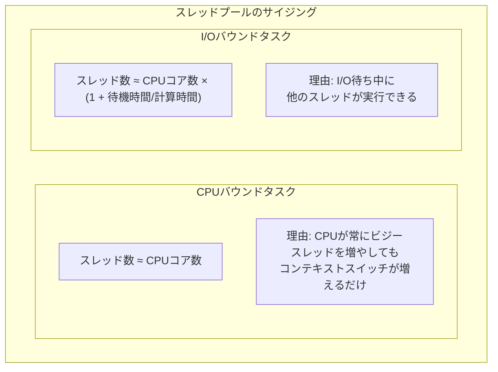
```mermaid
flowchart TB
    subgraph POOL_SIZING["スレッドプールのサイジング"]
        subgraph CPU_BOUND_SIZE["CPUバウンドタスク"]
            CPU_FORMULA["スレッド数 ≈ CPUコア数"]
            CPU_REASON["理由: CPUが常にビジー<br/>スレッドを増やしても<br/>コンテキストスイッチが増えるだけ"]
        end
        
        subgraph IO_BOUND_SIZE["I/Oバウンドタスク"]
            IO_FORMULA["スレッド数 ≈ CPUコア数 × (1 + 待機時間/計算時間)"]
            IO_REASON["理由: I/O待ち中に<br/>他のスレッドが実行できる"]
        end
    end
```

| タスクの種類 | 推奨スレッド数 | 例（4コアCPU） |
|-------------|--------------|---------------|
| CPUバウンド | コア数 | 4 |
| I/Oバウンド（待機50%） | コア数 × 2 | 8 |
| I/Oバウンド（待機90%） | コア数 × 10 | 40 |

---

## 8.5 共有メモリ vs メッセージパッシング

### 2つのアプローチ

並行プログラムでデータをやり取りする方法は、大きく2つに分けられます。

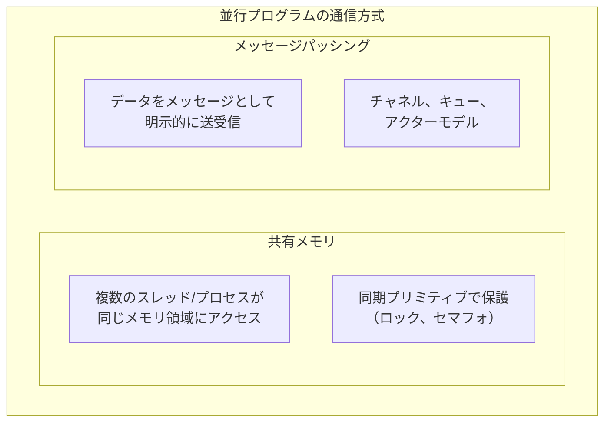
```mermaid
flowchart TB
    subgraph COMMUNICATION["並行プログラムの通信方式"]
        subgraph SHARED_MEMORY["共有メモリ"]
            SM_DESC["複数のスレッド/プロセスが<br/>同じメモリ領域にアクセス"]
            SM_SYNC["同期プリミティブで保護<br/>（ロック、セマフォ）"]
        end
        
        subgraph MESSAGE_PASSING["メッセージパッシング"]
            MP_DESC["データをメッセージとして<br/>明示的に送受信"]
            MP_CHANNEL["チャネル、キュー、<br/>アクターモデル"]
        end
    end
```

### 共有メモリモデル

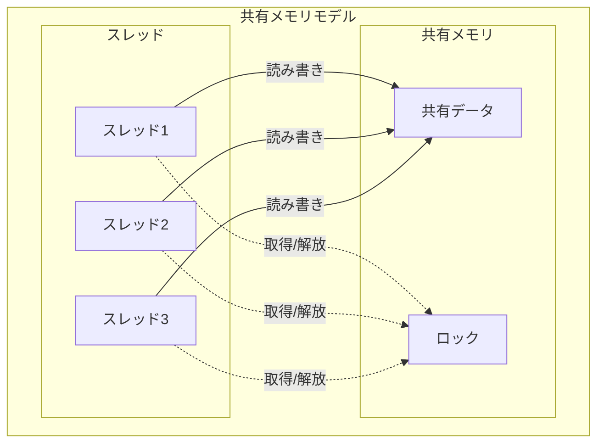
```mermaid
flowchart TB
    subgraph SHARED_MEMORY_MODEL["共有メモリモデル"]
        subgraph THREADS["スレッド"]
            T1["スレッド1"]
            T2["スレッド2"]
            T3["スレッド3"]
        end
        
        subgraph MEMORY["共有メモリ"]
            DATA["共有データ"]
            LOCK["ロック"]
        end
    end
    
    T1 -->|"読み書き"| DATA
    T2 -->|"読み書き"| DATA
    T3 -->|"読み書き"| DATA
    
    T1 -.->|"取得/解放"| LOCK
    T2 -.->|"取得/解放"| LOCK
    T3 -.->|"取得/解放"| LOCK
```

```python
import threading

# 共有メモリモデルの例
class SharedCounter:
    def __init__(self):
        self.value = 0
        self.lock = threading.Lock()
    
    def increment(self):
        with self.lock:
            self.value += 1
    
    def get(self):
        with self.lock:
            return self.value

counter = SharedCounter()

def worker():
    for _ in range(10000):
        counter.increment()

threads = [threading.Thread(target=worker) for _ in range(4)]
for t in threads:
    t.start()
for t in threads:
    t.join()

print(f"カウント: {counter.get()}")  # 40000
```

### メッセージパッシングモデル

```mermaid
flowchart TB
    subgraph MESSAGE_PASSING_MODEL["メッセージパッシングモデル"]
        subgraph ACTORS["プロセス/アクター"]
            A1["アクター1<br/>（独自の状態）"]
            A2["アクター2<br/>（独自の状態）"]
            A3["アクター3<br/>（独自の状態）"]
        end
        
        subgraph CHANNELS["チャネル/キュー"]
            CH1["チャネル1"]
            CH2["チャネル2"]
        end
    end
    
    A1 -->|"メッセージ送信"| CH1
    CH1 -->|"メッセージ受信"| A2
    A2 -->|"メッセージ送信"| CH2
    CH2 -->|"メッセージ受信"| A3
```

```python
from multiprocessing import Process, Queue

# メッセージパッシングモデルの例
def counter_process(queue, result_queue):
    """カウンタープロセス"""
    count = 0
    while True:
        msg = queue.get()
        if msg == "increment":
            count += 1
        elif msg == "get":
            result_queue.put(count)
        elif msg == "stop":
            break

def worker(queue, n):
    """ワーカープロセス"""
    for _ in range(n):
        queue.put("increment")

if __name__ == "__main__":
    queue = Queue()
    result_queue = Queue()
    
    # カウンタープロセスを開始
    counter = Process(target=counter_process, args=(queue, result_queue))
    counter.start()
    
    # ワーカープロセスを開始
    workers = [
        Process(target=worker, args=(queue, 10000))
        for _ in range(4)
    ]
    for w in workers:
        w.start()
    for w in workers:
        w.join()
    
    # 結果を取得
    queue.put("get")
    print(f"カウント: {result_queue.get()}")  # 40000
    
    queue.put("stop")
    counter.join()
```

### 2つのアプローチの比較

```mermaid
flowchart LR
    subgraph COMPARISON_TABLE["共有メモリ vs メッセージパッシング"]
        subgraph SHARED["共有メモリ"]
            S1["✅ 高速なデータアクセス"]
            S2["✅ 大量データの共有に効率的"]
            S3["❌ 同期が複雑"]
            S4["❌ デッドロック、競合のリスク"]
            S5["❌ デバッグが困難"]
        end
        
        subgraph MESSAGE["メッセージパッシング"]
            M1["✅ 同期が単純"]
            M2["✅ 障害の分離"]
            M3["✅ スケールアウトしやすい"]
            M4["❌ データコピーのオーバーヘッド"]
            M5["❌ メッセージ設計が必要"]
        end
    end
```

| 特性 | 共有メモリ | メッセージパッシング |
|------|----------|-------------------|
| データアクセス速度 | 高速 | コピーが必要 |
| 同期の複雑さ | 高い | 低い |
| デッドロックのリスク | あり | 低い |
| スケーラビリティ | 単一マシン | 分散可能 |
| 適した言語 | C/C++, Java | Go, Erlang, Rust |

### Go言語のチャネル

Go言語は、メッセージパッシングを言語レベルでサポートしています。

```go
package main

import (
    "fmt"
    "sync"
)

func main() {
    // チャネルを作成
    ch := make(chan int)
    var wg sync.WaitGroup
    
    // 送信側ゴルーチン
    for i := 0; i < 4; i++ {
        wg.Add(1)
        go func(id int) {
            defer wg.Done()
            for j := 0; j < 10000; j++ {
                ch <- 1
            }
        }(i)
    }
    
    // 受信側ゴルーチン
    go func() {
        wg.Wait()
        close(ch)
    }()
    
    // カウント
    count := 0
    for val := range ch {
        count += val
    }
    
    fmt.Printf("カウント: %d\n", count)  // 40000
}
```

### Rustの所有権とメッセージパッシング

Rustは、所有権システムとチャネルを組み合わせて、安全な並行プログラミングを実現します。

```rust
use std::sync::mpsc;
use std::thread;

fn main() {
    let (tx, rx) = mpsc::channel();
    
    // 送信側スレッド
    let tx1 = tx.clone();
    thread::spawn(move || {
        for i in 0..5 {
            tx1.send(format!("スレッド1: {}", i)).unwrap();
        }
    });
    
    thread::spawn(move || {
        for i in 0..5 {
            tx.send(format!("スレッド2: {}", i)).unwrap();
        }
    });
    
    // 受信
    for received in rx {
        println!("受信: {}", received);
    }
}
```

### CSP（Communicating Sequential Processes）

**CSP**は、メッセージパッシングによる並行プログラミングのモデルです。GoやClojureのcore.asyncはCSPに基づいています。

```mermaid
flowchart TB
    subgraph CSP["CSP モデル"]
        subgraph PROCESSES["プロセス"]
            P1["プロセス1"]
            P2["プロセス2"]
            P3["プロセス3"]
        end
        
        subgraph CHANNELS_CSP["チャネル"]
            CH["チャネル<br/>（同期的な通信）"]
        end
    end
    
    P1 -->|"送信"| CH
    CH -->|"受信"| P2
    P2 -->|"送信"| CH
    CH -->|"受信"| P3
    
    NOTE["'Don't communicate by sharing memory;<br/>share memory by communicating.'<br/>— Go の格言"]
```

### アクターモデル

**アクターモデル**は、各アクターが独自の状態を持ち、メッセージを通じてのみ通信するモデルです。Erlang/Elixir, Akka（Scala/Java）で採用されています。

```mermaid
flowchart TB
    subgraph ACTOR_MODEL["アクターモデル"]
        subgraph ACTOR1["アクター1"]
            A1_MAILBOX["メールボックス"]
            A1_STATE["状態"]
            A1_BEHAVIOR["振る舞い"]
        end
        
        subgraph ACTOR2["アクター2"]
            A2_MAILBOX["メールボックス"]
            A2_STATE["状態"]
            A2_BEHAVIOR["振る舞い"]
        end
        
        subgraph ACTOR3["アクター3"]
            A3_MAILBOX["メールボックス"]
            A3_STATE["状態"]
            A3_BEHAVIOR["振る舞い"]
        end
    end
    
    ACTOR1 -->|"メッセージ"| A2_MAILBOX
    ACTOR2 -->|"メッセージ"| A3_MAILBOX
    ACTOR3 -->|"メッセージ"| A1_MAILBOX
    
    NOTE["各アクターは:<br/>・メッセージを受信<br/>・状態を変更<br/>・新しいアクターを作成<br/>・メッセージを送信"]
```

---

## 8.6 モデル選択の指針

### 判断フローチャート

```mermaid
flowchart TB
    START["タスクの分析"]
    
    Q1{"タスクの種類は？"}
    Q2{"データ共有は<br/>頻繁？"}
    Q3{"障害の分離が<br/>必要？"}
    Q4{"スケールアウトが<br/>必要？"}
    
    ASYNC["非同期/イベント駆動<br/>（asyncio, Node.js）"]
    THREAD["マルチスレッド<br/>+ 共有メモリ"]
    PROCESS["マルチプロセス<br/>+ メッセージパッシング"]
    DISTRIBUTED["分散システム<br/>（マイクロサービス）"]
    
    START --> Q1
    Q1 -->|"I/Oバウンド"| ASYNC
    Q1 -->|"CPUバウンド"| Q2
    
    Q2 -->|"Yes"| Q3
    Q2 -->|"No"| PROCESS
    
    Q3 -->|"Yes"| PROCESS
    Q3 -->|"No"| THREAD
    
    PROCESS --> Q4
    Q4 -->|"Yes"| DISTRIBUTED
```

### 言語別の推奨

```mermaid
flowchart TB
    subgraph LANG_RECOMMENDATIONS["言語別の推奨"]
        subgraph PYTHON["Python"]
            PY1["I/Oバウンド: asyncio"]
            PY2["CPUバウンド: multiprocessing"]
            PY3["スレッド: GILに注意"]
        end
        
        subgraph GO["Go"]
            GO1["ゴルーチン + チャネル"]
            GO2["CSPモデル"]
            GO3["軽量な並行処理"]
        end
        
        subgraph RUST["Rust"]
            RS1["所有権による安全性"]
            RS2["Rayon（並列処理）"]
            RS3["Tokio（非同期）"]
        end
        
        subgraph JAVA["Java"]
            JV1["ExecutorService"]
            JV2["CompletableFuture"]
            JV3["Virtual Threads (21+)"]
        end
    end
```

---

## 8.7 まとめ

この章では、並行処理の基本モデルについて詳しく学びました。

```mermaid
mindmap
    root((第8章のまとめ))
        マルチプロセス
            独立したメモリ空間
            オーバーヘッド大
            障害の分離
            IPC で通信
        マルチスレッド
            共有メモリ空間
            オーバーヘッド小
            同期が必要
            競合状態に注意
        スレッドプール
            スレッドの再利用
            リソース管理
            適切なサイジング
        共有メモリ
            高速
            同期が複雑
            デッドロックのリスク
        メッセージパッシング
            安全
            スケーラブル
            CSP、アクターモデル
```

### 重要なポイント

#### 1. 適切なモデルの選択

タスクの性質（CPUバウンド vs I/Oバウンド）、データ共有の頻度、障害の分離の必要性によって、最適なモデルは異なります。

#### 2. 共有メモリは慎重に

共有メモリは高速ですが、競合状態やデッドロックのリスクがあります。適切な同期プリミティブを使用し、クリティカルセクションを最小化しましょう。

#### 3. メッセージパッシングは安全

メッセージパッシングは、データの所有権が明確で、分散システムにも拡張しやすいです。Go、Erlang、Rustなどはこのモデルを推奨しています。

#### 4. PythonのGILを理解する

PythonではGILの制約があるため、CPUバウンドな処理にはマルチプロセスを使用しましょう。

---

## 📝 練習問題

1. **マルチプロセスとマルチスレッドの違いを、メモリ空間、オーバーヘッド、通信方式の観点から説明してください。**
   
   ヒント：メモリの共有と分離、作成コスト、IPC vs 共有メモリを考えてください。

2. **以下のコードで競合状態が発生する理由を説明し、修正してください。**

   ```python
   import threading
   
   counter = 0
   
   def increment():
       global counter
       for _ in range(100000):
           counter += 1
   
   threads = [threading.Thread(target=increment) for _ in range(4)]
   for t in threads:
       t.start()
   for t in threads:
       t.join()
   
   print(counter)  # 400000にならない！
   ```
   
   ヒント：`counter += 1` がアトミックではないことと、ロックの使用を考えてください。

3. **デッドロックが発生する条件（4つの必要条件）を説明し、それぞれを防ぐ方法を1つずつ挙げてください。**
   
   ヒント：相互排除、保持と待機、横取り不可、循環待機を考えてください。

4. **CPUバウンドなタスクとI/Oバウンドなタスクで、最適なスレッドプールのサイズが異なる理由を説明してください。**
   
   ヒント：CPUの使用率と待機時間の関係を考えてください。

5. **"Don't communicate by sharing memory; share memory by communicating." というGoの格言の意味を説明し、この考え方の利点を3つ挙げてください。**
   
   ヒント：共有メモリの問題点と、メッセージパッシングの利点を考えてください。

---

## 🔗 次の章へ

[第9章: 軽量並行処理](./09-lightweight-concurrency.md) では、グリーンスレッド、ファイバー、コルーチン、ジェネレータなど、OSスレッドより軽量な並行処理の仕組みを学びます。

---

[← 目次に戻る](../index.md) | [← 前章: イベントループの仕組み](./07-event-loop.md)

