# 第9章: コルーチンとジェネレータ

> 🎯 **この章の目標**: コルーチンの概念を理解し、Pythonのジェネレータとasync/await、そしてRustのFutureトレイトの仕組みを学ぶ

---

## 9.1 コルーチンとは何か

### サブルーチンとコルーチン

通常の関数（**サブルーチン**）は、呼び出されると最初から実行を開始し、最後まで実行してから呼び出し元に戻ります。一方、**コルーチン**は実行を途中で**中断（suspend）**し、後から**再開（resume）**できる特殊な関数です。

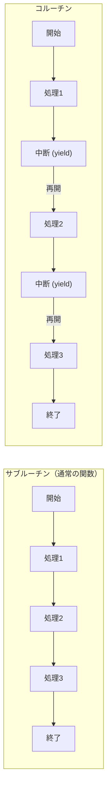

### コルーチンの特徴

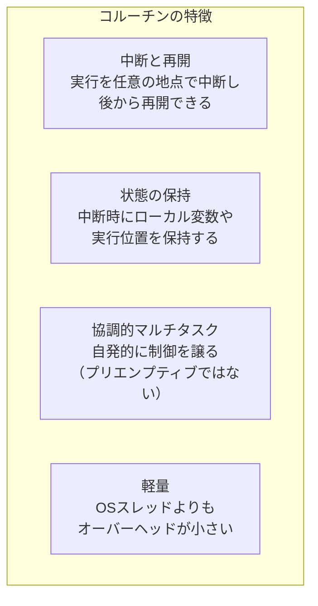

### コルーチンの歴史

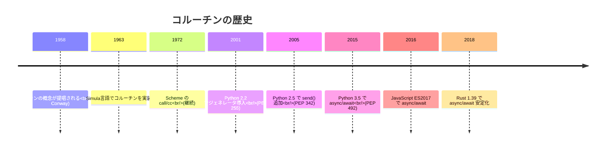

---

## 9.2 ジェネレータ

### ジェネレータとは

**ジェネレータ**は、イテレータを簡単に作成するための仕組みで、コルーチンの一種です。`yield`キーワードを使って値を順次生成します。

```python
def count_up(n):
    """n までカウントアップするジェネレータ"""
    i = 0
    while i < n:
        yield i  # 値を生成し、ここで中断
        i += 1   # 再開時はここから続行

# ジェネレータを使用
gen = count_up(3)
print(next(gen))  # 0
print(next(gen))  # 1
print(next(gen))  # 2
# print(next(gen))  # StopIteration 例外
```

### ジェネレータの動作

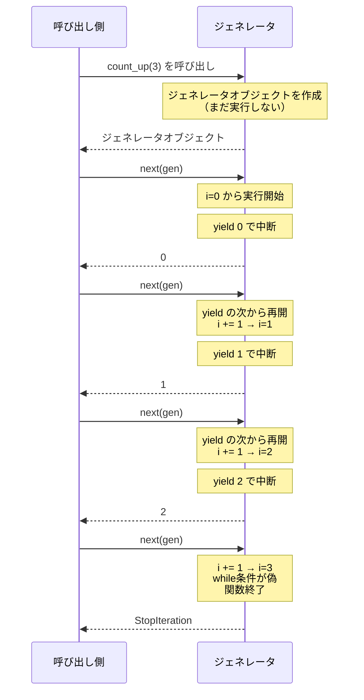

### ジェネレータのメモリ効率

ジェネレータは値を一度にすべてメモリに保持するのではなく、必要に応じて1つずつ生成するため、メモリ効率が良いです。

```python
# リスト（すべてをメモリに保持）
def get_squares_list(n):
    result = []
    for i in range(n):
        result.append(i ** 2)
    return result

# ジェネレータ（必要に応じて生成）
def get_squares_gen(n):
    for i in range(n):
        yield i ** 2

# メモリ使用量の比較
import sys

# 100万個の2乗
list_result = get_squares_list(1_000_000)
print(f"リスト: {sys.getsizeof(list_result):,} バイト")
# 約 8,000,000 バイト

gen_result = get_squares_gen(1_000_000)
print(f"ジェネレータ: {sys.getsizeof(gen_result):,} バイト")
# 約 120 バイト（ジェネレータオブジェクト自体のサイズ）
```

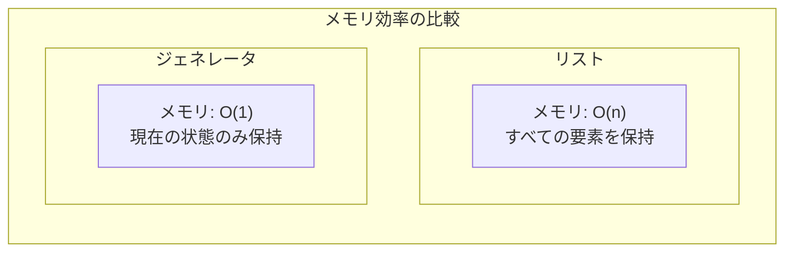

### ジェネレータへの値の送信（send）

Python 2.5から、`send()`メソッドを使ってジェネレータに値を送信できるようになりました。これにより、ジェネレータは双方向の通信が可能になります。

```python
def accumulator():
    """値を受け取って累積するジェネレータ"""
    total = 0
    while True:
        value = yield total  # 現在の合計を返し、新しい値を受け取る
        if value is None:
            break
        total += value

# 使用例
acc = accumulator()
next(acc)  # ジェネレータを最初のyieldまで進める

print(acc.send(10))  # 10（累積: 10）
print(acc.send(20))  # 30（累積: 30）
print(acc.send(5))   # 35（累積: 35）
```

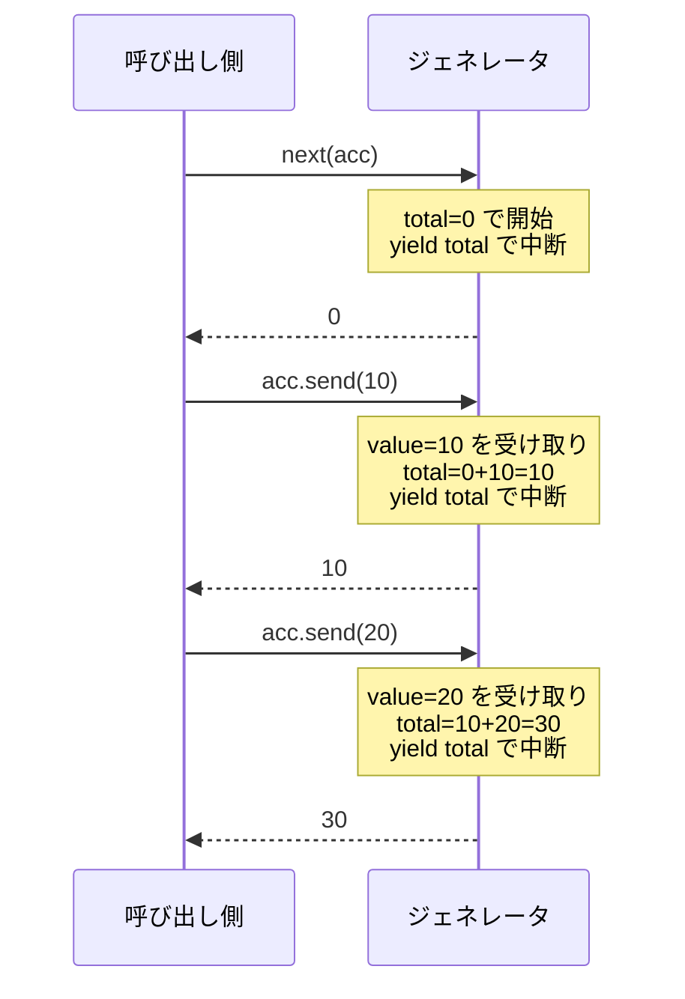

### ジェネレータの委譲（yield from）

Python 3.3から、`yield from`を使って別のジェネレータに処理を委譲できます。

```python
def inner():
    yield 1
    yield 2
    yield 3

def outer_without_yield_from():
    """yield from を使わない場合"""
    for value in inner():
        yield value
    yield 4
    yield 5

def outer_with_yield_from():
    """yield from を使う場合"""
    yield from inner()  # inner() に委譲
    yield 4
    yield 5

# 同じ結果: 1, 2, 3, 4, 5
print(list(outer_without_yield_from()))
print(list(outer_with_yield_from()))
```

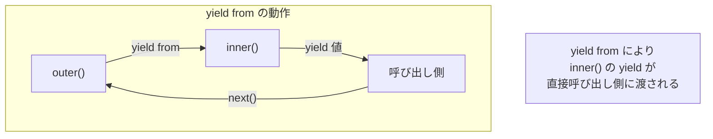

---

## 9.3 Python のコルーチン（async/await）

### ジェネレータベースのコルーチンから async/await へ

Python 3.4以前は、`@asyncio.coroutine`デコレータとジェネレータを使ってコルーチンを定義していました。Python 3.5から、より直感的な`async/await`構文が導入されました。

```python
# Python 3.4 スタイル（非推奨）
import asyncio

@asyncio.coroutine
def old_style_coroutine():
    yield from asyncio.sleep(1)
    return "完了"

# Python 3.5+ スタイル（推奨）
async def new_style_coroutine():
    await asyncio.sleep(1)
    return "完了"
```

### async def と await

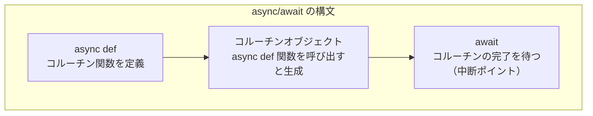

```python
import asyncio

async def fetch_data(name, delay):
    """データを取得するコルーチン"""
    print(f"{name}: 取得開始")
    await asyncio.sleep(delay)  # I/O操作をシミュレート
    print(f"{name}: 取得完了")
    return f"{name}のデータ"

async def main():
    # 順次実行（3秒かかる）
    result1 = await fetch_data("A", 1)
    result2 = await fetch_data("B", 2)
    print(f"順次実行結果: {result1}, {result2}")
    
    # 並行実行（2秒かかる）
    results = await asyncio.gather(
        fetch_data("C", 1),
        fetch_data("D", 2),
    )
    print(f"並行実行結果: {results}")

asyncio.run(main())
```

### コルーチンの実行フロー

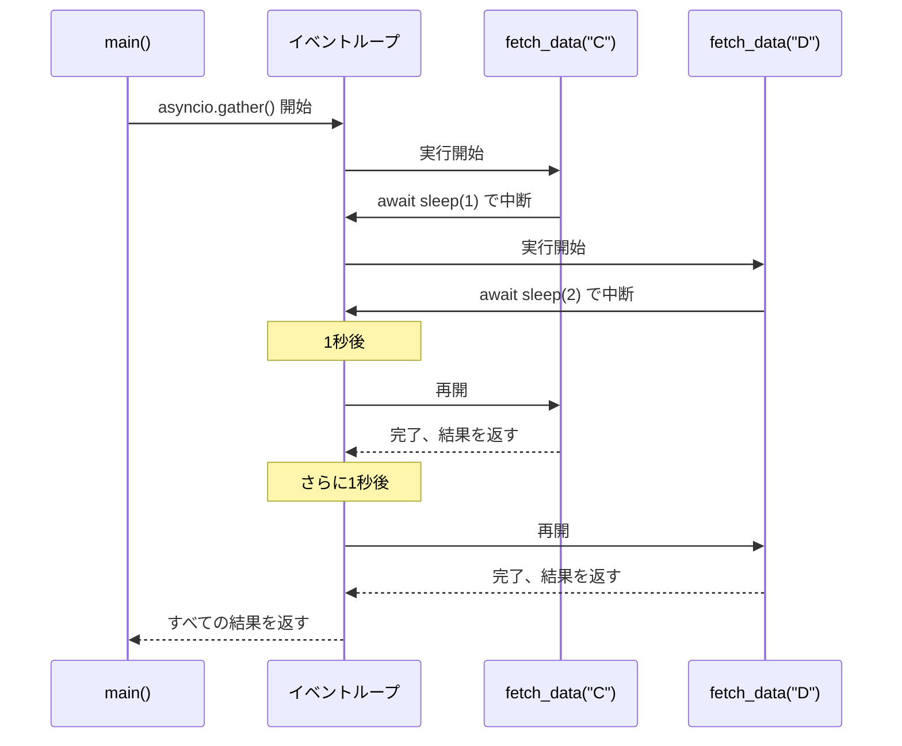

### コルーチンオブジェクト

`async def`で定義された関数を呼び出すと、すぐには実行されず、**コルーチンオブジェクト**が返されます。

```python
async def my_coroutine():
    print("実行中")
    return 42

# 呼び出しただけでは実行されない
coro = my_coroutine()
print(type(coro))  # <class 'coroutine'>

# await するか、イベントループで実行する必要がある
import asyncio
result = asyncio.run(coro)
print(result)  # 42
```

### Awaitable オブジェクト

`await`できるオブジェクトは「Awaitable」と呼ばれます。

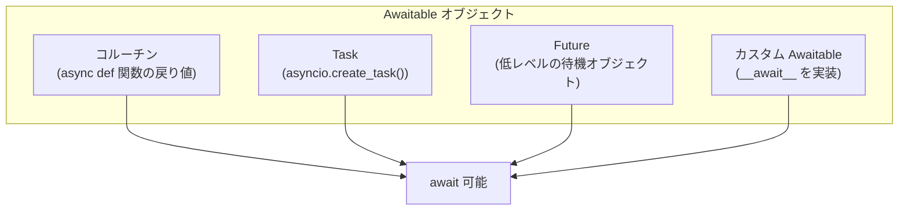

```python
import asyncio

async def example():
    # コルーチンを await
    async def inner():
        return 1
    result1 = await inner()
    
    # Task を await
    task = asyncio.create_task(inner())
    result2 = await task
    
    # Future を await
    future = asyncio.Future()
    future.set_result(3)
    result3 = await future
    
    print(f"結果: {result1}, {result2}, {result3}")

asyncio.run(example())
```

### async for と async with

Python 3.5では、非同期イテレータ（`async for`）と非同期コンテキストマネージャ（`async with`）も導入されました。

```python
import asyncio

# 非同期イテレータ
class AsyncRange:
    def __init__(self, n):
        self.n = n
        self.i = 0
    
    def __aiter__(self):
        return self
    
    async def __anext__(self):
        if self.i >= self.n:
            raise StopAsyncIteration
        await asyncio.sleep(0.1)
        result = self.i
        self.i += 1
        return result

async def use_async_for():
    async for i in AsyncRange(5):
        print(i)

# 非同期コンテキストマネージャ
class AsyncResource:
    async def __aenter__(self):
        print("リソース取得")
        await asyncio.sleep(0.1)
        return self
    
    async def __aexit__(self, exc_type, exc_val, exc_tb):
        print("リソース解放")
        await asyncio.sleep(0.1)

async def use_async_with():
    async with AsyncResource() as resource:
        print("リソース使用中")

asyncio.run(use_async_for())
asyncio.run(use_async_with())
```

---

## 9.4 コルーチンの内部構造

### ステートマシンとしてのコルーチン

コンパイラ/インタプリタは、コルーチンを**ステートマシン**に変換します。各`await`ポイントが状態遷移のポイントになります。

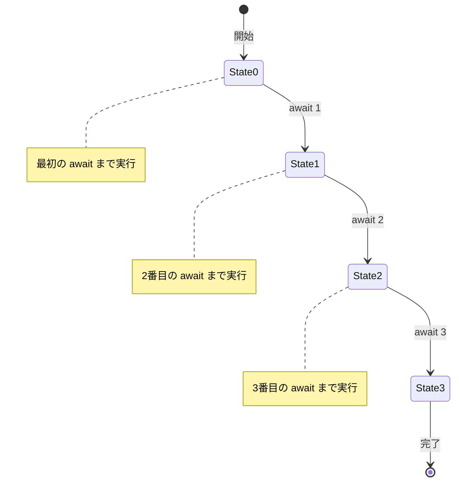

```python
# このコルーチン
async def example():
    print("開始")
    await asyncio.sleep(1)
    print("中間")
    await asyncio.sleep(1)
    print("終了")
    return "結果"

# 概念的には、以下のようなステートマシンに変換される
class ExampleStateMachine:
    def __init__(self):
        self.state = 0
        self.result = None
    
    def step(self):
        if self.state == 0:
            print("開始")
            self.state = 1
            return ("await", asyncio.sleep(1))
        elif self.state == 1:
            print("中間")
            self.state = 2
            return ("await", asyncio.sleep(1))
        elif self.state == 2:
            print("終了")
            self.result = "結果"
            return ("done", self.result)
```

### スタックレスコルーチン vs スタックフルコルーチン

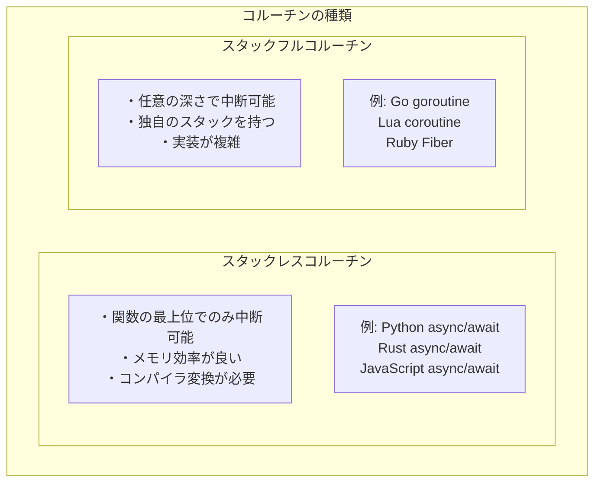

| 特性 | スタックレス | スタックフル |
|------|------------|------------|
| 中断可能な場所 | 関数の最上位のみ | 任意の深さ |
| メモリ使用量 | 小さい | 大きい（独自スタック） |
| 実装の複雑さ | コンパイラ変換 | ランタイムサポート |
| 例 | Python, Rust, JS | Go, Lua |

---

## 9.5 Rust の Future トレイト

### Future とは

Rustでは、非同期操作は**Future**トレイトを実装した型として表現されます。`async fn`で定義された関数は、`Future`を実装した型を返します。

```rust
use std::future::Future;
use std::pin::Pin;
use std::task::{Context, Poll};

// Future トレイトの定義（簡略化）
pub trait Future {
    type Output;
    
    fn poll(self: Pin<&mut Self>, cx: &mut Context<'_>) -> Poll<Self::Output>;
}

// Poll は2つの状態を持つ
pub enum Poll<T> {
    Ready(T),   // 完了、結果を持つ
    Pending,    // まだ完了していない
}
```

### Future の状態遷移

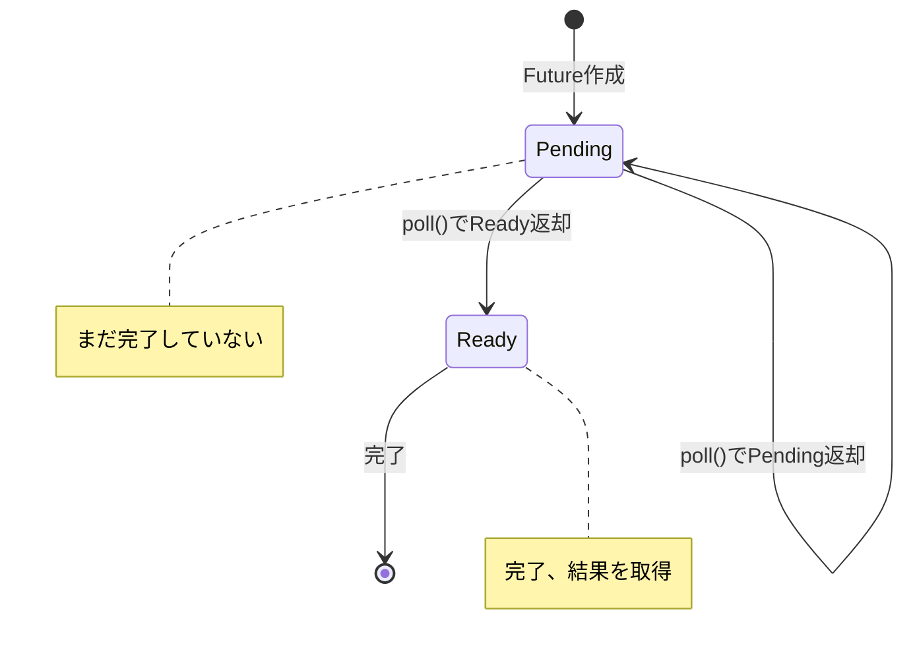

### async/await の変換

Rustの`async fn`は、コンパイラによって`Future`を実装した構造体に変換されます。

```rust
// このコード
async fn example() -> i32 {
    let a = async_operation_1().await;
    let b = async_operation_2().await;
    a + b
}

// 概念的には、以下のような構造体に変換される
enum ExampleFuture {
    State0 { /* 初期状態の変数 */ },
    State1 { a: i32, /* 中間状態の変数 */ },
    State2 { a: i32, b: i32 },
    Done,
}

impl Future for ExampleFuture {
    type Output = i32;
    
    fn poll(self: Pin<&mut Self>, cx: &mut Context<'_>) -> Poll<i32> {
        match self.get_mut() {
            ExampleFuture::State0 { .. } => {
                // async_operation_1 を poll
                // 完了したら State1 に遷移
            }
            ExampleFuture::State1 { a, .. } => {
                // async_operation_2 を poll
                // 完了したら State2 に遷移
            }
            ExampleFuture::State2 { a, b } => {
                Poll::Ready(*a + *b)
            }
            ExampleFuture::Done => panic!("poll after completion"),
        }
    }
}
```

### Pin と自己参照構造体

Rustの`Future`は**自己参照構造体**になることがあり、これを安全に扱うために`Pin`が必要です。

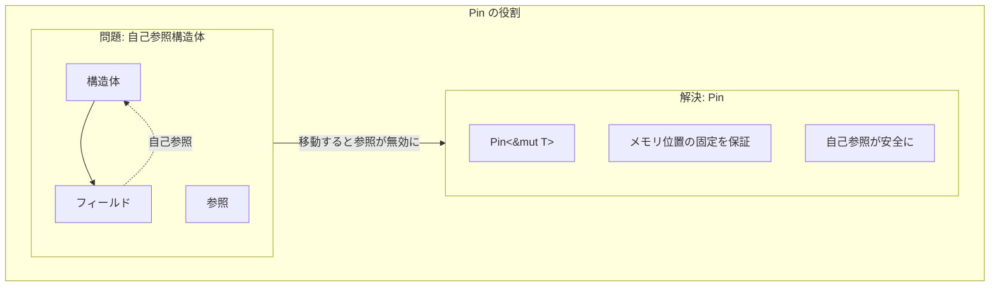

```rust
use std::pin::Pin;

// async ブロック内で参照を作ると自己参照になる
async fn self_referential() {
    let data = vec![1, 2, 3];
    let reference = &data;  // data への参照
    
    // await ポイント（ここで中断される可能性がある）
    some_async_op().await;
    
    // reference は data を参照している
    // もし Future が移動されると、reference は無効になる
    println!("{:?}", reference);
}

// Pin により、Future が移動されないことを保証
```

### Waker と起床メカニズム

Futureが`Poll::Pending`を返すとき、いつ再度`poll`すべきかをランタイムに通知するために**Waker**を使用します。

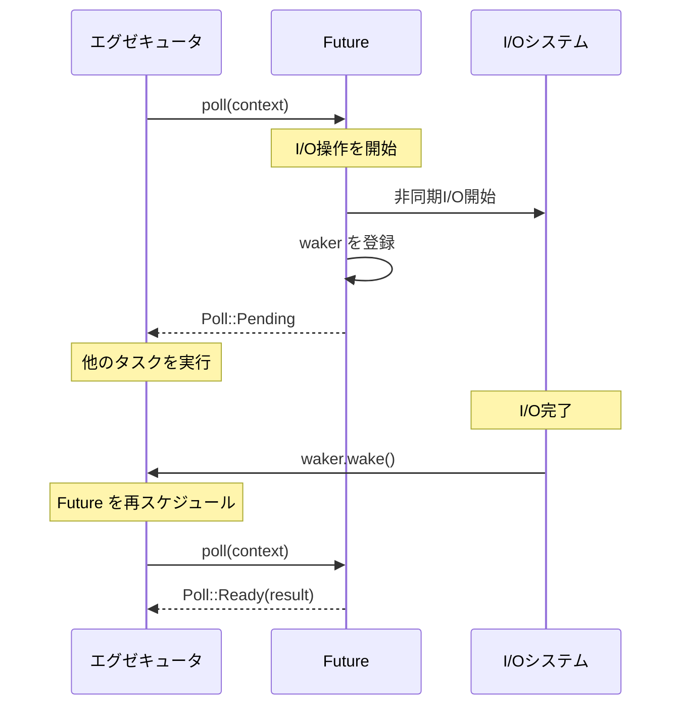

```rust
use std::task::{Context, Poll, Waker};
use std::future::Future;
use std::pin::Pin;

struct DelayFuture {
    started: bool,
    waker: Option<Waker>,
}

impl Future for DelayFuture {
    type Output = ();
    
    fn poll(mut self: Pin<&mut Self>, cx: &mut Context<'_>) -> Poll<()> {
        if !self.started {
            // 最初の poll: 非同期操作を開始
            self.started = true;
            self.waker = Some(cx.waker().clone());
            
            // バックグラウンドで処理を開始
            // 完了時に waker.wake() を呼ぶ
            
            Poll::Pending
        } else {
            // 2回目以降の poll: 完了を確認
            Poll::Ready(())
        }
    }
}
```

### async/await の実践

```rust
use tokio;

async fn fetch_url(url: &str) -> Result<String, reqwest::Error> {
    let response = reqwest::get(url).await?;
    let body = response.text().await?;
    Ok(body)
}

async fn process_urls(urls: Vec<&str>) -> Vec<String> {
    let mut results = Vec::new();
    
    // 順次処理
    for url in &urls {
        if let Ok(body) = fetch_url(url).await {
            results.push(body);
        }
    }
    
    results
}

async fn process_urls_concurrent(urls: Vec<&str>) -> Vec<String> {
    // 並行処理
    let futures: Vec<_> = urls.iter()
        .map(|url| fetch_url(url))
        .collect();
    
    let results = futures::future::join_all(futures).await;
    results.into_iter()
        .filter_map(|r| r.ok())
        .collect()
}

#[tokio::main]
async fn main() {
    let urls = vec![
        "https://example.com",
        "https://example.org",
    ];
    
    let results = process_urls_concurrent(urls).await;
    println!("取得完了: {} 件", results.len());
}
```

---

## 9.6 他の言語のコルーチン

### JavaScript の async/await

```javascript
// JavaScript の async/await
async function fetchData(url) {
    const response = await fetch(url);
    const data = await response.json();
    return data;
}

// Promise を直接使う場合
function fetchDataPromise(url) {
    return fetch(url)
        .then(response => response.json());
}

// 並行実行
async function fetchMultiple(urls) {
    const promises = urls.map(url => fetchData(url));
    const results = await Promise.all(promises);
    return results;
}
```

### Kotlin のコルーチン

```kotlin
import kotlinx.coroutines.*

// suspend 関数
suspend fun fetchData(url: String): String {
    delay(1000) // 非同期待機
    return "Data from $url"
}

fun main() = runBlocking {
    // 並行実行
    val results = listOf("url1", "url2", "url3").map { url ->
        async {
            fetchData(url)
        }
    }.awaitAll()
    
    println(results)
}
```

### C# の async/await

```csharp
using System;
using System.Net.Http;
using System.Threading.Tasks;

class Program
{
    static async Task<string> FetchDataAsync(string url)
    {
        using var client = new HttpClient();
        return await client.GetStringAsync(url);
    }
    
    static async Task Main()
    {
        var urls = new[] { "https://example.com", "https://example.org" };
        
        // 並行実行
        var tasks = urls.Select(url => FetchDataAsync(url));
        var results = await Task.WhenAll(tasks);
        
        Console.WriteLine($"取得完了: {results.Length} 件");
    }
}
```

### 言語間の比較

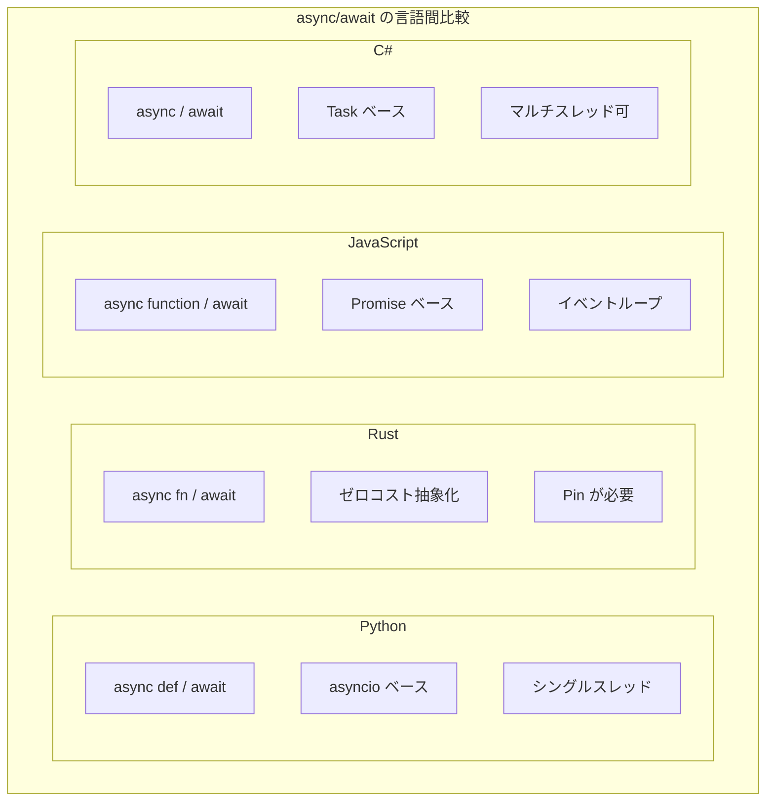

| 言語 | 構文 | 基盤 | 特徴 |
|------|------|------|------|
| Python | async def / await | asyncio | シングルスレッド、GIL |
| Rust | async fn / .await | Future トレイト | ゼロコスト、Pin 必要 |
| JavaScript | async function / await | Promise | イベントループ |
| C# | async / await | Task | マルチスレッド対応 |
| Kotlin | suspend / - | Coroutine | 構造化された並行性 |

---

## 9.7 まとめ

この章では、コルーチンとジェネレータについて詳しく学びました。

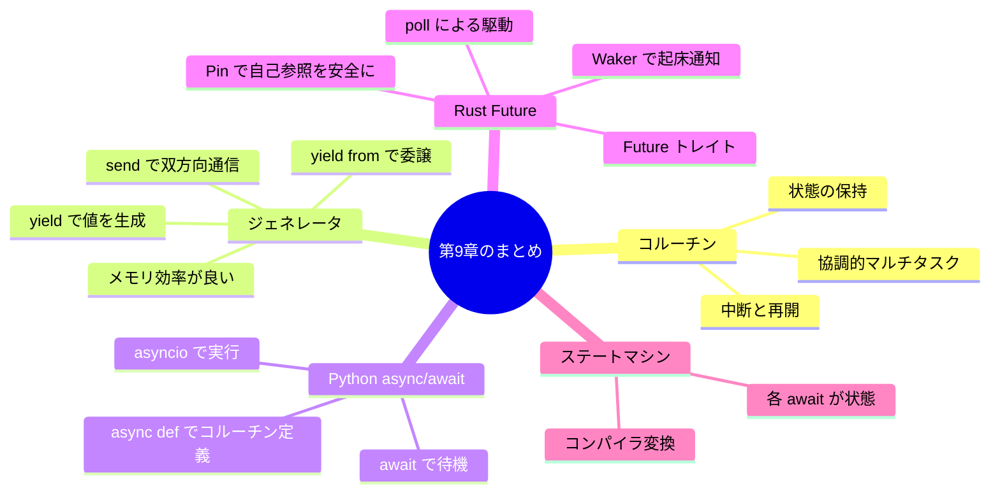

### 重要なポイント

#### 1. コルーチンは中断と再開が可能な関数

通常の関数と異なり、コルーチンは実行を途中で中断し、後から同じ地点から再開できます。これにより、I/O待ちの間に他の処理を進めることができます。

#### 2. ジェネレータはコルーチンの一種

Pythonのジェネレータは、`yield`で値を生成しながら中断する、シンプルなコルーチンです。メモリ効率が良く、大量のデータを処理するのに適しています。

#### 3. async/await は同期的なスタイルで非同期コードを書ける

`async/await`構文により、コールバック地獄を避けながら、読みやすい非同期コードを書けます。内部的にはステートマシンに変換されます。

#### 4. Rust の Future はゼロコスト抽象化

RustのFutureは、コンパイル時にステートマシンに変換され、ランタイムオーバーヘッドがありません。ただし、自己参照構造体を安全に扱うためにPinが必要です。

---

## 📝 練習問題

1. **サブルーチンとコルーチンの違いを、実行フローの観点から説明してください。**
   
   ヒント：開始・終了のパターン、中断・再開について考えてください。

2. **Pythonのジェネレータで、1からnまでのフィボナッチ数列を生成する関数を書いてください。**
   
   ```python
   def fibonacci(n):
       # ここに実装
       pass
   
   # 使用例
   for num in fibonacci(10):
       print(num)  # 1, 1, 2, 3, 5, 8, 13, 21, 34, 55
   ```

3. **以下のコードの出力を予測し、なぜそうなるか説明してください。**

   ```python
   import asyncio
   
   async def task(name, delay):
       print(f"{name}: 開始")
       await asyncio.sleep(delay)
       print(f"{name}: 完了")
       return name
   
   async def main():
       result = await asyncio.gather(
           task("A", 2),
           task("B", 1),
           task("C", 3),
       )
       print(f"結果: {result}")
   
   asyncio.run(main())
   ```
   
   ヒント：各タスクの開始・完了のタイミングと、gather の動作を考えてください。

4. **Rust の Future が Poll::Pending を返すとき、いつ再度 poll されるかを Waker の仕組みを使って説明してください。**
   
   ヒント：Waker の登録、I/O完了時の wake() 呼び出しについて考えてください。

5. **スタックレスコルーチンとスタックフルコルーチンの違いを説明し、それぞれの利点を挙げてください。**
   
   ヒント：中断可能な場所、メモリ使用量、実装の複雑さについて考えてください。

---

## 🔗 次の章へ

[第10章: 言語別非同期処理](./10-language-specific.md) では、JavaScript（Node.js）、Python（asyncio）、Rust（tokio）、Go（goroutine）など、各言語の非同期処理の実装と特徴を詳しく比較します。

---

[← 目次に戻る](../index.md) | [← 前章: 並行処理の基本モデル](./08-concurrency-models.md)

