# 第9章: 軽量並行処理

> 🎯 **この章の目標**: グリーンスレッド、ファイバー、コルーチン、ジェネレータなど、OSスレッドより軽量な並行処理の仕組みを理解する

---

## 9.1 軽量並行処理とは

### OSスレッドの限界

OSスレッド（ネイティブスレッド）は強力ですが、いくつかの制限があります。

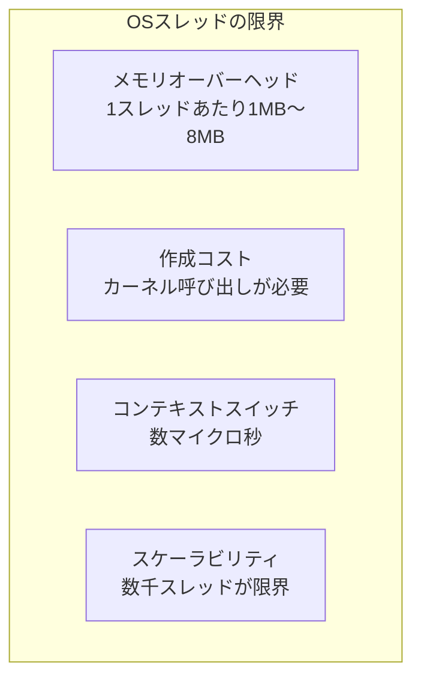
```mermaid
flowchart TB
    subgraph OS_THREAD_LIMITS["OSスレッドの限界"]
        L1["メモリオーバーヘッド<br/>1スレッドあたり1MB〜8MB"]
        L2["作成コスト<br/>カーネル呼び出しが必要"]
        L3["コンテキストスイッチ<br/>数マイクロ秒"]
        L4["スケーラビリティ<br/>数千スレッドが限界"]
    end
```

### 軽量並行処理の登場

これらの制限を克服するために、様々な軽量並行処理モデルが開発されました。

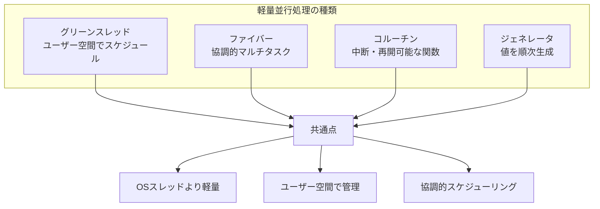
```mermaid
flowchart TB
    subgraph LIGHTWEIGHT["軽量並行処理の種類"]
        GREEN["グリーンスレッド<br/>ユーザー空間でスケジュール"]
        FIBER["ファイバー<br/>協調的マルチタスク"]
        COROUTINE["コルーチン<br/>中断・再開可能な関数"]
        GENERATOR["ジェネレータ<br/>値を順次生成"]
    end
    
    GREEN --> LIGHTWEIGHT_COMMON["共通点"]
    FIBER --> LIGHTWEIGHT_COMMON
    COROUTINE --> LIGHTWEIGHT_COMMON
    GENERATOR --> LIGHTWEIGHT_COMMON
    
    LIGHTWEIGHT_COMMON --> C1["OSスレッドより軽量"]
    LIGHTWEIGHT_COMMON --> C2["ユーザー空間で管理"]
    LIGHTWEIGHT_COMMON --> C3["協調的スケジューリング"]
```

### OSスレッドと軽量スレッドの比較

| 特性 | OSスレッド | 軽量スレッド |
|------|-----------|-------------|
| メモリ | 1MB〜8MB | 数KB〜数十KB |
| 作成コスト | 高い（カーネル呼び出し） | 低い（ユーザー空間） |
| コンテキストスイッチ | 遅い（マイクロ秒） | 速い（ナノ秒） |
| スケジューリング | プリエンプティブ | 協調的（多くの場合） |
| 同時実行数 | 数千 | 数百万 |
| 並列実行 | 可能 | ランタイム依存 |

---

## 9.2 グリーンスレッド

### グリーンスレッドとは

**グリーンスレッド**は、OSではなくランタイム（仮想マシンやライブラリ）によってスケジュールされるスレッドです。「グリーン」という名前は、Sun MicrosystemsのGreen Teamが開発したJavaの初期スレッド実装に由来します。

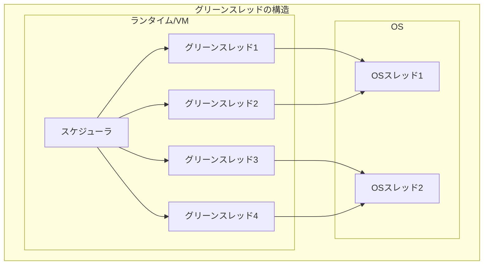
```mermaid
flowchart TB
    subgraph GREEN_THREAD["グリーンスレッドの構造"]
        subgraph RUNTIME["ランタイム/VM"]
            SCHEDULER["スケジューラ"]
            GT1["グリーンスレッド1"]
            GT2["グリーンスレッド2"]
            GT3["グリーンスレッド3"]
            GT4["グリーンスレッド4"]
        end
        
        subgraph OS["OS"]
            OST1["OSスレッド1"]
            OST2["OSスレッド2"]
        end
    end
    
    SCHEDULER --> GT1
    SCHEDULER --> GT2
    SCHEDULER --> GT3
    SCHEDULER --> GT4
    
    GT1 --> OST1
    GT2 --> OST1
    GT3 --> OST2
    GT4 --> OST2
```

### M:N スケジューリング

グリーンスレッドは通常、**M:Nスケジューリング**を採用しています。M個のグリーンスレッドがN個のOSスレッドにマッピングされます。

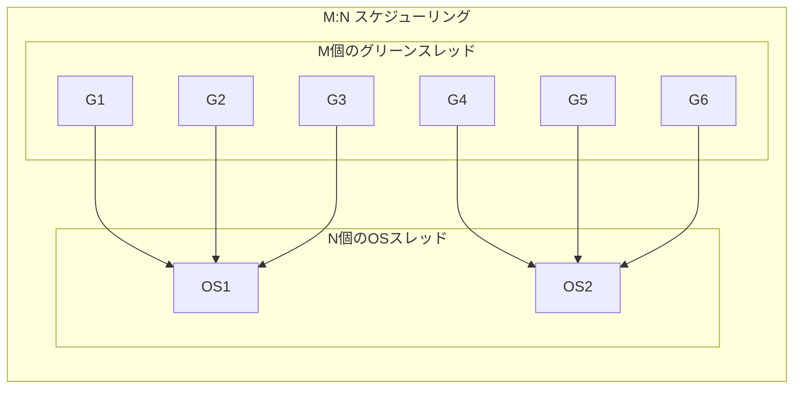
```mermaid
flowchart LR
    subgraph MN_SCHEDULING["M:N スケジューリング"]
        subgraph GREEN_THREADS["M個のグリーンスレッド"]
            G1["G1"]
            G2["G2"]
            G3["G3"]
            G4["G4"]
            G5["G5"]
            G6["G6"]
        end
        
        subgraph OS_THREADS["N個のOSスレッド"]
            O1["OS1"]
            O2["OS2"]
        end
    end
    
    G1 --> O1
    G2 --> O1
    G3 --> O1
    G4 --> O2
    G5 --> O2
    G6 --> O2
```

### Go の Goroutine

Goの**Goroutine**は、グリーンスレッドの代表的な実装です。

```go
package main

import (
    "fmt"
    "time"
)

func worker(id int, done chan bool) {
    fmt.Printf("Worker %d: 開始\n", id)
    time.Sleep(100 * time.Millisecond)
    fmt.Printf("Worker %d: 完了\n", id)
    done <- true
}

func main() {
    done := make(chan bool)
    
    // 1000個のgoroutineを起動
    for i := 0; i < 1000; i++ {
        go worker(i, done)
    }
    
    // すべての完了を待つ
    for i := 0; i < 1000; i++ {
        <-done
    }
    
    fmt.Println("すべてのworkerが完了")
}
```

### Goroutine の内部構造

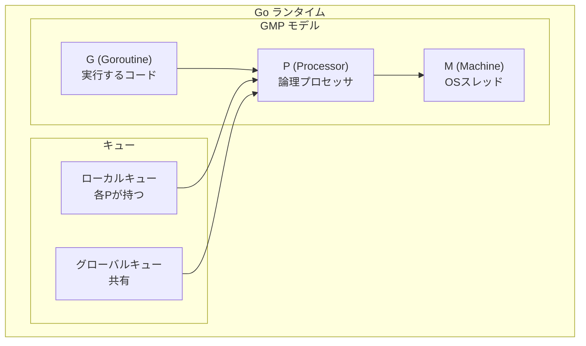
```mermaid
flowchart TB
    subgraph GO_RUNTIME["Go ランタイム"]
        subgraph GMP["GMP モデル"]
            G["G (Goroutine)<br/>実行するコード"]
            M["M (Machine)<br/>OSスレッド"]
            P["P (Processor)<br/>論理プロセッサ"]
        end
        
        subgraph QUEUES["キュー"]
            LOCAL["ローカルキュー<br/>各Pが持つ"]
            GLOBAL["グローバルキュー<br/>共有"]
        end
    end
    
    G --> P
    P --> M
    LOCAL --> P
    GLOBAL --> P
```

| コンポーネント | 役割 |
|---------------|------|
| G (Goroutine) | 実行するコードと状態を保持 |
| M (Machine) | OSスレッドに対応 |
| P (Processor) | スケジューリングのコンテキスト |

### Work Stealing

Goランタイムは**Work Stealing**アルゴリズムを使用して、負荷を分散します。

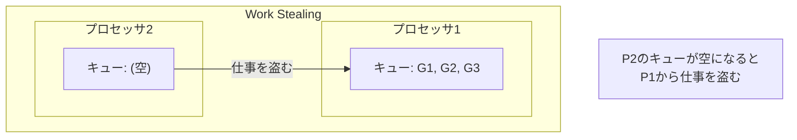
```mermaid
flowchart TB
    subgraph WORK_STEALING["Work Stealing"]
        subgraph P1["プロセッサ1"]
            Q1["キュー: G1, G2, G3"]
        end
        
        subgraph P2["プロセッサ2"]
            Q2["キュー: (空)"]
        end
    end
    
    Q2 -->|"仕事を盗む"| Q1
    
    NOTE["P2のキューが空になると<br/>P1から仕事を盗む"]
```

### Erlang のプロセス

Erlangの**プロセス**も、グリーンスレッドの一種です。アクターモデルに基づいており、メッセージパッシングで通信します。

```erlang
-module(green_thread_example).
-export([start/0, worker/1]).

worker(Id) ->
    io:format("Worker ~p: 開始~n", [Id]),
    timer:sleep(100),
    io:format("Worker ~p: 完了~n", [Id]).

start() ->
    % 1000個のプロセスを起動
    [spawn(fun() -> worker(I) end) || I <- lists:seq(1, 1000)],
    timer:sleep(200),
    io:format("すべてのworkerが完了~n").
```

### グリーンスレッドの利点と欠点

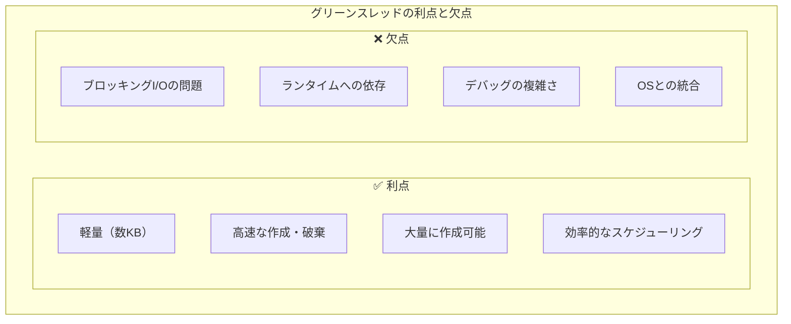
```mermaid
flowchart TB
    subgraph PROS_CONS["グリーンスレッドの利点と欠点"]
        subgraph PROS["✅ 利点"]
            P1["軽量（数KB）"]
            P2["高速な作成・破棄"]
            P3["大量に作成可能"]
            P4["効率的なスケジューリング"]
        end
        
        subgraph CONS["❌ 欠点"]
            C1["ブロッキングI/Oの問題"]
            C2["ランタイムへの依存"]
            C3["デバッグの複雑さ"]
            C4["OSとの統合"]
        end
    end
```

---

## 9.3 ファイバー

### ファイバーとは

**ファイバー**は、協調的マルチタスクを実現する軽量な実行コンテキストです。スレッドと異なり、ファイバーは自発的に制御を譲り渡す（yield）必要があります。

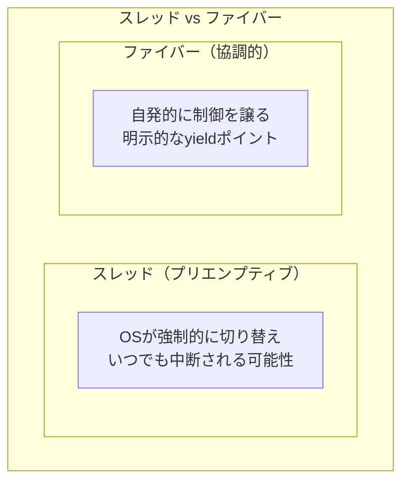
```mermaid
flowchart TB
    subgraph FIBER_VS_THREAD["スレッド vs ファイバー"]
        subgraph THREAD["スレッド（プリエンプティブ）"]
            T_DESC["OSが強制的に切り替え<br/>いつでも中断される可能性"]
        end
        
        subgraph FIBER_BOX["ファイバー（協調的）"]
            F_DESC["自発的に制御を譲る<br/>明示的なyieldポイント"]
        end
    end
```

### ファイバーの動作

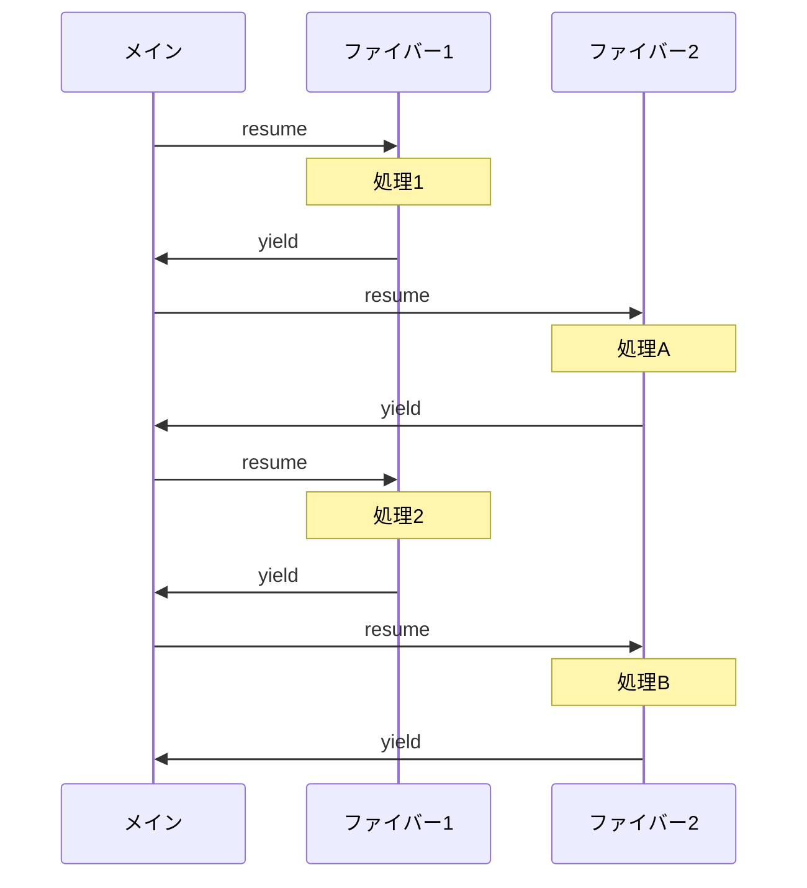
```mermaid
sequenceDiagram
    participant Main as メイン
    participant F1 as ファイバー1
    participant F2 as ファイバー2
    
    Main->>F1: resume
    Note over F1: 処理1
    F1->>Main: yield
    
    Main->>F2: resume
    Note over F2: 処理A
    F2->>Main: yield
    
    Main->>F1: resume
    Note over F1: 処理2
    F1->>Main: yield
    
    Main->>F2: resume
    Note over F2: 処理B
    F2->>Main: yield
```

### Ruby の Fiber

Rubyの**Fiber**は、ファイバーの代表的な実装です。

```ruby
# Ruby Fiber の例
fiber1 = Fiber.new do
  puts "Fiber1: ステップ1"
  Fiber.yield
  puts "Fiber1: ステップ2"
  Fiber.yield
  puts "Fiber1: ステップ3"
end

fiber2 = Fiber.new do
  puts "Fiber2: ステップA"
  Fiber.yield
  puts "Fiber2: ステップB"
  Fiber.yield
  puts "Fiber2: ステップC"
end

# 交互に実行
3.times do
  fiber1.resume
  fiber2.resume
end

# 出力:
# Fiber1: ステップ1
# Fiber2: ステップA
# Fiber1: ステップ2
# Fiber2: ステップB
# Fiber1: ステップ3
# Fiber2: ステップC
```

### Lua のコルーチン（ファイバーとして機能）

```lua
-- Lua のコルーチン
function worker(name)
    for i = 1, 3 do
        print(name .. ": ステップ " .. i)
        coroutine.yield()
    end
end

co1 = coroutine.create(function() worker("Worker1") end)
co2 = coroutine.create(function() worker("Worker2") end)

-- 交互に実行
for i = 1, 3 do
    coroutine.resume(co1)
    coroutine.resume(co2)
end
```

### Windows Fiber API

WindowsはネイティブのFiber APIを提供しています。

```c
#include <windows.h>
#include <stdio.h>

LPVOID mainFiber;
LPVOID workerFiber;

VOID CALLBACK FiberProc(LPVOID lpParameter) {
    for (int i = 0; i < 3; i++) {
        printf("Worker: ステップ %d\n", i + 1);
        SwitchToFiber(mainFiber);  // メインに戻る
    }
}

int main() {
    // メインスレッドをファイバーに変換
    mainFiber = ConvertThreadToFiber(NULL);
    
    // ワーカーファイバーを作成
    workerFiber = CreateFiber(0, FiberProc, NULL);
    
    for (int i = 0; i < 3; i++) {
        printf("Main: ワーカーに切り替え\n");
        SwitchToFiber(workerFiber);
    }
    
    DeleteFiber(workerFiber);
    return 0;
}
```

### ファイバーのユースケース

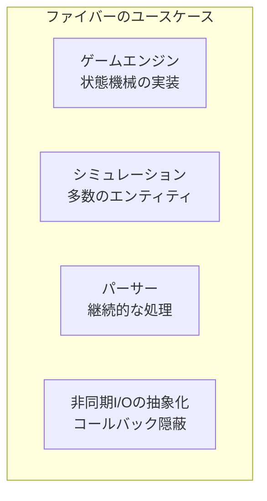
```mermaid
flowchart TB
    subgraph FIBER_USECASES["ファイバーのユースケース"]
        UC1["ゲームエンジン<br/>状態機械の実装"]
        UC2["シミュレーション<br/>多数のエンティティ"]
        UC3["パーサー<br/>継続的な処理"]
        UC4["非同期I/Oの抽象化<br/>コールバック隠蔽"]
    end
```

---

## 9.4 コルーチン

### コルーチンとは

**コルーチン**は、実行を途中で**中断（suspend）**し、後から**再開（resume）**できる特殊な関数です。サブルーチン（通常の関数）の一般化と考えることができます。

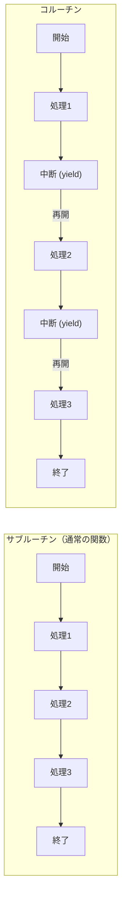
```mermaid
flowchart LR
    subgraph SUBROUTINE["サブルーチン（通常の関数）"]
        S_START["開始"]
        S_EXEC1["処理1"]
        S_EXEC2["処理2"]
        S_EXEC3["処理3"]
        S_END["終了"]
        
        S_START --> S_EXEC1 --> S_EXEC2 --> S_EXEC3 --> S_END
    end
    
    subgraph COROUTINE["コルーチン"]
        C_START["開始"]
        C_EXEC1["処理1"]
        C_SUSPEND1["中断 (yield)"]
        C_EXEC2["処理2"]
        C_SUSPEND2["中断 (yield)"]
        C_EXEC3["処理3"]
        C_END["終了"]
        
        C_START --> C_EXEC1 --> C_SUSPEND1
        C_SUSPEND1 -->|"再開"| C_EXEC2 --> C_SUSPEND2
        C_SUSPEND2 -->|"再開"| C_EXEC3 --> C_END
    end
```

### コルーチンの特徴

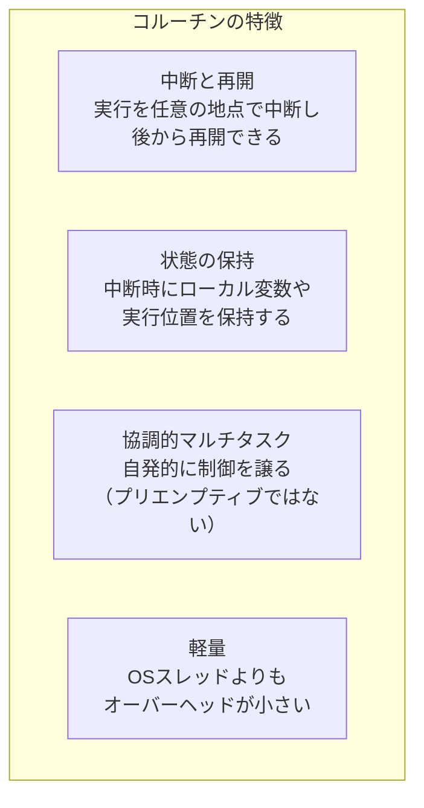
```mermaid
flowchart TB
    subgraph COROUTINE_FEATURES["コルーチンの特徴"]
        F1["中断と再開<br/>実行を任意の地点で中断し<br/>後から再開できる"]
        F2["状態の保持<br/>中断時にローカル変数や<br/>実行位置を保持する"]
        F3["協調的マルチタスク<br/>自発的に制御を譲る<br/>（プリエンプティブではない）"]
        F4["軽量<br/>OSスレッドよりも<br/>オーバーヘッドが小さい"]
    end
```

### スタックレス vs スタックフル

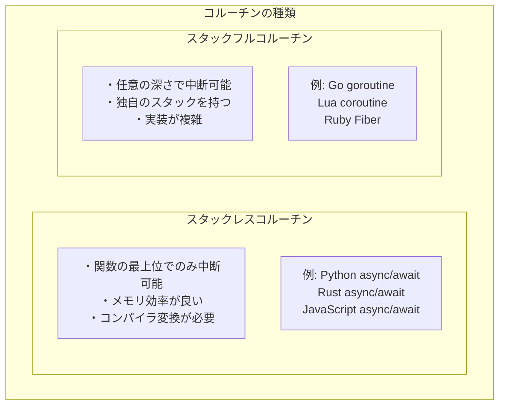
```mermaid
flowchart TB
    subgraph COROUTINE_TYPES["コルーチンの種類"]
        subgraph STACKLESS["スタックレスコルーチン"]
            SL_DESC["・関数の最上位でのみ中断可能<br/>・メモリ効率が良い<br/>・コンパイラ変換が必要"]
            SL_EXAMPLE["例: Python async/await<br/>Rust async/await<br/>JavaScript async/await"]
        end
        
        subgraph STACKFUL["スタックフルコルーチン"]
            SF_DESC["・任意の深さで中断可能<br/>・独自のスタックを持つ<br/>・実装が複雑"]
            SF_EXAMPLE["例: Go goroutine<br/>Lua coroutine<br/>Ruby Fiber"]
        end
    end
```

| 特性 | スタックレス | スタックフル |
|------|------------|------------|
| 中断可能な場所 | 関数の最上位のみ | 任意の深さ |
| メモリ使用量 | 小さい | 大きい（独自スタック） |
| 実装の複雑さ | コンパイラ変換 | ランタイムサポート |
| 例 | Python, Rust, JS | Go, Lua, Ruby |

### Python の async/await

Python 3.5以降では、`async/await`構文でコルーチンを定義できます。

```python
import asyncio

async def fetch_data(name, delay):
    """データを取得するコルーチン"""
    print(f"{name}: 取得開始")
    await asyncio.sleep(delay)  # 中断ポイント
    print(f"{name}: 取得完了")
    return f"{name}のデータ"

async def main():
    # 並行実行
    results = await asyncio.gather(
        fetch_data("A", 1),
        fetch_data("B", 2),
        fetch_data("C", 1.5),
    )
    print(f"結果: {results}")

asyncio.run(main())
```

### コルーチンの実行フロー

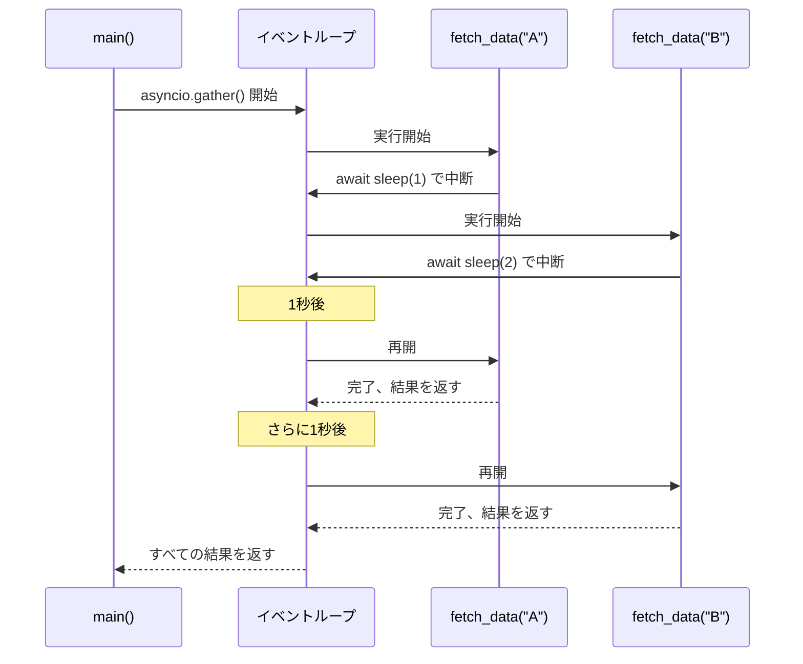
```mermaid
sequenceDiagram
    participant Main as main()
    participant Evloop as イベントループ
    participant C1 as fetch_data("A")
    participant C2 as fetch_data("B")
    
    Main->>Evloop: asyncio.gather() 開始
    Evloop->>C1: 実行開始
    C1->>Evloop: await sleep(1) で中断
    Evloop->>C2: 実行開始
    C2->>Evloop: await sleep(2) で中断
    
    Note over Evloop: 1秒後
    Evloop->>C1: 再開
    C1-->>Evloop: 完了、結果を返す
    
    Note over Evloop: さらに1秒後
    Evloop->>C2: 再開
    C2-->>Evloop: 完了、結果を返す
    
    Evloop-->>Main: すべての結果を返す
```

### Rust の async/await

Rustでは、`async fn`で非同期関数を定義し、`Future`トレイトを実装した型を返します。

```rust
use tokio;

async fn fetch_data(name: &str, delay_ms: u64) -> String {
    println!("{}: 取得開始", name);
    tokio::time::sleep(tokio::time::Duration::from_millis(delay_ms)).await;
    println!("{}: 取得完了", name);
    format!("{}のデータ", name)
}

#[tokio::main]
async fn main() {
    // 並行実行
    let (a, b, c) = tokio::join!(
        fetch_data("A", 1000),
        fetch_data("B", 2000),
        fetch_data("C", 1500),
    );
    
    println!("結果: {}, {}, {}", a, b, c);
}
```

### ステートマシンへの変換

コンパイラは`async`関数をステートマシンに変換します。

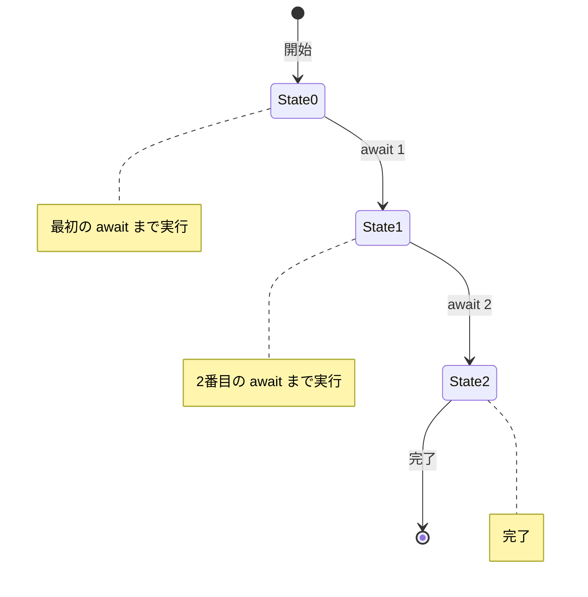
```mermaid
stateDiagram-v2
    [*] --> State0: 開始
    State0 --> State1: await 1
    State1 --> State2: await 2
    State2 --> [*]: 完了
    
    note right of State0: 最初の await まで実行
    note right of State1: 2番目の await まで実行
    note right of State2: 完了
```

```python
# このコルーチン
async def example():
    print("開始")
    await asyncio.sleep(1)
    print("中間")
    await asyncio.sleep(1)
    print("終了")
    return "結果"

# 概念的には、以下のようなステートマシンに変換される
class ExampleStateMachine:
    def __init__(self):
        self.state = 0
        self.result = None
    
    def step(self):
        if self.state == 0:
            print("開始")
            self.state = 1
            return ("await", asyncio.sleep(1))
        elif self.state == 1:
            print("中間")
            self.state = 2
            return ("await", asyncio.sleep(1))
        elif self.state == 2:
            print("終了")
            self.result = "結果"
            return ("done", self.result)
```

---

## 9.5 ジェネレータとイテレータ

### ジェネレータとは

**ジェネレータ**は、イテレータを簡単に作成するための仕組みで、コルーチンの一種です。`yield`キーワードを使って値を順次生成します。

```python
def count_up(n):
    """n までカウントアップするジェネレータ"""
    i = 0
    while i < n:
        yield i  # 値を生成し、ここで中断
        i += 1   # 再開時はここから続行

# ジェネレータを使用
gen = count_up(3)
print(next(gen))  # 0
print(next(gen))  # 1
print(next(gen))  # 2
# print(next(gen))  # StopIteration 例外
```

### ジェネレータの動作

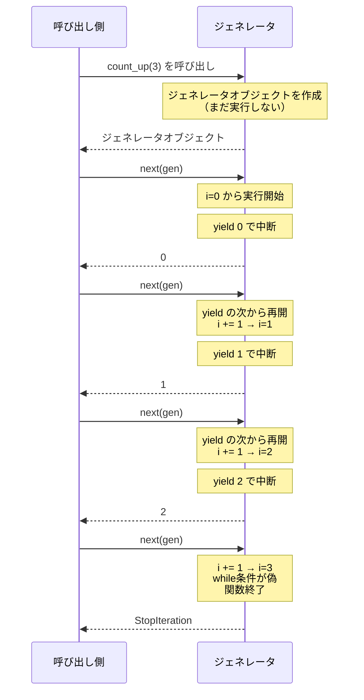
```mermaid
sequenceDiagram
    participant Caller as 呼び出し側
    participant Gen as ジェネレータ
    
    Caller->>Gen: count_up(3) を呼び出し
    Note over Gen: ジェネレータオブジェクトを作成<br/>（まだ実行しない）
    Gen-->>Caller: ジェネレータオブジェクト
    
    Caller->>Gen: next(gen)
    Note over Gen: i=0 から実行開始
    Note over Gen: yield 0 で中断
    Gen-->>Caller: 0
    
    Caller->>Gen: next(gen)
    Note over Gen: yield の次から再開<br/>i += 1 → i=1
    Note over Gen: yield 1 で中断
    Gen-->>Caller: 1
    
    Caller->>Gen: next(gen)
    Note over Gen: yield の次から再開<br/>i += 1 → i=2
    Note over Gen: yield 2 で中断
    Gen-->>Caller: 2
    
    Caller->>Gen: next(gen)
    Note over Gen: i += 1 → i=3<br/>while条件が偽<br/>関数終了
    Gen-->>Caller: StopIteration
```

### メモリ効率

ジェネレータは値を一度にすべてメモリに保持するのではなく、必要に応じて1つずつ生成するため、メモリ効率が優れています。

```python
# リスト（すべてをメモリに保持）
def get_squares_list(n):
    result = []
    for i in range(n):
        result.append(i ** 2)
    return result

# ジェネレータ（必要に応じて生成）
def get_squares_gen(n):
    for i in range(n):
        yield i ** 2

# メモリ使用量の比較
import sys

# 100万個の2乗
list_result = get_squares_list(1_000_000)
print(f"リスト: {sys.getsizeof(list_result):,} バイト")
# 約 8,000,000 バイト

gen_result = get_squares_gen(1_000_000)
print(f"ジェネレータ: {sys.getsizeof(gen_result):,} バイト")
# 約 120 バイト（ジェネレータオブジェクト自体のサイズ）
```

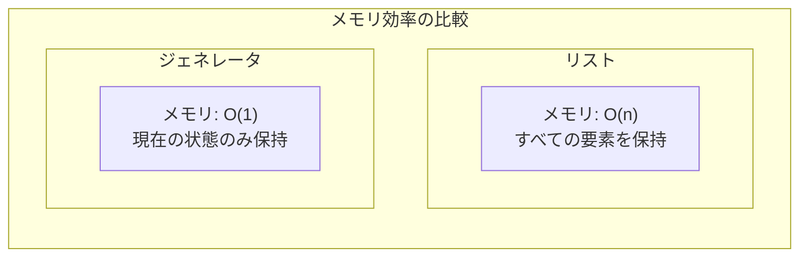
```mermaid
flowchart LR
    subgraph MEMORY_COMPARISON["メモリ効率の比較"]
        subgraph LIST["リスト"]
            L_MEM["メモリ: O(n)<br/>すべての要素を保持"]
        end
        
        subgraph GENERATOR["ジェネレータ"]
            G_MEM["メモリ: O(1)<br/>現在の状態のみ保持"]
        end
    end
```

### ジェネレータへの値の送信（send）

Python 2.5から、`send()`メソッドを使ってジェネレータに値を送信できます。

```python
def accumulator():
    """値を受け取って累積するジェネレータ"""
    total = 0
    while True:
        value = yield total  # 現在の合計を返し、新しい値を受け取る
        if value is None:
            break
        total += value

# 使用例
acc = accumulator()
next(acc)  # ジェネレータを最初のyieldまで進める

print(acc.send(10))  # 10（累積: 10）
print(acc.send(20))  # 30（累積: 30）
print(acc.send(5))   # 35（累積: 35）
```

### JavaScript のジェネレータ

```javascript
function* countUp(n) {
    for (let i = 0; i < n; i++) {
        yield i;
    }
}

const gen = countUp(3);
console.log(gen.next().value);  // 0
console.log(gen.next().value);  // 1
console.log(gen.next().value);  // 2
console.log(gen.next().done);   // true

// for...of で使用
for (const value of countUp(5)) {
    console.log(value);  // 0, 1, 2, 3, 4
}
```

### ジェネレータの委譲（yield from / yield*）

```python
# Python: yield from
def inner():
    yield 1
    yield 2
    yield 3

def outer():
    yield from inner()  # inner() に委譲
    yield 4
    yield 5

print(list(outer()))  # [1, 2, 3, 4, 5]
```

```javascript
// JavaScript: yield*
function* inner() {
    yield 1;
    yield 2;
    yield 3;
}

function* outer() {
    yield* inner();  // inner() に委譲
    yield 4;
    yield 5;
}

console.log([...outer()]);  // [1, 2, 3, 4, 5]
```

### イテレータプロトコル

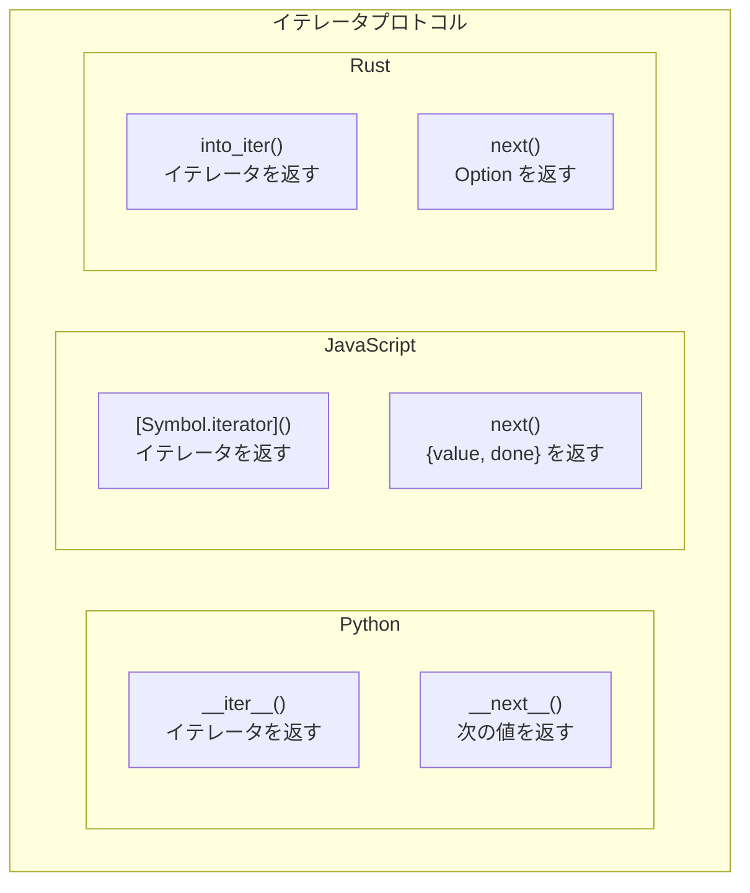
```mermaid
flowchart TB
    subgraph ITERATOR_PROTOCOL["イテレータプロトコル"]
        subgraph PYTHON["Python"]
            PY_ITER["__iter__()<br/>イテレータを返す"]
            PY_NEXT["__next__()<br/>次の値を返す"]
        end
        
        subgraph JS["JavaScript"]
            JS_ITER["[Symbol.iterator]()<br/>イテレータを返す"]
            JS_NEXT["next()<br/>{value, done} を返す"]
        end
        
        subgraph RUST["Rust"]
            RS_ITER["into_iter()<br/>イテレータを返す"]
            RS_NEXT["next()<br/>Option<Item> を返す"]
        end
    end
```

---

## 9.6 各モデルの比較

### 比較表

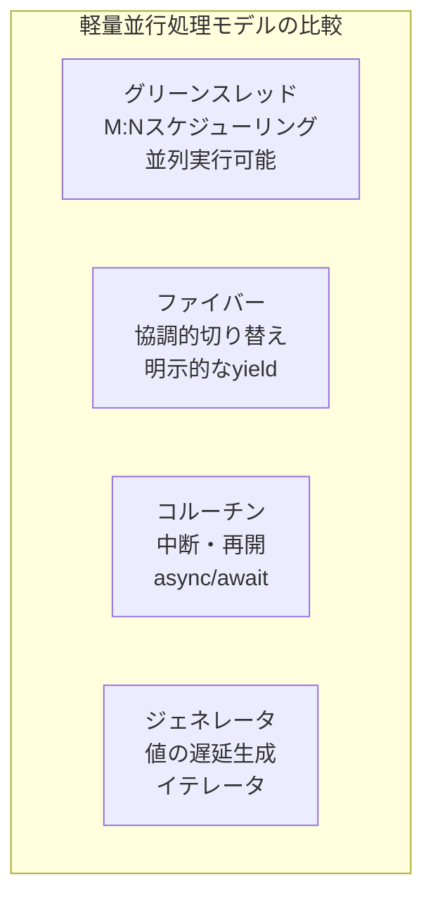
```mermaid
flowchart TB
    subgraph COMPARISON["軽量並行処理モデルの比較"]
        GREEN["グリーンスレッド<br/>M:Nスケジューリング<br/>並列実行可能"]
        FIBER_C["ファイバー<br/>協調的切り替え<br/>明示的なyield"]
        COROUTINE_C["コルーチン<br/>中断・再開<br/>async/await"]
        GENERATOR_C["ジェネレータ<br/>値の遅延生成<br/>イテレータ"]
    end
```

| 特性 | グリーンスレッド | ファイバー | コルーチン | ジェネレータ |
|------|----------------|-----------|-----------|-------------|
| スケジューリング | ランタイム | 手動 | イベントループ | 呼び出し側 |
| 並列実行 | 可能 | 不可 | ランタイム依存 | 不可 |
| 用途 | 一般的な並行処理 | 協調的タスク | 非同期I/O | 遅延評価 |
| 例 | Go, Erlang | Ruby, Windows | Python, Rust | Python, JS |

### ユースケース別の選択

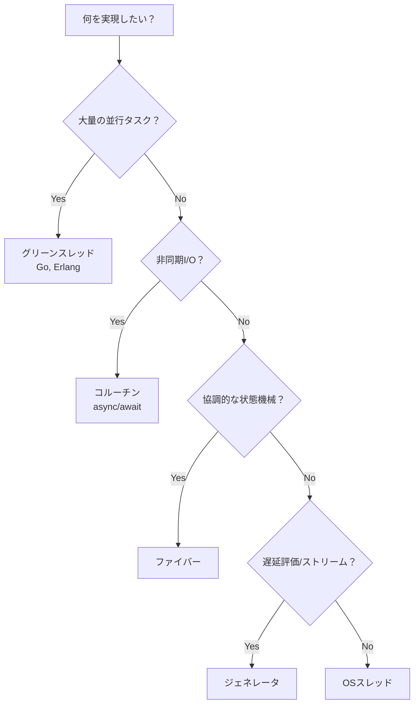
```mermaid
flowchart TB
    START["何を実現したい？"]
    
    START --> Q1{"大量の並行タスク？"}
    Q1 -->|"Yes"| GREEN_CHOICE["グリーンスレッド<br/>Go, Erlang"]
    Q1 -->|"No"| Q2
    
    Q2{"非同期I/O？"}
    Q2 -->|"Yes"| COROUTINE_CHOICE["コルーチン<br/>async/await"]
    Q2 -->|"No"| Q3
    
    Q3{"協調的な状態機械？"}
    Q3 -->|"Yes"| FIBER_CHOICE["ファイバー"]
    Q3 -->|"No"| Q4
    
    Q4{"遅延評価/ストリーム？"}
    Q4 -->|"Yes"| GENERATOR_CHOICE["ジェネレータ"]
    Q4 -->|"No"| THREAD_CHOICE["OSスレッド"]
```

---

## 9.7 まとめ

この章では、軽量並行処理について詳しく学びました。

```mermaid
mindmap
    root((第9章のまとめ))
        グリーンスレッド
            M:Nスケジューリング
            Go Goroutine
            Erlang Process
            Work Stealing
        ファイバー
            協調的マルチタスク
            Ruby Fiber
            Windows Fiber
            明示的なyield
        コルーチン
            中断と再開
            async/await
            ステートマシン変換
            スタックレス/スタックフル
        ジェネレータ
            値の遅延生成
            メモリ効率
            send で双方向通信
            yield from で委譲
```

### 重要なポイント

#### 1. OSスレッドより軽量な選択肢がある

グリーンスレッド、ファイバー、コルーチン、ジェネレータは、OSスレッドよりも軽量で、大量の並行処理に適しています。

#### 2. 協調的スケジューリングが基本

軽量並行処理の多くは協調的スケジューリングを採用しています。自発的に制御を譲ることで、効率的なコンテキストスイッチを実現します。

#### 3. 用途に応じて選択する

- **グリーンスレッド**: 大量の並行タスク（Go, Erlang）
- **ファイバー**: 協調的な状態管理（Ruby, ゲームエンジン）
- **コルーチン**: 非同期I/O（Python asyncio, Rust async）
- **ジェネレータ**: 遅延評価、ストリーム処理

---

## 📝 練習問題

1. **OSスレッドとグリーンスレッドの違いを、メモリ使用量とスケジューリングの観点から説明してください。**

2. **ファイバーとコルーチンの違いを説明してください。**

3. **Pythonのジェネレータで、フィボナッチ数列を無限に生成する関数を書いてください。**
   
   ```python
   def fibonacci():
       # ここに実装
       pass
   
   # 使用例
   gen = fibonacci()
   for _ in range(10):
       print(next(gen))  # 0, 1, 1, 2, 3, 5, 8, 13, 21, 34
   ```

4. **Go の Goroutine が M:N スケジューリングを採用している理由を説明してください。**

5. **スタックレスコルーチンとスタックフルコルーチンの違いを説明し、それぞれの利点を挙げてください。**

---

## 🔗 次の章へ

[第10章: 高度な並行処理モデル](./10-advanced-models.md) では、アクターモデル、CSP、データフロープログラミング、リアクティブプログラミングなど、高度な並行処理モデルを学びます。

---

[← 目次に戻る](../index.md) | [← 前章: 並行処理の基本モデル](./08-concurrency-models.md)

