# 第10章: 高度な並行処理モデル

> 🎯 **この章の目標**: アクターモデル、CSP、データフロープログラミング、リアクティブプログラミングなど、高度な並行処理モデルを理解する

---

## 10.1 並行処理モデルの全体像

第8章で学んだ基本的な並行処理モデル（マルチプロセス、マルチスレッド、スレッドプール）に加えて、より高度で抽象化された並行処理モデルが存在します。これらのモデルは、共有状態の問題を解決し、並行プログラムの設計をより安全で理解しやすくするために生まれました。

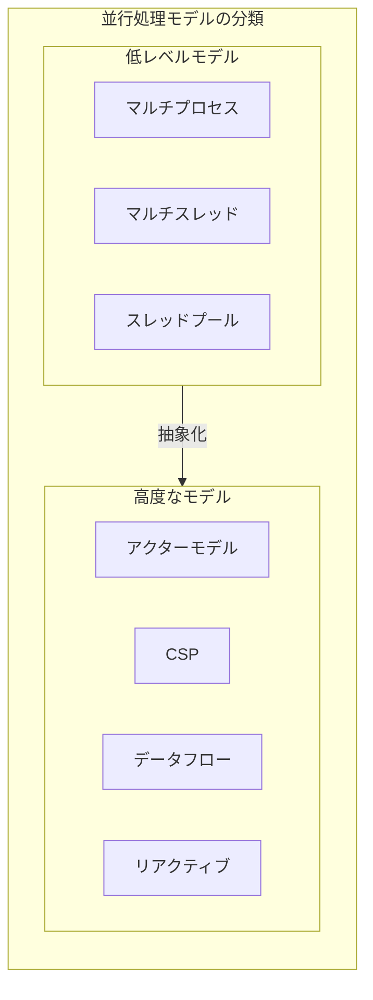
```mermaid
flowchart LR
    subgraph MODELS["並行処理モデルの分類"]
        subgraph LOW["低レベルモデル"]
            M1["マルチプロセス"]
            M2["マルチスレッド"]
            M3["スレッドプール"]
        end
        
        subgraph HIGH["高度なモデル"]
            H1["アクターモデル"]
            H2["CSP"]
            H3["データフロー"]
            H4["リアクティブ"]
        end
    end
    
    LOW -->|"抽象化"| HIGH
```

### 共有状態の問題

従来のマルチスレッドプログラミングでは、共有メモリを通じてスレッド間でデータをやり取りします。これには以下の問題があります：

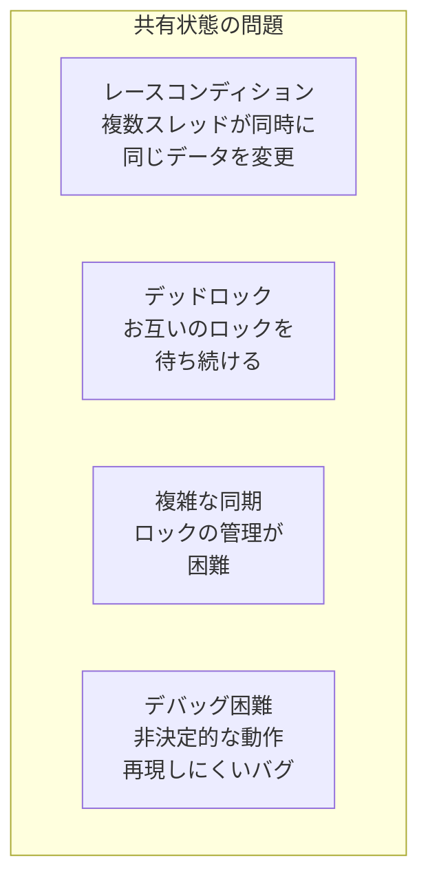
```mermaid
flowchart TB
    subgraph SHARED_STATE_PROBLEMS["共有状態の問題"]
        P1["レースコンディション<br/>複数スレッドが同時に<br/>同じデータを変更"]
        P2["デッドロック<br/>お互いのロックを<br/>待ち続ける"]
        P3["複雑な同期<br/>ロックの管理が<br/>困難"]
        P4["デバッグ困難<br/>非決定的な動作<br/>再現しにくいバグ"]
    end
```

高度な並行処理モデルは、これらの問題を根本的に解決するアプローチを提供します。

---

## 10.2 アクターモデル

### アクターモデルとは

**アクターモデル**は、1973年にCarl Hewittによって提唱された並行計算のモデルです。すべてを「アクター」という独立した実体として扱い、アクター間はメッセージパッシングのみで通信します。

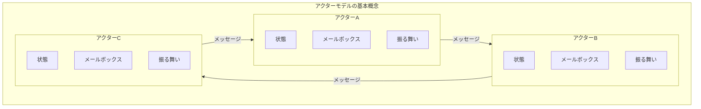
```mermaid
flowchart TB
    subgraph ACTOR_MODEL["アクターモデルの基本概念"]
        subgraph ACTOR1["アクターA"]
            A_STATE["状態"]
            A_MAILBOX["メールボックス"]
            A_BEHAVIOR["振る舞い"]
        end
        
        subgraph ACTOR2["アクターB"]
            B_STATE["状態"]
            B_MAILBOX["メールボックス"]
            B_BEHAVIOR["振る舞い"]
        end
        
        subgraph ACTOR3["アクターC"]
            C_STATE["状態"]
            C_MAILBOX["メールボックス"]
            C_BEHAVIOR["振る舞い"]
        end
    end
    
    ACTOR1 -->|"メッセージ"| ACTOR2
    ACTOR2 -->|"メッセージ"| ACTOR3
    ACTOR3 -->|"メッセージ"| ACTOR1
```

### アクターの3つの能力

各アクターは、メッセージを受信したときに以下の3つのことができます：

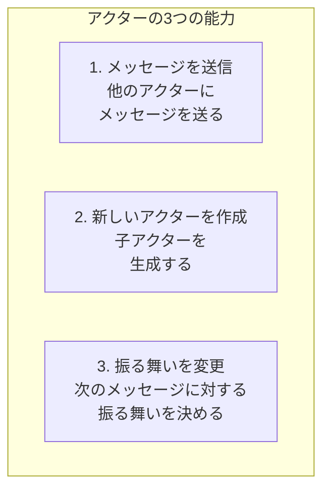
```mermaid
flowchart TB
    subgraph ACTOR_CAPABILITIES["アクターの3つの能力"]
        C1["1. メッセージを送信<br/>他のアクターに<br/>メッセージを送る"]
        C2["2. 新しいアクターを作成<br/>子アクターを<br/>生成する"]
        C3["3. 振る舞いを変更<br/>次のメッセージに対する<br/>振る舞いを決める"]
    end
```

### アクターモデルの特徴

| 特徴 | 説明 |
|------|------|
| **カプセル化** | 状態は完全に隠蔽され、メッセージでのみアクセス可能 |
| **非同期メッセージング** | メッセージは非同期で送信され、送信者はブロックしない |
| **位置透過性** | アクターがローカルでもリモートでも同じ方法でアクセス |
| **障害分離** | アクターの障害は他のアクターに直接影響しない |

### Erlang / Elixir

ErlangはBeAMという仮想マシン上で動作し、アクターモデルを「プロセス」として実装しています。ElixirはErlang VM上で動作するモダンな言語です。

```erlang
%% Erlang: 簡単なアクター（プロセス）
-module(counter).
-export([start/0, increment/1, get/1]).

%% カウンターを開始
start() ->
    spawn(fun() -> loop(0) end).

%% ループ（状態を保持）
loop(Count) ->
    receive
        {increment} ->
            io:format("Count: ~p~n", [Count + 1]),
            loop(Count + 1);
        {get, Sender} ->
            Sender ! {count, Count},
            loop(Count)
    end.

%% インクリメント命令を送信
increment(Pid) ->
    Pid ! {increment}.

%% 現在値を取得
get(Pid) ->
    Pid ! {get, self()},
    receive
        {count, Count} -> Count
    end.

%% 使用例
%% Pid = counter:start().
%% counter:increment(Pid).
%% counter:increment(Pid).
%% counter:get(Pid).  %% => 2
```

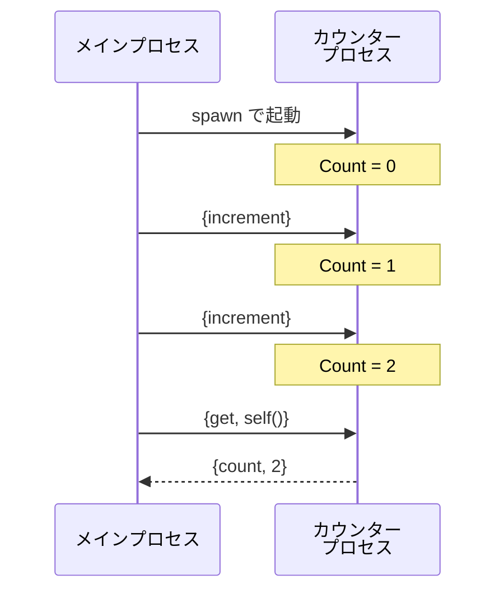
```mermaid
sequenceDiagram
    participant Main as メインプロセス
    participant Counter as カウンター<br/>プロセス
    
    Main->>Counter: spawn で起動
    Note over Counter: Count = 0
    
    Main->>Counter: {increment}
    Note over Counter: Count = 1
    
    Main->>Counter: {increment}
    Note over Counter: Count = 2
    
    Main->>Counter: {get, self()}
    Counter-->>Main: {count, 2}
```

### Erlang の監視ツリー（Supervision Tree）

Erlangの強力な特徴の一つは、障害からの回復を前提としたアーキテクチャです。スーパーバイザーが子プロセスを監視し、障害時に再起動します。

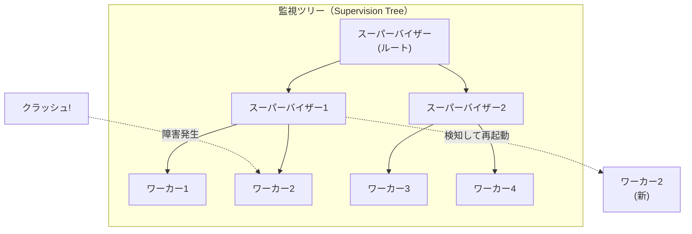
```mermaid
flowchart TB
    subgraph SUPERVISION_TREE["監視ツリー（Supervision Tree）"]
        SUP_ROOT["スーパーバイザー<br/>(ルート)"]
        
        SUP_ROOT --> SUP1["スーパーバイザー1"]
        SUP_ROOT --> SUP2["スーパーバイザー2"]
        
        SUP1 --> W1["ワーカー1"]
        SUP1 --> W2["ワーカー2"]
        
        SUP2 --> W3["ワーカー3"]
        SUP2 --> W4["ワーカー4"]
    end
    
    CRASH["クラッシュ!"] -.->|"障害発生"| W2
    SUP1 -.->|"検知して再起動"| W2_NEW["ワーカー2<br/>(新)"]
```

```erlang
%% Erlang: 監視ツリーの例
-module(my_supervisor).
-behaviour(supervisor).
-export([start_link/0, init/1]).

start_link() ->
    supervisor:start_link({local, ?MODULE}, ?MODULE, []).

init([]) ->
    %% 再起動戦略: one_for_one（障害が発生した子のみ再起動）
    SupFlags = #{
        strategy => one_for_one,
        intensity => 5,    %% 5回まで
        period => 60       %% 60秒以内に
    },
    
    %% 子プロセスの定義
    ChildSpecs = [
        #{
            id => worker1,
            start => {my_worker, start_link, []},
            restart => permanent,   %% 常に再起動
            type => worker
        }
    ],
    
    {ok, {SupFlags, ChildSpecs}}.
```

### 再起動戦略

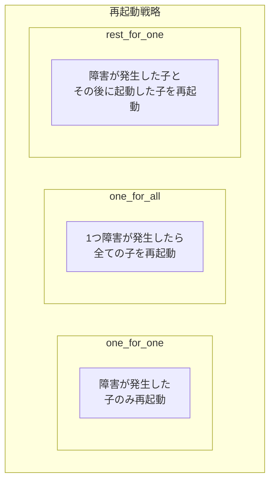
```mermaid
flowchart TB
    subgraph RESTART_STRATEGIES["再起動戦略"]
        subgraph ONE_FOR_ONE["one_for_one"]
            O1["障害が発生した<br/>子のみ再起動"]
        end
        
        subgraph ONE_FOR_ALL["one_for_all"]
            O2["1つ障害が発生したら<br/>全ての子を再起動"]
        end
        
        subgraph REST_FOR_ONE["rest_for_one"]
            O3["障害が発生した子と<br/>その後に起動した子を再起動"]
        end
    end
```

### Akka（Scala/Java）

AkkaはJVM上でアクターモデルを実装したフレームワークです。Scala版とJava版があります。

```scala
// Scala Akka: カウンターアクター
import akka.actor.{Actor, ActorSystem, Props}

// メッセージの定義
case object Increment
case object GetCount
case class Count(value: Int)

// カウンターアクター
class CounterActor extends Actor {
  private var count = 0
  
  def receive: Receive = {
    case Increment =>
      count += 1
      println(s"Count: $count")
      
    case GetCount =>
      sender() ! Count(count)
  }
}

// 使用例
object CounterApp extends App {
  val system = ActorSystem("counter-system")
  val counter = system.actorOf(Props[CounterActor], "counter")
  
  counter ! Increment
  counter ! Increment
  counter ! Increment
  
  // 結果を取得（ask パターン）
  import akka.pattern.ask
  import scala.concurrent.duration._
  implicit val timeout = akka.util.Timeout(5.seconds)
  
  val future = counter ? GetCount
  // future.map(result => println(s"Final count: $result"))
}
```

### アクターモデルの利点と欠点

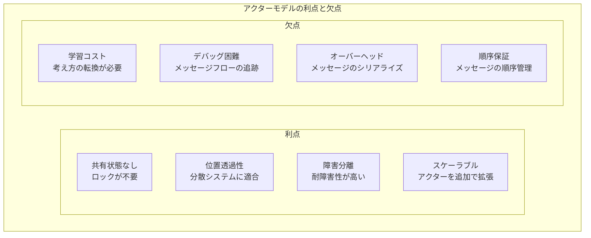
```mermaid
flowchart TB
    subgraph ACTOR_PROS_CONS["アクターモデルの利点と欠点"]
        subgraph PROS["利点"]
            P1["共有状態なし<br/>ロックが不要"]
            P2["位置透過性<br/>分散システムに適合"]
            P3["障害分離<br/>耐障害性が高い"]
            P4["スケーラブル<br/>アクターを追加で拡張"]
        end
        
        subgraph CONS["欠点"]
            C1["学習コスト<br/>考え方の転換が必要"]
            C2["デバッグ困難<br/>メッセージフローの追跡"]
            C3["オーバーヘッド<br/>メッセージのシリアライズ"]
            C4["順序保証<br/>メッセージの順序管理"]
        end
    end
```

---

## 10.3 CSP（Communicating Sequential Processes）

### CSPとは

**CSP（Communicating Sequential Processes）**は、1978年にTony Hoareによって提唱された並行計算のモデルです。独立したプロセスが「チャネル」を通じて同期的に通信します。

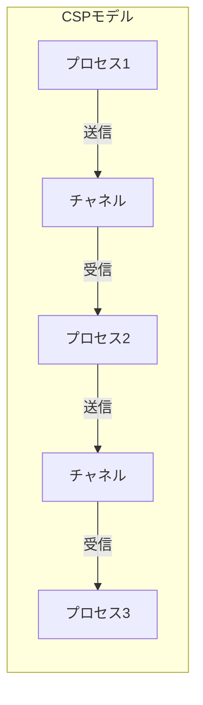
```mermaid
flowchart LR
    subgraph CSP_MODEL["CSPモデル"]
        P1["プロセス1"]
        CH1["チャネル"]
        P2["プロセス2"]
        CH2["チャネル"]
        P3["プロセス3"]
    end
    
    P1 -->|"送信"| CH1
    CH1 -->|"受信"| P2
    P2 -->|"送信"| CH2
    CH2 -->|"受信"| P3
```

### アクターモデルとCSPの違い

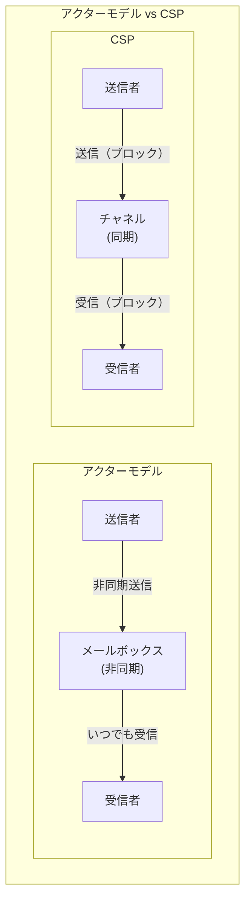
```mermaid
flowchart TB
    subgraph COMPARISON["アクターモデル vs CSP"]
        subgraph ACTOR["アクターモデル"]
            A_SEND["送信者"]
            A_MAILBOX["メールボックス<br/>(非同期)"]
            A_RECV["受信者"]
            
            A_SEND -->|"非同期送信"| A_MAILBOX
            A_MAILBOX -->|"いつでも受信"| A_RECV
        end
        
        subgraph CSP_COMP["CSP"]
            C_SEND["送信者"]
            C_CHANNEL["チャネル<br/>(同期)"]
            C_RECV["受信者"]
            
            C_SEND -->|"送信（ブロック）"| C_CHANNEL
            C_CHANNEL -->|"受信（ブロック）"| C_RECV
        end
    end
```

| 特徴 | アクターモデル | CSP |
|------|--------------|-----|
| 通信方式 | アクターに直接送信 | チャネルを介して送信 |
| 同期/非同期 | 非同期（メールボックス） | 同期（バッファなしの場合） |
| 識別子 | アクターのアドレス | チャネルの参照 |
| 匿名性 | 送信者を知る必要がある | 送受信者は互いを知らない |

### Go言語のGoroutineとChannel

GoはCSPの影響を強く受けており、goroutineとchannelでCSPを実現しています。

```go
package main

import (
    "fmt"
    "time"
)

func producer(ch chan<- int) {
    for i := 0; i < 5; i++ {
        fmt.Printf("Sending: %d\n", i)
        ch <- i  // チャネルに送信（ブロック）
        time.Sleep(100 * time.Millisecond)
    }
    close(ch)  // チャネルを閉じる
}

func consumer(ch <-chan int, done chan<- bool) {
    for value := range ch {  // チャネルが閉じるまで受信
        fmt.Printf("Received: %d\n", value)
    }
    done <- true
}

func main() {
    ch := make(chan int)     // バッファなしチャネル
    done := make(chan bool)
    
    go producer(ch)          // goroutine を起動
    go consumer(ch, done)
    
    <-done  // 完了を待つ
    fmt.Println("Done!")
}
```

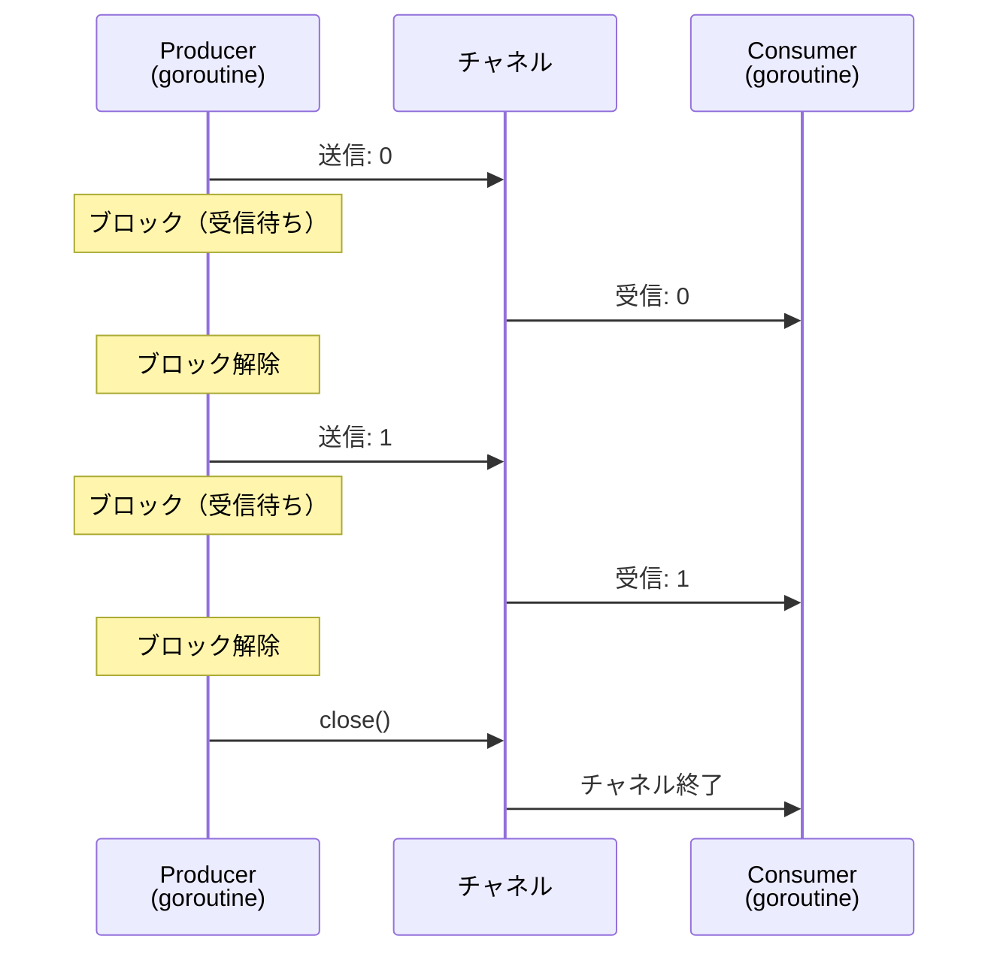
```mermaid
sequenceDiagram
    participant Producer as Producer<br/>(goroutine)
    participant Channel as チャネル
    participant Consumer as Consumer<br/>(goroutine)
    
    Producer->>Channel: 送信: 0
    Note over Producer: ブロック（受信待ち）
    Channel->>Consumer: 受信: 0
    Note over Producer: ブロック解除
    
    Producer->>Channel: 送信: 1
    Note over Producer: ブロック（受信待ち）
    Channel->>Consumer: 受信: 1
    Note over Producer: ブロック解除
    
    Producer->>Channel: close()
    Channel->>Consumer: チャネル終了
```

### バッファ付きチャネル

```go
package main

import "fmt"

func main() {
    // バッファ付きチャネル（容量3）
    ch := make(chan int, 3)
    
    // バッファに空きがある限りブロックしない
    ch <- 1
    ch <- 2
    ch <- 3
    // ch <- 4  // これはブロックする（バッファが満杯）
    
    fmt.Println(<-ch)  // 1
    fmt.Println(<-ch)  // 2
    fmt.Println(<-ch)  // 3
}
```

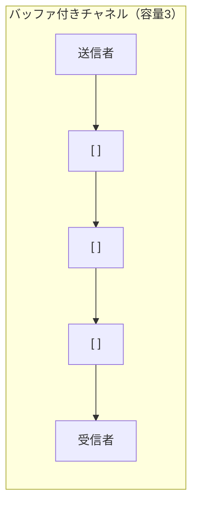
```mermaid
flowchart LR
    subgraph BUFFERED_CHANNEL["バッファ付きチャネル（容量3）"]
        SENDER["送信者"]
        B1["[ ]"]
        B2["[ ]"]
        B3["[ ]"]
        RECEIVER["受信者"]
        
        SENDER --> B1
        B1 --> B2
        B2 --> B3
        B3 --> RECEIVER
    end
```

### select文

Goの`select`文は、複数のチャネル操作を同時に待機できます。

```go
package main

import (
    "fmt"
    "time"
)

func main() {
    ch1 := make(chan string)
    ch2 := make(chan string)
    
    go func() {
        time.Sleep(100 * time.Millisecond)
        ch1 <- "from ch1"
    }()
    
    go func() {
        time.Sleep(200 * time.Millisecond)
        ch2 <- "from ch2"
    }()
    
    for i := 0; i < 2; i++ {
        select {
        case msg := <-ch1:
            fmt.Println(msg)
        case msg := <-ch2:
            fmt.Println(msg)
        case <-time.After(1 * time.Second):
            fmt.Println("timeout")
        }
    }
}
```

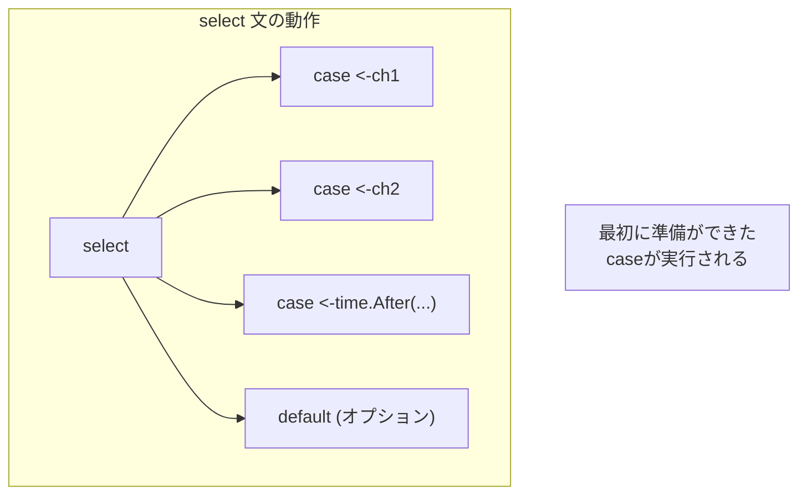
```mermaid
flowchart TB
    subgraph SELECT["select 文の動作"]
        SELECT_BLOCK["select"]
        
        CH1["case <-ch1"]
        CH2["case <-ch2"]
        TIMEOUT["case <-time.After(...)"]
        DEFAULT["default (オプション)"]
        
        SELECT_BLOCK --> CH1
        SELECT_BLOCK --> CH2
        SELECT_BLOCK --> TIMEOUT
        SELECT_BLOCK --> DEFAULT
    end
    
    NOTE["最初に準備ができた<br/>caseが実行される"]
```

### パイプラインパターン

CSPを使った代表的なパターンの一つが「パイプライン」です。

```go
package main

import "fmt"

// ステージ1: 数値を生成
func generate(nums ...int) <-chan int {
    out := make(chan int)
    go func() {
        for _, n := range nums {
            out <- n
        }
        close(out)
    }()
    return out
}

// ステージ2: 2乗する
func square(in <-chan int) <-chan int {
    out := make(chan int)
    go func() {
        for n := range in {
            out <- n * n
        }
        close(out)
    }()
    return out
}

// ステージ3: 出力
func main() {
    // パイプラインを構築
    nums := generate(1, 2, 3, 4, 5)
    squared := square(nums)
    
    // 結果を受信
    for result := range squared {
        fmt.Println(result)  // 1, 4, 9, 16, 25
    }
}
```

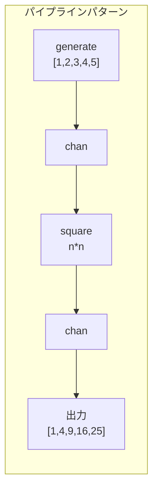
```mermaid
flowchart LR
    subgraph PIPELINE["パイプラインパターン"]
        GEN["generate<br/>[1,2,3,4,5]"]
        CH1["chan"]
        SQ["square<br/>n*n"]
        CH2["chan"]
        OUT["出力<br/>[1,4,9,16,25]"]
        
        GEN --> CH1 --> SQ --> CH2 --> OUT
    end
```

### ファンアウト・ファンイン

複数のworkerで並列処理し、結果を集約するパターンです。

```go
package main

import (
    "fmt"
    "sync"
)

func worker(id int, jobs <-chan int, results chan<- int, wg *sync.WaitGroup) {
    defer wg.Done()
    for job := range jobs {
        fmt.Printf("Worker %d processing job %d\n", id, job)
        results <- job * 2
    }
}

func main() {
    jobs := make(chan int, 100)
    results := make(chan int, 100)
    
    var wg sync.WaitGroup
    
    // ファンアウト: 3つのworkerを起動
    for w := 1; w <= 3; w++ {
        wg.Add(1)
        go worker(w, jobs, results, &wg)
    }
    
    // ジョブを送信
    for j := 1; j <= 9; j++ {
        jobs <- j
    }
    close(jobs)
    
    // workerの完了を待つ
    go func() {
        wg.Wait()
        close(results)
    }()
    
    // ファンイン: 結果を集約
    for result := range results {
        fmt.Printf("Result: %d\n", result)
    }
}
```

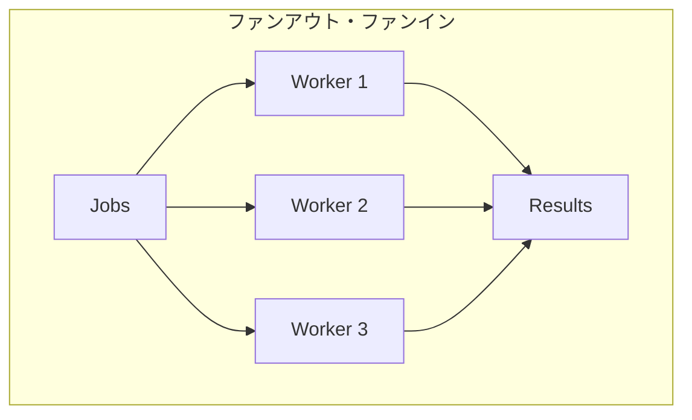
```mermaid
flowchart TB
    subgraph FAN_OUT_IN["ファンアウト・ファンイン"]
        JOBS["Jobs"]
        
        W1["Worker 1"]
        W2["Worker 2"]
        W3["Worker 3"]
        
        RESULTS["Results"]
    end
    
    JOBS --> W1
    JOBS --> W2
    JOBS --> W3
    
    W1 --> RESULTS
    W2 --> RESULTS
    W3 --> RESULTS
```

---

## 10.4 データフロープログラミング

### データフローとは

**データフロープログラミング**は、プログラムをデータの流れ（フロー）として表現するパラダイムです。計算はデータが利用可能になったときに自動的に実行されます。

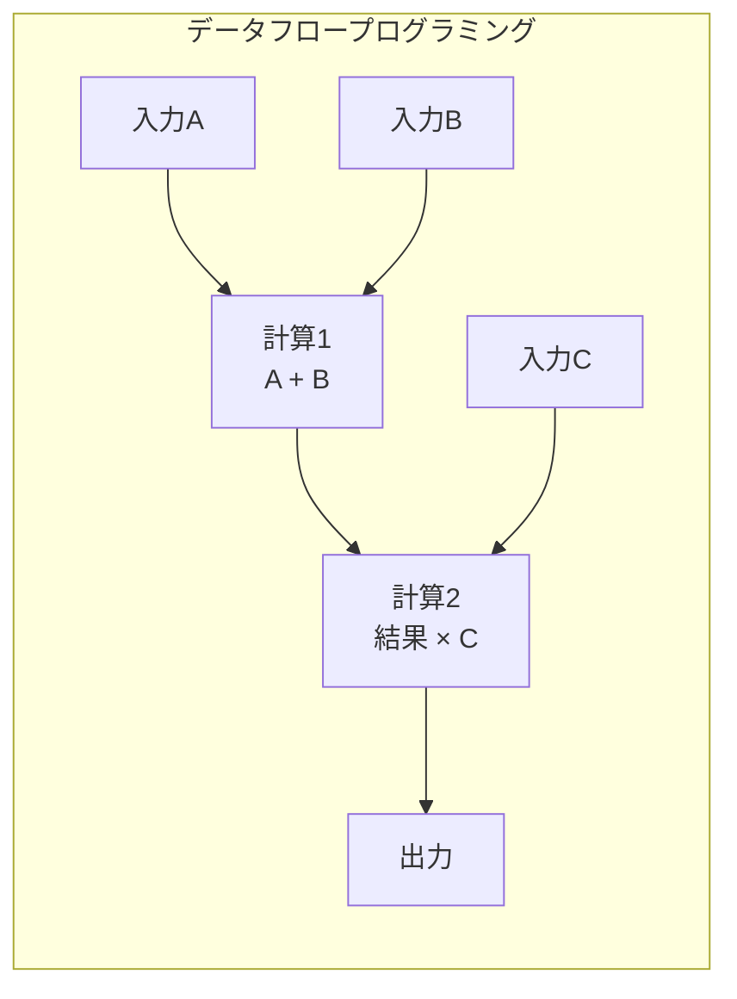
```mermaid
flowchart LR
    subgraph DATAFLOW["データフロープログラミング"]
        INPUT1["入力A"]
        INPUT2["入力B"]
        INPUT3["入力C"]
        
        CALC1["計算1<br/>A + B"]
        CALC2["計算2<br/>結果 × C"]
        
        OUTPUT["出力"]
    end
    
    INPUT1 --> CALC1
    INPUT2 --> CALC1
    CALC1 --> CALC2
    INPUT3 --> CALC2
    CALC2 --> OUTPUT
```

### 命令型プログラミングとの違い

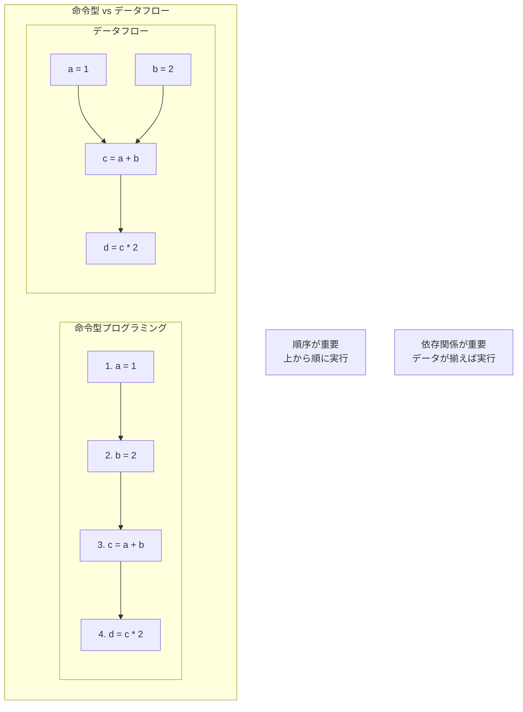
```mermaid
flowchart TB
    subgraph COMPARISON["命令型 vs データフロー"]
        subgraph IMPERATIVE["命令型プログラミング"]
            I1["1. a = 1"]
            I2["2. b = 2"]
            I3["3. c = a + b"]
            I4["4. d = c * 2"]
            
            I1 --> I2 --> I3 --> I4
        end
        
        subgraph DATAFLOW_CMP["データフロー"]
            D1["a = 1"]
            D2["b = 2"]
            D3["c = a + b"]
            D4["d = c * 2"]
            
            D1 --> D3
            D2 --> D3
            D3 --> D4
        end
    end
    
    NOTE1["順序が重要<br/>上から順に実行"]
    NOTE2["依存関係が重要<br/>データが揃えば実行"]
```

### データフローの特徴

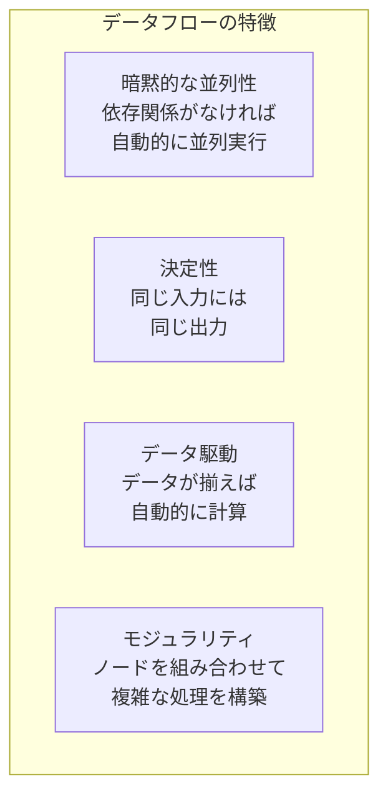
```mermaid
flowchart TB
    subgraph DATAFLOW_FEATURES["データフローの特徴"]
        F1["暗黙的な並列性<br/>依存関係がなければ<br/>自動的に並列実行"]
        F2["決定性<br/>同じ入力には<br/>同じ出力"]
        F3["データ駆動<br/>データが揃えば<br/>自動的に計算"]
        F4["モジュラリティ<br/>ノードを組み合わせて<br/>複雑な処理を構築"]
    end
```

### TensorFlowのデータフロー

TensorFlowは機械学習フレームワークですが、内部的にはデータフローグラフを構築しています。

```python
# TensorFlow 1.x スタイル（明示的なグラフ）
import tensorflow as tf

# グラフを構築
a = tf.constant(3.0)
b = tf.constant(4.0)
c = tf.add(a, b)
d = tf.multiply(c, 2.0)

# グラフを実行
with tf.Session() as sess:
    result = sess.run(d)
    print(result)  # 14.0
```

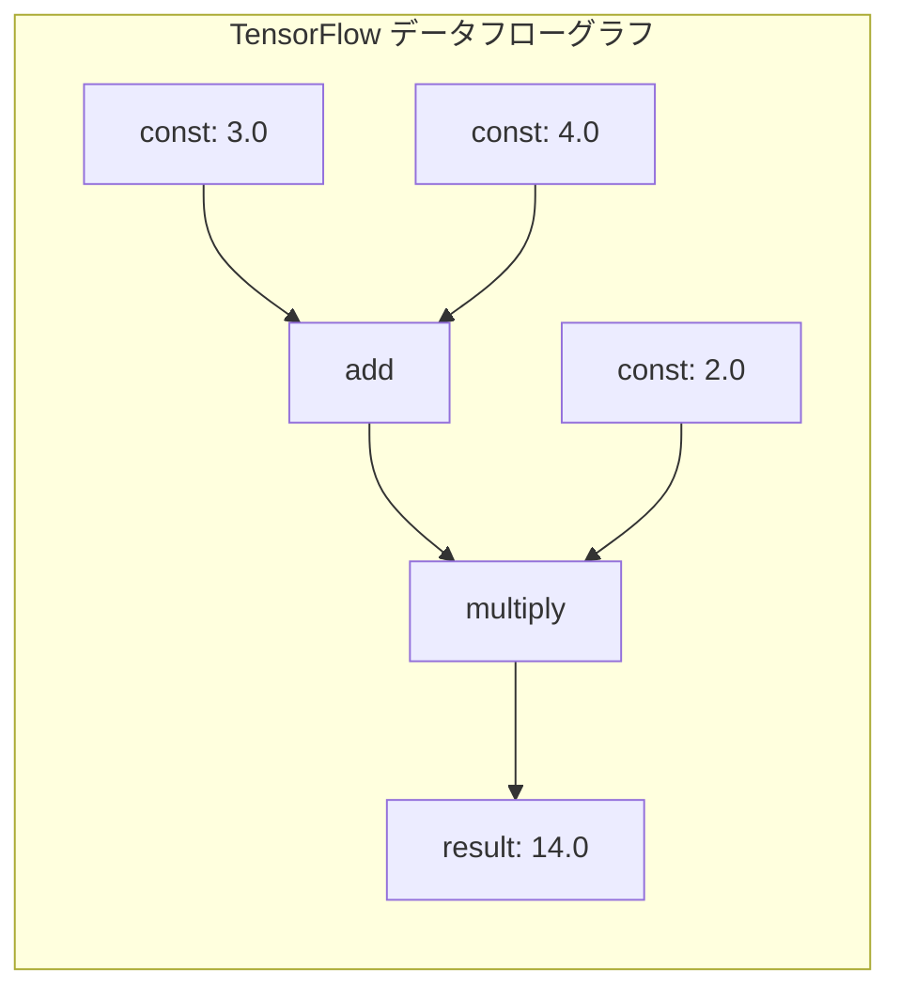
```mermaid
flowchart LR
    subgraph TF_GRAPH["TensorFlow データフローグラフ"]
        CONST_A["const: 3.0"]
        CONST_B["const: 4.0"]
        CONST_2["const: 2.0"]
        
        ADD["add"]
        MUL["multiply"]
        
        RESULT["result: 14.0"]
    end
    
    CONST_A --> ADD
    CONST_B --> ADD
    ADD --> MUL
    CONST_2 --> MUL
    MUL --> RESULT
```

### ストリームプロセッシング

Apache Kafka, Apache Flink, Apache Sparkなどのストリームプロセッシングフレームワークもデータフローの考え方を採用しています。

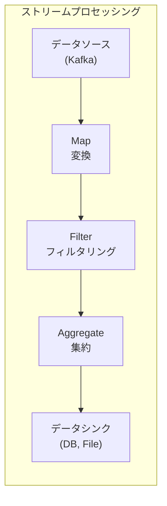
```mermaid
flowchart LR
    subgraph STREAM_PROCESSING["ストリームプロセッシング"]
        SOURCE["データソース<br/>(Kafka)"]
        
        MAP["Map<br/>変換"]
        FILTER["Filter<br/>フィルタリング"]
        AGG["Aggregate<br/>集約"]
        
        SINK["データシンク<br/>(DB, File)"]
    end
    
    SOURCE --> MAP --> FILTER --> AGG --> SINK
```

---

## 10.5 リアクティブプログラミング

### リアクティブプログラミングとは

**リアクティブプログラミング**は、データストリームと変更の伝播に焦点を当てたプログラミングパラダイムです。「何かが変わったら、それに反応して処理を行う」という考え方です。

```mermaid
flowchart LR
    subgraph REACTIVE["リアクティブプログラミング"]
        SOURCE["データソース<br/>(Observable)"]
        
        OP1["オペレータ1<br/>map"]
        OP2["オペレータ2<br/>filter"]
        OP3["オペレータ3<br/>reduce"]
        
        OBSERVER["オブザーバー<br/>(Subscriber)"]
    end
    
    SOURCE -->|"イベント"| OP1 -->|"変換"| OP2 -->|"フィルタ"| OP3 -->|"集約"| OBSERVER
```

### リアクティブ宣言（Reactive Manifesto）

リアクティブシステムの4つの特性：

```mermaid
flowchart TB
    subgraph REACTIVE_MANIFESTO["リアクティブ宣言"]
        RESPONSIVE["Responsive<br/>即応性<br/>常に適時に応答"]
        RESILIENT["Resilient<br/>耐障害性<br/>障害が発生しても応答"]
        ELASTIC["Elastic<br/>弾力性<br/>負荷に応じてスケール"]
        MESSAGE["Message Driven<br/>メッセージ駆動<br/>非同期メッセージで通信"]
    end
    
    MESSAGE --> RESPONSIVE
    MESSAGE --> ELASTIC
    RESILIENT --> RESPONSIVE
    ELASTIC --> RESPONSIVE
```

### RxJS（JavaScript）

RxJSはリアクティブプログラミングのJavaScript実装です。

```javascript
import { fromEvent, interval } from 'rxjs';
import { map, filter, throttleTime, takeUntil } from 'rxjs/operators';

// マウスクリックイベントのストリーム
const clicks$ = fromEvent(document, 'click');

// クリック位置をストリームとして処理
clicks$.pipe(
    throttleTime(500),  // 500msに1回だけ
    map(event => ({ x: event.clientX, y: event.clientY })),
    filter(pos => pos.x > 100)  // x > 100 のみ
).subscribe(pos => {
    console.log(`Clicked at: (${pos.x}, ${pos.y})`);
});

// カウントダウンタイマー
const stop$ = fromEvent(document.getElementById('stop'), 'click');

interval(1000).pipe(
    map(n => 10 - n),
    takeUntil(stop$)  // stopがクリックされるまで
).subscribe(n => {
    console.log(`Countdown: ${n}`);
});
```

```mermaid
sequenceDiagram
    participant User as ユーザー
    participant Event as イベント
    participant Stream as ストリーム
    participant Subscribe as 購読者
    
    User->>Event: クリック1
    Event->>Stream: emit(pos1)
    Stream->>Stream: throttle, map, filter
    Stream->>Subscribe: next(pos1)
    
    User->>Event: クリック2（500ms以内）
    Event->>Stream: emit(pos2)
    Note over Stream: throttleで無視
    
    User->>Event: クリック3
    Event->>Stream: emit(pos3)
    Stream->>Stream: throttle, map, filter
    Stream->>Subscribe: next(pos3)
```

### 主要なリアクティブ演算子

```mermaid
flowchart TB
    subgraph OPERATORS["主要なリアクティブ演算子"]
        subgraph TRANSFORM["変換"]
            MAP["map<br/>各要素を変換"]
            FLATMAP["flatMap<br/>各要素をストリームに展開"]
            SCAN["scan<br/>累積処理"]
        end
        
        subgraph FILTER["フィルタリング"]
            FILTER_OP["filter<br/>条件に合う要素のみ"]
            TAKE["take(n)<br/>最初のn個"]
            DISTINCT["distinct<br/>重複を除去"]
        end
        
        subgraph COMBINE["合成"]
            MERGE["merge<br/>複数ストリームを統合"]
            ZIP["zip<br/>対応する要素を結合"]
            COMBINE_LATEST["combineLatest<br/>最新値を組み合わせ"]
        end
        
        subgraph UTILITY["ユーティリティ"]
            THROTTLE["throttle<br/>一定間隔でサンプリング"]
            DEBOUNCE["debounce<br/>一定時間待って最後を発行"]
            DELAY["delay<br/>遅延"]
        end
    end
```

### Project Reactor（Java/Spring）

Spring WebFluxで使われるリアクティブストリーム実装です。

```java
import reactor.core.publisher.Flux;
import reactor.core.publisher.Mono;

public class ReactorExample {
    public static void main(String[] args) {
        // Flux: 0〜N個の要素を発行するストリーム
        Flux<Integer> numbers = Flux.range(1, 10)
            .map(n -> n * 2)
            .filter(n -> n > 5)
            .take(3);
        
        numbers.subscribe(
            value -> System.out.println("Value: " + value),
            error -> System.err.println("Error: " + error),
            () -> System.out.println("Completed!")
        );
        
        // Mono: 0または1個の要素を発行するストリーム
        Mono<String> greeting = Mono.just("Hello")
            .map(s -> s + " World!");
        
        greeting.subscribe(System.out::println);
    }
}
```

### バックプレッシャー

リアクティブストリームの重要な概念の一つが**バックプレッシャー**です。消費者が処理できる速度でデータを要求できます。

```mermaid
sequenceDiagram
    participant Producer as プロデューサー
    participant Stream as ストリーム
    participant Consumer as コンシューマー
    
    Consumer->>Stream: subscribe()
    Stream->>Consumer: onSubscribe(subscription)
    
    Consumer->>Stream: request(3)
    Note over Producer: 3つだけ送信OK
    
    Producer->>Stream: onNext(1)
    Stream->>Consumer: onNext(1)
    Producer->>Stream: onNext(2)
    Stream->>Consumer: onNext(2)
    Producer->>Stream: onNext(3)
    Stream->>Consumer: onNext(3)
    
    Note over Producer: 要求された分を送信完了<br/>次のrequestを待つ
    
    Consumer->>Stream: request(2)
    Producer->>Stream: onNext(4)
    Stream->>Consumer: onNext(4)
    Producer->>Stream: onNext(5)
    Stream->>Consumer: onNext(5)
```

```mermaid
flowchart TB
    subgraph BACKPRESSURE["バックプレッシャーの戦略"]
        B1["Buffer<br/>バッファに溜める"]
        B2["Drop<br/>溢れた分を捨てる"]
        B3["Latest<br/>最新のみ保持"]
        B4["Error<br/>エラーを発生"]
    end
```

### Reactive Streams仕様

Reactive Streamsは、非同期ストリーム処理のための標準仕様です。

```java
// Reactive Streams の4つのインターフェース
public interface Publisher<T> {
    void subscribe(Subscriber<? super T> s);
}

public interface Subscriber<T> {
    void onSubscribe(Subscription s);
    void onNext(T t);
    void onError(Throwable t);
    void onComplete();
}

public interface Subscription {
    void request(long n);  // バックプレッシャー
    void cancel();
}

public interface Processor<T, R> extends Subscriber<T>, Publisher<R> {
    // 変換処理を行う
}
```

---

## 10.6 各モデルの比較と選択

### モデル比較表

```mermaid
flowchart TB
    subgraph MODEL_COMPARISON["高度な並行処理モデルの比較"]
        subgraph ACTOR_SUM["アクターモデル"]
            A1["✓ 障害分離に優れる"]
            A2["✓ 分散システム向け"]
            A3["✗ 順序保証が複雑"]
        end
        
        subgraph CSP_SUM["CSP"]
            C1["✓ 同期が明確"]
            C2["✓ デッドロック検出"]
            C3["✗ スケーラビリティ"]
        end
        
        subgraph DATAFLOW_SUM["データフロー"]
            D1["✓ 暗黙の並列化"]
            D2["✓ 決定的動作"]
            D3["✗ 動的な制御フロー"]
        end
        
        subgraph REACTIVE_SUM["リアクティブ"]
            R1["✓ イベント処理"]
            R2["✓ バックプレッシャー"]
            R3["✗ 学習コスト"]
        end
    end
```

| モデル | 通信方式 | 同期/非同期 | 主なユースケース | 代表的な実装 |
|--------|----------|-------------|-----------------|--------------|
| アクター | メッセージ | 非同期 | 分散システム、IoT | Erlang, Akka |
| CSP | チャネル | 同期可 | パイプライン、マイクロサービス | Go |
| データフロー | データ依存 | データ駆動 | 機械学習、ETL | TensorFlow, Spark |
| リアクティブ | ストリーム | 非同期 | UI、イベント処理 | RxJS, Reactor |

### ユースケース別の選択指針

```mermaid
flowchart TB
    START["要件は何？"]
    
    START --> Q1{"分散システム？"}
    Q1 -->|"Yes"| ACTOR["アクターモデル<br/>Erlang/Akka"]
    Q1 -->|"No"| Q2
    
    Q2{"データパイプライン？"}
    Q2 -->|"Yes"| Q3
    Q2 -->|"No"| Q4
    
    Q3{"リアルタイム？"}
    Q3 -->|"Yes"| CSP_CHOICE["CSP<br/>Go"]
    Q3 -->|"No"| DATAFLOW_CHOICE["データフロー<br/>Spark"]
    
    Q4{"UIイベント処理？"}
    Q4 -->|"Yes"| REACTIVE_CHOICE["リアクティブ<br/>RxJS"]
    Q4 -->|"No"| BASIC["基本モデル<br/>スレッドプール"]
```

---

## 10.7 まとめ

この章では、高度な並行処理モデルについて詳しく学びました。

```mermaid
mindmap
    root((第10章のまとめ))
        アクターモデル
            メッセージパッシング
            カプセル化された状態
            障害分離
            監視ツリー
        CSP
            チャネル通信
            同期的メッセージング
            select文
            パイプライン
        データフロー
            データ駆動
            暗黙の並列性
            依存グラフ
        リアクティブ
            Observable/Observer
            演算子チェーン
            バックプレッシャー
            Reactive Streams
```

### 重要なポイント

#### 1. アクターモデルは障害分離と分散システムに強い

アクターモデルでは、各アクターが独立した状態を持ち、メッセージでのみ通信します。これにより、障害が他のアクターに伝播しにくく、分散システムの構築に適しています。Erlangの「Let it crash」哲学と監視ツリーは、信頼性の高いシステムを構築するための強力な概念です。

#### 2. CSPはチャネルを通じた同期通信が特徴

CSPでは、プロセス間の通信がチャネルを介して行われます。バッファなしチャネルでの送受信は同期的であり、デッドロックの検出が容易です。Goのgoroutineとchannelは、CSPの概念を実践的に活用しています。

#### 3. データフローは計算の依存関係に焦点を当てる

データフロープログラミングでは、計算はデータの依存関係で表現されます。データが利用可能になると自動的に計算が実行されるため、暗黙的な並列性が得られます。機械学習フレームワークやETL処理で広く使われています。

#### 4. リアクティブプログラミングはイベントストリームを扱う

リアクティブプログラミングは、イベントやデータのストリームを宣言的に処理するパラダイムです。バックプレッシャーにより、消費者が処理できるペースでデータを受け取ることができ、UIイベント処理やリアルタイムデータ処理に適しています。

---

## 📝 練習問題

1. **アクターモデルとCSPの違いを、通信方式と同期性の観点から説明してください。**
   
   ヒント：メールボックスとチャネル、非同期と同期について考えてください。

2. **Goで、3つのワーカーgoroutineが並列でジョブを処理し、結果を1つのチャネルに集約するプログラムを書いてください。**
   
   ヒント：ファンアウト・ファンインパターンを参考にしてください。

3. **リアクティブプログラミングにおけるバックプレッシャーの必要性を説明してください。**
   
   ヒント：プロデューサーとコンシューマーの処理速度の差について考えてください。

4. **Erlangの「Let it crash」哲学と監視ツリーが、なぜ信頼性の高いシステム構築に有効なのかを説明してください。**
   
   ヒント：障害の分離と回復について考えてください。

5. **以下のユースケースに最適な並行処理モデルを選び、その理由を説明してください：**
   - a) 大量のセンサーデータをリアルタイムで集約するIoTシステム
   - b) ユーザーのマウス操作に反応するリッチなWeb UI
   - c) 画像処理パイプライン（リサイズ→フィルタ→保存）
   
   ヒント：各モデルの特性とユースケースの要件を照らし合わせてください。

---

## 🔗 次の章へ

[第11章: JavaScript/TypeScript](./11-javascript.md) では、JavaScriptのシングルスレッドモデル、イベントループ、Promise、async/await、そしてWeb Workersについて詳しく学びます。

---

[← 目次に戻る](../index.md) | [← 前章: 軽量並行処理](./09-lightweight-concurrency.md)

