# 第11章: JavaScript/TypeScript

> 🎯 **この章の目標**: JavaScriptのシングルスレッドモデル、イベントループ、非同期処理の進化（Callback→Promise→async/await）、そしてWeb Workersを理解する

---

## 11.1 JavaScriptのシングルスレッドモデル

### なぜシングルスレッドなのか

JavaScriptは1995年にNetscape Navigatorのために、わずか10日間で設計されました。当時の主な目的はWebページに簡単なインタラクティブ性を追加することでした。マルチスレッドによる複雑さ（レースコンディション、デッドロック）を避けるため、シングルスレッドモデルが採用されました。

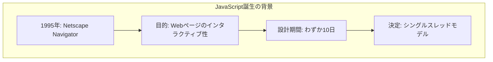

### シングルスレッドの意味

JavaScriptのメインスレッド（UIスレッド）は1つだけです。すべてのJavaScriptコードは、このスレッドで順番に実行されます。

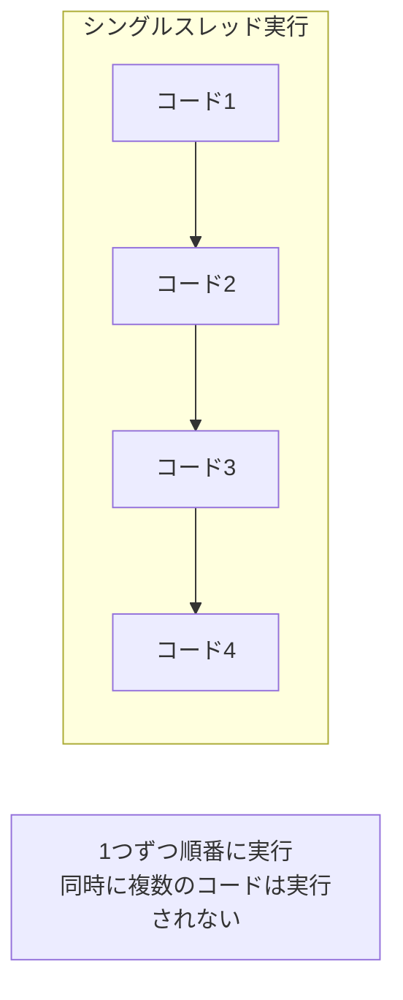

```javascript
// シングルスレッドの証明
console.log("1: 開始");

// 重い処理（メインスレッドをブロック）
for (let i = 0; i < 1000000000; i++) {
    // 何もしない
}

console.log("2: ループ完了");  // 1の後、必ずここが実行される
console.log("3: 終了");        // 2の後、必ずここが実行される
```

### ブロッキングの問題

シングルスレッドでは、1つの処理が完了するまで次の処理に進めません。重い処理がメインスレッドをブロックすると、UIがフリーズします。

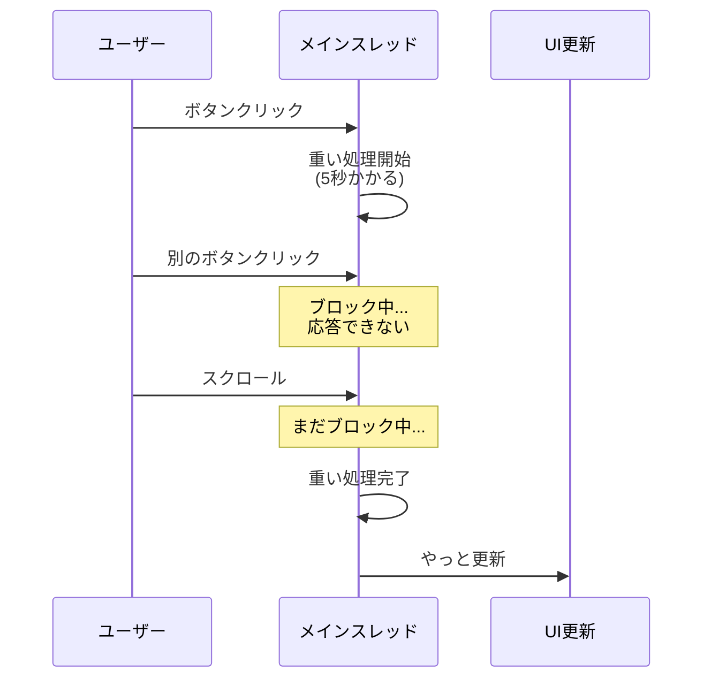

```javascript
// ブロッキングの例
document.getElementById('button').addEventListener('click', () => {
    console.log("クリック！");
    
    // この間、UIは完全にフリーズ
    const start = Date.now();
    while (Date.now() - start < 5000) {
        // 5秒間ブロック
    }
    
    console.log("完了");  // 5秒後にやっと実行
});
```

### 非同期処理による解決

JavaScriptは非同期処理を使って、ブロッキングを回避します。I/O操作などの待ち時間が発生する処理は、バックグラウンドで実行され、完了時にコールバックが呼ばれます。

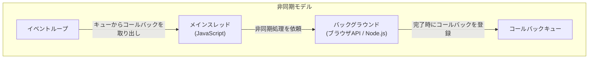

---

## 11.2 イベントループ

### イベントループとは

**イベントループ**は、JavaScriptの非同期処理を実現する中核的な仕組みです。コールバックキューを監視し、メインスレッドが空いたときにキューからタスクを取り出して実行します。

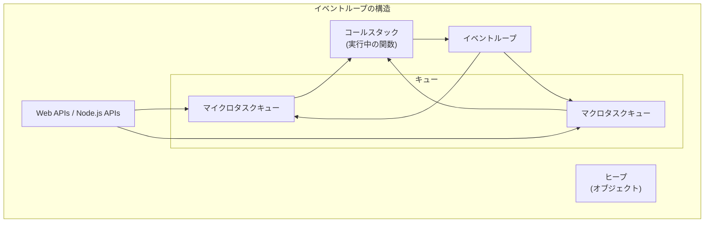

### コールスタック

**コールスタック**は、現在実行中の関数を追跡するデータ構造です。関数が呼ばれるとスタックにプッシュされ、関数が完了するとポップされます。

```javascript
function first() {
    console.log("first 開始");
    second();
    console.log("first 終了");
}

function second() {
    console.log("second 開始");
    third();
    console.log("second 終了");
}

function third() {
    console.log("third");
}

first();
```

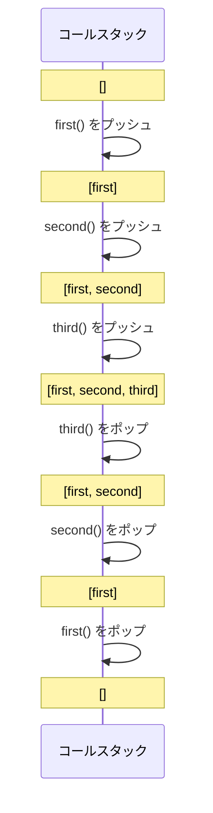

### Web APIs / Node.js APIs

ブラウザやNode.jsは、非同期操作を処理するためのAPIを提供します。これらは**メインスレッドとは別**で動作します。

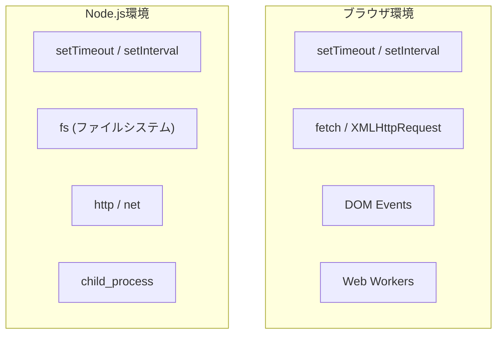

```javascript
console.log("1: 開始");

// setTimeout はブラウザ/Node.js のAPIで処理される
setTimeout(() => {
    console.log("3: タイマー完了");
}, 0);

console.log("2: 終了");

// 出力順序:
// 1: 開始
// 2: 終了
// 3: タイマー完了  ← 0msでも後から実行される
```

### イベントループの動作

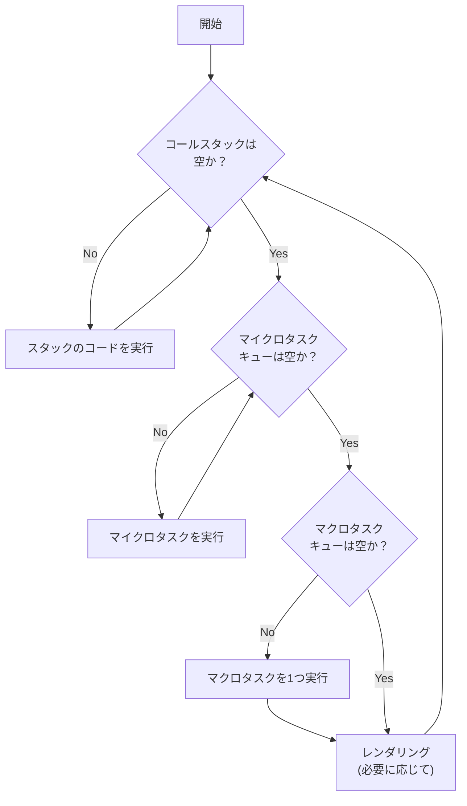

---

## 11.3 マイクロタスクとマクロタスク

### 2種類のタスクキュー

JavaScriptには2種類のタスクキューがあります：

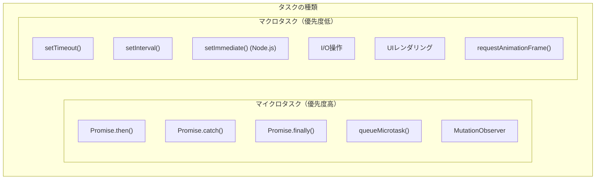

### 実行順序

マイクロタスクは、**現在のマクロタスクが完了した直後**、**次のマクロタスクの前**に、すべて実行されます。

```javascript
console.log("1: 同期コード開始");

setTimeout(() => {
    console.log("4: マクロタスク1");
}, 0);

Promise.resolve().then(() => {
    console.log("3: マイクロタスク1");
});

setTimeout(() => {
    console.log("5: マクロタスク2");
}, 0);

Promise.resolve().then(() => {
    console.log("3.5: マイクロタスク2");
});

console.log("2: 同期コード終了");

// 出力順序:
// 1: 同期コード開始
// 2: 同期コード終了
// 3: マイクロタスク1
// 3.5: マイクロタスク2
// 4: マクロタスク1
// 5: マクロタスク2
```

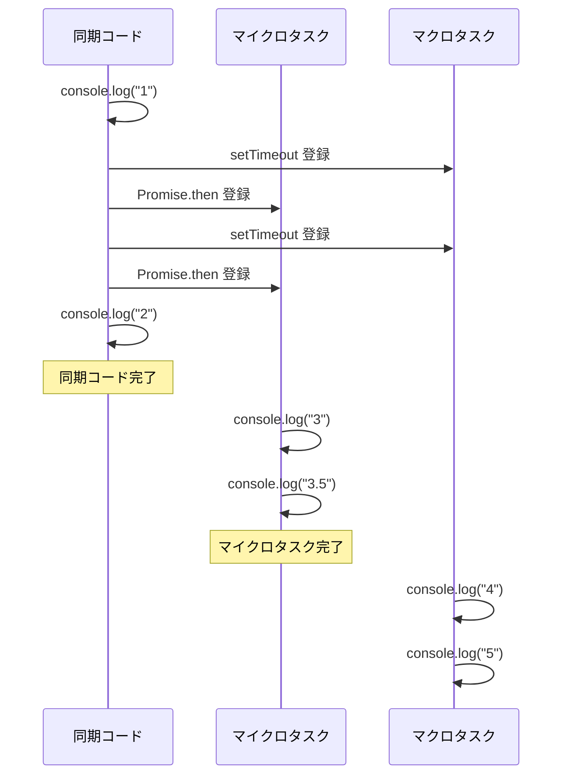

### 複雑な例

```javascript
console.log("script start");

setTimeout(() => {
    console.log("setTimeout");
}, 0);

Promise.resolve()
    .then(() => {
        console.log("promise1");
    })
    .then(() => {
        console.log("promise2");
    });

Promise.resolve().then(() => {
    console.log("promise3");
});

console.log("script end");

// 出力順序:
// script start
// script end
// promise1
// promise3
// promise2
// setTimeout
```

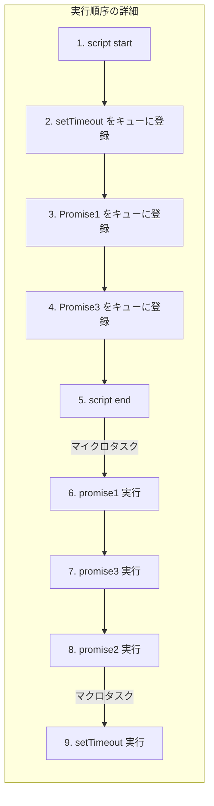

### queueMicrotask

`queueMicrotask()`を使って、明示的にマイクロタスクを登録できます。

```javascript
console.log("start");

queueMicrotask(() => {
    console.log("microtask 1");
});

Promise.resolve().then(() => {
    console.log("promise microtask");
});

queueMicrotask(() => {
    console.log("microtask 2");
});

console.log("end");

// 出力順序:
// start
// end
// microtask 1
// promise microtask
// microtask 2
```

---

## 11.4 Callback → Promise → async/await

### コールバック時代

初期のJavaScript非同期処理は、コールバック関数を使って行われました。

```javascript
// コールバックスタイル
function fetchData(url, callback) {
    const xhr = new XMLHttpRequest();
    xhr.open('GET', url);
    xhr.onload = function() {
        if (xhr.status === 200) {
            callback(null, xhr.responseText);
        } else {
            callback(new Error('Request failed'));
        }
    };
    xhr.onerror = function() {
        callback(new Error('Network error'));
    };
    xhr.send();
}

// 使用例
fetchData('/api/user', function(error, data) {
    if (error) {
        console.error(error);
        return;
    }
    console.log(data);
});
```

### コールバック地獄（Callback Hell）

複数の非同期処理を順次実行すると、ネストが深くなり読みにくくなります。

```javascript
// コールバック地獄の例
getUser(userId, function(error, user) {
    if (error) {
        handleError(error);
        return;
    }
    getOrders(user.id, function(error, orders) {
        if (error) {
            handleError(error);
            return;
        }
        getOrderDetails(orders[0].id, function(error, details) {
            if (error) {
                handleError(error);
                return;
            }
            getShippingInfo(details.shippingId, function(error, shipping) {
                if (error) {
                    handleError(error);
                    return;
                }
                // やっと処理できる...
                displayResult(user, orders, details, shipping);
            });
        });
    });
});
```

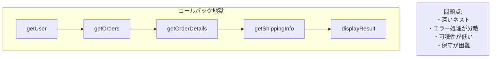

### Promise の登場

ES2015（ES6）でPromiseが導入され、非同期処理がより扱いやすくなりました。

```javascript
// Promise を返す関数
function fetchData(url) {
    return new Promise((resolve, reject) => {
        const xhr = new XMLHttpRequest();
        xhr.open('GET', url);
        xhr.onload = function() {
            if (xhr.status === 200) {
                resolve(xhr.responseText);
            } else {
                reject(new Error('Request failed'));
            }
        };
        xhr.onerror = function() {
            reject(new Error('Network error'));
        };
        xhr.send();
    });
}

// Promiseチェーン
fetchData('/api/user')
    .then(data => {
        console.log(data);
        return fetchData('/api/orders');
    })
    .then(orders => {
        console.log(orders);
    })
    .catch(error => {
        console.error(error);
    });
```

### Promise の状態

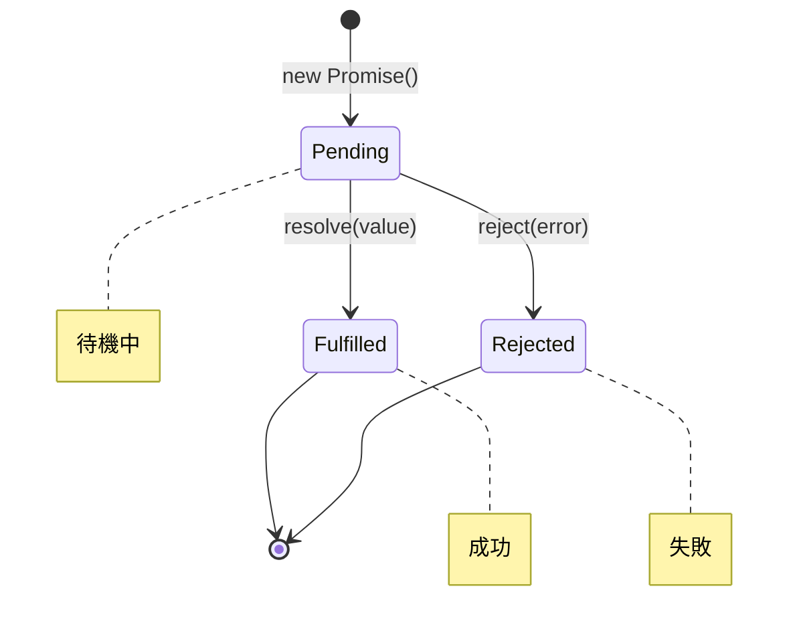

### Promise チェーンによる改善

```javascript
// コールバック地獄がPromiseチェーンで改善
getUser(userId)
    .then(user => getOrders(user.id))
    .then(orders => getOrderDetails(orders[0].id))
    .then(details => getShippingInfo(details.shippingId))
    .then(shipping => {
        displayResult(shipping);
    })
    .catch(error => {
        handleError(error);  // エラー処理が1箇所に
    });
```

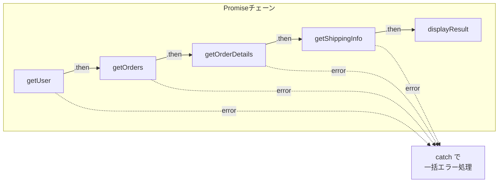

### Promise のユーティリティメソッド

```javascript
// Promise.all: すべてが成功したら成功
const promises = [
    fetch('/api/user'),
    fetch('/api/orders'),
    fetch('/api/products')
];

Promise.all(promises)
    .then(([user, orders, products]) => {
        console.log('すべて成功:', user, orders, products);
    })
    .catch(error => {
        console.error('どれかが失敗:', error);
    });

// Promise.race: 最初に完了したものを採用
Promise.race([
    fetch('/api/data'),
    new Promise((_, reject) => 
        setTimeout(() => reject(new Error('Timeout')), 5000)
    )
])
    .then(data => console.log(data))
    .catch(error => console.error(error));

// Promise.allSettled: すべての結果を取得（成功/失敗問わず）
Promise.allSettled(promises)
    .then(results => {
        results.forEach((result, i) => {
            if (result.status === 'fulfilled') {
                console.log(`${i}: 成功`, result.value);
            } else {
                console.log(`${i}: 失敗`, result.reason);
            }
        });
    });

// Promise.any: 最初に成功したものを採用
Promise.any(promises)
    .then(firstSuccess => {
        console.log('最初の成功:', firstSuccess);
    })
    .catch(error => {
        console.error('すべて失敗:', error);
    });
```

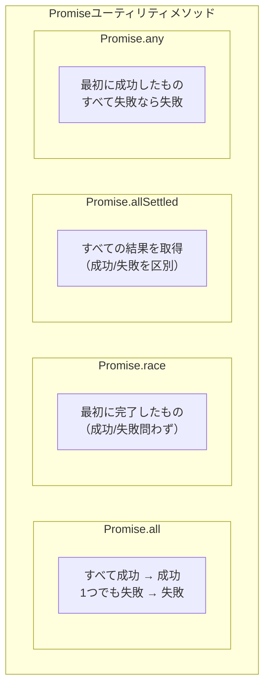

### async/await の登場

ES2017でasync/awaitが導入され、非同期コードを同期的なスタイルで書けるようになりました。

```javascript
// async/await スタイル
async function processOrder(userId) {
    try {
        const user = await getUser(userId);
        const orders = await getOrders(user.id);
        const details = await getOrderDetails(orders[0].id);
        const shipping = await getShippingInfo(details.shippingId);
        
        displayResult(shipping);
    } catch (error) {
        handleError(error);
    }
}

processOrder(123);
```

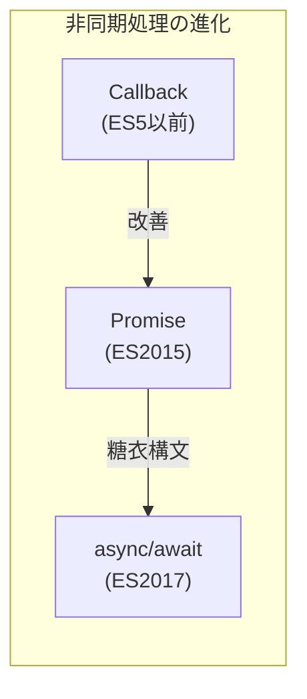

### async/await の仕組み

`async`関数は常にPromiseを返します。`await`はPromiseの解決を待ちます。

```javascript
// async 関数は常に Promise を返す
async function hello() {
    return "Hello";
}

console.log(hello());  // Promise { "Hello" }

hello().then(msg => console.log(msg));  // "Hello"

// await は Promise を解決する
async function example() {
    const result = await Promise.resolve(42);
    console.log(result);  // 42
    
    // await なしだと Promise オブジェクトが返る
    const promise = Promise.resolve(100);
    console.log(promise);  // Promise { 100 }
}
```

### 並列実行 vs 順次実行

```javascript
// 順次実行（遅い）
async function sequential() {
    const start = Date.now();
    
    const a = await fetchData('/api/a');  // 1秒
    const b = await fetchData('/api/b');  // 1秒
    const c = await fetchData('/api/c');  // 1秒
    
    console.log(`完了: ${Date.now() - start}ms`);  // 約3000ms
}

// 並列実行（速い）
async function parallel() {
    const start = Date.now();
    
    const [a, b, c] = await Promise.all([
        fetchData('/api/a'),  // 1秒
        fetchData('/api/b'),  // 1秒
        fetchData('/api/c'),  // 1秒
    ]);
    
    console.log(`完了: ${Date.now() - start}ms`);  // 約1000ms
}
```

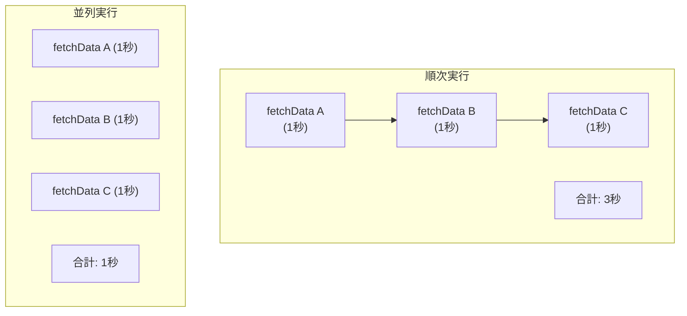

### エラーハンドリング

```javascript
// try-catch でエラーハンドリング
async function fetchWithErrorHandling() {
    try {
        const response = await fetch('/api/data');
        if (!response.ok) {
            throw new Error(`HTTP error: ${response.status}`);
        }
        const data = await response.json();
        return data;
    } catch (error) {
        console.error('Error:', error.message);
        throw error;  // 再スロー
    } finally {
        console.log('完了（成功/失敗問わず）');
    }
}

// 個別のエラーハンドリング
async function fetchMultiple() {
    const results = await Promise.allSettled([
        fetch('/api/a').then(r => r.json()),
        fetch('/api/b').then(r => r.json()),
        fetch('/api/c').then(r => r.json()),
    ]);
    
    const successful = results
        .filter(r => r.status === 'fulfilled')
        .map(r => r.value);
    
    const failed = results
        .filter(r => r.status === 'rejected')
        .map(r => r.reason);
    
    return { successful, failed };
}
```

### Top-level await

ES2022から、モジュールのトップレベルで`await`が使えるようになりました。

```javascript
// ES2022: Top-level await (ESモジュールで使用可能)
// config.mjs
const response = await fetch('/api/config');
export const config = await response.json();

// main.mjs
import { config } from './config.mjs';
console.log(config);  // 設定がロード済み
```

---

## 11.5 Web Workers と Worker Threads

### Web Workers（ブラウザ）

**Web Workers**は、メインスレッドとは別のスレッドでJavaScriptを実行する仕組みです。重い計算処理をオフロードして、UIの応答性を維持できます。

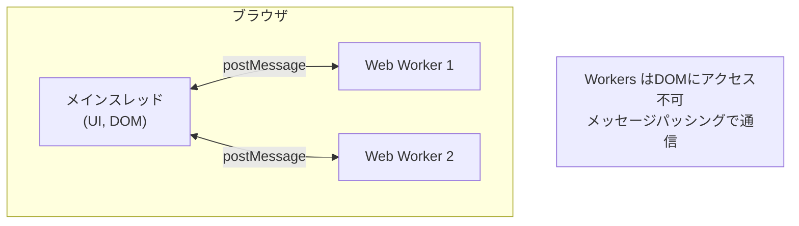

```javascript
// main.js
const worker = new Worker('worker.js');

// Workerにメッセージを送信
worker.postMessage({ type: 'calculate', data: [1, 2, 3, 4, 5] });

// Workerからのメッセージを受信
worker.onmessage = (event) => {
    console.log('Result:', event.data);
};

worker.onerror = (error) => {
    console.error('Worker error:', error);
};

// worker.js
self.onmessage = (event) => {
    const { type, data } = event.data;
    
    if (type === 'calculate') {
        // 重い計算処理
        const result = data.reduce((sum, n) => sum + n, 0);
        
        // 結果を送信
        self.postMessage(result);
    }
};
```

### Shared Workers

複数のタブ/ウィンドウ間で共有できるWorkerです。

```javascript
// main.js (複数のページで使用)
const sharedWorker = new SharedWorker('shared-worker.js');

sharedWorker.port.onmessage = (event) => {
    console.log('Received:', event.data);
};

sharedWorker.port.postMessage('Hello from page');

// shared-worker.js
const connections = [];

self.onconnect = (event) => {
    const port = event.ports[0];
    connections.push(port);
    
    port.onmessage = (e) => {
        // すべての接続に通知
        connections.forEach(p => {
            p.postMessage(`Broadcast: ${e.data}`);
        });
    };
    
    port.start();
};
```

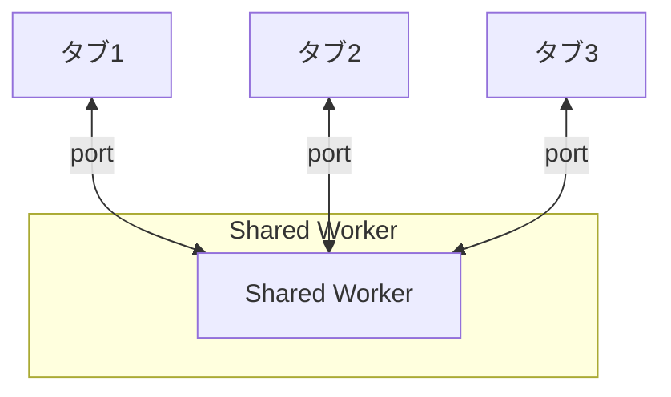

### Service Workers

Service Workersは、ネットワークリクエストをインターセプトし、オフライン対応やキャッシュ戦略を実装できます。

```javascript
// sw.js (Service Worker)
self.addEventListener('install', (event) => {
    event.waitUntil(
        caches.open('v1').then((cache) => {
            return cache.addAll([
                '/',
                '/index.html',
                '/styles.css',
                '/app.js'
            ]);
        })
    );
});

self.addEventListener('fetch', (event) => {
    event.respondWith(
        caches.match(event.request).then((response) => {
            // キャッシュがあればキャッシュを返す
            if (response) {
                return response;
            }
            // なければネットワークから取得
            return fetch(event.request);
        })
    );
});

// main.js (登録)
if ('serviceWorker' in navigator) {
    navigator.serviceWorker.register('/sw.js')
        .then(registration => {
            console.log('SW registered:', registration);
        })
        .catch(error => {
            console.error('SW registration failed:', error);
        });
}
```

### Worker Threads（Node.js）

Node.jsでは、`worker_threads`モジュールを使ってマルチスレッド処理ができます。

```javascript
// main.js
const { Worker, isMainThread, parentPort, workerData } = require('worker_threads');

if (isMainThread) {
    // メインスレッド
    const worker = new Worker(__filename, {
        workerData: { numbers: [1, 2, 3, 4, 5] }
    });
    
    worker.on('message', (result) => {
        console.log('Result:', result);
    });
    
    worker.on('error', (error) => {
        console.error('Error:', error);
    });
    
    worker.on('exit', (code) => {
        console.log('Worker exited with code:', code);
    });
} else {
    // ワーカースレッド
    const { numbers } = workerData;
    const sum = numbers.reduce((a, b) => a + b, 0);
    
    parentPort.postMessage(sum);
}
```

### SharedArrayBuffer

スレッド間でメモリを共有する方法です。

```javascript
const { Worker } = require('worker_threads');

// 共有メモリを作成
const sharedBuffer = new SharedArrayBuffer(4);  // 4バイト
const sharedArray = new Int32Array(sharedBuffer);

sharedArray[0] = 0;

const worker = new Worker(`
    const { parentPort, workerData } = require('worker_threads');
    const sharedArray = new Int32Array(workerData.sharedBuffer);
    
    // Atomics で安全にインクリメント
    for (let i = 0; i < 1000; i++) {
        Atomics.add(sharedArray, 0, 1);
    }
    
    parentPort.postMessage('done');
`, {
    eval: true,
    workerData: { sharedBuffer }
});

worker.on('message', () => {
    console.log('Final value:', sharedArray[0]);  // 1000
});
```

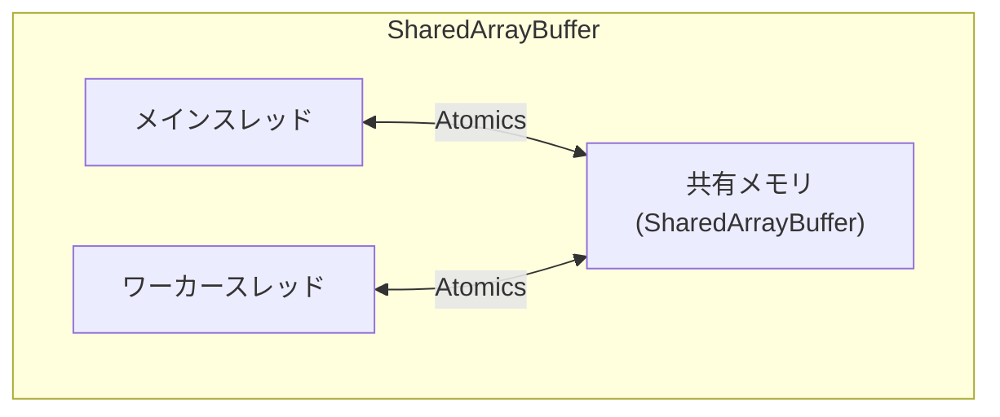

### Worker の使い分け

```mermaid
flowchart TB
    subgraph WORKER_TYPES["Workerの種類と用途"]
        subgraph WW["Web Worker"]
            WW_USE["・重い計算処理<br/>・データ処理<br/>・画像処理"]
        end
        
        subgraph SW["Shared Worker"]
            SW_USE["・タブ間の状態共有<br/>・WebSocket接続の共有"]
        end
        
        subgraph SVC["Service Worker"]
            SVC_USE["・オフライン対応<br/>・キャッシュ戦略<br/>・プッシュ通知"]
        end
        
        subgraph WT["Worker Threads"]
            WT_USE["・Node.js の<br/>  CPU集約処理<br/>・並列データ処理"]
        end
    end
```

---

## 11.6 TypeScriptでの非同期処理

### 型付きPromise

TypeScriptでは、Promiseに型パラメータを指定できます。

```typescript
// 型付き Promise
function fetchUser(id: number): Promise<User> {
    return fetch(`/api/users/${id}`)
        .then(response => response.json());
}

interface User {
    id: number;
    name: string;
    email: string;
}

// async/await との組み合わせ
async function getUser(id: number): Promise<User> {
    const response = await fetch(`/api/users/${id}`);
    const user: User = await response.json();
    return user;
}
```

### ジェネリクスを使った非同期関数

```typescript
// ジェネリックな非同期関数
async function fetchData<T>(url: string): Promise<T> {
    const response = await fetch(url);
    if (!response.ok) {
        throw new Error(`HTTP error: ${response.status}`);
    }
    return response.json();
}

// 使用例
interface Product {
    id: number;
    name: string;
    price: number;
}

const product = await fetchData<Product>('/api/products/1');
console.log(product.name);  // 型安全
```

### 型ガードとエラーハンドリング

```typescript
// Result型パターン
type Result<T, E = Error> = 
    | { success: true; data: T }
    | { success: false; error: E };

async function safeFetch<T>(url: string): Promise<Result<T>> {
    try {
        const response = await fetch(url);
        if (!response.ok) {
            return { 
                success: false, 
                error: new Error(`HTTP ${response.status}`) 
            };
        }
        const data: T = await response.json();
        return { success: true, data };
    } catch (error) {
        return { 
            success: false, 
            error: error instanceof Error ? error : new Error(String(error))
        };
    }
}

// 使用例
const result = await safeFetch<User>('/api/user/1');
if (result.success) {
    console.log(result.data.name);  // 型安全
} else {
    console.error(result.error.message);
}
```

### Promiseのユーティリティ型

```typescript
// Awaited<T>: Promise の解決値の型を取得
type A = Awaited<Promise<string>>;  // string
type B = Awaited<Promise<Promise<number>>>;  // number

// 関数の戻り値の型からPromiseの中身を取得
async function getUsers(): Promise<User[]> {
    return fetch('/api/users').then(r => r.json());
}

type UsersResult = Awaited<ReturnType<typeof getUsers>>;  // User[]
```

---

## 11.7 まとめ

この章では、JavaScriptの非同期処理について詳しく学びました。

```mermaid
mindmap
    root((第11章のまとめ))
        シングルスレッド
            メインスレッド1つ
            ブロッキングの問題
            非同期で解決
        イベントループ
            コールスタック
            タスクキュー
            マイクロタスク優先
        非同期の進化
            Callback
            Promise
            async/await
        Workers
            Web Worker
            Shared Worker
            Service Worker
            Worker Threads
```

### 重要なポイント

#### 1. JavaScriptはシングルスレッドだが、非同期処理で並行性を実現

JavaScriptのメインスレッドは1つですが、イベントループと非同期APIにより、ブロッキングを回避しながら複数の処理を効率的に行えます。重い計算はWorkerにオフロードできます。

#### 2. イベントループがマイクロタスクとマクロタスクを管理

マイクロタスク（Promise.then等）はマクロタスク（setTimeout等）より優先されます。この順序を理解することで、コードの実行順序を正確に予測できます。

#### 3. Callback → Promise → async/await への進化

非同期処理の書き方は進化してきました。async/awaitにより、非同期コードを同期的なスタイルで書けるようになり、可読性と保守性が大幅に向上しました。

#### 4. Workersでマルチスレッド処理が可能

Web Workers、Shared Workers、Service Workers、Worker Threads（Node.js）を使えば、メインスレッドをブロックせずに重い処理を実行できます。

---

## 📝 練習問題

1. **以下のコードの出力順序を予測し、なぜそうなるか説明してください。**

   ```javascript
   console.log('1');
   
   setTimeout(() => console.log('2'), 0);
   
   Promise.resolve()
       .then(() => console.log('3'))
       .then(() => console.log('4'));
   
   console.log('5');
   ```
   
   ヒント：マイクロタスクとマクロタスクの優先順位を考えてください。

2. **以下のコードを、コールバックスタイル、Promiseチェーン、async/awaitの3つの方法で書いてください。**
   
   処理内容：ユーザー情報を取得 → そのユーザーの注文一覧を取得 → 最初の注文の詳細を表示

3. **Promise.all、Promise.race、Promise.allSettled、Promise.anyの違いを説明し、それぞれが適したユースケースを挙げてください。**

4. **以下の非同期処理を、順次実行と並列実行の両方で実装してください。**

   ```javascript
   async function fetchA() { /* 1秒かかる */ }
   async function fetchB() { /* 2秒かかる */ }
   async function fetchC() { /* 1秒かかる */ }
   ```
   
   それぞれの実行時間の違いを説明してください。

5. **Web Workerを使って、メインスレッドをブロックせずに1から1億までの合計を計算するコードを書いてください。**
   
   ヒント：main.jsとworker.jsの2つのファイルが必要です。

---

## 🔗 次の章へ

[第12章: Python](./12-python.md) では、PythonのGIL、threading、multiprocessing、asyncioについて詳しく学びます。

---

[← 目次に戻る](../index.md) | [← 前章: 高度な並行処理モデル](./10-advanced-models.md)

