# 第12章: Python

> 🎯 **この章の目標**: PythonのGIL（Global Interpreter Lock）を理解し、threading、multiprocessing、asyncioの使い分けを学ぶ

---

## 12.1 PythonのGIL（Global Interpreter Lock）

### GILとは

**GIL（Global Interpreter Lock）**は、CPython（最も一般的なPython実装）に存在するミューテックスで、一度に1つのスレッドだけがPythonバイトコードを実行できるように制限します。

```mermaid
flowchart TB
    subgraph GIL_CONCEPT["GILの概念"]
        GIL["GIL<br/>(Global Interpreter Lock)"]
        
        T1["スレッド1"]
        T2["スレッド2"]
        T3["スレッド3"]
        
        INTERPRETER["Pythonインタプリタ"]
    end
    
    T1 -->|"GIL取得"| GIL
    T2 -.->|"待機"| GIL
    T3 -.->|"待機"| GIL
    
    GIL --> INTERPRETER
    
    NOTE["同時に実行できるのは<br/>1つのスレッドだけ"]
```

### なぜGILが存在するのか

GILは以下の理由で導入されました：

```mermaid
flowchart TB
    subgraph GIL_REASONS["GILが存在する理由"]
        R1["メモリ管理の簡素化<br/>参照カウントの<br/>スレッドセーフ性"]
        R2["C拡張の互換性<br/>C言語で書かれた<br/>ライブラリとの統合"]
        R3["シングルスレッド性能<br/>ロックのオーバーヘッド<br/>を最小化"]
    end
```

```python
# 参照カウントの例
import sys

a = []
b = a  # 参照カウントが増加

print(sys.getrefcount(a))  # 3 (a, b, getrefcount引数)

# GILがないと、複数スレッドが同時に参照カウントを
# 変更しようとして、データ競合が発生する可能性がある
```

### GILの影響

```mermaid
flowchart TB
    subgraph GIL_IMPACT["GILの影響"]
        subgraph CPU_BOUND["CPUバウンド処理"]
            CPU1["マルチスレッドでも<br/>並列実行されない"]
            CPU2["1コアしか使えない"]
            CPU3["multiprocessingを<br/>使うべき"]
        end
        
        subgraph IO_BOUND["I/Oバウンド処理"]
            IO1["I/O待ち中は<br/>GILを解放"]
            IO2["他のスレッドが<br/>実行可能"]
            IO3["threadingで<br/>効果あり"]
        end
    end
```

### CPUバウンド処理での検証

```python
import threading
import time

def cpu_bound_task(n):
    """CPUバウンドな処理"""
    count = 0
    for i in range(n):
        count += i
    return count

# シングルスレッド
def single_thread():
    start = time.time()
    cpu_bound_task(50_000_000)
    cpu_bound_task(50_000_000)
    print(f"シングルスレッド: {time.time() - start:.2f}秒")

# マルチスレッド
def multi_thread():
    start = time.time()
    t1 = threading.Thread(target=cpu_bound_task, args=(50_000_000,))
    t2 = threading.Thread(target=cpu_bound_task, args=(50_000_000,))
    
    t1.start()
    t2.start()
    t1.join()
    t2.join()
    
    print(f"マルチスレッド: {time.time() - start:.2f}秒")

single_thread()  # 約 3.5秒
multi_thread()   # 約 3.5秒 ← GILのため速くならない！
```

```mermaid
sequenceDiagram
    participant T1 as スレッド1
    participant GIL as GIL
    participant T2 as スレッド2
    
    Note over T1,T2: CPUバウンド処理
    
    T1->>GIL: GIL取得
    T1->>T1: 計算処理
    Note over T2: 待機...
    T1->>GIL: GIL解放
    
    T2->>GIL: GIL取得
    T2->>T2: 計算処理
    Note over T1: 待機...
    T2->>GIL: GIL解放
    
    Note over T1,T2: 交互に実行されるため<br/>並列化の恩恵なし
```

### I/Oバウンド処理での検証

```python
import threading
import time
import urllib.request

def io_bound_task(url):
    """I/Oバウンドな処理"""
    with urllib.request.urlopen(url) as response:
        return response.read()

urls = [
    "https://example.com",
    "https://example.org",
    "https://example.net",
]

# シングルスレッド
def single_thread():
    start = time.time()
    for url in urls:
        io_bound_task(url)
    print(f"シングルスレッド: {time.time() - start:.2f}秒")

# マルチスレッド
def multi_thread():
    start = time.time()
    threads = [threading.Thread(target=io_bound_task, args=(url,)) 
               for url in urls]
    
    for t in threads:
        t.start()
    for t in threads:
        t.join()
    
    print(f"マルチスレッド: {time.time() - start:.2f}秒")

single_thread()  # 約 1.5秒
multi_thread()   # 約 0.5秒 ← I/O待ち中はGILを解放するため速くなる！
```

```mermaid
sequenceDiagram
    participant T1 as スレッド1
    participant GIL as GIL
    participant T2 as スレッド2
    participant IO as I/Oシステム
    
    Note over T1,T2: I/Oバウンド処理
    
    T1->>GIL: GIL取得
    T1->>IO: I/O開始
    T1->>GIL: GIL解放（I/O待ち）
    
    T2->>GIL: GIL取得
    T2->>IO: I/O開始
    T2->>GIL: GIL解放（I/O待ち）
    
    IO-->>T1: I/O完了
    T1->>GIL: GIL取得
    T1->>T1: 結果処理
    
    IO-->>T2: I/O完了
    T2->>GIL: GIL取得
    T2->>T2: 結果処理
    
    Note over T1,T2: I/O待ち中は並行実行可能
```

---

## 12.2 threading モジュール

### 基本的な使い方

```python
import threading
import time

def worker(name, delay):
    print(f"{name}: 開始")
    time.sleep(delay)
    print(f"{name}: 終了")

# スレッドの作成と実行
t1 = threading.Thread(target=worker, args=("Thread-1", 2))
t2 = threading.Thread(target=worker, args=("Thread-2", 1))

t1.start()
t2.start()

# スレッドの完了を待つ
t1.join()
t2.join()

print("すべて完了")
```

### Threadクラスの継承

```python
import threading
import time

class MyThread(threading.Thread):
    def __init__(self, name, delay):
        super().__init__()
        self.name = name
        self.delay = delay
        self.result = None
    
    def run(self):
        """スレッドで実行される処理"""
        print(f"{self.name}: 開始")
        time.sleep(self.delay)
        self.result = f"{self.name}の結果"
        print(f"{self.name}: 終了")

# 使用例
thread = MyThread("Worker", 2)
thread.start()
thread.join()
print(f"結果: {thread.result}")
```

### 同期プリミティブ

```mermaid
flowchart TB
    subgraph SYNC_PRIMITIVES["同期プリミティブ"]
        LOCK["Lock<br/>排他制御"]
        RLOCK["RLock<br/>再入可能ロック"]
        SEMAPHORE["Semaphore<br/>同時アクセス数制限"]
        EVENT["Event<br/>イベント通知"]
        CONDITION["Condition<br/>条件変数"]
        BARRIER["Barrier<br/>同期ポイント"]
    end
```

### Lock（ロック）

```python
import threading

counter = 0
lock = threading.Lock()

def increment():
    global counter
    for _ in range(100000):
        with lock:  # ロックを取得
            counter += 1  # クリティカルセクション
        # ロックは自動的に解放

threads = [threading.Thread(target=increment) for _ in range(10)]
for t in threads:
    t.start()
for t in threads:
    t.join()

print(f"Counter: {counter}")  # 1000000（正確な値）
```

### Semaphore（セマフォ）

```python
import threading
import time

# 同時に3つまでアクセス可能
semaphore = threading.Semaphore(3)

def access_resource(name):
    print(f"{name}: 待機中...")
    with semaphore:
        print(f"{name}: リソースにアクセス中")
        time.sleep(2)
        print(f"{name}: アクセス終了")

threads = [threading.Thread(target=access_resource, args=(f"Thread-{i}",)) 
           for i in range(10)]

for t in threads:
    t.start()
for t in threads:
    t.join()
```

```mermaid
sequenceDiagram
    participant T1 as Thread-1
    participant T2 as Thread-2
    participant T3 as Thread-3
    participant T4 as Thread-4
    participant SEM as Semaphore(3)
    
    T1->>SEM: acquire (count: 2)
    T2->>SEM: acquire (count: 1)
    T3->>SEM: acquire (count: 0)
    T4->>SEM: acquire (待機)
    
    Note over T1,T3: 3つが同時にアクセス
    
    T1->>SEM: release (count: 1)
    SEM->>T4: acquire成功 (count: 0)
```

### Event（イベント）

```python
import threading
import time

event = threading.Event()

def waiter(name):
    print(f"{name}: イベントを待機中...")
    event.wait()  # イベントがセットされるまでブロック
    print(f"{name}: イベント受信！")

def setter():
    print("セッター: 3秒後にイベントをセット")
    time.sleep(3)
    event.set()  # すべての待機スレッドに通知
    print("セッター: イベントをセット完了")

threads = [threading.Thread(target=waiter, args=(f"Waiter-{i}",)) 
           for i in range(3)]
setter_thread = threading.Thread(target=setter)

for t in threads:
    t.start()
setter_thread.start()

for t in threads:
    t.join()
setter_thread.join()
```

### スレッドプール（concurrent.futures）

```python
from concurrent.futures import ThreadPoolExecutor, as_completed
import time

def task(n):
    time.sleep(1)
    return n * n

# ThreadPoolExecutorを使用
with ThreadPoolExecutor(max_workers=4) as executor:
    # submit: 個別にタスクを投入
    futures = [executor.submit(task, i) for i in range(10)]
    
    # as_completed: 完了順に結果を取得
    for future in as_completed(futures):
        result = future.result()
        print(f"Result: {result}")

# map: 一括でタスクを投入
with ThreadPoolExecutor(max_workers=4) as executor:
    results = executor.map(task, range(10))
    for result in results:
        print(f"Result: {result}")
```

```mermaid
flowchart TB
    subgraph THREAD_POOL["ThreadPoolExecutor"]
        QUEUE["タスクキュー"]
        
        W1["Worker 1"]
        W2["Worker 2"]
        W3["Worker 3"]
        W4["Worker 4"]
        
        RESULTS["結果"]
    end
    
    TASKS["タスク"] --> QUEUE
    
    QUEUE --> W1
    QUEUE --> W2
    QUEUE --> W3
    QUEUE --> W4
    
    W1 --> RESULTS
    W2 --> RESULTS
    W3 --> RESULTS
    W4 --> RESULTS
```

---

## 12.3 multiprocessing モジュール

### なぜmultiprocessingか

GILはプロセスごとに存在するため、マルチプロセスならCPUバウンド処理も並列実行できます。

```mermaid
flowchart TB
    subgraph MULTI_PROCESS["マルチプロセス"]
        subgraph PROC1["プロセス1"]
            GIL1["GIL"]
            P1_THREAD["スレッド"]
        end
        
        subgraph PROC2["プロセス2"]
            GIL2["GIL"]
            P2_THREAD["スレッド"]
        end
        
        subgraph PROC3["プロセス3"]
            GIL3["GIL"]
            P3_THREAD["スレッド"]
        end
    end
    
    NOTE["各プロセスに独立したGIL<br/>→ 真の並列実行が可能"]
```

### 基本的な使い方

```python
import multiprocessing
import time
import os

def cpu_bound_task(n):
    """CPUバウンドな処理"""
    print(f"プロセス {os.getpid()}: 開始")
    count = 0
    for i in range(n):
        count += i
    print(f"プロセス {os.getpid()}: 終了")
    return count

if __name__ == "__main__":
    start = time.time()
    
    # プロセスの作成
    p1 = multiprocessing.Process(target=cpu_bound_task, args=(50_000_000,))
    p2 = multiprocessing.Process(target=cpu_bound_task, args=(50_000_000,))
    
    p1.start()
    p2.start()
    
    p1.join()
    p2.join()
    
    print(f"マルチプロセス: {time.time() - start:.2f}秒")
    # 約 1.8秒（シングルスレッドの約半分）
```

### プロセス間通信（IPC）

```mermaid
flowchart TB
    subgraph IPC["プロセス間通信"]
        QUEUE["Queue<br/>FIFO キュー"]
        PIPE["Pipe<br/>双方向パイプ"]
        VALUE["Value/Array<br/>共有メモリ"]
        MANAGER["Manager<br/>共有オブジェクト"]
    end
```

### Queue（キュー）

```python
import multiprocessing

def producer(queue):
    for i in range(5):
        queue.put(f"item-{i}")
        print(f"Produced: item-{i}")

def consumer(queue):
    while True:
        item = queue.get()
        if item is None:
            break
        print(f"Consumed: {item}")

if __name__ == "__main__":
    queue = multiprocessing.Queue()
    
    prod = multiprocessing.Process(target=producer, args=(queue,))
    cons = multiprocessing.Process(target=consumer, args=(queue,))
    
    prod.start()
    cons.start()
    
    prod.join()
    queue.put(None)  # 終了シグナル
    cons.join()
```

### 共有メモリ（Value, Array）

```python
import multiprocessing

def increment(counter, lock):
    for _ in range(100000):
        with lock:
            counter.value += 1

if __name__ == "__main__":
    counter = multiprocessing.Value('i', 0)  # 'i' = integer
    lock = multiprocessing.Lock()
    
    processes = [
        multiprocessing.Process(target=increment, args=(counter, lock))
        for _ in range(4)
    ]
    
    for p in processes:
        p.start()
    for p in processes:
        p.join()
    
    print(f"Counter: {counter.value}")  # 400000
```

### プロセスプール

```python
from multiprocessing import Pool
import time

def cpu_task(x):
    """CPUバウンドなタスク"""
    result = 0
    for i in range(10_000_000):
        result += i * x
    return result

if __name__ == "__main__":
    # CPUコア数のプール
    with Pool() as pool:
        start = time.time()
        
        # map: 一括でタスクを実行
        results = pool.map(cpu_task, range(8))
        
        print(f"Results: {results}")
        print(f"Time: {time.time() - start:.2f}秒")
    
    # 他のメソッド
    with Pool(4) as pool:
        # apply_async: 非同期で単一タスク
        result = pool.apply_async(cpu_task, (5,))
        print(result.get())
        
        # starmap: 複数引数のmap
        results = pool.starmap(pow, [(2, 10), (3, 5), (4, 3)])
        print(results)  # [1024, 243, 64]
```

### ProcessPoolExecutor

```python
from concurrent.futures import ProcessPoolExecutor, as_completed
import time

def cpu_task(n):
    result = sum(i * i for i in range(n))
    return result

if __name__ == "__main__":
    with ProcessPoolExecutor(max_workers=4) as executor:
        futures = [executor.submit(cpu_task, 1_000_000) for _ in range(8)]
        
        for future in as_completed(futures):
            result = future.result()
            print(f"Result: {result}")
```

---

## 12.4 asyncio モジュール

### asyncioとは

**asyncio**は、Pythonの非同期I/Oフレームワークです。シングルスレッドでイベントループを使い、コルーチンを協調的にスケジューリングします。

```mermaid
flowchart TB
    subgraph ASYNCIO["asyncio の構造"]
        EVENT_LOOP["イベントループ"]
        
        CORO1["コルーチン1"]
        CORO2["コルーチン2"]
        CORO3["コルーチン3"]
        
        IO["I/Oオペレーション"]
    end
    
    EVENT_LOOP --> CORO1
    EVENT_LOOP --> CORO2
    EVENT_LOOP --> CORO3
    
    CORO1 <-->|"await"| IO
    CORO2 <-->|"await"| IO
    CORO3 <-->|"await"| IO
```

### 基本的な使い方

```python
import asyncio

async def hello(name, delay):
    print(f"{name}: 開始")
    await asyncio.sleep(delay)  # 非同期の待機
    print(f"{name}: 終了")
    return f"{name}の結果"

async def main():
    # 順次実行
    result1 = await hello("Task1", 2)
    result2 = await hello("Task2", 1)
    print(f"順次実行: {result1}, {result2}")
    
    # 並行実行
    results = await asyncio.gather(
        hello("TaskA", 2),
        hello("TaskB", 1),
        hello("TaskC", 3),
    )
    print(f"並行実行: {results}")

# イベントループを実行
asyncio.run(main())
```

### コルーチン、タスク、Future

```mermaid
flowchart TB
    subgraph ASYNC_OBJECTS["asyncio のオブジェクト"]
        COROUTINE["Coroutine<br/>async def で定義<br/>呼び出すとコルーチンオブジェクト"]
        TASK["Task<br/>スケジュールされた<br/>コルーチン"]
        FUTURE["Future<br/>非同期操作の<br/>結果を表す"]
    end
    
    COROUTINE -->|"create_task()"| TASK
    TASK -->|"継承"| FUTURE
```

```python
import asyncio

async def my_coroutine():
    await asyncio.sleep(1)
    return "結果"

async def main():
    # コルーチンオブジェクト（まだ実行されていない）
    coro = my_coroutine()
    print(type(coro))  # <class 'coroutine'>
    
    # タスクとしてスケジュール
    task = asyncio.create_task(my_coroutine())
    print(type(task))  # <class '_asyncio.Task'>
    
    # タスクの完了を待つ
    result = await task
    print(result)
    
    # Futureの直接使用
    future = asyncio.Future()
    future.set_result("Future結果")
    result = await future
    print(result)

asyncio.run(main())
```

### イベントループ

```python
import asyncio

async def task(name):
    print(f"{name}: 開始")
    await asyncio.sleep(1)
    print(f"{name}: 終了")

# 方法1: asyncio.run() （推奨）
asyncio.run(task("main"))

# 方法2: イベントループを直接操作
loop = asyncio.new_event_loop()
asyncio.set_event_loop(loop)
try:
    loop.run_until_complete(task("manual"))
finally:
    loop.close()

# 方法3: 既存のイベントループを取得
async def main():
    loop = asyncio.get_running_loop()
    print(f"Loop: {loop}")
    await task("inside")

asyncio.run(main())
```

### タスクの管理

```python
import asyncio

async def long_task(name, duration):
    try:
        print(f"{name}: 開始")
        await asyncio.sleep(duration)
        print(f"{name}: 完了")
        return f"{name}の結果"
    except asyncio.CancelledError:
        print(f"{name}: キャンセルされました")
        raise

async def main():
    # タスクを作成
    task1 = asyncio.create_task(long_task("Task1", 5))
    task2 = asyncio.create_task(long_task("Task2", 3))
    
    # 2秒後にTask1をキャンセル
    await asyncio.sleep(2)
    task1.cancel()
    
    # 結果を収集（エラーも含む）
    results = await asyncio.gather(
        task1, task2,
        return_exceptions=True  # 例外を結果として返す
    )
    
    for result in results:
        if isinstance(result, asyncio.CancelledError):
            print("タスクがキャンセルされました")
        else:
            print(f"結果: {result}")

asyncio.run(main())
```

### タイムアウト

```python
import asyncio

async def slow_task():
    await asyncio.sleep(10)
    return "完了"

async def main():
    try:
        # タイムアウト付きで実行
        result = await asyncio.wait_for(slow_task(), timeout=3.0)
        print(result)
    except asyncio.TimeoutError:
        print("タイムアウトしました")
    
    # Python 3.11+: TaskGroup
    async with asyncio.TaskGroup() as tg:
        task1 = tg.create_task(asyncio.sleep(1))
        task2 = tg.create_task(asyncio.sleep(2))
    # すべてのタスクが完了するまで待機

asyncio.run(main())
```

### 非同期イテレータとジェネレータ

```python
import asyncio

# 非同期ジェネレータ
async def async_generator(n):
    for i in range(n):
        await asyncio.sleep(0.5)
        yield i

# 非同期イテレータ
class AsyncCounter:
    def __init__(self, n):
        self.n = n
        self.i = 0
    
    def __aiter__(self):
        return self
    
    async def __anext__(self):
        if self.i >= self.n:
            raise StopAsyncIteration
        await asyncio.sleep(0.5)
        result = self.i
        self.i += 1
        return result

async def main():
    # async for で使用
    async for value in async_generator(5):
        print(f"Generator: {value}")
    
    async for value in AsyncCounter(3):
        print(f"Counter: {value}")

asyncio.run(main())
```

### 非同期コンテキストマネージャ

```python
import asyncio

class AsyncResource:
    async def __aenter__(self):
        print("リソースを取得中...")
        await asyncio.sleep(1)
        print("リソース取得完了")
        return self
    
    async def __aexit__(self, exc_type, exc_val, exc_tb):
        print("リソースを解放中...")
        await asyncio.sleep(0.5)
        print("リソース解放完了")
    
    async def do_something(self):
        print("リソースを使用中")
        await asyncio.sleep(1)

async def main():
    async with AsyncResource() as resource:
        await resource.do_something()

asyncio.run(main())
```

---

## 12.5 asyncioによるネットワーク処理

### TCPクライアント

```python
import asyncio

async def tcp_client():
    reader, writer = await asyncio.open_connection('example.com', 80)
    
    # リクエスト送信
    request = b"GET / HTTP/1.1\r\nHost: example.com\r\n\r\n"
    writer.write(request)
    await writer.drain()
    
    # レスポンス受信
    response = await reader.read(1000)
    print(f"Response: {response[:100]}...")
    
    # 接続を閉じる
    writer.close()
    await writer.wait_closed()

asyncio.run(tcp_client())
```

### TCPサーバー

```python
import asyncio

async def handle_client(reader, writer):
    addr = writer.get_extra_info('peername')
    print(f"接続: {addr}")
    
    while True:
        data = await reader.read(1024)
        if not data:
            break
        
        message = data.decode()
        print(f"受信 from {addr}: {message}")
        
        # エコーバック
        writer.write(data)
        await writer.drain()
    
    print(f"切断: {addr}")
    writer.close()
    await writer.wait_closed()

async def main():
    server = await asyncio.start_server(
        handle_client, 
        'localhost', 
        8888
    )
    
    addr = server.sockets[0].getsockname()
    print(f"サーバー起動: {addr}")
    
    async with server:
        await server.serve_forever()

asyncio.run(main())
```

```mermaid
sequenceDiagram
    participant Client1 as クライアント1
    participant Server as サーバー
    participant Client2 as クライアント2
    
    Client1->>Server: 接続
    Server->>Server: handle_client開始
    
    Client2->>Server: 接続
    Server->>Server: handle_client開始
    
    Client1->>Server: データ送信
    Server->>Client1: エコー返信
    
    Client2->>Server: データ送信
    Server->>Client2: エコー返信
    
    Note over Server: 両方の接続を<br/>並行して処理
```

### aiohttpによるHTTPクライアント

```python
import asyncio
import aiohttp

async def fetch(session, url):
    async with session.get(url) as response:
        return await response.text()

async def main():
    urls = [
        "https://example.com",
        "https://example.org",
        "https://example.net",
    ]
    
    async with aiohttp.ClientSession() as session:
        # 並行してリクエスト
        tasks = [fetch(session, url) for url in urls]
        results = await asyncio.gather(*tasks)
        
        for url, result in zip(urls, results):
            print(f"{url}: {len(result)} bytes")

asyncio.run(main())
```

---

## 12.6 threading vs multiprocessing vs asyncio

### 比較表

| 特性 | threading | multiprocessing | asyncio |
|------|-----------|-----------------|---------|
| 並行性 | 並行（GIL制限あり） | 並列 | 並行 |
| メモリ | 共有 | 独立 | 共有 |
| オーバーヘッド | 低 | 高 | 最小 |
| CPUバウンド | × | ○ | × |
| I/Oバウンド | ○ | ○ | ○ |
| 複雑さ | 中 | 高 | 中 |

```mermaid
flowchart TB
    subgraph COMPARISON["使い分け"]
        START["処理の種類は？"]
        
        START --> CPU{"CPUバウンド？"}
        CPU -->|"Yes"| MP["multiprocessing<br/>真の並列実行"]
        
        CPU -->|"No"| IO{"I/Oバウンド？"}
        IO -->|"Yes"| MANY{"接続数は？"}
        
        MANY -->|"少ない"| THREADING["threading<br/>シンプルに実装"]
        MANY -->|"多い"| ASYNCIO["asyncio<br/>効率的に処理"]
    end
```

### ユースケース別の選択

```mermaid
flowchart TB
    subgraph USE_CASES["ユースケース別の選択"]
        subgraph MP_USE["multiprocessing"]
            MP1["画像/動画処理"]
            MP2["データ分析"]
            MP3["機械学習"]
            MP4["暗号化/ハッシュ"]
        end
        
        subgraph TH_USE["threading"]
            TH1["GUIアプリ"]
            TH2["ファイルI/O"]
            TH3["少数のDB接続"]
            TH4["レガシーコード"]
        end
        
        subgraph AS_USE["asyncio"]
            AS1["Webスクレイピング"]
            AS2["APIサーバー"]
            AS3["チャットサーバー"]
            AS4["大量のHTTPリクエスト"]
        end
    end
```

### 組み合わせ使用

```python
import asyncio
from concurrent.futures import ProcessPoolExecutor, ThreadPoolExecutor

def cpu_bound_sync(n):
    """CPUバウンドな同期関数"""
    return sum(i * i for i in range(n))

def io_bound_sync(url):
    """I/Oバウンドな同期関数（ブロッキング）"""
    import urllib.request
    with urllib.request.urlopen(url) as response:
        return len(response.read())

async def main():
    loop = asyncio.get_running_loop()
    
    # CPUバウンドタスクをプロセスプールで実行
    with ProcessPoolExecutor() as pool:
        result = await loop.run_in_executor(
            pool, 
            cpu_bound_sync, 
            10_000_000
        )
        print(f"CPU bound result: {result}")
    
    # ブロッキングI/Oをスレッドプールで実行
    with ThreadPoolExecutor() as pool:
        result = await loop.run_in_executor(
            pool, 
            io_bound_sync, 
            "https://example.com"
        )
        print(f"I/O bound result: {result}")

asyncio.run(main())
```

```mermaid
flowchart TB
    subgraph HYBRID["ハイブリッドアプローチ"]
        ASYNCIO_LOOP["asyncio イベントループ"]
        
        ASYNCIO_LOOP --> COROUTINES["非同期コルーチン<br/>(I/O処理)"]
        ASYNCIO_LOOP --> THREAD_POOL["ThreadPoolExecutor<br/>(ブロッキングI/O)"]
        ASYNCIO_LOOP --> PROCESS_POOL["ProcessPoolExecutor<br/>(CPU処理)"]
    end
```

---

## 12.7 async/awaitの内部実装

### コルーチンの仕組み

Pythonの`async def`で定義されたコルーチンは、内部的にはジェネレータに似た仕組みで動作します。

```python
import asyncio
import dis

async def simple_coroutine():
    await asyncio.sleep(1)
    return "done"

# バイトコードを確認
dis.dis(simple_coroutine)
```

### ステートマシンへの変換

```python
# このコルーチン
async def example():
    print("step 1")
    await asyncio.sleep(1)
    print("step 2")
    await asyncio.sleep(1)
    print("step 3")
    return "result"

# 概念的には以下のようなステートマシンに変換される
class ExampleStateMachine:
    def __init__(self):
        self.state = 0
        self.result = None
    
    def send(self, value=None):
        if self.state == 0:
            print("step 1")
            self.state = 1
            return asyncio.sleep(1)  # 待機対象を返す
        elif self.state == 1:
            print("step 2")
            self.state = 2
            return asyncio.sleep(1)
        elif self.state == 2:
            print("step 3")
            self.result = "result"
            raise StopIteration(self.result)
```


### イベントループの内部

```python
import asyncio
import time

async def task(name, delay):
    print(f"{name}: 開始 @ {time.time():.2f}")
    await asyncio.sleep(delay)
    print(f"{name}: 終了 @ {time.time():.2f}")

async def main():
    # 複数のタスクを作成
    tasks = [
        asyncio.create_task(task("A", 2)),
        asyncio.create_task(task("B", 1)),
        asyncio.create_task(task("C", 3)),
    ]
    
    # すべてのタスクが完了するまで待つ
    await asyncio.gather(*tasks)

# イベントループの動作を可視化
asyncio.run(main())
```

```mermaid
sequenceDiagram
    participant Loop as イベントループ
    participant A as タスクA
    participant B as タスクB
    participant C as タスクC
    participant Timer as タイマー
    
    Loop->>A: 実行開始
    A->>Timer: sleep(2) 登録
    A-->>Loop: 中断
    
    Loop->>B: 実行開始
    B->>Timer: sleep(1) 登録
    B-->>Loop: 中断
    
    Loop->>C: 実行開始
    C->>Timer: sleep(3) 登録
    C-->>Loop: 中断
    
    Note over Loop: すべて中断状態<br/>タイマーを監視
    
    Timer->>Loop: B のタイマー完了
    Loop->>B: 再開
    B-->>Loop: 完了
    
    Timer->>Loop: A のタイマー完了
    Loop->>A: 再開
    A-->>Loop: 完了
    
    Timer->>Loop: C のタイマー完了
    Loop->>C: 再開
    C-->>Loop: 完了
```

---

## 12.8 まとめ

この章では、Pythonの並行処理と非同期処理について詳しく学びました。

```mermaid
mindmap
    root((第12章のまとめ))
        GIL
            CPython固有
            CPUバウンドに影響
            I/Oバウンドは影響小
        threading
            共有メモリ
            GIL制限あり
            I/Oバウンド向け
        multiprocessing
            独立メモリ
            真の並列実行
            CPUバウンド向け
        asyncio
            シングルスレッド
            コルーチン
            高効率I/O
```

### 重要なポイント

#### 1. GILはCPUバウンド処理の並列化を制限する

CPythonのGILにより、マルチスレッドでもCPUバウンド処理は真に並列実行されません。CPUバウンド処理にはmultiprocessingを使いましょう。

#### 2. I/Oバウンド処理にはthreadingまたはasyncio

I/O待ち中はGILが解放されるため、threadingでも効果があります。大量の同時接続を扱う場合はasyncioがより効率的です。

#### 3. asyncioはシングルスレッドで高い並行性を実現

asyncioはコルーチンとイベントループを使い、シングルスレッドで数千の同時接続を効率的に処理できます。

#### 4. 用途に応じて適切なモデルを選択

- CPUバウンド → multiprocessing
- I/Oバウンド（少数）→ threading
- I/Oバウンド（多数）→ asyncio
- ハイブリッド → asyncio + ProcessPoolExecutor/ThreadPoolExecutor

---

## 📝 練習問題

1. **GILがCPUバウンド処理とI/Oバウンド処理に与える影響の違いを説明してください。**
   
   ヒント：GILが解放されるタイミングについて考えてください。

2. **以下の処理をthreading、multiprocessing、asyncioそれぞれで実装してください。**
   
   処理内容：5つのURLから同時にHTTPレスポンスを取得する

3. **以下のコードの問題点を指摘し、修正してください。**

   ```python
   import asyncio
   
   async def fetch_data():
       import time
       time.sleep(5)  # ブロッキング処理
       return "data"
   
   async def main():
       result = await fetch_data()
       print(result)
   
   asyncio.run(main())
   ```
   
   ヒント：asyncioでブロッキング処理をどう扱うべきか考えてください。

4. **ProcessPoolExecutorとThreadPoolExecutorをasyncioと組み合わせて使う利点を説明してください。**
   
   ヒント：run_in_executorの使い方について考えてください。

5. **以下の要件を満たす非同期Webスクレイパーを実装してください。**
   - 10個のURLから同時にHTMLを取得
   - 各レスポンスのサイズを出力
   - タイムアウト（5秒）を設定
   - エラーが発生しても他のURLの処理を継続
   
   ヒント：aiohttpとasyncio.gatherを使用してください。

---

## 🔗 次の章へ

[第13章: Rust](./13-rust.md) では、Rustの所有権システムと非同期処理、Futureトレイト、tokio/async-stdについて詳しく学びます。

---

[← 目次に戻る](../index.md) | [← 前章: JavaScript/TypeScript](./11-javascript.md)

