# 第13章: Rust

> 🎯 **この章の目標**: Rustの所有権システムと非同期処理の関係を理解し、Futureトレイト、async/await、tokio/async-stdの使い方を学ぶ

---

## 13.1 Rustの並行処理の特徴

### 「恐れなき並行性」（Fearless Concurrency）

Rustは、コンパイル時に多くの並行処理のバグを検出できる言語です。所有権システムと型システムにより、データ競合をコンパイル時に防ぐことができます。

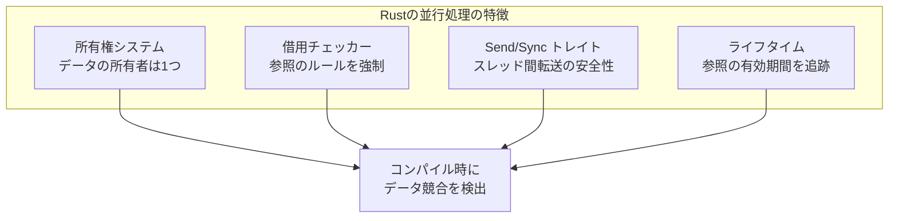

### 所有権の基本

```rust
fn main() {
    // 所有権の移動（ムーブ）
    let s1 = String::from("hello");
    let s2 = s1;  // s1 の所有権が s2 に移動
    // println!("{}", s1);  // コンパイルエラー！s1 は無効
    println!("{}", s2);  // OK
    
    // 借用（参照）
    let s3 = String::from("world");
    let len = calculate_length(&s3);  // 不変借用
    println!("{} の長さは {}", s3, len);  // s3 はまだ有効
    
    // 可変借用
    let mut s4 = String::from("hello");
    change(&mut s4);
    println!("{}", s4);  // "hello, world"
}

fn calculate_length(s: &String) -> usize {
    s.len()
}

fn change(s: &mut String) {
    s.push_str(", world");
}
```

### 借用のルール

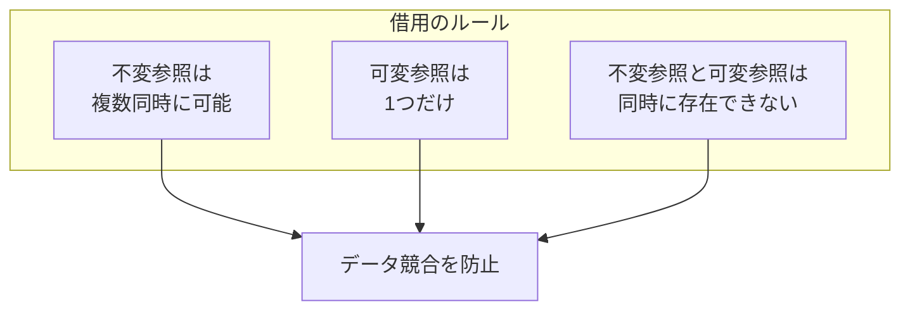

```rust
fn main() {
    let mut s = String::from("hello");
    
    // OK: 複数の不変参照
    let r1 = &s;
    let r2 = &s;
    println!("{}, {}", r1, r2);
    
    // OK: 不変参照を使い終わった後なら可変参照OK
    let r3 = &mut s;
    r3.push_str(", world");
    println!("{}", r3);
    
    // NG: 不変参照と可変参照の同時使用
    // let r4 = &s;
    // let r5 = &mut s;
    // println!("{}, {}", r4, r5);  // コンパイルエラー
}
```

### Send と Sync トレイト

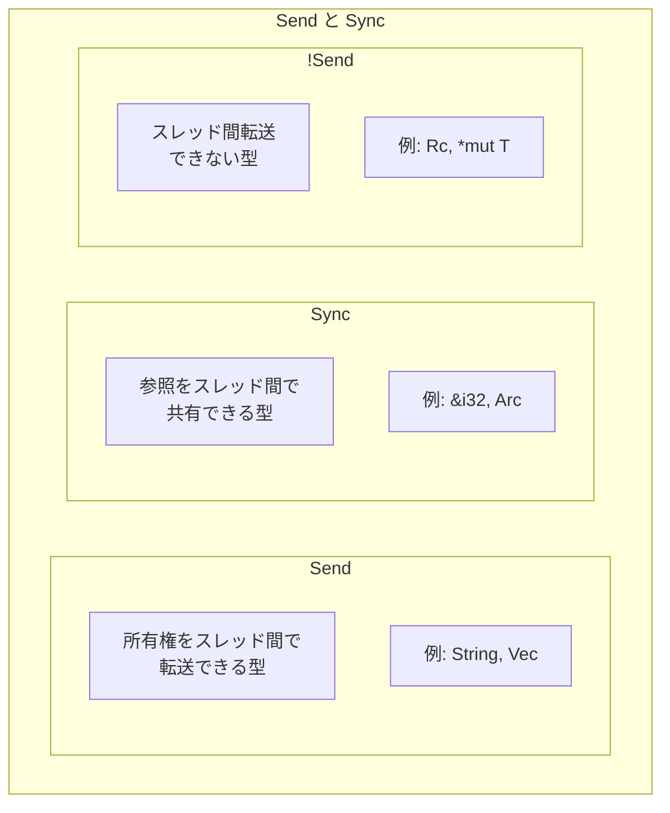

```rust
use std::thread;
use std::rc::Rc;
use std::sync::Arc;

fn main() {
    // Send な型はスレッド間で転送可能
    let s = String::from("hello");
    thread::spawn(move || {
        println!("{}", s);  // OK
    }).join().unwrap();
    
    // Rc は !Send なのでスレッド間で使えない
    // let rc = Rc::new(5);
    // thread::spawn(move || {
    //     println!("{}", rc);  // コンパイルエラー！
    // });
    
    // Arc は Send + Sync なのでスレッド間で共有可能
    let arc = Arc::new(5);
    let arc_clone = Arc::clone(&arc);
    thread::spawn(move || {
        println!("{}", arc_clone);  // OK
    }).join().unwrap();
}
```

---

## 13.2 スレッドベースの並行処理

### 基本的なスレッド

```rust
use std::thread;
use std::time::Duration;

fn main() {
    // スレッドの作成
    let handle = thread::spawn(|| {
        for i in 1..10 {
            println!("spawned thread: {}", i);
            thread::sleep(Duration::from_millis(1));
        }
    });
    
    // メインスレッドの処理
    for i in 1..5 {
        println!("main thread: {}", i);
        thread::sleep(Duration::from_millis(1));
    }
    
    // スレッドの完了を待つ
    handle.join().unwrap();
}
```

### move クロージャ

```rust
use std::thread;

fn main() {
    let v = vec![1, 2, 3];
    
    // move キーワードで所有権を転送
    let handle = thread::spawn(move || {
        println!("vector: {:?}", v);
    });
    
    // v はもう使えない（所有権が移動した）
    // println!("{:?}", v);  // コンパイルエラー
    
    handle.join().unwrap();
}
```

### チャネルによるメッセージパッシング

```rust
use std::sync::mpsc;  // multiple producer, single consumer
use std::thread;

fn main() {
    // チャネルの作成
    let (tx, rx) = mpsc::channel();
    
    // 送信側
    thread::spawn(move || {
        let messages = vec!["hello", "from", "thread"];
        for msg in messages {
            tx.send(msg).unwrap();
            thread::sleep(std::time::Duration::from_millis(500));
        }
    });
    
    // 受信側
    for received in rx {
        println!("Got: {}", received);
    }
}
```

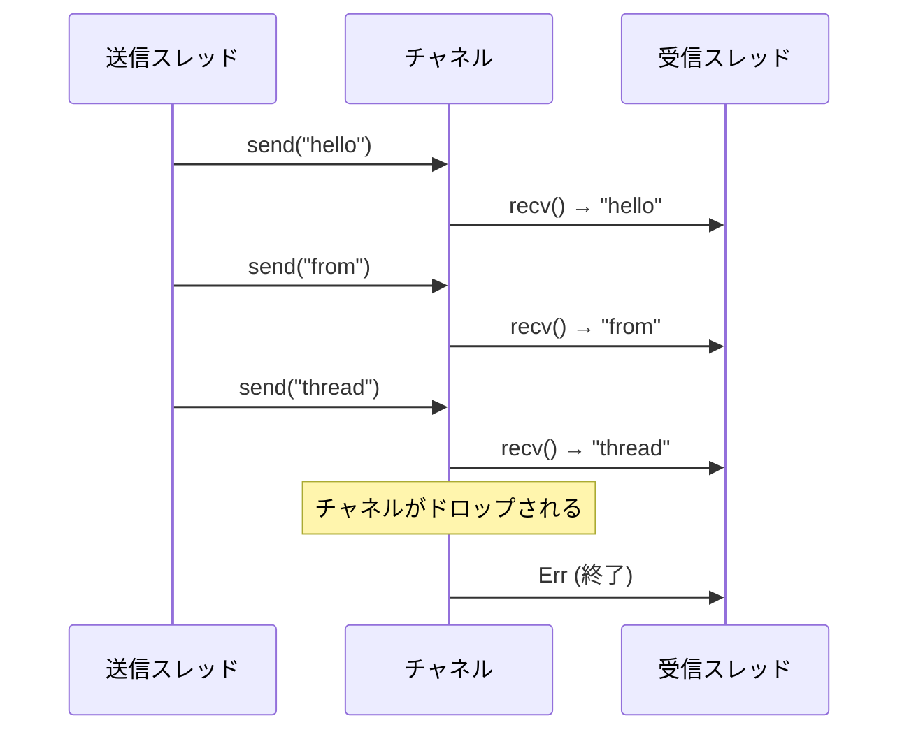

### 複数の送信者

```rust
use std::sync::mpsc;
use std::thread;

fn main() {
    let (tx, rx) = mpsc::channel();
    let tx2 = tx.clone();  // 送信者をクローン
    
    thread::spawn(move || {
        tx.send("from tx1").unwrap();
    });
    
    thread::spawn(move || {
        tx2.send("from tx2").unwrap();
    });
    
    for received in rx {
        println!("Got: {}", received);
    }
}
```

### Mutex と Arc

```rust
use std::sync::{Arc, Mutex};
use std::thread;

fn main() {
    // Arc: 複数スレッドで共有可能なスマートポインタ
    // Mutex: 排他制御
    let counter = Arc::new(Mutex::new(0));
    let mut handles = vec![];
    
    for _ in 0..10 {
        let counter = Arc::clone(&counter);
        let handle = thread::spawn(move || {
            let mut num = counter.lock().unwrap();
            *num += 1;
        });
        handles.push(handle);
    }
    
    for handle in handles {
        handle.join().unwrap();
    }
    
    println!("Result: {}", *counter.lock().unwrap());  // 10
}
```

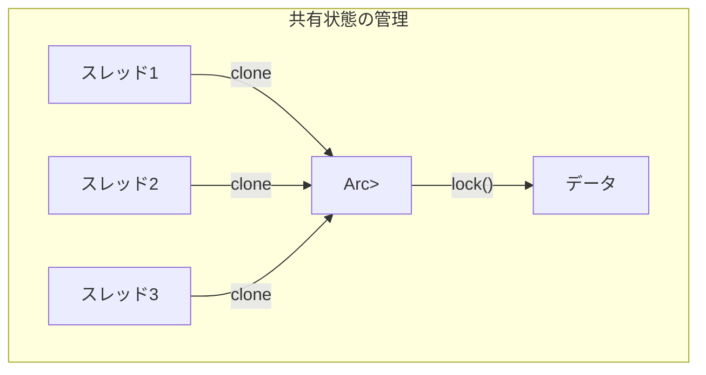

---

## 13.3 Future トレイト

### Futureとは

**Future**は、まだ完了していない非同期計算を表すトレイトです。JavaScriptのPromiseやPythonのAwaitableに相当します。

```rust
use std::future::Future;
use std::pin::Pin;
use std::task::{Context, Poll};

// Future トレイトの定義
pub trait Future {
    type Output;
    
    fn poll(self: Pin<&mut Self>, cx: &mut Context<'_>) -> Poll<Self::Output>;
}

// Poll 列挙型
pub enum Poll<T> {
    Ready(T),    // 完了、結果を持つ
    Pending,     // まだ完了していない
}
```

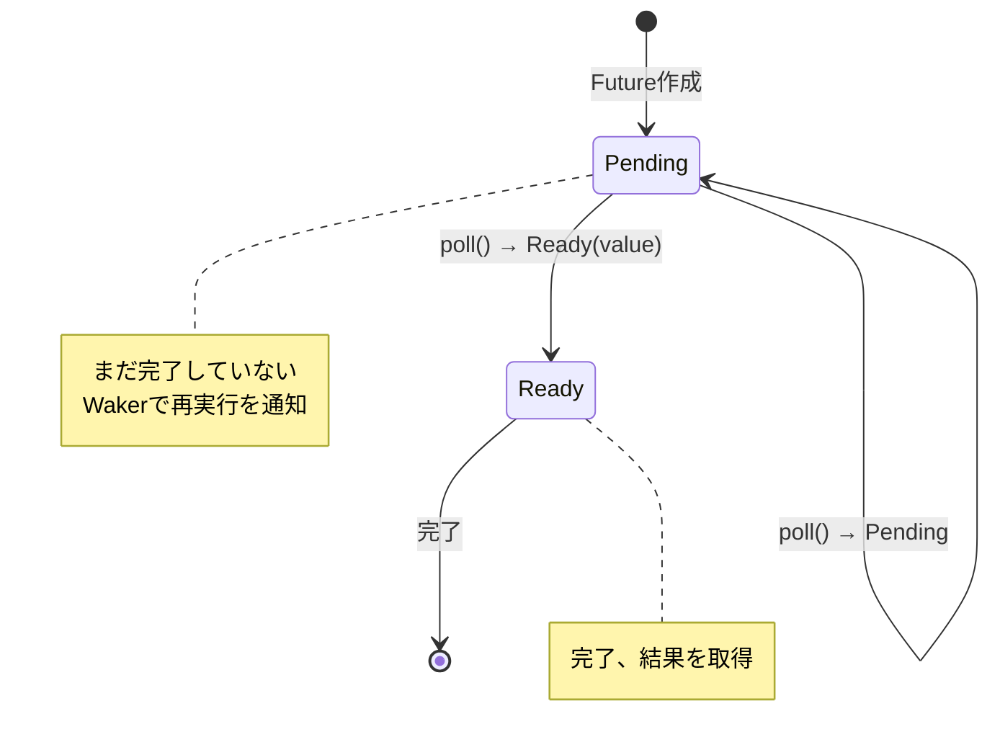

### Futureの手動実装

```rust
use std::future::Future;
use std::pin::Pin;
use std::task::{Context, Poll};
use std::time::{Duration, Instant};

struct Delay {
    when: Instant,
}

impl Delay {
    fn new(duration: Duration) -> Self {
        Delay {
            when: Instant::now() + duration,
        }
    }
}

impl Future for Delay {
    type Output = ();
    
    fn poll(self: Pin<&mut Self>, cx: &mut Context<'_>) -> Poll<Self::Output> {
        if Instant::now() >= self.when {
            Poll::Ready(())
        } else {
            // 完了していない場合、後で再度 poll してもらう
            // 実際の実装ではタイマーを登録して waker を呼ぶ
            cx.waker().wake_by_ref();
            Poll::Pending
        }
    }
}
```

### Waker と Context

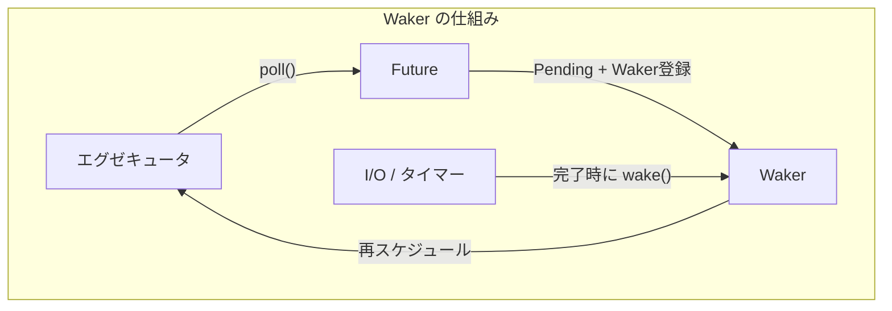

```rust
use std::task::Waker;

// Waker の使い方（概念的なコード）
fn setup_timer(duration: Duration, waker: Waker) {
    std::thread::spawn(move || {
        std::thread::sleep(duration);
        waker.wake();  // Futureを再度pollするよう通知
    });
}
```

---

## 13.4 async/await

### 基本構文

```rust
// async fn は Future を返す
async fn hello() -> String {
    "Hello".to_string()
}

// async ブロック
fn create_future() -> impl Future<Output = i32> {
    async {
        42
    }
}

async fn example() {
    // await で Future の完了を待つ
    let greeting = hello().await;
    println!("{}", greeting);
}
```

### async fn の変換

`async fn`はコンパイラによってステートマシンに変換されます。

```rust
// このコード
async fn example() -> i32 {
    let a = fetch_a().await;
    let b = fetch_b().await;
    a + b
}

// 概念的には以下のような構造体に変換される
enum ExampleStateMachine {
    Start,
    WaitingA { /* fetch_a の Future */ },
    WaitingB { a: i32, /* fetch_b の Future */ },
    Done,
}

impl Future for ExampleStateMachine {
    type Output = i32;
    
    fn poll(self: Pin<&mut Self>, cx: &mut Context<'_>) -> Poll<i32> {
        // 状態に応じて処理を進める
        match self.get_mut() {
            ExampleStateMachine::Start => {
                // fetch_a を開始
                // ...
            }
            ExampleStateMachine::WaitingA { .. } => {
                // fetch_a の結果を確認
                // ...
            }
            // ...
        }
    }
}
```

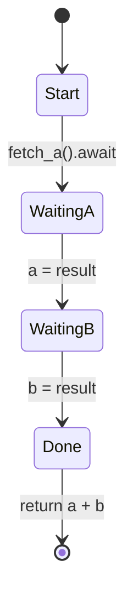

### Pin と自己参照

`async fn`が生成するFutureは自己参照構造体になる可能性があり、Pinで移動を防ぐ必要があります。

```rust
use std::pin::Pin;

async fn self_referential() {
    let data = vec![1, 2, 3];
    let reference = &data;  // data への参照
    
    some_async_op().await;  // ここで中断される可能性
    
    println!("{:?}", reference);  // reference はまだ有効？
}

// Futureが移動されると、reference が無効になる
// Pin により移動を防ぐ
```

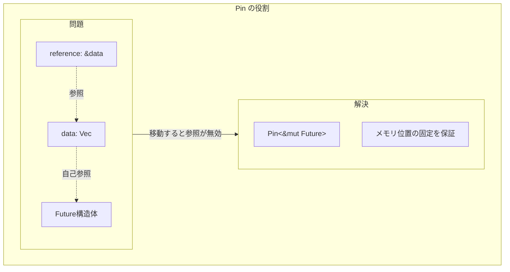

---

## 13.5 tokio ランタイム

### tokioとは

**tokio**は、Rustで最も広く使われている非同期ランタイムです。イベントループ、スケジューラ、I/O、タイマーなどを提供します。

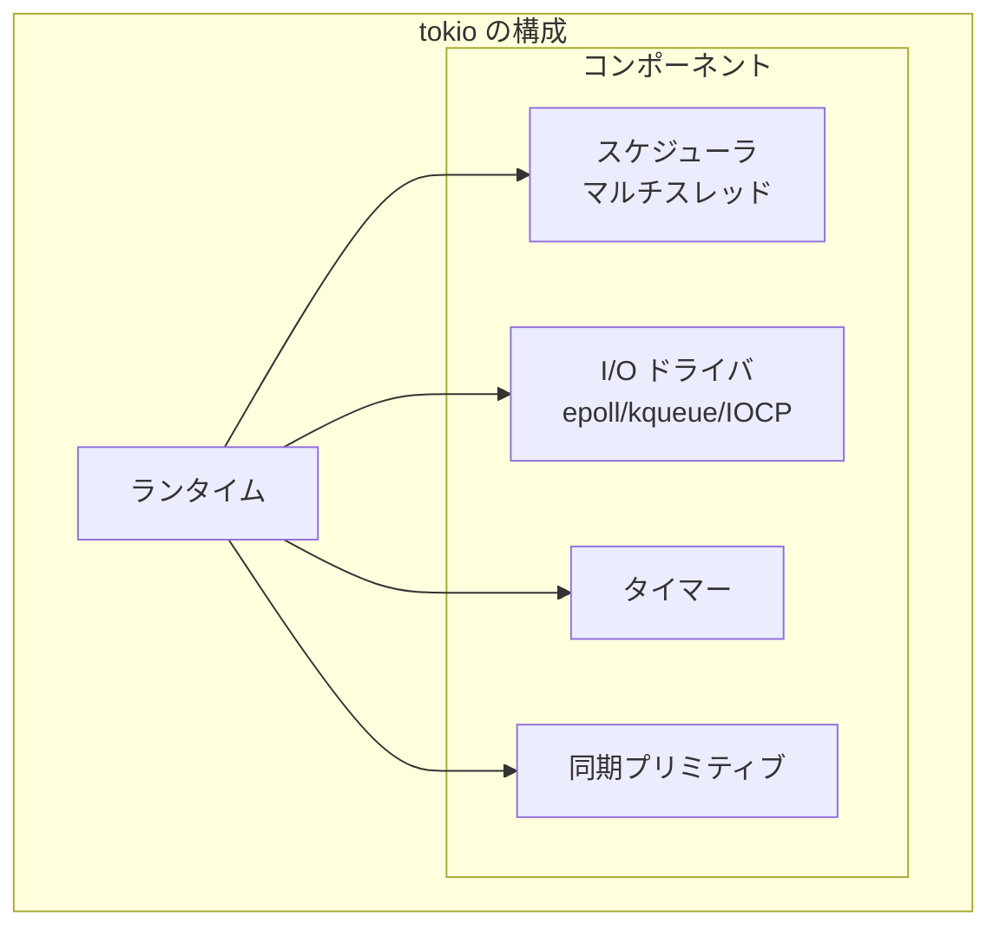

### 基本的な使い方

```rust
use tokio;

#[tokio::main]
async fn main() {
    println!("Hello from tokio!");
    
    // 非同期タスクを実行
    let result = async_operation().await;
    println!("Result: {}", result);
}

async fn async_operation() -> i32 {
    tokio::time::sleep(std::time::Duration::from_secs(1)).await;
    42
}
```

### ランタイムの設定

```rust
use tokio::runtime::Runtime;

fn main() {
    // マルチスレッドランタイム
    let rt = Runtime::new().unwrap();
    
    rt.block_on(async {
        println!("Running on tokio!");
    });
    
    // シングルスレッドランタイム
    let rt_single = tokio::runtime::Builder::new_current_thread()
        .enable_all()
        .build()
        .unwrap();
    
    rt_single.block_on(async {
        println!("Running on single thread!");
    });
}

// マクロでの設定
#[tokio::main(flavor = "multi_thread", worker_threads = 4)]
async fn main() {
    // 4つのワーカースレッド
}

#[tokio::main(flavor = "current_thread")]
async fn main() {
    // シングルスレッド
}
```

### タスクのスポーン

```rust
use tokio;

#[tokio::main]
async fn main() {
    // タスクをスポーン（バックグラウンドで実行）
    let handle = tokio::spawn(async {
        tokio::time::sleep(std::time::Duration::from_secs(1)).await;
        "Hello from spawned task"
    });
    
    // 他の処理を実行
    println!("Main task running...");
    
    // タスクの完了を待つ
    let result = handle.await.unwrap();
    println!("Result: {}", result);
}
```

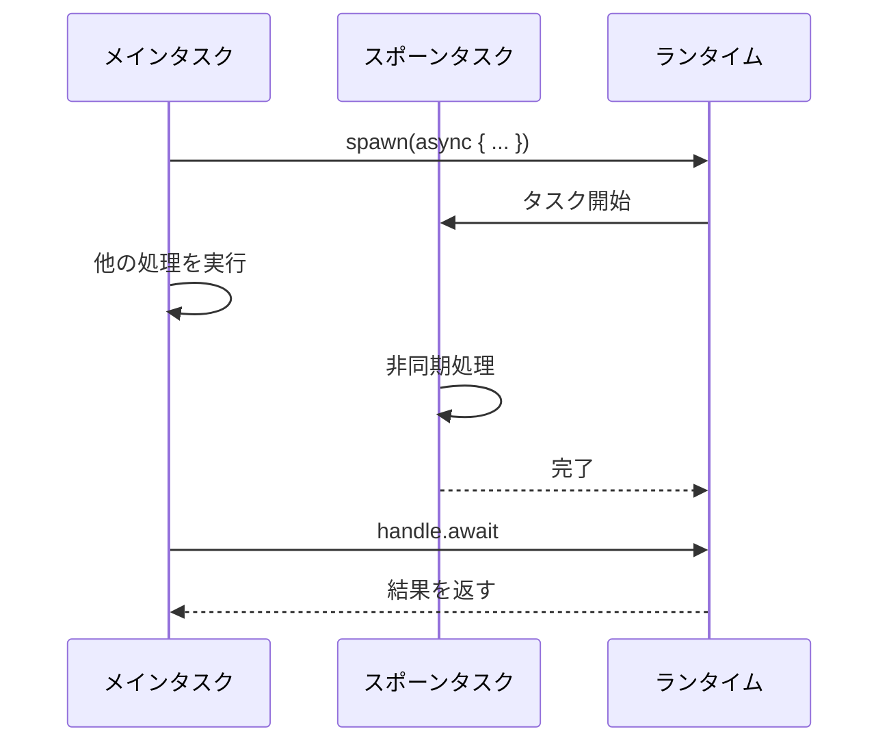

### 並行実行

```rust
use tokio;

async fn fetch(id: i32) -> String {
    tokio::time::sleep(std::time::Duration::from_millis(100)).await;
    format!("Result-{}", id)
}

#[tokio::main]
async fn main() {
    // join! マクロ：すべてのFutureを並行実行
    let (r1, r2, r3) = tokio::join!(
        fetch(1),
        fetch(2),
        fetch(3),
    );
    println!("{}, {}, {}", r1, r2, r3);
    
    // select! マクロ：最初に完了したものを選択
    tokio::select! {
        result = fetch(1) => println!("1 finished first: {}", result),
        result = fetch(2) => println!("2 finished first: {}", result),
    }
    
    // try_join! マクロ：エラーがあれば早期リターン
    async fn may_fail(id: i32) -> Result<String, &'static str> {
        if id == 2 {
            Err("Failed")
        } else {
            Ok(format!("Success-{}", id))
        }
    }
    
    match tokio::try_join!(may_fail(1), may_fail(3)) {
        Ok((r1, r2)) => println!("{}, {}", r1, r2),
        Err(e) => println!("Error: {}", e),
    }
}
```

### チャネル

```rust
use tokio::sync::mpsc;

#[tokio::main]
async fn main() {
    // mpsc チャネル（multi-producer, single-consumer）
    let (tx, mut rx) = mpsc::channel(32);  // バッファサイズ 32
    
    tokio::spawn(async move {
        for i in 0..10 {
            tx.send(i).await.unwrap();
        }
    });
    
    while let Some(value) = rx.recv().await {
        println!("Received: {}", value);
    }
}
```

```rust
use tokio::sync::{broadcast, watch, oneshot};

#[tokio::main]
async fn main() {
    // broadcast: 複数の受信者
    let (tx, mut rx1) = broadcast::channel(16);
    let mut rx2 = tx.subscribe();
    
    tx.send("hello").unwrap();
    
    println!("rx1: {}", rx1.recv().await.unwrap());
    println!("rx2: {}", rx2.recv().await.unwrap());
    
    // watch: 最新の値のみを保持
    let (tx, mut rx) = watch::channel("initial");
    
    tx.send("updated").unwrap();
    println!("watch: {}", *rx.borrow());
    
    // oneshot: 一度だけの通信
    let (tx, rx) = oneshot::channel();
    
    tokio::spawn(async move {
        tx.send("one-time message").unwrap();
    });
    
    println!("oneshot: {}", rx.await.unwrap());
}
```

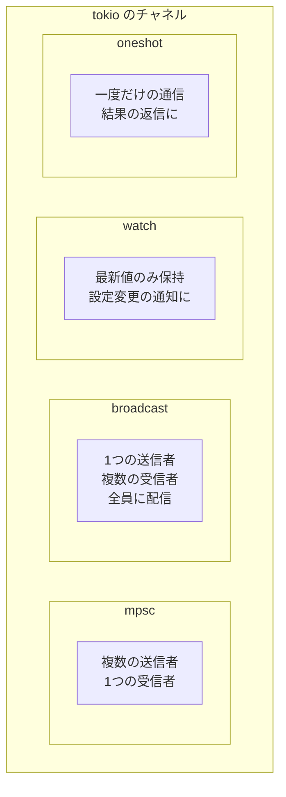

### 同期プリミティブ

```rust
use tokio::sync::{Mutex, RwLock, Semaphore};
use std::sync::Arc;

#[tokio::main]
async fn main() {
    // 非同期 Mutex
    let data = Arc::new(Mutex::new(0));
    let data_clone = Arc::clone(&data);
    
    let handle = tokio::spawn(async move {
        let mut lock = data_clone.lock().await;
        *lock += 1;
    });
    
    {
        let mut lock = data.lock().await;
        *lock += 1;
    }
    
    handle.await.unwrap();
    println!("Result: {}", *data.lock().await);  // 2
    
    // RwLock（読み取り優先）
    let rw = Arc::new(RwLock::new(vec![1, 2, 3]));
    
    let read_lock = rw.read().await;
    println!("Read: {:?}", *read_lock);
    drop(read_lock);
    
    let mut write_lock = rw.write().await;
    write_lock.push(4);
    
    // Semaphore
    let semaphore = Arc::new(Semaphore::new(3));  // 同時に3つまで
    let permit = semaphore.acquire().await.unwrap();
    // 処理...
    drop(permit);  // 許可を解放
}
```

---

## 13.6 ネットワーク処理

### TCPサーバー

```rust
use tokio::net::{TcpListener, TcpStream};
use tokio::io::{AsyncReadExt, AsyncWriteExt};

#[tokio::main]
async fn main() -> std::io::Result<()> {
    let listener = TcpListener::bind("127.0.0.1:8080").await?;
    println!("Server listening on 127.0.0.1:8080");
    
    loop {
        let (socket, addr) = listener.accept().await?;
        println!("New connection from: {}", addr);
        
        // 各接続を別タスクで処理
        tokio::spawn(async move {
            handle_connection(socket).await;
        });
    }
}

async fn handle_connection(mut socket: TcpStream) {
    let mut buffer = [0; 1024];
    
    loop {
        let n = match socket.read(&mut buffer).await {
            Ok(0) => return,  // 接続終了
            Ok(n) => n,
            Err(e) => {
                eprintln!("read error: {}", e);
                return;
            }
        };
        
        // エコーバック
        if let Err(e) = socket.write_all(&buffer[..n]).await {
            eprintln!("write error: {}", e);
            return;
        }
    }
}
```

### TCPクライアント

```rust
use tokio::net::TcpStream;
use tokio::io::{AsyncReadExt, AsyncWriteExt};

#[tokio::main]
async fn main() -> std::io::Result<()> {
    let mut stream = TcpStream::connect("127.0.0.1:8080").await?;
    
    // メッセージを送信
    stream.write_all(b"Hello, server!").await?;
    
    // レスポンスを受信
    let mut buffer = [0; 1024];
    let n = stream.read(&mut buffer).await?;
    
    println!("Received: {}", String::from_utf8_lossy(&buffer[..n]));
    
    Ok(())
}
```

### HTTPクライアント（reqwest）

```rust
use reqwest;

#[tokio::main]
async fn main() -> Result<(), reqwest::Error> {
    // 単純なGETリクエスト
    let body = reqwest::get("https://httpbin.org/get")
        .await?
        .text()
        .await?;
    println!("Response: {}", body);
    
    // クライアントを再利用
    let client = reqwest::Client::new();
    
    // 並行リクエスト
    let urls = vec![
        "https://httpbin.org/get",
        "https://httpbin.org/ip",
        "https://httpbin.org/headers",
    ];
    
    let futures: Vec<_> = urls.iter()
        .map(|url| client.get(*url).send())
        .collect();
    
    let results = futures::future::join_all(futures).await;
    
    for result in results {
        match result {
            Ok(response) => println!("Status: {}", response.status()),
            Err(e) => eprintln!("Error: {}", e),
        }
    }
    
    Ok(())
}
```

### Webサーバー（axum）

```rust
use axum::{
    routing::{get, post},
    http::StatusCode,
    Json, Router,
};
use serde::{Deserialize, Serialize};

#[tokio::main]
async fn main() {
    let app = Router::new()
        .route("/", get(root))
        .route("/users", post(create_user));
    
    let listener = tokio::net::TcpListener::bind("0.0.0.0:3000")
        .await
        .unwrap();
    
    println!("Server running on http://localhost:3000");
    axum::serve(listener, app).await.unwrap();
}

async fn root() -> &'static str {
    "Hello, World!"
}

#[derive(Deserialize)]
struct CreateUser {
    username: String,
}

#[derive(Serialize)]
struct User {
    id: u64,
    username: String,
}

async fn create_user(Json(payload): Json<CreateUser>) -> (StatusCode, Json<User>) {
    let user = User {
        id: 1,
        username: payload.username,
    };
    (StatusCode::CREATED, Json(user))
}
```

---

## 13.7 async-std

### async-stdとは

**async-std**はtokioの代替となる非同期ランタイムで、標準ライブラリに近いAPIを提供します。

```rust
use async_std::task;
use std::time::Duration;

#[async_std::main]
async fn main() {
    println!("Hello from async-std!");
    
    task::sleep(Duration::from_secs(1)).await;
    
    // タスクのスポーン
    let handle = task::spawn(async {
        "Hello from spawned task"
    });
    
    let result = handle.await;
    println!("{}", result);
}
```

### ファイルI/O

```rust
use async_std::fs::File;
use async_std::io::{ReadExt, WriteExt};

#[async_std::main]
async fn main() -> std::io::Result<()> {
    // ファイルへの書き込み
    let mut file = File::create("hello.txt").await?;
    file.write_all(b"Hello, async!").await?;
    
    // ファイルからの読み込み
    let mut file = File::open("hello.txt").await?;
    let mut contents = String::new();
    file.read_to_string(&mut contents).await?;
    println!("{}", contents);
    
    Ok(())
}
```

### tokio vs async-std

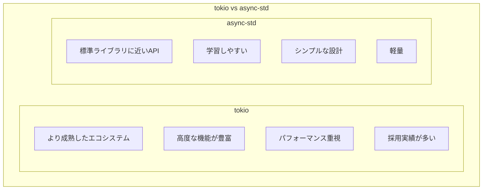

| 特性 | tokio | async-std |
|------|-------|-----------|
| 成熟度 | 高い | 中程度 |
| エコシステム | 非常に大きい | 小さめ |
| API設計 | 独自 | 標準ライブラリ風 |
| 学習コスト | やや高い | 低い |
| パフォーマンス | 最適化済み | 十分 |

---

## 13.8 エラーハンドリング

### Result と ? 演算子

```rust
use tokio::fs::File;
use tokio::io::{AsyncReadExt, AsyncWriteExt};

async fn read_file(path: &str) -> Result<String, std::io::Error> {
    let mut file = File::open(path).await?;  // ? でエラーを伝播
    let mut contents = String::new();
    file.read_to_string(&mut contents).await?;
    Ok(contents)
}

async fn process_file(path: &str) -> Result<(), Box<dyn std::error::Error>> {
    let contents = read_file(path).await?;
    println!("Contents: {}", contents);
    Ok(())
}

#[tokio::main]
async fn main() {
    match process_file("hello.txt").await {
        Ok(()) => println!("Success"),
        Err(e) => eprintln!("Error: {}", e),
    }
}
```

### anyhow と thiserror

```rust
use anyhow::{Context, Result, bail};
use thiserror::Error;

#[derive(Error, Debug)]
enum MyError {
    #[error("Failed to read file: {0}")]
    ReadError(#[from] std::io::Error),
    
    #[error("Parse error at line {line}: {message}")]
    ParseError { line: usize, message: String },
    
    #[error("Unknown error")]
    Unknown,
}

async fn read_config(path: &str) -> Result<Config> {
    let contents = tokio::fs::read_to_string(path)
        .await
        .context("Failed to read config file")?;
    
    let config: Config = serde_json::from_str(&contents)
        .context("Failed to parse config")?;
    
    if config.name.is_empty() {
        bail!("Config name cannot be empty");
    }
    
    Ok(config)
}
```

---

## 13.9 まとめ

この章では、Rustの非同期処理について詳しく学びました。

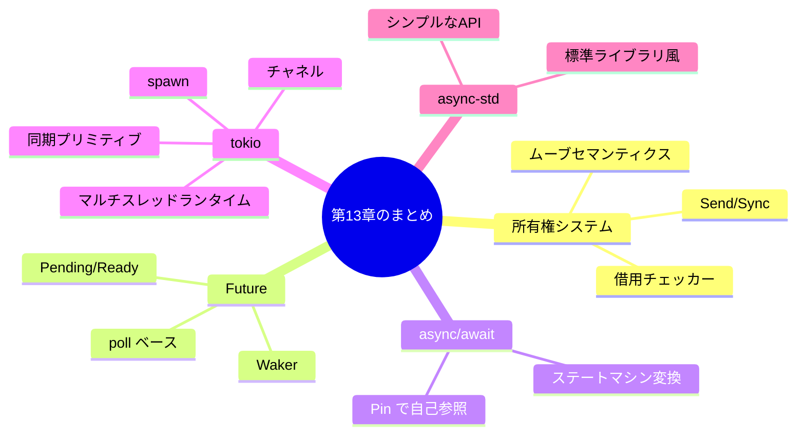

### 重要なポイント

#### 1. Rustの所有権システムがスレッド安全性を保証

借用チェッカーとSend/Syncトレイトにより、コンパイル時にデータ競合を防止します。これにより「恐れなき並行性」が実現されます。

#### 2. Futureはpollベースの遅延計算

Futureは呼び出されるまで実行されず、pollによって駆動されます。Wakerを使って再実行のタイミングを通知します。

#### 3. async/awaitはステートマシンに変換される

コンパイラがasync fnをステートマシンに変換します。自己参照構造体の安全性のためPinが必要です。

#### 4. tokioが最も広く使われるランタイム

tokioは成熟したエコシステムを持ち、高性能な非同期ランタイムを提供します。spawn、チャネル、同期プリミティブなど、必要な機能がすべて揃っています。

---

## 📝 練習問題

1. **RustのSendトレイトとSyncトレイトの違いを説明してください。**
   
   ヒント：所有権の転送と参照の共有について考えてください。

2. **以下のコードがコンパイルエラーになる理由を説明し、修正してください。**

   ```rust
   use std::rc::Rc;
   use std::thread;
   
   fn main() {
       let rc = Rc::new(5);
       thread::spawn(move || {
           println!("{}", rc);
       });
   }
   ```
   
   ヒント：RcとArcの違いについて考えてください。

3. **tokioを使って、3つのURLから並行してHTTPレスポンスを取得するコードを書いてください。**
   
   ヒント：reqwestとtokio::join!を使用してください。

4. **Futureトレイトのpollメソッドが返すPoll::Pendingの意味と、その後どのようにFutureが再実行されるかを説明してください。**
   
   ヒント：Wakerの役割について考えてください。

5. **tokioのmpscチャネルを使って、プロデューサー・コンシューマーパターンを実装してください。**
   
   要件：
   - 1つのプロデューサーが0〜9の数値を送信
   - 2つのコンシューマーが交互に受信して出力
   
   ヒント：チャネルのクローンとtokio::spawnを使用してください。

---

## 🔗 次の章へ

[第14章: Go](./14-go.md) では、GoのGoroutine、チャネル、select文、M:Nスケジューリングについて詳しく学びます。

---

[← 目次に戻る](../index.md) | [← 前章: Python](./12-python.md)

