# 第14章: Go

> 🎯 **この章の目標**: GoのGoroutine、チャネル、select文、M:Nスケジューリングを理解し、Goの並行処理モデルをマスターする

---

## 14.1 Goの並行処理の哲学

### 「共有メモリで通信するな、通信でメモリを共有せよ」

Goの並行処理の設計哲学は、このスローガンに集約されます。共有メモリとロックの代わりに、チャネルを使ったメッセージパッシングを推奨しています。

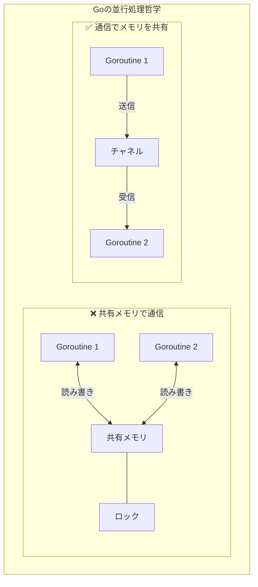

### CSP（Communicating Sequential Processes）

GoはTony HoareのCSP理論に基づいています。第10章で学んだCSPの実践的な実装がGoです。

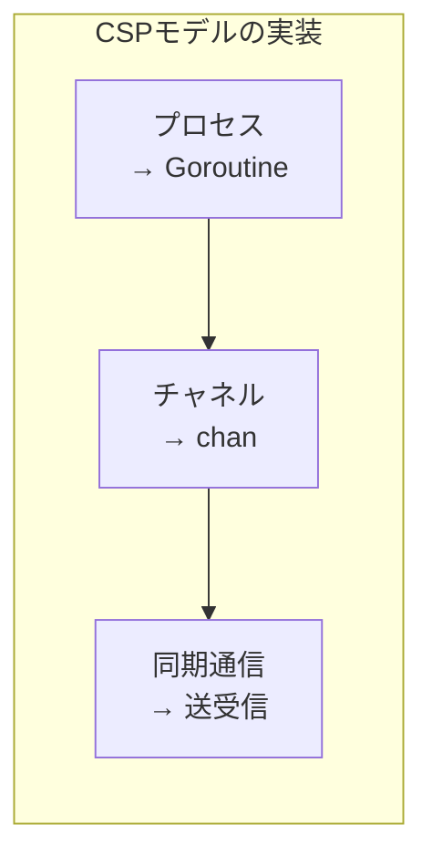

---

## 14.2 Goroutine

### Goroutineとは

**Goroutine**は、Goランタイムによって管理される軽量スレッドです。OSスレッドよりも軽量で、数千〜数百万のgoroutineを同時に実行できます。

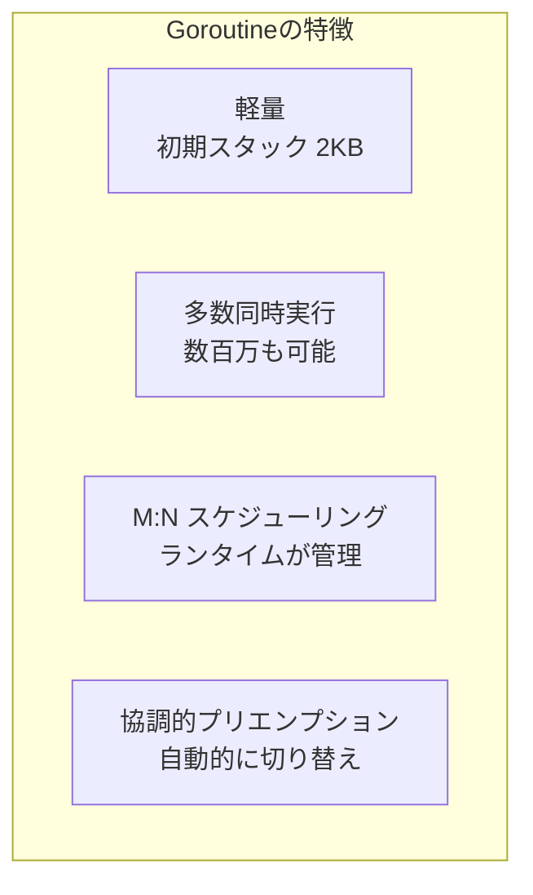

### 基本的な使い方

```go
package main

import (
    "fmt"
    "time"
)

func sayHello(name string) {
    for i := 0; i < 3; i++ {
        fmt.Printf("Hello, %s! (%d)\n", name, i)
        time.Sleep(100 * time.Millisecond)
    }
}

func main() {
    // go キーワードで goroutine を起動
    go sayHello("World")
    go sayHello("Go")
    
    // メイン goroutine の処理
    fmt.Println("Main goroutine")
    
    // goroutine の完了を待つ（簡易的な方法）
    time.Sleep(500 * time.Millisecond)
    fmt.Println("Done")
}
```

### 無名関数でのGoroutine

```go
package main

import (
    "fmt"
    "time"
)

func main() {
    // 無名関数を goroutine で実行
    go func() {
        fmt.Println("Anonymous goroutine")
    }()
    
    // 引数を渡す場合
    message := "Hello"
    go func(msg string) {
        fmt.Println(msg)
    }(message)  // 引数を渡す
    
    // クロージャの注意点
    for i := 0; i < 3; i++ {
        // NG: i を直接参照すると最終値になりがち
        // go func() {
        //     fmt.Println(i)  // 3, 3, 3 になる可能性
        // }()
        
        // OK: 引数として渡す
        go func(n int) {
            fmt.Println(n)  // 0, 1, 2
        }(i)
    }
    
    time.Sleep(100 * time.Millisecond)
}
```

### Goroutineのライフサイクル

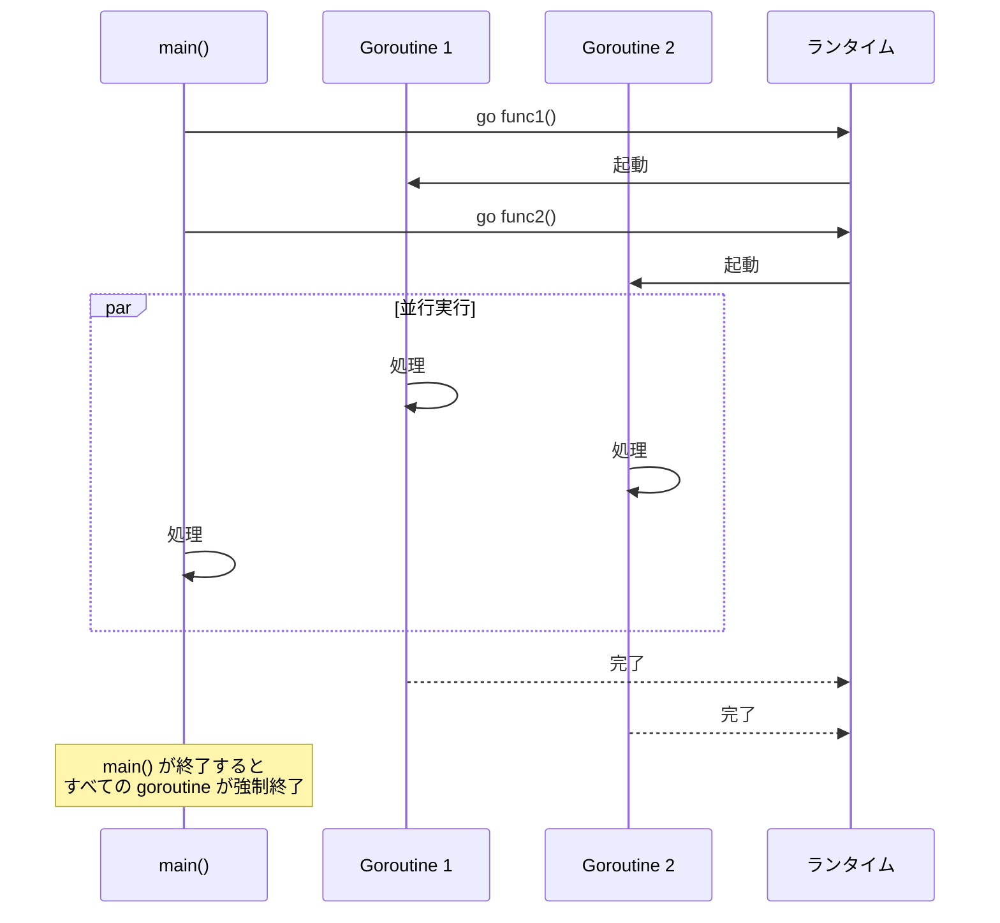

### WaitGroupによる同期

```go
package main

import (
    "fmt"
    "sync"
    "time"
)

func worker(id int, wg *sync.WaitGroup) {
    defer wg.Done()  // 完了を通知
    
    fmt.Printf("Worker %d: 開始\n", id)
    time.Sleep(time.Second)
    fmt.Printf("Worker %d: 完了\n", id)
}

func main() {
    var wg sync.WaitGroup
    
    for i := 1; i <= 3; i++ {
        wg.Add(1)  // カウンタをインクリメント
        go worker(i, &wg)
    }
    
    wg.Wait()  // すべての goroutine が完了するまで待機
    fmt.Println("すべてのワーカーが完了")
}
```

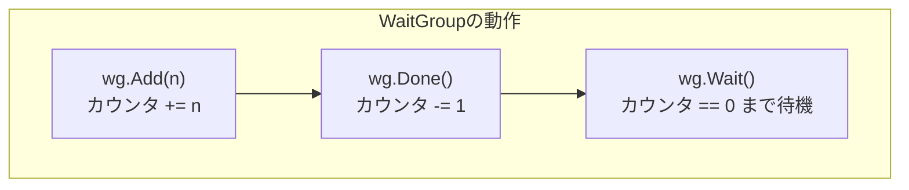

---

## 14.3 チャネル（Channel）

### チャネルとは

**チャネル**は、goroutine間でデータを安全に送受信するための通信機構です。型付けされており、特定の型のデータのみを送受信できます。

```go
package main

import "fmt"

func main() {
    // チャネルの作成
    ch := make(chan int)  // int 型のチャネル
    
    // goroutine で送信
    go func() {
        ch <- 42  // 送信
    }()
    
    // メインで受信
    value := <-ch  // 受信
    fmt.Println(value)  // 42
}
```

### チャネルの送受信

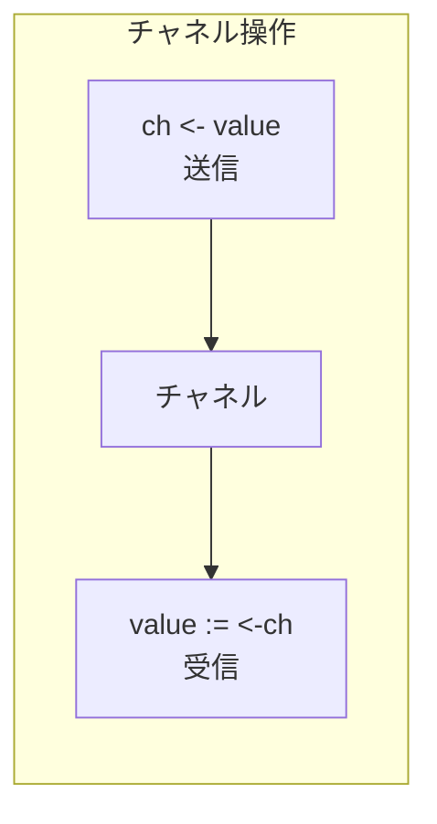

```go
package main

import "fmt"

func main() {
    ch := make(chan string)
    
    go func() {
        ch <- "Hello"
        ch <- "World"
        close(ch)  // チャネルを閉じる
    }()
    
    // 方法1: 明示的な受信
    msg1 := <-ch
    msg2 := <-ch
    fmt.Println(msg1, msg2)
    
    // 方法2: range でイテレート
    ch2 := make(chan int)
    go func() {
        for i := 0; i < 5; i++ {
            ch2 <- i
        }
        close(ch2)
    }()
    
    for value := range ch2 {
        fmt.Println(value)
    }
}
```

### バッファなしチャネル（同期チャネル）

バッファなしチャネルは、送信者と受信者が同時に準備できるまでブロックします。

```go
package main

import (
    "fmt"
    "time"
)

func main() {
    ch := make(chan int)  // バッファなし
    
    go func() {
        fmt.Println("送信者: 送信準備完了")
        ch <- 42  // 受信者が準備できるまでブロック
        fmt.Println("送信者: 送信完了")
    }()
    
    time.Sleep(time.Second)
    fmt.Println("受信者: 受信準備完了")
    value := <-ch  // 送信者が送信するまでブロック
    fmt.Printf("受信者: %d を受信\n", value)
}
```

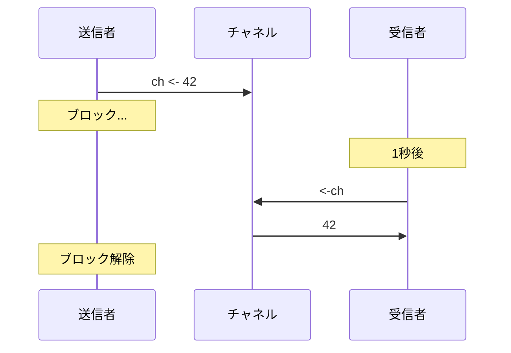

### バッファ付きチャネル

バッファ付きチャネルは、バッファが満杯になるまで送信がブロックされません。

```go
package main

import "fmt"

func main() {
    ch := make(chan int, 3)  // バッファサイズ 3
    
    // バッファに空きがあれば即座に送信
    ch <- 1
    ch <- 2
    ch <- 3
    // ch <- 4  // ここでブロック（バッファ満杯）
    
    fmt.Println(<-ch)  // 1
    fmt.Println(<-ch)  // 2
    fmt.Println(<-ch)  // 3
    
    // バッファの長さと容量
    ch2 := make(chan string, 5)
    ch2 <- "a"
    ch2 <- "b"
    
    fmt.Println("長さ:", len(ch2))  // 2
    fmt.Println("容量:", cap(ch2))  // 5
}
```

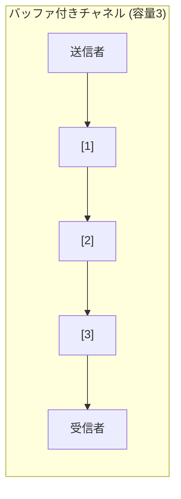

### チャネルの方向

```go
package main

import "fmt"

// 送信専用チャネル
func sender(ch chan<- int) {
    ch <- 42
    // value := <-ch  // コンパイルエラー！
}

// 受信専用チャネル
func receiver(ch <-chan int) {
    value := <-ch
    fmt.Println(value)
    // ch <- 100  // コンパイルエラー！
}

func main() {
    ch := make(chan int)
    
    go sender(ch)
    receiver(ch)
}
```

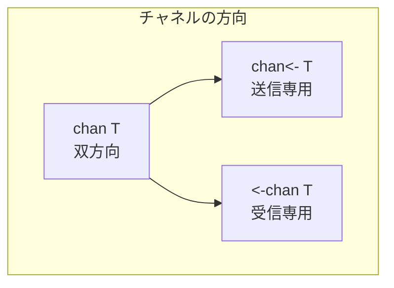

### チャネルのクローズ

```go
package main

import "fmt"

func main() {
    ch := make(chan int, 3)
    
    ch <- 1
    ch <- 2
    ch <- 3
    close(ch)  // チャネルを閉じる
    
    // 閉じたチャネルから受信
    for {
        value, ok := <-ch
        if !ok {
            fmt.Println("チャネルが閉じられました")
            break
        }
        fmt.Println(value)
    }
    
    // range で自動的に終了を検出
    ch2 := make(chan string)
    go func() {
        ch2 <- "Hello"
        ch2 <- "World"
        close(ch2)
    }()
    
    for msg := range ch2 {
        fmt.Println(msg)
    }
}
```

---

## 14.4 select文

### selectとは

**select**文は、複数のチャネル操作を同時に待機し、準備ができたものを実行します。switchに似た構文ですが、チャネル操作に特化しています。

```go
package main

import (
    "fmt"
    "time"
)

func main() {
    ch1 := make(chan string)
    ch2 := make(chan string)
    
    go func() {
        time.Sleep(100 * time.Millisecond)
        ch1 <- "from ch1"
    }()
    
    go func() {
        time.Sleep(200 * time.Millisecond)
        ch2 <- "from ch2"
    }()
    
    for i := 0; i < 2; i++ {
        select {
        case msg := <-ch1:
            fmt.Println(msg)
        case msg := <-ch2:
            fmt.Println(msg)
        }
    }
}
```

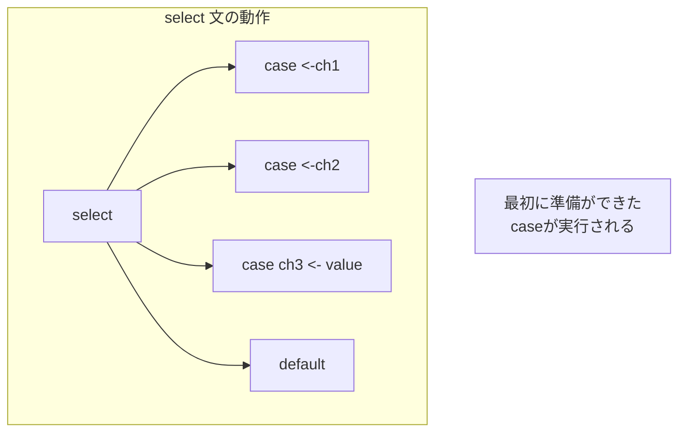

### タイムアウト

```go
package main

import (
    "fmt"
    "time"
)

func main() {
    ch := make(chan string)
    
    go func() {
        time.Sleep(2 * time.Second)
        ch <- "result"
    }()
    
    select {
    case result := <-ch:
        fmt.Println("結果:", result)
    case <-time.After(1 * time.Second):
        fmt.Println("タイムアウト")
    }
}
```

### 非ブロッキング操作（default）

```go
package main

import "fmt"

func main() {
    ch := make(chan int, 1)
    
    // 非ブロッキング送信
    select {
    case ch <- 42:
        fmt.Println("送信成功")
    default:
        fmt.Println("チャネルが満杯")
    }
    
    // 非ブロッキング受信
    select {
    case value := <-ch:
        fmt.Printf("受信: %d\n", value)
    default:
        fmt.Println("データなし")
    }
}
```

### ループ内でのselect

```go
package main

import (
    "fmt"
    "time"
)

func main() {
    tick := time.Tick(500 * time.Millisecond)
    done := time.After(2 * time.Second)
    
    for {
        select {
        case <-done:
            fmt.Println("終了")
            return
        case t := <-tick:
            fmt.Println("Tick at", t)
        }
    }
}
```

### 複数のケースが準備できた場合

```go
package main

import "fmt"

func main() {
    ch1 := make(chan int, 1)
    ch2 := make(chan int, 1)
    
    ch1 <- 1
    ch2 <- 2
    
    // 両方準備できている場合、ランダムに選択される
    for i := 0; i < 10; i++ {
        ch1 <- 1
        ch2 <- 2
        
        select {
        case <-ch1:
            fmt.Println("ch1")
        case <-ch2:
            fmt.Println("ch2")
        }
    }
}
```

---

## 14.5 並行パターン

### パイプライン

```go
package main

import "fmt"

func generator(nums ...int) <-chan int {
    out := make(chan int)
    go func() {
        for _, n := range nums {
            out <- n
        }
        close(out)
    }()
    return out
}

func square(in <-chan int) <-chan int {
    out := make(chan int)
    go func() {
        for n := range in {
            out <- n * n
        }
        close(out)
    }()
    return out
}

func main() {
    // パイプラインを構築
    nums := generator(1, 2, 3, 4, 5)
    squared := square(nums)
    
    for result := range squared {
        fmt.Println(result)  // 1, 4, 9, 16, 25
    }
}
```

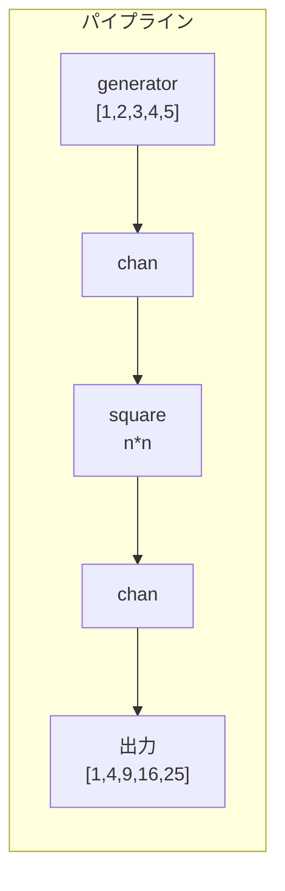

### ファンアウト・ファンイン

```go
package main

import (
    "fmt"
    "sync"
)

func fanOut(in <-chan int, workers int) []<-chan int {
    channels := make([]<-chan int, workers)
    
    for i := 0; i < workers; i++ {
        channels[i] = worker(in, i)
    }
    
    return channels
}

func worker(in <-chan int, id int) <-chan int {
    out := make(chan int)
    go func() {
        for n := range in {
            fmt.Printf("Worker %d processing %d\n", id, n)
            out <- n * n
        }
        close(out)
    }()
    return out
}

func fanIn(channels ...<-chan int) <-chan int {
    var wg sync.WaitGroup
    out := make(chan int)
    
    output := func(ch <-chan int) {
        defer wg.Done()
        for n := range ch {
            out <- n
        }
    }
    
    wg.Add(len(channels))
    for _, ch := range channels {
        go output(ch)
    }
    
    go func() {
        wg.Wait()
        close(out)
    }()
    
    return out
}

func main() {
    in := make(chan int)
    
    go func() {
        for i := 1; i <= 10; i++ {
            in <- i
        }
        close(in)
    }()
    
    // ファンアウト: 3つのワーカーに分散
    channels := fanOut(in, 3)
    
    // ファンイン: 結果を集約
    for result := range fanIn(channels...) {
        fmt.Println("Result:", result)
    }
}
```

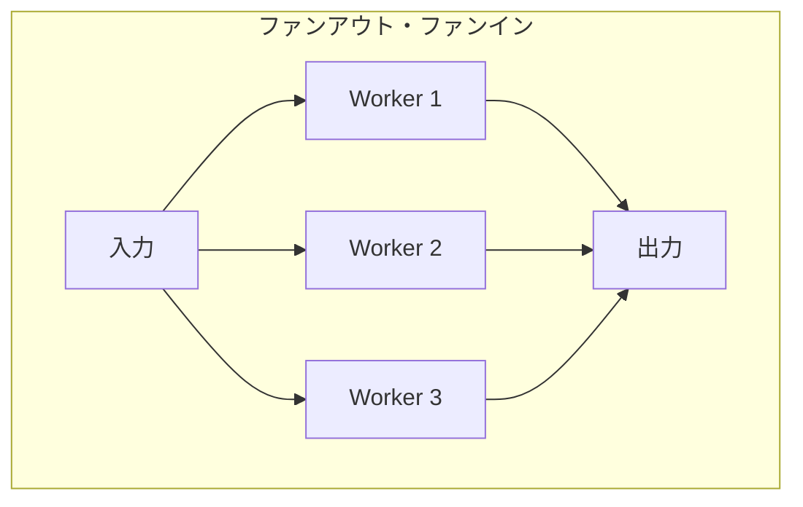

### ワーカープール

```go
package main

import (
    "fmt"
    "sync"
    "time"
)

type Job struct {
    ID   int
    Data string
}

type Result struct {
    Job    Job
    Output string
}

func worker(id int, jobs <-chan Job, results chan<- Result, wg *sync.WaitGroup) {
    defer wg.Done()
    
    for job := range jobs {
        fmt.Printf("Worker %d started job %d\n", id, job.ID)
        time.Sleep(100 * time.Millisecond)  // 処理をシミュレート
        
        results <- Result{
            Job:    job,
            Output: fmt.Sprintf("Processed: %s", job.Data),
        }
        fmt.Printf("Worker %d finished job %d\n", id, job.ID)
    }
}

func main() {
    jobs := make(chan Job, 100)
    results := make(chan Result, 100)
    
    var wg sync.WaitGroup
    
    // ワーカーを起動
    numWorkers := 3
    for w := 1; w <= numWorkers; w++ {
        wg.Add(1)
        go worker(w, jobs, results, &wg)
    }
    
    // ジョブを投入
    go func() {
        for i := 1; i <= 10; i++ {
            jobs <- Job{ID: i, Data: fmt.Sprintf("job-%d", i)}
        }
        close(jobs)
    }()
    
    // ワーカーの完了を待ってから results を閉じる
    go func() {
        wg.Wait()
        close(results)
    }()
    
    // 結果を収集
    for result := range results {
        fmt.Printf("Result: %s\n", result.Output)
    }
}
```

### キャンセレーション（context）

```go
package main

import (
    "context"
    "fmt"
    "time"
)

func worker(ctx context.Context, id int) {
    for {
        select {
        case <-ctx.Done():
            fmt.Printf("Worker %d: キャンセルされました\n", id)
            return
        default:
            fmt.Printf("Worker %d: 作業中...\n", id)
            time.Sleep(500 * time.Millisecond)
        }
    }
}

func main() {
    // タイムアウト付きのコンテキスト
    ctx, cancel := context.WithTimeout(context.Background(), 2*time.Second)
    defer cancel()
    
    go worker(ctx, 1)
    go worker(ctx, 2)
    
    // タイムアウトまで待つ
    <-ctx.Done()
    fmt.Println("メイン: コンテキストが終了しました")
    time.Sleep(100 * time.Millisecond)  // ワーカーの終了を待つ
}
```

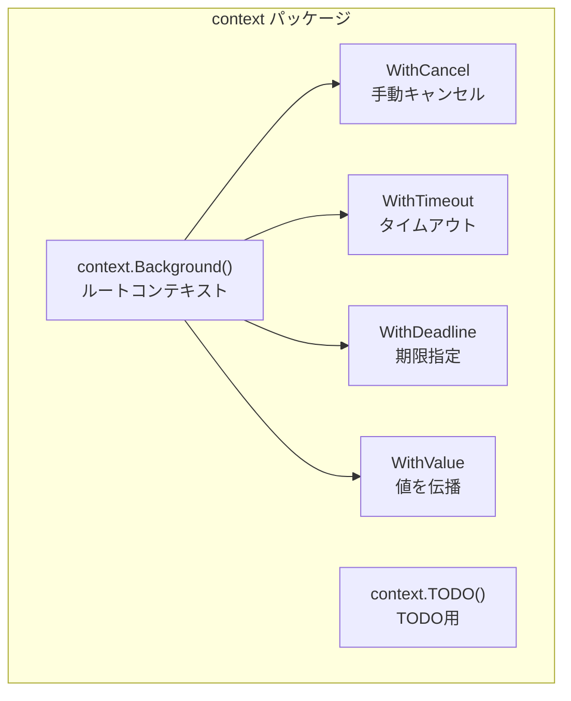

---

## 14.6 M:N スケジューリング

### GoroutineスケジューラのG-M-Pモデル

Goランタイムは、**G**（Goroutine）、**M**（Machine/OSスレッド）、**P**（Processor）の3つの概念でスケジューリングを行います。

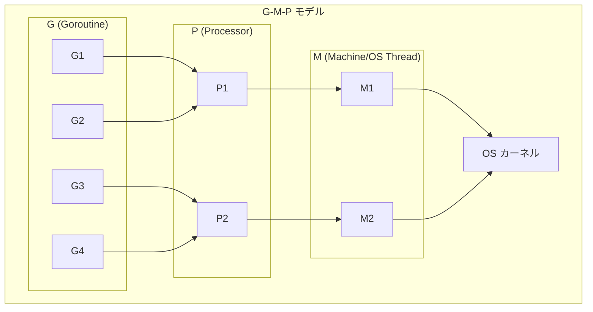

### 各コンポーネントの役割

| コンポーネント | 説明 |
|----------------|------|
| **G (Goroutine)** | 実行するコード、スタック、状態を持つ軽量スレッド |
| **M (Machine)** | OSスレッド。Gを実際に実行する |
| **P (Processor)** | スケジューリングのコンテキスト。ローカルキューを持つ |

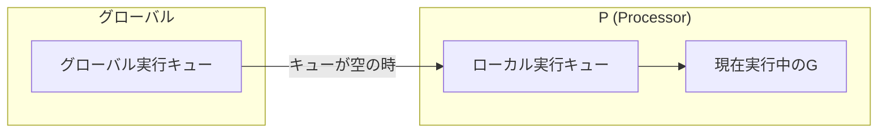

### GOMAXPROCS

`GOMAXPROCS`は、同時に実行できるPの数（≒使用するCPUコア数）を設定します。

```go
package main

import (
    "fmt"
    "runtime"
)

func main() {
    // 現在の GOMAXPROCS を取得
    n := runtime.GOMAXPROCS(0)
    fmt.Println("Current GOMAXPROCS:", n)
    
    // 利用可能な CPU 数
    numCPU := runtime.NumCPU()
    fmt.Println("Number of CPUs:", numCPU)
    
    // GOMAXPROCS を設定
    runtime.GOMAXPROCS(4)
    
    // 現在の goroutine 数
    fmt.Println("Number of goroutines:", runtime.NumGoroutine())
}
```

### Work Stealing

Pのローカルキューが空になると、他のPからGを「盗む」ことで負荷分散を行います。

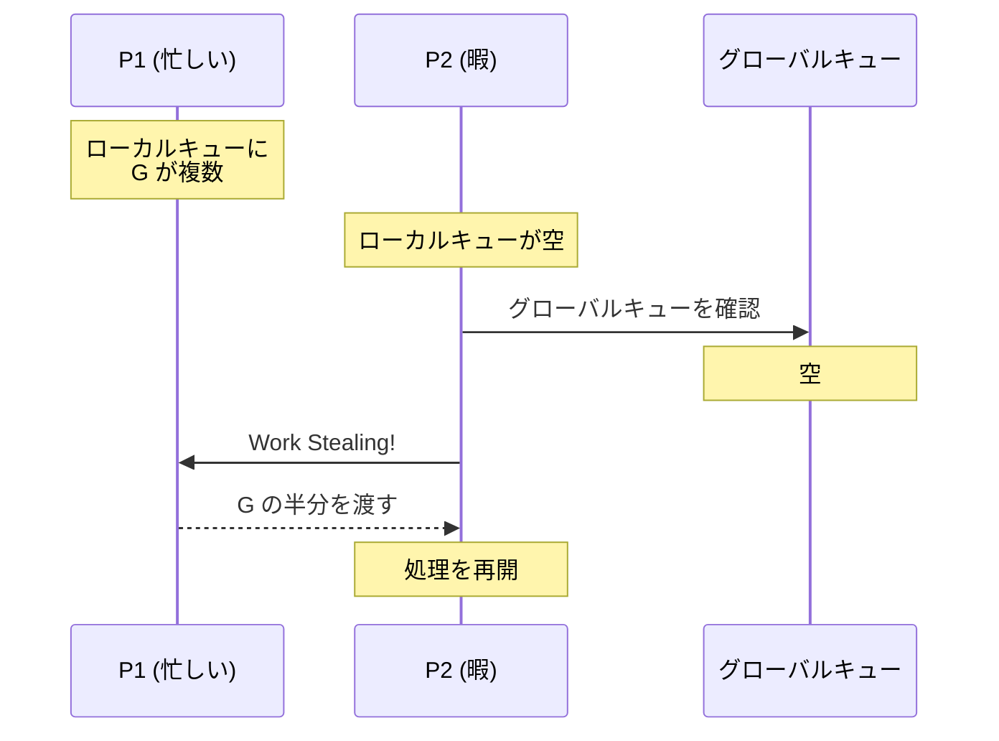

### Goroutineの状態遷移

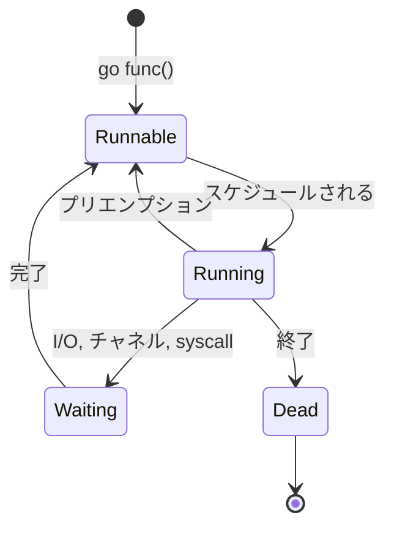

### システムコールとネットワークポーリング

```go
// システムコール中のスケジューリング
// MがブロッキングI/Oでブロックすると、
// Pは別のMにアタッチされる

package main

import (
    "fmt"
    "os"
    "time"
)

func blockingIO() {
    // ブロッキングシステムコール
    data := make([]byte, 1024)
    os.Stdin.Read(data)  // この間、Mはブロック
    fmt.Println("Read:", string(data))
}

func asyncWork() {
    for {
        fmt.Println("Async work...")
        time.Sleep(500 * time.Millisecond)
    }
}

func main() {
    go asyncWork()  // ブロッキングIO中も動き続ける
    blockingIO()
}
```

---

## 14.7 同期プリミティブ

### sync.Mutex

```go
package main

import (
    "fmt"
    "sync"
)

type Counter struct {
    mu    sync.Mutex
    value int
}

func (c *Counter) Increment() {
    c.mu.Lock()
    defer c.mu.Unlock()
    c.value++
}

func (c *Counter) Value() int {
    c.mu.Lock()
    defer c.mu.Unlock()
    return c.value
}

func main() {
    counter := &Counter{}
    var wg sync.WaitGroup
    
    for i := 0; i < 1000; i++ {
        wg.Add(1)
        go func() {
            defer wg.Done()
            counter.Increment()
        }()
    }
    
    wg.Wait()
    fmt.Println("Counter:", counter.Value())  // 1000
}
```

### sync.RWMutex

```go
package main

import (
    "fmt"
    "sync"
    "time"
)

type Cache struct {
    mu   sync.RWMutex
    data map[string]string
}

func (c *Cache) Get(key string) (string, bool) {
    c.mu.RLock()  // 読み取りロック
    defer c.mu.RUnlock()
    value, ok := c.data[key]
    return value, ok
}

func (c *Cache) Set(key, value string) {
    c.mu.Lock()  // 書き込みロック
    defer c.mu.Unlock()
    c.data[key] = value
}

func main() {
    cache := &Cache{data: make(map[string]string)}
    
    // 書き込み
    go func() {
        for i := 0; i < 10; i++ {
            cache.Set(fmt.Sprintf("key%d", i), fmt.Sprintf("value%d", i))
            time.Sleep(10 * time.Millisecond)
        }
    }()
    
    // 読み取り（複数同時可能）
    var wg sync.WaitGroup
    for i := 0; i < 3; i++ {
        wg.Add(1)
        go func(id int) {
            defer wg.Done()
            for j := 0; j < 20; j++ {
                if val, ok := cache.Get("key5"); ok {
                    fmt.Printf("Reader %d: %s\n", id, val)
                }
                time.Sleep(5 * time.Millisecond)
            }
        }(i)
    }
    
    wg.Wait()
}
```

### sync.Once

```go
package main

import (
    "fmt"
    "sync"
)

var once sync.Once
var instance *Singleton

type Singleton struct {
    value string
}

func GetInstance() *Singleton {
    once.Do(func() {
        fmt.Println("Creating singleton...")
        instance = &Singleton{value: "I am the one"}
    })
    return instance
}

func main() {
    var wg sync.WaitGroup
    
    for i := 0; i < 10; i++ {
        wg.Add(1)
        go func() {
            defer wg.Done()
            s := GetInstance()
            fmt.Println(s.value)
        }()
    }
    
    wg.Wait()
    // "Creating singleton..." は1回だけ表示される
}
```

### sync.Cond

```go
package main

import (
    "fmt"
    "sync"
    "time"
)

func main() {
    var mu sync.Mutex
    cond := sync.NewCond(&mu)
    
    ready := false
    
    // 待機する goroutine
    go func() {
        mu.Lock()
        for !ready {
            cond.Wait()  // 条件が満たされるまで待機
        }
        fmt.Println("Worker: 条件が満たされました!")
        mu.Unlock()
    }()
    
    // 条件を設定する goroutine
    time.Sleep(time.Second)
    mu.Lock()
    ready = true
    cond.Signal()  // 1つの待機者に通知
    // cond.Broadcast()  // すべての待機者に通知
    mu.Unlock()
    
    time.Sleep(100 * time.Millisecond)
}
```

### sync/atomic

```go
package main

import (
    "fmt"
    "sync"
    "sync/atomic"
)

func main() {
    var counter int64 = 0
    var wg sync.WaitGroup
    
    for i := 0; i < 1000; i++ {
        wg.Add(1)
        go func() {
            defer wg.Done()
            atomic.AddInt64(&counter, 1)  // アトミックに加算
        }()
    }
    
    wg.Wait()
    fmt.Println("Counter:", atomic.LoadInt64(&counter))  // 1000
}
```

---

## 14.8 まとめ

この章では、Goの並行処理について詳しく学びました。

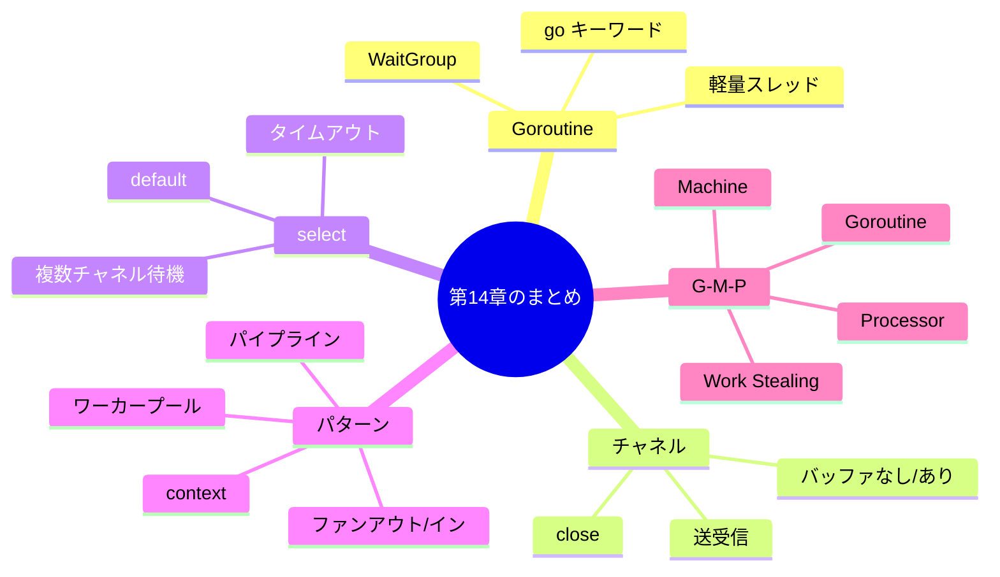

### 重要なポイント

#### 1. Goroutineは軽量で大量に生成可能

Goroutineは初期スタック2KBと軽量で、数百万同時実行も可能です。`go`キーワードで簡単に起動でき、ランタイムが効率的にスケジューリングします。

#### 2. チャネルはGoroutine間の安全な通信手段

チャネルを使うことで、ロックなしで安全にデータを受け渡せます。バッファなしチャネルは同期にも使えます。

#### 3. selectで複数チャネルを効率的に処理

select文で複数のチャネル操作を同時に待機でき、タイムアウトや非ブロッキング操作も簡単に実装できます。

#### 4. G-M-PモデルでM:Nスケジューリングを実現

GoランタイムはOSスレッドより多くのGoroutineを効率的に実行します。Work Stealingにより負荷が均等に分散されます。

---

## 📝 練習問題

1. **Goroutineとスレッドの違いを説明してください。**
   
   ヒント：スタックサイズ、スケジューリング、生成コストについて考えてください。

2. **バッファなしチャネルとバッファ付きチャネルの動作の違いを説明してください。**
   
   ヒント：送信・受信時のブロッキング動作について考えてください。

3. **以下のコードの問題点を指摘し、修正してください。**

   ```go
   func main() {
       ch := make(chan int)
       
       go func() {
           for i := 0; i < 5; i++ {
               ch <- i
           }
       }()
       
       for v := range ch {
           fmt.Println(v)
       }
   }
   ```
   
   ヒント：チャネルのクローズについて考えてください。

4. **ワーカープールパターンを使って、10個のURLを3つのワーカーで並行処理するコードを書いてください。**
   
   ヒント：ジョブチャネルと結果チャネルを使用してください。

5. **G-M-Pモデルにおける「Work Stealing」の仕組みと、それがもたらす利点を説明してください。**
   
   ヒント：負荷分散とレイテンシについて考えてください。

---

## 🔗 次の章へ

[第15章: C# / .NET](./15-csharp.md) では、C#のTask、async/await、SynchronizationContext、ValueTaskについて詳しく学びます。

---

[← 目次に戻る](../index.md) | [← 前章: Rust](./13-rust.md)

