# 第15章: C# / .NET

> 🎯 **この章の目標**: C#のTask、async/awaitパターン、SynchronizationContext、ValueTaskを理解し、.NETの非同期処理をマスターする

---

## 15.1 .NETの非同期処理の歴史

### 非同期プログラミングモデルの進化

.NETは、非同期処理のパターンを段階的に進化させてきました。

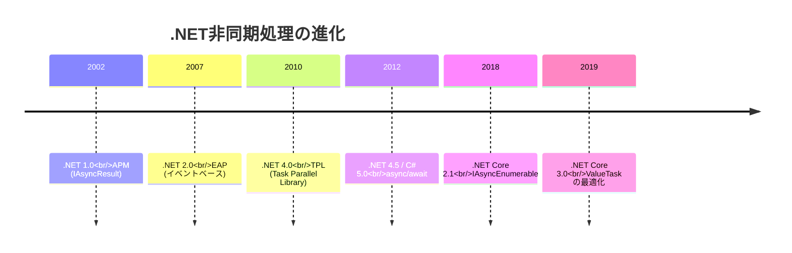

### APM（Asynchronous Programming Model）

最初の非同期パターンで、BeginXxx/EndXxxメソッドを使います。

```csharp
// APM パターン（古い方法）
public class FileReaderAPM
{
    public IAsyncResult BeginRead(byte[] buffer, int offset, int count, 
                                   AsyncCallback callback, object state)
    {
        // 非同期操作を開始
        return stream.BeginRead(buffer, offset, count, callback, state);
    }
    
    public int EndRead(IAsyncResult asyncResult)
    {
        // 非同期操作を完了
        return stream.EndRead(asyncResult);
    }
}

// 使用例
byte[] buffer = new byte[1024];
stream.BeginRead(buffer, 0, buffer.Length, ar =>
{
    int bytesRead = stream.EndRead(ar);
    Console.WriteLine($"Read {bytesRead} bytes");
}, null);
```

### EAP（Event-based Asynchronous Pattern）

イベントとコールバックを使うパターンです。

```csharp
// EAP パターン（古い方法）
var client = new WebClient();

client.DownloadStringCompleted += (sender, e) =>
{
    if (e.Error != null)
    {
        Console.WriteLine($"Error: {e.Error.Message}");
    }
    else
    {
        Console.WriteLine($"Downloaded: {e.Result.Length} chars");
    }
};

client.DownloadStringAsync(new Uri("https://example.com"));
```

### TAP（Task-based Asynchronous Pattern）

現代の.NETで推奨されるパターンです。

```csharp
// TAP パターン（推奨）
public async Task<string> DownloadStringAsync(string url)
{
    using var client = new HttpClient();
    return await client.GetStringAsync(url);
}
```

---

## 15.2 Task と Task<T>

### Taskとは

**Task**は、非同期操作を表すクラスです。`Task`は戻り値なし、`Task<T>`は戻り値ありの非同期操作を表します。

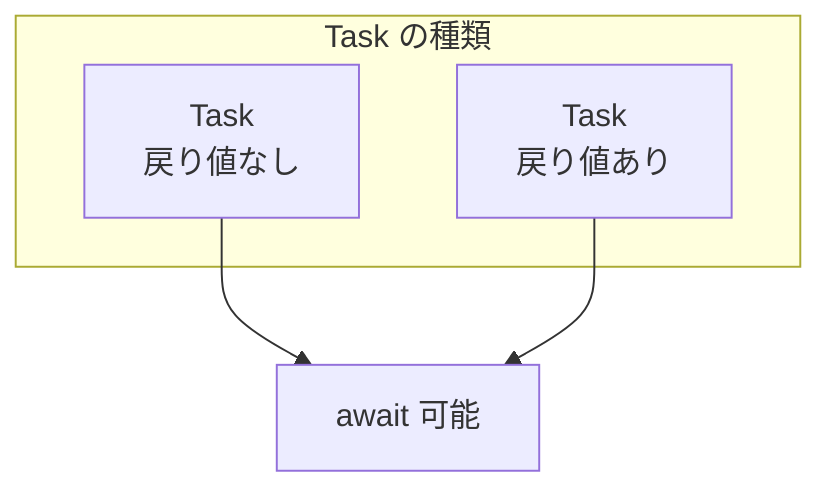

### Taskの作成

```csharp
using System;
using System.Threading.Tasks;

class Program
{
    static async Task Main()
    {
        // Task.Run: スレッドプールで実行
        Task task1 = Task.Run(() =>
        {
            Console.WriteLine("Task.Run executed");
        });
        await task1;
        
        // Task<T>.Run: 戻り値あり
        Task<int> task2 = Task.Run(() =>
        {
            return 42;
        });
        int result = await task2;
        Console.WriteLine($"Result: {result}");
        
        // Task.FromResult: 既に完了したTask
        Task<string> completed = Task.FromResult("Already done");
        Console.WriteLine(await completed);
        
        // Task.CompletedTask: 完了済みの空のTask
        await Task.CompletedTask;
        
        // Task.Delay: 非同期の遅延
        await Task.Delay(1000);  // 1秒待機
    }
}
```

### Taskの状態

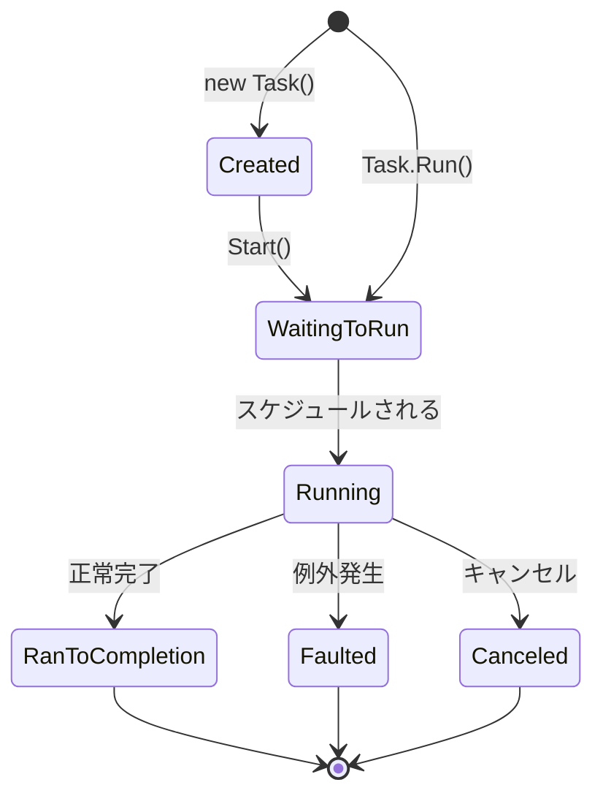

```csharp
var task = Task.Run(async () =>
{
    await Task.Delay(1000);
    return 42;
});

Console.WriteLine($"Status: {task.Status}");  // WaitingToRun or Running

await task;

Console.WriteLine($"Status: {task.Status}");  // RanToCompletion
Console.WriteLine($"IsCompleted: {task.IsCompleted}");  // True
Console.WriteLine($"IsCompletedSuccessfully: {task.IsCompletedSuccessfully}");  // True
```

### 複数のTaskの待機

```csharp
using System;
using System.Threading.Tasks;

class Program
{
    static async Task<string> FetchAsync(string name, int delay)
    {
        await Task.Delay(delay);
        return $"{name}: done";
    }
    
    static async Task Main()
    {
        // Task.WhenAll: すべてが完了するまで待機
        var tasks = new[]
        {
            FetchAsync("A", 1000),
            FetchAsync("B", 500),
            FetchAsync("C", 1500)
        };
        
        string[] results = await Task.WhenAll(tasks);
        foreach (var result in results)
        {
            Console.WriteLine(result);
        }
        
        // Task.WhenAny: 最初に完了したものを取得
        var tasks2 = new[]
        {
            FetchAsync("X", 1000),
            FetchAsync("Y", 500),
            FetchAsync("Z", 1500)
        };
        
        Task<string> firstCompleted = await Task.WhenAny(tasks2);
        Console.WriteLine($"First: {await firstCompleted}");
    }
}
```

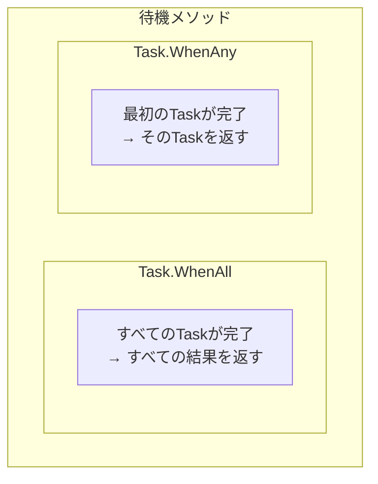

### 例外処理

```csharp
using System;
using System.Threading.Tasks;

class Program
{
    static async Task ThrowAsync()
    {
        await Task.Delay(100);
        throw new InvalidOperationException("Something went wrong");
    }
    
    static async Task Main()
    {
        // 単一のTask
        try
        {
            await ThrowAsync();
        }
        catch (InvalidOperationException ex)
        {
            Console.WriteLine($"Caught: {ex.Message}");
        }
        
        // 複数のTask（WhenAll）
        var tasks = new[]
        {
            ThrowAsync(),
            ThrowAsync()
        };
        
        try
        {
            await Task.WhenAll(tasks);
        }
        catch (InvalidOperationException ex)
        {
            // 最初の例外のみがスローされる
            Console.WriteLine($"Caught: {ex.Message}");
            
            // すべての例外を取得するには
            var allTasks = Task.WhenAll(tasks);
            try
            {
                await allTasks;
            }
            catch
            {
                foreach (var innerEx in allTasks.Exception!.InnerExceptions)
                {
                    Console.WriteLine($"Inner: {innerEx.Message}");
                }
            }
        }
    }
}
```

---

## 15.3 async/await

### 基本構文

```csharp
using System;
using System.Net.Http;
using System.Threading.Tasks;

class Program
{
    // async メソッドは Task または Task<T> を返す
    static async Task<string> FetchDataAsync(string url)
    {
        using var client = new HttpClient();
        
        // await で非同期操作の完了を待つ
        string content = await client.GetStringAsync(url);
        
        return content;
    }
    
    static async Task Main()
    {
        string result = await FetchDataAsync("https://example.com");
        Console.WriteLine($"Length: {result.Length}");
    }
}
```

### asyncメソッドの変換

コンパイラは`async`メソッドをステートマシンに変換します。

```csharp
// このコード
async Task<int> ExampleAsync()
{
    Console.WriteLine("Step 1");
    await Task.Delay(1000);
    Console.WriteLine("Step 2");
    await Task.Delay(1000);
    Console.WriteLine("Step 3");
    return 42;
}

// 概念的には以下のようなステートマシンに変換される
struct ExampleAsyncStateMachine : IAsyncStateMachine
{
    public int State;
    public AsyncTaskMethodBuilder<int> Builder;
    private TaskAwaiter awaiter;
    
    public void MoveNext()
    {
        switch (State)
        {
            case 0:
                Console.WriteLine("Step 1");
                awaiter = Task.Delay(1000).GetAwaiter();
                if (!awaiter.IsCompleted)
                {
                    State = 1;
                    Builder.AwaitUnsafeOnCompleted(ref awaiter, ref this);
                    return;
                }
                goto case 1;
            
            case 1:
                awaiter.GetResult();
                Console.WriteLine("Step 2");
                awaiter = Task.Delay(1000).GetAwaiter();
                if (!awaiter.IsCompleted)
                {
                    State = 2;
                    Builder.AwaitUnsafeOnCompleted(ref awaiter, ref this);
                    return;
                }
                goto case 2;
            
            case 2:
                awaiter.GetResult();
                Console.WriteLine("Step 3");
                Builder.SetResult(42);
                return;
        }
    }
}
```

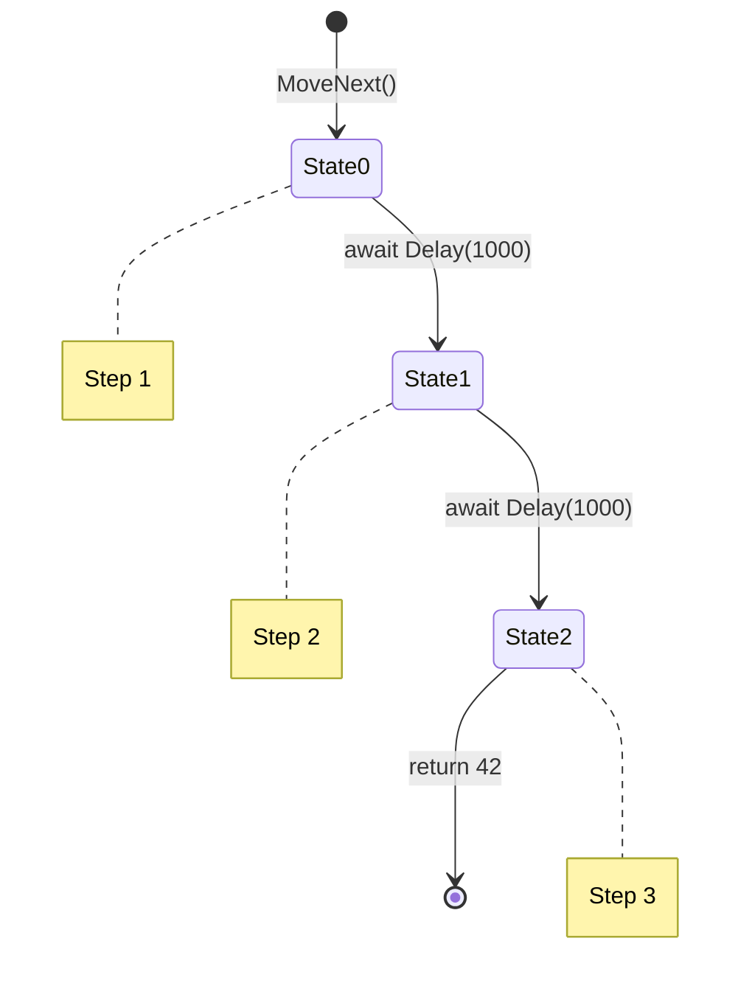

### async void の注意点

```csharp
// ❌ 避けるべき: async void
async void BadAsync()
{
    await Task.Delay(1000);
    throw new Exception("This exception cannot be caught!");
}

// ✅ 推奨: async Task
async Task GoodAsync()
{
    await Task.Delay(1000);
    throw new Exception("This exception can be caught");
}

// 唯一の例外: イベントハンドラ
button.Click += async (sender, e) =>
{
    await ProcessClickAsync();
};
```

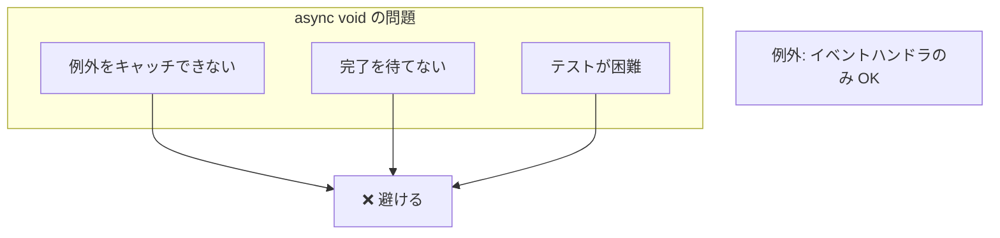

### ConfigureAwait

```csharp
using System.Threading.Tasks;

class Program
{
    async Task LibraryMethodAsync()
    {
        // ライブラリコードでは ConfigureAwait(false) を使用
        await Task.Delay(1000).ConfigureAwait(false);
        
        // この後は元のコンテキストに戻らない
        // → UIスレッドへの不要な切り替えを防ぐ
    }
    
    async Task UIMethodAsync()
    {
        // UIコードではデフォルト（ConfigureAwait(true)）を使用
        await Task.Delay(1000);
        
        // この後は元のUIスレッドで継続
        UpdateUI();
    }
}
```

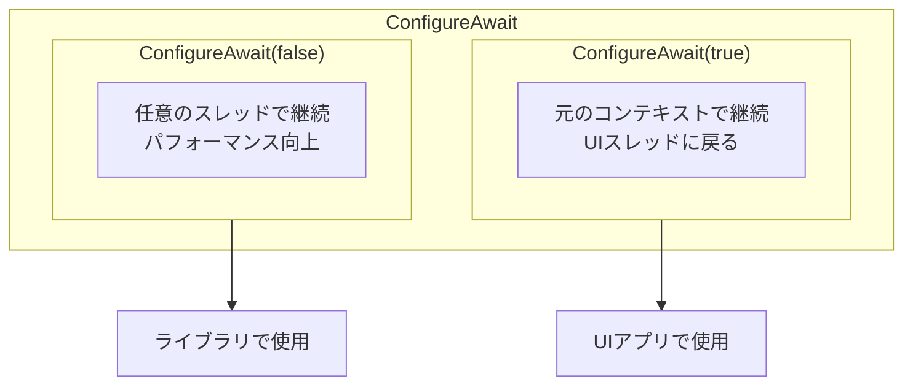

---

## 15.4 SynchronizationContext

### SynchronizationContextとは

**SynchronizationContext**は、実行コンテキストを管理し、特定のスレッドやコンテキストへのコールバックのマーシャリングを行います。

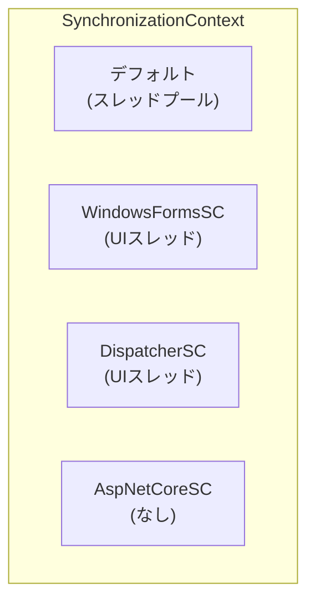

### UIスレッドとの連携

```csharp
// WPF / Windows Forms での例
public partial class MainWindow : Window
{
    private async void Button_Click(object sender, RoutedEventArgs e)
    {
        // UIスレッドで実行
        StatusLabel.Content = "Loading...";
        
        // バックグラウンドで実行
        string result = await Task.Run(() =>
        {
            Thread.Sleep(2000);
            return "Data loaded";
        });
        
        // 自動的にUIスレッドに戻る
        StatusLabel.Content = result;  // OK!
    }
}
```

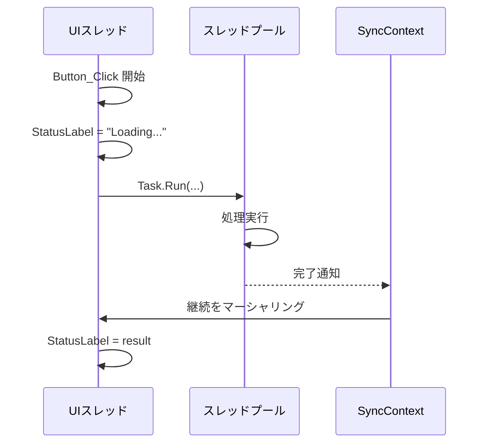

### ASP.NET Coreでの動作

ASP.NET CoreにはSynchronizationContextがありません。

```csharp
// ASP.NET Core
[ApiController]
[Route("api/[controller]")]
public class DataController : ControllerBase
{
    [HttpGet]
    public async Task<IActionResult> Get()
    {
        // ConfigureAwait(false) は不要（SCがない）
        var data = await _repository.GetDataAsync();
        
        // どのスレッドで継続されるかは不定
        // → HttpContext にアクセスする際は注意
        return Ok(data);
    }
}
```

### カスタムSynchronizationContext

```csharp
using System.Threading;

public class SingleThreadSynchronizationContext : SynchronizationContext
{
    private readonly BlockingCollection<(SendOrPostCallback, object?)> _queue
        = new BlockingCollection<(SendOrPostCallback, object?)>();
    
    public override void Post(SendOrPostCallback d, object? state)
    {
        _queue.Add((d, state));
    }
    
    public override void Send(SendOrPostCallback d, object? state)
    {
        var done = new ManualResetEventSlim(false);
        _queue.Add((s =>
        {
            d(s);
            done.Set();
        }, state));
        done.Wait();
    }
    
    public void Run()
    {
        foreach (var (callback, state) in _queue.GetConsumingEnumerable())
        {
            callback(state);
        }
    }
    
    public void Complete()
    {
        _queue.CompleteAdding();
    }
}
```

---

## 15.5 キャンセレーション

### CancellationToken

```csharp
using System;
using System.Threading;
using System.Threading.Tasks;

class Program
{
    static async Task LongRunningAsync(CancellationToken token)
    {
        for (int i = 0; i < 10; i++)
        {
            // キャンセルを確認
            token.ThrowIfCancellationRequested();
            
            Console.WriteLine($"Step {i}");
            await Task.Delay(500, token);  // トークンを渡す
        }
    }
    
    static async Task Main()
    {
        var cts = new CancellationTokenSource();
        
        // 2秒後にキャンセル
        cts.CancelAfter(TimeSpan.FromSeconds(2));
        
        try
        {
            await LongRunningAsync(cts.Token);
        }
        catch (OperationCanceledException)
        {
            Console.WriteLine("キャンセルされました");
        }
    }
}
```

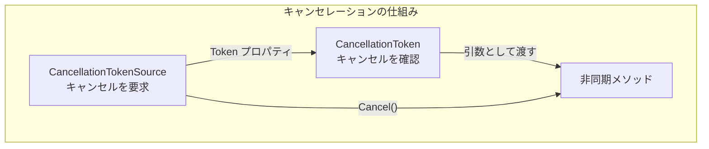

### 複数のキャンセルソースの統合

```csharp
using System.Threading;

var cts1 = new CancellationTokenSource();
var cts2 = new CancellationTokenSource();

// 複数のトークンを統合
var linkedCts = CancellationTokenSource.CreateLinkedTokenSource(
    cts1.Token, cts2.Token);

// どちらかがキャンセルされると linkedCts もキャンセル
cts1.Cancel();  // linkedCts.Token も キャンセル状態になる
```

### タイムアウト

```csharp
using System;
using System.Threading;
using System.Threading.Tasks;

static async Task<string> FetchWithTimeoutAsync(string url, TimeSpan timeout)
{
    using var cts = new CancellationTokenSource(timeout);
    
    try
    {
        using var client = new HttpClient();
        return await client.GetStringAsync(url, cts.Token);
    }
    catch (OperationCanceledException)
    {
        throw new TimeoutException($"Request to {url} timed out");
    }
}

// または Task.WhenAny を使用
static async Task<string> FetchWithTimeoutAsync2(string url, TimeSpan timeout)
{
    using var client = new HttpClient();
    var fetchTask = client.GetStringAsync(url);
    var timeoutTask = Task.Delay(timeout);
    
    var completedTask = await Task.WhenAny(fetchTask, timeoutTask);
    
    if (completedTask == timeoutTask)
    {
        throw new TimeoutException($"Request to {url} timed out");
    }
    
    return await fetchTask;
}
```

---

## 15.6 ValueTask

### ValueTaskとは

**ValueTask**は、同期的に完了する可能性が高い場合に、Taskのヒープ割り当てを避けるための構造体です。

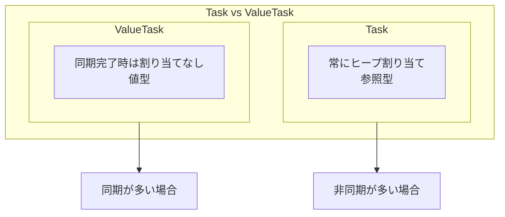

### ValueTaskの使い方

```csharp
using System.Threading.Tasks;

public class Cache<TKey, TValue>
{
    private readonly Dictionary<TKey, TValue> _cache = new();
    private readonly Func<TKey, Task<TValue>> _factory;
    
    public Cache(Func<TKey, Task<TValue>> factory)
    {
        _factory = factory;
    }
    
    // キャッシュにあれば同期的に返す → ValueTask が効果的
    public ValueTask<TValue> GetAsync(TKey key)
    {
        if (_cache.TryGetValue(key, out var value))
        {
            // 同期的に完了（ヒープ割り当てなし）
            return new ValueTask<TValue>(value);
        }
        
        // キャッシュにない場合は非同期で取得
        return new ValueTask<TValue>(FetchAndCacheAsync(key));
    }
    
    private async Task<TValue> FetchAndCacheAsync(TKey key)
    {
        var value = await _factory(key);
        _cache[key] = value;
        return value;
    }
}
```

### ValueTaskの制約

```csharp
// ❌ 複数回 await してはいけない
ValueTask<int> vt = GetValueAsync();
// await vt;
// await vt;  // 未定義動作！

// ❌ 同時に複数の操作をしてはいけない
ValueTask<int> vt2 = GetValueAsync();
// var task1 = vt2.AsTask();  // OK
// var task2 = vt2.AsTask();  // NG: 同じValueTaskから

// ✅ 一度だけ await
ValueTask<int> vt3 = GetValueAsync();
int result = await vt3;

// ✅ 複数回使う場合は Task に変換
ValueTask<int> vt4 = GetValueAsync();
Task<int> task = vt4.AsTask();
await task;
await task;  // OK
```

### IValueTaskSource

高度なシナリオでは、カスタムの`IValueTaskSource`を実装できます。

```csharp
// System.Threading.Channels での例
var channel = Channel.CreateUnbounded<int>();

// ValueTask を返すが、内部で IValueTaskSource を使用
ValueTask<int> readTask = channel.Reader.ReadAsync();
```

---

## 15.7 非同期ストリーム（IAsyncEnumerable）

### IAsyncEnumerableとは

C# 8.0で導入された、非同期的に値を生成するイテレータです。

```csharp
using System;
using System.Collections.Generic;
using System.Threading.Tasks;

class Program
{
    // 非同期イテレータ
    static async IAsyncEnumerable<int> GenerateAsync()
    {
        for (int i = 0; i < 5; i++)
        {
            await Task.Delay(500);
            yield return i;
        }
    }
    
    static async Task Main()
    {
        // await foreach で消費
        await foreach (var item in GenerateAsync())
        {
            Console.WriteLine(item);
        }
    }
}
```

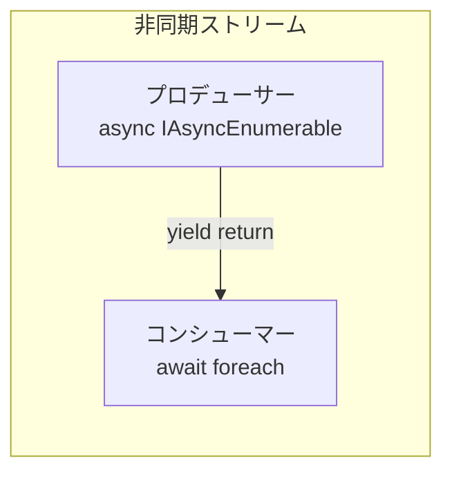

### キャンセレーション

```csharp
using System.Runtime.CompilerServices;

static async IAsyncEnumerable<int> GenerateAsync(
    [EnumeratorCancellation] CancellationToken token = default)
{
    for (int i = 0; ; i++)
    {
        token.ThrowIfCancellationRequested();
        await Task.Delay(500, token);
        yield return i;
    }
}

// 使用例
var cts = new CancellationTokenSource();
cts.CancelAfter(3000);

try
{
    await foreach (var item in GenerateAsync(cts.Token))
    {
        Console.WriteLine(item);
    }
}
catch (OperationCanceledException)
{
    Console.WriteLine("キャンセルされました");
}
```

### LINQとの統合

```csharp
using System.Linq;

static async Task Main()
{
    // System.Linq.Async パッケージを使用
    var results = await GenerateAsync()
        .Where(x => x % 2 == 0)
        .Select(x => x * 10)
        .Take(3)
        .ToListAsync();
    
    Console.WriteLine(string.Join(", ", results));
}
```

---

## 15.8 並列処理（Parallel）

### Parallel クラス

```csharp
using System;
using System.Threading.Tasks;

class Program
{
    static void Main()
    {
        // Parallel.For
        Parallel.For(0, 100, i =>
        {
            Console.WriteLine($"Processing {i} on thread {Thread.CurrentThread.ManagedThreadId}");
        });
        
        // Parallel.ForEach
        var items = Enumerable.Range(0, 100);
        Parallel.ForEach(items, item =>
        {
            Process(item);
        });
        
        // Parallel.ForEachAsync (C# 10 / .NET 6)
        await Parallel.ForEachAsync(items, async (item, token) =>
        {
            await ProcessAsync(item, token);
        });
        
        // Parallel.Invoke
        Parallel.Invoke(
            () => Task1(),
            () => Task2(),
            () => Task3()
        );
    }
}
```

### 並列度の制御

```csharp
// MaxDegreeOfParallelism で並列度を制御
var options = new ParallelOptions
{
    MaxDegreeOfParallelism = 4,
    CancellationToken = cts.Token
};

Parallel.ForEach(items, options, item =>
{
    Process(item);
});

// .NET 6+ Parallel.ForEachAsync
await Parallel.ForEachAsync(items, 
    new ParallelOptions { MaxDegreeOfParallelism = 4 },
    async (item, token) =>
    {
        await ProcessAsync(item, token);
    });
```

### PLINQとの比較

```csharp
// PLINQ
var results = items
    .AsParallel()
    .WithDegreeOfParallelism(4)
    .Where(x => x % 2 == 0)
    .Select(x => x * 2)
    .ToList();

// Parallel.ForEach
var results2 = new ConcurrentBag<int>();
Parallel.ForEach(items, item =>
{
    if (item % 2 == 0)
    {
        results2.Add(item * 2);
    }
});
```

---

## 15.9 チャネル（System.Threading.Channels）

### Channelとは

Goのチャネルに似た、プロデューサー・コンシューマーパターンの実装です。

```csharp
using System.Threading.Channels;

class Program
{
    static async Task Main()
    {
        // 容量制限なしのチャネル
        var channel = Channel.CreateUnbounded<int>();
        
        // プロデューサー
        var producer = Task.Run(async () =>
        {
            for (int i = 0; i < 10; i++)
            {
                await channel.Writer.WriteAsync(i);
                Console.WriteLine($"Produced: {i}");
            }
            channel.Writer.Complete();
        });
        
        // コンシューマー
        var consumer = Task.Run(async () =>
        {
            await foreach (var item in channel.Reader.ReadAllAsync())
            {
                Console.WriteLine($"Consumed: {item}");
                await Task.Delay(100);
            }
        });
        
        await Task.WhenAll(producer, consumer);
    }
}
```

### バッファ付きチャネル

```csharp
// 容量制限ありのチャネル
var channel = Channel.CreateBounded<int>(new BoundedChannelOptions(10)
{
    FullMode = BoundedChannelFullMode.Wait,  // 満杯時は待機
    // FullMode = BoundedChannelFullMode.DropOldest,  // 古いものを破棄
    // FullMode = BoundedChannelFullMode.DropNewest,  // 新しいものを破棄
    // FullMode = BoundedChannelFullMode.DropWrite,   // 書き込みを破棄
});
```

### マルチプロデューサー・マルチコンシューマー

```csharp
var channel = Channel.CreateUnbounded<int>(new UnboundedChannelOptions
{
    SingleWriter = false,  // 複数のライター
    SingleReader = false   // 複数のリーダー
});

// 複数のプロデューサー
for (int i = 0; i < 3; i++)
{
    int producerId = i;
    _ = Task.Run(async () =>
    {
        for (int j = 0; j < 10; j++)
        {
            await channel.Writer.WriteAsync(producerId * 100 + j);
        }
    });
}

// 複数のコンシューマー
for (int i = 0; i < 2; i++)
{
    int consumerId = i;
    _ = Task.Run(async () =>
    {
        await foreach (var item in channel.Reader.ReadAllAsync())
        {
            Console.WriteLine($"Consumer {consumerId}: {item}");
        }
    });
}
```

---

## 15.10 まとめ

この章では、C#/.NETの非同期処理について詳しく学びました。

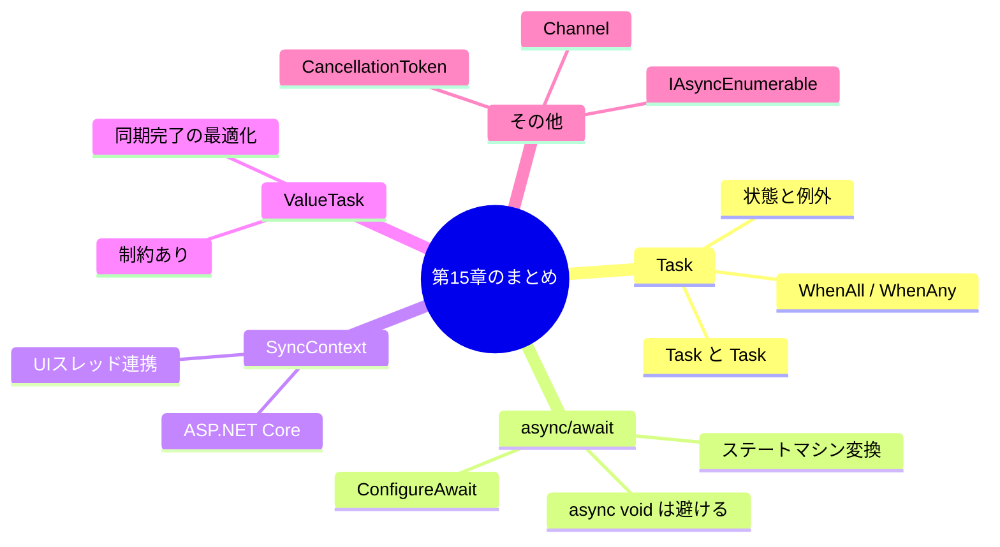

### 重要なポイント

#### 1. async/awaitはステートマシンに変換される

コンパイラが`async`メソッドをステートマシンに変換します。各`await`ポイントが状態遷移のポイントになります。

#### 2. SynchronizationContextが継続のスレッドを決定

UIアプリケーションでは、`await`後に元のUIスレッドに戻ります。ライブラリコードでは`ConfigureAwait(false)`を使用してパフォーマンスを向上させましょう。

#### 3. ValueTaskは同期完了が多い場合に有効

キャッシュからの読み取りなど、同期的に完了する可能性が高い場合は`ValueTask`を使用してヒープ割り当てを削減できます。

#### 4. async voidは避ける

例外をキャッチできず、完了を待てないため、イベントハンドラ以外では`async Task`を使用しましょう。

---

## 📝 練習問題

1. **Task.WhenAllとTask.WhenAnyの違いを説明してください。**
   
   ヒント：待機の条件と戻り値について考えてください。

2. **以下のコードの問題点を指摘し、修正してください。**

   ```csharp
   async void ProcessAsync()
   {
       await Task.Delay(1000);
       throw new Exception("Error!");
   }
   ```
   
   ヒント：async voidの問題点について考えてください。

3. **ConfigureAwait(false)を使うべき場合とそうでない場合を説明してください。**
   
   ヒント：UIコードとライブラリコードの違いについて考えてください。

4. **ValueTaskとTaskの使い分けの基準を説明してください。**
   
   ヒント：同期完了の頻度とヒープ割り当てについて考えてください。

5. **CancellationTokenを使って、5秒でタイムアウトする非同期HTTPリクエストを実装してください。**
   
   ヒント：CancellationTokenSourceとHttpClientを組み合わせてください。

---

## 🔗 次の章へ

[第16章: Java](./16-java.md) では、JavaのExecutorService、CompletableFuture、Project Loom、Reactive Streamsについて詳しく学びます。

---

[← 目次に戻る](../index.md) | [← 前章: Go](./14-go.md)

