# 第16章: Java

> 🎯 **この章の目標**: JavaのExecutorService、CompletableFuture、Project Loom（Virtual Threads）、Reactive Streamsを理解し、Javaの並行処理をマスターする

---

## 16.1 Javaの並行処理の歴史

### 進化の歴史

Javaは初期から並行処理をサポートし、段階的に進化してきました。

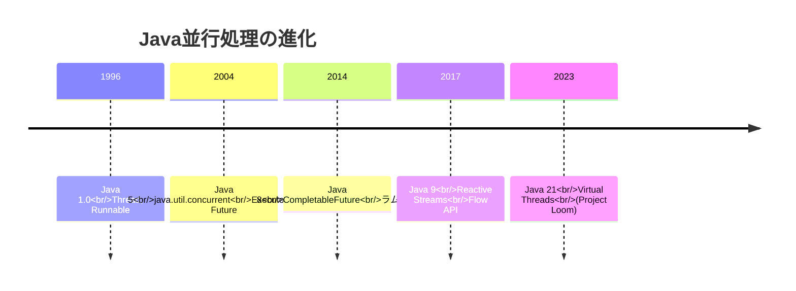

### 基本的なスレッド

```java
// Thread を継承
class MyThread extends Thread {
    @Override
    public void run() {
        System.out.println("Thread: " + Thread.currentThread().getName());
    }
}

// Runnable を実装
class MyRunnable implements Runnable {
    @Override
    public void run() {
        System.out.println("Runnable: " + Thread.currentThread().getName());
    }
}

public class Main {
    public static void main(String[] args) throws InterruptedException {
        // Thread を使用
        Thread t1 = new MyThread();
        t1.start();
        
        // Runnable を使用
        Thread t2 = new Thread(new MyRunnable());
        t2.start();
        
        // ラムダ式（Java 8以降）
        Thread t3 = new Thread(() -> {
            System.out.println("Lambda: " + Thread.currentThread().getName());
        });
        t3.start();
        
        // 終了を待機
        t1.join();
        t2.join();
        t3.join();
    }
}
```

---

## 16.2 ExecutorServiceとスレッドプール

### ExecutorServiceとは

**ExecutorService**は、スレッドプールを管理し、タスクの実行を抽象化するインターフェースです。

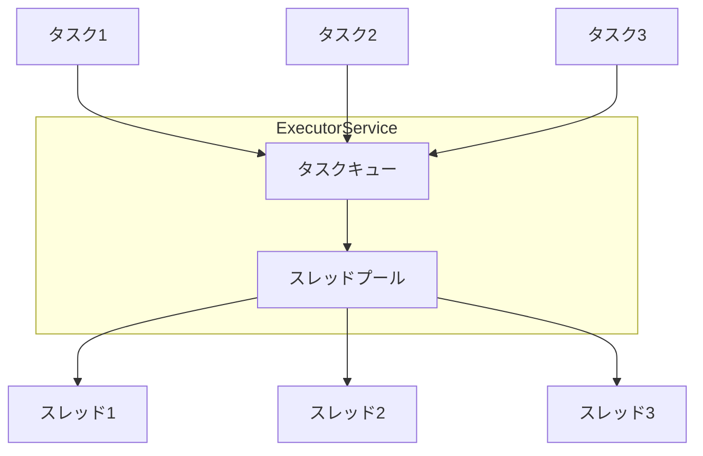

### スレッドプールの種類

```java
import java.util.concurrent.*;

public class ExecutorExamples {
    public static void main(String[] args) throws Exception {
        // 固定サイズのスレッドプール
        ExecutorService fixed = Executors.newFixedThreadPool(4);
        
        // キャッシュ付きスレッドプール（必要に応じてスレッド作成）
        ExecutorService cached = Executors.newCachedThreadPool();
        
        // 単一スレッド（順次実行を保証）
        ExecutorService single = Executors.newSingleThreadExecutor();
        
        // スケジュール実行可能
        ScheduledExecutorService scheduled = Executors.newScheduledThreadPool(2);
        
        // Work-Stealingプール（Java 8）
        ExecutorService workStealing = Executors.newWorkStealingPool();
        
        // カスタムスレッドプール
        ThreadPoolExecutor custom = new ThreadPoolExecutor(
            2,                      // コアスレッド数
            4,                      // 最大スレッド数
            60L, TimeUnit.SECONDS,  // アイドルスレッドの生存時間
            new LinkedBlockingQueue<>(100)  // タスクキュー
        );
        
        // シャットダウン
        fixed.shutdown();
        cached.shutdown();
        single.shutdown();
        scheduled.shutdown();
        workStealing.shutdown();
        custom.shutdown();
    }
}
```

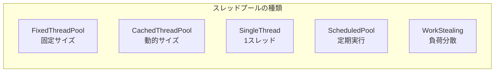

### タスクの投入と結果の取得

```java
import java.util.concurrent.*;
import java.util.List;
import java.util.ArrayList;

public class ExecutorTaskExample {
    public static void main(String[] args) throws Exception {
        ExecutorService executor = Executors.newFixedThreadPool(4);
        
        try {
            // Runnable: 戻り値なし
            executor.execute(() -> {
                System.out.println("Execute: " + Thread.currentThread().getName());
            });
            
            // Callable: 戻り値あり
            Future<Integer> future = executor.submit(() -> {
                Thread.sleep(1000);
                return 42;
            });
            
            // 結果を待機
            System.out.println("Result: " + future.get());
            
            // タイムアウト付き
            Future<String> futureWithTimeout = executor.submit(() -> {
                Thread.sleep(5000);
                return "Done";
            });
            
            try {
                String result = futureWithTimeout.get(2, TimeUnit.SECONDS);
            } catch (TimeoutException e) {
                System.out.println("Timeout!");
                futureWithTimeout.cancel(true);
            }
            
            // 複数のタスクを一括投入
            List<Callable<Integer>> tasks = List.of(
                () -> { Thread.sleep(1000); return 1; },
                () -> { Thread.sleep(500); return 2; },
                () -> { Thread.sleep(1500); return 3; }
            );
            
            // すべて完了を待機
            List<Future<Integer>> futures = executor.invokeAll(tasks);
            for (Future<Integer> f : futures) {
                System.out.println("Result: " + f.get());
            }
            
            // 最初に完了したものを取得
            Integer first = executor.invokeAny(tasks);
            System.out.println("First completed: " + first);
            
        } finally {
            executor.shutdown();
            executor.awaitTermination(10, TimeUnit.SECONDS);
        }
    }
}
```

### Futureの状態

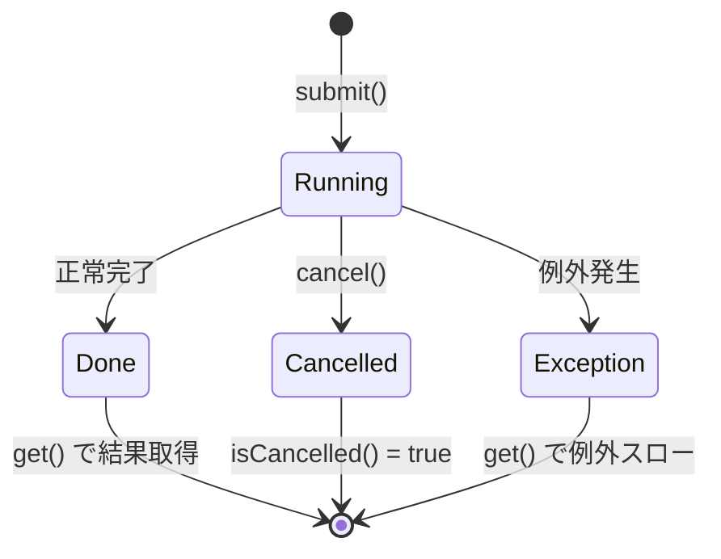

### スレッドプールのベストプラクティス

```java
// ❌ 避けるべき: Executors.newFixedThreadPool の直接使用
// タスクキューが無制限でメモリリークの可能性
ExecutorService bad = Executors.newFixedThreadPool(10);

// ✅ 推奨: ThreadPoolExecutor で明示的に設定
ThreadPoolExecutor good = new ThreadPoolExecutor(
    10,                             // コアスレッド数
    20,                             // 最大スレッド数
    60L, TimeUnit.SECONDS,          // アイドルタイムアウト
    new LinkedBlockingQueue<>(1000), // 制限付きキュー
    new ThreadPoolExecutor.CallerRunsPolicy()  // 拒否ポリシー
);

// ✅ try-with-resources（Java 19+）
try (var executor = Executors.newVirtualThreadPerTaskExecutor()) {
    executor.submit(() -> doWork());
}
```

---

## 16.3 CompletableFuture

### CompletableFutureとは

**CompletableFuture**は、非同期計算を表現し、合成可能な方法で連鎖させることができるクラスです。

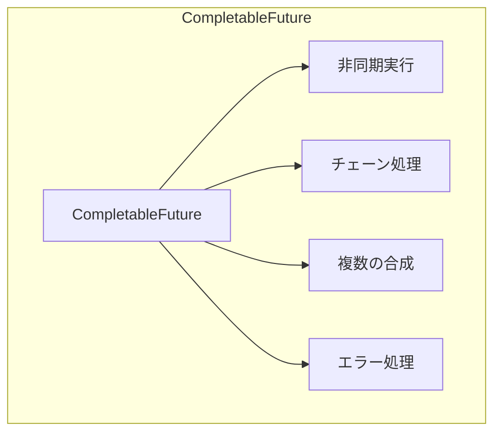

### 基本的な使い方

```java
import java.util.concurrent.*;

public class CompletableFutureBasics {
    public static void main(String[] args) throws Exception {
        // supplyAsync: 値を返す非同期タスク
        CompletableFuture<String> future1 = CompletableFuture.supplyAsync(() -> {
            sleep(1000);
            return "Hello";
        });
        
        // runAsync: 値を返さない非同期タスク
        CompletableFuture<Void> future2 = CompletableFuture.runAsync(() -> {
            sleep(1000);
            System.out.println("Task completed");
        });
        
        // 結果を取得
        String result = future1.get();
        System.out.println(result);
        
        // 既に完了した CompletableFuture
        CompletableFuture<String> completed = CompletableFuture.completedFuture("Done");
        
        // 失敗した CompletableFuture
        CompletableFuture<String> failed = CompletableFuture.failedFuture(
            new RuntimeException("Error")
        );
    }
    
    private static void sleep(long millis) {
        try { Thread.sleep(millis); } catch (InterruptedException e) { }
    }
}
```

### チェーン処理

```java
import java.util.concurrent.*;

public class CompletableFutureChaining {
    public static void main(String[] args) throws Exception {
        CompletableFuture<String> result = CompletableFuture
            // 非同期でデータ取得
            .supplyAsync(() -> {
                System.out.println("Step 1: " + Thread.currentThread().getName());
                return fetchData();
            })
            // 変換（同じスレッドで実行される可能性）
            .thenApply(data -> {
                System.out.println("Step 2: " + Thread.currentThread().getName());
                return data.toUpperCase();
            })
            // 変換（必ず別スレッドで実行）
            .thenApplyAsync(data -> {
                System.out.println("Step 3: " + Thread.currentThread().getName());
                return data + "!";
            })
            // 別の非同期操作に連鎖
            .thenCompose(data -> {
                return saveDataAsync(data);
            });
        
        System.out.println("Final: " + result.get());
    }
    
    private static String fetchData() {
        return "hello";
    }
    
    private static CompletableFuture<String> saveDataAsync(String data) {
        return CompletableFuture.supplyAsync(() -> {
            return "Saved: " + data;
        });
    }
}
```

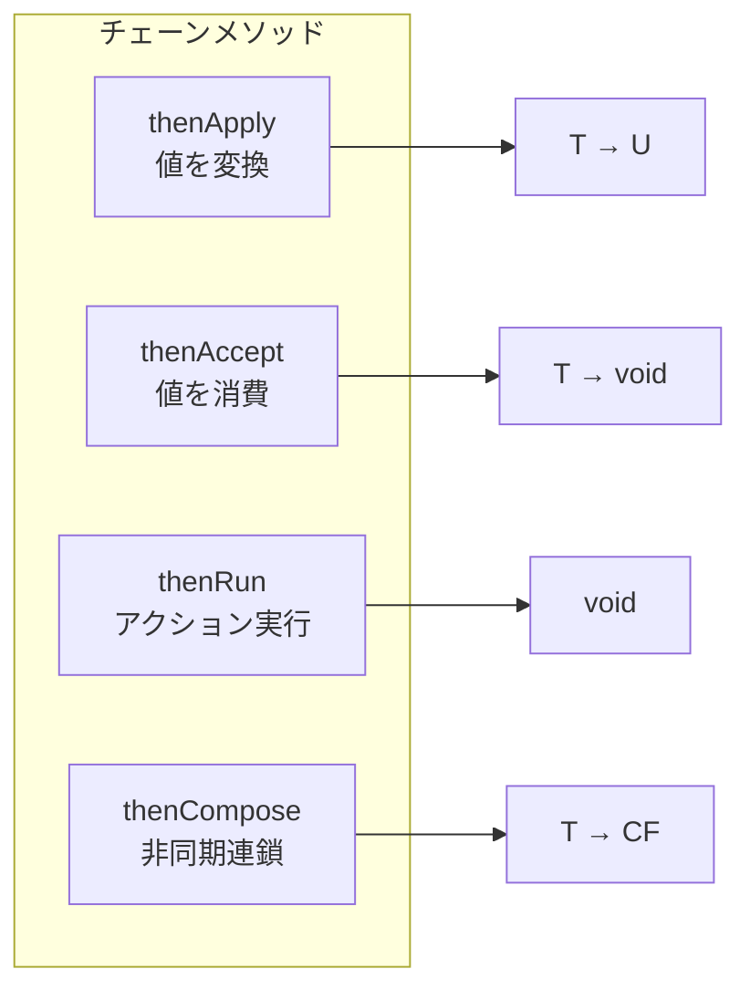

### 複数のCompletableFutureの合成

```java
import java.util.concurrent.*;
import java.util.List;

public class CompletableFutureCombine {
    public static void main(String[] args) throws Exception {
        CompletableFuture<String> future1 = CompletableFuture.supplyAsync(() -> {
            sleep(1000);
            return "Result 1";
        });
        
        CompletableFuture<String> future2 = CompletableFuture.supplyAsync(() -> {
            sleep(500);
            return "Result 2";
        });
        
        CompletableFuture<String> future3 = CompletableFuture.supplyAsync(() -> {
            sleep(1500);
            return "Result 3";
        });
        
        // thenCombine: 2つの結果を組み合わせ
        CompletableFuture<String> combined = future1.thenCombine(future2, 
            (r1, r2) -> r1 + " + " + r2
        );
        System.out.println(combined.get());
        
        // allOf: すべて完了を待機
        CompletableFuture<Void> allOf = CompletableFuture.allOf(
            future1, future2, future3
        );
        allOf.get();
        
        // すべての結果を収集
        List<CompletableFuture<String>> futures = List.of(future1, future2, future3);
        CompletableFuture<List<String>> allResults = CompletableFuture
            .allOf(futures.toArray(new CompletableFuture[0]))
            .thenApply(v -> futures.stream()
                .map(CompletableFuture::join)
                .toList()
            );
        System.out.println(allResults.get());
        
        // anyOf: 最初に完了したものを取得
        CompletableFuture<Object> anyOf = CompletableFuture.anyOf(
            future1, future2, future3
        );
        System.out.println("First: " + anyOf.get());
    }
    
    private static void sleep(long millis) {
        try { Thread.sleep(millis); } catch (InterruptedException e) { }
    }
}
```

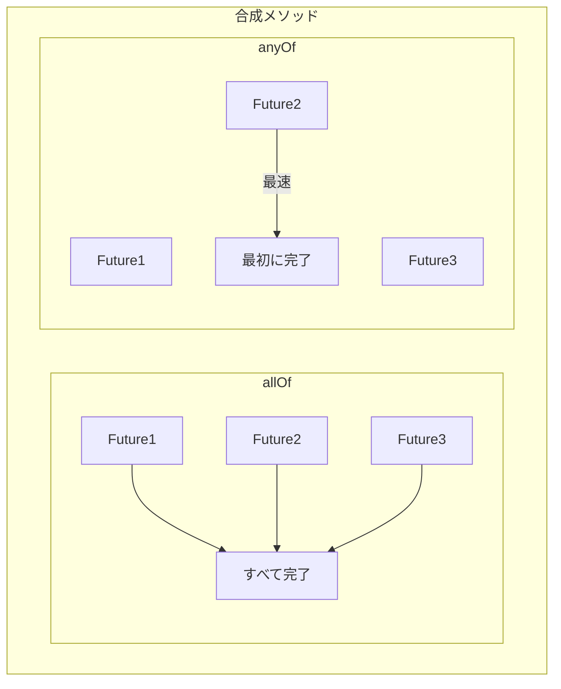

### エラー処理

```java
import java.util.concurrent.*;

public class CompletableFutureError {
    public static void main(String[] args) throws Exception {
        // exceptionally: 例外時のフォールバック
        CompletableFuture<String> withFallback = CompletableFuture
            .supplyAsync(() -> {
                if (Math.random() > 0.5) {
                    throw new RuntimeException("Error!");
                }
                return "Success";
            })
            .exceptionally(ex -> {
                System.out.println("Exception: " + ex.getMessage());
                return "Fallback";
            });
        
        System.out.println(withFallback.get());
        
        // handle: 成功/失敗の両方を処理
        CompletableFuture<String> handled = CompletableFuture
            .supplyAsync(() -> {
                if (Math.random() > 0.5) {
                    throw new RuntimeException("Error!");
                }
                return "Success";
            })
            .handle((result, ex) -> {
                if (ex != null) {
                    return "Handled: " + ex.getMessage();
                }
                return "Result: " + result;
            });
        
        System.out.println(handled.get());
        
        // whenComplete: 副作用（ログなど）
        CompletableFuture<String> logged = CompletableFuture
            .supplyAsync(() -> "Success")
            .whenComplete((result, ex) -> {
                if (ex != null) {
                    System.err.println("Failed: " + ex);
                } else {
                    System.out.println("Completed: " + result);
                }
            });
    }
}
```

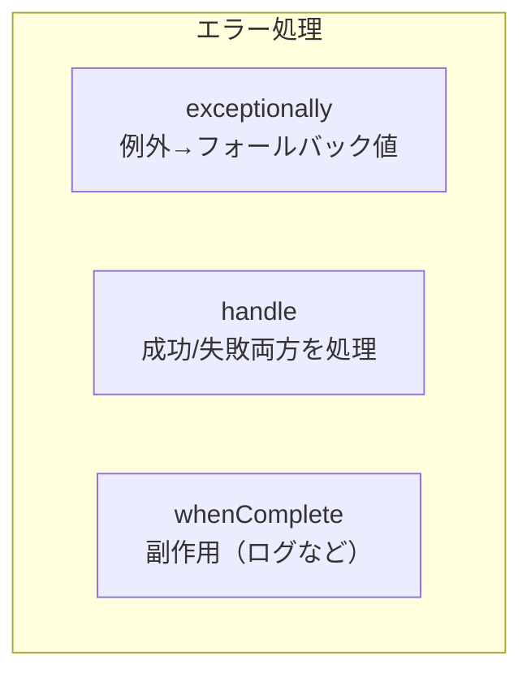

### タイムアウト

```java
import java.util.concurrent.*;

// Java 9以降
CompletableFuture<String> withTimeout = CompletableFuture
    .supplyAsync(() -> {
        sleep(5000);
        return "Result";
    })
    .orTimeout(2, TimeUnit.SECONDS);  // 2秒でタイムアウト

// タイムアウト時にデフォルト値を返す
CompletableFuture<String> withDefault = CompletableFuture
    .supplyAsync(() -> {
        sleep(5000);
        return "Result";
    })
    .completeOnTimeout("Default", 2, TimeUnit.SECONDS);
```

---

## 16.4 Project Loom（Virtual Threads）

### Virtual Threadsとは

**Virtual Threads**（仮想スレッド）は、Java 21で正式に導入された軽量スレッドです。従来のプラットフォームスレッド（OSスレッド）と比較して、大量のスレッドを効率的に扱えます。

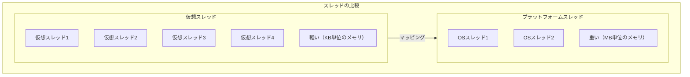

### 仮想スレッドの作成

```java
import java.time.Duration;
import java.util.concurrent.*;

public class VirtualThreadExample {
    public static void main(String[] args) throws Exception {
        // 方法1: Thread.startVirtualThread
        Thread vThread = Thread.startVirtualThread(() -> {
            System.out.println("Virtual Thread: " + Thread.currentThread());
        });
        vThread.join();
        
        // 方法2: Thread.ofVirtual()
        Thread vThread2 = Thread.ofVirtual()
            .name("my-virtual-thread")
            .start(() -> {
                System.out.println("Named Virtual Thread");
            });
        vThread2.join();
        
        // 方法3: ExecutorService
        try (var executor = Executors.newVirtualThreadPerTaskExecutor()) {
            for (int i = 0; i < 1000; i++) {
                int taskId = i;
                executor.submit(() -> {
                    Thread.sleep(Duration.ofSeconds(1));
                    System.out.println("Task " + taskId + " completed");
                    return taskId;
                });
            }
        }
        
        // 仮想スレッドかどうかを確認
        Thread.ofVirtual().start(() -> {
            System.out.println("isVirtual: " + Thread.currentThread().isVirtual());
        }).join();
    }
}
```

### 大量のスレッドの処理

```java
import java.time.Duration;
import java.time.Instant;
import java.util.concurrent.*;
import java.util.stream.IntStream;

public class ManyThreadsExample {
    public static void main(String[] args) throws Exception {
        int count = 100_000;
        
        // プラットフォームスレッドでは困難
        // (OutOfMemoryError になる可能性)
        
        // 仮想スレッドなら可能
        Instant start = Instant.now();
        
        try (var executor = Executors.newVirtualThreadPerTaskExecutor()) {
            var futures = IntStream.range(0, count)
                .mapToObj(i -> executor.submit(() -> {
                    Thread.sleep(Duration.ofSeconds(1));
                    return i;
                }))
                .toList();
            
            for (var future : futures) {
                future.get();
            }
        }
        
        Duration elapsed = Duration.between(start, Instant.now());
        System.out.printf("%d virtual threads completed in %d ms%n",
            count, elapsed.toMillis());
    }
}
```

### 仮想スレッドとブロッキングI/O

```java
import java.net.*;
import java.io.*;
import java.util.concurrent.*;

public class VirtualThreadServer {
    public static void main(String[] args) throws Exception {
        // 仮想スレッドによるシンプルなエコーサーバー
        try (var serverSocket = new ServerSocket(8080);
             var executor = Executors.newVirtualThreadPerTaskExecutor()) {
            
            System.out.println("Server started on port 8080");
            
            while (true) {
                Socket socket = serverSocket.accept();
                
                // 各接続を仮想スレッドで処理
                executor.submit(() -> handleConnection(socket));
            }
        }
    }
    
    private static void handleConnection(Socket socket) {
        try (socket;
             var reader = new BufferedReader(new InputStreamReader(socket.getInputStream()));
             var writer = new PrintWriter(socket.getOutputStream(), true)) {
            
            String line;
            while ((line = reader.readLine()) != null) {
                writer.println("Echo: " + line);
            }
        } catch (IOException e) {
            e.printStackTrace();
        }
    }
}
```

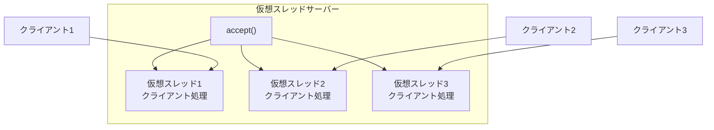

### Structured Concurrency（プレビュー）

```java
import java.util.concurrent.*;
import jdk.incubator.concurrent.StructuredTaskScope;

// Java 21 プレビュー機能
public class StructuredConcurrencyExample {
    record User(String name) {}
    record Order(String id) {}
    
    public static void main(String[] args) throws Exception {
        // ShutdownOnFailure: いずれかが失敗したらすべてキャンセル
        try (var scope = new StructuredTaskScope.ShutdownOnFailure()) {
            Future<User> userFuture = scope.fork(() -> fetchUser());
            Future<Order> orderFuture = scope.fork(() -> fetchOrder());
            
            scope.join();           // すべてのタスクを待機
            scope.throwIfFailed();  // 例外があればスロー
            
            User user = userFuture.resultNow();
            Order order = orderFuture.resultNow();
            
            System.out.printf("User: %s, Order: %s%n", user.name(), order.id());
        }
        
        // ShutdownOnSuccess: 最初に成功したら他をキャンセル
        try (var scope = new StructuredTaskScope.ShutdownOnSuccess<String>()) {
            scope.fork(() -> fetchFromServer1());
            scope.fork(() -> fetchFromServer2());
            
            scope.join();
            
            String result = scope.result();  // 最初に成功した結果
            System.out.println("First result: " + result);
        }
    }
    
    private static User fetchUser() throws InterruptedException {
        Thread.sleep(100);
        return new User("Alice");
    }
    
    private static Order fetchOrder() throws InterruptedException {
        Thread.sleep(200);
        return new Order("ORD-123");
    }
    
    private static String fetchFromServer1() throws InterruptedException {
        Thread.sleep(100);
        return "Server1 response";
    }
    
    private static String fetchFromServer2() throws InterruptedException {
        Thread.sleep(200);
        return "Server2 response";
    }
}
```

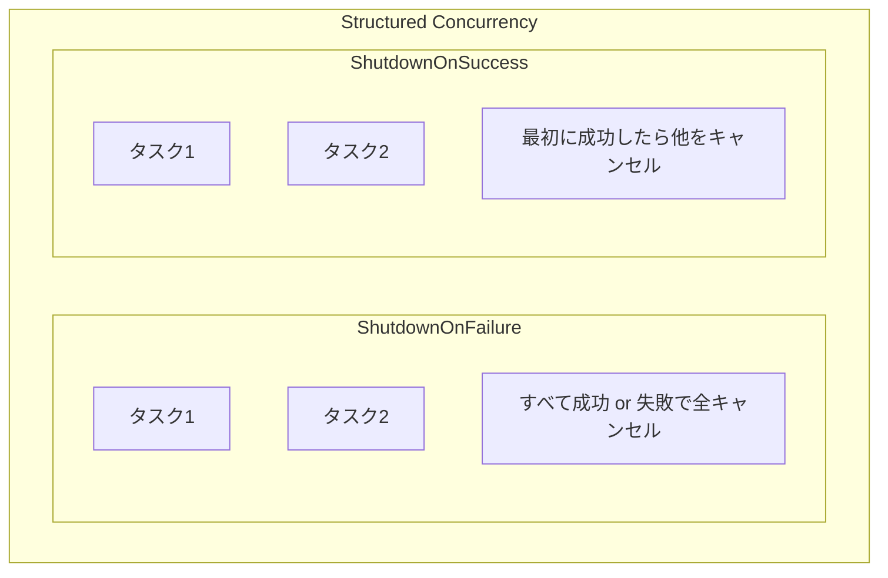

### Scoped Values（プレビュー）

```java
import jdk.incubator.concurrent.ScopedValue;

// Java 21 プレビュー機能
// ThreadLocal の代替、仮想スレッドに最適化
public class ScopedValueExample {
    private static final ScopedValue<String> USER_ID = ScopedValue.newInstance();
    
    public static void main(String[] args) {
        // ScopedValue をバインドして実行
        ScopedValue.runWhere(USER_ID, "user-123", () -> {
            System.out.println("User: " + USER_ID.get());
            processRequest();
        });
    }
    
    private static void processRequest() {
        // スコープ内ならどこでも取得可能
        String userId = USER_ID.get();
        System.out.println("Processing for: " + userId);
    }
}
```

---

## 16.5 Reactive Streams

### Reactive Streamsとは

**Reactive Streams**は、非同期ストリーム処理のための標準仕様です。バックプレッシャーをサポートし、プロデューサーとコンシューマー間のフロー制御を行います。

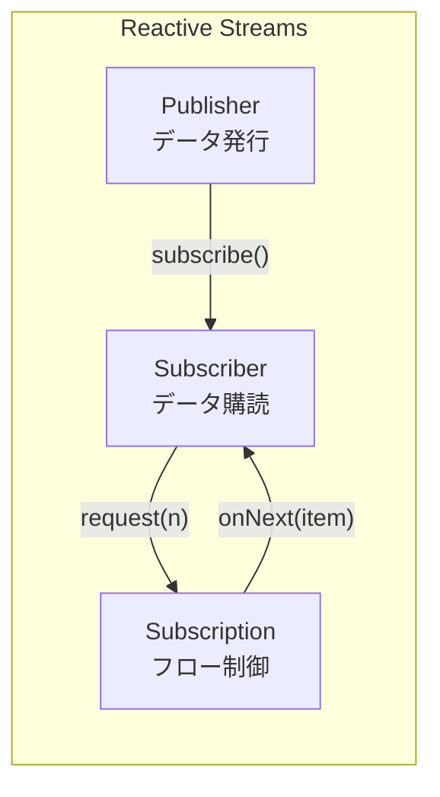

### Flow API（Java 9）

```java
import java.util.concurrent.*;

public class FlowExample {
    public static void main(String[] args) throws Exception {
        // Publisher
        var publisher = new SubmissionPublisher<Integer>();
        
        // Subscriber
        var subscriber = new Flow.Subscriber<Integer>() {
            private Flow.Subscription subscription;
            
            @Override
            public void onSubscribe(Flow.Subscription subscription) {
                this.subscription = subscription;
                subscription.request(1);  // 最初のアイテムを要求
            }
            
            @Override
            public void onNext(Integer item) {
                System.out.println("Received: " + item);
                subscription.request(1);  // 次のアイテムを要求
            }
            
            @Override
            public void onError(Throwable throwable) {
                System.err.println("Error: " + throwable.getMessage());
            }
            
            @Override
            public void onComplete() {
                System.out.println("Complete!");
            }
        };
        
        // 購読開始
        publisher.subscribe(subscriber);
        
        // データ発行
        for (int i = 1; i <= 5; i++) {
            publisher.submit(i);
        }
        
        // 完了
        publisher.close();
        
        Thread.sleep(1000);
    }
}
```

### Processor（中間処理）

```java
import java.util.concurrent.*;

public class FlowProcessorExample {
    public static void main(String[] args) throws Exception {
        // Processor: Publisher と Subscriber の両方を兼ねる
        class TransformProcessor extends SubmissionPublisher<String>
            implements Flow.Processor<Integer, String> {
            
            private Flow.Subscription subscription;
            
            @Override
            public void onSubscribe(Flow.Subscription subscription) {
                this.subscription = subscription;
                subscription.request(Long.MAX_VALUE);
            }
            
            @Override
            public void onNext(Integer item) {
                // 変換して下流に発行
                submit("Item-" + item);
            }
            
            @Override
            public void onError(Throwable throwable) {
                closeExceptionally(throwable);
            }
            
            @Override
            public void onComplete() {
                close();
            }
        }
        
        var publisher = new SubmissionPublisher<Integer>();
        var processor = new TransformProcessor();
        
        publisher.subscribe(processor);
        processor.subscribe(new SimpleSubscriber());
        
        for (int i = 1; i <= 3; i++) {
            publisher.submit(i);
        }
        publisher.close();
        
        Thread.sleep(1000);
    }
}
```

### Project Reactor（Spring WebFlux）

```java
import reactor.core.publisher.*;

public class ReactorExample {
    public static void main(String[] args) {
        // Mono: 0または1個の要素
        Mono<String> mono = Mono.just("Hello")
            .map(String::toUpperCase)
            .flatMap(s -> Mono.just(s + " World"));
        
        mono.subscribe(System.out::println);
        
        // Flux: 0個以上の要素
        Flux<Integer> flux = Flux.range(1, 5)
            .filter(i -> i % 2 == 0)
            .map(i -> i * 10);
        
        flux.subscribe(System.out::println);
        
        // 非同期操作の連鎖
        Flux.just("a", "b", "c")
            .flatMap(letter -> Mono.fromCallable(() -> {
                Thread.sleep(100);
                return letter.toUpperCase();
            }).subscribeOn(Schedulers.boundedElastic()))
            .collectList()
            .subscribe(list -> System.out.println("Results: " + list));
        
        // バックプレッシャー
        Flux.range(1, 100)
            .onBackpressureBuffer(10)
            .subscribe(
                item -> {
                    Thread.sleep(100);  // 処理が遅い
                    System.out.println(item);
                },
                Throwable::printStackTrace
            );
    }
}
```

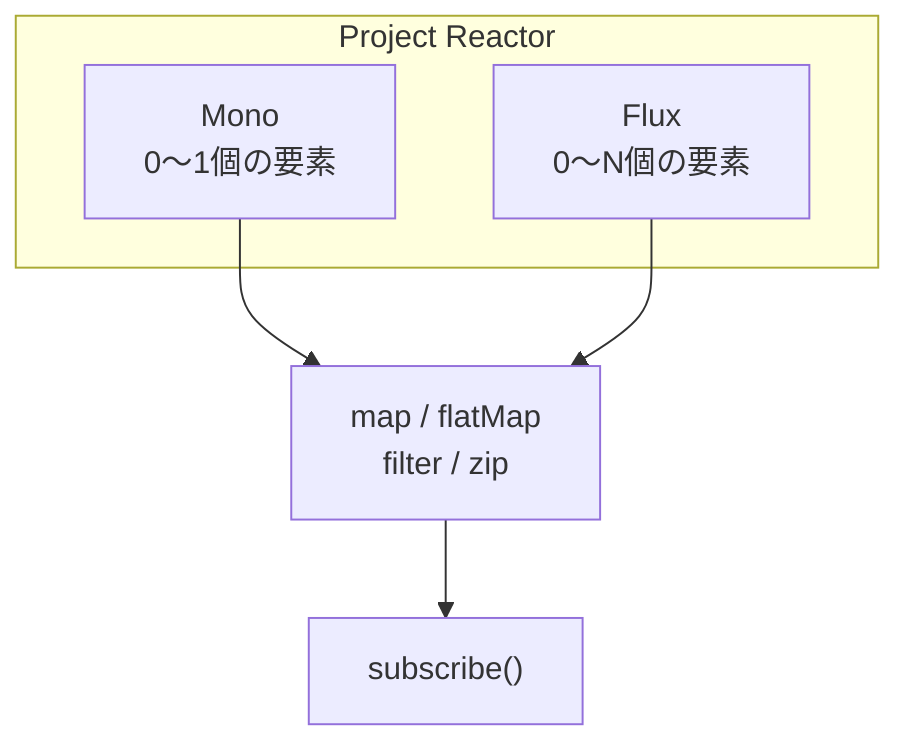

### RxJava

```java
import io.reactivex.rxjava3.core.*;
import io.reactivex.rxjava3.schedulers.Schedulers;

public class RxJavaExample {
    public static void main(String[] args) throws InterruptedException {
        // Observable: ホットまたはコールドのストリーム
        Observable<String> observable = Observable.create(emitter -> {
            emitter.onNext("A");
            emitter.onNext("B");
            emitter.onNext("C");
            emitter.onComplete();
        });
        
        observable
            .map(String::toLowerCase)
            .subscribe(System.out::println);
        
        // Single: 単一の値
        Single<String> single = Single.just("Hello");
        single.subscribe(System.out::println);
        
        // Maybe: 0または1個の値
        Maybe<String> maybe = Maybe.just("Maybe");
        maybe.subscribe(System.out::println);
        
        // Completable: 値なし、完了のみ
        Completable completable = Completable.fromAction(() -> {
            System.out.println("Action executed");
        });
        completable.subscribe();
        
        // 非同期スケジューリング
        Observable.range(1, 5)
            .subscribeOn(Schedulers.io())
            .observeOn(Schedulers.computation())
            .map(i -> i * 2)
            .subscribe(i -> System.out.println(
                i + " on " + Thread.currentThread().getName()
            ));
        
        Thread.sleep(1000);
    }
}
```

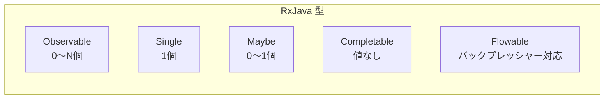

---

## 16.6 並行処理のユーティリティ

### CountDownLatch

```java
import java.util.concurrent.*;

public class CountDownLatchExample {
    public static void main(String[] args) throws Exception {
        int workerCount = 3;
        CountDownLatch latch = new CountDownLatch(workerCount);
        
        for (int i = 0; i < workerCount; i++) {
            int workerId = i;
            new Thread(() -> {
                try {
                    Thread.sleep(1000 * (workerId + 1));
                    System.out.println("Worker " + workerId + " finished");
                } catch (InterruptedException e) {
                } finally {
                    latch.countDown();  // カウンタを減らす
                }
            }).start();
        }
        
        System.out.println("Waiting for workers...");
        latch.await();  // カウンタが0になるまで待機
        System.out.println("All workers finished!");
    }
}
```

### CyclicBarrier

```java
import java.util.concurrent.*;

public class CyclicBarrierExample {
    public static void main(String[] args) throws Exception {
        int parties = 3;
        CyclicBarrier barrier = new CyclicBarrier(parties, () -> {
            System.out.println("All parties arrived at barrier!");
        });
        
        for (int i = 0; i < parties; i++) {
            int partyId = i;
            new Thread(() -> {
                try {
                    System.out.println("Party " + partyId + " working...");
                    Thread.sleep(1000 * (partyId + 1));
                    System.out.println("Party " + partyId + " waiting at barrier");
                    barrier.await();  // 他のスレッドを待つ
                    System.out.println("Party " + partyId + " continuing...");
                } catch (Exception e) {
                }
            }).start();
        }
    }
}
```

### Semaphore

```java
import java.util.concurrent.*;

public class SemaphoreExample {
    public static void main(String[] args) {
        // 同時に3つのタスクまで許可
        Semaphore semaphore = new Semaphore(3);
        
        for (int i = 0; i < 10; i++) {
            int taskId = i;
            new Thread(() -> {
                try {
                    semaphore.acquire();  // パーミット取得
                    System.out.println("Task " + taskId + " acquired permit");
                    Thread.sleep(2000);
                } catch (InterruptedException e) {
                } finally {
                    System.out.println("Task " + taskId + " releasing permit");
                    semaphore.release();  // パーミット解放
                }
            }).start();
        }
    }
}
```

### ConcurrentHashMap

```java
import java.util.concurrent.*;

public class ConcurrentHashMapExample {
    public static void main(String[] args) {
        ConcurrentHashMap<String, Integer> map = new ConcurrentHashMap<>();
        
        // アトミックな操作
        map.put("a", 1);
        map.putIfAbsent("b", 2);  // キーが存在しない場合のみ
        
        // アトミックな更新
        map.compute("a", (key, value) -> (value == null) ? 1 : value + 1);
        
        // 並列ストリーム操作
        map.put("c", 3);
        map.put("d", 4);
        
        // forEach（並列）
        map.forEach(2, (key, value) -> {
            System.out.println(key + ": " + value);
        });
        
        // reduce
        int sum = map.reduce(2,
            (key, value) -> value,  // 変換
            Integer::sum             // 集約
        );
        System.out.println("Sum: " + sum);
    }
}
```

---

## 16.7 まとめ

この章では、Javaの並行処理について詳しく学びました。

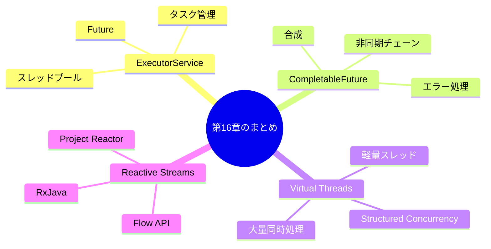

### 重要なポイント

#### 1. ExecutorServiceでスレッドプールを管理

直接スレッドを作成するのではなく、`ExecutorService`を使用してスレッドプールを管理しましょう。適切なプールサイズとキューサイズを設定することが重要です。

#### 2. CompletableFutureで非同期処理を合成

`CompletableFuture`を使用して、非同期処理を読みやすい形で連鎖させることができます。`thenApply`、`thenCompose`、`exceptionally`などのメソッドを活用しましょう。

#### 3. Virtual Threadsで大量の並行処理

Java 21の`Virtual Threads`を使用すると、従来のスレッドの制限を超えた大量の並行処理が可能になります。ブロッキングI/Oを恐れずに、シンプルなコードを書けます。

#### 4. Reactive Streamsでバックプレッシャーを制御

高スループットのストリーム処理では、`Reactive Streams`（`Flow API`、`Project Reactor`、`RxJava`）を使用してバックプレッシャーを適切に制御しましょう。

---

## 📝 練習問題

1. **ExecutorServiceを使って、10個のタスクを4スレッドで並列実行し、すべての結果を収集するコードを書いてください。**
   
   ヒント：`invokeAll`または`Future`のリストを使用してください。

2. **CompletableFutureを使って、3つのAPIから並行でデータを取得し、結果を統合するコードを書いてください。**
   
   ヒント：`allOf`と`thenApply`を組み合わせてください。

3. **Virtual Threadsを使って、1000個の同時HTTP接続をシミュレートするコードを書いてください。**
   
   ヒント：`Executors.newVirtualThreadPerTaskExecutor()`を使用してください。

4. **Flow APIを使って、整数のストリームを生成し、偶数のみをフィルタリングして表示するコードを書いてください。**
   
   ヒント：`Processor`を実装してフィルタリングを行ってください。

5. **CountDownLatchとCyclicBarrierの違いを説明してください。それぞれどのような場面で使うべきですか？**
   
   ヒント：再利用可能性と待機の方向について考えてください。

---

## 🔗 次の章へ

[第17章: 非同期処理のパターンとベストプラクティス](./17-patterns.md) では、実践的な非同期処理のパターンとベストプラクティスについて学びます。

---

[← 目次に戻る](../index.md) | [← 前章: C# / .NET](./15-csharp.md)

