# 第17章: 非同期処理のパターン

> 🎯 **この章の目標**: 非同期処理における基本的なパターン（並列実行、逐次実行、競争、タイムアウト、リトライ）を理解し、適切に使い分けられるようになる

---

## 17.1 非同期パターンの概要

### なぜパターンが必要か

非同期処理には、繰り返し現れる典型的な問題とその解決策があります。これらをパターンとして理解することで、効率的で保守しやすいコードを書けるようになります。

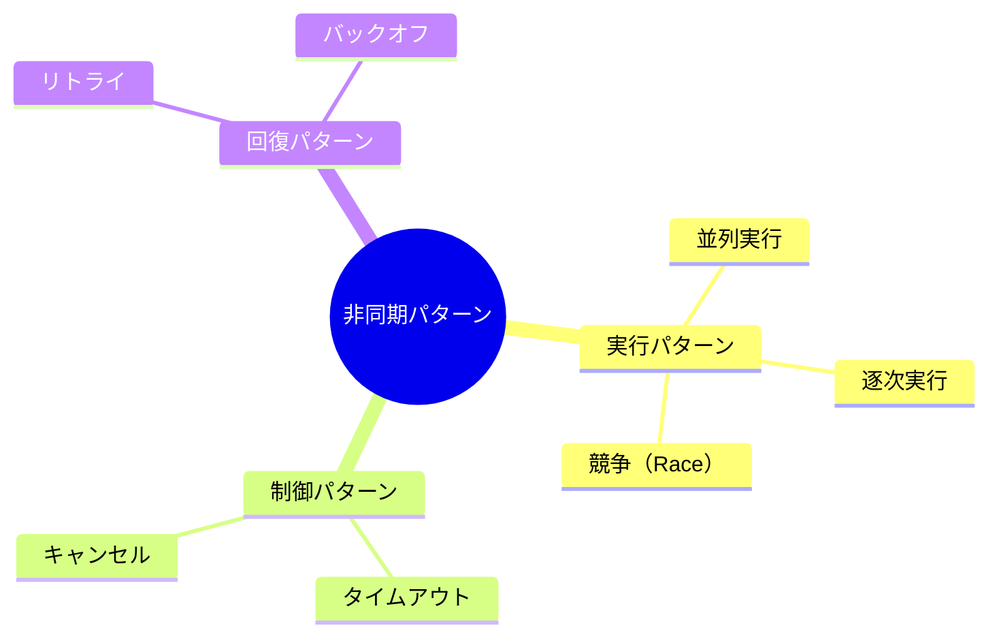

### パターン選択の指針

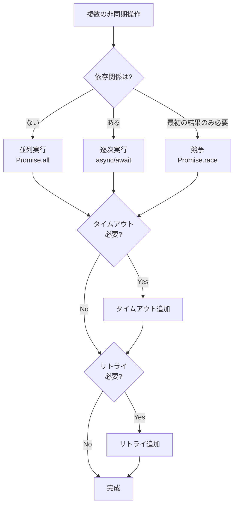

---

## 17.2 並列実行パターン

### 基本概念

複数の非同期操作を**同時に**開始し、すべての完了を待つパターンです。操作間に依存関係がない場合に使用します。

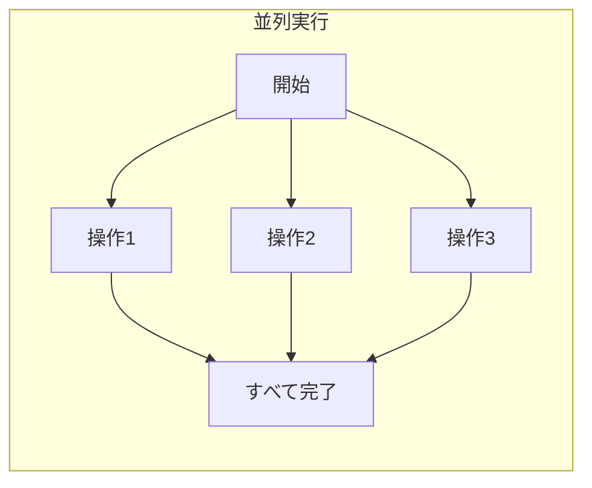

### JavaScript: Promise.all

```javascript
// 基本的な並列実行
async function fetchAllData() {
  const [users, products, orders] = await Promise.all([
    fetchUsers(),
    fetchProducts(),
    fetchOrders()
  ]);
  
  return { users, products, orders };
}

// 動的な数の並列実行
async function fetchMultipleUsers(userIds) {
  const promises = userIds.map(id => fetchUser(id));
  const users = await Promise.all(promises);
  return users;
}
```

### Python: asyncio.gather

```python
import asyncio

async def fetch_all_data():
    # 並列実行
    users, products, orders = await asyncio.gather(
        fetch_users(),
        fetch_products(),
        fetch_orders()
    )
    return {"users": users, "products": products, "orders": orders}

# 動的な数の並列実行
async def fetch_multiple_users(user_ids: list[int]):
    tasks = [fetch_user(user_id) for user_id in user_ids]
    users = await asyncio.gather(*tasks)
    return users
```

### Go: WaitGroup

```go
package main

import (
    "sync"
)

func fetchAllData() ([]User, []Product, []Order) {
    var wg sync.WaitGroup
    var users []User
    var products []Product
    var orders []Order
    
    wg.Add(3)
    
    go func() {
        defer wg.Done()
        users = fetchUsers()
    }()
    
    go func() {
        defer wg.Done()
        products = fetchProducts()
    }()
    
    go func() {
        defer wg.Done()
        orders = fetchOrders()
    }()
    
    wg.Wait()
    return users, products, orders
}
```

### Rust: tokio::join!

```rust
use tokio;

async fn fetch_all_data() -> (Vec<User>, Vec<Product>, Vec<Order>) {
    // join! マクロで並列実行
    let (users, products, orders) = tokio::join!(
        fetch_users(),
        fetch_products(),
        fetch_orders()
    );
    
    (users, products, orders)
}

// 動的な数の並列実行
async fn fetch_multiple_users(user_ids: Vec<u64>) -> Vec<User> {
    let futures: Vec<_> = user_ids
        .into_iter()
        .map(|id| fetch_user(id))
        .collect();
    
    futures::future::join_all(futures).await
}
```

### C#: Task.WhenAll

```csharp
async Task<(List<User>, List<Product>, List<Order>)> FetchAllDataAsync()
{
    var usersTask = FetchUsersAsync();
    var productsTask = FetchProductsAsync();
    var ordersTask = FetchOrdersAsync();
    
    await Task.WhenAll(usersTask, productsTask, ordersTask);
    
    return (usersTask.Result, productsTask.Result, ordersTask.Result);
}

// 動的な数の並列実行
async Task<List<User>> FetchMultipleUsersAsync(List<int> userIds)
{
    var tasks = userIds.Select(id => FetchUserAsync(id));
    var users = await Task.WhenAll(tasks);
    return users.ToList();
}
```

### Java: CompletableFuture.allOf

```java
CompletableFuture<Void> fetchAllData() {
    CompletableFuture<List<User>> usersFuture = fetchUsersAsync();
    CompletableFuture<List<Product>> productsFuture = fetchProductsAsync();
    CompletableFuture<List<Order>> ordersFuture = fetchOrdersAsync();
    
    return CompletableFuture.allOf(usersFuture, productsFuture, ordersFuture)
        .thenRun(() -> {
            List<User> users = usersFuture.join();
            List<Product> products = productsFuture.join();
            List<Order> orders = ordersFuture.join();
            // 結果を使用
        });
}
```

### 並列実行の注意点

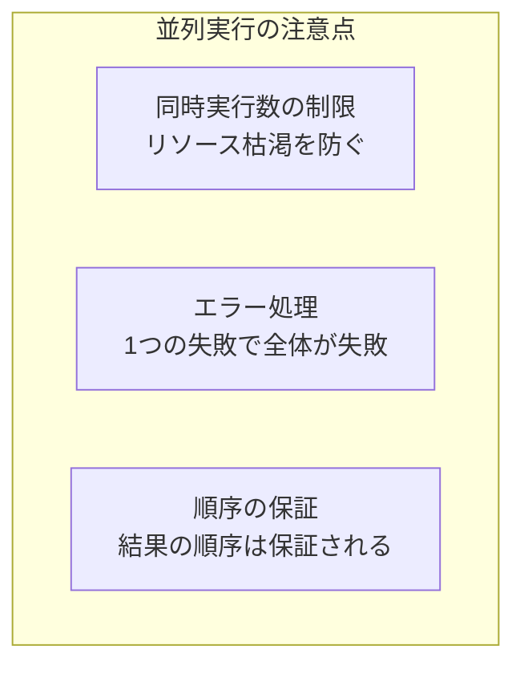

#### 同時実行数の制限

```javascript
// p-limit を使用（Node.js）
import pLimit from 'p-limit';

const limit = pLimit(5);  // 同時に5つまで

async function fetchManyUsers(userIds) {
  const promises = userIds.map(id => 
    limit(() => fetchUser(id))  // 制限付きで実行
  );
  return Promise.all(promises);
}

// 手動で制限
async function fetchInBatches(userIds, batchSize = 10) {
  const results = [];
  
  for (let i = 0; i < userIds.length; i += batchSize) {
    const batch = userIds.slice(i, i + batchSize);
    const batchResults = await Promise.all(
      batch.map(id => fetchUser(id))
    );
    results.push(...batchResults);
  }
  
  return results;
}
```

---

## 17.3 逐次実行パターン

### 基本概念

非同期操作を**順番に**実行するパターンです。前の操作の結果が次の操作に必要な場合に使用します。

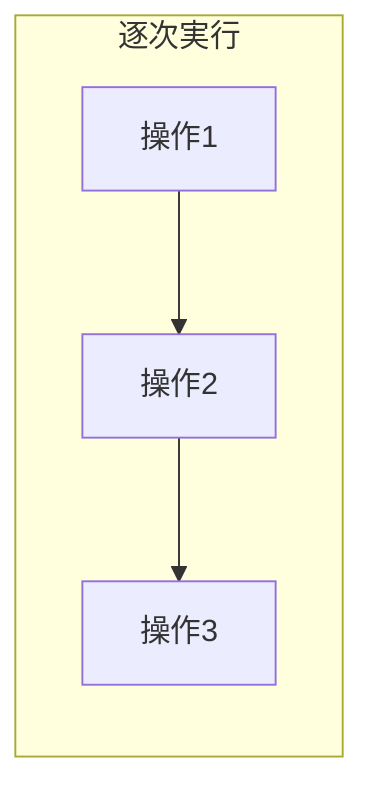

### JavaScript: async/await チェーン

```javascript
// 依存関係のある逐次実行
async function processOrder(orderId) {
  // 1. 注文を取得
  const order = await fetchOrder(orderId);
  
  // 2. ユーザー情報を取得（orderが必要）
  const user = await fetchUser(order.userId);
  
  // 3. 在庫を確認（orderが必要）
  const inventory = await checkInventory(order.items);
  
  // 4. 支払い処理（user, orderが必要）
  const payment = await processPayment(user, order);
  
  return { order, user, inventory, payment };
}

// 配列を逐次処理
async function processItemsSequentially(items) {
  const results = [];
  
  for (const item of items) {
    const result = await processItem(item);
    results.push(result);
  }
  
  return results;
}

// reduce を使った逐次処理
async function processItemsWithReduce(items) {
  return items.reduce(async (prevPromise, item) => {
    const results = await prevPromise;
    const result = await processItem(item);
    return [...results, result];
  }, Promise.resolve([]));
}
```

### Python: 順次 await

```python
async def process_order(order_id: int):
    # 依存関係のある逐次実行
    order = await fetch_order(order_id)
    user = await fetch_user(order.user_id)
    inventory = await check_inventory(order.items)
    payment = await process_payment(user, order)
    
    return {"order": order, "user": user, "inventory": inventory, "payment": payment}

# 配列を逐次処理
async def process_items_sequentially(items: list):
    results = []
    for item in items:
        result = await process_item(item)
        results.append(result)
    return results
```

### パイプラインパターン

逐次実行の一種で、データを変換しながら流していくパターンです。

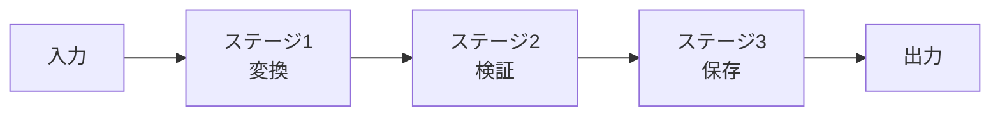

```typescript
// パイプライン関数
type AsyncPipe<T, U> = (input: T) => Promise<U>;

function pipe<A, B, C>(
  fn1: AsyncPipe<A, B>,
  fn2: AsyncPipe<B, C>
): AsyncPipe<A, C>;

function pipe<A, B, C, D>(
  fn1: AsyncPipe<A, B>,
  fn2: AsyncPipe<B, C>,
  fn3: AsyncPipe<C, D>
): AsyncPipe<A, D>;

function pipe(...fns: AsyncPipe<any, any>[]): AsyncPipe<any, any> {
  return async (input) => {
    let result = input;
    for (const fn of fns) {
      result = await fn(result);
    }
    return result;
  };
}

// 使用例
const processOrder = pipe(
  validateOrder,
  enrichWithUserData,
  calculateTotal,
  saveToDatabase
);

const result = await processOrder(rawOrder);
```

---

## 17.4 競争パターン（Race）

### 基本概念

複数の非同期操作を同時に開始し、**最初に完了した結果**を使用するパターンです。残りの操作は無視（またはキャンセル）されます。

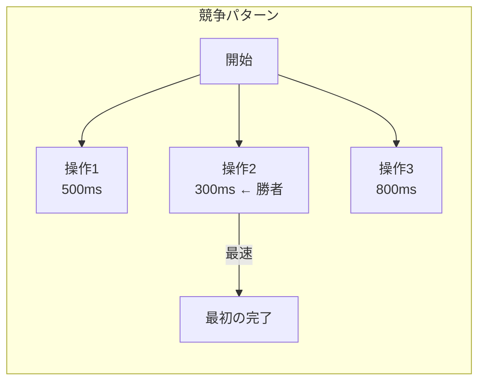

### JavaScript: Promise.race

```javascript
// 基本的なrace
async function fetchFastest() {
  const result = await Promise.race([
    fetchFromServer1(),
    fetchFromServer2(),
    fetchFromServer3()
  ]);
  return result;
}

// タイムアウトとの組み合わせ（最も一般的な使い方）
function withTimeout(promise, timeoutMs) {
  const timeout = new Promise((_, reject) => {
    setTimeout(() => reject(new Error('Timeout')), timeoutMs);
  });
  return Promise.race([promise, timeout]);
}

// 使用例
try {
  const data = await withTimeout(fetchData(), 5000);
  console.log(data);
} catch (error) {
  if (error.message === 'Timeout') {
    console.log('Request timed out');
  }
}
```

### Python: asyncio.wait with FIRST_COMPLETED

```python
import asyncio

async def fetch_fastest():
    tasks = [
        asyncio.create_task(fetch_from_server1()),
        asyncio.create_task(fetch_from_server2()),
        asyncio.create_task(fetch_from_server3())
    ]
    
    done, pending = await asyncio.wait(
        tasks, 
        return_when=asyncio.FIRST_COMPLETED
    )
    
    # 残りをキャンセル
    for task in pending:
        task.cancel()
    
    # 最初に完了した結果を取得
    return done.pop().result()

# タイムアウト
async def with_timeout(coro, timeout: float):
    try:
        return await asyncio.wait_for(coro, timeout=timeout)
    except asyncio.TimeoutError:
        raise TimeoutError(f"Operation timed out after {timeout}s")
```

### Go: select

```go
func fetchFastest() (string, error) {
    ch1 := make(chan string, 1)
    ch2 := make(chan string, 1)
    ch3 := make(chan string, 1)
    
    go func() { ch1 <- fetchFromServer1() }()
    go func() { ch2 <- fetchFromServer2() }()
    go func() { ch3 <- fetchFromServer3() }()
    
    select {
    case result := <-ch1:
        return result, nil
    case result := <-ch2:
        return result, nil
    case result := <-ch3:
        return result, nil
    }
}

// タイムアウト付き
func fetchWithTimeout(timeout time.Duration) (string, error) {
    ch := make(chan string, 1)
    
    go func() {
        ch <- fetchData()
    }()
    
    select {
    case result := <-ch:
        return result, nil
    case <-time.After(timeout):
        return "", errors.New("timeout")
    }
}
```

### Rust: tokio::select!

```rust
use tokio::time::{timeout, Duration};

async fn fetch_fastest() -> Result<String, Box<dyn std::error::Error>> {
    tokio::select! {
        result = fetch_from_server1() => Ok(result?),
        result = fetch_from_server2() => Ok(result?),
        result = fetch_from_server3() => Ok(result?),
    }
}

// タイムアウト付き
async fn fetch_with_timeout() -> Result<String, Box<dyn std::error::Error>> {
    match timeout(Duration::from_secs(5), fetch_data()).await {
        Ok(result) => Ok(result?),
        Err(_) => Err("Timeout".into()),
    }
}
```

### 競争パターンのユースケース

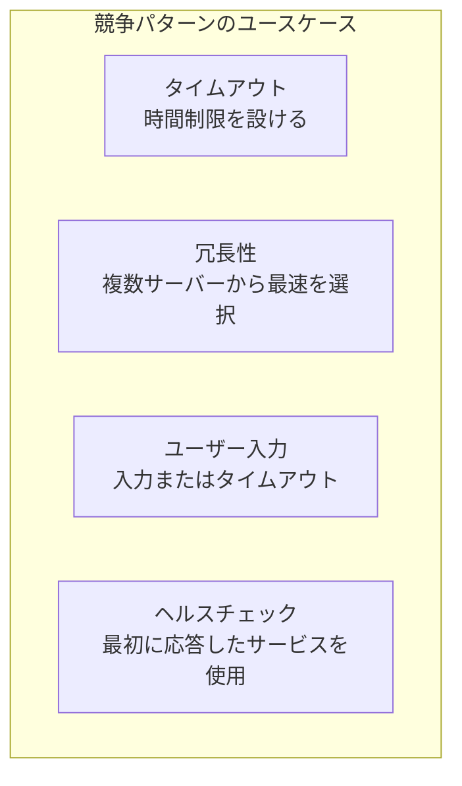

---

## 17.5 タイムアウトパターン

### 基本概念

非同期操作に時間制限を設け、制限を超えた場合は失敗として扱うパターンです。リソースの無駄遣いや無限待機を防ぎます。

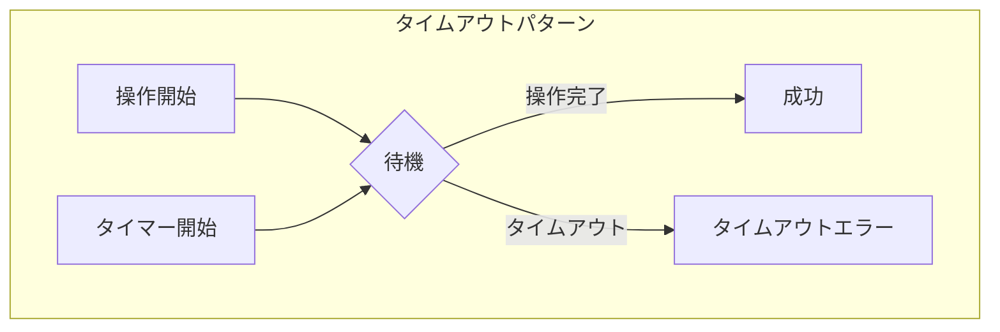

### JavaScript: AbortController

```javascript
// AbortController を使用（推奨）
async function fetchWithTimeout(url, timeoutMs) {
  const controller = new AbortController();
  const timeoutId = setTimeout(() => controller.abort(), timeoutMs);
  
  try {
    const response = await fetch(url, { 
      signal: controller.signal 
    });
    return await response.json();
  } catch (error) {
    if (error.name === 'AbortError') {
      throw new Error(`Request timed out after ${timeoutMs}ms`);
    }
    throw error;
  } finally {
    clearTimeout(timeoutId);
  }
}

// 汎用タイムアウトラッパー
function withTimeout(promise, timeoutMs, message = 'Operation timed out') {
  let timeoutId;
  
  const timeoutPromise = new Promise((_, reject) => {
    timeoutId = setTimeout(() => {
      reject(new Error(message));
    }, timeoutMs);
  });
  
  return Promise.race([promise, timeoutPromise])
    .finally(() => clearTimeout(timeoutId));
}
```

### Python: asyncio.timeout (3.11+)

```python
import asyncio

async def fetch_with_timeout(url: str, timeout: float):
    async with asyncio.timeout(timeout):
        async with aiohttp.ClientSession() as session:
            async with session.get(url) as response:
                return await response.json()

# Python 3.10以前
async def fetch_with_timeout_old(url: str, timeout: float):
    try:
        return await asyncio.wait_for(fetch_data(url), timeout=timeout)
    except asyncio.TimeoutError:
        raise TimeoutError(f"Request timed out after {timeout}s")
```

### キャンセル可能な操作

```typescript
// キャンセルトークンパターン
interface CancellationToken {
  isCancelled: boolean;
  onCancel: (callback: () => void) => void;
}

function createCancellationToken(): [CancellationToken, () => void] {
  let isCancelled = false;
  const callbacks: Array<() => void> = [];
  
  const token: CancellationToken = {
    get isCancelled() { return isCancelled; },
    onCancel(callback) { callbacks.push(callback); }
  };
  
  const cancel = () => {
    isCancelled = true;
    callbacks.forEach(cb => cb());
  };
  
  return [token, cancel];
}

// 使用例
async function longRunningTask(token: CancellationToken) {
  for (let i = 0; i < 100; i++) {
    if (token.isCancelled) {
      throw new Error('Operation cancelled');
    }
    await doWork(i);
  }
}

const [token, cancel] = createCancellationToken();

// 5秒後にキャンセル
setTimeout(cancel, 5000);

try {
  await longRunningTask(token);
} catch (error) {
  console.log('Task was cancelled');
}
```

### タイムアウトバジェット

複数の操作を連鎖させる場合、全体のタイムアウトから各操作のタイムアウトを割り当てます。

```typescript
class TimeoutBudget {
  private startTime: number;
  private totalMs: number;
  
  constructor(totalMs: number) {
    this.startTime = Date.now();
    this.totalMs = totalMs;
  }
  
  remaining(): number {
    const elapsed = Date.now() - this.startTime;
    return Math.max(0, this.totalMs - elapsed);
  }
  
  isExpired(): boolean {
    return this.remaining() <= 0;
  }
  
  allocate(maxMs: number): number {
    return Math.min(maxMs, this.remaining());
  }
}

// 使用例
async function multiStepProcess() {
  const budget = new TimeoutBudget(10000);  // 全体で10秒
  
  // ステップ1: 最大3秒
  const step1 = await withTimeout(
    doStep1(),
    budget.allocate(3000)
  );
  
  if (budget.isExpired()) {
    throw new Error('Overall timeout exceeded');
  }
  
  // ステップ2: 残り時間を使用
  const step2 = await withTimeout(
    doStep2(step1),
    budget.remaining()
  );
  
  return step2;
}
```

---

## 17.6 リトライパターン

### 基本概念

失敗した操作を自動的に再試行するパターンです。一時的な障害からの回復を可能にします。

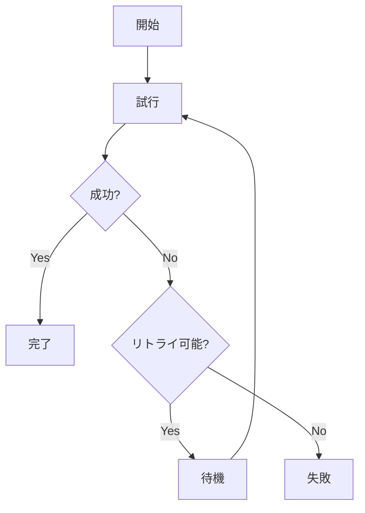

### 基本的なリトライ

```javascript
// シンプルなリトライ
async function retry(fn, maxAttempts = 3, delay = 1000) {
  let lastError;
  
  for (let attempt = 1; attempt <= maxAttempts; attempt++) {
    try {
      return await fn();
    } catch (error) {
      lastError = error;
      console.log(`Attempt ${attempt}/${maxAttempts} failed: ${error.message}`);
      
      if (attempt < maxAttempts) {
        await sleep(delay);
      }
    }
  }
  
  throw lastError;
}

// 使用例
const data = await retry(() => fetchData(url), 3, 1000);
```

### 指数バックオフ

リトライ間隔を指数的に増加させることで、システムへの負荷を軽減します。

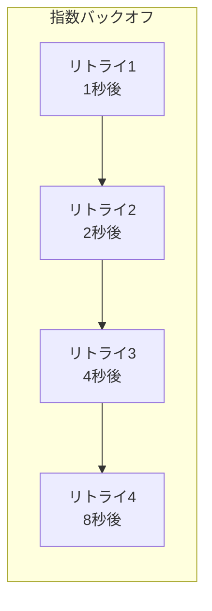

```typescript
interface RetryOptions {
  maxAttempts: number;
  initialDelay: number;
  maxDelay: number;
  factor: number;
  jitter: boolean;
}

async function retryWithBackoff<T>(
  fn: () => Promise<T>,
  options: RetryOptions = {
    maxAttempts: 5,
    initialDelay: 1000,
    maxDelay: 30000,
    factor: 2,
    jitter: true
  }
): Promise<T> {
  let lastError: Error;
  
  for (let attempt = 0; attempt < options.maxAttempts; attempt++) {
    try {
      return await fn();
    } catch (error) {
      lastError = error as Error;
      
      if (attempt < options.maxAttempts - 1) {
        // 指数バックオフの計算
        let delay = options.initialDelay * Math.pow(options.factor, attempt);
        delay = Math.min(delay, options.maxDelay);
        
        // ジッター（ランダムな揺らぎ）
        if (options.jitter) {
          delay = delay * (0.5 + Math.random());
        }
        
        console.log(`Retry ${attempt + 1} in ${Math.round(delay)}ms`);
        await sleep(delay);
      }
    }
  }
  
  throw lastError!;
}
```

### ジッターの重要性

複数のクライアントが同時にリトライすると、サーバーに負荷が集中します（**Thundering Herd問題**）。ジッターを追加することで、リトライタイミングを分散させます。

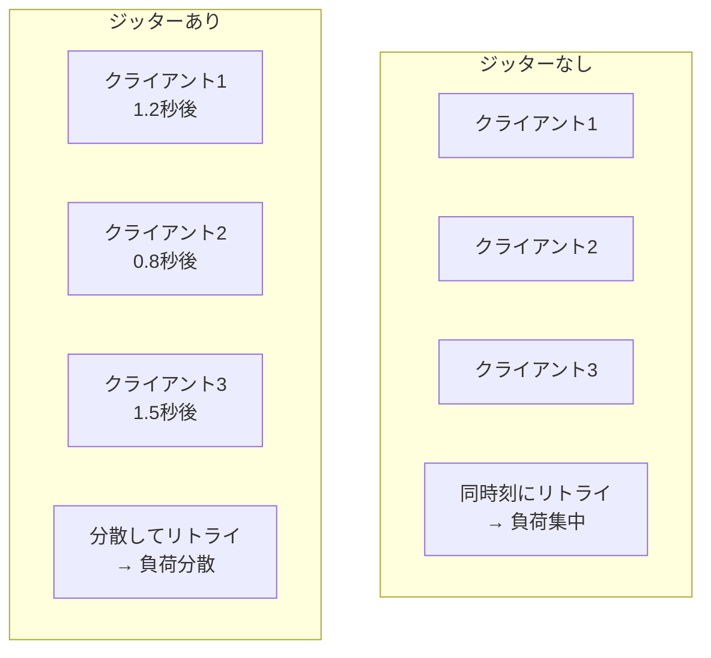

### リトライ可能なエラーの判定

```typescript
// リトライ可能かどうかを判定
function isRetryable(error: unknown): boolean {
  // ネットワークエラー
  if (error instanceof TypeError && error.message.includes('fetch')) {
    return true;
  }
  
  // HTTPステータスコード
  if (error instanceof Response) {
    const status = error.status;
    // 5xx: サーバーエラー（リトライ可能）
    if (status >= 500) return true;
    // 429: レート制限（リトライ可能）
    if (status === 429) return true;
    // 4xx: クライアントエラー（リトライ不可）
    return false;
  }
  
  // タイムアウト
  if (error instanceof Error) {
    const message = error.message.toLowerCase();
    if (message.includes('timeout')) return true;
    if (message.includes('econnreset')) return true;
    if (message.includes('econnrefused')) return true;
  }
  
  return false;
}

// スマートリトライ
async function smartRetry<T>(
  fn: () => Promise<T>,
  options: RetryOptions
): Promise<T> {
  let lastError: Error;
  
  for (let attempt = 0; attempt < options.maxAttempts; attempt++) {
    try {
      return await fn();
    } catch (error) {
      lastError = error as Error;
      
      // リトライ不可能なエラーは即座に失敗
      if (!isRetryable(error)) {
        throw error;
      }
      
      if (attempt < options.maxAttempts - 1) {
        const delay = calculateBackoff(attempt, options);
        await sleep(delay);
      }
    }
  }
  
  throw lastError!;
}
```

### Python でのリトライ

```python
import asyncio
import random
from typing import TypeVar, Callable, Awaitable

T = TypeVar('T')

async def retry_with_backoff(
    fn: Callable[[], Awaitable[T]],
    max_attempts: int = 5,
    initial_delay: float = 1.0,
    max_delay: float = 30.0,
    factor: float = 2.0,
    jitter: bool = True
) -> T:
    last_error: Exception = None
    
    for attempt in range(max_attempts):
        try:
            return await fn()
        except Exception as e:
            last_error = e
            
            if attempt < max_attempts - 1:
                delay = min(initial_delay * (factor ** attempt), max_delay)
                
                if jitter:
                    delay = delay * (0.5 + random.random())
                
                print(f"Retry {attempt + 1} in {delay:.2f}s: {e}")
                await asyncio.sleep(delay)
    
    raise last_error
```

---

## 17.7 組み合わせパターン

### リトライ + タイムアウト

```typescript
async function fetchWithRetryAndTimeout<T>(
  fn: () => Promise<T>,
  retryOptions: RetryOptions,
  timeoutMs: number
): Promise<T> {
  return retryWithBackoff(
    () => withTimeout(fn(), timeoutMs),
    retryOptions
  );
}

// 使用例
const data = await fetchWithRetryAndTimeout(
  () => fetch('https://api.example.com/data'),
  { maxAttempts: 3, initialDelay: 1000, maxDelay: 10000, factor: 2, jitter: true },
  5000
);
```

### 並列 + タイムアウト

```typescript
async function fetchAllWithTimeout<T>(
  promises: Promise<T>[],
  timeoutMs: number
): Promise<T[]> {
  return withTimeout(
    Promise.all(promises),
    timeoutMs,
    `All operations must complete within ${timeoutMs}ms`
  );
}

// 個別タイムアウト
async function fetchAllWithIndividualTimeouts<T>(
  fns: Array<() => Promise<T>>,
  timeoutMs: number
): Promise<T[]> {
  const wrappedPromises = fns.map(fn => 
    withTimeout(fn(), timeoutMs)
  );
  return Promise.all(wrappedPromises);
}
```

### 部分的な成功を許容

```typescript
// Promise.allSettled を使用
async function fetchAllAllowPartialFailure<T>(
  fns: Array<() => Promise<T>>
): Promise<{
  successes: T[];
  failures: Error[];
}> {
  const results = await Promise.allSettled(fns.map(fn => fn()));
  
  const successes: T[] = [];
  const failures: Error[] = [];
  
  for (const result of results) {
    if (result.status === 'fulfilled') {
      successes.push(result.value);
    } else {
      failures.push(result.reason);
    }
  }
  
  return { successes, failures };
}

// 使用例
const { successes, failures } = await fetchAllAllowPartialFailure([
  () => fetchUser(1),
  () => fetchUser(2),  // これが失敗しても他は成功
  () => fetchUser(3)
]);

console.log(`${successes.length} succeeded, ${failures.length} failed`);
```

---

## 17.8 まとめ

この章では、非同期処理の基本パターンについて学びました。

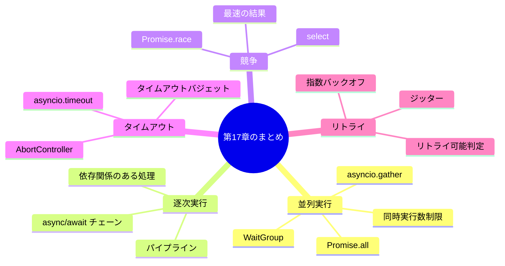

### パターン選択ガイド

| パターン | 使用場面 | 主なAPI |
|---------|---------|---------|
| 並列実行 | 独立した複数の操作 | `Promise.all`, `asyncio.gather` |
| 逐次実行 | 依存関係のある操作 | `await` チェーン |
| 競争 | 最初の結果のみ必要 | `Promise.race`, `select` |
| タイムアウト | 時間制限が必要 | `AbortController`, `asyncio.timeout` |
| リトライ | 一時的な障害への対応 | 指数バックオフ + ジッター |

---

## 📝 練習問題

1. **Promise.all を使って、5つのURLから同時にデータを取得し、すべての結果を配列で返す関数を実装してください。**

2. **逐次実行パターンを使って、前の操作の結果を次の操作に渡す3段階のパイプラインを実装してください。**

3. **Promise.race を使って、3つのサーバーから最も速く応答したものを使用する関数を実装してください。**

4. **指数バックオフとジッターを組み合わせたリトライ関数を実装してください。**

5. **リトライ + タイムアウト + 同時実行数制限を組み合わせた堅牢なデータ取得関数を実装してください。**

---

## 🔗 次の章へ

[第18章: エラーハンドリング](./18-error-handling.md) では、非同期処理におけるエラーの伝播と適切な処理方法について学びます。

---

[← 目次に戻る](../index.md) | [← 前章: Java](./16-java.md)
