# 第18章: エラーハンドリング

> 🎯 **この章の目標**: 非同期処理におけるエラーの伝播を理解し、例外とResult型の使い分け、部分的な失敗への対処、デッドロックとレースコンディションの回避方法を習得する

---

## 18.1 非同期エラーの特殊性

### 同期処理との違い

非同期処理のエラーハンドリングは、同期処理とは異なる難しさがあります。

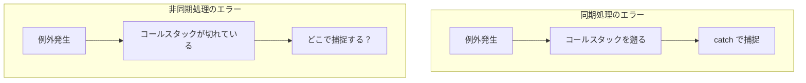

### 非同期エラーの課題

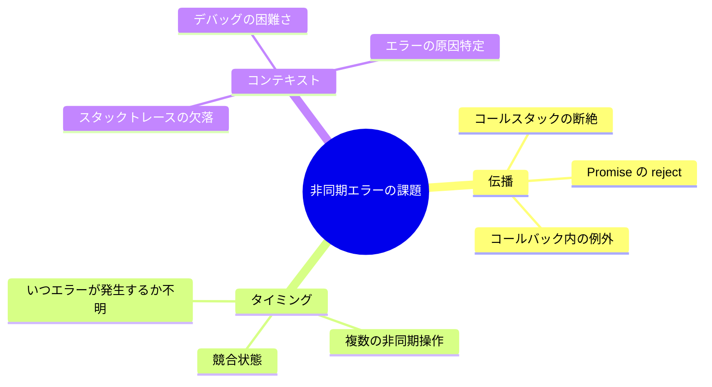

---

## 18.2 非同期エラーの伝播

### コールバックでのエラー伝播

```javascript
// ❌ コールバック内の例外は外で catch できない
try {
  setTimeout(() => {
    throw new Error("This won't be caught!");
  }, 1000);
} catch (error) {
  // ここには到達しない
  console.log("Caught:", error);
}

// ✅ Node.js スタイル：エラーファーストコールバック
function readFileCallback(path, callback) {
  fs.readFile(path, (error, data) => {
    if (error) {
      callback(error, null);  // エラーを第1引数で渡す
      return;
    }
    callback(null, data);
  });
}

readFileCallback("file.txt", (error, data) => {
  if (error) {
    console.error("Error:", error);
    return;
  }
  console.log("Data:", data);
});
```

### Promise でのエラー伝播

```javascript
// Promise はエラーを自動的に伝播する
function fetchData(url) {
  return fetch(url)
    .then(response => {
      if (!response.ok) {
        throw new Error(`HTTP ${response.status}`);
      }
      return response.json();
    })
    .then(data => {
      return processData(data);
    });
  // エラーは自動的に reject として伝播
}

// catch でエラーを捕捉
fetchData("https://api.example.com/data")
  .then(result => console.log(result))
  .catch(error => console.error("Error:", error));
```

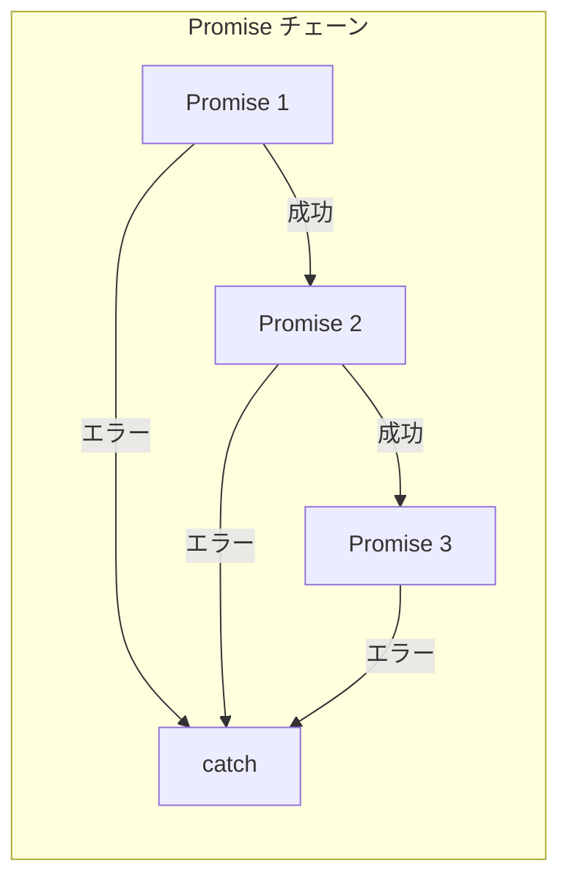

### async/await でのエラー伝播

```javascript
// async/await では try-catch が使える
async function processData() {
  try {
    const response = await fetch("https://api.example.com/data");
    
    if (!response.ok) {
      throw new Error(`HTTP ${response.status}`);
    }
    
    const data = await response.json();
    return await saveData(data);
    
  } catch (error) {
    console.error("Error in processData:", error);
    throw error;  // 再スロー
  }
}

// 呼び出し側でもエラーを処理
async function main() {
  try {
    await processData();
  } catch (error) {
    console.error("Error in main:", error);
  }
}
```

### 未処理の Promise rejection

```javascript
// ❌ 未処理の rejection は問題を引き起こす
async function badExample() {
  const promise = fetch("https://api.example.com/data");
  // await しないで放置
  // エラーが発生しても捕捉されない
}

// ✅ 必ずエラーを処理する
async function goodExample() {
  try {
    const response = await fetch("https://api.example.com/data");
    return await response.json();
  } catch (error) {
    console.error("Error:", error);
    throw error;
  }
}

// グローバルな未処理 rejection ハンドラ（Node.js）
process.on('unhandledRejection', (reason, promise) => {
  console.error('Unhandled Rejection at:', promise, 'reason:', reason);
});

// ブラウザ
window.addEventListener('unhandledrejection', event => {
  console.error('Unhandled rejection:', event.reason);
  event.preventDefault();
});
```

### Python での非同期エラー伝播

```python
import asyncio

async def fetch_data(url: str):
    # 例外は自動的に伝播
    response = await aiohttp.get(url)
    if response.status != 200:
        raise ValueError(f"HTTP {response.status}")
    return await response.json()

async def process_data():
    try:
        data = await fetch_data("https://api.example.com/data")
        return await save_data(data)
    except ValueError as e:
        print(f"Validation error: {e}")
        raise
    except Exception as e:
        print(f"Unexpected error: {e}")
        raise

async def main():
    try:
        await process_data()
    except Exception as e:
        print(f"Error in main: {e}")

asyncio.run(main())
```

---

## 18.3 例外 vs Result型

### 例外ベースのエラーハンドリング

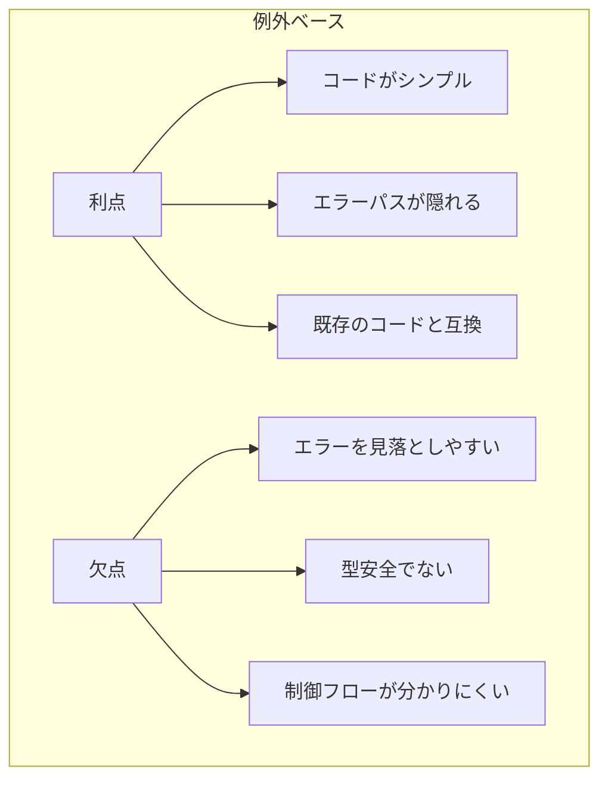

```typescript
// 例外ベース
async function fetchUser(id: string): Promise<User> {
  const response = await fetch(`/api/users/${id}`);
  
  if (!response.ok) {
    throw new HttpError(response.status, response.statusText);
  }
  
  return await response.json();
}

// 使用側：エラーを忘れがち
async function displayUser(id: string) {
  try {
    const user = await fetchUser(id);
    console.log(user.name);
  } catch (error) {
    if (error instanceof HttpError) {
      console.error(`HTTP Error: ${error.status}`);
    } else {
      console.error("Unknown error:", error);
    }
  }
}
```

### Result型ベースのエラーハンドリング

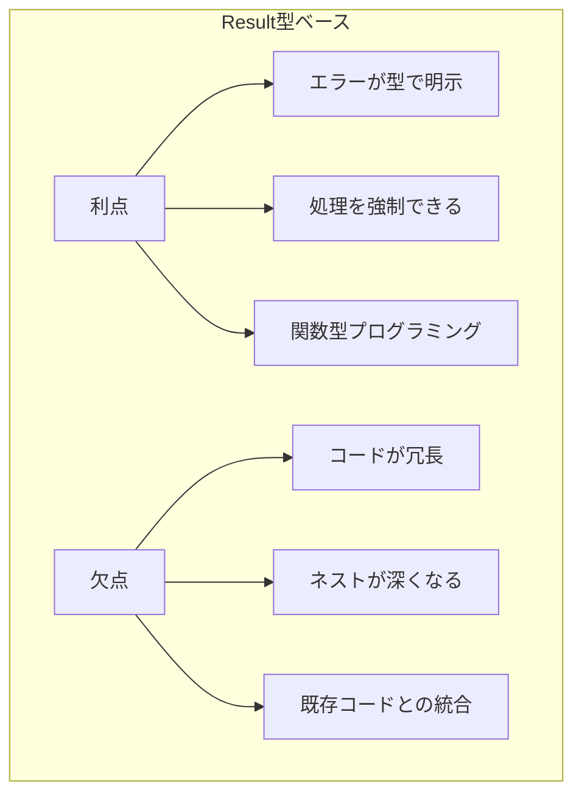

#### TypeScript での Result型

```typescript
// Result 型の定義
type Result<T, E = Error> = 
  | { ok: true; value: T }
  | { ok: false; error: E };

// ヘルパー関数
function ok<T>(value: T): Result<T, never> {
  return { ok: true, value };
}

function err<E>(error: E): Result<never, E> {
  return { ok: false, error };
}

// Result を返す関数
async function fetchUser(id: string): Promise<Result<User, HttpError>> {
  try {
    const response = await fetch(`/api/users/${id}`);
    
    if (!response.ok) {
      return err(new HttpError(response.status, response.statusText));
    }
    
    const user = await response.json();
    return ok(user);
    
  } catch (error) {
    return err(new HttpError(0, "Network error"));
  }
}

// 使用側：エラーを無視できない
async function displayUser(id: string) {
  const result = await fetchUser(id);
  
  if (!result.ok) {
    console.error(`Error: ${result.error.message}`);
    return;
  }
  
  // result.value は User 型として推論される
  console.log(result.value.name);
}
```

#### Rust での Result型

```rust
use std::error::Error;

// Result を返す非同期関数
async fn fetch_user(id: &str) -> Result<User, Box<dyn Error>> {
    let url = format!("https://api.example.com/users/{}", id);
    let response = reqwest::get(&url).await?;  // ? でエラーを伝播
    
    if !response.status().is_success() {
        return Err(format!("HTTP {}", response.status()).into());
    }
    
    let user: User = response.json().await?;
    Ok(user)
}

// 使用側：パターンマッチで処理
async fn display_user(id: &str) {
    match fetch_user(id).await {
        Ok(user) => println!("User: {}", user.name),
        Err(e) => eprintln!("Error: {}", e),
    }
}

// または ? 演算子で伝播
async fn process_user(id: &str) -> Result<(), Box<dyn Error>> {
    let user = fetch_user(id).await?;
    println!("User: {}", user.name);
    Ok(())
}
```

#### Go でのエラー処理

```go
// Go はエラーを戻り値として返す
func fetchUser(id string) (*User, error) {
    resp, err := http.Get(fmt.Sprintf("https://api.example.com/users/%s", id))
    if err != nil {
        return nil, fmt.Errorf("fetch failed: %w", err)
    }
    defer resp.Body.Close()
    
    if resp.StatusCode != http.StatusOK {
        return nil, fmt.Errorf("HTTP %d", resp.StatusCode)
    }
    
    var user User
    if err := json.NewDecoder(resp.Body).Decode(&user); err != nil {
        return nil, fmt.Errorf("decode failed: %w", err)
    }
    
    return &user, nil
}

// 使用側
func displayUser(id string) {
    user, err := fetchUser(id)
    if err != nil {
        log.Printf("Error: %v", err)
        return
    }
    fmt.Printf("User: %s\n", user.Name)
}
```

### 使い分けの指針

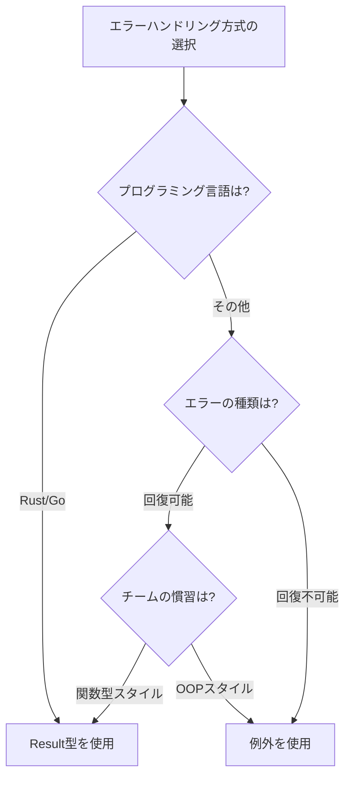

| 観点 | 例外 | Result型 |
|------|------|----------|
| 型安全性 | 低い | 高い |
| コードの簡潔さ | 高い | 低い |
| エラー処理の強制 | できない | できる |
| パフォーマンス | オーバーヘッドあり | 低オーバーヘッド |
| デバッグ | スタックトレース | 明示的なエラー値 |

---

## 18.4 部分的な失敗への対処

### 複数操作の失敗パターン

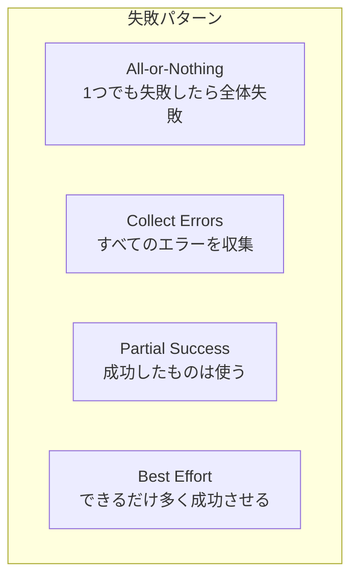

### All-or-Nothing（Promise.all）

```javascript
// 1つでも失敗したら全体が失敗
async function fetchAllOrNothing(urls) {
  try {
    const results = await Promise.all(
      urls.map(url => fetch(url).then(r => r.json()))
    );
    return { success: true, data: results };
  } catch (error) {
    return { success: false, error };
  }
}
```

### Collect Errors（Promise.allSettled）

```javascript
// すべての結果を収集
async function fetchAndCollectErrors(urls) {
  const results = await Promise.allSettled(
    urls.map(url => fetch(url).then(r => r.json()))
  );
  
  const successes = [];
  const failures = [];
  
  results.forEach((result, index) => {
    if (result.status === 'fulfilled') {
      successes.push({ url: urls[index], data: result.value });
    } else {
      failures.push({ url: urls[index], error: result.reason });
    }
  });
  
  return { successes, failures };
}

// 使用例
const { successes, failures } = await fetchAndCollectErrors([
  "https://api.example.com/1",
  "https://api.example.com/2",  // これが失敗しても他は成功
  "https://api.example.com/3"
]);

console.log(`${successes.length} succeeded, ${failures.length} failed`);
```

### Partial Success

```typescript
interface PartialResult<T> {
  completed: T[];
  failed: Array<{ index: number; error: Error }>;
  successRate: number;
}

async function processWithPartialSuccess<T, R>(
  items: T[],
  processor: (item: T) => Promise<R>,
  minSuccessRate: number = 0.5
): Promise<PartialResult<R>> {
  const results = await Promise.allSettled(
    items.map(item => processor(item))
  );
  
  const completed: R[] = [];
  const failed: Array<{ index: number; error: Error }> = [];
  
  results.forEach((result, index) => {
    if (result.status === 'fulfilled') {
      completed.push(result.value);
    } else {
      failed.push({ index, error: result.reason });
    }
  });
  
  const successRate = completed.length / items.length;
  
  if (successRate < minSuccessRate) {
    throw new Error(
      `Success rate ${(successRate * 100).toFixed(1)}% is below minimum ${minSuccessRate * 100}%`
    );
  }
  
  return { completed, failed, successRate };
}
```

### Python での部分的な失敗処理

```python
import asyncio
from dataclasses import dataclass
from typing import TypeVar, Generic, List, Tuple

T = TypeVar('T')
R = TypeVar('R')

@dataclass
class PartialResult(Generic[T]):
    successes: List[T]
    failures: List[Tuple[int, Exception]]
    
    @property
    def success_rate(self) -> float:
        total = len(self.successes) + len(self.failures)
        return len(self.successes) / total if total > 0 else 0

async def process_with_partial_success(
    items: List[T],
    processor,
    min_success_rate: float = 0.5
) -> PartialResult[R]:
    tasks = [processor(item) for item in items]
    results = await asyncio.gather(*tasks, return_exceptions=True)
    
    successes = []
    failures = []
    
    for i, result in enumerate(results):
        if isinstance(result, Exception):
            failures.append((i, result))
        else:
            successes.append(result)
    
    partial_result = PartialResult(successes=successes, failures=failures)
    
    if partial_result.success_rate < min_success_rate:
        raise ValueError(
            f"Success rate {partial_result.success_rate:.1%} "
            f"is below minimum {min_success_rate:.1%}"
        )
    
    return partial_result
```

### 補償トランザクション（Saga パターン）

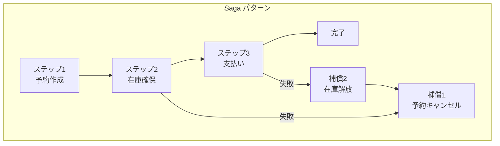

```typescript
interface SagaStep<T> {
  execute: () => Promise<T>;
  compensate: () => Promise<void>;
}

async function executeSaga<T>(steps: SagaStep<T>[]): Promise<T[]> {
  const results: T[] = [];
  const executedSteps: SagaStep<T>[] = [];
  
  try {
    for (const step of steps) {
      const result = await step.execute();
      results.push(result);
      executedSteps.push(step);
    }
    return results;
    
  } catch (error) {
    // 逆順で補償処理を実行
    console.log("Saga failed, executing compensations...");
    
    for (const step of executedSteps.reverse()) {
      try {
        await step.compensate();
      } catch (compensationError) {
        console.error("Compensation failed:", compensationError);
        // 補償の失敗は記録するが続行
      }
    }
    
    throw error;
  }
}

// 使用例
const orderSaga: SagaStep<any>[] = [
  {
    execute: () => createReservation(),
    compensate: () => cancelReservation()
  },
  {
    execute: () => reserveInventory(),
    compensate: () => releaseInventory()
  },
  {
    execute: () => processPayment(),
    compensate: () => refundPayment()
  }
];

try {
  await executeSaga(orderSaga);
  console.log("Order completed successfully");
} catch (error) {
  console.error("Order failed, all steps compensated");
}
```

---

## 18.5 デッドロック

### デッドロックとは

複数の非同期操作が互いの完了を待ち合い、永久に進まなくなる状態です。

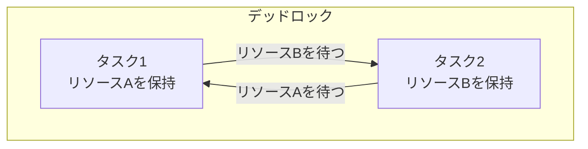

### async/await でのデッドロック

```javascript
// ❌ デッドロックの例
class DeadlockExample {
  constructor() {
    this.lock = new AsyncLock();
  }
  
  async methodA() {
    await this.lock.acquire('lockA');
    try {
      console.log('A: acquired lockA');
      await this.methodB();  // methodB は lockA を待つ → デッドロック
    } finally {
      this.lock.release('lockA');
    }
  }
  
  async methodB() {
    await this.lock.acquire('lockA');  // lockA は methodA が保持中
    try {
      console.log('B: acquired lockA');
    } finally {
      this.lock.release('lockA');
    }
  }
}

// ✅ 再入可能なロックを使用
class ReentrantLock {
  constructor() {
    this.owner = null;
    this.count = 0;
    this.waitQueue = [];
  }
  
  async acquire() {
    const currentTask = getCurrentTask();
    
    if (this.owner === currentTask) {
      this.count++;
      return;
    }
    
    if (this.owner === null) {
      this.owner = currentTask;
      this.count = 1;
      return;
    }
    
    await new Promise(resolve => {
      this.waitQueue.push(resolve);
    });
    
    this.owner = currentTask;
    this.count = 1;
  }
  
  release() {
    this.count--;
    if (this.count === 0) {
      this.owner = null;
      if (this.waitQueue.length > 0) {
        const next = this.waitQueue.shift();
        next();
      }
    }
  }
}
```

### デッドロックの回避策

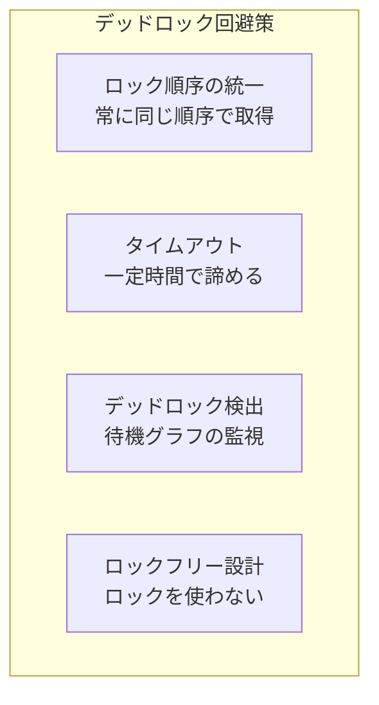

```typescript
// ロック順序の統一
async function transferMoney(fromAccount: Account, toAccount: Account, amount: number) {
  // 常にIDが小さい方を先にロック
  const [first, second] = fromAccount.id < toAccount.id 
    ? [fromAccount, toAccount] 
    : [toAccount, fromAccount];
  
  await first.lock.acquire();
  try {
    await second.lock.acquire();
    try {
      await fromAccount.withdraw(amount);
      await toAccount.deposit(amount);
    } finally {
      second.lock.release();
    }
  } finally {
    first.lock.release();
  }
}

// タイムアウト付きロック
async function acquireWithTimeout(lock: AsyncLock, timeoutMs: number): Promise<boolean> {
  const acquired = await Promise.race([
    lock.acquire().then(() => true),
    sleep(timeoutMs).then(() => false)
  ]);
  
  return acquired;
}

async function safeOperation(lock1: AsyncLock, lock2: AsyncLock) {
  if (!await acquireWithTimeout(lock1, 1000)) {
    throw new Error("Could not acquire lock1");
  }
  
  try {
    if (!await acquireWithTimeout(lock2, 1000)) {
      throw new Error("Could not acquire lock2");
    }
    
    try {
      await doWork();
    } finally {
      lock2.release();
    }
  } finally {
    lock1.release();
  }
}
```

---

## 18.6 レースコンディション

### レースコンディションとは

複数の非同期操作が共有リソースに同時にアクセスし、結果が実行順序に依存してしまう状態です。

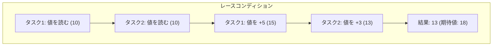

### JavaScript でのレースコンディション

```javascript
// ❌ レースコンディションの例
class Counter {
  constructor() {
    this.value = 0;
  }
  
  async increment() {
    const current = this.value;  // 読み取り
    await someAsyncWork();        // 非同期処理（この間に他が変更する可能性）
    this.value = current + 1;     // 書き込み
  }
}

const counter = new Counter();

// 並行して実行すると期待通りにならない
await Promise.all([
  counter.increment(),
  counter.increment(),
  counter.increment()
]);

console.log(counter.value);  // 期待: 3, 実際: 1, 2, or 3

// ✅ ロックを使用
class SafeCounter {
  constructor() {
    this.value = 0;
    this.lock = new AsyncLock();
  }
  
  async increment() {
    await this.lock.acquire();
    try {
      const current = this.value;
      await someAsyncWork();
      this.value = current + 1;
    } finally {
      this.lock.release();
    }
  }
}
```

### Check-Then-Act のレース

```javascript
// ❌ Check-Then-Act のレースコンディション
async function createUserIfNotExists(username) {
  const exists = await checkUserExists(username);  // チェック
  
  if (!exists) {
    await createUser(username);  // 作成（この間に他が作成する可能性）
  }
}

// ✅ アトミックな操作を使用
async function createUserIfNotExistsSafe(username) {
  try {
    await createUserWithUniqueConstraint(username);
  } catch (error) {
    if (error.code === 'DUPLICATE_KEY') {
      // 既に存在する場合は何もしない
      return;
    }
    throw error;
  }
}

// または楽観的ロック
async function updateWithOptimisticLock(id, updateFn) {
  while (true) {
    const record = await fetchRecord(id);
    const newData = updateFn(record.data);
    
    try {
      await updateRecord(id, newData, record.version);
      return;
    } catch (error) {
      if (error.code === 'VERSION_CONFLICT') {
        // 競合した場合はリトライ
        continue;
      }
      throw error;
    }
  }
}
```

### React でのレースコンディション

```javascript
// ❌ コンポーネントでのレースコンディション
function UserProfile({ userId }) {
  const [user, setUser] = useState(null);
  
  useEffect(() => {
    fetchUser(userId).then(setUser);
    // userId が変わると古いリクエストの結果が後から届く可能性
  }, [userId]);
  
  return <div>{user?.name}</div>;
}

// ✅ クリーンアップで古いリクエストを無視
function UserProfile({ userId }) {
  const [user, setUser] = useState(null);
  
  useEffect(() => {
    let cancelled = false;
    
    fetchUser(userId).then(data => {
      if (!cancelled) {
        setUser(data);
      }
    });
    
    return () => {
      cancelled = true;
    };
  }, [userId]);
  
  return <div>{user?.name}</div>;
}

// ✅ AbortController を使用
function UserProfile({ userId }) {
  const [user, setUser] = useState(null);
  
  useEffect(() => {
    const controller = new AbortController();
    
    fetch(`/api/users/${userId}`, { signal: controller.signal })
      .then(res => res.json())
      .then(setUser)
      .catch(error => {
        if (error.name !== 'AbortError') {
          console.error(error);
        }
      });
    
    return () => controller.abort();
  }, [userId]);
  
  return <div>{user?.name}</div>;
}
```

### レースコンディションの防止策

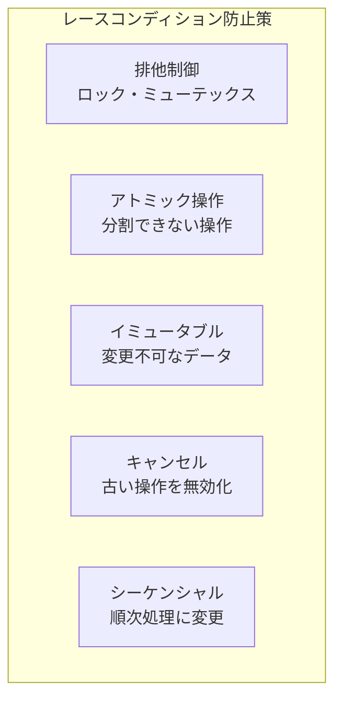

---

## 18.7 エラーハンドリングのベストプラクティス

### 1. エラーの分類

```typescript
// エラーを分類して適切に処理
enum ErrorCategory {
  Operational,  // 予測可能な操作エラー
  Programmer,   // プログラミングミス
  External      // 外部サービスのエラー
}

function categorizeError(error: Error): ErrorCategory {
  if (error instanceof ValidationError) return ErrorCategory.Operational;
  if (error instanceof TypeError) return ErrorCategory.Programmer;
  if (error instanceof NetworkError) return ErrorCategory.External;
  return ErrorCategory.Programmer;
}

async function handleError(error: Error) {
  const category = categorizeError(error);
  
  switch (category) {
    case ErrorCategory.Operational:
      // ユーザーに通知
      showUserFriendlyError(error);
      break;
      
    case ErrorCategory.Programmer:
      // ログを記録してクラッシュレポート
      logError(error);
      reportToCrashService(error);
      break;
      
    case ErrorCategory.External:
      // リトライまたはフォールバック
      await retryOrFallback(error);
      break;
  }
}
```

### 2. コンテキストの追加

```typescript
// エラーにコンテキストを追加
class ContextualError extends Error {
  constructor(
    message: string,
    public readonly context: Record<string, unknown>,
    public readonly cause?: Error
  ) {
    super(message);
    this.name = 'ContextualError';
  }
}

async function fetchUserData(userId: string) {
  try {
    const response = await fetch(`/api/users/${userId}`);
    return await response.json();
  } catch (error) {
    throw new ContextualError(
      `Failed to fetch user data`,
      { userId, timestamp: new Date().toISOString() },
      error as Error
    );
  }
}
```

### 3. グレースフルデグラデーション

```typescript
// 部分的な機能低下で継続
async function getDashboardData() {
  const [users, analytics, notifications] = await Promise.allSettled([
    fetchUsers(),
    fetchAnalytics(),
    fetchNotifications()
  ]);
  
  return {
    users: users.status === 'fulfilled' ? users.value : [],
    analytics: analytics.status === 'fulfilled' ? analytics.value : null,
    notifications: notifications.status === 'fulfilled' ? notifications.value : [],
    // どの機能が利用不可かを表示
    unavailable: [
      users.status === 'rejected' && 'users',
      analytics.status === 'rejected' && 'analytics',
      notifications.status === 'rejected' && 'notifications'
    ].filter(Boolean)
  };
}
```

### 4. エラーバウンダリ

```typescript
// React のエラーバウンダリ
class ErrorBoundary extends React.Component {
  state = { hasError: false, error: null };
  
  static getDerivedStateFromError(error) {
    return { hasError: true, error };
  }
  
  componentDidCatch(error, errorInfo) {
    logError(error, errorInfo);
  }
  
  render() {
    if (this.state.hasError) {
      return <ErrorFallback error={this.state.error} />;
    }
    return this.props.children;
  }
}

// 非同期操作用のエラーバウンダリ
function AsyncBoundary({ children, fallback }) {
  return (
    <ErrorBoundary fallback={fallback}>
      <Suspense fallback={<Loading />}>
        {children}
      </Suspense>
    </ErrorBoundary>
  );
}
```

---

## 18.8 まとめ

この章では、非同期処理のエラーハンドリングについて学びました。

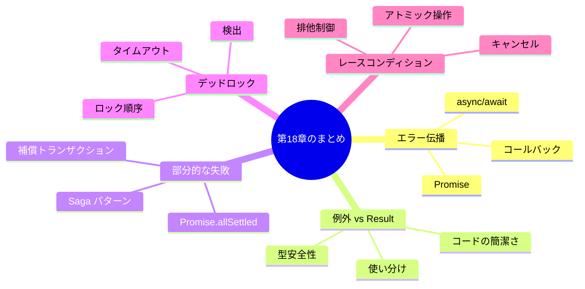

### 重要なポイント

| 課題 | 解決策 |
|------|--------|
| 非同期エラーの伝播 | try-catch、.catch()、グローバルハンドラ |
| 型安全なエラー処理 | Result型、Either型 |
| 部分的な失敗 | Promise.allSettled、Saga パターン |
| デッドロック | ロック順序の統一、タイムアウト |
| レースコンディション | ロック、アトミック操作、キャンセル |

---

## 📝 練習問題

1. **Result型を実装し、それを使って非同期関数のエラーを処理してください。**

2. **Promise.allSettled を使って、複数のAPIリクエストの部分的な失敗を処理するコードを書いてください。**

3. **デッドロックを引き起こすコードを書き、それを修正してください。**

4. **React コンポーネントでのレースコンディションを防ぐ useEffect を実装してください。**

5. **Saga パターンを使って、3ステップの処理と補償処理を実装してください。**

---

## 🔗 次の章へ

[第19章: パフォーマンスとデバッグ](./19-performance-debug.md) では、非同期処理のパフォーマンス最適化とデバッグ技術について学びます。

---

[← 目次に戻る](../index.md) | [← 前章: 非同期処理のパターン](./17-patterns.md)

