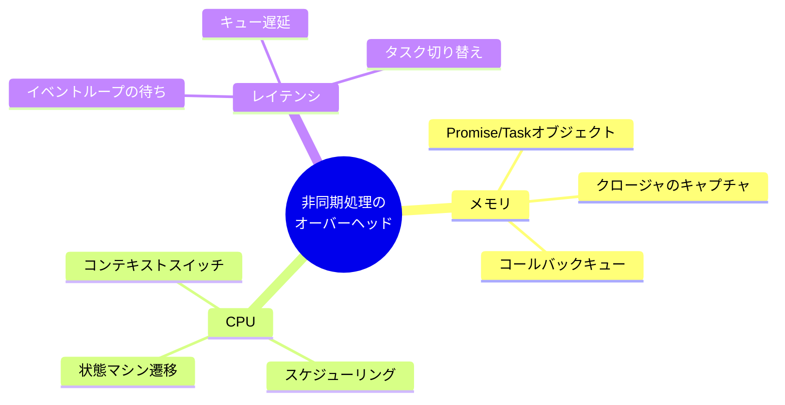
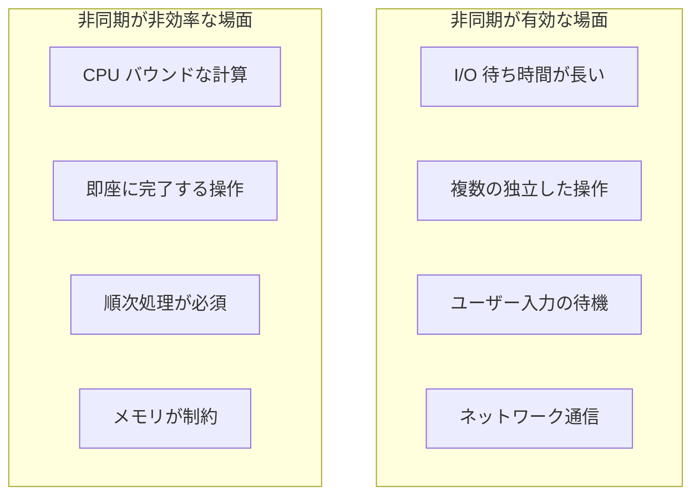
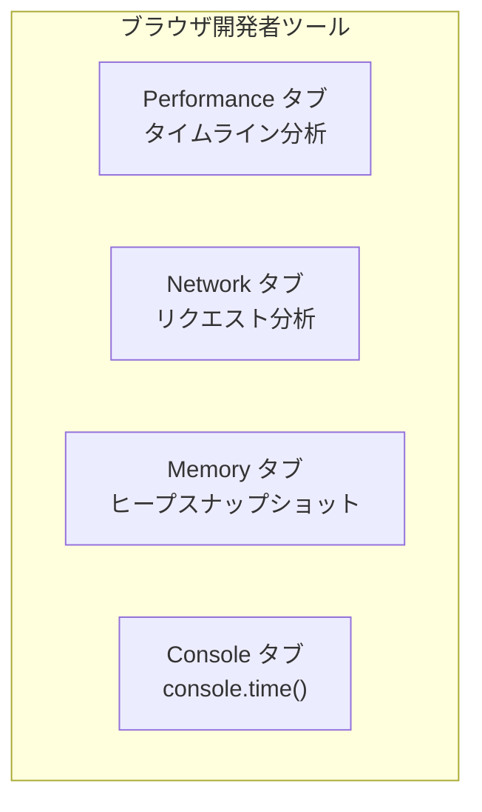
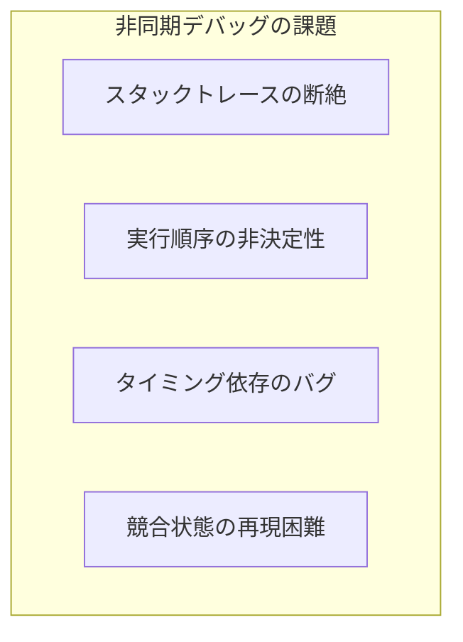
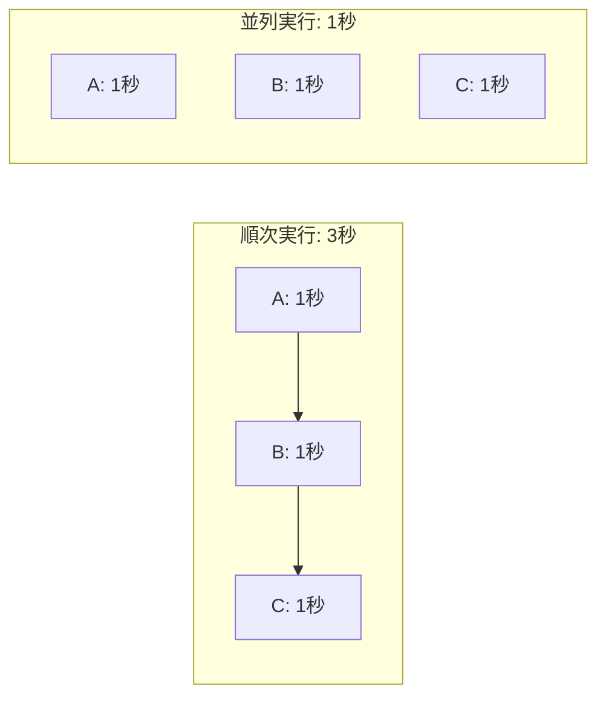
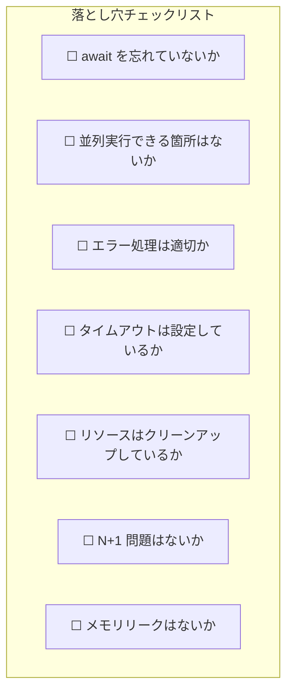
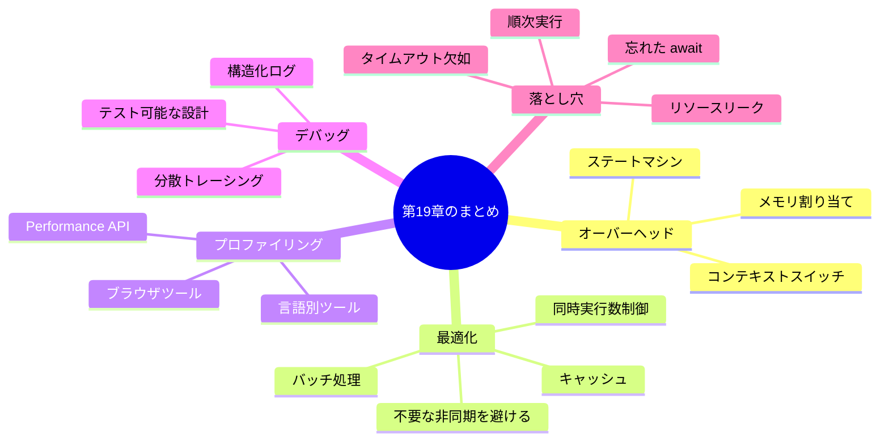

# 第19章: パフォーマンスとデバッグ

> 🎯 **この章の目標**: 非同期処理のオーバーヘッドを理解し、プロファイリング手法とデバッグテクニックを習得し、よくある落とし穴を回避できるようになる

---

## 19.1 非同期処理のオーバーヘッド

### オーバーヘッドの種類

非同期処理は強力ですが、タダではありません。様々なオーバーヘッドが発生します。



### Promise/Task のメモリオーバーヘッド

```javascript
// 各 Promise はヒープにオブジェクトを割り当てる
function createManyPromises() {
  const promises = [];
  
  for (let i = 0; i < 1000000; i++) {
    // 100万個の Promise オブジェクト
    promises.push(new Promise(resolve => {
      setTimeout(() => resolve(i), 0);
    }));
  }
  
  return Promise.all(promises);
}

// 改善: バッチ処理
async function createPromisesInBatches(total, batchSize = 10000) {
  const results = [];
  
  for (let i = 0; i < total; i += batchSize) {
    const batch = [];
    for (let j = i; j < Math.min(i + batchSize, total); j++) {
      batch.push(asyncOperation(j));
    }
    const batchResults = await Promise.all(batch);
    results.push(...batchResults);
  }
  
  return results;
}
```

### async/await のステートマシンオーバーヘッド

```typescript
// コンパイラが生成するステートマシンのイメージ
async function example() {
  const a = await step1();  // 状態1
  const b = await step2(a); // 状態2
  const c = await step3(b); // 状態3
  return c;
}

// 実際には以下のような構造に変換される
// - 状態を保持する構造体
// - 各 await でのサスペンド/レジューム処理
// - ヒープへの状態保存

// 同期で済む場合は同期で
function synchronousAlternative() {
  // すべて同期的に完了する場合はオーバーヘッドなし
  const a = step1Sync();
  const b = step2Sync(a);
  const c = step3Sync(b);
  return c;
}
```

### オーバーヘッドの測定

```javascript
// 同期 vs 非同期のベンチマーク
async function benchmark() {
  const iterations = 100000;
  
  // 同期版
  console.time('sync');
  let syncSum = 0;
  for (let i = 0; i < iterations; i++) {
    syncSum += i;
  }
  console.timeEnd('sync');
  
  // 非同期版（不要な await）
  console.time('async');
  let asyncSum = 0;
  for (let i = 0; i < iterations; i++) {
    asyncSum += await Promise.resolve(i);  // 毎回マイクロタスクに
  }
  console.timeEnd('async');
  
  // 結果: async は sync より数十〜数百倍遅い
}
```

### いつ非同期が有効か



---

## 19.2 パフォーマンス最適化

### 不要な非同期化を避ける

```javascript
// ❌ 不要な非同期化
async function unnecessary() {
  return await Promise.resolve(42);  // 無駄な await
}

// ✅ シンプルに
function simple() {
  return Promise.resolve(42);
}

// ❌ 非同期ループ内での無駄な await
async function slowLoop(items) {
  for (const item of items) {
    await process(item);  // 順次実行（遅い）
  }
}

// ✅ 並列実行
async function fastLoop(items) {
  await Promise.all(items.map(item => process(item)));
}
```

### 同時実行数の適切な制御

```typescript
// ❌ 無制限の並列実行（リソース枯渇）
async function noLimit(urls: string[]) {
  return Promise.all(urls.map(url => fetch(url)));
}

// ✅ 同時実行数を制限
async function withLimit(urls: string[], limit: number = 10) {
  const results: Response[] = [];
  const executing: Promise<void>[] = [];
  
  for (const url of urls) {
    const promise = fetch(url).then(response => {
      results.push(response);
    });
    
    executing.push(promise);
    
    if (executing.length >= limit) {
      await Promise.race(executing);
      // 完了したものを除去
      executing.splice(
        executing.findIndex(p => p === promise),
        1
      );
    }
  }
  
  await Promise.all(executing);
  return results;
}
```

### キャッシュの活用

```typescript
// 非同期結果のキャッシュ
class AsyncCache<K, V> {
  private cache = new Map<K, Promise<V>>();
  private ttl: number;
  
  constructor(ttlMs: number = 60000) {
    this.ttl = ttlMs;
  }
  
  async get(key: K, factory: () => Promise<V>): Promise<V> {
    if (this.cache.has(key)) {
      return this.cache.get(key)!;
    }
    
    const promise = factory();
    this.cache.set(key, promise);
    
    // TTL 後にキャッシュから削除
    setTimeout(() => {
      this.cache.delete(key);
    }, this.ttl);
    
    return promise;
  }
}

// 使用例
const userCache = new AsyncCache<string, User>(30000);

async function getUser(id: string): Promise<User> {
  return userCache.get(id, () => fetchUser(id));
}
```

### バッチ処理とデバウンス

```typescript
// DataLoader パターン（N+1 問題の解決）
class DataLoader<K, V> {
  private batch: K[] = [];
  private scheduled = false;
  private batchFn: (keys: K[]) => Promise<V[]>;
  private resolvers = new Map<K, {
    resolve: (value: V) => void;
    reject: (error: Error) => void;
  }>();
  
  constructor(batchFn: (keys: K[]) => Promise<V[]>) {
    this.batchFn = batchFn;
  }
  
  async load(key: K): Promise<V> {
    return new Promise((resolve, reject) => {
      this.batch.push(key);
      this.resolvers.set(key, { resolve, reject });
      
      if (!this.scheduled) {
        this.scheduled = true;
        // 次のマイクロタスクでバッチ実行
        queueMicrotask(() => this.executeBatch());
      }
    });
  }
  
  private async executeBatch() {
    const keys = [...this.batch];
    this.batch = [];
    this.scheduled = false;
    
    try {
      const values = await this.batchFn(keys);
      
      keys.forEach((key, index) => {
        this.resolvers.get(key)?.resolve(values[index]);
        this.resolvers.delete(key);
      });
    } catch (error) {
      keys.forEach(key => {
        this.resolvers.get(key)?.reject(error as Error);
        this.resolvers.delete(key);
      });
    }
  }
}

// 使用例
const userLoader = new DataLoader<string, User>(async (ids) => {
  // 1回のクエリで複数ユーザーを取得
  return await fetchUsersByIds(ids);
});

// これらは1回のバッチリクエストにまとめられる
const [user1, user2, user3] = await Promise.all([
  userLoader.load("1"),
  userLoader.load("2"),
  userLoader.load("3")
]);
```

### ValueTask / 同期完了の最適化（C#）

```csharp
// 同期完了が多い場合は ValueTask を使用
public ValueTask<int> GetCachedValueAsync(string key)
{
    if (_cache.TryGetValue(key, out var value))
    {
        // ヒープ割り当てなしで同期的に返す
        return new ValueTask<int>(value);
    }
    
    // キャッシュミス時のみ非同期
    return new ValueTask<int>(FetchValueAsync(key));
}
```

---

## 19.3 プロファイリング手法

### ブラウザの開発者ツール



```javascript
// console.time / console.timeEnd
async function profiledOperation() {
  console.time('fetchData');
  const data = await fetchData();
  console.timeEnd('fetchData');  // fetchData: 123.456ms
  
  console.time('processData');
  const result = await processData(data);
  console.timeEnd('processData');
  
  return result;
}

// Performance API
async function measureWithPerformance() {
  performance.mark('start');
  
  await doAsyncWork();
  
  performance.mark('end');
  performance.measure('asyncWork', 'start', 'end');
  
  const measure = performance.getEntriesByName('asyncWork')[0];
  console.log(`Duration: ${measure.duration}ms`);
}

// User Timing API でカスタムメトリクス
async function detailedProfiling() {
  const observer = new PerformanceObserver((list) => {
    list.getEntries().forEach(entry => {
      console.log(`${entry.name}: ${entry.duration}ms`);
    });
  });
  
  observer.observe({ entryTypes: ['measure'] });
  
  performance.mark('api-start');
  await fetch('/api/data');
  performance.mark('api-end');
  performance.measure('API Call', 'api-start', 'api-end');
}
```

### Node.js プロファイリング

```javascript
// async_hooks でコンテキスト追跡
const async_hooks = require('async_hooks');

const contexts = new Map();

const hook = async_hooks.createHook({
  init(asyncId, type, triggerAsyncId) {
    contexts.set(asyncId, {
      type,
      triggerId: triggerAsyncId,
      startTime: Date.now()
    });
  },
  destroy(asyncId) {
    const context = contexts.get(asyncId);
    if (context) {
      const duration = Date.now() - context.startTime;
      if (duration > 100) {
        console.log(`Slow async: ${context.type} took ${duration}ms`);
      }
      contexts.delete(asyncId);
    }
  }
});

hook.enable();
```

```bash
# Node.js の組み込みプロファイラ
node --prof app.js
node --prof-process isolate-*.log > profile.txt

# Chrome DevTools で Node.js をプロファイル
node --inspect app.js
# chrome://inspect でアクセス
```

### Python プロファイリング

```python
import asyncio
import cProfile
import pstats
import io
from functools import wraps

# デコレータでプロファイリング
def profile_async(func):
    @wraps(func)
    async def wrapper(*args, **kwargs):
        pr = cProfile.Profile()
        pr.enable()
        
        try:
            result = await func(*args, **kwargs)
            return result
        finally:
            pr.disable()
            s = io.StringIO()
            ps = pstats.Stats(pr, stream=s).sort_stats('cumulative')
            ps.print_stats(10)
            print(s.getvalue())
    
    return wrapper

@profile_async
async def my_async_function():
    await asyncio.sleep(0.1)
    await do_work()

# asyncio のデバッグモード
asyncio.run(main(), debug=True)

# または環境変数
# PYTHONASYNCIODEBUG=1 python app.py
```

### Rust プロファイリング

```rust
use std::time::Instant;
use tracing::{instrument, info};

// tracing クレートでインストルメンテーション
#[instrument]
async fn my_async_function() {
    let start = Instant::now();
    
    do_work().await;
    
    info!(duration_ms = start.elapsed().as_millis(), "Function completed");
}

// tokio-console で可視化
// Cargo.toml に追加: tokio = { version = "1", features = ["full", "tracing"] }
// console-subscriber = "0.1"

use console_subscriber;

#[tokio::main]
async fn main() {
    console_subscriber::init();  // tokio-console に接続
    
    // アプリケーションコード
}
```

---

## 19.4 デバッグテクニック

### 非同期デバッグの難しさ



### スタックトレースの改善

```javascript
// ❌ 標準の Promise はスタックトレースが切れる
async function buggyCode() {
  await step1();
  await step2();
  await step3();  // ここでエラー → step1, step2 の情報が失われる
}

// ✅ Error.captureStackTrace を活用
class AsyncError extends Error {
  constructor(message, cause) {
    super(message);
    this.cause = cause;
    
    if (Error.captureStackTrace) {
      Error.captureStackTrace(this, AsyncError);
    }
  }
}

async function betterError() {
  try {
    await riskyOperation();
  } catch (error) {
    throw new AsyncError('Operation failed', error);
  }
}

// Node.js: --async-stack-traces フラグ
// node --async-stack-traces app.js
```

### 構造化ログ

```typescript
interface LogContext {
  requestId: string;
  userId?: string;
  operation: string;
  [key: string]: unknown;
}

class AsyncLogger {
  private context: LogContext;
  
  constructor(context: LogContext) {
    this.context = context;
  }
  
  child(additionalContext: Partial<LogContext>): AsyncLogger {
    return new AsyncLogger({
      ...this.context,
      ...additionalContext
    });
  }
  
  log(level: string, message: string, data?: Record<string, unknown>) {
    console.log(JSON.stringify({
      timestamp: new Date().toISOString(),
      level,
      message,
      ...this.context,
      ...data
    }));
  }
  
  info(message: string, data?: Record<string, unknown>) {
    this.log('info', message, data);
  }
  
  error(message: string, error?: Error) {
    this.log('error', message, {
      error: error ? {
        name: error.name,
        message: error.message,
        stack: error.stack
      } : undefined
    });
  }
}

// AsyncLocalStorage で自動的にコンテキストを伝播
import { AsyncLocalStorage } from 'async_hooks';

const asyncLocalStorage = new AsyncLocalStorage<LogContext>();

function getLogger(): AsyncLogger {
  const context = asyncLocalStorage.getStore() || {
    requestId: 'unknown',
    operation: 'unknown'
  };
  return new AsyncLogger(context);
}

async function handleRequest(req: Request) {
  const context: LogContext = {
    requestId: generateId(),
    operation: 'handleRequest'
  };
  
  return asyncLocalStorage.run(context, async () => {
    const logger = getLogger();
    logger.info('Request started', { path: req.url });
    
    await processRequest(req);  // ネストした関数でも同じコンテキスト
    
    logger.info('Request completed');
  });
}
```

### 分散トレーシング

```typescript
// OpenTelemetry 風のトレーシング
interface Span {
  traceId: string;
  spanId: string;
  parentSpanId?: string;
  name: string;
  startTime: number;
  endTime?: number;
  attributes: Record<string, string>;
  events: Array<{ name: string; time: number }>;
}

class Tracer {
  private currentSpan?: Span;
  
  startSpan(name: string): Span {
    const span: Span = {
      traceId: this.currentSpan?.traceId || generateId(),
      spanId: generateId(),
      parentSpanId: this.currentSpan?.spanId,
      name,
      startTime: Date.now(),
      attributes: {},
      events: []
    };
    
    this.currentSpan = span;
    return span;
  }
  
  endSpan(span: Span) {
    span.endTime = Date.now();
    console.log(`Span: ${span.name}`, {
      duration: span.endTime - span.startTime,
      traceId: span.traceId,
      spanId: span.spanId
    });
  }
  
  async trace<T>(name: string, fn: () => Promise<T>): Promise<T> {
    const span = this.startSpan(name);
    
    try {
      const result = await fn();
      span.attributes['status'] = 'ok';
      return result;
    } catch (error) {
      span.attributes['status'] = 'error';
      span.attributes['error'] = (error as Error).message;
      throw error;
    } finally {
      this.endSpan(span);
    }
  }
}

// 使用例
const tracer = new Tracer();

async function handleOrder(orderId: string) {
  return tracer.trace('handleOrder', async () => {
    const order = await tracer.trace('fetchOrder', () => 
      fetchOrder(orderId)
    );
    
    const result = await tracer.trace('processPayment', () => 
      processPayment(order)
    );
    
    return result;
  });
}
```

### デバッガの使用

```javascript
// debugger 文
async function debugMe() {
  const data = await fetchData();
  debugger;  // ここでブレークポイント
  return processData(data);
}

// 条件付きブレークポイント（Chrome DevTools）
// 右クリック → "Add conditional breakpoint"
// 条件: data.status === 'error'

// ログポイント（ブレークせずにログ）
// 右クリック → "Add logpoint"
// メッセージ: "data =", data
```

### テスト可能な非同期コード

```typescript
// 依存性注入でテスト可能に
interface TimeProvider {
  now(): number;
  delay(ms: number): Promise<void>;
}

class RealTimeProvider implements TimeProvider {
  now() { return Date.now(); }
  delay(ms: number) { return new Promise(r => setTimeout(r, ms)); }
}

class MockTimeProvider implements TimeProvider {
  private currentTime = 0;
  
  now() { return this.currentTime; }
  
  async delay(ms: number) {
    this.currentTime += ms;
  }
  
  advance(ms: number) {
    this.currentTime += ms;
  }
}

class RateLimiter {
  constructor(
    private maxRequests: number,
    private windowMs: number,
    private timeProvider: TimeProvider = new RealTimeProvider()
  ) {}
  
  async acquire(): Promise<boolean> {
    // timeProvider を使用
  }
}

// テスト
test('rate limiter', async () => {
  const mockTime = new MockTimeProvider();
  const limiter = new RateLimiter(5, 1000, mockTime);
  
  // 即座に時間を進められる
  mockTime.advance(1000);
});
```

---

## 19.5 よくある落とし穴

### 1. 忘れられた await

```javascript
// ❌ await を忘れる
async function forgotAwait() {
  const promise = fetchData();  // await がない！
  console.log(promise);  // Promise オブジェクトが表示される
  return promise;  // 呼び出し側で問題が発生
}

// ✅ await を付ける
async function withAwait() {
  const data = await fetchData();
  console.log(data);
  return data;
}

// ESLint ルール: @typescript-eslint/no-floating-promises
```

### 2. 順次実行になっている並列実行

```javascript
// ❌ 順次実行（遅い）
async function sequential() {
  const a = await fetchA();
  const b = await fetchB();
  const c = await fetchC();
  return [a, b, c];
}

// ✅ 並列実行（速い）
async function parallel() {
  const [a, b, c] = await Promise.all([
    fetchA(),
    fetchB(),
    fetchC()
  ]);
  return [a, b, c];
}
```



### 3. async void（C#）/ 未処理の Promise

```csharp
// ❌ C#: async void は例外をキャッチできない
async void BadMethod()
{
    await Task.Delay(1000);
    throw new Exception("This won't be caught!");
}

// ✅ async Task を使用
async Task GoodMethod()
{
    await Task.Delay(1000);
    throw new Exception("This can be caught");
}
```

```javascript
// ❌ 未処理の Promise
function fire() {
  fetchData();  // Promise が浮いている
}

// ✅ エラーを処理
async function fireAndHandle() {
  try {
    await fetchData();
  } catch (error) {
    console.error(error);
  }
}

// または明示的に無視
function fireAndForget() {
  fetchData().catch(console.error);
}
```

### 4. ループ内での await

```javascript
// ❌ N+1 問題
async function fetchUsersWithOrders(userIds) {
  const results = [];
  
  for (const id of userIds) {
    const user = await fetchUser(id);
    const orders = await fetchOrders(id);  // 毎回クエリ
    results.push({ user, orders });
  }
  
  return results;
}

// ✅ バッチ処理
async function fetchUsersWithOrdersBatch(userIds) {
  // 並列で取得
  const [users, orders] = await Promise.all([
    fetchUsersByIds(userIds),
    fetchOrdersByUserIds(userIds)
  ]);
  
  // メモリ内で結合
  return users.map(user => ({
    user,
    orders: orders.filter(o => o.userId === user.id)
  }));
}
```

### 5. 無限ループとメモリリーク

```javascript
// ❌ イベントリスナーのリーク
function subscribe() {
  eventEmitter.on('data', async (data) => {
    await process(data);
  });
  // unsubscribe を忘れている
}

// ✅ クリーンアップ
function subscribeWithCleanup() {
  const handler = async (data) => {
    await process(data);
  };
  
  eventEmitter.on('data', handler);
  
  return () => {
    eventEmitter.off('data', handler);
  };
}

// React での例
useEffect(() => {
  const handler = (data) => setData(data);
  eventEmitter.on('data', handler);
  
  return () => {
    eventEmitter.off('data', handler);  // クリーンアップ
  };
}, []);
```

### 6. タイムアウトの欠如

```javascript
// ❌ タイムアウトなし（永久に待つ可能性）
async function noTimeout() {
  const response = await fetch('/api/slow-endpoint');
  return response.json();
}

// ✅ タイムアウトあり
async function withTimeout() {
  const controller = new AbortController();
  const timeoutId = setTimeout(() => controller.abort(), 5000);
  
  try {
    const response = await fetch('/api/slow-endpoint', {
      signal: controller.signal
    });
    return response.json();
  } finally {
    clearTimeout(timeoutId);
  }
}
```

### 7. エラーを握りつぶす

```javascript
// ❌ エラーを握りつぶす
async function swallowError() {
  try {
    await riskyOperation();
  } catch (error) {
    // 何もしない
  }
}

// ✅ 少なくともログを残す
async function logError() {
  try {
    await riskyOperation();
  } catch (error) {
    console.error('Operation failed:', error);
    // 必要に応じて再スロー
    throw error;
  }
}
```

### 8. this の束縛問題

```javascript
// ❌ this が失われる
class Handler {
  constructor() {
    this.value = 42;
  }
  
  async handle() {
    console.log(this.value);  // undefined になる可能性
  }
}

const handler = new Handler();
setTimeout(handler.handle, 1000);  // this が失われる

// ✅ アロー関数またはバインド
class BetterHandler {
  constructor() {
    this.value = 42;
    this.handle = this.handle.bind(this);
  }
  
  async handle() {
    console.log(this.value);
  }
}

// または
class ArrowHandler {
  value = 42;
  
  handle = async () => {
    console.log(this.value);
  };
}
```

### 落とし穴チェックリスト



---

## 19.6 まとめ

この章では、非同期処理のパフォーマンスとデバッグについて学びました。



### 重要なポイント

| カテゴリ | ポイント |
|---------|----------|
| パフォーマンス | 不要な非同期化を避け、並列化できる箇所は並列化 |
| メモリ | 同時実行数を制限し、大量のPromiseを避ける |
| プロファイリング | console.time、Performance API、言語別ツール |
| デバッグ | 構造化ログ、トレーシング、AsyncLocalStorage |
| 落とし穴 | await忘れ、順次実行、リソースリーク、タイムアウト |

---

## 📝 練習問題

1. **Performance API を使って、非同期関数の実行時間を計測するデコレータを実装してください。**

2. **DataLoader パターンを使って、N+1 問題を解決するコードを書いてください。**

3. **AsyncLocalStorage を使って、リクエストIDを自動的に伝播するロガーを実装してください。**

4. **以下のコードの問題点を3つ以上指摘し、修正してください。**
   ```javascript
   async function process(items) {
     for (const item of items) {
       const data = await fetchData(item.id);
       console.log(data);
     }
   }
   ```

5. **メモリリークを引き起こすコードを書き、それを修正してください。**

---

## 🔗 次の章へ

[第20章: 総括と今後の展望](./20-conclusion.md) では、これまで学んだ内容を振り返り、非同期処理の未来について考えます。

---

[← 目次に戻る](../index.md) | [← 前章: エラーハンドリング](./18-error-handling.md)

