# 第20章: 総括と今後の展望

> 🎯 **この章の目標**: これまで学んだ非同期処理の知識を総括し、各モデルの比較、適切な選び方、そして非同期処理の未来について理解する

---

## 20.1 本書で学んだこと

### 学習の旅を振り返る

本書では、非同期処理の基礎から実践まで、体系的に学んできました。

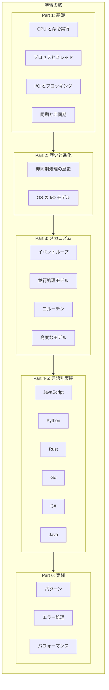

### 核となる概念

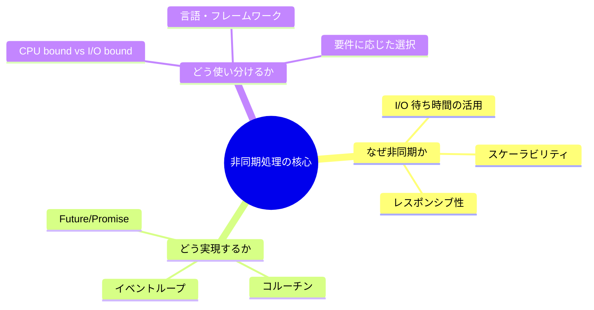

---

## 20.2 各モデルの比較まとめ

### 並行処理モデルの比較

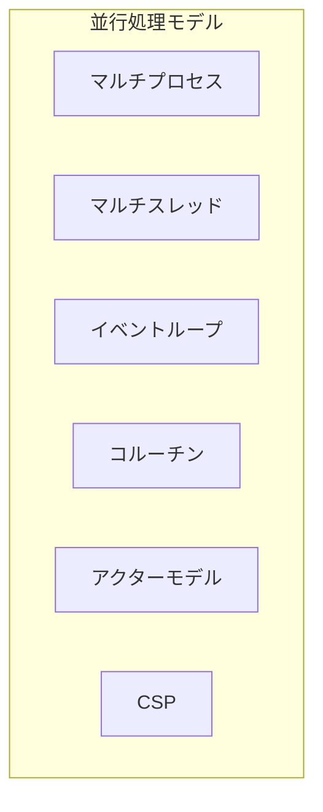

| モデル | メモリ | オーバーヘッド | 適用場面 | 言語例 |
|--------|--------|---------------|----------|--------|
| マルチプロセス | 大 | 大 | CPU集約、障害分離 | Python, Erlang |
| マルチスレッド | 中 | 中 | 並列計算、共有状態 | Java, C++ |
| イベントループ | 小 | 小 | 高並行I/O | Node.js, nginx |
| コルーチン | 小 | 極小 | 非同期I/O | Python asyncio, Rust |
| アクターモデル | 中 | 小 | 分散システム | Erlang, Akka |
| CSP | 中 | 小 | 並行処理 | Go |

### I/O モデルの比較

| モデル | ブロッキング | 複数I/O | 複雑さ | OS サポート |
|--------|-------------|---------|--------|-------------|
| Blocking I/O | する | 不可 | 低 | 全OS |
| Non-blocking I/O | しない | ポーリング | 中 | 全OS |
| I/O Multiplexing | する（select/poll） | 可能 | 中 | 全OS |
| epoll/kqueue | しない | 可能 | 高 | Linux/BSD |
| IOCP | しない | 可能 | 高 | Windows |
| io_uring | しない | 可能 | 高 | Linux 5.1+ |

### 言語別の非同期アプローチ

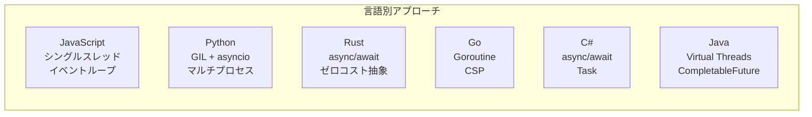

| 言語 | 主な特徴 | 長所 | 短所 |
|------|----------|------|------|
| JavaScript | シングルスレッド + イベントループ | シンプル、Callback地獄からの進化 | CPU集約処理が苦手 |
| Python | asyncio + GIL | 読みやすい構文 | 真の並列処理にはマルチプロセス必要 |
| Rust | ゼロコスト async/await | 高性能、メモリ安全 | 学習曲線が急 |
| Go | Goroutine + Channel | シンプル、高効率 | ジェネリクスの制限（改善中） |
| C# | Task + async/await | 成熟したエコシステム | ランタイムオーバーヘッド |
| Java | Virtual Threads | 既存コードとの互換性 | まだ新しい（Java 21） |

---

## 20.3 適切なモデルの選び方

### 意思決定フローチャート

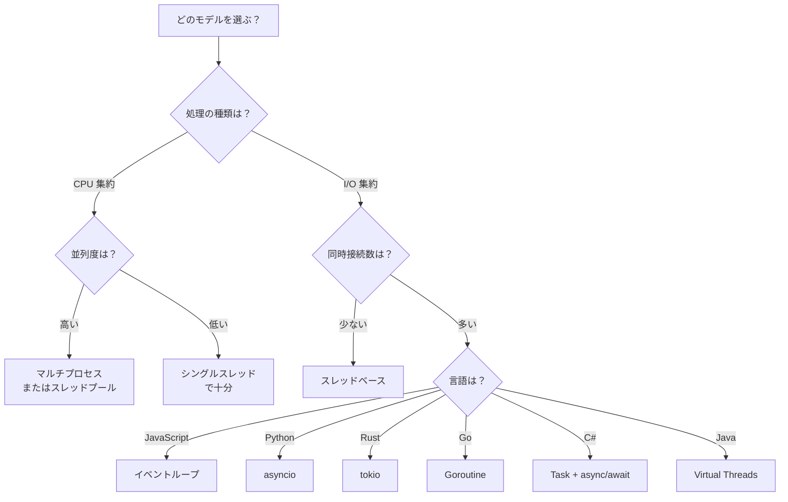

### ユースケース別の推奨

#### 1. Web サーバー

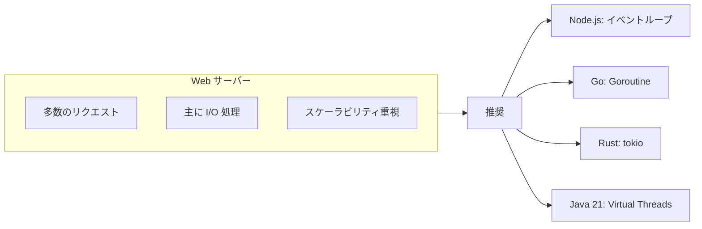

#### 2. データ処理パイプライン

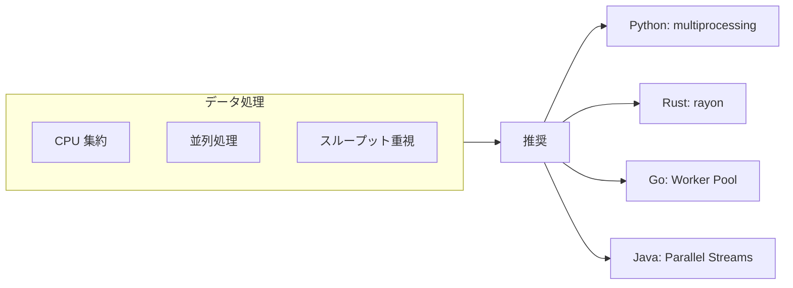

#### 3. リアルタイムシステム

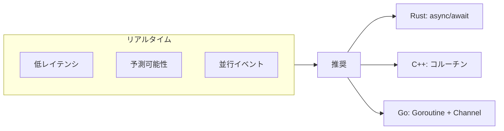

#### 4. 分散システム

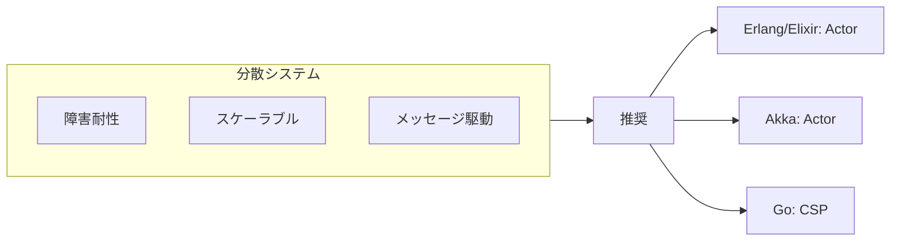

### 選択の判断基準

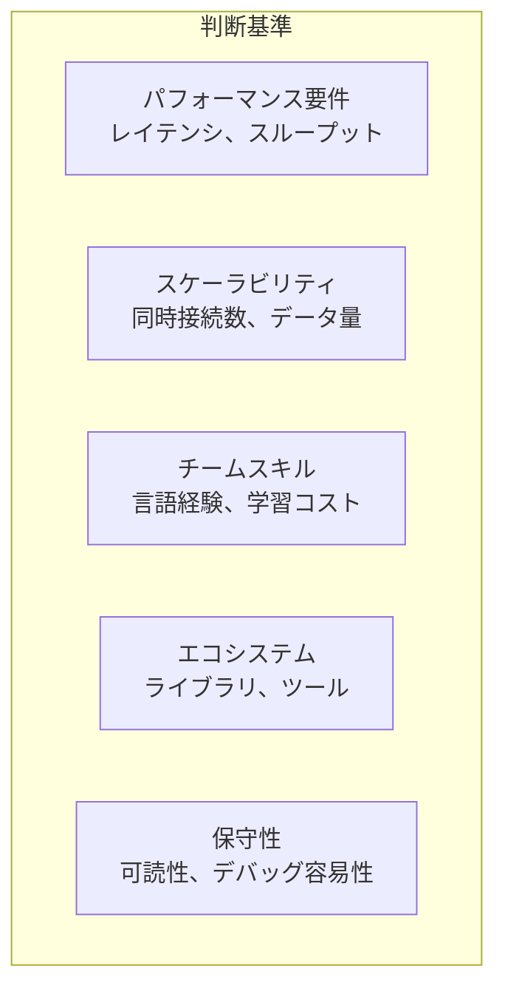

| 基準 | 質問 |
|------|------|
| パフォーマンス | レイテンシの許容範囲は？スループット要件は？ |
| スケーラビリティ | 想定同時接続数は？将来の成長見込みは？ |
| チームスキル | チームが得意な言語は？学習時間は取れるか？ |
| エコシステム | 必要なライブラリはあるか？コミュニティは活発か？ |
| 保守性 | コードは読みやすいか？デバッグしやすいか？ |

---

## 20.4 非同期処理の未来

### 現在のトレンド

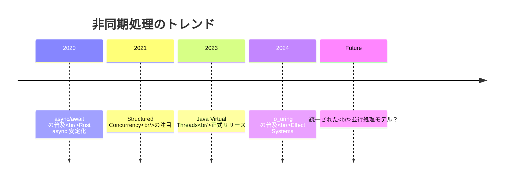

### 1. Structured Concurrency

並行処理のスコープを構造化し、リソースリークや未処理のタスクを防ぐパターンです。

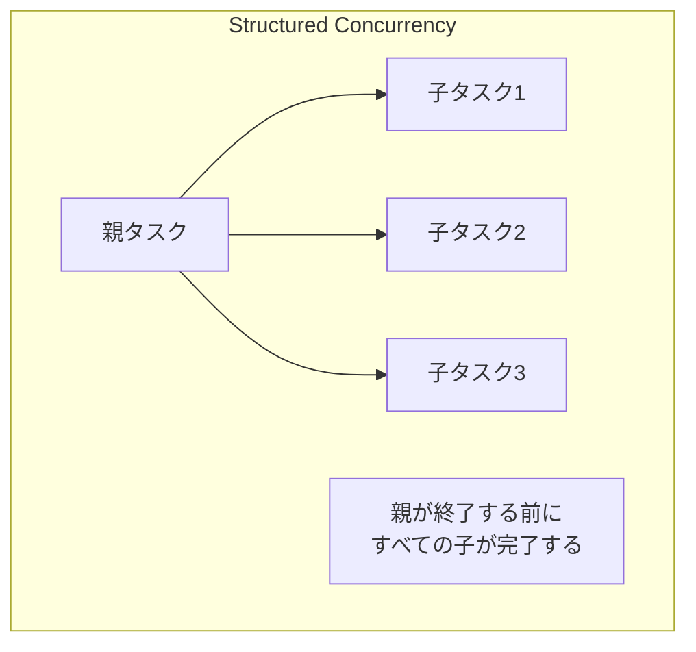

```java
// Java 21 Structured Concurrency
try (var scope = new StructuredTaskScope.ShutdownOnFailure()) {
    Future<User> user = scope.fork(() -> fetchUser(id));
    Future<Order> order = scope.fork(() -> fetchOrder(id));
    
    scope.join();           // すべての子タスクを待機
    scope.throwIfFailed();  // いずれかが失敗したら例外
    
    return new Response(user.resultNow(), order.resultNow());
}
// スコープを出ると、すべてのタスクが完了していることが保証される
```

```swift
// Swift の TaskGroup
await withTaskGroup(of: Data.self) { group in
    for url in urls {
        group.addTask {
            return await fetchData(from: url)
        }
    }
    
    for await data in group {
        process(data)
    }
}
// TaskGroup が終了すると、すべてのタスクが完了
```

### 2. Virtual Threads / Lightweight Threads

OSスレッドを効率的に共有する軽量スレッドの普及が進んでいます。

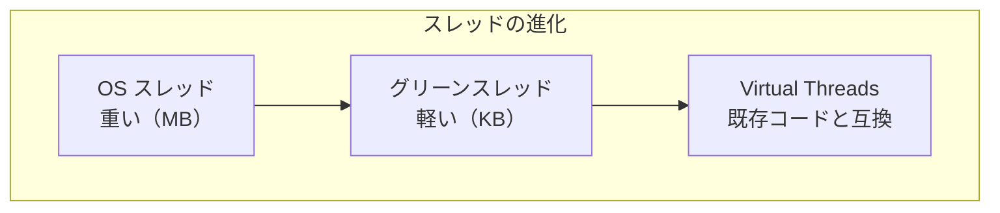

| 言語/ランタイム | 実装 | 状態 |
|-----------------|------|------|
| Go | Goroutine | 成熟 |
| Erlang | Process | 成熟 |
| Java 21 | Virtual Threads | 正式リリース |
| Kotlin | Coroutines | 成熟 |
| Rust | async/await | 成熟 |

### 3. Effect Systems

副作用を型システムで追跡し、より安全な非同期プログラミングを実現します。

```scala
// Scala ZIO / Cats Effect の例
def fetchUser(id: UserId): IO[User] = ???
def saveUser(user: User): IO[Unit] = ???

// 副作用が型で明示される
val program: IO[Unit] = for {
  user <- fetchUser(UserId(1))
  updatedUser = user.copy(name = "New Name")
  _ <- saveUser(updatedUser)
} yield ()

// IO は純粋な記述、run で実行
program.unsafeRunSync()
```

```haskell
-- Haskell の IO モナド
fetchUser :: UserId -> IO User
saveUser :: User -> IO ()

program :: IO ()
program = do
  user <- fetchUser (UserId 1)
  let updatedUser = user { name = "New Name" }
  saveUser updatedUser
```

### 4. io_uring と次世代 I/O

Linux の io_uring は、従来の epoll を超える高性能 I/O を提供します。

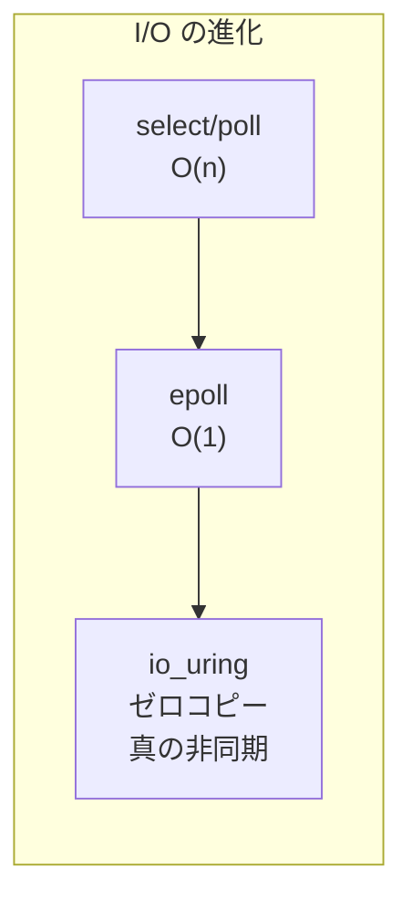

| 特徴 | epoll | io_uring |
|------|-------|----------|
| システムコール | 複数回必要 | 最小限 |
| コピー | あり | ゼロコピー可能 |
| ファイル I/O | 非対応 | 対応 |
| 真の非同期 | 部分的 | 完全 |

### 5. WebAssembly と非同期

WebAssembly が非同期処理をサポートする動きが進んでいます。

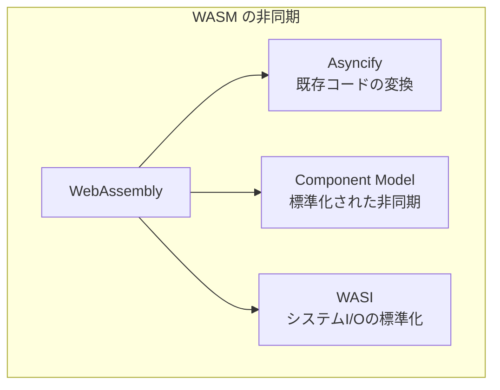

### 予測される未来

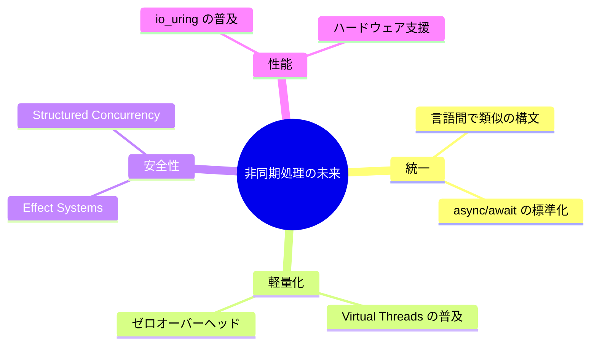

---

## 20.5 学習リソース

### 書籍

| 書籍 | 対象 | 言語 |
|------|------|------|
| "Concurrent Programming in Java" | 中級〜上級 | Java |
| "JavaScript: The Definitive Guide" | 初級〜中級 | JavaScript |
| "Programming Rust" | 中級〜上級 | Rust |
| "Concurrency in Go" | 中級 | Go |
| "Effective Modern C++" | 中級〜上級 | C++ |
| "Seven Concurrency Models in Seven Weeks" | 中級 | 複数言語 |

### オンラインリソース

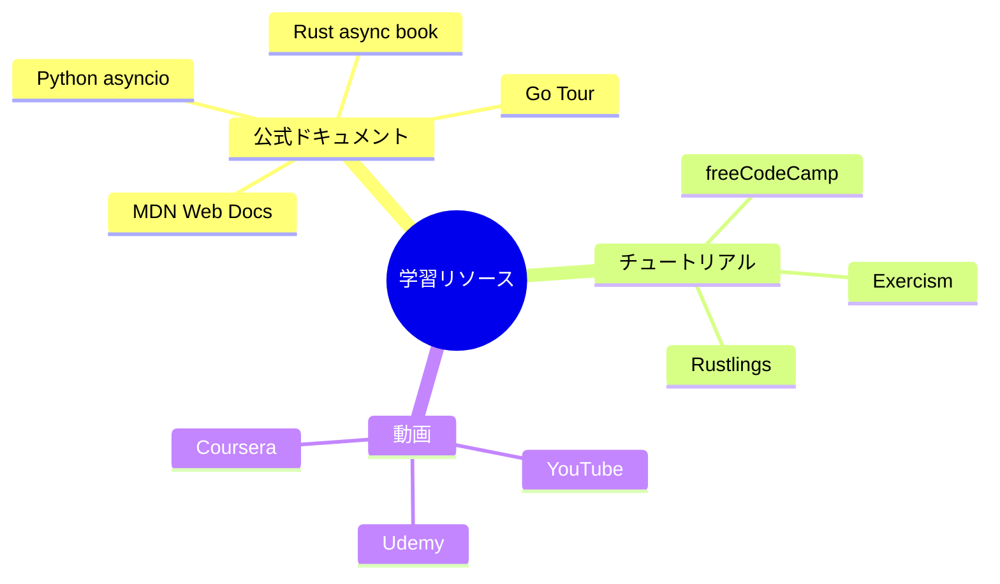

#### JavaScript/TypeScript
- [MDN Web Docs - Asynchronous JavaScript](https://developer.mozilla.org/en-US/docs/Learn/JavaScript/Asynchronous)
- [JavaScript.info - Promises, async/await](https://javascript.info/async)

#### Python
- [Python asyncio documentation](https://docs.python.org/3/library/asyncio.html)
- [Real Python - Async IO](https://realpython.com/async-io-python/)

#### Rust
- [Asynchronous Programming in Rust](https://rust-lang.github.io/async-book/)
- [Tokio Tutorial](https://tokio.rs/tokio/tutorial)

#### Go
- [A Tour of Go - Concurrency](https://tour.golang.org/concurrency)
- [Go by Example](https://gobyexample.com/)

#### C#
- [Asynchronous programming in C#](https://docs.microsoft.com/en-us/dotnet/csharp/async)
- [Stephen Cleary's Blog](https://blog.stephencleary.com/)

#### Java
- [Java Concurrency in Practice](https://jcip.net/)
- [Project Loom](https://openjdk.org/projects/loom/)

### コミュニティ

- Stack Overflow
- Reddit (r/programming, r/rust, r/golang, etc.)
- Discord / Slack コミュニティ
- GitHub Discussions

### 実践プロジェクト

学習を深めるための実践プロジェクトのアイデア：

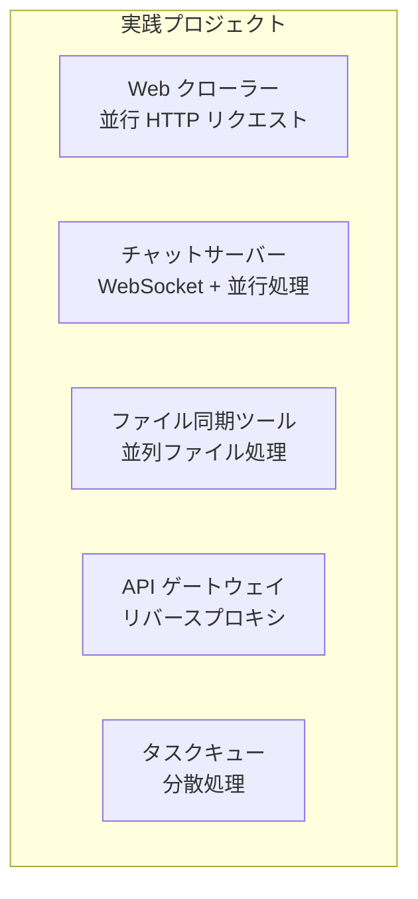

| プロジェクト | 学べること |
|-------------|-----------|
| Web クローラー | 同時実行制御、リトライ、レート制限 |
| チャットサーバー | WebSocket、ブロードキャスト、状態管理 |
| ファイル同期ツール | 並列I/O、進捗報告、エラー処理 |
| API ゲートウェイ | リバースプロキシ、負荷分散、タイムアウト |
| タスクキュー | 分散処理、ワーカー、永続化 |

---

## 20.6 最後に

### 非同期処理マスターへの道

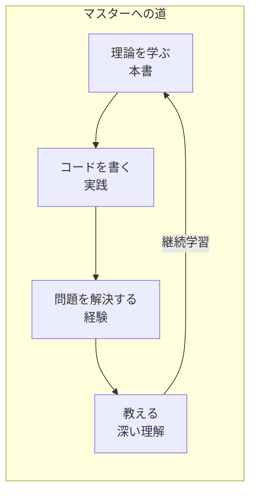

### 心に留めておくべきこと

#### 1. シンプルさを追求する

```
"Make it work, make it right, make it fast."
— Kent Beck

まず動くものを作り、次に正しくし、最後に速くする。
最初から複雑な非同期パターンを使う必要はない。
```

#### 2. 適切なツールを選ぶ

```
"If all you have is a hammer, everything looks like a nail."
— Abraham Maslow

すべてを非同期にする必要はない。
同期処理が適切な場面も多い。
```

#### 3. エラー処理を怠らない

```
"Errors should never pass silently."
— The Zen of Python

非同期処理のエラーは見落としやすい。
明示的に処理することで堅牢なシステムを作る。
```

#### 4. 測定してから最適化する

```
"Premature optimization is the root of all evil."
— Donald Knuth

推測ではなく、測定に基づいて最適化する。
プロファイリングツールを活用する。
```

### 本書のまとめ

本書を通じて、以下のことを学びました：

1. **基礎概念**: CPU、プロセス、スレッド、I/O の仕組み
2. **非同期の歴史**: コールバックから async/await への進化
3. **メカニズム**: イベントループ、コルーチン、Future/Promise
4. **並行処理モデル**: スレッド、アクター、CSP、リアクティブ
5. **言語別実装**: JavaScript, Python, Rust, Go, C#, Java
6. **実践パターン**: エラー処理、リトライ、タイムアウト
7. **パフォーマンス**: 最適化とデバッグの技術

非同期処理は、現代のソフトウェア開発において不可欠なスキルです。本書で学んだ知識を基に、実際のプロジェクトで経験を積み、より深い理解を得てください。

---

## 📝 総合練習問題

本書の内容を確認するための総合問題です。

1. **同期処理と非同期処理の違いを、I/O の観点から説明してください。**

2. **イベントループの動作を図を使って説明してください。**

3. **Promise.all と Promise.allSettled の違いを説明し、それぞれの適切な使用場面を述べてください。**

4. **デッドロックとレースコンディションの違いを説明し、それぞれの防止策を述べてください。**

5. **以下の要件に対して、最適な並行処理モデルを提案し、理由を説明してください。**
   - 10万同時接続のWebSocketサーバー
   - 画像処理パイプライン（CPU集約）
   - マイクロサービス間通信

6. **async/await がステートマシンに変換される仕組みを説明してください。**

7. **Virtual Threads（Java 21）と従来のプラットフォームスレッドの違いを説明してください。**

8. **Structured Concurrency のメリットを、従来の並行処理と比較して説明してください。**

---

## 🎓 修了おめでとうございます

本書を最後まで読み通したあなたは、非同期処理の基礎から実践まで、幅広い知識を身につけました。

これからも学び続け、実践を重ね、より良いソフトウェアを作っていってください。

**非同期処理の世界へようこそ！**

---

[← 目次に戻る](../index.md) | [← 前章: パフォーマンスとデバッグ](./19-performance-debug.md)

