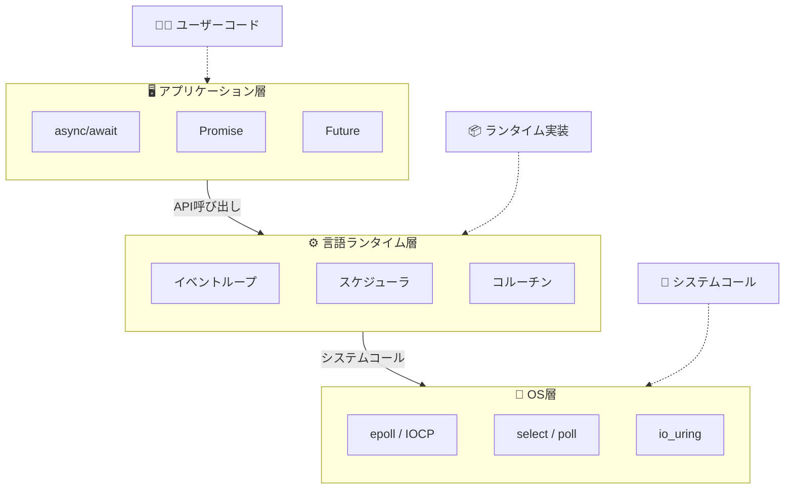

# 非同期処理完全マスターガイド

> 📚 コンピュータの基礎から言語実装まで、非同期処理のすべてを理解する

---

## 📋 目次

### Part 1: 基礎編 - コンピュータはどのようにプログラムを実行するのか
- [第1章: CPUとプログラム実行の仕組み](./chapters/01-cpu-basics.md)
  - フォン・ノイマンアーキテクチャ
  - 命令サイクル（フェッチ・デコード・実行）
  - レジスタとメモリ
  - スタックとヒープ

- [第2章: プロセスとスレッド](./chapters/02-process-thread.md)
  - プロセスとは何か
  - スレッドとは何か
  - コンテキストスイッチの仕組み
  - スケジューリング

- [第3章: I/O操作とブロッキング](./chapters/03-io-blocking.md)
  - I/Oバウンド vs CPUバウンド
  - なぜI/Oは遅いのか
  - ブロッキングとは何か
  - 待ち時間の問題

---

### Part 2: 概念編 - 同期と非同期を理解する
- [第4章: 同期処理と非同期処理](./chapters/04-sync-async.md)
  - 同期処理の定義と特徴
  - 非同期処理の定義と特徴
  - 並行（Concurrent）と並列（Parallel）
  - なぜ非同期処理が必要なのか

- [第5章: 非同期処理の歴史と進化](./chapters/05-history.md)
  - 割り込み（Interrupt）の誕生
  - ポーリングモデル
  - コールバック地獄の時代
  - Promise/Futureの登場
  - async/awaitへの進化

---

### Part 3: 低レイヤー編 - OSと非同期I/O
- [第6章: OSレベルのI/Oモデル](./chapters/06-os-io-models.md)
  - ブロッキングI/O
  - ノンブロッキングI/O
  - I/O多重化（select, poll, epoll, kqueue, IOCP）
  - 非同期I/O（AIO, io_uring）
  - 各モデルの比較と使い分け

- [第7章: イベントループの仕組み](./chapters/07-event-loop.md)
  - イベント駆動プログラミング
  - Reactor パターン
  - Proactor パターン
  - libuv, tokio, asyncio の内部構造

---

### Part 4: 並行処理モデル編
- [第8章: 並行処理の基本モデル](./chapters/08-concurrency-models.md)
  - マルチプロセス
  - マルチスレッド
  - スレッドプール
  - 共有メモリ vs メッセージパッシング

- [第9章: 軽量並行処理](./chapters/09-lightweight-concurrency.md)
  - グリーンスレッド
  - ファイバー
  - コルーチン
  - ジェネレータとイテレータ

- [第10章: 高度な並行処理モデル](./chapters/10-advanced-models.md)
  - アクターモデル（Erlang, Akka）
  - CSP - Communicating Sequential Processes（Go）
  - データフロープログラミング
  - リアクティブプログラミング

---

### Part 5: 言語実装編
- [第11章: JavaScript/TypeScript](./chapters/11-javascript.md)
  - シングルスレッドとイベントループ
  - Callback → Promise → async/await
  - マイクロタスクとマクロタスク
  - Web Workers と Worker Threads

- [第12章: Python](./chapters/12-python.md)
  - GIL（Global Interpreter Lock）
  - threading vs multiprocessing
  - asyncio の仕組み
  - async/await の内部実装

- [第13章: Rust](./chapters/13-rust.md)
  - 所有権と非同期処理
  - Future トレイト
  - async/await とステートマシン
  - tokio と async-std

- [第14章: Go](./chapters/14-go.md)
  - Goroutine の仕組み
  - チャネルと通信
  - select 文
  - M:N スケジューリング

- [第15章: C# / .NET](./chapters/15-csharp.md)
  - Task と Task<T>
  - async/await パターン
  - SynchronizationContext
  - ValueTask とパフォーマンス最適化

- [第16章: Java](./chapters/16-java.md)
  - ExecutorService とスレッドプール
  - CompletableFuture
  - Project Loom と仮想スレッド
  - Reactive Streams

---

### Part 6: 実践編
- [第17章: 非同期処理のパターン](./chapters/17-patterns.md)
  - 並列実行パターン
  - 逐次実行パターン
  - 競争パターン（Race）
  - タイムアウトとキャンセル
  - リトライとバックオフ

- [第18章: エラーハンドリング](./chapters/18-error-handling.md)
  - 非同期エラーの伝播
  - 例外 vs Result型
  - 部分的な失敗への対処
  - デッドロックとレースコンディション

- [第19章: パフォーマンスとデバッグ](./chapters/19-performance-debug.md)
  - 非同期処理のオーバーヘッド
  - プロファイリング手法
  - デバッグテクニック
  - よくある落とし穴

---

### Part 7: まとめ
- [第20章: 総括と今後の展望](./chapters/20-conclusion.md)
  - 各モデルの比較まとめ
  - 適切なモデルの選び方
  - 非同期処理の未来
  - 学習リソース

---

## 📊 図解一覧

本ガイドでは以下のような図解を用いて説明します：

---

## 🎯 このガイドの対象読者

- プログラミング経験があり、非同期処理を深く理解したい方
- 「なぜ非同期処理が必要なのか」から理解したい方
- 複数の言語の非同期処理を比較して学びたい方
- 低レイヤーの仕組みにも興味がある方

---

## 📖 各章へのリンク

| Part | 章 | タイトル | 難易度 |
|------|-----|---------|--------|
| 1 | 1 | [CPUとプログラム実行の仕組み](./chapters/01-cpu-basics.md) | ⭐ |
| 1 | 2 | [プロセスとスレッド](./chapters/02-process-thread.md) | ⭐ |
| 1 | 3 | [I/O操作とブロッキング](./chapters/03-io-blocking.md) | ⭐ |
| 2 | 4 | [同期処理と非同期処理](./chapters/04-sync-async.md) | ⭐ |
| 2 | 5 | [非同期処理の歴史と進化](./chapters/05-history.md) | ⭐⭐ |
| 3 | 6 | [OSレベルのI/Oモデル](./chapters/06-os-io-models.md) | ⭐⭐⭐ |
| 3 | 7 | [イベントループの仕組み](./chapters/07-event-loop.md) | ⭐⭐⭐ |
| 4 | 8 | [並行処理の基本モデル](./chapters/08-concurrency-models.md) | ⭐⭐ |
| 4 | 9 | [軽量並行処理](./chapters/09-lightweight-concurrency.md) | ⭐⭐⭐ |
| 4 | 10 | [高度な並行処理モデル](./chapters/10-advanced-models.md) | ⭐⭐⭐ |
| 5 | 11 | [JavaScript/TypeScript](./chapters/11-javascript.md) | ⭐⭐ |
| 5 | 12 | [Python](./chapters/12-python.md) | ⭐⭐ |
| 5 | 13 | [Rust](./chapters/13-rust.md) | ⭐⭐⭐ |
| 5 | 14 | [Go](./chapters/14-go.md) | ⭐⭐ |
| 5 | 15 | [C# / .NET](./chapters/15-csharp.md) | ⭐⭐ |
| 5 | 16 | [Java](./chapters/16-java.md) | ⭐⭐ |
| 6 | 17 | [非同期処理のパターン](./chapters/17-patterns.md) | ⭐⭐ |
| 6 | 18 | [エラーハンドリング](./chapters/18-error-handling.md) | ⭐⭐ |
| 6 | 19 | [パフォーマンスとデバッグ](./chapters/19-performance-debug.md) | ⭐⭐⭐ |
| 7 | 20 | [総括と今後の展望](./chapters/20-conclusion.md) | ⭐ |

---

## ▶️ 始めましょう

[第1章: CPUとプログラム実行の仕組み](./chapters/01-cpu-basics.md) から読み始めてください。

---

*最終更新: 2024年*

